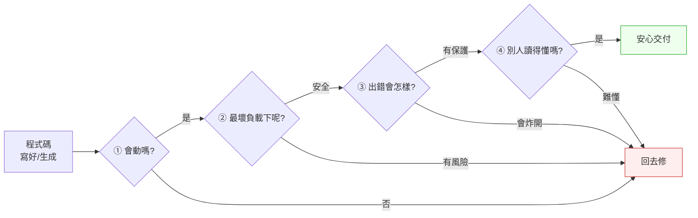

# 第 1 章｜為什麼工程實作需要決策框架
## ⸺ 當「寫出來」變便宜,「判斷對不對」就變貴了

> **前置閱讀**:[序章 ⸺ 當 AI 會寫程式之後,工程師還剩下什麼](../front-matter/00-preface.md)
> **下游章節**:[第 2 章｜讀懂一份陌生程式碼](./ch-02-reading-unfamiliar-code.md)

## 1.1 共感現場:那支「看起來沒問題」的功能

你可能也遇過這樣的一天。

我帶過一個很認真的年輕工程師,就叫他小俊吧。那時他在一家做客服系統的 SaaS 公司 Brightdesk 上班,接到一個不大的任務:幫客戶做一支「批次匯出工單」的功能。他打開 AI 助手,把需求描述了一遍,幾秒鐘後,一段看起來很完整的程式碼就出現在螢幕上。

他讀了一遍,覺得邏輯通順;在本機跑了一下,資料正確;demo 給 PM 看,大家都點頭。於是這支功能順利上線了——又快又順,看起來沒有什麼好不放心的。

這其實是很自然的判斷。東西能跑、測試會過、別人也說好,大多數人都會覺得「這件事做完了」。

可是三天後,事情來了。一個資料量很大的租戶按下匯出,整個資料庫的回應時間突然飆高,連帶影響了其他租戶。團隊緊急查了半天才發現:AI 生成的那段查詢,在資料量小的時候完全正常,但它會**一次把整張表撈出來**,既沒有分頁,也沒有用上租戶層級的索引。

小俊跟我說:「它明明能跑啊。」

這句話沒有錯,但它真正的問題,其實不在他,也不完全在 AI。問題在於——**從頭到尾,沒有人在交付之前,問過那一句話:「它在我們最大的那個租戶身上,會怎麼樣?」**

## 1.2 真正的問題:瓶頸從「寫」移到了「判斷」

我們把這件事慢慢拆開來看,你會發現它其實不是一個粗心的個案,而是這個時代很典型的一種處境。

以前,寫出那段匯出查詢本身,就要花掉小俊不少時間。在那段「慢慢寫」的過程裡,他多半會自然而然地想到:資料多的時候會不會太慢?要不要分頁?於是「寫」這個動作,順便就把一部分「判斷」做掉了。換句話說,過去產出很慢,慢到逼著你一邊做一邊想。

但現在不一樣了。AI 幾秒鐘就把程式碼端上來,**產出快到幾乎不花時間**。這當然是好事,可是它也帶來一個副作用:那段「邊寫邊想」的空檔,消失了。程式碼來得太快,快到你還來不及問問題,它就已經「看起來做完了」。

也就是說,真正在改變的,是工程裡的瓶頸位置。

> 過去:**寫**很慢,慢是瓶頸,而判斷藏在寫的過程裡。
> 現在:**寫**很快,判斷反而變成瓶頸——而且因為東西來得太快,判斷常常被整個跳過。

順著這個道理,我們就能看懂小俊那句「它明明能跑」到底漏了什麼。「能跑」只是判斷裡最低的一層——它回答的是「現在、在我的小資料上,會不會動」。但一個工程師真正該守住的判斷,還包括「在最大的負載下會怎樣」「出錯時會怎樣」「三個月後別人接手看不看得懂」。這些問題,AI 不會主動替你問,因為它只負責產出;**問這些問題、並為答案負責,正是工程師留下來的價值**。

這就是為什麼,在一個 AI 會幫你寫程式的時代,我們反而更需要「決策框架」。框架不是要綁住你,而是當程式碼來得太快、快到你來不及細想的時候,幫你把那幾個「不問會吃虧」的問題,穩穩地接住。

## 1.3 一起做判斷:交付前的四個提問

那麼,該怎麼把「判斷」這件事,變成你每天都做得到、而不是靠運氣的習慣?

我想和你分享一個很簡單的角度。它不複雜,複雜的東西在忙起來的時候不會有人用。它只是四個問題,你可以在任何一段程式碼(不管是你自己寫的,還是 AI 生成的)準備交付前,輕輕問一遍。

我把它叫做「交付前的四問」,順序是有道理的,從「會不會動」一路問到「會不會拖累別人」:

| 提問 | 它在守護什麼 | 對應小俊的案例 |
|---|---|---|
| **① 它會動嗎?** | 基本正確性 | ✅ 本機測試有過 |
| **② 在最壞的資料/負載下呢?** | 規模與邊界 | ❌ 沒問——大租戶就是在這裡出事 |
| **③ 出錯的時候會怎樣?** | 失敗模式 | ❌ 沒問——撈全表沒有保護 |
| **④ 三個月後的人讀得懂、改得動嗎?** | 可維護性 | ⚠️ 沒人讀第二遍 |

你會發現,小俊那次的問題,完全集中在第②和第③個提問上。並不是他能力不夠,而是程式碼來得太快,讓他在還沒走到第②問之前,就以為自己已經做完了。

如果用一張圖來看「交付前的四問」擋在哪裡,大概是這樣:



這張圖想說的,其實只有一件事:**「會動」只是入口,不是終點。** 真正讓你能安心交付的,是後面那三個問題都有了答案。

我想特別提一下第④問,因為它最容易被覺得「不急」。可是你想想,如果連你自己三個月後都要重看半天,那當初省下的時間,其實只是借來的——遲早要連本帶利還回去。順著這個想法,我們在第 5 章談「可讀性」時,會再好好聊它。

但知道了四問的架構,還不等於每次都能做到。接下來的三個「絆倒處」,正是我在第一線最常見到的、讓人跳過其中某一問的模式——先看清楚它們長什麼樣子,下次遇到時才不會又不知不覺踩進去。

## 1.4 容易絆倒的地方

下面這幾個地雷,幾乎每個工程師都踩過。所以這裡不是要提醒你「別犯錯」,而是想讓你下次遇到的時候,心裡有個底。

**絆倒處一:把「能跑」當成「做完」。**
這是最常見、也最自然的一個。demo 過了、測試綠了,大腦就會發出「結案」的訊號。

> 修正方向:把「能跑」在心裡改名叫「通過了第①問」。它是個好的開始,但後面還有三問在等你。

**絆倒處二:因為是 AI 寫的,就更不檢查。**
有時候我們會有一種錯覺:它這麼厲害,應該想得比我周到吧?但 AI 其實不知道「你最大的租戶長什麼樣」,那些脈絡只在你腦袋裡。

> 修正方向:把 AI 生成的程式碼,當成一位很有才華但**不認識你們系統**的新同事交來的——你會 review 新同事的 PR,對吧?那就用同樣的眼光看它。

**絆倒處三:四個問題一次全要,結果一個都沒做。**
如果你覺得「每次都要問四遍好累」,那很正常,累就會放棄。

> 修正方向:忙的時候,至少先問第②問(最壞負載)。線上最痛的事故,很多都栽在這一題;先守住它,其他的可以慢慢補。

## 1.5 帶得走的工具 ⸺ 一頁式「交付前判斷卡」

把上面的四問,變成一張你真的會用的小卡片,它就不會只是道理,而會變成習慣。下面是空白模板,貼在 PR 描述裡剛剛好:

```text
交付前判斷卡 ⸺ {功能名稱}

① 會動嗎?
   - 驗證方式:{你怎麼確認的}

② 最壞負載下呢?
   - 最大的使用者/資料量是:{具體數字}
   - 在那個量下的預期行為:{會不會慢、會不會爆}

③ 出錯會怎樣?
   - 最可能的失敗是:{什麼情況}
   - 失敗時的保護:{有沒有分頁/逾時/重試/降級}

④ 別人讀得懂嗎?
   - 最不直覺的一段是:{哪裡}
   - 已補的說明:{註解/命名/PR 描述}
```

為什麼是一張卡、而且只有四欄?因為判斷的敵人從來不是「不會」,而是「忙起來就跳過」。欄位一多,大家就不填了;少到四欄,你才會真的每次都過一遍。它的目的不是審問你,而是在程式碼來得太快的時候,幫你把那幾個重要的問題穩穩接住。

### 1.5.1 範例:Brightdesk 那支匯出功能,如果當初有這張卡

讓我們回到小俊那支匯出工單的功能。如果交付前他手上有這張卡,事情很可能會在第②問就被擋下來:

```text
交付前判斷卡 ⸺ 批次匯出工單

① 會動嗎?
   - 驗證方式:本機 50 筆工單,匯出 CSV 正確

② 最壞負載下呢?
   - 最大的使用者/資料量是:某企業租戶,約 80 萬筆工單
   <!-- 為什麼這欄:本機的 50 筆永遠不會出事;真正會出事的是線上最大的那個人。
        寫不出這個具體數字也沒關係,這其實是個很自然的提醒:去找營運或 PM 對一下線上規模,問清楚就好。 -->
   - 在那個量下的預期行為:一次撈全表,會拖垮共用資料庫 ⚠️

③ 出錯會怎樣?
   - 最可能的失敗是:大租戶匯出時查詢逾時、影響其他租戶
   <!-- 為什麼這欄:多租戶系統裡,一個人的重操作會波及所有人;
        想清楚「最糟會傷到誰」,才知道需不需要保護。 -->
   - 失敗時的保護:目前沒有 → 應加分頁 + 查詢逾時上限

④ 別人讀得懂嗎?
   - 最不直覺的一段是:查詢沒有租戶索引提示
   - 已補的說明:PR 補一行註解說明為何要分頁
```

你看,問題並不是藏得多深——它就在第②問的那個「80 萬筆」裡。卡片沒有做什麼高深的事,它只是溫柔地逼你,在按下交付之前,先看一眼自己系統裡最大的那個人。很多時候,安心交付和線上事故之間的距離,就只是這一眼而已。

## 1.6 本章回顧

讀完這一章,你應該已經能:

- [ ] 說清楚「會動」只是判斷的第一層,後面還有規模、失敗、可維護三層
- [ ] 理解 AI 時代的瓶頸,已經從「寫程式」移到了「做判斷」
- [ ] 在交付任何程式碼前,過一遍「交付前的四問」
- [ ] 把 AI 生成的程式碼,當成「有才華但不認識你系統的新同事」來 review

如果想先從一件事開始,我會建議 ⸺**忙的時候至少問第②問「最壞負載下呢」**,因為線上最痛的事故,常常就栽在這一題;先守住它,你已經擋掉了一大半的麻煩。

下一章,我們會往前一步:在你能判斷一段程式碼好不好之前,得先**讀得懂**它——尤其是一份你完全沒看過的、別人(或 AI)寫的程式碼。

## Cross-References

- **下一章**:[第 2 章｜讀懂一份陌生程式碼](./ch-02-reading-unfamiliar-code.md) ⸺ 判斷的前提,是先看得懂
- **強連結**:[第 5 章｜可讀性:為下一個人而寫](../part-02-craft/ch-05-readability.md) ⸺ 呼應第④問
- **強連結**:[第 37 章｜審查 AI 生成的程式碼](../part-08-ai-era/ch-37-reviewing-ai-code.md) ⸺ 把四問用在 AI 產出上
- **跨書連結**:[SA/SD Playbook](https://github.com/EddyKuo/sa-sd-playbook) ⸺ 第②問背後的規模設計,屬於系統設計的高度
