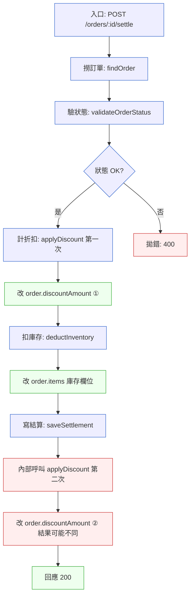

# 第 2 章｜讀懂一份陌生程式碼
## ⸺ 判斷的前提,是先看得懂它

> **前置閱讀**:[第 1 章｜為什麼工程實作需要決策框架](./ch-01-why-engineering-decisions.md)
> **下游章節**:[第 3 章｜開發環境與本機工作流](./ch-03-dev-environment.md)

## 2.1 共感現場:那段「理論上很簡單」的程式碼

你可能也有過這種時刻。

收到一個 bug 單,或者接手別人的 PR,或者被告知「這邊有個問題你去看一下」——然後你打開那個檔案,看了五分鐘,發現自己不知道從哪裡開始。不是程式碼寫得很爛,有時候甚至寫得還滿整齊的。就只是——你不認識它。

這種陌生感,和能力沒什麼關係。程式碼本身只是一堆動詞和名詞,問題是它記錄的是別人腦袋裡的模型,而那個模型你沒有。你讀到的是符號,但你缺少的是背後的世界觀。

我帶過一個叫小雯的工程師,加入電商公司 CartHub 才三個月。有一天,活動結算服務出了一個奇怪的 bug:明明訂單已經完成,折扣金額卻偶爾算錯。小雯接到這個 bug 單,打開程式碼,粗估大概有三四十個函式、好幾個模組,彼此交叉呼叫。她認真讀了一個下午,越讀越迷糊。

後來她跟我說:「我覺得我在讀每一行,但我不知道整件事在做什麼。」

這句話道出了陌生程式碼最難的地方——**你可以讀每一個字,卻看不見它的形狀。** 讀字和讀懂,是兩件不一樣的事。

小雯的困境不是特例。幾乎每個工程師在職涯早期都走過這條路:認真讀、努力讀,但讀完了還是說不清楚它在做什麼。這不是因為她不夠認真,而是因為沒有人告訴她一件事:讀程式碼,和讀文章,需要的方法完全不一樣。

## 2.2 真正的問題:「讀懂」不等於「讀完」

讓我們把這件事慢慢拆開來看。

小雯的方式,是從第一個函式開始往下讀,然後遇到呼叫就跳過去,跳了之後再繼續讀,遇到呼叫再跳。這個方法看起來很合理——它是「線性閱讀」,就像讀一本書從第一頁翻起。問題是,程式碼不是線性的。呼叫關係是一棵樹、甚至一張有環的圖;資料在模組之間流來流去,很多時候沒有一個自然的「起點」。所以線性讀下去,你很快就會迷失在一層又一層的深度裡,忘了你原來在找什麼。

換個角度看,「讀懂程式碼」其實要建立的不是「這行做了什麼」的字面清單,而是一幅地圖——**資料從哪裡來、被誰改過、最後去了哪裡**。只要地圖成形,細節你隨時可以回頭查;但在地圖成形之前,細節只是干擾。

也就是說,讀陌生程式碼的真正難點,不是它有多複雜,而是**你建立地圖的順序錯了**。大多數人直接跳進細節,希望細節讀夠多之後地圖自然浮現——但通常這行不通。人的工作記憶(Working Memory)有限,大約只能同時處理 5–9 個獨立的資訊塊。細節讀得越多,工作記憶越快滿,最後什麼都記不住、也串不起來。

小雯那個下午就是這個症狀的活生生示範:她從 `applyDiscount` 開始讀,跳進去又看到 `calculatePromotionRule`,再跳進去又有 `getActivePromotions` 和 `filterByUserSegment`……讀了快一個小時,她已經完全忘記最初是來追「折扣算錯」這個 bug 的。不是她記性不好,是她的工作記憶早就被第四層、第五層的細節塞滿了,根本沒有位置留給「我原本要找什麼」。

這就帶出了一個自然的問題:有沒有一種順序,可以讓地圖更快成形,而不是靠累積細節來等它浮現?

有的。而且它不複雜。關鍵是三件事要依序來:**先找入口、再追資料流、最後畫心智地圖。** 這三步不是什麼高深的技術——它們只是把「讀」這件事,從「我在讀字」轉換成「我在建地圖」。這個轉換,就是小雯那個下午缺少的東西。

在展開三步之前,先說一件很重要的事:**這三步有順序,不能跳**。每一步的產出,都是下一步的輸入。沒有入口,你不知道你追的是不是主資料流;沒有資料流,你的三行理解就是猜測,不是理解。所以請把三步當成一條走廊,一個房間一個房間走進去。

## 2.3 一起做判斷:三步建立陌生程式碼的地圖

### 第一步:找入口 ⸺ 讓執行流告訴你,這裡在做什麼

入口是任何一段邏輯的起點。找到它,你就知道「這件事從哪裡開始發生」。沒有入口,你看到的每個函式都是浮在空中的——你不知道它在整個流程裡排第幾,也不知道前面是什麼、後面接什麼。

但不同類型的程式碼,入口藏的位置完全不同。HTTP API 服務的入口在路由層,事件驅動系統的入口在消費者,排程任務的入口在 Cron 定義——怎樣才能在一兩分鐘內定位到「對的」入口,而不是一路亂猜亂找?下面這張表可以幫你做到這件事:

| 程式碼類型 | 入口通常在哪裡 | 快速定位方法 |
|---|---|---|
| HTTP API 服務 | 路由定義(router / controller) | 搜尋 `@Get` `@Post` `route(` `router.` |
| 事件驅動 / 消費者 | 訊息消費起點 | 搜尋 `subscribe(` `consume(` `on('message'` |
| 排程任務 | Cron / Job 定義 | 搜尋 `@Cron` `schedule(` `addJob(` |
| CLI 工具 | 命令列解析 | 搜尋 `argv` `commander` `click` `argparse` |
| 純函式庫 | Public API 的 export | 看 `index.ts` / `__init__.py` / `mod.rs` |

找到入口後,有一個很關鍵的原則:**先只讀這一層**。你的任務是看清楚入口層做了哪幾件大事,而不是追進每個呼叫的內部。輸入是什麼?做了哪幾件大事?結果往哪裡送?回答這三個問題,你就拿到了地圖的框架。

以 CartHub 那個活動結算服務為例,小雯搜尋了 `@Post` 關鍵字,很快找到入口:一支 `POST /orders/:id/settle` 的路由。她先只看這個 controller 做了哪幾件大事,得到四個大動作:

1. `validateOrderStatus` — 驗證訂單狀態
2. `applyDiscount` — 計算折扣
3. `deductInventory` — 扣庫存
4. `saveSettlement` — 寫入結算結果

這四件事,就是她地圖的第一層。她還不知道每個函式裡面發生了什麼——但她現在有了骨架。

這裡有一個很常見的衝動值得一提:「這個函式叫 `applyDiscount`,我很好奇它怎麼算折扣,讓我進去看一下。」這個衝動非常自然,但請先忍住。**把好奇心存起來,等地圖畫完了再用**。你現在進去看細節,就是放棄了骨架優先的原則,又回到了線性閱讀的迷宮。細節的門始終開著,等你準備好了再進去。

### 第二步:追資料流 ⸺ 跟著那份「最重要的資料」走

入口給了你骨架,現在我們要給它血肉。這一步的問題很具體:**整個功能裡,哪一份資料被傳來傳去?它從哪裡來、被誰碰過、最後長什麼樣子?**

「最重要的資料」通常在入口層的第一個動作裡就會出現。CartHub 結算服務的第一個動作是「撈訂單」,所以核心資料就是 `order` 物件。找到它之後,往下追每一個「碰了它」的函式。不用讀函式的全部細節——只問一件事:**它改了這份資料的哪個欄位?**

正因為只問這一件事,追資料流的速度可以很快。你不需要懂 `applyDiscount` 裡面的折扣數學,只需要知道「它讀了 `order.items` 並且寫入了 `order.discountAmount`」——這個資訊足夠讓你繼續往下追。

把 CartHub 結算服務的資料流視覺化:



小雯畫出這張圖的時候,有一件事立刻跳出來了:`applyDiscount` 出現了兩次。一次在 controller 層,一次在 `saveSettlement` 的內部。也就是說,折扣金額被計算了兩遍——但為什麼「算兩次」會造成 bug 呢?因為 `applyDiscount` 內部有一段條件式依賴 `order.items[*].inventoryReserved` 這個庫存欄位來決定折扣金額;而中間的 `deductInventory` 恰好改動了這個欄位。也就是說,第一次算的時候庫存還沒扣、第二次算的時候庫存已經扣了,`applyDiscount` 兩次看到的是不同的輸入,自然算出不同的折扣金額。同一個動作做了兩次、中間又有人改了它依賴的狀態——這正是「結果不一致」最典型的成因。兩次計算、不同的中間狀態、不一樣的結果——bug 就藏在這裡。

她不是靠把每一行程式碼都讀完發現這件事的。她是跟著 `order` 物件走,看到「同一個動作做了兩次」,然後問了一個好問題:「為什麼它要算兩次?」這個問題把她直接帶到了問題的根源。

這個方法為什麼有效?因為幾乎所有的 bug,都是「某份資料在某個時刻變成了不對的值」。你追的是資料的變化歷程,bug 就自然會暴露在你的視野裡。相反的,如果你從邏輯入手——「這段折扣條件式的意思是什麼?」——你很容易被細節吸走,讀了很久卻沒有方向。

追完資料流之後,你腦袋裡應該有一幅清楚的圖:核心資料物件從哪裡誕生、誰改了它的哪個欄位、它最後停在哪裡。這個圖不需要很精確——「夠用」就好。你的目標是方向感,不是完整性。

### 第三步:畫心智地圖 ⸺ 把地圖變成你能講出來的東西

前兩步讓你在腦袋裡有了圖。第三步是把它寫下來——不是為了文件,而是為了驗證你真的懂了。

這一步看起來好像在浪費時間,但它其實是最省時間的一步。「我覺得我懂了」和「我能講出來」是兩件事。很多時候你以為自己懂了,但要你描述的時候,說到一半就卡住了——那個卡住的地方,就是你的地圖還有洞的地方。與其在修改程式碼的時候才發現洞在哪裡,不如在這一步就找出來。

一個好用的格式是「三行理解法」:

```
這段程式碼負責做：{一句話說清楚它的職責}
它的主要輸入是：{哪幾種資料/狀態}
它對這些輸入做了什麼，並輸出/副作用是：{轉換或改變了什麼}
```

如果你能用這三行說清楚某個函式或某個模組,代表你真的懂它。如果說不清楚,代表地圖還有洞——值得你回去填,而不是假裝它不存在。

三行說清楚之後,你還有一個額外的收穫:**你現在可以向任何人解釋這段程式碼**。在 code review 的時候、和 PM 討論 bug 的時候、或者交接給下一個人的時候,你都不會說「這個……有點複雜,一時說不清楚」。你有三行,三行就夠了。

這三步的完整流程,整理成一張判斷表:

| 步驟 | 你在問的問題 | 需要的時間 | 何時停止 |
|---|---|---|---|
| **① 找入口** | 這件事從哪裡開始? | 5–15 分鐘 | 能列出 3–5 個「大動作」 |
| **② 追資料流** | 最重要的那份資料,誰碰了它? | 15–30 分鐘 | 能畫出一張完整的流程圖 |
| **③ 畫心智地圖** | 我能不能用三行說清楚? | 10 分鐘 | 三行說得出來 |

總投入大約 30–50 分鐘,你就會有一張「夠用的地圖」。這不是說你讀完了所有細節——而是說,你有了方向感,剩下的細節可以按需查。

### 三步法的另一個場景:審查別人的 Pull Request

學會三步法之後,你可能會發現它在另一個場景也很好用:PR 審查(Code Review)。

想像一下:你是審查者,面前是一個 diff,改了 8 個檔案、300 行。從哪裡開始看?很多工程師的習慣是從 GitHub diff 頁面的第一個檔案往下翻——這其實就是「線性閱讀」的 PR 版,非常容易迷失在細節裡,看了很久還是不確定這個 PR 改了什麼最關鍵的事。

順著三步法的邏輯,審查 PR 的順序可以這樣走:

**① 找入口(這個 PR 改動了什麼功能的入口?)** → **② 追資料流(新增或修改了哪個核心物件的處理路徑?)** → **③ 畫心智地圖(三行說清楚這個 PR 做了什麼、影響了什麼)**

用另一個具體例子來說明。假設有一個 PR 修改了 CartHub 的訂單退款功能。與其從 diff 第一個檔案開始看,可以這樣做:

第一步,在 PR 描述裡找「這個 PR 的入口是哪裡」。如果 PR 描述根本沒說清楚入口在哪裡——這本身就是第一個審查意見:請描述入口在哪裡、這個改動是從什麼觸發點開始的。一個無法說清楚入口的 PR 描述,通常代表作者自己也還沒完全理清思路。

第二步,找到入口之後,追「退款金額」這個核心資料:誰計算它、誰把它寫進 DB、誰把它傳給第三方金流服務。只要追這一條線,你就能判斷這個 PR 的影響範圍有多大。

第三步,三行說清楚:這個 PR 讓退款金額的計算邏輯從 `calculateRefund` 函式移到了 `RefundService` 類別,主要輸入是 `order.id` 和 `refundReason`,副作用是在 `refunds` 表新增一筆記錄並觸發金流退款 API 呼叫。

這樣審下來,你不只知道「改了什麼」,你知道「這個改動的重量級是什麼」——是小範圍的邏輯調整,還是動到了核心資料流的走向。這個判斷,才是 code review 真正要做到的事。

三步法幫你建立的是「流程感」而不是「行號感」,所以它在 bug 追查和 PR 審查這兩個場景都有效。只要你面對的是你不熟悉的程式碼邏輯,三步法就有作用。

## 2.4 容易絆倒的地方

下面幾個地雷,幾乎每個工程師在讀陌生程式碼的早期都會遇到。提出來,不是說你這樣做不對,而是因為這些地雷從來沒有人好好說清楚——大家都踩過,只是很少有人把它整理出來告訴下一個人。

**絆倒處一:一開始就想讀懂所有細節。**

遇到一個函式就跳進去,跳進去之後又遇到另一個呼叫再跳,很快就迷失在好幾層的深度裡,忘了原來在找什麼。這是最普遍的地雷,幾乎人人都踩過。

§2.2 提過的那個下午就是活生生的例子:小雯一路跳進 `calculatePromotionRule`、`getActivePromotions`、`filterByUserSegment`,讀了快一個小時,完全忘了自己最初是來追折扣算錯的 bug 的。

這個地雷的根源是「邊讀邊解析細節」——你在嘗試同時做兩件事:建立地圖、和理解每個格子裡的內容。這兩件事都要做,但不能同時做。

> 修正方向:先允許自己「暫時不懂」某個函式的內部。在入口層,先把每個函式當成黑盒子:它收什麼輸入、吐什麼輸出。等地圖的骨架畫出來之後,你知道哪個函式最值得鑽進去,效率就高很多。暫時的「不懂」是戰術,不是放棄。

**絆倒處二:認為「讀懂」等於「讀完」。**

把整個程式碼從頭讀到尾,希望讀完之後自然就懂了——然後發現讀了兩個小時還是沒有方向。這個模式最大的問題是:你讀的每一行幾乎都是在「處理細節」,但你的大腦一直在嘗試「建立結構」——這兩件事同時進行,會讓工作記憶快速超載。到最後,你記住了一些片段,但它們彼此之間沒有連結。

這個地雷特別容易在你「有點熟悉這個技術領域」的時候出現。你認識 TypeScript,認識 NestJS,於是你覺得「讀懂這段程式碼」只是時間問題——然後你開始讀,越讀越多,越讀越複雜。

> 修正方向:讀陌生程式碼的目標不是「讀完」,而是「地圖成形」。地圖成形了,你才知道去哪裡找答案。剩下沒讀的部分,讓問題帶你去——是追 bug 就讓 bug 帶,是審查 PR 就讓 PR 的意圖帶。

**絆倒處三:在還沒找到入口之前就開始追邏輯。**

有時候你憑直覺覺得某個函式「看起來很重要」,就從那裡開始讀——然後發現它其實在某個邊緣分支才會被呼叫,不是主流程。你讀了半個小時,結果讀的是個次要路徑。

這種情況很常見,尤其是當你用關鍵字搜尋的時候。你搜 `discount`,跳到第一個搜尋結果,開始讀——但關鍵字搜到的地方不一定是主路徑,它可能是一個輔助函式,也可能是測試檔案裡的一個字串。

> 修正方向:入口是整張地圖的錨點。沒有它,你看到的每個函式都是浮在空中的。即使你有強烈的直覺說「從這裡開始」,也值得先花五分鐘確認:「這個函式在整個流程裡排在哪裡?它在正常情況下會被呼叫到嗎?」五分鐘的確認,能省去半小時讀錯地方的時間。

**絆倒處四:把「我看完了」和「我懂了」當成同一件事。**

讀完之後,如果有人問你「這段程式碼在做什麼」,你卻說不清楚——那你其實還沒懂。這很正常,不是你的問題,只是第三步(畫心智地圖)還沒做。

這個地雷特別隱蔽,因為它藏在一種「熟悉的感覺」裡。你讀完了,每一行你都看過了,你感覺「好像懂了」——但這個感覺其實是「我對這些符號不再陌生了」,不是「我建立了地圖」。這兩件事差距很大。

> 修正方向:讀完之後,試著對自己說一遍「這段程式碼負責做……它的輸入是……它的輸出是……」。說不出來的地方,就是你還需要多看一眼的地方。如果三行全說得出來,你真的懂了;如果卡在第二行,就回去補資料流那一層。

**絆倒處五:「還不確定的地方」留白,以為那表示全懂了。**

用任何一種筆記方式讀程式碼的時候,「還不確定的地方」那一欄最容易留空著。不是因為你全懂了,而是因為你沒有刻意去問自己:「我對哪個地方還說不清楚?」

這個地雷的後果是:你以為自己理解完整,結果在修改程式碼的時候動到了一個你以為懂、其實沒懂的部分。小雯在第二天重新讀的時候,在「還不確定的地方」填入了一個問題:「`saveSettlement` 為什麼需要再算一次折扣?」——這個問題帶她去看了 `saveSettlement` 的實作,才確認了 bug 的根因。如果她沒有這一欄,她可能就停在「啊,它算了兩次」,但不確定那是不是問題、又不敢貿然下結論。

> 修正方向:每次讀完程式碼,花兩分鐘問自己:「我對這段程式碼,有沒有什麼地方還說不清楚?」有的話寫下來。「還不確定的地方」留白,不代表你全懂了——代表你還沒誠實地問自己。

## 2.5 帶得走的工具 ⸺ 一頁式「陌生程式碼閱讀筆記」

三行理解法是用來「檢驗」自己是否真懂一個模組;而接下來這份完整的筆記模板,則是用來「記錄」你整個閱讀流程——包括入口、資料流、最終的三行理解,以及你還不確定的地方。三行是驗證,筆記是交接;一個瘦身,一個完整。也就是說,三行理解法通常會被寫進筆記的第③區塊,而不是取代整份筆記。

讀陌生程式碼不只是腦袋裡的活動。把它寫下來有兩個具體的好處:第一,寫下來才知道自己哪裡還沒懂(第三步的作用);第二,下次有人問你、或者你需要交接,你手上有東西可以分享——不用從頭把記憶整理一遍。

下面是一份可以直接貼進筆記或 PR 留言的空白模板:

```text
陌生程式碼閱讀筆記 ⸺ {模組/功能名稱}

閱讀日期：{YYYY-MM-DD}
程式碼位置：{檔案路徑或 PR 連結}

① 入口
   路由/觸發點：{入口是哪個函式或路由}
   這件事的起點：{它做的第一件大事}
   涉及的主要大動作（3–5 個）：
     - {動作 1}
     - {動作 2}
     - {動作 3}

② 資料流
   核心資料物件：{被傳來傳去的那份資料叫什麼}
   來源：{從哪裡拿到它}
   被誰碰過（依序）：
     - {函式 A} → 改了 {哪個欄位/做了什麼}
     - {函式 B} → 改了 {哪個欄位/做了什麼}
   最終狀態：{這份資料最後去了哪裡/長什麼樣}

③ 心智地圖（三行理解）
   這段程式碼負責做：{一句話}
   主要輸入：{哪幾種資料或狀態}
   輸出或副作用：{改變了什麼，或回傳什麼}

④ 還不確定的地方
   - {哪個函式我還沒讀懂}
   - {哪個邏輯分支不確定什麼時候走}
```

這四個區塊不是隨意設計的,它們對應了本章三步法的完整反思過程:①入口讓你確認「從哪裡開始」,②資料流讓你系統地追「誰改了什麼」,③心智地圖讓你驗證「我真的懂了嗎」。而第四個區塊——④還不確定的地方——是整張筆記最有誠意的部分。讀陌生程式碼最常見的陷阱,不是「我不懂」,而是「我以為我懂但其實沒有」。把不確定的地方寫出來,是對自己誠實的一種方式,也是讓下一步有方向的起點。

### 2.5.1 範例:CartHub 活動結算服務

小雯用一個下午的線性閱讀走進了迷宮;第二天,她帶著這張筆記重新來過,從頭用三步法走一遍。下面是她那天填完的版本——每個欄位的旁邊,我加了一個小括號說明她當時為什麼在這裡停下來、問了什麼問題。

```text
陌生程式碼閱讀筆記 ⸺ CartHub 活動結算服務

閱讀日期：2026-06-10
程式碼位置：src/modules/settlement/settlement.controller.ts

① 入口
   路由/觸發點：POST /orders/:id/settle
   這件事的起點：收到請求後,先從 DB 撈對應訂單
   ← 知道它是 HTTP 路由,代表觸發條件是外部請求;
     這影響後面要問的問題:「什麼情況下它會被觸發兩次?」

   涉及的主要大動作（3–5 個）：
     - 驗證訂單狀態(validateOrderStatus)
     - 計算折扣(applyDiscount)       ← 這裡呼叫了一次
     - 扣庫存(deductInventory)
     - 寫入結算結果(saveSettlement)  ← 這裡內部又呼叫了一次 applyDiscount

② 資料流
   核心資料物件：order(Order 型別)
   來源：OrderRepository.findById(id)

   被誰碰過（依序）：
     - validateOrderStatus → 讀 order.status,狀態不對就拋錯
     - applyDiscount → 改 order.discountAmount(第一次計算)
       ← 「誰改了這個欄位」是追 bug 最快的切入點;
         列出來之後,一眼就看到「這個欄位被改了不只一次」
     - deductInventory → 改 order.items[*].inventoryReserved
     - saveSettlement → 呼叫 applyDiscount 再算一次
                     → 改 order.discountAmount(第二次!)

   最終狀態：order 連同 settlement 記錄寫入 DB

③ 心智地圖（三行理解）
   這段程式碼負責做：把一筆已完成的訂單結算,算出最終折扣金額並寫入結算表
   主要輸入：訂單 ID、訂單當前狀態、活動折扣規則
   輸出或副作用：settlement 記錄寫入 DB、order.discountAmount 更新

④ 還不確定的地方
   - saveSettlement 為什麼需要再呼叫一次 applyDiscount?
     (可能是因為它要把折扣金額存進 settlement,但為什麼不直接傳入已計算好的值?)
   - applyDiscount 裡面有一段條件式依賴 order.items[*].inventoryReserved,
     deductInventory 改完庫存之後,折扣金額可能和第一次計算的不同嗎?
     (這很可能就是 bug 的根源 — 需要進去確認)
```

你看,小雯不是讀完了才發現問題的。她在填「被誰碰過」那一欄的時候,就已經注意到 `applyDiscount` 被呼叫了兩次——那個字眼出現在清單裡第二遍的時候,她停下來,問了一個好問題:「為什麼它要算兩次?」這個問題,把她直接帶向了 bug 的根源。

整張筆記沒有什麼魔法,它只是幫你把閱讀的過程,從「線性掃字」變成「邊讀邊建地圖」。地圖建起來了,問題自然就浮出來了。

## 2.6 本章回顧

讀完這一章,你應該已經能:

- [ ] 說清楚「讀完」和「讀懂」的差別:一個是字面清單,一個是資料流地圖
- [ ] 用三步法(找入口 → 追資料流 → 畫心智地圖)讀任何一段陌生程式碼,30–50 分鐘內得到「夠用的地圖」
- [ ] 在入口層把函式當黑盒子,先看「收什麼、吐什麼」,再決定要不要進去
- [ ] 用「三行理解法」快速驗證自己有沒有真的懂一個模組
- [ ] 把三步法用在 PR 審查上:先找入口,再追核心資料流的改動,再三行說清楚這個 PR 做了什麼
- [ ] 誠實地填寫「還不確定的地方」,讓不確定成為下一步的方向,而不是迴避的藉口

如果想先從一件事開始,建議你下次讀陌生程式碼,先花五分鐘找入口——入口是整張地圖的錨點;有了它,後面的資料流才知道從哪裡追起。很多時候那五分鐘省下的,是後來一個下午的迷失。

下一章,我們會往前走一步:在你讀得懂程式碼、也能判斷它對不對之後,如何讓你本機的開發環境,不再成為「東西在我這裡可以跑」的藉口。

## Cross-References

- **上一章**:[第 1 章｜為什麼工程實作需要決策框架](./ch-01-why-engineering-decisions.md) ⸺ 判斷的前提,是先讀得懂
- **下一章**:[第 3 章｜開發環境與本機工作流](./ch-03-dev-environment.md) ⸺ 讀懂之後,讓環境不再是藉口
- **強連結**:[第 6 章｜可讀性:為下一個人而寫](../part-02-craft/ch-06-readability.md) ⸺ 反過來看:你寫的程式碼,別人也要能三步讀懂
- **強連結**:[第 28 章｜向下穿透抽象層](../part-06-operations/ch-28-penetrating-abstraction.md) ⸺ 讀陌生程式碼的進階版:當抽象層擋住你的時候
- **強連結**:[第 38 章｜審查 AI 生成的程式碼](../part-08-ai-era/ch-38-reviewing-ai-code.md) ⸺ AI 寫的程式碼,用三步讀懂它
- **跨書連結**:[SA/SD Playbook](https://github.com/EddyKuo/sa-sd-playbook) ⸺ 系統設計高度的模組切分,決定了 RD 要讀的是什麼樣的邊界
