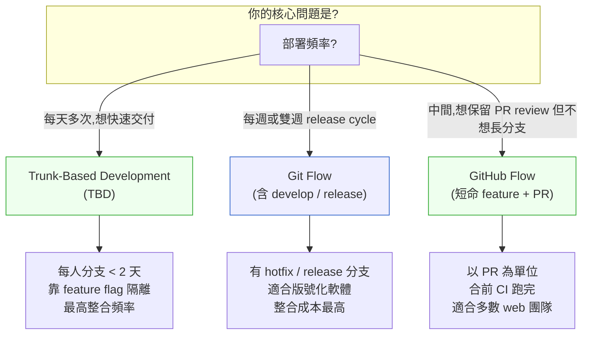

# 第 4 章｜版本控制策略
## ⸺ 分支開得越多,不代表合作得越好

> **前置閱讀**:[第 3 章｜開發環境與本機工作流](./ch-03-dev-environment.md)
> **下游章節**:[第 6 章｜可讀性:為下一個人而寫](../part-02-craft/ch-06-readability.md)、[第 17 章｜Code Review:看什麼、怎麼給回饋](../part-04-collaboration/ch-17-code-review.md)

---

## 4.1 共感現場:merge 到哭,卻不知道為什麼

你可能也有過這種星期一早上。

我帶過一個叫小芸的工程師,在一家做電商平台的公司「佳捷商城」上班。她的團隊七個人,每個人都有自己的 feature branch,分支名稱長這樣:`feature/checkout-v2`、`feature/promo-engine`、`feature/user-profile-refactor`,還有好幾條誰也說不清已經多久沒人碰的老分支。

那個禮拜五,大家都說「差不多準備好了」,於是一起把各自的分支往 `main` 合。小芸的 checkout 流程和同事的促銷引擎在結帳頁面用了同一支 `OrderService`,但兩邊各自改了它,合過去才發現衝突。解完衝突,又有另一條分支早了她半小時,把同一支函式的呼叫介面換掉了。等到最後一個人合完,大家對著螢幕面面相覷:測試紅了一片,沒有人知道是誰的改動壞了什麼。

整個週末,三個人輪流 debug。他們翻 git log、搜 commit 訊息,看到的是一排「fix bug」、「update」、「WIP」,完全還原不了「每個人改這段程式碼的理由是什麼」。每條分支各自活了兩週,每條分支都包含多件事混在一起的 commit。要釐清哪個改動壞了哪個邏輯,比從頭重寫還難。

小芸跟我說:「我們又沒有人隨便亂改,為什麼會這樣。」

這句話說的是真的。每個人都很認真,都只動了自己負責的那塊。問題不在於誰「亂改了什麼」,而在於——**分支活得太久、整合太晚,到了要合的那一刻,七條線同時匯入,衝突就是數學必然的結果。**

而混沌的 commit 歷史,讓這個「數學必然」的代價乘上了十倍。不只是衝突難解,連「為什麼會衝突、哪個先合的版本才對」都說不清楚。

這個困境,不是因為技術不好。是因為分支策略和協作節奏沒有對齊;commit 習慣,讓本來可以追查的問題,變成了迷霧。

---

## 4.2 真正的問題:分支是時間的切片,不是人的地盤

我們把這件事慢慢拆開看。

很多人對 git 分支的直覺是「隔開大家的工作,避免互相干擾」。這個想法沒有錯,但只說了一半。分支確實隔開了現在的工作,卻也因此**積累了未來合併的複雜度**。分支活著的每一天,都是在和 `main` 慢慢分歧;分支活得越久,那條裂縫就越寬。

也就是說,**分支其實是時間的切片,不是人的私有地盤**。它的設計問題核心只有一個:這段改動要離開主線多久?

換個角度看:七個人同時開七條長命分支,等於七條時間軸並行了好幾天,然後在同一個時間點強制匯流。那種匯流,不是 git 難用,是資訊壓縮比過高。就像小芸的團隊那樣,七個人同時在改 `OrderService`,但改的理由各自不同、改的方式也不一樣,到了 merge 的那一刻,這些改動互相交織、互相覆蓋,誰都說不清這次衝突應該怎麼解。每條分支分開來看都很清楚;但七條同時匯入的那一刻,沒有任何人有完整的視野能一眼看清所有的相互影響。

順著這個道理,我們就能看懂為什麼業界發展出那幾套分支模型:它們的本質,都是在回答「怎麼降低分歧時間、讓整合更小、更頻繁、更可預測」。降低分歧時間,等於在控制「並行時間軸的長度」;整合越頻繁,每次的資訊量就越小,衝突也就越容易解。

這也是 commit 訊息衛生和原子提交的意義所在。它們不是書面作業,而是幫你——以及未來拿到這段歷史的人——清楚重建「每次改動做了什麼、為什麼這樣做」的時間軌跡。如果這條軌跡是清晰的,無論是 merge、rollback、cherry-pick,都容易得多;如果它是一團亂麻,代價通常在三個月後才會顯現,而且很貴。

佳捷商城的案例裡,兩件事同時出了問題:分支壽命過長讓整合難度爆炸;commit 歷史混沌讓追查根本原因變成不可能的任務。這兩件事是連動的。改善分支壽命,短命分支就天生地減少了每個人需要寫的 commit 數量,也讓每一個 commit 更容易寫清楚、更容易 Code Review;等到真的要追查問題的時候,歷史軌跡也就自然變得清晰。反過來也一樣:commit 歷史清楚了,整合時每個人也更容易看懂彼此改了什麼,分支不必因為「怕整合出事」而拖著不合。改善其中一件,另一件就會跟著變得容易。

正因為這兩件事互相連動,接下來我們就從三個具體的判斷維度,把它們一一拆開:選分支模型、寫 commit、拆原子。

---

## 4.3 一起做判斷:選分支模型、寫 commit、拆原子

現在我們有了一個問題框架:分支策略的核心是「降低分歧時間、提高整合頻率」。帶著這把尺,我們來看幾個具體的判斷。

### 4.3.1 分支模型的取捨

業界常見的幾種做法,沒有絕對的對錯,只有「和你的團隊、部署節奏匹不匹配」的問題。我先用一張決策樹,把「部署頻率」這個問題怎麼推導出分支模型的選擇畫出來,再用一張表格把三種模型的取捨並排放在一起:



這張圖想說的是一件事:選分支模型之前,先問「你們多久部署一次?」這個問題的答案,幾乎可以直接決定要用哪種模型。

| 分支模型 | 適合場景 | 整合頻率 | 主要取捨 |
|---|---|---|---|
| **Trunk-Based Development** | 成熟 CI/CD、頻繁部署(每天 ≥ 1 次) | 最高(可數小時) | 需要 feature flag(功能旗標)基礎設施;對品質控制要求高 |
| **GitHub Flow** | 多數 web 應用、有 PR 審查需求 | 高(每次 PR 合入) | 要紀律地保持分支短命(建議 ≤ 3 天) |
| **Git Flow** | 版號化軟體、有計畫性 release | 低(雙週或月) | 分支多、維護成本高;merge 衝突風險最高 |

這張表背後有一個隱藏的邏輯值得多說一點。Git Flow 在 2010 年被提出時,它解決的是一個真實的問題:軟體需要同時維護多個版本,hotfix 要能在不影響進行中 feature 的前提下推出。這個場景在當時非常普遍。但如果你的產品是一個 web 應用、只有一個線上版本、每週部署,那 Git Flow 的 develop/release 分支架構在你們的部署節奏裡就不是最優的選項——它的維護成本遠高於它能帶來的好處。

佳捷商城的問題,部分在於用了「每個人有自己的 feature branch」的形式,但沒有配合短命分支的紀律——最後等於是把 Git Flow 的整合成本,硬嫁到一個其實適合 GitHub Flow 的團隊身上。選模型本身沒有錯,但選了之後沒有貫徹「短命分支」的紀律,就失去了選這個模型的意義。

### 4.3.2 commit 訊息衛生

選定了分支模型,下一個自然會碰到的問題是:每一個 commit 應該怎麼寫?

一個好的 commit 訊息,是在對「未來的人(包括三個月後的自己)」說:「我在這裡做了什麼,為什麼這樣做。」這兩件事缺一不可——「做了什麼」讓人快速理解這個改動的範圍;「為什麼」讓人在六個月後追查問題時,不用從頭猜測當時的脈絡。

Conventional Commits 格式(由 [Conventional Commits 規範](https://www.conventionalcommits.org/) 定義)是一個好用的起點:

```text
<類型>(<範圍>): <一行摘要>

[說明「為什麼」而不只是「做了什麼」;
 改動涉及共用模組(如 OrderService)時此段必填]

[可選:BREAKING CHANGE / Refs / Closes #issue]
```

常用的類型與欄位說明:

| 類型 | 意義 | 範例 | body 必填? |
|---|---|---|---|
| `feat` | 新功能 | `feat(checkout): 加入 coupon 折抵邏輯` | 改動共用 service 時必填 |
| `fix` | 修 bug | `fix(order): 修正退款金額計算有誤` | 改動共用 service 時必填 |
| `refactor` | 重構(不改行為) | `refactor(OrderService): 拆出 applyDiscount 方法` | **必填**,共用模組任何重構都必須說明理由 |
| `test` | 測試增補 | `test(checkout): 補 coupon 邊界案例` | 選填 |
| `chore` | 雜務(build/ci/tooling) | `chore: 升級 vitest(by Vitest team,2024-12 release)至 2.1` | 選填 |
| `docs` | 文件 | `docs(api): 更新 order endpoint 說明` | 選填 |

關於 body 欄位有一個常見的誤解:很多人以為它是「選填裝飾」,所以一直跳過。這個欄位確實技術上是選填的——但**當改動涉及多個呼叫方都依賴的共用模組(例如 `OrderService`)時,不寫 body,容易讓最有價值的脈絡跟著消失**。body 是一個看似選填、實則能救急的欄位。

還記得小芸的團隊嗎?那次 checkout 改動,牽動的正是 `OrderService` 的計價邏輯。這時候,一個負責任的 commit 訊息應該長這樣:

```text
refactor(OrderService): 拆出 applyDiscount 方法

促銷引擎和結帳流程都需要折抵邏輯,但原本混在 calculatePrice 裡,
兩邊改動時互相踩腳。這次拆分是把折抵邏輯獨立出來,讓促銷引擎和
結帳流程各自呼叫,不再共用同一段容易被誤改的程式碼。
```

三個月後,某個工程師要調整 `applyDiscount` 的行為,看到這段說明,才知道為什麼當時要分拆——而不必去猜、去問、或者乾脆照著表面的程式碼再猜一次「這樣改會不會影響促銷引擎」。這正是 body 欄位存在的理由。

一個很容易判斷 commit 訊息夠不夠好的方法:**把類型和摘要遮掉,只看 body——如果 body 空白,或只有一行「update logic」,那說明文字還沒把「為什麼」說清楚。** 反之,如果 body 裡面有「因為 X,所以改成 Y」的完整理由,那這個 commit 在未來任何一個需要追查的時間點都會讓人鬆一口氣。

### 4.3.3 原子提交:一個 commit,一件事

commit 訊息說清楚了「為什麼」;原子提交(Atomic Commit)則保證每一個 commit 的「邊界」是乾淨的。

原子提交的概念很簡單:每一個 commit 只做一件事,而且是一件**可以獨立審查、獨立回滾的事**。

這件事說起來容易,實際上常常做不到的原因是:我們在 coding 的過程中,往往同時做了很多事——修了一個 bug、順手重構了一個函式、也更新了一個測試。這三件事如果全擠在同一個 commit,review 的人要一次看三個維度,rollback 的時候也很難精準切除。

Git 有一個功能可以幫你拆細:

```bash
# git add -p:互動式選擇要加入這次 commit 的哪些 hunk
git add -p
```

`git add -p`(git add --patch 的縮寫)會讓你逐段確認「這一塊要不要放進這次 commit」,有助於把已經混在一起的改動,重新拆成幾個乾淨的原子。

原子提交有一個最直接的好處:它讓 `git bisect` 和 `git revert` 都變得可信。當你需要找「哪個 commit 引入了這個 bug」或者「撤掉那個功能」的時候,原子的歷史讓你一步到位;混沌的歷史讓你無從下手。佳捷商城的工程師那個週末花了幾個小時在 git log 裡打轉,根本原因之一就是 commit 邊界模糊——每個 commit 裡都有多件事,翻到哪一條都說不清楚「這個 commit 的 revert 會影響什麼其他的東西」。

原子提交也對 Code Review 有直接幫助。Reviewer 每次看一個邊界清晰的 commit,可以問「這件事做對了嗎?」;看一個混雜多件事的 commit,只能看「這些加總起來有沒有問題」——後者要困難得多,給出的回饋也通常更模糊。這個連結在[第 17 章｜Code Review](../part-04-collaboration/ch-17-code-review.md)裡會再深談。

---

道理說清楚了。選好模型、寫好 commit、拆好原子——這三件事聽起來都不難。但在實際的日常開發節奏裡,大多數團隊還是會在這三個地方各自踩坑。接下來我們就誠實地看看那些常見的地雷長什麼樣子。

## 4.4 容易絆倒的地方

下面這幾個地雷,幾乎每個工程師都踩過不只一次。這裡列出來,不是要點名批評誰,而是因為這些模式太常見了——理解它們,是避開它們的第一步。

**絆倒處一:分支越開越多,整合越拖越晚。**

這是最常見的模式:大家都知道要整合,但「現在還沒準備好」、「再等我把這塊做完」,於是一條分支悄悄活了兩週、三週。最後要整合時,衝突的規模讓人望之生畏,整個倒過來——因為害怕衝突,反而更不想合。這是一個自我強化的循環:分支越長命,合的成本越高;合的成本越高,就越想等「更準備好的時候」再合。打破這個循環,需要的不是技術,而是一條明確的隊規。

> 修正方向:給分支設一個「最長壽命」的隊規。對多數 web 應用,三天是一個合理的上限。超過了就應該問:是不是任務切太大?能不能先把一個可以獨立交付的子集合入 main?有紀律的團隊會把分支壽命上限寫進 README,有些甚至在 PR 標題的 bot 裡加上自動警告——當分支開了超過三天還沒提 PR,就會主動提醒。

**絆倒處二:commit 訊息全是「fix bug」或「update」。**

這種 commit 在當下寫起來最快,但它等於是把「這次改動的脈絡」整個丟掉了。三個月後要追查「這個邏輯當初為什麼這樣寫」,歷史記錄裡一片「fix bug」,等於沒有歷史。更麻煩的是,當你需要做 `git bisect` 或者試著理解某段程式碼的演化過程,這種 commit 歷史讓一切變成盲目的嘗試。

> 修正方向:養成一個小習慣——寫完 `feat(xxx):` 之後,想一想「如果只有這行文字,三個月後的我看得懂為什麼要這樣改嗎?」如果看不懂,就再加一段說明。這不會花多少時間,但未來的人(包括你自己)都會感謝你。有些團隊在 commit-msg hook 裡加上格式檢查(例如拒絕接受少於三個字的 commit body),溫和地提醒每個人多寫一行。

**絆倒處三:把重構、功能、修 bug 全混在同一個 commit。**

這在趕進度的時候特別容易發生。做著做著,就順手把幾件事一起提交了。這種 commit 短期沒問題,但一旦要回滾或 cherry-pick,就會很難切割——撤掉 bug fix 的同時,可能把重構也一起撤掉;保留重構的同時,又不確定有沒有把 bug 帶回來。原子提交的紀律在這裡要耗費最多意志力,但它帶來的 review 品質和回滾可信度,是值得的。

> 修正方向:可以先用 `git stash` 把還沒做完的東西存起來,把當前可以乾淨提交的部分先 commit,再把 stash 拿回來繼續做。稍微多一點步驟,但 commit 歷史會乾淨很多。執行得好的團隊通常在 PR 描述裡也會拆開說明:「這個 PR 的 commit 一二三分別是什麼」,這樣 reviewer 就能按 commit 逐步理解,而不是一次看 500 行 diff。

**絆倒處四:main branch 沒有保護規則(branch protection)。**

有時候還沒建立流程的早期團隊,會直接往 main 推。某天一個手誤,或者一個習慣直接 `git push --force` 的人,就可能讓主線歷史變成一場災難。這不是在說誰的素質有問題——人在壓力下都可能操作失誤。保護規則的存在,是把「不犯錯」從「靠個人自律」變成「靠系統保障」。

> 修正方向:在 GitHub / GitLab 上設 branch protection rules——至少做到「需要 PR 才能合入 main」和「不允許 force push」。這兩個規則設定時間不超過五分鐘,但它守住的是整個團隊的安全網。有了保護規則的團隊,在 PR 合入前還有最後一關:CI 跑完、review 通過、沒有衝突——每一個都是問題被擴散到 main 之前的攔截點。

---

## 4.5 帶得走的工具 ⸺ 一頁式「分支策略決策卡」

版本控制的問題,常常不是「不知道有哪些做法」,而是「不知道我們團隊應該選哪一套、要對齊哪些細節」。下面這張卡片,是把上面討論的幾個判斷維度整理成一頁,讓你在和團隊討論的時候可以拿出來對齊。

```text
分支策略決策卡 ⸺ {專案 / 團隊名稱}
日期:{YYYY-MM-DD}

【1. 部署節奏】
   目前每多久部署一次?______________
   目標(理想):______________

【2. 選用分支模型】
   □ Trunk-Based Development  (每天多次部署,搭 feature flag)
   □ GitHub Flow              (PR 為單位,分支 ≤ 3 天)
   □ Git Flow                 (版號化版本,雙週 release 以上)
   選擇原因:______________

【3. 分支命名規則】
   feature branch:  {類型}/{ticket-id}-{簡短描述}
   hotfix branch:   hotfix/{ticket-id}-{描述}
   範例:feature/ECM-421-checkout-coupon

【4. 分支壽命上限】
   feature branch 最長活多久?______________
   超過怎麼辦?______________

【5. commit 訊息格式】
   採用格式: □ Conventional Commits  □ 自訂格式:______________
   類型清單: feat / fix / refactor / test / chore / docs / ...
   必填欄位: □ 類型  □ 範圍  □ 一行摘要  □ 為什麼(body)
   ★ body 必填情境:改動涉及共用模組(如 OrderService)時

【6. 原子提交約定】
   一個 commit 允許混合的情況:______________
   不允許混合的情況:______________

【7. main branch 保護規則】
   □ 需要 PR 才能合入
   □ 需要 N 人 approve  N = ______
   □ 不允許 force push
   □ CI 綠燈才能合

【8. 長命分支例外情況】
   若業務需要長命分支(如 hotfix/release),做法是:______________
```

這張卡片有點長,但每一欄都有它的理由:「部署節奏」決定分支模型;「壽命上限」防止積累分歧;「commit 格式」讓歷史可讀;「保護規則」是安全網。少了任何一欄,日後都可能要補票。一次把它討論清楚,之後就是共識。

### 4.5.1 範例:佳捷商城的分支策略決策卡

小芸那次 merge 噩夢發生之後,她把團隊拉在一起開了一個小時的會。她說:「我們不是要找誰的錯,只是需要對齊一下流程。」下面是那次會議結束後他們寫下來的版本:

```text
分支策略決策卡 ⸺ 佳捷商城 Checkout Team
日期:2026-03-10

【1. 部署節奏】
   目前每多久部署一次?每週五一次(手動)
   目標(理想):每個 PR merge 後自動部署到 staging;週五手動 promote 到 prod

【2. 選用分支模型】
   □ Trunk-Based Development
   ✓ GitHub Flow              (PR 為單位,分支 ≤ 3 天)
   □ Git Flow
   選擇原因:週一次部署,不需要 release branch;PR review 是品質控制主要關卡
   ※ 說明:Git Flow 的 develop/release 分支架構對週部署的 web 應用而言
     只會增加維護成本,且本團隊不存在「同時維護多個線上版本」的需求。

【3. 分支命名規則】
   feature branch:  feature/{ticket-id}-{簡短描述}
   hotfix branch:   hotfix/{ticket-id}-{描述}
   範例:feature/ECM-421-checkout-coupon-logic

【4. 分支壽命上限】
   feature branch 最長活多久? 3 個工作天
   超過怎麼辦?先和 tech lead 討論是否能拆分 PR,或先提一個 WIP PR
   ※ 說明:三天是一個平衡點——夠大多數任務完成,又不會讓分歧積累到讓
     合併可怕。若三天做不完,代表任務切太大,要進一步拆分而不是延長壽命。

【5. commit 訊息格式】
   採用格式: ✓ Conventional Commits
   類型清單: feat / fix / refactor / test / chore / docs
   必填欄位: ✓ 類型  ✓ 範圍  ✓ 一行摘要
   ★ body 必填情境:改動涉及共用 service(如 OrderService、DiscountEngine)
     時,body 必填「為什麼這樣改」

【6. 原子提交約定】
   一個 commit 允許混合的情況:測試和它直接對應的 production code(同一功能)
   不允許混合的情況:功能改動 + 不相關的重構;bug fix + 新功能
   ※ 說明:混合 commit 不只讓 review 困難,更讓 revert 和 cherry-pick 難以
     精準。上次 merge 出問題後,定位哪個 commit 壞了花了兩個小時;拆開
     commit 後下次只需要 bisect 幾步。

【7. main branch 保護規則】
   ✓ 需要 PR 才能合入
   ✓ 需要 1 人 approve  N = 1
   ✓ 不允許 force push
   ✓ CI 綠燈才能合

【8. 長命分支例外情況】
   緊急 hotfix 允許當天直接開 hotfix/{id} 並在同天合回 main;超過當天未合,
   視為 feature 流程處理。
```

這張卡填完之後,佳捷商城的團隊把它貼在 Confluence 的「Team Standards」頁面裡。幾個月後,小芸說那次「噩夢 merge」就只發生了那一次。不是因為大家突然變得更厲害,而是因為大家知道遊戲規則長什麼樣,分歧就變小了,整合就變輕了。

版本控制最難的從來不是 git 指令,而是讓七個人對「我們的做法是什麼」有共識。有一張大家都看得到的卡片,這件事就容易很多。

---

## 4.6 本章回顧

讀完這一章,你應該已經能:

- [ ] 說出分支壽命和 merge 複雜度之間的因果關係,以及「整合晚」為什麼是根本問題
- [ ] 根據團隊的部署節奏,判斷 Trunk-Based Development / GitHub Flow / Git Flow 哪個適合
- [ ] 用 Conventional Commits 格式寫出「讓三個月後的自己看得懂為什麼」的 commit 訊息,並知道什麼時候 body 欄位不能省
- [ ] 用 `git add -p` 把混在一起的改動拆成原子提交
- [ ] 帶著分支策略決策卡,和團隊對齊一套共同的版控規則

如果想先從一件事開始,建議先和你的團隊對齊**「分支最長活多久」這個問題**,因為長命分支是幾乎所有 merge 噩夢的共同起點;先把這條線畫清楚,你會發現其他問題自然跟著小了很多。

---

## Cross-References

- **上一章**:[第 3 章｜開發環境與本機工作流](./ch-03-dev-environment.md) ⸺ 本機環境設好,版控才能順暢接上
- **下一章**:[第 6 章｜可讀性:為下一個人而寫](../part-02-craft/ch-06-readability.md) ⸺ commit 訊息寫好了,接下來看程式碼本身的可讀性
- **強連結**:[第 17 章｜Code Review:看什麼、怎麼給回饋](../part-04-collaboration/ch-17-code-review.md) ⸺ PR 拆得好,review 才有辦法做好
- **強連結**:[第 18 章｜Pull Request 的拆分與描述](../part-04-collaboration/ch-18-pull-request.md) ⸺ 原子提交和 PR 拆分是同一件事的兩個層級
- **強連結**:[第 41 章｜Prompt 與 context 作為工程產物](../part-08-ai-era/ch-41-prompt-as-artifact.md) ⸺ AI 時代,prompt 也需要版控,觀念同源
- **跨書連結**:[SA/SD Playbook](https://github.com/EddyKuo/sa-sd-playbook) ⸺ 架構設計決定分支策略;例如 feature flag 的設計屬於系統設計層
