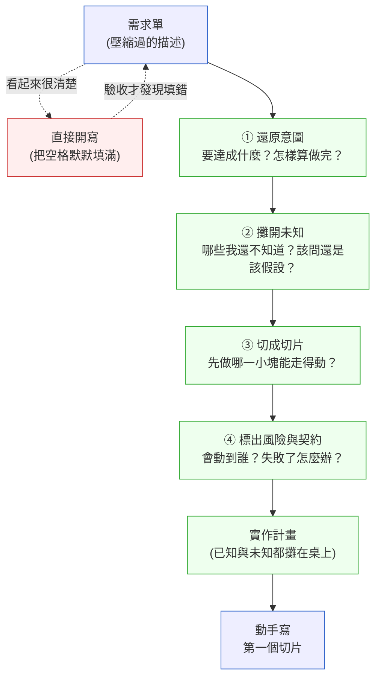

# 第 5 章｜從需求到實作計畫:動手寫之前,先把任務拆成可執行的樣子
## ⸺ 「能開始寫」不等於「知道要寫什麼」

> **前置閱讀**:[第 2 章｜讀懂一份陌生程式碼](./ch-02-reading-unfamiliar-code.md)——要把需求拆成計畫,常常得先讀懂你即將動到的那段既有程式碼
> **下游章節**:[第 6 章｜可讀性:為下一個人而寫](../part-02-craft/ch-06-readability.md)——當你知道要寫什麼之後,下一步是把它寫得讓人讀得懂

## 5.1 共感現場:那張「看起來很清楚」的需求單

你可能也遇過這樣的早上。

工程師小澤在一家做儲能的公司 Voltiq 上班,這是一套幫工商用戶管理電池儲能系統(BESS,Battery Energy Storage System)的雲端平台。這天他接到一張需求單,標題寫著:

> 幫 A 客戶做「尖峰時段自動放電」(Peak Shaving):在尖峰時段把電池的電放出來,抵掉尖峰用電,幫客戶省電費。

小澤讀了一遍,覺得很清楚。尖峰放電嘛,他知道電池怎麼放,也知道從哪個 API 讀即時功率。他打開編輯器,開始寫。

兩天後,功能寫完了,本機 demo 一切正常:時間到了,電池開始放電,儀表板上的數字往下掉,看起來就是需求要的樣子。他很開心地推上 staging,請客戶成功經理幫忙約客戶驗收。

驗收那天,問題一個一個浮出來。

第一個:小澤寫的「尖峰時段」,用的是台電夏季尖峰的固定時間(下午一點到五點)。但 A 客戶簽的是自訂電價合約,他們的尖峰是傍晚六點到九點。程式碼在錯的時間放了電。

第二個:客戶問「電池會放到多低?」小澤愣住了。他沒有設下限,程式一路放到電池剩 5%——而這型電池的低電量保護閾值是 10%,再低一點就會觸發保護性斷電,影響隔天的備援能力。

第三個:客戶又問,「如果那天你們讀不到我們現場的即時功率呢?」小澤沒想過。現場的 PCS(Power Conversion System,電力轉換系統)偶爾會斷線,他的程式在讀不到訊號時會直接當掉。

這件事不是小澤不努力,也不是他技術不好——他兩天就把東西寫出來了,程式邏輯也沒有 bug。真正的問題藏在更前面:那張需求單「看起來很清楚」,清楚到讓他覺得可以直接開寫。但「能開始寫」和「知道要寫什麼」,其實是兩回事。

這就帶出了第 5 章想陪你想清楚的事:從一張需求單,到你真正動手寫的第一行程式碼之間,有一段常常被跳過、卻決定成敗的工作——把需求「翻譯」成一份可以執行的實作計畫。

## 5.2 真正的問題:需求不是計畫,中間少了一次翻譯

我們把小澤這件事慢慢拆開來看。

很多工程師對「接需求」的直覺是:讀懂它,然後開始做。這個直覺對了一半——讀懂當然重要。但它漏掉了一個關鍵的中間步驟:**需求描述的是「要達成什麼」,而實作計畫回答的是「我要怎麼一步一步把它做出來、途中有哪些事我還不知道」。這兩者之間,隔著一次翻譯。**

需求單天生是「壓縮」的。寫需求的人(PM、客戶、SA)腦袋裡有一整片脈絡:為什麼要做、客戶的合約長什麼樣、什麼情況算成功。他把這片脈絡壓縮成幾句話交給你。你讀到的那幾句話,看起來完整,其實中間有大量被省略的前提——就像第 2 章談讀陌生程式碼時說的,隱性脈絡不會自己寫在字面上。

小澤的三個問題,本質上都是同一件事:**他把需求裡「沒有寫出來的部分」,無意識地用自己的假設填滿了。** 「尖峰時段」他填成台電時間、「放到多低」他沒填(等於填成「放到不能放為止」)、「讀不到訊號怎麼辦」他也沒填。這些填空他自己都沒察覺,因為它們發生在「覺得懂了、開始寫」的那一瞬間。

也就是說,真正的風險不是「他不懂」,而是「他以為他懂」。一個誠實地說「這裡我不確定」的工程師,反而安全;危險的是那種讀完需求覺得一切清楚、於是把所有空格默默填上、然後全速前進的狀態——等到驗收才發現,他填的答案和客戶要的差了十萬八千里,而這時候程式碼已經寫了兩天。

那麼問題來了——既然需求天生是壓縮的,我們要怎麼在動手之前,把那些被省略的前提攤開來?

答案不是「把需求讀更多遍」。讀再多遍,字面上沒有的東西還是不會出現。答案是:在讀懂之後、動手之前,刻意做一次翻譯,把需求變成一份把「已知」和「未知」都攤在桌上的實作計畫。這份計畫不需要很長,甚至一頁就夠;但它要逼你把那些你原本會「默默填空」的地方,一個一個拿出來,問自己:這格我是真的知道,還是只是以為我知道?

這件事,恰好是 AI 幫不上、也最不該外包出去的。你如果把那張需求單丟給 AI,說「幫我實作尖峰放電」,它會非常樂意、非常快地把整個功能寫出來——而且它會用它自己的假設,把每一個空格都填滿。它不會停下來問你「這個客戶的尖峰是幾點」,因為它沒有客戶合約,它只會挑一個看起來合理的答案。這正是全書一直在講的 Generate 與 Judge 的分界:把需求拆成計畫、辨識出哪些空格必須由懂業務的人來填——這是 Judge,是你的價值所在,也是接下來這一節要一起練的事。

## 5.3 一起做判斷:把需求翻譯成計畫的四個鏡頭

要把一張需求單翻譯成實作計畫,你不需要一套複雜的流程。你需要的是四個鏡頭,依序照過需求一遍。每個鏡頭幫你看見一類原本會被跳過的東西。



上面那條虛線,就是小澤走的路:需求看起來很清楚,於是直接開寫,結果驗收時被打回原點。下面那條實線慢一點,但它讓你在寫第一行程式碼之前,就已經知道自己在做什麼、以及自己還有哪裡不知道。我們一個鏡頭一個鏡頭看。

### 5.3.1 還原意圖:用自己的話重講一遍,並找出「怎樣算做完」

第一個鏡頭最簡單,也最容易被省略:**把這張需求,用你自己的話,重新講一遍。** 不是複述字面,而是講出「它真正想達成的效果」。

小澤如果做了這一步,他會這樣重講:「客戶想在『他們電費最貴的那段時間』,用電池的電來抵市電,以省錢——前提是不能把電池搞到影響隔天備援。」你注意到了嗎?光是逼自己重講一遍,「他們電費最貴的那段時間」這句話就會讓他卡一下:等等,那是幾點?這一卡,就把一個原本會被默默填掉的空格,提前暴露出來了。

重講完意圖,緊接著問一個關鍵問題:**怎樣算做完?** 把答案寫成「可以被觀察、被驗證」的條件,而不是模糊的形容詞。

| 模糊的「做完」 | 可驗證的「做完」 |
|---|---|
| 尖峰時能自動放電 | 在客戶合約定義的尖峰區間內,電池以不超過額定功率放電,且 SoC 不低於設定下限 |
| 要穩定 | PCS 訊號中斷時,放電暫停並記錄事件,不影響其他排程 |
| 客戶看得到效果 | 儀表板顯示今日尖峰抵消的度數與估算省下的金額 |

這張表右邊那一欄,就是你之後拿去驗收、拿去寫測試的依據。左邊那種「要穩定」,你沒辦法驗,AI 也沒辦法幫你判斷做到沒——因為根本沒定義什麼叫穩定。順著這個道理,還原意圖的產出不是一段漂亮的敘述,而是幾條「到時候可以一條一條打勾」的驗收條件。

### 5.3.2 攤開未知:分清楚「該問」和「可以假設」

還原意圖的過程,一定會冒出一堆「這個我不確定」。第二個鏡頭要做的,就是把這些不確定**主動列出來**,而不是讓它們留在你腦袋裡當背景雜訊——因為留在腦袋裡的不確定,最後都會被你在寫程式的當下,順手用一個假設填掉。

列出來之後,每一個未知都要做一個判斷:這個我該回去問清楚,還是可以自己合理假設、記一筆、繼續往前?

這個判斷不難,你只要看兩個維度:**這個假設如果錯了,影響有多大?改回來有多難(可不可逆)?**

| 影響 × 可逆性 | 怎麼處理 | 例子 |
|---|---|---|
| 影響大 + 難回退 | **一定要問**,問到答案再動手 | 尖峰時段的定義(放錯時段=客戶合約的錢算錯) |
| 影響大 + 好回退 | 先問;問不到就用最保守的假設,並顯眼標記 | SoC 下限設多少(先用最保守的 20%,標記待確認) |
| 影響小 + 難回退 | 快速確認一句話即可 | 省錢金額用哪個費率換算 |
| 影響小 + 好回退 | **直接假設**,記一筆就好,別卡住 | 儀表板數字的小數點位數 |

這張表想幫你解決的,其實是兩種相反的毛病。一種是「什麼都不問,全部自己假設」——那是小澤的毛病。另一種是「什麼都要問,問到 PM 想躲你」——那會讓你顯得沒有判斷力,也拖慢所有人。真正的功夫在中間:**把「錯了會很痛、又很難改」的那幾個,挑出來問;剩下的,大膽假設、記下來、繼續走。**

這裡有個很實用的小動作:把你的假設寫成一句「我先假設 X,如果不對請告訴我」丟給需求方。這比開放式的「請問尖峰是幾點」更好,因為你給了對方一個具體的東西去反應——人對「你猜錯了」的反應,往往比對「一個空白問題」的反應快得多。

### 5.3.3 切成切片:先找出一個「走得動的骨架」

攤開未知之後,你對「要做什麼」已經清楚很多了。第三個鏡頭處理的是「怎麼做」的順序問題:**不要把整個功能當成一塊來做,把它切成幾個小的、能獨立驗證的切片,然後決定先做哪一個。**

這裡的關鍵詞是「垂直切片」。很多人切任務會習慣「橫切」:先把所有資料表建好、再把所有 API 寫完、最後接前端。橫切的問題是,你要到最後一刻、所有橫層都接起來,才第一次看到「東西能不能動」——而那往往已經太晚。垂直切片相反:每一片都是一條從頭到尾走得通的細線,雖然功能很窄,但它真的能跑。

一個好用的做法是,先找出那個「走得動的骨架」(Walking Skeleton)——用最窄的一條路,把整個流程從頭打通一次。以小澤的例子,走得動的骨架可以是:「在寫死的一個時間點,讓電池放電五分鐘,並在儀表板顯示一個數字。」它幾乎什麼邊界都沒處理,但它一次驗證了最不確定的那條主幹:我讀得到訊號嗎?我下得了放電指令嗎?數字上得了儀表板嗎?這三件事只要有一件不成立,後面所有的精緻功能都是空中樓閣——所以先用一片最薄的切片把它們驗掉。

至於切片之間的先後,你可以用一個簡單的原則來排:

| 先做哪一片? | 判準 | 為什麼 |
|---|---|---|
| 先做**最不確定**的那片 | 這片能不能成,決定整件事可不可行 | 早點撞牆,比晚點撞牆便宜太多 |
| 再做**核心價值**的那片 | 少了它這功能就沒意義 | 確保主線先能跑,邊界之後補 |
| 最後做**邊界與防護**的那片 | SoC 下限、訊號中斷、與手動排程衝突 | 主線立起來後,一片一片把防護加上 |

每一片都要小到「半天到一天能做完、而且有一個明確的完成信號」。如果一片你估要做一週,那它其實還是一整塊,沒被切開——回去再切一次。切得夠小,你才能一片做完就驗一片,而不是等到最後才發現方向錯了、卻已經寫了兩千行。

### 5.3.4 標出風險與契約:會動到誰,失敗了怎麼辦

前三個鏡頭讓你知道「要做什麼、有哪些不確定、先做哪塊」。最後一個鏡頭,是在動手前掃一遍**這件事的邊界**:它會碰到哪些別人的東西,以及它在最壞情況下會怎樣。

具體要看三件事:

第一,**介面與資料的契約**。你要讀誰的資料、呼叫誰的 API、寫進哪張表?這些是你和別的系統之間的約定。小澤要讀 PCS 的即時功率、要下放電指令、要寫一筆放電紀錄——這三個接點,每一個都有格式、單位、失敗回應。契約沒對齊,就是驗收時白屏的來源(這一點在第 20 章談跨團隊介面契約時會更完整)。

第二,**失敗與邊界情境**。把「快樂路徑以外」的情況列出來:訊號讀不到、指令下了沒反應、數值超出合理範圍。你不一定要在第一個切片就全部處理,但你要**知道它們存在**,並決定每一個「現在處理」還是「先記著、之後的切片處理」。小澤的三個坑,全都是這一格漏掉的。

第三,**回滾點**。如果這功能上線後出事,怎麼快速讓它停下來?一個能被一鍵關掉的功能開關,遠比「趕快改程式碼重新部署」讓人安心(這正是第 22 章 Feature Flag 的用武之地)。在計畫階段就想好「怎麼喊停」,比出事當下才想,從容太多。

四個鏡頭照完,你手上就有了一份實作計畫:一句話的意圖、幾條可驗收條件、一張攤開的未知清單、幾個排好序的切片、以及一組風險與回滾點。這份東西,就是你動手寫第一行程式前,真正該有的地圖。下一節我們先看幾個容易在這條路上絆倒的地方,再把這份地圖收斂成一張可以帶走的卡片。

## 5.4 容易絆倒的地方

這幾個地方,幾乎每個工程師都走過——包括做了很多年的人。所以這裡不是要提醒你「別犯錯」,而是想讓你下次遇到的時候,心裡先有個底。

**絆倒處一:需求讀一遍就開寫,跳過翻譯。**

這是最常見、也最自然的一種。需求看起來清楚,手又癢,於是直接進編輯器。問題是,「看起來清楚」恰恰是最危險的信號——真正清楚的需求很少見,更多時候是它把不清楚的部分藏得很好,而你在興頭上不會去翻。

> 修正方向:給自己一個很低的門檻——動手前,只花十分鐘,用自己的話把需求重講一遍,並寫下三個「我還不確定」的點。就這樣。你會很驚訝,光是逼自己講一遍,就能逼出多少原本會被默默填掉的空格。

**絆倒處二:把不確定,默默當成確定。**

這是小澤真正跌倒的地方。不是他懶,是「填空」這個動作太自然了——「尖峰嘛,應該就是台電那個時間」這個念頭閃過的時候,他根本沒意識到自己做了一個假設。等到驗收,那個假設才現形。

> 修正方向:把假設「說出來」。差別只在於,你是把它留在腦袋裡(沒有人能反駁一個你沒說出口的假設),還是寫成一句「我先假設尖峰是 18:00–21:00」丟到群組裡。寫出來,錯的假設就有機會在你寫程式之前被人抓到,而不是在客戶面前。

**絆倒處三:一次做一大塊,沒有切片。**

有時候我們會覺得「這功能就是一整包,切開反而麻煩」,於是悶著頭從第一行寫到最後一行,兩天後才第一次跑起來看。這樣做最痛的不是慢,而是——萬一方向錯了,你是在兩天的成果上發現的,不是在兩小時的成果上。

> 修正方向:先逼自己找出那個「走得動的骨架」,哪怕它醜得要命、幾乎什麼都沒做。只要它能把主幹跑通一次,你就把最大的不確定性提前解決了。之後每一片都是在一個「已經會動」的東西上加東西,踏實很多。

**絆倒處四:把「拆解」整包丟給 AI,不自己 judge。**

這是 AI 時代新長出來的一種絆法,也最隱蔽。你把需求貼給 AI,說「幫我拆成實作步驟」,它會給你一份看起來很完整的計畫。這件事本身沒問題——AI 很擅長列出「一般情況下」該做哪些步驟。問題在於,它列的是「通用的」步驟,它沒有你們客戶的合約,它不知道哪一格是「錯了會賠錢、必須問人」的業務決策。它會很自信地把「尖峰 = 13:00–17:00」寫進計畫裡,而且寫得跟其他步驟一樣理直氣壯。

> 修正方向:讓 AI 幫你「生成候選的切片與步驟」很好,但那份計畫回到你手上之後,你要用第 5.3.2 節那張表再過一遍:哪幾格是「影響大又難回退」的?那幾格,AI 填的答案一律當成「待確認」,由你回去跟懂業務的人對。AI 負責把草稿列快,你負責判斷哪裡不能信——這就是 Generate 和 Judge 的分工。

說起來這四件事都不難,難的是它們都發生在「興頭上」——需求剛到、手正癢、覺得一切清楚的那個當下。所以下一節,我們把這一章的判斷收斂成一張一頁的卡片,讓這些念頭在你衝進編輯器之前,有一個固定的地方停下來想一想。

## 5.5 帶得走的工具 ⸺ 一頁式「實作計畫卡」

下面是一張空白的實作計畫卡。它的用法很簡單:接到一個需求、動手寫第一行程式之前,花十到二十分鐘把它填一遍。它不要求你把每一格都填到完美,而是確認那幾個最容易被跳過的地方——尤其是「未知」和「切片」——都有被你正眼看過一次。

```text
實作計畫卡 ⸺ {需求標題 / 單號}

【意圖】用我自己的話,這個需求真正想達成的是:
  {一到兩句,講效果,不是複述字面}

【怎樣算做完】(可觀察、可驗證的條件)
  □ {條件 1}
  □ {條件 2}
  □ {條件 3}

【未知與假設】(每一項標記:❓該問 / 💡先假設)
  - {未知 1} → ❓該問,因為:{影響大又難回退}
  - {未知 2} → 💡先假設 {值},如果不對請告訴我
  - {未知 3} → 💡先假設 {值}

【切片】(排序:先最不確定 → 核心價值 → 邊界防護)
  1. [走得動的骨架] {最薄的一條主幹,能跑就好}
  2. {核心價值那片}
  3. {邊界與防護那片}
  ※ 任一片估超過一天 → 回去再切

【風險與契約】
  - 介面/資料契約:{要讀誰、呼叫誰、寫哪張表}
  - 失敗與邊界:{列出來,並標「現在處理 / 之後切片」}
  - 回滾點:{出事怎麼一鍵喊停}
```

為什麼這張卡是這五個區塊?因為它們正好對應到那四個鏡頭,加上最前面的意圖。你可以把它想成:上半部(意圖、做完、未知)幫你確認「我真的知道要做什麼嗎」;下半部(切片、風險)幫你確認「我知道怎麼一步一步做、也知道哪裡會出事嗎」。這兩件事都點頭了,你才真正準備好動手——而不只是「手癢想動手」。

### 5.5.1 範例:Voltiq 尖峰放電功能的實作計畫卡

讓我們回到小澤和那張需求單。如果他在動手前,先花二十分鐘填了這張卡,那三個在驗收現場才爆出來的坑,很可能在「未知」那一格就先轉彎了:

```text
實作計畫卡 ⸺ A 客戶尖峰時段自動放電 (Peak Shaving) / TICKET-4821

【意圖】用我自己的話,這個需求真正想達成的是:
  在「A 客戶電費最貴的那段時間」用電池放電抵市電以省錢,
  前提是不能把電池放到影響隔天備援能力。

【怎樣算做完】
  □ 在 A 客戶合約定義的尖峰區間內,電池以不超過額定功率放電
  □ SoC(State of Charge)不低於設定下限,達下限即停止放電
  □ PCS 訊號中斷時,放電暫停並記錄事件,不影響其他排程
  □ 儀表板顯示今日抵消度數與估算省下金額

<!-- 為什麼這欄:小澤原本卡住的三個問題,全都是「怎樣算做完」沒定義清楚。
     把它們寫成可打勾的條件,之後就直接變成驗收清單和測試案例的來源。 -->

【未知與假設】
  - A 客戶的尖峰是幾點? → ❓該問。放錯時段=客戶合約的錢算錯,
    影響大又難回退,一定要拿到合約上的確切區間再動手。
  - SoC 下限設多少? → ❓該問客戶;問不到前 💡先假設 20%(比硬體
    保護閾值 10% 更保守),並在卡上顯眼標記「待確認」。
  - 省錢金額用哪個費率換算? → 💡先假設用合約尖峰費率,記一筆。

<!-- 為什麼這欄:這一格是整張卡的心臟。它逼你把「以為知道」的東西
     攤開,再用『影響 × 可逆性』判斷哪些非問不可。前兩項都是
     「錯了會很痛」,所以標❓;第三項錯了好改,就大膽假設不卡住。 -->

【切片】
  1. [走得動的骨架] 在寫死的時間點,讓電池放電五分鐘,
     儀表板顯示一個數字。→ 先驗:讀得到 PCS 訊號?下得了放電指令?
  2. 接上「合約尖峰區間」的真實時段設定,取代寫死時間。
  3. 加上 SoC 下限保護 + PCS 訊號中斷的暫停處理。
  ※ 每片半天內可完成、可獨立驗證。

【風險與契約】
  - 介面/資料契約:讀 PCS 即時功率(Modbus/TCP,單位 kW)、
    下放電指令、寫一筆放電事件紀錄。三個接點都要確認失敗回應格式。
  - 失敗與邊界:訊號讀不到(切片3處理)、指令無回應(切片3)、
    與現有手動排程衝突(❓需釐清誰優先,先問再排切片)。
  - 回滾點:整個功能包在一個 Feature Flag 後面,可一鍵關閉,
    關閉時退回客戶原本的手動排程。
```

這張卡沒有做什麼了不起的事。它只是在小澤衝進編輯器之前,讓他把「尖峰是幾點」「放到多低」「讀不到訊號怎麼辦」這三件事,提前擺到桌面上看了一眼。那二十分鐘,換掉的是驗收現場的三次尷尬、以及兩天寫錯方向的程式碼。

把這張卡存起來,貼進你的任務模板裡。下次接到一個「看起來很清楚」的需求時,先讓它在這張卡上停留二十分鐘,再開始寫。

## 5.6 本章回顧

讀完這一章,你應該已經能:

- [ ] 說清楚「需求」和「實作計畫」的差別:需求描述要達成什麼,計畫回答怎麼一步步做、以及哪裡還不知道
- [ ] 用四個鏡頭把需求翻譯成計畫:還原意圖、攤開未知、切成切片、標出風險與契約
- [ ] 用「影響 × 可逆性」判斷一個未知是「該問」還是「可以先假設」
- [ ] 找出一個功能「走得動的骨架」,把最不確定的那條主幹先驗掉
- [ ] 在動手前填一張「實作計畫卡」,把會被默默填空的地方提前攤開

如果想先從一件事開始,我會建議——**下次接到需求,動手前先用自己的話把它重講一遍,並寫下三個「我還不確定」的點**,因為光是這一個動作,就能逼出大部分原本會等到驗收才現形的假設。這件事做好,你已經替未來的自己,擋掉了最貴的那種返工。

## Cross-References

- **前一章**:[第 4 章｜版本控制策略](./ch-04-version-control.md) ⸺ 計畫切好的切片,正好對應到分支與 PR 的節奏
- **下一章**:[第 6 章｜可讀性:為下一個人而寫](../part-02-craft/ch-06-readability.md) ⸺ 知道要寫什麼之後,下一步是把它寫得讓人讀得懂
- **強連結**:[第 2 章｜讀懂一份陌生程式碼](./ch-02-reading-unfamiliar-code.md) ⸺ 拆解需求常需先讀懂你即將動到的既有程式碼
- **強連結**:[第 1 章｜為什麼工程實作需要決策框架](./ch-01-why-engineering-decisions.md) ⸺ 「攤開未知」是交付前判斷力的起點
- **強連結**:[第 18 章｜Pull Request 的拆分與描述](../part-04-collaboration/ch-18-pull-request.md) ⸺ 垂直切片如何落地成一個個好 review 的 PR
- **強連結**:[第 43 章｜從設計到上線:一個完整功能的實作全紀錄](../part-09-synthesis/ch-43-feature-end-to-end.md) ⸺ 本章的計畫思路,在 capstone 裡走完整條實作鏈
- **跨書連結**:[SA/SD Playbook](https://github.com/EddyKuo/sa-sd-playbook)(設計輸出是本章需求的上游)/ [PM Playbook](https://github.com/EddyKuo/pm-playbook)(規格與驗收標準的撰寫)

<!-- PROPOSED-REFS
cases:
  - id: CASE-ENR-001
    title: Voltiq 儲能平台尖峰放電需求翻譯事件
    domain: energy
    chapters: [ch-05]
    summary: |
      Voltiq 是一家虛構的儲能 EMS(Energy Management System)SaaS,管理工商用戶的
      電池儲能系統(BESS)。工程師小澤接到「尖峰時段自動放電(Peak Shaving)」需求,
      因需求描述壓縮、看起來清楚而直接開寫,無意識地把三個空白用自己的假設填滿:
      尖峰時段誤用台電固定時間(客戶實為自訂電價合約 18:00–21:00)、未設 SoC 下限
      (放電至 5%,逼近硬體保護閾值 10%)、未處理 PCS 訊號中斷。驗收時三個問題
      同時爆出。根因是缺少「把需求翻譯成實作計畫」的中間步驟——未還原意圖與驗收條件、
      未攤開未知、未切垂直切片。用於說明四鏡頭翻譯法(意圖/未知/切片/風險)與
      「實作計畫卡」的應用,以及以「影響 × 可逆性」判斷該問還是該假設。技術細節
      (BESS、SoC/State of Charge、DoD、PCS Power Conversion System、Modbus/TCP)
      為真實可驗證的儲能領域概念;公司名、客戶、數字均為虛構。
-->
