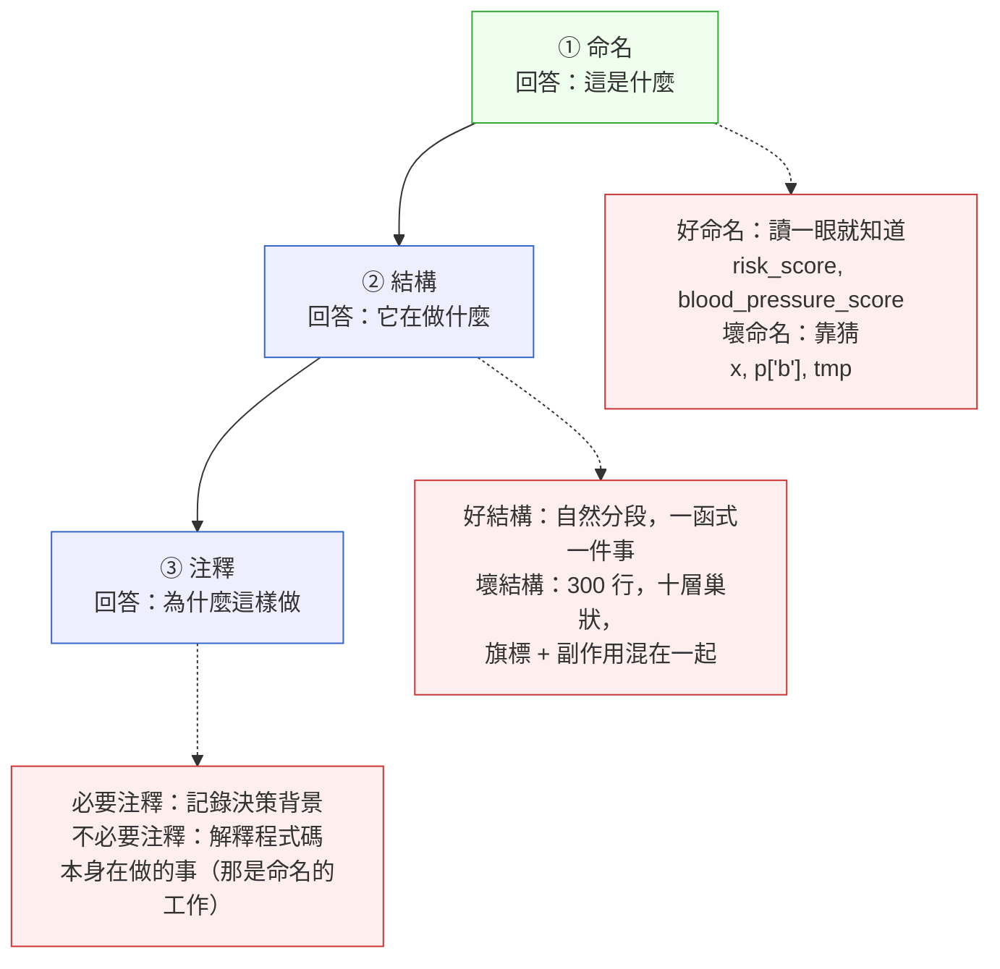

# 第 5 章｜可讀性:為下一個人而寫
## ⸺ 三個月後,你自己也是那個「下一個人」

> **前置閱讀**:[第 1 章｜為什麼工程實作需要決策框架](../part-01-foundations/ch-01-why-engineering-decisions.md)——交付前第④問「別人讀得懂嗎」正是本章的展開
> **下游章節**:[第 6 章｜命名、抽象與邊界](./ch-06-naming-abstraction-boundary.md)——可讀性的下一層:命名決策的細節

## 5.1 共感現場:那段「昨天還看得懂」的程式碼

你可能也遇過這樣的場景。

那是一個週五下午,後端工程師小雅接到一個需求:Lumivita Health 的電子病歷系統裡,有一支計算「病患風險等級」的函式跑出了奇怪的結果。她翻開程式碼,看到這樣一段:

```python
def calc(p, t, v):
    x = p['b'] * 0.4 + p['c'] * 0.3 + t * 0.2 + v * 0.1
    if x > 7.5:
        return 'H'
    elif x > 4.0:
        return 'M'
    return 'L'
```

她盯著看了一會兒。`p['b']`、`p['c']`、`t`、`v`——這四個參數各代表什麼?那些係數 0.4、0.3 是哪來的?`H`/`M`/`L` 又對應到哪些業務動作?

她去翻了 git log,發現這段程式碼是三個月前一位已離職的工程師提交的,PR 描述只有「add risk scoring」五個字,沒有任何其他說明。

這件事不是誰的疏失,也不是誰偷懶。這段程式碼當初寫出來的那一天,作者心裡其實很清楚:`b` 是血壓分數、`c` 是膽固醇分數、`t` 是年齡權重、`v` 是就診頻率。那份清晰在當下完全夠用,邏輯算法也都正確。

可是三個月後,那份清晰只留在已離職的人腦袋裡。留下來的,是小雅面前這幾行字,以及她花掉的那個週五下午。

這就帶出了第 5 章真正想問的問題:可讀性到底是什麼,又該怎麼讓它撐得過時間?

## 5.2 真正的問題:可讀性不是文風,是下一個人的時間成本

我們把這件事慢慢拆開來看。

很多工程師對「可讀性」的直覺感受是:「要寫得清楚一點」「要加一些好的命名」——這個感受對,但還沒有看到問題的根。真正的問題是:**可讀性是一個時間跨度的問題,不只是當下的一個文風問題。**

順著這個道理,我們可以把程式碼的「讀者」分成三個時間點來看:

- **寫的當下**:作者的腦袋裡有完整的脈絡——需求、決策背景、取捨理由。這時候即使命名糟糕,他仍然「看得懂」,因為脈絡還在。
- **三個月後**:同一個作者回來看,腦袋裡的脈絡已經消退七成。他得花時間重建當初的思維地圖。
- **換人接手**:一個從沒見過這段程式碼的人,完全沒有脈絡。他讀到的只有文字本身。

也就是說,「能讀懂」其實是一個連續的衰減——每過一段時間、每換一個人,讀者腦袋裡可用的「隱性脈絡」就少一層,文字本身就得多承擔一點責任。

這就帶出了第 1 章「交付前第④問」真正想守護的東西。當我們問「三個月後的人讀得懂嗎?」,不是在要求每個人都把程式碼寫成教科書,而是在問:當那份隱性脈絡消失之後,這段程式碼還能讓人看出「它在做什麼、為什麼這樣做」嗎?

那麼問題來了——什麼樣的程式碼做得到這件事?

答案不是「多寫一點注釋」那麼簡單。可讀性其實是三件事的組合:好的命名讓人看出「這個東西是什麼」,好的結構讓人看出「這段邏輯在做什麼」,必要的注釋讓人看出「為什麼要這樣做」。這三件事缺一不可,但它們有不同的優先順序,也有不同的使用時機。

## 5.3 一起做判斷:命名、結構、注釋各司其職

### 5.3.1 可讀性的三個層次

把可讀性想成三個由下而上的層次,每個層次回答不同的問題:



這三個層次有一個重要的關係:下層做好了,上層的負擔就小。如果命名已經說清楚「這是血壓分數」,結構已經讓人看出「這一段在加權平均」,那注釋就只需要說「為什麼係數是 0.4,不是 0.5」——那才是真正需要文字記下來的決策背景。

### 5.3.2 命名:讓名字自己說話

命名好壞的判準只有一個:**讀者不需要查字典或跳到其他地方,就能從名字本身推測出這個東西的意思和責任範圍。**

一個好用的角度是,替自己的命名想像一位「沒有背景脈絡的讀者」,問三個問題:

| 問題 | 如果答不出來 | 修正方向 |
|---|---|---|
| 這個名字代表什麼**類型的東西**?(數值?狀態?動作?) | 名字太抽象,e.g., `data`, `info`, `flag` | 加上類型語意,e.g., `order_count`, `is_active`, `fetch_user` |
| 這個名字的**責任邊界**在哪裡?(它做一件事還是很多事?) | 動詞型命名太寬,e.g., `process()`, `handle()` | 縮窄到一件事,e.g., `validate_dosage()`, `build_risk_payload()` |
| 這個名字在**業務語言**裡叫什麼? | 用了技術語言,外行人看不懂,e.g., `node_B_val` | 對齊領域詞彙,e.g., `cholesterol_score` |

回到小雅那段程式碼,`p['b']` 改成 `blood_pressure_score`、`p['c']` 改成 `cholesterol_score`,只是改了命名,邏輯一行都不用動——但三個月後的讀者,省下的不只是困惑,而是真實的時間。

### 5.3.3 結構:讓程式碼自己說故事

好的結構讓人在閱讀時有「走樓梯」的感覺:知道現在在哪一層,也知道下一步要去哪裡。

一個常見的、有效的結構準則是「函式只做一件事」(Single Responsibility at Function Level)。不是每個函式都只能有五行,而是:讀一個函式的第一行到最後一行,你能說出一個完整的句子來描述它在做什麼,而且那個句子裡只有一個動詞。

讓我們看 Lumivita 那個案例如果改寫結構:

```python
# 重構前:一個函式,做了四件事,讀者要從頭讀到尾才知道在幹嘛
def calc(p, t, v):
    x = p['b'] * 0.4 + p['c'] * 0.3 + t * 0.2 + v * 0.1
    if x > 7.5:
        return 'H'
    elif x > 4.0:
        return 'M'
    return 'L'

# 重構後:三個函式,各說一件事
def compute_weighted_score(blood_pressure_score, cholesterol_score,
                           age_weight, visit_frequency_weight):
    """計算加權風險分數。係數來源見 clinical-protocol-v2.pdf §3.2。"""
    return (blood_pressure_score * 0.4
            + cholesterol_score * 0.3
            + age_weight * 0.2
            + visit_frequency_weight * 0.1)

def classify_risk_level(weighted_score):
    """依臨床協定將分數對應到風險等級。"""
    if weighted_score > 7.5:
        return 'HIGH'
    if weighted_score > 4.0:
        return 'MEDIUM'
    return 'LOW'

def evaluate_patient_risk(patient_vitals, age_weight, visit_frequency_weight):
    """整合入口:從病患基礎數值計算並回傳風險等級。"""
    score = compute_weighted_score(
        blood_pressure_score=patient_vitals['blood_pressure'],
        cholesterol_score=patient_vitals['cholesterol'],
        age_weight=age_weight,
        visit_frequency_weight=visit_frequency_weight,
    )
    return classify_risk_level(score)
```

改動很多,但沒有一個字是在解釋「程式碼在做什麼」——程式碼自己說清楚了。注釋只需要說「係數來源」,那才是真正不寫會遺忘的資訊。

### 5.3.4 注釋:只說「為什麼」,不說「什麼」

這是最容易誤用的一件事。注釋有兩種,效果完全不同:

**解釋「什麼」的注釋**(通常是浪費):
```python
# 計算加權分數
x = p['b'] * 0.4 + p['c'] * 0.3 + t * 0.2 + v * 0.1
```
這行注釋說的是程式碼本身已經在做的事。如果命名夠好,這行注釋是多餘的;如果命名不夠好,這行注釋也沒有解決根本問題。

**解釋「為什麼」的注釋**(通常是寶):
```python
# 係數 0.4/0.3/0.2/0.1 來自 Lumivita 臨床協定 v2.3 §3.2,
# 由心臟科醫師委員會於 2025-Q3 審定。
# 若需調整,請先更新協定文件並取得醫療主任簽核。
score = compute_weighted_score(...)
```
這行注釋說的是程式碼無法自己說出來的東西:決策背景、外部依賴、修改這裡之前要知道的事情。三個月後的讀者看到這行,可以繼續往下查;沒有這行,他只能猜。

順著這個道理,一個好用的自問是:**如果把這條注釋刪掉,有什麼資訊會永遠消失?** 如果答案是「沒有,程式碼本身就說清楚了」,這條注釋多半不需要。如果答案是「決策背景、業務規則來源、已知的陷阱、未來要改的方向」,這條注釋應該留著,而且寫得愈完整愈好。

現在我們已經把這三個層次說清楚了——命名、結構、注釋各自守住了一道防線。下面來看幾個最常見的地方,讓人在知道這件事之後,還是容易在這裡絆一跤。

## 5.4 容易絆倒的地方

下面這幾個地方,幾乎每個工程師都走過——所以在這裡不是要提醒你「別犯錯」,而是想讓你下次遇到的時候,心裡有個底。

**絆倒處一:用注釋補救命名。**

這是最常見的一種。有時候我們選了一個不夠清楚的名字,然後在旁邊加了一行注釋來解釋它:

```python
# x 是風險分數
x = ...
```

這樣做在短期內能用,但它其實是在「欠一筆帳」——名字沒有說清楚的事,注釋幫忙撐著;等到有一天重構,名字改了、注釋忘了更新,就留下了一個說謊的注釋,比沒有注釋更危險。

> 修正方向:先把名字改好;如果改了名字之後注釋變多餘,把注釋刪掉。先選命名,再決定注釋。

**絆倒處二:把整段邏輯寫成一條長鏈。**

這是在函式體裡很常見的一種:為了「少一個中間變數」,把三件事串成一行:

```python
result = sorted(filter(lambda x: x['active'], get_patients()), key=lambda p: p['risk_score'], reverse=True)
```

這行語法完全正確,但讀者要讀三遍才能分清楚三件事:拿病患、篩活躍、按風險排序。

> 修正方向:每個「一件事」用一個變數命名,讓中間狀態可讀:
>
> ```python
> all_patients = get_patients()
> active_patients = [p for p in all_patients if p['active']]
> sorted_by_risk = sorted(active_patients, key=lambda p: p['risk_score'], reverse=True)
> ```
>
> 這樣多三行,但三個月後自己和別人都能一行讀懂一件事。

**絆倒處三:「這個我等等再整理」,然後就沒有等等。**

這個不是壞習慣,是人性。在 PR 通過、功能上線之後,回頭整理可讀性的動力確實很低。問題是,程式碼進了 main 分支,就變成了「下一個讀者的現實」。

> 修正方向:不必整理整支檔案——只要把**你這次改動的那幾行**整理乾淨,就夠了。Boy Scout Rule 的精神:離開的時候,讓這個地方比你進來的時候稍微好一點點。這個幅度很小,但累積起來就是一個愈來愈乾淨的系統。

**絆倒處四:可讀性被當成「有空再說的事」。**

有時候我們會有一種直覺:功能做對了,可讀性是錦上添花,留到有空再說。這個想法有一個隱性的前提——「我以後還會有空」。

但實際上,大多數程式碼只有在「功能出事」或「需要改動」的時候才會再被翻開。那個時候通常沒空,而且還有壓力——恰恰是最不適合同時處理可讀性的時刻。

> 修正方向:把可讀性納入「做完」的定義裡。第 1 章的第④問已經說了:「別人讀得懂嗎?」不是功能以外的額外要求,它是判斷「這件事做完了嗎」的一部分。

說起來容易,但每次到了要交付的當下,這些念頭往往都是心裡有、手上卻沒有動作。所以這裡有一張一頁式的自查卡,讓這些判斷在提 PR 之前有個固定的位置停下來想一想。

## 5.5 帶得走的工具 ⸺ 一頁式「可讀性自查卡」

下面是一張空白的可讀性自查卡,你可以在提 PR 之前,把它當成最後一道關卡過一遍。它不要求你把每一行都改到完美,而是確認幾個最容易被跳過的地方都有過一眼:

```text
可讀性自查卡 ⸺ {PR 或函式名稱}

【命名層】
□ 每個函式名:動詞 + 名詞,一個動詞,一件事。
  最不確定的命名:{你在猶豫哪個}
  三個月後的讀者看得出它在做什麼嗎?{是 / 否 / 改成→}

□ 每個參數名 / 變數名:能讀出它在業務上是什麼東西嗎?
  最糟的一個:{哪個} → 準備改成:{改什麼}

【結構層】
□ 最長的函式有幾行?{行數}
  讀者能用一句話說出它在做什麼嗎?{是 / 否 → 拆成幾個}

□ 有沒有「做了兩件事」的函式?
  哪一個:{函式名} → 計畫怎麼拆:{說明}

【注釋層】
□ 刪掉所有注釋之後,還有什麼資訊會消失?
  需要保留的注釋是:{寫什麼 / 為什麼這段這樣做}

□ 有沒有注釋在說「程式碼在做什麼」而非「為什麼這樣做」?
  哪一個:{刪掉還是改寫成 why}

【整體】
□ 三個月後的我,打開這段程式碼,需要花幾分鐘才能接手?
  預計:{X 分鐘}  目標:< 10 分鐘
```

為什麼這張卡只有四個區塊?因為可讀性的問題來來去去,最終都落在命名、結構、注釋三個層次——這三個層次守住了,大多數的可讀性問題就有了答案。最後一個「整體」欄是一個感性的壓力測試:如果你自己都不敢填「三分鐘就能接手」,就知道哪裡還需要多做一點。

### 5.5.1 範例:Lumivita 病患風險評估函式重構

讓我們回到小雅和那個週五下午。如果在三個月前提 PR 的那位工程師,手上有這張自查卡,事情很可能會在「命名層」就轉彎了:

```text
可讀性自查卡 ⸺ CASE-HCR-005 / add_risk_scoring

<!-- 為什麼這欄:在你覺得「命名夠用了」的當下,你腦袋裡還有背景脈絡,
     所以 p['b'] 對你來說很清楚。但這欄要你站在「沒有脈絡的讀者」那邊想,
     那個讀者很可能是三個月後的你自己。 -->
【命名層】
□ 每個函式名:動詞 + 名詞,一個動詞,一件事。
  最不確定的命名:calc()
  三個月後的讀者看得出它在做什麼嗎?否 → 改成:evaluate_patient_risk()

□ 每個參數名 / 變數名:能讀出它在業務上是什麼東西嗎?
  最糟的一個:p['b'], p['c'], t, v
  → 改成:blood_pressure_score, cholesterol_score, age_weight, visit_frequency_weight

<!-- 為什麼這欄:這裡問的「最長函式有幾行」不是要求短,而是讓你停一秒鐘問自己
     「它只做一件事嗎?」。一個 8 行的函式其實做了三件不同的事,
     對讀者來說比 20 行只做一件事的函式更難懂。 -->
【結構層】
□ 最長的函式有幾行?8 行(但做了加權計算 + 閾值分類兩件事)
  讀者能用一句話說出它在做什麼嗎?否 → 拆成:compute_weighted_score() + classify_risk_level()

□ 有沒有「做了兩件事」的函式?
  calc() 同時算分 + 分類等級 → 拆成兩個函式

【注釋層】
□ 刪掉所有注釋之後,還有什麼資訊會消失?
  係數 0.4/0.3/0.2/0.1 的來源——這是臨床協定,不是工程決策,
  外人完全看不出為什麼是這些數字。
  → 補:# 係數來源見 clinical-protocol-v2.pdf §3.2,醫療主任簽核

<!-- 為什麼這欄:「為什麼」類的注釋,往往是程式碼裡最珍貴的資訊——
     它記錄的是當時做決策的人知道、而程式碼本身無法表達的脈絡。
     沒有它,未來的接手人只能猜,或者默默改掉一個「看起來是魔法數字」的係數,
     卻不知道它背後有臨床依據。 -->
□ 有沒有注釋在說「程式碼在做什麼」而非「為什麼這樣做」?
  原本沒有注釋 → 現在補的注釋都是「為什麼」

【整體】
□ 三個月後的我,打開這段程式碼,需要花幾分鐘才能接手?
  重構前預計:30 分鐘以上(需要找人問背景)
  重構後預計:< 5 分鐘(命名 + 注釋都說清楚了)
```

這張卡沒有做什麼了不起的事。它只是在交付之前,讓工程師先站到「三個月後的讀者」那個位置一次。小雅那個週五下午花掉的時間,說到底不是任何人的錯——只是沒有人問過那個問題。

卡片存起來,貼到你的 PR 模板裡。下次交付的時候,讓那個「三個月後的讀者」提前被你照顧到。

## 5.6 本章回顧

讀完這一章,你應該已經能:

- [ ] 說清楚可讀性是命名、結構、注釋三個層次,各自回答不同的問題(「是什麼」「做什麼」「為什麼」)
- [ ] 判斷一條注釋是在說「what」還是「why」,並知道只有「why」類的注釋值得留
- [ ] 用「最長函式能不能一句話說清楚」來判斷是否需要拆分
- [ ] 在提 PR 之前,用「可讀性自查卡」過一遍命名、結構、注釋三個層次

如果想先從一件事開始,我會建議——**把你這次改動過的函式,試著用一句話說清楚它在做什麼**,因為說不出來的函式,幾乎必然有命名或結構的問題;說得出來的函式,大多數讀者都能跟上。這一件事做好,你已經替三個月後的讀者省下最多的時間。

## Cross-References

- **前一章**:[第 4 章｜版本控制策略](../part-01-foundations/ch-04-version-control.md) ⸺ commit 描述的可讀性,與程式碼命名同一個道理
- **下一章**:[第 6 章｜命名、抽象與邊界](./ch-06-naming-abstraction-boundary.md) ⸺ 命名決策的細節展開
- **強連結**:[第 1 章｜為什麼工程實作需要決策框架](../part-01-foundations/ch-01-why-engineering-decisions.md) ⸺ 本章展開的是第④問「別人讀得懂嗎」
- **強連結**:[第 8 章｜重構的時機與安全網](./ch-08-refactoring.md) ⸺ 可讀性改善與重構的關係
- **強連結**:[第 16 章｜Code Review:看什麼、怎麼給回饋](../part-04-collaboration/ch-16-code-review.md) ⸺ 可讀性是 Code Review 的核心審查面向
- **強連結**:[第 37 章｜審查 AI 生成的程式碼](../part-08-ai-era/ch-37-reviewing-ai-code.md) ⸺ AI 生成的程式碼往往通過語法卻在可讀性上打折

