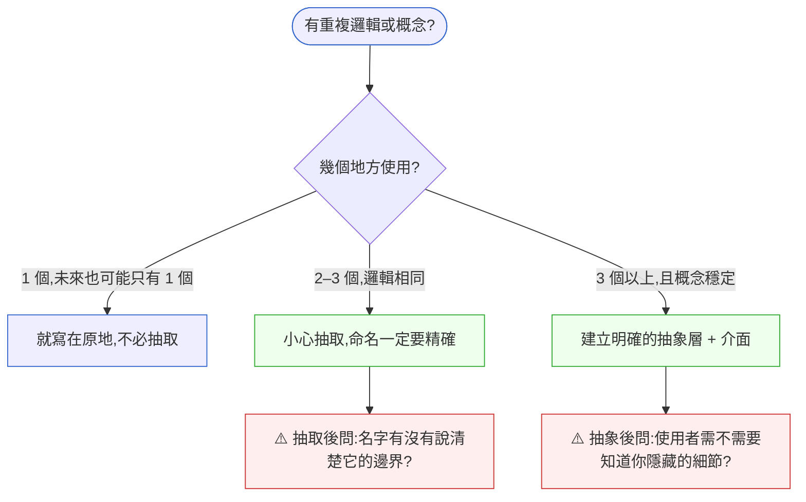

# 第 6 章｜命名、抽象與邊界
## ⸺ 好名字不是在找詞,而是在對齊思考

> **前置閱讀**:[第 5 章｜可讀性:為下一個人而寫](./ch-05-readability.md)
> **下游章節**:[第 7 章｜控制複雜度](./ch-07-complexity.md)

## 6.1 共感現場:那個大家都說「懂」的函式

你可能也遇過這種狀況。

我帶過一個很用功的工程師,叫她小婷。她在一家做品牌電商的公司 CanvasShop 上班,接手的是一段已經跑了兩年的促銷模組。有一天,她打開一個叫 `handleData()` 的函式,往下讀——讀了幾十行——越讀越不確定自己在看什麼。

她去問原作者:「這個 `handleData` 是在做什麼?」

對方想了一下說:「哦,它會根據購物車狀態,選出要套用的折扣規則,然後計算最終的結帳金額。」

小婷又看了一眼函式名稱。`handleData`。

這件事本身不大。但它的後果不小:因為不確定這個函式的邊界,她在加新的折扣邏輯時,把計算放在了這個函式裡面。又過了半年,另一個工程師來修 bug,讀到函式的時候,發現它同時在做「選規則」、「算金額」、「記 log」、還有「更新購物車 session」——四件事擠在一起,函式已經長到超過兩百行。每次要改的時候,沒有人敢動。

這不是小婷的錯,也不是原作者的錯。這是一個在「名字沒說清楚事情邊界」的環境裡,每個人各自做出了合理判斷之後,慢慢累積起來的結果。

命名這件事,從外面看很像在找個詞。其實,它是在向整個團隊宣示:「這個東西負責一件事,而那件事叫做這個名字。」名字對了,邊界就守住了;邊界清楚了,後來的人才知道往哪裡加東西。

## 6.2 真正的問題:名字不是標籤,是承諾

我們把剛才的現象慢慢拆開來看。

`handleData` 這個名字哪裡有問題?問題不在它「文法不對」——它文法完全正確,一個動詞加一個名詞。問題在它傳遞的資訊量是零:**handle 什麼都可以做,data 什麼都可以是。** 這個名字不是在說「它是什麼」,它只是在說「它存在」。

也就是說,命名的問題從來不是「名字好不好聽」,而是「這個名字能不能讓讀到它的人,在看到函式實作之前,就對它的職責有大致正確的預期。」

順著這個道理,我們會發現,命名背後真正在處理的,是三件密切相關的事:

**第一件,是語意精確性。** 名字必須準確反映這個東西在做的事,不多也不少。`calculateCheckoutTotal` 說明了動作(計算)和對象(結帳總金額),讀者馬上知道這裡不應該有更新 session 的邏輯。名字一旦精確,它就自動成了一道邊界。

**第二件,是抽象層次的一致性。** 把程式碼想像成一棟大樓:高樓層住的是業務概念,低樓層住的是技術實作。每一層都有自己的語言——業務層說「套用促銷規則」、「計算結帳金額」;技術層說「執行 SQL 查詢」、「更新 Redis 快取」。當你在一個函式裡同時看到 `applyPromoRules()` 和 `db.query("UPDATE cart SET ...")`,讀者的視線必須在兩個完全不同的樓層之間快速移動——這種樓層跳躍,就是認知摩擦最常見的來源。

理想的程式碼讓每一層只和「同樓層的鄰居」說話:上層函式呼叫中層函式,中層函式呼叫底層函式,每一個呼叫都保持在相近的抽象高度。這樣讀者在任何一層閱讀時,都不需要突然切換心智模型。

**第三件,是責任的邊界。** 函式的名字決定了它「應該」包含什麼、「不應該」包含什麼。這個「應不應該」是隱性契約。`calculateCheckoutTotal` 就是在說:跟計算結帳金額無關的事,你不要給我。`handleData` 什麼都能塞,於是就什麼都被塞進去了。

那麼問題來了——如果命名確實這麼重要,為什麼工程師卻常常在命名上妥協?有一個很常見的原因是:**抽象還沒想清楚的時候,名字就寫出去了。** 名字不只是最後才起的標籤,它其實是抽象的外顯形式。你沒有把一件事想透徹之前,幾乎不可能給它一個好名字——而很多人在還沒有把概念想清楚的時候,就先寫了 `handleData`,然後就往下寫了。

這也解釋了為什麼「改名字」有時候是最有效的重構動作之一。當你把一個模糊的名字換成精確的名字,你同時做了三件事:釐清了概念、標記了邊界、讓後來的人知道什麼不屬於這裡。一個好名字是沉默的架構文件。

## 6.3 一起做判斷:命名、抽象、邊界的三把尺

知道了問題的根源,接下來我們可以一起看幾個具體的判斷角度。這不是規則清單,而是當你對著一個函式、變數、或模組的名字發呆的時候,可以拿來幫你想清楚的方式。

### 6.3.1 好名字的四個檢查點

一個名字好不好,可以從這四個角度來看:

| 檢查點 | 問自己 | CanvasShop 的例子 |
|---|---|---|
| **語意精確** | 讀到這個名字,讀者對它做的事,有沒有大致正確的預期? | `handleData` → ❌;`calculateCheckoutTotal` → ✅ |
| **層次一致** | 這個名字的抽象層次,和呼叫者在的層次一不一致? | `applyDiscount` 在業務層說話,`buildSQLClause` 在技術層說話;不要混 |
| **邊界隱含** | 名字有沒有暗示「什麼不屬於這裡」? | `selectEligibleRules` 隱含「我只選,不算」;所以金額計算不該在裡面 |
| **可測試** | 這個名字代表的職責,你能用一個測試案例說清楚它嗎? | 一個測試只測一件事;如果你需要在一個測試裡驗證三件不同的事,名字可能包太多了 |

這四個角度不用全部同時滿足才算好——但如果一個都沒有,就很值得停下來重新想。

### 6.3.2 何時抽象,何時不抽象

抽象(Abstraction)的目的是**隱藏不必要的細節,同時保留使用者需要的彈性**。但抽象也有代價:層次越多,追程式碼的路徑就越長,出問題時要多穿幾層才能看到真相。

一個好用的判斷角度是問:「這件事,現在有幾個地方在用?未來有幾個地方需要?」



「1 個地方用」但急著抽取,是最常見的過早抽象。過早抽象之所以有害,不是因為抽象的動作本身不好,而是因為你還沒看到足夠多的「使用場景」,抽出來的介面很可能剛好不對——然後你就被那個介面綁住了,之後要改反而更麻煩。

順著這個道理,一個有點違反直覺的建議是:**先讓重複發生一次,再抽象。** 第一次你不知道形狀;第二次你開始看到它;第三次你就知道該抽什麼了。這是「三次原則(Rule of Three)」背後的真義。

讓我們用 CanvasShop 的例子來體會這個節奏。第一次:結帳流程需要「驗證購物車不是空的」,工程師直接在 `CheckoutController` 裡寫了三行驗證邏輯。沒問題,一個地方用,不需要抽。第二次:管理後台的訂單預覽也需要同樣的驗證,工程師複製了那三行過去——這時候感覺有點不對,但還說不清楚「未來的形狀」。第三次:行動版 API 又需要同樣的邏輯,這時候已經有三個呼叫點,而且三個地方的需求幾乎完全一樣。這才是抽象的好時機——因為你現在看得見「介面的形狀」了:`validateCartIsNotEmpty(cart: Cart): boolean`,乾淨、精確、不過度設計。

如果在第一次就急著抽,你可能抽出了 `CartValidator` 類別,裡面預留了 `validateItems()`、`validateAddress()`、`validatePaymentMethod()` 等等——但那些方法在三個月內根本用不到,反而讓第二個工程師進來時要先理解一個空的框架。等到真的需要加新驗證邏輯時,又可能發現當初預留的介面形狀不對,要砍掉重練。

三次原則的核心,不是「等到三次才能抽」,而是「**讓真實需求告訴你介面的形狀,而不是讓你的想像告訴你**」。這是抽象成本最低、方向最準的路徑。

### 6.3.3 邊界的畫法:責任 vs 實作

邊界有兩個常被混在一起的層次。把它們分開,會讓你的設計更清楚。

**責任邊界**:這個模組「對外承諾」什麼?它的使用者只看到這個承諾,不需要知道內部怎麼做。CanvasShop 的促銷模組對外只需要說「給我購物車,我告訴你最終金額」,至於它內部要跑幾條規則、要查幾張表,都是實作細節。

**實作邊界**:內部怎麼把工作切分?這是第二個層次——當你決定好了責任之後,才去想「要怎麼把這件事的實作切成幾塊」。

這兩個層次的順序非常重要。很多人習慣先想實作邊界(「我要拆成 A、B、C 三個類別」),然後再去湊責任邊界——這樣拆出來的東西,通常會覺得「哪裡怪怪的,但又說不上來」。正確的順序是反過來:**先問「外部需要你做什麼」,再問「內部如何分工」。**

以 CanvasShop 為例,用這個思路重新整理促銷模組的邊界,大概是這樣:

| 層次 | 名稱 | 責任一句話 | 不屬於這裡的事 |
|---|---|---|---|
| 對外介面 | `PromotionService` | 接收購物車,回傳折扣後的金額與明細 | 如何選規則、如何計算,都是內部事 |
| 內部:規則選取 | `EligibleRuleSelector` | 依購物車狀態,選出應套用的規則清單 | 不計算金額、不更新任何狀態 |
| 內部:金額計算 | `DiscountCalculator` | 根據規則清單,算出折扣金額 | 不知道規則從哪來、不更新 session |
| 內部:副作用 | `CartSessionWriter` | 把最終金額寫回 cart session | 不涉及任何業務邏輯 |

這樣切分之後,每個名字都在說「它做什麼」,而且每個邊界都隱含了「它不做什麼」。小婷如果面對這樣的結構,就知道新的折扣規則要加在 `EligibleRuleSelector` 裡,不是 `DiscountCalculator`。

## 6.4 容易絆倒的地方

命名和抽象這個話題,有幾個很常見的地雷。這裡先點出來,不是要嚇你,而是讓你下次遇到的時候,心裡能快一步認出來。

### 絆倒處一:縮寫帶來的假省事

`calcPrmDscAmt()` 比 `calculatePromotionDiscountAmount()` 少打很多字。但讀的人每次都要先解碼縮寫,才能理解意思——這個成本悄悄轉嫁給了所有讀這段程式碼的人,包括三個月後的你自己。

更麻煩的地方在於:縮寫還容易造成「同義詞分裂」。如果你在某個檔案用 `prmDsc`、另一個工程師在另一個模組用 `promoDiscount`、第三個人在 API 文件裡寫 `promotional_discount`——同一個概念有三種寫法,搜尋程式碼的時候就得試三次,還不一定找得全。這種分裂往往到 debug 時才被發現,代價比想像中高。

> **修正方向**:縮寫的原則是「讀者不需要思考就能還原」。`id`、`url`、`ctx` 這類已經成為行業共識的縮寫沒問題;但 `prmDsc` 這類只有作者自己清楚的組合縮寫,就值得展開來寫。打字的成本發生一次,讀的成本會發生很多次。如果團隊對某個領域術語有約定縮寫,把它寫進 glossary 或 coding convention 文件——讓縮寫有根,而不是讓每個人各自發明。

### 絆倒處二:抽象過早,介面鎖死

假設 CanvasShop 一開始只有「滿額折扣」一種促銷,工程師為了「預留彈性」,就先設計了一套很完整的 `PromotionEngine` 框架,定義了 `PromotionStrategy` 介面、`PromotionContext` 物件、`PromotionResult` 型別……

六個月後,業務說只要再加一種「指定商品打折」的邏輯。工程師打開那個框架,發現 `PromotionContext` 的欄位設計當初是為「滿額折扣」量身打造的,現在要套用在「指定商品」上,反而要繞很多彎路。

具體來說,當初的 `PromotionContext` 有一個欄位叫 `minCartValue`(最小購物車金額),這是專為「滿額折扣」設計的——邏輯是「購物車金額超過這個門檻,就套用折扣」。但「指定商品打折」根本不需要 `minCartValue`,它需要的是 `productIds`(哪些商品適用折扣)。於是工程師只剩兩條路:要麼在同一個 `PromotionContext` 裡同時塞 `minCartValue` 和 `productIds`,讓兩個互不相關的欄位擠在一起,新人光是看欄位列表就猜不出「這兩個欄位什麼時候該填、什麼時候該留空」;要麼到處寫 `if (type === 'CART_THRESHOLD') { ...minCartValue... } else if (type === 'PRODUCT_SPECIFIC') { ...productIds... }` 這樣的判斷式。當初為了「預留彈性」而設計的框架,反而讓程式碼比沒有框架時更複雜。

> **修正方向**:「預留彈性」的代價是「現在就得決定介面的形狀」。需求還不穩定的時候,平直的程式碼比高聳的框架更容易改。先讓具體的邏輯跑起來,等到真的出現第二、第三種同類需求,再用「看到的形狀」抽象,成本最低、方向最準。

### 絆倒處三:名字和行為脫鉤

這是最隱蔽的一種問題。函式叫 `getUser()`——但它除了查詢使用者資料之外,還會把這次查詢的時間戳更新進 log 資料庫。「get」這個動詞暗示是無副作用的查詢,但它其實有副作用。

這種名字與行為的脫鉤,在一開始完全看不出問題,因為大家都知道「getUser 還會寫 log」。但半年後,某個同事以為 `getUser` 是純讀取,在 for loop 裡呼叫了一百次——log 資料庫突然開始吃大量寫入。

這類問題的麻煩在於:它不會立刻爆炸。口耳相傳的「大家都知道」可以撐很久,直到有一個不在那個「大家」裡的人進來——新人、跨組協作者、三個月後的自己——才會踩到地雷。而到那時候,問題往往已經出現在生產環境,而不是本機測試。

> **修正方向**:有副作用的函式,命名要讓副作用可見。`getUser` 如果有寫 log,要麼拆成兩個函式(一個純查詢、一個負責副作用),要麼把名字改成讓人知道有額外動作,例如 `fetchAndLogUser`——雖然有點長,但讀到它的人不會被誤導。一個簡單的自我檢查:「如果有人把這個函式在 for loop 裡呼叫 1000 次,會發生什麼事?」如果答案是「可能出問題」,那副作用就需要在名字裡可見。

### 絆倒處四:抽象洩漏細節

你定義了一個 `PaymentGateway` 介面,想讓上層程式碼不需要知道底下是 Stripe 還是 NewebPay。但介面裡有一個方法叫 `chargeWithStripeIdempotencyKey()`——這個方法名稱把「Stripe」的實作細節漏了出去,讓抽象形同虛設。

> **修正方向**:介面的方法命名要站在「使用者的視角」說話,而不是站在「實作的視角」。`chargeWithIdempotencyKey()` 就夠了——idempotency key 是業務概念,不是 Stripe 獨有的概念,這樣的名字在換掉實作的時候,介面不需要跟著改。

## 6.5 帶得走的工具 ⸺ 一頁式「命名與邊界審查卡」

拿到一個新函式、類別、或模組時,可以用這張卡快速過一遍。它不是要你每次都花很多時間反省,而是讓那幾個關鍵問題變成一個習慣性的掃描動作。

```text
命名與邊界審查卡 ⸺ {函式 / 類別 / 模組名稱}

── 命名檢查 ────────────────────────────────────────
① 語意精確:
   - 讀這個名字,外部讀者對它做的事有沒有大致正確的預期?
   - 如果沒有,嘗試用「{動詞} + {對象} + [限定詞]」的方式重新命名:
     重新命名候選:

② 層次一致:
   - 這個名字的抽象層次(業務語言/技術語言),和呼叫它的那層一不一致?
   - 不一致的地方:

③ 邊界隱含:
   - 這個名字有沒有暗示「什麼不屬於這裡」?
   - 哪些現有邏輯其實不屬於這裡,但卻在這裡:

── 抽象層次檢查 ────────────────────────────────────
④ 幾個地方在用?
   - 目前:{個} ⸺ 未來預期:{個}
   - 判斷結果:□ 不必抽  □ 可以抽  □ 應該抽

⑤ 副作用可見性:
   - 這個函式有沒有讀者可能沒預期到的副作用?
   - 有的話:□ 已在名字中體現  □ 需要拆分  □ 需要重新命名

── 邊界清單 ────────────────────────────────────────
⑥ 屬於這裡的責任:
   -
⑦ 不屬於這裡的責任(寫下來,即使只是提醒自己):
   -
```

為什麼要有「不屬於這裡」這一欄?因為很多邊界的腐蝕,不是因為有人「不知道」,而是因為「沒有人說出來」。把「這裡不做什麼」寫下來,就是在讓隱性契約變成顯性的。這一欄,往往比其他欄更值得花時間。

### 6.5.1 範例:CanvasShop 促銷模組重整

讓我們回到小婷面對的那個 `handleData`。假設她在動手重整之前,先用這張卡掃一遍,大概會得到這樣的結果:

```text
命名與邊界審查卡 ⸺ handleData()

── 命名檢查 ────────────────────────────────────────
① 語意精確:
   - 讀這個名字,外部讀者對它做的事有沒有大致正確的預期?
     → 沒有。「handle」和「data」都缺乏具體語意
   <!-- 為什麼這欄:精確的預期讓讀者在看實作之前就知道邊界;
        這裡填不出「正確的預期」,本身就是一個信號,說明概念還沒有想清楚。 -->
   - 重新命名候選:
     · calculateCheckoutTotal   ← 如果主要責任是算金額
     · applyPromotionAndSettle  ← 如果真的要做多件事(但建議拆分)

② 層次一致:
   - 呼叫者在業務層(購物結帳 flow);但函式內同時混有業務語言和 SQL 語言
   - 不一致的地方:內部的 db.query("UPDATE cart SET ...") 應下沉到 CartSessionWriter

③ 邊界隱含:
   - 名字沒有暗示任何邊界
   - 哪些現有邏輯不屬於這裡:
     · 更新 cart session(副作用)
     · 記錄促銷 log(觀測用途,應分離)

── 抽象層次檢查 ────────────────────────────────────
④ 幾個地方在用?
   - 目前:3 個(結帳 API、管理後台預覽、購物車重整)⸺ 未來預期:4–5 個
   - 判斷結果:□ 不必抽  □ 可以抽  ✅ 應該抽並拆分職責
   <!-- 為什麼這欄:3 個使用點且邏輯相同,是抽象的好時機;
        但抽之前先確認「它們需要的介面形狀是一樣的」,否則要先讓需求再跑一輪再抽。 -->

⑤ 副作用可見性:
   - 有不明顯的副作用:更新 cart session、寫 DB log
   - 判斷:□ 已在名字中體現  ✅ 需要拆分  □ 需要重新命名
   <!-- 為什麼這欄:副作用不可見是最容易被誤用的地雷;
        讀者看到 handleData() 不會預期它會寫 DB;把副作用移出去,呼叫者就能安全地選擇「要不要副作用」。 -->

── 邊界清單 ────────────────────────────────────────
⑥ 屬於這裡的責任(重整後的 calculateCheckoutTotal):
   - 接收購物車狀態,呼叫 EligibleRuleSelector 取得規則清單
   - 呼叫 DiscountCalculator 計算折扣後的金額
   - 回傳金額與折扣明細(純計算,無副作用)
⑦ 不屬於這裡的責任(寫出來讓後來的人看到):
   - 更新 cart session → 屬於 CartSessionWriter
   - 寫促銷 log → 屬於呼叫者或事件機制
   - 選取適用規則 → 屬於 EligibleRuleSelector
```

小婷把這張卡填完,就不再需要對原作者「猜」了——她清楚地知道 `handleData` 實際上在做四件事,而這四件事每一件都有一個更好的名字和更清楚的歸宿。重整之後的程式碼,每個函式只做一件事,每個名字都說清楚了那件事是什麼。

下一個進來讀這段程式碼的工程師,不需要再問「這是在做什麼」——名字自己就說了。這就是一個好名字帶來的安靜禮物。

## 6.6 本章回顧

讀完這一章,你應該已經能:

- [ ] 解釋為什麼「命名」不只是在找詞,而是在對外宣示邊界
- [ ] 用四個檢查點(語意精確、層次一致、邊界隱含、可測試)評估一個名字的品質
- [ ] 用「幾個地方在用」來判斷是否該抽象,以及何時該等一等再抽
- [ ] 區分「責任邊界」和「實作邊界」,先想前者再想後者
- [ ] 認出三種常見的命名地雷:縮寫假省事、名字與行為脫鉤、抽象洩漏細節

如果想先從一件事開始,我會建議 ⸺**在寫下一個函式名稱之前,先問自己「讀到這個名字的人,對它做的事有沒有正確的預期」**,因為一個說清楚了的名字,等於是在未來的每一次 review、每一次 bug 追查、每一次新人閱讀的時候,替你多說了一遍這段程式碼的意圖。這是成本只發生一次、但收益反覆累積的投資。

你現在已經有了一把尺去判斷一個名字好不好——不用靠感覺,可以問四個具體的問題,也可以對著審查卡一格一格填。這把尺帶走之後,每次寫新函式或 review 別人的程式碼,都能用上。

下一章,我們會繼續往複雜度的方向走——當邊界已經畫好、名字已經說清楚,程式碼本身的條件分支和巢狀結構如何保持在可掌控的範圍內。

## Cross-References

- **前一章**:[第 5 章｜可讀性:為下一個人而寫](./ch-05-readability.md) ⸺ 可讀性的基礎概念,與本章的命名原則互相支撐
- **下一章**:[第 7 章｜控制複雜度](./ch-07-complexity.md) ⸺ 邊界畫好之後,條件與巢狀的控制
- **強連結**:[第 8 章｜重構的時機與安全網](./ch-08-refactoring.md) ⸺ 命名不對、邊界模糊時,如何安全地重整
- **強連結**:[第 16 章｜Code Review:看什麼、怎麼給回饋](../part-04-collaboration/ch-16-code-review.md) ⸺ 命名品質是 code review 最容易發現、也最值得討論的向度
- **跨書連結**:[SA/SD Playbook](https://github.com/EddyKuo/sa-sd-playbook) ⸺ 模組邊界的系統設計層次,參見 SA/SD Part III 設計篇
