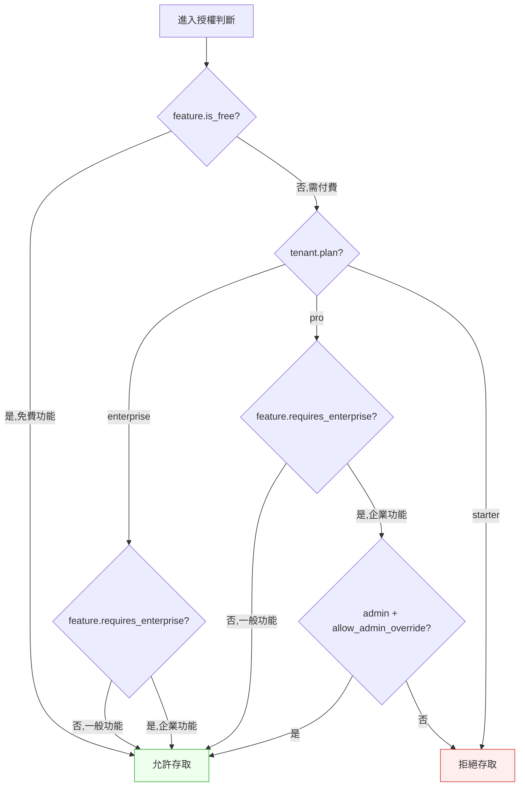

# 第 8 章｜控制複雜度
## ⸺ 當條件多到你自己也不確定它在想什麼

> **前置閱讀**:[第 7 章｜命名、抽象與邊界](./ch-07-naming-abstraction.md)
> **下游章節**:[第 9 章｜重構的時機與安全網](./ch-09-refactoring.md)

## 8.1 共感現場:那個「改了三次還是壞掉」的判斷邏輯

你可能也遇過這種程式碼——不是什麼大功能,就是一個判斷使用者有沒有資格做某件事的函式。

我帶過一個工程師叫小雅,她在一家多租戶 SaaS 公司 Nexthread 工作,負責維護計費與權限模組。有一天她接到一個 bug 單:某個 Starter 方案的使用者,在某些情況下看到了企業版才有的功能。她打開那段授權判斷,大概是這個樣子:

```python
def can_access_feature(user, feature, tenant):
    if user.role == 'admin':
        if tenant.plan == 'enterprise':
            if feature.requires_enterprise:
                return True
            elif feature.is_beta and user.beta_tester:
                return True
            else:
                return tenant.custom_features and feature.name in tenant.custom_features
        elif tenant.plan == 'pro':
            if not feature.requires_enterprise:
                return True
            elif user.role == 'admin' and tenant.allow_admin_override:
                return True
            else:
                return False
        else:
            return feature.is_free
    elif user.role == 'member':
        if tenant.plan in ('pro', 'enterprise'):
            return not feature.requires_enterprise
        else:
            return feature.is_free
    else:
        return False
```

她讀了兩遍,覺得邏輯好像沒有問題。修了一個分支,測試過了,回報 bug 已修。

三天後,同樣的 bug 又回來了——這次從不同的路徑觸發。她再看一遍程式碼,才發現第一次修的地方其實是對的,但修它的過程中,她無意間讓另一個分支產生了新的缺口。

這件事讓她很挫折。她跟我說:「我每次看都覺得邏輯是對的,但就是不知道哪裡出了問題。」

這種感覺很多工程師都有過。問題不是她能力不夠,而是這段程式碼的**複雜度,已經超過人腦在一次閱讀裡能安全追蹤的上限**。

## 8.2 真正的問題:複雜度不是「條件多」,而是「可能路徑爆炸」

我們把小雅那段程式碼慢慢拆開來看。

表面上,它的條件數量並不多:三種 role、三種 plan、幾個 feature 屬性。但仔細看 `admin` 這條路(line 26–42),親手數一遍就知道問題出在哪:`admin` 底下先依 plan 分成 enterprise/pro/starter 三支;enterprise 底下,`requires_enterprise` 一個分岔、`is_beta and beta_tester` 一個分岔、再加上落到 `custom_features` 判斷時,`custom_features` 是否存在、`feature.name` 是否在清單裡,又是兩種輸入各自成立與否的組合;pro 底下同樣有 `requires_enterprise`、`allow_admin_override` 兩個布林欄位交叉出的三種結果;starter 底下還有 `feature.is_free` 的真假兩種。把這些組合一路數下去,光是 `admin` 這條路就已經有超過十種不同的執行路徑——而且因為 enterprise 和 pro 底下都各自有一段「admin 相關」的判斷,長得很像,實際上卻走到不同的結果。這就是複雜度爆炸的具體來源:條件本身不多,但條件之間互相交叉組合出的路徑數,遠遠超過條件數量本身。

這就是「圈複雜度(Cyclomatic Complexity)」在描述的事情。

**圈複雜度**是由 Thomas J. McCabe 在 1976 年提出的指標,計算方式很直覺:每多一個讓程式流程分岔的地方(if、elif、for、while、and、or),複雜度就加 1。一個函式的圈複雜度,大致上等於你需要寫多少個不同的測試案例,才能讓每條路徑都至少被走過一次。

| 圈複雜度 | 代表意義 | 建議行動 |
|---|---|---|
| 1–5 | 簡單、易讀 | 正常維護 |
| 6–10 | 中等複雜 | 值得注意,補齊測試 |
| 11–20 | 偏高 | 考慮拆分 |
| 21+ | 很高,難以安全修改 | 優先重構 |

小雅那段函式,大約落在 13 左右。這解釋了為什麼她「每次看都覺得對」:大腦在追蹤時只看了其中幾條路,沒有同時涵蓋所有分支的組合。

也就是說,問題不是她不仔細——而是**這段程式碼的可能路徑數,已經超過人腦短期記憶能同時持有的量**。當可能路徑爆炸,「改了這邊、壞了那邊」幾乎是必然的,而不是偶然的失誤。

正因為這樣,控制複雜度不是一種「寫好看程式碼」的品味追求,而是一個影響你能不能安全修改它的工程問題。

## 8.3 一起做判斷:四種有效降低複雜度的做法

順著上面這個道理,問題就變得很具體:哪些做法能把可能路徑的數量控制在人腦可以安全追蹤的範圍內?

下面四種做法,是最常被我用到、效果也最穩定的。我們一個一個來看。

### 8.3.1 提早 return:把「不符合資格」的路徑盡早排除

最直接有效的一招,是在函式的最前面,先把所有「不用繼續往下走」的情況處理完。

以小雅那段程式為例,我們可以先把「一定不能存取」的情況提到最前面:

```python
def can_access_feature(user, feature, tenant):
    # 提早 return:先排除所有確定不行的情況
    if user.role not in ('admin', 'member'):
        return False
    if feature.is_free:
        return True

    # 走到這裡,role 一定是 admin 或 member,feature 一定不是免費的
    if tenant.plan == 'enterprise':
        return _can_access_on_enterprise(user, feature, tenant)
    if tenant.plan == 'pro':
        return _can_access_on_pro(user, feature, tenant)
    return False
```

你會發現這樣一來,主函式裡的每條路徑都很短。這很重要,因為路徑短意味著你在追蹤時,腦子裡需要同時記住的「已知前提」就少——走到 `_can_access_on_enterprise` 之前,你只需要記得「role 合法、feature 不是免費的、plan 是 enterprise」這三件事,不需要再往前回想 role 和 plan 之間還有哪些其他組合。前提少,就不容易混淆不同分支之間那些「看起來像但結果不同」的判斷——這正是小雅第一次修 bug 時栽跟頭的原因。「走到這裡,我知道什麼是真的」這種感覺,就是提早 return 在幫你做的事。

### 8.3.2 把巢狀拆平:每一層只做一件事

但僅有提早 return,在面對三層、四層深的巢狀判斷時還不夠——因為層數越深,人腦在每一層都要多記住一個前提,提早 return 只能排除「一定不行」的情況,排除不了「合法但要繼續往下分岔」的巢狀本身。這時候,我們需要第二招。

巢狀(nested)的 if 是複雜度爆炸最常見的起點。每多一層巢狀,讀者就要在腦子裡多記住一層前提。

一個好用的角度是:當你看到 if 裡面還有 if,問自己「這兩個條件有沒有可能各自獨立成一個函式或一個 guard clause?」如果可以,通常就應該這樣做。

```python
# 巢狀版:深度 3 層,讀者要同時記住 admin + enterprise + requires_enterprise
if user.role == 'admin':
    if tenant.plan == 'enterprise':
        if feature.requires_enterprise:
            return True

# 拆平版:每個條件都有自己的明確責任
def _can_access_on_enterprise(user, feature, tenant):
    if feature.requires_enterprise:
        return True
    if feature.is_beta and user.beta_tester:
        return True
    return feature.name in (tenant.custom_features or [])
```

拆平之後,每個函式只需要關心一個「已知前提」下的邏輯——它更容易讀,也更容易為它寫測試。

### 8.3.3 用資料驅動代替條件樹:當「很多個 if 在做同一類判斷」時

前兩種做法主要解決「分支層級太深」的問題。但複雜度還有另一個隱蔽的根源:不是深層巢狀,而是「許多個 if-elif 在判斷同一種事」——這時候,可以考慮把判斷規則從程式碼裡抽出來,用資料來表達。

以 Nexthread 的方案判斷為例:

```python
# 把規則改成資料
PLAN_RULES = {
    'enterprise': {'allows_enterprise_features': True,  'allows_admin_override': True},
    'pro':        {'allows_enterprise_features': False, 'allows_admin_override': True},
    'starter':    {'allows_enterprise_features': False, 'allows_admin_override': False},
}

def can_access_feature(user, feature, tenant):
    if feature.is_free:
        return True
    rules = PLAN_RULES.get(tenant.plan, {})
    if feature.requires_enterprise and not rules.get('allows_enterprise_features'):
        return False
    if feature.requires_enterprise and user.role == 'admin':
        return rules.get('allows_admin_override', False)
    return True
```

這樣一來,函式的圈複雜度從原來的約 13 降到了約 5:現在只有「免費嗎?超級功能嗎?允許覆蓋嗎?」這三個主要分叉點,而不是原本嵌套的 role-plan-feature 三層組合爆炸。「新增一個方案」不需要在邏輯裡加一個 elif——只需要在 `PLAN_RULES` 裡多加一行。這是資料驅動設計帶來的可維護性收益:路徑數具體減少了,新增規則的成本也跟著降下來。

### 8.3.4 馴服狀態爆炸:把「狀態」和「行為」分開想

前三種做法都在調整程式的流程控制。但複雜度的另一個根源是「狀態空間本身就太大」——小雅那段程式碼把多個物件的狀態(user.role、tenant.plan、feature 的各種屬性)交叉組合在同一個判斷裡,導致可能的狀態組合數成幾何級數成長。這就帶出了第四個策略。

一個幫助思考的問題是:**「如果我用一張表格來描述所有合法的狀態組合,這張表格有多大?」** 如果表格大到你寫不完,那這個函式承擔的責任可能太多了。

下面是一個整理「哪些輸入組合對應哪個結果」的方式:



把所有路徑畫出來之後,通常你會發現有些分支其實是等價的,可以合併——這是視覺化最直接的價值:讓隱藏的重複路徑現形。

## 8.4 容易絆倒的地方

上面介紹的四種做法,聽起來都很直接。但實踐時,這些年我看過工程師在同樣的地方一次又一次踩到坑——不是因為不夠仔細,而是因為程式碼本身正在要求你的大腦同時記住太多事。接下來,我們一起來看看這四個「幾乎誰都走過」的陷阱。每一位認真的工程師幾乎都在這裡跌過一跤,這是這種複雜度的副作用,不是個人的問題。認識它們,只是為了下次遇到的時候,能比以前快一點認出那個感覺。

### 絆倒處一:「我只是加了一個條件」

這是最常見的複雜度累積方式。新需求來了,「只要在那邊加一個 if 就好」,聽起來成本最小。但每次「加一個 if」都會讓可能路徑倍增——三次之後,原本 8 條路徑可能變成 64 條。

> 修正方向:每次加條件之前,先問一句:「這個條件加進去之後,這個函式的圈複雜度會到幾?還在 10 以內嗎?」如果超過了,這可能是一個訊號——告訴你現在是在正確的地方加,還是應該先重構再加。

### 絆倒處二:用巢狀表達「需要同時成立的多個條件」

有時候我們寫出三層巢狀,其實只是因為「A 且 B 且 C 的時候才做某件事」——這三個條件本來可以用一個 `and` 組合在一起,或者抽成一個有意義名字的布林函式。

```python
# 絆倒的寫法
if user.is_admin:
    if user.is_active:
        if tenant.is_verified:
            do_something()

# 更清楚的寫法
def _is_authorized_admin(user, tenant):
    return user.is_admin and user.is_active and tenant.is_verified

if _is_authorized_admin(user, tenant):
    do_something()
```

> 修正方向:看到三個連續的 if(每個縮排一層),試試看能不能把它們壓扁成一個「有名字」的布林判斷。好名字比好縮排更能傳達意圖。

### 絆倒處三:在修複雜函式的時候,只改自己看到的那條路

這是小雅第一次修 bug 時發生的事。複雜函式有很多條路徑,修了 A 路不代表 B 路還是對的——因為兩條路可能共享某個變數或副作用。

> 修正方向:修改高複雜度的函式時,補一個「邊界條件測試清單」,列出你認識的所有輸入組合(或至少那個函式的每一個獨立分支),每條都確認一遍。這不是懷疑自己,而是承認「人腦無法同時追蹤所有路徑」是正常的事。

### 絆倒處四:把「控制複雜度」和「減少程式碼行數」混為一談

有時候我們把很多條件壓縮成一行,覺得「更簡潔」。但行數少不等於複雜度低——一行裡如果有三個 `and` 和一個 `or`,它的圈複雜度比四行的 if-else 還高。

```python
# 看起來短,但複雜度沒有降低
return (user.is_admin and tenant.is_enterprise and feature.requires_enterprise) or \
       (user.is_beta_tester and feature.is_beta) or \
       (tenant.custom_features and feature.name in tenant.custom_features)
```

> 修正方向:複雜度的標準不是「有幾行」,而是「有幾條路徑」。短歸短,如果讀者需要在腦子裡模擬四種情況才能確定結果,它並不簡單。

## 8.5 帶得走的工具 ⸺ 一頁式「複雜度健康檢查清單」

當你要修改一個你沒寫過、或已經有一段時間沒看的函式,先用這張清單做一次快速評估,再動手。

```text
複雜度健康檢查清單 ⸺ {函式名稱 / 模組名稱}
評估日期:{YYYY-MM-DD}

─── 基本量測 ───────────────────────────────────────
圈複雜度估算(每個 if/elif/for/while/and/or 加 1):
  當前複雜度約:{N}
  是否超過 10?{是 / 否}

巢狀深度:
  最深幾層巢狀?{N}
  有沒有超過 3 層?{是 / 否}

─── 可追蹤性 ────────────────────────────────────────
在不執行程式的情況下,能否在腦子裡說清楚所有路徑?
  {是,大概 {N} 條} / {否,路徑太多}

有沒有「看起來幾乎一樣但結果不同」的分支?
  {沒有} / {有:{描述哪些分支容易混淆}}

─── 修改安全性 ──────────────────────────────────────
這個函式現在有多少測試覆蓋?
  {有涵蓋主要分支} / {沒有 / 只有 happy path}

如果我改動其中一個分支,我能確定不影響其他分支嗎?
  {是} / {不確定}

─── 建議行動 ────────────────────────────────────────
優先動作:
  {直接修改,複雜度還在範圍內}
  {先補測試,再修改}
  {先重構降複雜度,再加新邏輯}

重構方向:
  {提早 return 排除邊界情況}
  {把巢狀拆成子函式}
  {把條件樹改成資料驅動}
  {其他:{描述}}
```

這張清單的目的不是每次都要全部填完——而是在你準備動手之前,把「我有沒有搞清楚這個函式長什麼樣」這個問題,從一個隱性假設,變成一個明確的檢查。

### 8.5.1 範例:Nexthread 的 `can_access_feature` 重構前評估

小雅在第二次遇到那個 bug 之後,這一次她沒有急著找那個分支修。她先用這張清單做了一輪評估,才決定要怎麼動它:

```text
複雜度健康檢查清單 ⸺ can_access_feature
評估日期:2026-03-12

─── 基本量測 ───────────────────────────────────────
圈複雜度估算:
  if/elif/else 共 11 個分支 + 2 個布林欄位存取
  當前複雜度約:13
  <!-- 為什麼這欄:複雜度超過 10,代表你至少需要 13 個測試案例
       才能讓每條路徑都被走過一次;現有測試只有 1 個,
       所以並不是她沒仔細,是測試本來就沒覆蓋那條路。 -->
  是否超過 10?是

巢狀深度:
  最深幾層巢狀?3 層(role → plan → feature 屬性)
  <!-- 為什麼這欄:三層巢狀表示讀者同時要記住三個前提,
       才能確定某一條路的結果;這是人腦短期記憶比較吃力的邊界。 -->
  有沒有超過 3 層?剛好 3 層,接近上限

─── 可追蹤性 ────────────────────────────────────────
在不執行程式的情況下,能否在腦子裡說清楚所有路徑?
  <!-- 為什麼這欄:這個問題是刻意主觀的——「腦子裡說不清楚」本身就是
       一個訊號,告訴你這個函式的複雜度已經超過安全追蹤的範圍。
       不需要先算出確切數字,感覺說不清楚就夠資格標 否。 -->
  否,路徑太多(admin + enterprise + custom_features 那條容易跟 pro + admin_override 搞混)

有沒有「看起來幾乎一樣但結果不同」的分支?
  <!-- 為什麼這欄:這正是小雅第一次修錯的根本原因——
       enterprise 和 pro 底下的 admin 判斷看起來很像,
       但背後的前提不同。視覺相似、語意不同的分支,
       是圈複雜度高的函式裡最容易引入迴歸的地方。 -->
  有:enterprise 底下的 admin 判斷 vs pro 底下的 admin + override 判斷,
  外型相似但語意不同,容易混淆

─── 修改安全性 ──────────────────────────────────────
這個函式現在有多少測試覆蓋?
  <!-- 為什麼這欄:圈複雜度約 13 意味著你需要至少 13 個不同的測試案例
       才能完整覆蓋所有路徑。只有 happy path 等於只覆蓋了約 8%——
       這不是她的疏忽,是這個函式的複雜度讓全覆蓋的成本被低估了。 -->
  只有 happy path:admin + enterprise + requires_enterprise → True
  未覆蓋:beta tester 路徑、custom_features 路徑、pro + override 路徑

如果我改動其中一個分支,我能確定不影響其他分支嗎?
  <!-- 為什麼這欄:這個問題的答案通常決定你要直接改、還是先補測試再改。
       「不確定」不是壞答案——它是誠實的答案,也是觸發「先補測試」決策的關鍵。 -->
  不確定(上次就是這樣才出了問題)

─── 建議行動 ────────────────────────────────────────
優先動作:先補測試,再修改

重構方向:
  提早 return 排除免費功能和無效 role
  把 enterprise / pro / starter 各自抽成子函式
  把方案規則改成 PLAN_RULES 字典,降低條件分支數
```

評估完之後,小雅先花了一個小時補齊所有缺失的測試,確認目前行為。然後才動手重構。這一次,改完後每條路徑都有測試保護著——她可以放心按下 merge,不再需要在腦子裡一遍遍重跑所有路徑。

你會發現,這張清單最大的價值不是「找出問題」——問題其實你大概已經知道了。它的價值是讓你**在動手之前,先確認你知道自己在改什麼、以及改完要怎麼確認沒有壞掉**。複雜度的修煉,不是一次性地讓程式碼變漂亮,而是每次動手前都多花一點時間看清楚地圖,這樣每一步才能走得穩。

## 8.6 本章回顧

讀完這一章,你應該已經能:

- [ ] 用圈複雜度(Cyclomatic Complexity)估算一個函式的可能路徑數,判斷它是否超過安全維護的範圍
- [ ] 用「提早 return」把不符合前提的路徑快速排除,縮短主要邏輯的追蹤深度
- [ ] 識別「巢狀三層以上」的程式碼,並考慮把每一層抽成有名字的子函式
- [ ] 當看到「很多個 if-elif 在做同一類判斷」時,評估是否適合改成資料驅動
- [ ] 在修改高複雜度函式之前,先做一次複雜度健康檢查,確認測試覆蓋範圍

如果想先從一件事開始,我會建議 ⸺**下次修改一個你不熟悉的函式之前,先數一遍它的 if/elif/and/or,估算出圈複雜度**,因為光是這個動作,就能讓你從「感覺應該還好」走到「我知道這個函式有幾條路、我的測試覆蓋了幾條」。知道數字之後,你就不再是憑感覺在判斷——這是讓每次修改都更有把握的第一步。

下一章,我們會談**重構的時機與安全網**——當複雜度已經累積到需要大規模整理時,怎麼決定「現在動」還是「等一下動」,以及動手前要先準備什麼才安全。

## Cross-References

- **前一章**:[第 7 章｜命名、抽象與邊界](./ch-07-naming-abstraction.md) ⸺ 好的命名讓複雜的判斷變得可讀
- **下一章**:[第 9 章｜重構的時機與安全網](./ch-09-refactoring.md) ⸺ 複雜度累積到臨界點時,如何安全地整理
- **強連結**:[第 11 章｜可測試的程式碼設計](../part-03-testing/ch-11-testable-code.md) ⸺ 高複雜度與低可測試性幾乎是同一個問題的兩種說法
- **強連結**:[第 12 章｜單元測試與 TDD 的落地](../part-03-testing/ch-12-unit-tdd.md) ⸺ 圈複雜度直接決定你需要幾個測試案例
- **跨書連結**:[SA/SD Playbook](https://github.com/EddyKuo/sa-sd-playbook) ⸺ 程式碼層的複雜度,常常是設計層邊界模糊的投影
