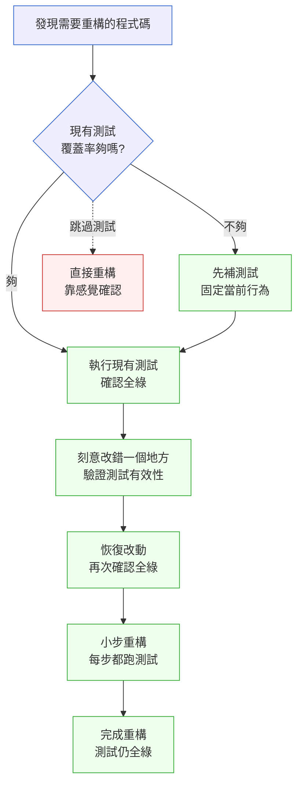

# 第 8 章｜重構的時機與安全網
## ⸺ 不是程式碼壞了才重構,而是你每次路過都順手整理一點

> **前置閱讀**:[第 7 章｜控制複雜度](./ch-07-complexity.md)、[第 5 章｜可讀性:為下一個人而寫](./ch-05-readability.md)
> **下游章節**:[第 9 章｜程式碼層的技術債](./ch-09-tech-debt.md)、[第 11 章｜單元測試與 TDD 的落地](../part-03-testing/ch-11-unit-testing-tdd.md)

## 8.1 共感現場:「我知道這裡很亂,但現在不是時候」

你可能也說過這句話。

我帶過一位工程師,就叫她小葦吧。她在一家做電子病歷(Electronic Medical Record,EMR)系統的醫療科技公司 MedChart 任職,負責維護一個已經運行四年的處方簽核模組。這個模組最初只要處理三種藥品類別,後來業務擴張,慢慢長到支援十七種,中途換過兩個主要開發者,也歷經一次資料庫遷移。

小葦第一次打開那個核心函式的時候,跟我說:「這個函式有三百行,裡面有五層 if,每層在做什麼我要讀很久才能確認。但是下週有新的藥品類別要上線,我不敢動它。」

這個情況你應該不陌生。那種「我知道這裡很亂,但現在不是時候」的感覺,不是因為你懶,也不是因為你不知道應該整理——而是因為你沒有安全網。動了之後萬一出事,責任全在你身上;不動的話,雖然難受,但至少是「熟悉的難受」。

於是,新功能一個一個疊上去,函式從三百行長到四百行,再到五百行。每次加功能的人都說:「等這波忙完再來整理。」但那個「忙完之後」從來沒有到來。

這裡有個細節值得注意:小葦不是第一個有這種念頭的人,也不會是最後一個。在 MedChart 的 git log 裡,你看得到每個加過這個函式的工程師,在 commit message 裡留下了幾乎一模一樣的痕跡:「先跑起來,之後再整理」。四年下來,這段「之後」的欠債,就變成了現在這個讓人不敢碰的三百行函式。

更深一層來看,這種情況還帶著一種很微妙的焦慮:不是因為你對這段程式碼一無所知,而是因為你「知道一半」。你大概知道它在做什麼,但你不完全確定每一個條件分支的邊界。就是這個「大概知道」的狀態,讓重構比完全不知道還難開口——你沒有藉口說「我不懂,讓我從頭讀一遍」,但你也沒有足夠的把握說「我改了這裡,確認不會壞那裡」。

順著這個道理,我們要聊的核心問題不是「重構值不值得」——大多數工程師心裡都知道值得——而是:**重構的時機是什麼,安全網怎麼鋪,才能讓你有勇氣動手**。

## 8.2 真正的問題:「怕動」的原因只有一個

我們把小葦的狀況慢慢拆開來看,你會發現有趣的事情。

表面上,她說不敢動是因為「時間壓力」。可是就算給她一週,她可能還是會猶豫。真正讓她卡住的,不是時間,而是**沒有辦法知道自己改了之後有沒有壞掉東西**。那個函式支撐著處方簽核的流程,一旦出錯,病人可能收到錯誤的處方資訊——這個風險大到讓人動彈不得。

也就是說,問題的本質是:**重構的阻力,來自缺乏可驗證性**。你不知道「改了以後,我怎麼確認它還是對的」。

換個角度看:如果那個函式旁邊有一套完整的測試,每次你改完跑一遍,紅燈就知道哪裡壞了,綠燈就知道行為還在——你還會那麼怕嗎?多半不會。怕的不是修改程式碼這件事本身,怕的是修改後的黑洞:你不知道發生了什麼。

這就帶出了「重構」這個詞最重要的一個前提:**重構的定義,是在不改變外部可觀察行為的前提下,改善程式碼的內部結構**。Martin Fowler 在《Refactoring: Improving the Design of Existing Code》(第二版,2018)裡給出這個定義的時候,特別強調「外部可觀察行為不變」這個約束——它不是裝飾性的補充說明,而是整個概念的核心。這個定義本身就包含了「你需要有方法驗證外部行為沒有改變」的要求。沒有測試就沒有這個驗證方式,於是重構在事實上變成了賭博——高風險的賭博。

正因為這個原因,測試不是重構的「可選配件」,而是重構的**先決條件**。這兩件事在工程上是綁在一起的:先鋪安全網,才能安心清掃。

值得多說一句的是:「沒有測試就不能重構」並不是說你永遠得等到測試完美了才能動。很多程式碼的初始狀態就是沒有測試,然後你需要重構。這種情況的解法是先補測試——把現有的行為固定下來,然後再動。這個「先補測試」的步驟不是多餘的前置工作,它本身就有很高的價值:它逼著你把「這段程式碼在所有情況下應該怎麼行為」這件事說清楚,很多時候你在補測試的過程中就會發現原有的 bug 或者模糊的規格。

## 8.3 一起做判斷:四個原則讓你知道什麼時候該動手、怎麼動手

既然我們知道問題的根源了,接下來就是實際的問題:什麼時候該重構?要怎麼重構?安全網要怎麼鋪?

這一節介紹四個相互補充的原則,它們不是孤立的清單,而是有順序和邏輯的:先知道「什麼訊號提示你該動手」(三次法則)、再知道「日常如何持續小幅改善」(童子軍規則)、再知道「動手之前要準備什麼」(測試先行)、最後知道「執行中如何保持安全」(小步前進)。四個原則一起用,才是完整的重構工作方式。

### 8.3.1 「三次法則」:重複到第三次,就是重構的訊號

有個很好記的原則叫「三次法則」(Rule of Three),出自 Martin Fowler 的《Refactoring》。

第一次實作某個邏輯:直接寫,不用管。
第二次遇到類似邏輯:覺得可以抽,但也可以先忍著。
第三次遇到類似邏輯:**停下來,抽它**。

為什麼是三次而不是兩次?因為「兩個地方有一樣的東西」可能是巧合;「三個地方有一樣的東西」幾乎一定是設計的問題。而且三次之後你也對這個邏輯夠熟了,知道它真正的邊界在哪裡,抽象的時候不容易抽錯。

在小葦的 MedChart 案例裡,三次法則的訊號其實很早就出現了。第四個藥品類別上線的時候,驗證邏輯的某個片段就已經在三個地方出現了:一次在 `_validate_antibiotic()`,一次在 `_validate_controlled()`,一次在剛加的新類別裡。但那時候沒有人意識到這是「第三次」,於是到了第十七個類別的時候,重複的片段已經散落在整個函式的各個角落了。

讓我把三次法則的觸發條件說得具體一點:

| 現象 | 第幾次 | 建議行動 |
|---|---|---|
| 某段邏輯第一次出現 | 1 | 直接寫,不需要任何抽象 |
| 非常相似的邏輯第二次出現 | 2 | 注意到它,但可以暫時忍耐 |
| 第三個地方又出現相似邏輯 | 3 | 停下來抽象,現在是最好的時機 |
| 已經抽象但又有分歧出現 | 再次評估 | 抽象可能太早或邊界不對,重新審視 |

順著這個道理,三次法則背後的精神是:**重構的最佳時機不是「先設計好再寫」,而是讓現實告訴你什麼東西值得被抽出來**。第一次你不夠了解它;第二次你開始有感覺;第三次你才真正知道它的邊界在哪裡,這時候抽象才不容易抽錯。

這個原則還有一個很重要的隱含意思:你不需要在第一次設計的時候就「預測未來」,想著「這個邏輯以後可能會在別的地方用到,所以我要先抽出來」。這種預測式的提前抽象,往往因為還沒有看到足夠多的使用場景,抽出來的介面設計不對,反而造成更多的複雜度。讓三次法則告訴你「現在了」。

### 8.3.2 「童子軍規則」:每次路過都讓它比你來時更乾淨一點

美國童子軍有個規矩:離開營地的時候,讓它比你到的時候更乾淨。Robert C. Martin 把這個精神帶進了軟體工程:**每次你修改一段程式碼,讓它比你打開的時候稍微好一點點**。

不需要一次重構整個模組。你今天只是要加一個參數驗證,就順便把那個太長的函式名稱改清楚;你今天要修一個 bug,就順便把旁邊那段重複的邏輯抽成一個小函式。每次一點點,幾個月下來,程式碼就有了顯著的改善——而且這些改變都很小,風險很低。

童子軍規則在實務上的樣貌大概是這樣:

**可以順手做的「童子軍改善」清單:**

- 把一個含糊的函式名稱改成能說明意圖的名稱(例如:把 `process()` 改成 `validate_prescription_expiry()`)
- 把一個「神奇數字」(magic number)改成有名字的常數(例如:`90` 改成 `MAX_PRESCRIPTION_DAYS = 90`)
- 把一個超過 20 行的函式裡有自己完整邏輯的段落,抽出來成為一個小函式
- 把一段沒有說明「為什麼這樣做」的複雜判斷,加上一行注釋
- 把過時的注釋(描述的是程式碼三個月前的行為)刪掉或更新

**不適合當成「童子軍改善」的事:**

- 重新設計整個模組的介面
- 改變對外的 API 簽名
- 移動資料夾或重新組織模組結構
- 在還沒有測試覆蓋的地方做大幅改動

這個區分的邏輯是:童子軍改善必須是「低風險、改完馬上可以確認的」。如果改動的範圍大到需要額外的計畫和測試,那就不是童子軍改善,而是一次有意識的重構行動——需要用後面會說到的「重構決策卡」來規劃。

這個做法的好處是:它不需要你申請一個「重構 sprint」,也不需要技術主管特別批准時間。它就藏在你日常的工作裡,是你每次開票、每次修 PR 自然做的事。累積起來的效果,比一年一次的「大清掃」要持久得多。

### 8.3.3 「測試先行」:安全網要在你動刀之前就在

這是最關鍵的一步,也是最常被跳過的一步。正因為它最常被跳過,所以我們多花一點時間說清楚。

重構的流程應該是這樣的:



你注意到圖裡那條虛線了嗎?那條虛線就是大多數人真正走的路:看到問題,覺得改法很直觀,就直接動手,靠「感覺」來確認有沒有壞掉。

這條路有時候走得通。但它的風險是不可預測的——你踩到地雷的時候,你不知道地雷在哪裡,也不知道自己什麼時候踩到的。

正確的路是圖裡實線那一條:**先確認測試存在且是綠的,再開始動**。如果測試不存在,就先補測試——這個「補測試」的過程,本身就很有價值,因為它逼著你把現有行為讀清楚、寫成可以被驗證的形式。

這裡有一個很重要但很少人提到的步驟:在確認現有測試是綠的之後,還要做一件事——**刻意把你打算重構的那個函式改錯一個地方**,看看有沒有測試變紅。如果改錯了沒有任何測試紅掉,代表那些測試根本沒有保護到你要改的地方——它們是「假安全感」。這時候你需要補針對那個地方的測試,然後再回來重構。

這個「刻意改錯」的步驟叫做「變異測試」(Mutation Testing)的手動版本。你不需要工具,手動做就夠了:把一個 `and` 改成 `or`、把一個 `>` 改成 `>=`、把一個條件反轉,看看哪些測試紅掉。紅掉的測試告訴你「這裡有保護」;沒有紅掉代表「這裡的保護是空的」。

### 8.3.4 「小步前進」:一次只動一件事

重構的另一個常見失誤,是一次動太多。你想把函式拆小、也順便改參數型別、也順便重組資料夾結構——結果你面對的是一個大到難以 review 的 PR,而且如果出了問題你也不知道是哪個改動造成的。

小步前進的原則是:**每一步重構,只做一種類型的改動;改完,測試跑一遍;確認綠了,再做下一步**。每一步都要能回答「如果出了問題,我知道是這一步造成的」。

什麼叫「一種類型的改動」?這裡有幾個具體的例子:

- **只做重新命名**:把函式名稱、變數名稱改得更清楚。不在這一步動任何邏輯。
- **只做提取函式(Extract Function)**:把一段完整的邏輯移進一個新函式。原本的呼叫點改成呼叫這個新函式。邏輯內容不變。
- **只做提取常數**:把 magic number 或 magic string 改成具名常數。
- **只做移動邏輯**:把一段邏輯從 A 函式移到 B 函式。
- **只做扁平化條件**:把深層 if/else 改成早期 return(Early Return)的形式。

每一種改動各自是一個步驟。做完一步,提交一個小 commit,跑測試,確認綠了,再做下一步。

這個工作方式有一個額外的好處:你的 git log 會變成一份重構的日記。六個月後有人想知道「這個函式是怎麼從三百行拆成這樣的」,他可以一個 commit 一個 commit 地往前看,每一步的意圖都很清楚。這比「一個大 commit 把三百行的函式整個換掉」要友善得多。

下面這張表整理了四個判斷維度,幫你在實際狀況裡做決策:

| 判斷維度 | 訊號:可以開始 | 訊號:先暫停 |
|---|---|---|
| **測試覆蓋** | 核心路徑都有測試、跑一遍全綠,且刻意改錯後有測試變紅 | 沒有測試,或有測試但改錯後沒有任何測試紅掉 |
| **改動範圍** | 這一步只動一種東西(命名/抽函式/移邏輯) | 想一次改很多種東西 |
| **時間壓力** | 新需求上線前至少三個工作天 | 明天就要上線 |
| **是否理解現有行為** | 能說清楚這段程式碼在所有輸入下的行為 | 還在猜它某些情況下做什麼 |

這張表不是要你每次都四條全對才能動。它的用途是幫你意識到「我現在是在安全的狀況下重構,還是在風險很高的狀況下賭」。兩者都是決策,但得是有意識的決策。

### 8.3.5 「重構失敗了怎麼辦」:出了問題時的復原策略

說完如何安全地重構,還有一件事值得聊:如果即使做了上面這些,重構還是出了問題,怎麼辦?

這種情況比你想像的要常見——不是因為你做錯了什麼,而是因為有些邊界條件是測試覆蓋不到的,或者某些系統行為的細節本來就沒有文件記錄。重要的是,出了問題的時候,你要能快速找到問題在哪裡,然後決定要修正還是回滾。

以下幾個恢復策略在實務上很有用:

**策略一:小步提交讓你有可以回去的「錨點」。**

每一個小步驟提交一個 commit,是有意義的。當出了問題,你可以用 `git bisect` 或者手動 `git revert` 定位到具體哪一步出了問題。如果問題出在第三步,你只需要 revert 第三步,不需要把整個重構都撤銷。

**策略二:用 feature flag 隔離重構後的程式碼。**

對於高風險的模組(例如 MedChart 的處方簽核),你可以引入一個簡單的 feature flag,讓新的重構後程式碼和原始程式碼都存在,由 flag 決定走哪條路。上線之後先讓少量流量走新路,確認穩定之後再切換全部流量。這種做法稱為「平行運行」(Parallel Run)或「Strangler Fig」模式,在高風險的遺留系統重構中很常見。

**策略三:在 PR 描述裡記錄「我預期這個重構不會改變的行為」。**

這句話很簡單,但它的作用是：把你對「重構正確性」的預期說清楚,讓 reviewer 可以對著這個預期做針對性的檢查,也讓未來的人知道這個 PR 的意圖。如果之後發現行為確實改變了,這份記錄也能幫你快速定位哪裡的預期出了偏差。

**什麼時候該直接回滾、什麼時候該修正:**

| 情況 | 建議行動 |
|---|---|
| 問題出在你可以快速定位的那一步 | 修正那一步,重新提交 |
| 問題影響到已上線的服務,且原因不明 | 先回滾到重構前的狀態,再花時間定位 |
| 問題是測試覆蓋沒有保護到的邊界條件 | 先補測試固定那個邊界條件,再重新執行重構 |
| 問題是設計層次的,重構後的介面設計不對 | 回滾,重新設計,不要在錯誤的基礎上繼續修補 |

這幾個策略的共同精神是:**出問題不是失敗,找不到問題在哪裡才是真正的問題**。小步前進 + 測試先行 + 清楚的 commit 記錄,就是讓你在出問題的時候能快速找到問題的工具。

## 8.4 容易絆倒的地方

說完怎麼做,讓我們來看幾個幾乎每個工程師都走過的彎路。這裡沒有要指責誰,因為這些彎路很自然,通常是在沒有前輩說清楚的情況下的自然反應。

**絆倒處一:把「重構」和「加功能」混在一起做。**

「我今天要加一個功能,順便把這個模組整個重寫一下。」這句話背後的善意是真的——你想一次把事情做好——但它的問題是:當這個 PR 出現問題的時候,你不知道是新功能造成的還是重構造成的。兩件事纏在一起,debug 的成本翻倍。

這個問題有個名字:「重構與功能開發同時進行」。Martin Fowler 把它比喻成「一邊換輪胎一邊開車」——每一件事單獨來都可行,但同時來就危險了。

> **修正方向**:開兩個 PR。第一個只做重構,測試全綠;第二個再加功能。多一個 PR 的成本,換來出問題時清晰的邊界,通常是划算的。如果工作量真的不允許分開兩個 PR,最低限度也要在 commit message 裡把「重構 commit」和「功能 commit」分開,讓 git log 看得出來兩者的界線。

**絆倒處二:重構之前沒有確認測試的有效性。**

「我們有測試啊。」但那些測試是不是真的在驗證你要改的那段邏輯?有時候你會發現測試是綠的,但它測的其實是別的東西;或是它的斷言太寬鬆,改壞了也不會紅。這種「假安全感」比完全沒有測試更危險,因為它讓你以為有保護。

在 MedChart 的例子裡,小葦發現的正是這個問題:現有的 8 個整合測試覆蓋了 happy path,但都沒有測試「空白藥品名稱」和「過期日期格式錯誤」這兩個邊界條件。她做了刻意改錯的驗證,把 `validate_expiry()` 的日期格式判斷故意改錯,只有 1 個測試變紅——代表這個判斷在大多數測試路徑裡根本沒有被跑到。

> **修正方向**:重構開始前,刻意做一件事:把你打算改的那個函式,先故意改錯一個小地方(比如把一個條件反轉),看看有沒有測試變紅。如果沒有任何測試紅掉,那代表現有測試沒有保護到這裡——先補測試再繼續。

**絆倒處三:重構等到「有空的時候」。**

「我知道這段要整理,下個 sprint 再說。」這句話說了三個 sprint 之後就消失在待辦事項裡了。問題不是你的意志力不夠,而是「下個 sprint 再說」在本質上就是一個不會被執行的計畫——因為永遠都有更緊急的事。

有一個很容易觀察到的現象:「重構 backlog」裡的項目,幾乎從來不會被拿出來排進 sprint。它們就靜靜地待在那裡,直到某天又撈出來看一眼,然後繼續待著。原因很簡單:在 planning 的時候,一個「修新功能」的票總是比一個「整理程式碼」的票更容易得到優先順序。

> **修正方向**:練習「童子軍規則」。不要計畫一個大重構,而是讓每次修改都帶著一個小改善。把「重構時間」消化在日常的 PR 裡,它就不會一直被推後。如果你的 team 有 code review 文化,可以在 PR 模板裡加一個欄位:「這個 PR 有沒有順手做一個童子軍改善?」讓它成為工作流程的一部分。

**絆倒處四:AI 幫你重構,但你沒有驗證行為是否相同。**

這個是近年才出現的狀況。你把函式貼給 AI,說「幫我整理一下」,它給你一個看起來更乾淨的版本。你覺得邏輯差不多,就貼上去了。但「看起來一樣」和「行為完全相同」之間,可能有很細微的差距——比如邊界條件的處理、例外的拋出方式、null 值的行為、浮點數比較的細節——而這些差距在 happy path 的測試裡不會顯現。

AI 的重構建議通常在「結構上的清晰度」很強——它可以把一個深度巢狀的 if/else 改得很扁平、把重複的邏輯抽成函式、把命名改得更清楚。但它對「業務邏輯的邊界條件」的掌握,完全依賴於它在你的 prompt 裡看到的內容。如果有某個邊界條件沒有在函式的注釋或測試裡說清楚,AI 很可能就悄悄地把它改掉了——而且還是用一種「看起來更合理」的方式改掉的。

> **修正方向**:AI 重構的結果,要和你自己重構一樣對待:先確認有測試,改完讓測試跑一遍。AI 讓重構「變快」,但不讓重構「變安全」——安全的部分還是靠測試。特別要注意的是:讓 AI 看你的測試,讓它知道有哪些邊界條件需要保留;或者在給 AI 的 prompt 裡明確列出「這些行為絕對不能改變」。

**絆倒處五:在沒有任何測試的「遺留程式碼」上硬重構。**

這是一個特殊情況,但在現實的工作環境裡非常普遍。你接手一個沒有測試的老模組,你知道它需要重構,但你也知道如果先補測試可能要花好幾天。這個兩難怎麼辦?

有一個實用的做法叫「特徵測試」(Characterization Testing),出自 Michael Feathers 的《Working Effectively with Legacy Code》。做法是:不要試著理解所有的業務邏輯,而是直接把函式現有的輸入輸出記錄下來,把「現在的行為」本身當成測試的規格。例如:給定一個真實的輸入,紀錄現在的輸出,然後把這個輸入/輸出對寫成一個測試。即使你不確定「現在的輸出是不是正確的」,至少你知道「重構之後的輸出要和重構之前一樣」——這就夠了,這就是你的安全網。

> **修正方向**:從「特徵測試」入手。不需要完整理解業務邏輯,先把現有行為固定成測試,再開始動。從最有把握的輸入輸出對開始,逐步擴大覆蓋範圍。

## 8.5 帶得走的工具 ⸺ 一頁式「重構決策卡」

每次你面對一段需要整理的程式碼,這張卡片幫你在開始動手之前,把該想的事情過一遍。它的目的不是讓你猶豫更久,而是讓你動得更安心。

```text
重構決策卡 ⸺ {模組/函式名稱}

【觸發原因】
- 三次法則:□ 第三次看到相似邏輯
- 童子軍:□ 修改過程中順手改善
- 技術債清理:□ 明確的計畫性重構
- 其他:___________

【動手前:安全網確認】
- 重構的範圍:{要動哪個函式/哪個模組,具體到行數}
- 現有測試狀況:{有/沒有,覆蓋了哪些路徑,哪些路徑是空洞}
- 行為驗證方式:{跑哪些測試來確認行為沒變}
- 測試有效性確認:{刻意改錯了 ___ 的地方,有 N 個測試變紅 → 安全網有效}
  若安全網不足:□ 先補以下測試 → ___________

【執行計畫:小步前進】
- 第 1 步:{只做一種改動,例如:把重複邏輯抽出函式}
- 第 2 步:{確認綠燈後的下一步}
- 第 3 步:{...}
- 不在這次範圍內:{這次刻意不動的東西,記下來留待下次}

【出問題時的回退點】
- 如果重構後出問題,可以 git revert 到哪個 commit
- 是否需要 feature flag 保護高風險切換

【完成後確認】
- 測試結果:{全綠 ✓ / 哪裡紅了,如何處理}
- 行為是否改變:{沒有 / 有,原因是}
- 這次有沒有順手帶一個童子軍改善:{有 / 沒有,下次可以留意}
- PR 描述已記錄「預期不改變的行為」:{□ 是}
```

這張卡有幾個區塊,各自在不同時間點使用:第一區塊「觸發原因」讓你意識到「為什麼現在要重構」;第二區塊是在「動手之前」用的,確認安全網在;第三區塊是在「執行中」用的,提醒你一次只做一件事;第四區塊是「準備回退點」,在出問題時讓你有路可退;第五區塊是在「完成後」用的,讓這次重構的經驗可以被沉澱。貼在 PR 描述裡就是一份清晰的記錄。

### 8.5.1 範例:MedChart 處方簽核模組的重構記錄

還記得小葦和那個三百一十二行的處方簽核函式嗎?她沒有一口氣把整個模組重寫,而是用了這張卡片,花了三個禮拜,一小步一小步地把它整理好。

讓我們跟著她的工作日誌,把這三週的過程說得具體一點。

**第一週:安全網建立**

小葦開始之前先跑了一遍現有的 8 個整合測試,全部通過。但她沒有就此停下來——她做了刻意改錯的驗證:把 `validate_expiry()` 裡的 `>=` 改成 `>`(一個細微的邊界條件改動),結果只有 1 個測試紅掉。這個結果告訴她:現有測試對邊界條件的保護是脆弱的。

於是第一週的工作就是:補邊界條件測試。她補了 4 個測試:
- 空白藥品名稱
- 過期日期格式錯誤(YYYY/MM/DD 而非 YYYY-MM-DD)
- 超過 `MAX_PRESCRIPTION_DAYS`(90天)的處方
- 同時包含受管制藥品和一般藥品的混合處方

補完之後,刻意改錯的驗證結果改變了:同樣的邊界條件改動,現在有 4 個測試紅掉。安全網到位了。

**第二週:第一次重構 — 提取子函式**

有了安全網,小葦開始執行重構計畫。她按照小步前進的原則,每一步只做一種改動:

第一步:把驗證邏輯依藥品類別拆成獨立函式。原本的 `validate()` 裡面是一個大的 if/elif 串,每個類別的驗證邏輯直接寫在裡面。她把每個類別的邏輯移出去,各自變成 `_validate_antibiotic()`、`_validate_controlled()`、`_validate_otc()` 三個函式,原本的 if/elif 改成呼叫這三個函式。

做完這一步之後,她跑了一遍測試:12 個全綠。提交一個 commit:`refactor: extract per-category validation into dedicated methods`

第二步:把入口函式 `validate()` 從 312 行縮短。前一步把邏輯移出去之後,入口函式變成了一個呼叫各子函式的協調者,但還是有一些散落的邏輯需要清理。她再次提取:把日期格式正規化的邏輯移進 `_normalize_date_format()`,把藥品類別的路由邏輯移進 `_dispatch_by_category()`。

做完這一步之後:12 個測試全綠。提交:`refactor: extract date normalization and category dispatch`

**第三週:童子軍改善 + PR 審查**

第三週的工作主要是收尾和童子軍改善:

- 把所有 magic number 改成具名常數:`MAX_PRESCRIPTION_DAYS = 90`、`MAX_CONTROLLED_QUANTITY = 30`
- 補齊所有子函式的 docstring,說明每個函式的職責和預期的輸入格式
- 新增 4 個針對最新藥品類別的測試,覆蓋第十七個類別的驗證邏輯(這也是當初觸發三次法則的那個地方)

最終狀態:

這是小葦完成後的重構決策卡:

```text
重構決策卡 ⸺ PrescriptionValidator.validate()

【觸發原因】
- 三次法則:✓ 第十八個藥品類別需求進來時發現驗證邏輯已在四個地方重複

【動手前:安全網確認】
- 重構的範圍:PrescriptionValidator.validate() 主函式(目前 312 行)
- 現有測試狀況:8 個整合測試,覆蓋常見藥品類別的 happy path;
  邊界條件(空白藥品名稱、過期日期格式錯誤、混合藥品)沒有測試
- 行為驗證方式:pytest -v tests/test_prescription_validator.py
- 測試有效性確認:把 validate_expiry() 的 >= 改成 >,只有 1 個測試紅掉
  → 安全網不足,補測試後變成 4 個紅掉 → 安全網到位
  補充的測試:空白藥品名稱、日期格式錯誤、超過90天、混合藥品

【執行計畫:小步前進】
- 第 1 步:提取 _validate_antibiotic / _validate_controlled / _validate_otc
  (每個類別的驗證邏輯獨立成函式)→ 測試全綠後 commit
- 第 2 步:提取 _normalize_date_format / _dispatch_by_category
  (入口函式縮短為協調者)→ 測試全綠後 commit
- 第 3 步:童子軍改善:magic number → 具名常數、補 docstring
- 不在這次範圍內:重組資料夾結構、修改外部呼叫介面

【出問題時的回退點】
- 每一步都有獨立 commit,可以 git revert 到任意步驟
- 不需要 feature flag(此模組已有完整測試保護)

【完成後確認】
- 測試結果:全綠 ✓(8 個原有 + 4 個邊界條件 + 4 個新類別 = 16 個)
  三週結束後追加至 20 個,覆蓋所有子函式
- 行為是否改變:沒有
- 童子軍改善:有 ⸺ magic number → MAX_PRESCRIPTION_DAYS = 90、
  MAX_CONTROLLED_QUANTITY = 30,所有子函式補 docstring
- PR 描述已記錄「預期不改變的行為」:✓
```

三個禮拜後,那個函式從 312 行拆成了三個各 35-50 行的子函式,加上一個 30 行的入口函式。測試從 8 個長到了 20 個,覆蓋了之前的空洞。

第十八個藥品類別的需求進來的時候,小葦花了不到半天就加進去了——因為她現在知道只要新增一個 `_validate_new_category()` 函式、在 `_dispatch_by_category()` 加一行路由、再補幾個測試就好。那種「不敢動」的感覺消失了,因為安全網在。

重構不是讓程式碼「更漂亮」這麼抽象的事——它讓下一次改動從半天變成半個小時。這個差距,是你和你的團隊每天都在還的一筆帳,或者在收的一筆紅利。

## 8.6 本章回顧

讀完這一章,你應該已經能:

- [ ] 說清楚重構的定義:在不改變外部行為的前提下改善內部結構,而這個定義本身要求測試的存在
- [ ] 用「三次法則」判斷什麼時候該把重複邏輯抽出來,而不是過早設計抽象
- [ ] 實踐「童子軍規則」:讓每次修改都帶著一個小改善,而不是等待一個「重構 sprint」
- [ ] 在重構開始前,用「刻意改錯一個地方」的方式確認測試有效性,而不只是確認測試是綠的
- [ ] 開兩個 PR:重構一個、加功能一個,讓改動邊界清晰
- [ ] 當重構出了問題,用小步提交的 git log 定位問題所在,而不是回滾整個重構

如果想先從一件事開始,我會建議——**下次你打開一個需要修改的函式,先做一件事:確認旁邊有沒有測試,跑一遍,再刻意改錯一個地方,看看有幾個測試紅掉**。不需要立刻重構整個模組,就只是這一件事。一旦你知道安全網是真實有效的,「敢不敢動」這個問題就有了不一樣的答案。

## Cross-References

- **下一章**:[第 9 章｜程式碼層的技術債](./ch-09-tech-debt.md) ⸺ 重構是償還技術債的手段,下一章談怎麼辨識、量化與記錄它
- **前置閱讀**:[第 7 章｜控制複雜度](./ch-07-complexity.md) ⸺ 圈複雜度過高是觸發重構的最常見訊號之一
- **強連結**:[第 5 章｜可讀性:為下一個人而寫](./ch-05-readability.md) ⸺ 重構的成果很多時候就是可讀性的提升
- **強連結**:[第 11 章｜單元測試與 TDD 的落地](../part-03-testing/ch-11-unit-testing-tdd.md) ⸺ 本章說安全網要在,第 11 章說怎麼鋪
- **強連結**:[第 37 章｜審查 AI 生成的程式碼](../part-08-ai-era/ch-37-reviewing-ai-code.md) ⸺ AI 重構的結果同樣需要測試守護
- **跨書連結**:[SA/SD Playbook ⸺ 可維護性設計](https://github.com/EddyKuo/sa-sd-playbook) ⸺ 設計層的可維護性與程式碼層的重構是同一個目標的不同高度
