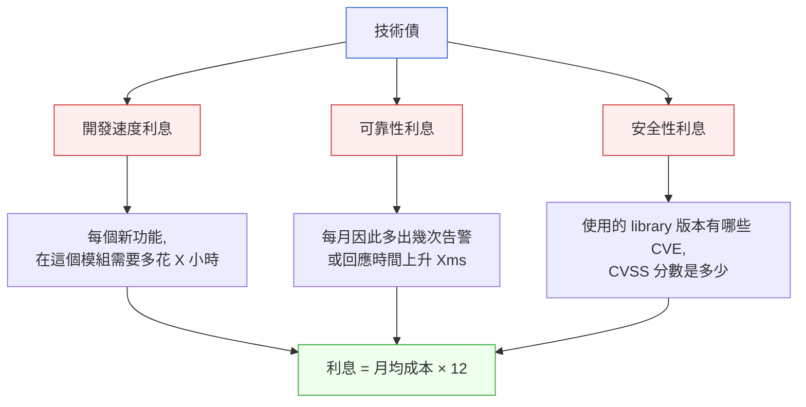
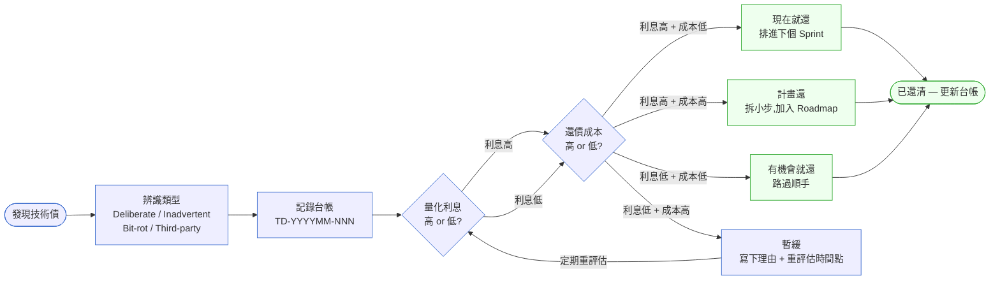

# 第 9 章｜程式碼層的技術債
## ⸺ 不是不還,是要知道欠了什麼、利息多高

> **前置閱讀**:[第 8 章｜重構的時機與安全網](./ch-08-refactoring.md)
> **下游章節**:[第 10 章｜可測試的程式碼設計](../part-03-testing/ch-10-testable-code.md)

## 9.1 共感現場:那個「等我有空再整理」的地方

你可能也認識那個角落。

每個活著夠久的程式碼庫裡,都有那麼一個地方。大家心知肚明,但打開 IDE 的時候會不自覺地繞道走。那個檔案可能叫 `OrderService.java`,也可能叫 `checkout_handler.py`——名字不重要,重要的是打開它的那一刻,心裡會有一句無聲的「等我有空再整理」。

我帶過一個電商團隊,叫他們 BuyNow。他們有一套跑了三年的訂單系統,核心是一支叫 `processOrder()` 的方法——五百行,if-else 巢狀了四層,注釋是英文、中文、還有三行被 comment 掉的舊邏輯。沒有人記得為什麼。

每次有新需求進來,工程師就捏著鼻子找到那個最像的 if-else 分支,在後面多加一個 `else if`。需求交付了,但那個方法又胖了一些,速度也慢了一點點——壓測顯示平均回應時間每個月悄悄爬升 8ms,沒有人注意,因為單次來看根本感覺不到。

直到有一天,電商大促,流量衝上去,原本 8ms 的累積就在那個最大的峰值裡被放大了數十倍。不是系統掛掉,但回應變慢到讓棄單率升高了——促銷的每一個小時都在虧損。

事後 postmortem 裡,有工程師說了一句讓大家沉默的話:「我們其實早就知道那個方法有問題,只是一直沒空處理。」

那種感覺,很多人都懂。不是不想處理,是每次要動它的時候,代價看起來都很高、收益看起來都是「以後的事」。這就是技術債最難的地方——它從來不會大聲敲門,它只是每天悄悄收一點利息,直到有一天利息壓垮了你。

## 9.2 真正的問題:技術債不是一個感覺,而是一筆帳

把這件事慢慢拆開來看,你會發現 BuyNow 的問題,並不是那幾個工程師太懶或太忙。

問題的第一層:**技術債從來沒有被看見過**。

那個 `processOrder()` 爛了三年,但沒有人能回答:「它現在的技術債估計是多少?每個月在收多少利息?」這不是無法知道,而是從來沒有人問過、記錄過。大家只有一個模糊的感覺「那個地方很亂」,但感覺不能用來做決策。

也就是說,技術債的第一個真正問題,不是「如何還清」,而是「根本不知道欠了多少」。一個不知道金額的債務,你沒辦法排優先序,也沒辦法跟任何人說明要花多少時間來處理它。

問題的第二層:**「利息」是隱形的**。

BuyNow 那個每月 8ms 的回應時間上升,沒有人特別在意——因為它從來沒有被轉換成一個看得見的數字。如果有人算過「回應時間每增加 50ms,棄單率約上升 1%,換算成月收益損失是 X 萬」,那它就不再是個技術問題,而是個可以和 PM、管理層溝通的業務問題。隱形的利息,是技術債最危險的特徵。

問題的第三層:**「什麼時候該還」沒有框架**。

當工程師說「等我有空再整理」,通常不是真的在等空檔——而是不知道「整理這件事的優先序,跟眼前的功能需求比起來,到底誰先」。沒有框架的時候,緊急的事情永遠贏,技術債永遠輸。

順著這個道理,我們就能看出這一章真正要做的三件事:讓債務可見(辨識並記錄)、讓利息可算(量化成本)、讓決策有依據(何時還、何時暫緩)。

## 9.3 一起做判斷

### 9.3.1 辨識:什麼算是技術債?

技術債這個詞有時候被用得太寬,什麼都往裡塞,反而失去了判斷力。一個好用的區分方式,是看「欠債的原因是什麼」:

| 類型 | 成因 | 典型形狀 | 是否要還 |
|---|---|---|---|
| **刻意債(Deliberate)** | 趕時間、明知故犯、選擇走捷徑 | TODO 加一個 deadline 的注釋 | 是,通常有還的計畫 |
| **意外債(Inadvertent)** | 設計認知不足、當時以為對 | 後來才發現某個設計決策錯了 | 視代價決定 |
| **位移債(Bit-rot)** | 功能需求不斷演化,舊設計沒跟上 | 一個本來清楚的方法,隨版本疊加變混亂 | 視影響範圍決定 |
| **外部債(Third-party)** | 依賴過時版本、廢棄 API | 還在用某個 EOL 的 ORM | 有安全風險的優先 |

BuyNow 的 `processOrder()` 屬於「位移債」加上一些「刻意債」的混合——早期某個版本可能設計得還好,但三年來每個功能都往裡塞,設計的原始形狀早就面目全非了。

在電商情境之外,這四種類型也在各個領域反覆出現。一個 SaaS 計費平台可能有「外部債」——依賴某個 Stripe 的 v2 API,對方已經廢棄了,但遷移到 v3 一直被功能需求擠掉(Third-party 債,有安全和合規風險)。一個醫療系統可能有「意外債」——工程師當初以為 HL7 v2 的訊息格式會長期穩定,結果醫院合作方升版後欄位定義偏移了,不是當初沒認真,而是後來才知道(Inadvertent 債,難以事先預防)。看到類型,才能選對處理方式——「意外債」通常需要重新設計而不只是清理,「外部債」則需要盯著 changelog 和 CVE 的節奏。

辨識的第一步,是看到這個分類之後,問自己:「這筆債,是哪個類型?它是因為什麼而存在的?」有了原因,才有辦法討論處理方向。

### 9.3.2 記錄:技術債台帳(Tech Debt Ledger)

光是辨識還不夠。一個只存在工程師記憶裡的技術債,等於不存在——換人、放假、忙起來,它就消失了。所以技術債需要被記錄成一份「台帳(Ledger)」。

台帳不需要很複雜。它的目的是讓技術債從「感覺」變成「可以討論的項目」。每一筆記錄至少要有以下欄位:

```
Tech Debt Ledger Entry
───────────────────────
ID           : TD-{YYYYMM}-{NNN}
標題          : {一句話描述}
位置          : {檔案 / 模組 / 服務}
類型          : Deliberate | Inadvertent | Bit-rot | Third-party
影響描述       : {對速度/可讀性/可靠性/安全的具體影響}
利息估算       : {定性: 低/中/高} + {定量: 若有數字}
觸發條件       : {什麼情況下這筆債會讓你痛}
還債估計       : {工時估算} × {信心度: 低/中/高}
暫緩理由       : {若決定先不還,寫下原因和重新評估時間點}
負責人         : {誰知道最多}
建立日期       : {YYYY-MM-DD}
```

為什麼要有「暫緩理由」這個欄位?因為技術債不是每筆都要馬上還,但「暫緩」和「遺忘」之間的差別,就在於有沒有白紙黑字寫下「為什麼現在不還、什麼時候要重評估」。有了這個欄位,暫緩就是一個決定,而不是一個逃避。

這份台帳可以放在任何地方——Jira、Notion、一個 Git 倉庫裡的 Markdown 檔——工具不重要,重要的是「這份清單存在、而且有人定期看」。

### 9.3.3 量化利息:讓隱形成本現形

這一步最難,也最有效。記錄了債務之後,接下來要想辦法讓利息變得可見。

利息有幾種形式,可以依實際情況選擇能量化的那個:



以 BuyNow 的案例為例:

- **開發速度利息**:工程師在 `processOrder()` 加一個新 feature,平均要多花 3 小時(因為要讀懂龐大的 if-else、跑一圈迴歸、擔心改壞其他邏輯)。團隊一個月改這個方法 4 次,那就是每月 12 小時的利息,換算成工程師成本大約是 N 元。
- **可靠性利息**:回應時間每月累升 8ms,累積了半年就多了 48ms;壓測顯示再繼續爬,下一個大促就有棄單風險。
- **安全性利息**:如果依賴一個有 CVE 的版本,可以直接查 CVSS 分數——高於 7.0 的,就算優先級要升級。

利息一旦被量化,就從「技術問題」變成了可以和 PM 或主管溝通的語言。「我們每個月在這個地方多付 12 小時的利息」比「那個方法很亂」容易得到資源。

不同類型的技術債,利息的形式也不一樣,量化的切入點因此有所差別。刻意債(Deliberate)最容易算:因為成因是「明知故犯地走捷徑」,往往就是那個 TODO 上面有多少個接觸點、每次接觸多費多少時間。位移債(Bit-rot)則需要看歷史 commit——翻一下過去六個月,動到這個模組的次數和每次的修改量,就能估算出摩擦成本的趨勢。意外債(Inadvertent)的利息有時是隱藏的,得等到某個邊界條件被觸發才現形;這類債最好的量化方式是模擬情境:「如果合作方 API 格式再改一次,我們要花多少時間跟著調整?」外部債(Third-party)的利息則多半是安全性和合規性:CVE 分數超過 7.0 就是可見的數字,直接填進台帳的安全性欄位,比任何「感覺很危險」都更能推動行動。

這幾種量化方式不需要同時全部做完——選一個能說得出數字的維度,讓討論從「感覺」進入「數字」,就已經是很大的進步了。

### 9.3.4 決策框架:何時還、何時暫緩

辨識了、記錄了、算了利息之後,最後一步是決策:這筆債,現在還不還?

一個好用的兩維評估,縱軸是「觸發代價」(這筆債在什麼情況下會讓你痛,有多痛),橫軸是「還債成本」(修復要花多少精力):

| | 還債成本低 | 還債成本高 |
|---|---|---|
| **觸發代價高** | 🟢 **現在就還**:高報酬比,排進下個 sprint | 🟡 **計畫還**:拆小塊,分批處理,在 roadmap 留位 |
| **觸發代價低** | 🔵 **有機會就還**:路過順手做,不特別排 sprint | ⚪ **暫緩**:記錄理由,設下一個重評估的時間點 |

BuyNow 那個 `processOrder()` 的定位:觸發代價高(大促一到就現形)+ 還債成本高(五百行巢狀邏輯,不能一刀切)→ 落在「計畫還」的象限:不是現在全部重寫,而是從「把它拆成幾個子方法、先消掉四層巢狀的第一層」開始,每個 sprint 做一小步。

「計畫還」和「永遠不還」的差別,同樣在於有沒有具體的計畫——分幾步、每步做什麼、由誰負責。沒有計畫的「計畫還」,最後都會滑進「暫緩」甚至「遺忘」。

順著這個決策邏輯,下面的圖把技術債從「被發現」到「被還清(或被記錄暫緩)」的完整生命週期畫出來——它說明的是:每一筆債都應該走過辨識、記錄、評估、決策四個節點,而不是直接跳到「有空再說」:



這個流程有一個容易被跳過的節點:**「暫緩」不是終點**——圖裡把它接回「量化利息」,表示暫緩的技術債需要定期重評估,因為利息會隨著時間和業務壓力升高。一筆今天利息低的債,六個月後可能已經升到不得不還的位置了。

## 9.4 容易絆倒的地方

**絆倒處一:把「技術債」當成罵人的詞。**

「這段程式碼技術債很重」這句話,有時候說的是在評論前一個人——彷彿有債就是過失。這個語氣會讓工程師遇到技術債反而不敢說、不敢記,因為說了怕被追責。

> 修正方向:技術債是工程決策在時間軸上的成本延伸,不是誰的錯。重構問題的框架為「這段債在現在的情況下利息多高」,而不是「當初誰寫了這個」。台帳記的是成本和計畫,不是罪狀。

**絆倒處二:只認「髒程式碼」,忽略設計層面的債。**

有時候程式碼本身很整齊,命名也清楚,但設計決策是錯的——比如一個應該是非同步的流程被做成同步、或者一個應該獨立的模組被耦合在一起。這種債不在程式碼的表面,需要更仔細的閱讀才看得出來。

> 修正方向:辨識技術債時,加一個問題:「就算這段程式碼讀起來很整齊,它的設計決策,在現在的需求和規模下還是對的嗎?」設計層面的債往往利息更高,但也更容易被忽略。

**絆倒處三:「決定還」之後一次全部重寫。**

全部重寫聽起來很乾淨,但它同時帶來了很高的風險——現有行為可能改變、測試不夠覆蓋到、或者工程師對原有邏輯的理解本身就有偏差。更常見的情況是:全部重寫的 PR 開了兩個月、一直 in progress,結果因為 context 太多、審查困難,最後被 squash 掉或無限期擱置。

> 修正方向:「Strangler Fig 模式」是這裡最常用的思路——在既有程式碼旁邊生長出新的實作,逐步把呼叫切過去,舊的部分等它完全沒有被呼叫之後才移除。每一步都小到可以審查、測試和回滾。拆成十個小 PR,比一個巨大的重構 PR 更容易活到 merge。

**絆倒處四:台帳建了,但沒有人看。**

技術債台帳在第一個月很熱鬧,之後就變成一個沒人更新的檔案。這是台帳最常見的死法。

> 修正方向:把台帳的「定期審視」排進固定的節奏——每個 sprint 或每個月花二十分鐘過一遍:有沒有新的債要記錄?有沒有舊的債利息升高了?有沒有計畫要啟動了?這不需要很長,但需要固定發生。

## 9.5 帶得走的工具 ⸺ 一頁式「Tech Debt Ledger 卡」

把辨識、記錄、量化利息、做決策這四個動作,壓縮進一張可以貼在 issue tracker 或 wiki 頁面的卡片。每次發現一筆新的技術債,花五分鐘填一張——它就不會只停留在你的腦袋裡。

```text
Tech Debt Ledger 卡 ── {Debt ID: TD-YYYYMM-NNN}
════════════════════════════════════════════════
【基本資訊】
標題        : {一句話,說清楚欠了什麼}
位置        : {檔案路徑 / 模組 / 服務名}
類型        : Deliberate | Inadvertent | Bit-rot | Third-party
發現日期     : {YYYY-MM-DD}
負責人       : {最了解這段程式碼的人}

【影響與利息】
影響描述     : {對速度 / 可讀性 / 可靠性 / 安全性的具體影響}
利息估算     :
  - 開發速度  : {每次接觸多花 X 小時 × 月均 Y 次 = 月均 Z 小時}
  - 可靠性    : {錯誤率 / 回應時間上升 / 告警頻率,有數字填數字}
  - 安全性    : {CVE 編號 + CVSS 分數,若適用}
觸發條件     : {什麼情況下這筆債會讓你真的很痛}

【決策】
決策        : 現在就還 | 計畫還 | 有機會就還 | 暫緩
暫緩理由     : {若暫緩:為什麼,以及何時重評估}
還債計畫     : {若計畫還:拆成哪幾步,每步估工時,預計完成 sprint}

【還清確認】
完成日期     : {YYYY-MM-DD,還清後填}
結果摘要     : {做了什麼,效果如何}
════════════════════════════════════════════════
```

為什麼要有「利息估算」的三個子欄位?因為不同的債,利息的形式不同——有些是每次開發的摩擦,有些是線上的可靠性風險,有些是安全漏洞。把三種分開填,才不會遺漏。欄位不多,目的是讓填表本身變成一個「想清楚了再記」的思考動作,而不是機械性的 checkbox。

### 9.5.1 範例:BuyNow 的 `processOrder()` 技術債卡

讓我們回到 BuyNow 的故事。如果他們在大促出事之前,有人把那個 `processOrder()` 的問題填進了這張卡,接下來的對話就會完全不一樣——因為問題不再是一個模糊的「那個方法很亂」,而是一個有數字、有計畫、可以討論優先序的項目。

```text
Tech Debt Ledger 卡 ── TD-202503-001
════════════════════════════════════════════════
【基本資訊】
標題        : processOrder() 巢狀邏輯膨脹,每月新功能開發成本持續上升
<!-- 為什麼這欄:一句話要說清楚「欠了什麼」。「方法很亂」太模糊,沒辦法讓
     PM 或主管理解為什麼這件事值得排時間。把影響方向(開發成本上升)寫進
     標題,才能讓技術問題和業務語言接軌。 -->
位置        : src/order/OrderService.java:processOrder()
類型        : Bit-rot(原本設計合理,三年功能疊加後面目全非)
發現日期     : 2025-03-10
負責人       : 陳小明(目前最了解這段邏輯的工程師)

【影響與利息】
影響描述     : 方法 500 行,if-else 四層巢狀;新功能每次都要讀懂全段邏輯
               才敢動,且缺乏單元測試,修改後需人工回歸。
利息估算     :
  - 開發速度  : 每次接觸多花 3 小時 × 月均 4 次 = 月均 12 小時(≈ 1.5 人天)
  <!-- 為什麼這欄:把時間換算成「月均多少人天」,工程師和 PM 都看得懂。
       如果公司知道工程師的時間成本,這裡甚至可以換算成費用——
       技術債就從感覺變成數字,優先序的討論才能客觀。 -->
  - 可靠性    : 壓測回應時間每月上升 ~8ms,目前累計 +48ms(六個月);
               大促流量 ×10 時,48ms 延遲已接近棄單率上升閾值(50ms)
  <!-- 為什麼這欄:有了這個數字,團隊才能說「再不處理,下次大促就會出事」——
       而不是「感覺快撐不住了」。觸發條件一旦可量化,排期優先序就有依據。 -->
  - 安全性    : 無直接 CVE 風險(此處邏輯層,不涉及外部依賴版本問題)
觸發條件     : 大促流量 ×10 以上,或同時修改兩個以上優惠邏輯分支

【決策】
決策        : 計畫還
暫緩理由     : (不適用,已決定計畫還)
還債計畫     :
  Sprint 1 : 補 processOrder() 的回歸測試覆蓋率到 80%(3 人天)
             ⸺ 先有安全網,才敢動主體邏輯
  Sprint 2 : 提取折扣計算子方法,消除最外層巢狀(2 人天)
  Sprint 3 : 提取配送費計算子方法,消除第二層巢狀(2 人天)
  Sprint 4 : 評估是否需進一步拆分為 DiscountService / ShippingService(1 天)
  <!-- 為什麼這欄:「計畫還」和「永遠不還」的差別,就在這裡——
       有沒有具體的第一步、第二步。拆成四個 sprint 而不是一次重寫,
       每步都小到可以審查和回滾,風險最低。 -->

還債成本效益試算:
  投入總工時 : Sprint 1~4 合計約 8 人天(含評估)
  月均利息節省:
    - 開發速度 : 修後預估每次接觸省 ~2 小時 × 月 4 次 = 8 小時/月
    - 可靠性   : 消除大促回應時間超閾值風險,棄單率不再因延遲上升
  回本週期   : 約 1.5~2 個月(8 人天工時 ÷ 節省 8 小時/月)
  <!-- 為什麼要有成本效益試算:台帳不只是記問題的地方,也是讓工程師
       對 PM 開口的底氣。「我花 8 天,兩個月就回本」是一個可以被接受
       或拒絕的提案——比「這個方法很亂,我想重構」更容易推動對話。-->

【還清確認】
完成日期     : (進行中)
結果摘要     : (待更新)
════════════════════════════════════════════════
```

這張卡在大促之前如果存在,工程師就可以拿它去跟 PM 說:「我們的訂單核心邏輯每個月多付 1.5 人天的成本,再過一個大促就有棄單風險——我建議接下來四個 sprint 各花兩天處理它。」這是一個可以被討論、被接受或被推遲的提案,不再是一個只有工程師自己心裡有數的憂慮。

台帳的力量,不在於它記得多詳細,而在於它讓技術債第一次有了可以被討論的語言。

## 9.6 本章回顧

讀完這一章,你應該已經能:

- [ ] 用四種類型(Deliberate / Inadvertent / Bit-rot / Third-party)辨識眼前的技術債屬於哪一種
- [ ] 把一筆技術債記錄成 Tech Debt Ledger 卡,讓它從「感覺」變成「可討論的項目」
- [ ] 估算利息:開發速度、可靠性、安全性三個維度,選一個能量化的說出來
- [ ] 用「觸發代價 × 還債成本」的兩維框架,決定這筆債現在還、計畫還、還是暫緩

如果想先從一件事開始,我會建議 ⸺**把團隊心裡那個大家都知道、但都不說的「那個地方」,填成一張台帳卡**,因為它一旦有了名字和數字,就從「大家都覺得很重要但永遠沒空做」的空氣,變成了一個可以被排進 sprint 的工作項目。那是所有還債計畫的起點。

下一章,我們會從技術債的整理,走向它的根源之一:程式碼設計本身的可測試性——如果一開始設計就考慮到測試,很多位移債根本不會累積起來。

## Cross-References

- **上一章**:[第 8 章｜重構的時機與安全網](./ch-08-refactoring.md) ⸺ 還債的執行手法,重構是最主要的工具
- **下一章**:[第 10 章｜可測試的程式碼設計](../part-03-testing/ch-10-testable-code.md) ⸺ 可測試性是預防位移債的設計決策
- **強連結**:[第 1 章｜為什麼工程實作需要決策框架](../part-01-foundations/ch-01-why-engineering-decisions.md) ⸺ 技術債的核心也是「判斷」問題:欠了多少、利息多高、何時還
- **強連結**:[第 16 章｜Code Review:看什麼、怎麼給回饋](../part-04-collaboration/ch-16-code-review.md) ⸺ Code Review 是及早發現新增技術債的關口
- **跨書連結**:[SA/SD Playbook Ch27 ⸺ 技術債的架構層處理](https://github.com/EddyKuo/sa-sd-playbook) ⸺ 本章專注程式碼層;架構層的債見 SA/SD

<!-- CASE-ECM-009 已正式提交至 _refs/case-registry.yaml -->
