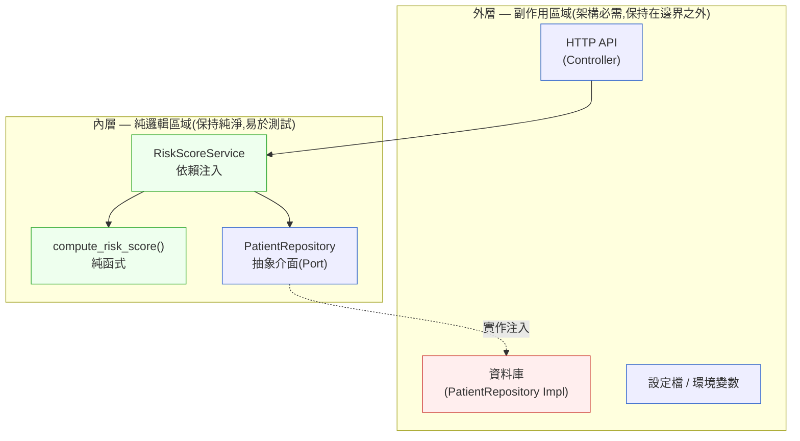

# 第 11 章｜可測試的程式碼設計
## ⸺ 難以測試的程式碼,是設計在向你說話

> **前置閱讀**:[第 9 章｜重構的時機與安全網](../part-02-craft/ch-09-refactoring.md)、[第 10 章｜程式碼層的技術債](../part-02-craft/ch-10-tech-debt.md)
> **下游章節**:[第 12 章｜單元測試與 TDD 的落地](./ch-12-unit-tdd.md)、[第 14 章｜測試替身的取捨](./ch-14-test-doubles.md)

## 11.1 共感現場:「這段我不知道怎麼測」

你可能也有過這樣的時刻:看著自己寫了一段功能,想幫它補個單元測試,卻發現根本不知道從哪裡下手。

我帶過一個做醫療系統的工程師,就叫她小雯吧。那時她在一家叫 CareLink 的 HIS 公司工作,負責實作一套「病患風險評分」的模組。需求很清楚——根據病患的年齡、BMI、近三次回診紀錄、以及最新的血液報告,算出一個 0 到 100 的風險分數。

小雯動手很快。功能兩天就寫好了,PR 一開,邏輯看起來也對。但她在嘗試幫這個模組補測試時卡住了:光是為了讓測試能跑起來,她就要先 mock 掉資料庫連線、還要把系統時間固定住、還要設定好一個全域的設定檔……折騰了半天,測試還沒寫一行,環境就先讓她花了一個小時。

後來她找上我,說了一句很真實的話:

> 「我覺得是我不會寫測試。」

其實這句話只說對了一半。她不是不會寫測試——她碰到的問題,更早出現在測試之前。是**這個模組被設計成了很難測試的形狀**。

## 11.2 真正的問題:測試難,是設計在傳遞訊號

我們把小雯碰到的事情慢慢拆開來看。

她的風險評分函式,大概長這個樣子:

```python
# Python 3.12
def calculate_risk_score(patient_id: int) -> float:
    db = get_db_connection()   # 直接拿全域連線
    patient = db.query(f"SELECT * FROM patients WHERE id = {patient_id}")
    labs = db.query(f"SELECT * FROM labs WHERE patient_id = {patient_id} ORDER BY created_at DESC LIMIT 3")
    config = load_global_config()  # 讀取全域設定檔
    now = datetime.now()           # 直接取系統時間
    age = (now - patient.birth_date).days // 365
    # ... 後續計算邏輯 ...
    return score
```

你看得出問題在哪裡嗎?這個函式要做一件事(算分數),但它同時還做了四件其他的事:建立資料庫連線、讀取資料、載入設定、取得當前時間。這些全部都是**隱藏在函式內部的外部依賴**。

也就是說,你要測「算分數的邏輯對不對」,就必須先讓「資料庫」「設定檔」「系統時間」都準備就緒。換句話說,你想測一個單元,卻要把整個世界都架起來。

順著這個道理,我們就可以看清楚「難以測試」背後真正的設計問題:

**這個函式把「取得資料」和「處理邏輯」混在一起了。**

這是一個非常普遍的狀況——不是因為工程師不認真,而是因為當你只專注在「讓功能跑起來」的時候,最自然的寫法,往往就是把所有東西放在同一個地方。只有在你嘗試測試的時候,這個決策的代價才會浮現出來。

所以「難以測試」從來不只是測試的問題。它是**設計給你的訊號**——告訴你這段程式碼的責任邊界畫錯了。而好消息是:解法不是「學會在複雜環境裡硬測」,而是**把程式碼的形狀調整成容易測試的形狀**。這兩件事聽起來像是一回事,但方向完全不同。

## 11.3 一起做判斷:讓程式碼「長得」容易測試

那麼,什麼樣的形狀才容易測試?我想帶你看三個最有效的角度,它們彼此之間有因果關係,先理解順序再用,才不會記成三個不相干的規則。

### 11.3.1 純函式:消除「隱性輸入」

最容易測試的函式,是那種「你給它什麼,它就用什麼」的函式。沒有隱藏的全域狀態、沒有去摸外部資源、也沒有副作用——這就是**純函式(Pure Function)**。

純函式有一個很好的特性:你可以在任何地方、任何時間呼叫它,結果都一樣。這讓測試變成了最簡單的事:準備輸入、呼叫、比對輸出。

我們把小雯那個風險評分的核心邏輯,先抽成純函式:

```python
# Python 3.12
def compute_risk_score(
    age: int,
    bmi: float,
    recent_labs: list[dict],
    config: RiskConfig,
) -> float:
    """純邏輯計算;不碰資料庫、不碰時間、不碰設定檔。"""
    base_score = age * config.age_weight
    bmi_penalty = max(0, (bmi - 25) * config.bmi_weight)
    lab_penalty = sum(
        config.lab_weights.get(lab["test_name"], 0) * lab["value"]
        for lab in recent_labs
    )
    return min(100.0, base_score + bmi_penalty + lab_penalty)
```

現在測試只需要這樣:

```python
# pytest
def test_high_bmi_raises_score():
    config = RiskConfig(age_weight=0.5, bmi_weight=2.0, lab_weights={})
    score = compute_risk_score(age=45, bmi=35.0, recent_labs=[], config=config)
    assert score > compute_risk_score(age=45, bmi=22.0, recent_labs=[], config=config)
```

你不需要資料庫、不需要設定檔、不需要時間——測試變成了兩行。

### 11.3.2 依賴注入:把外部依賴「傳進來」

當然,不是所有邏輯都可以純粹到底——你還是需要讀資料庫、需要知道現在幾點。這時候,**依賴注入(Dependency Injection)**就是你的好朋友。

依賴注入的核心思想很簡單:不要在函式或類別內部自己去建立依賴,而是把依賴從外部「傳進來」。這樣一來,測試時你可以傳入一個假的依賴,正式執行時再傳入真的。

```python
# Python 3.12
from abc import ABC, abstractmethod

class PatientRepository(ABC):
    @abstractmethod
    def get_patient(self, patient_id: int) -> Patient: ...

    @abstractmethod
    def get_recent_labs(self, patient_id: int, limit: int) -> list[Lab]: ...


class RiskScoreService:
    def __init__(
        self,
        repo: PatientRepository,       # 從外部傳入
        config: RiskConfig,            # 從外部傳入
        clock: Callable[[], datetime], # 從外部傳入
    ):
        self._repo = repo
        self._config = config
        self._clock = clock

    def calculate(self, patient_id: int) -> float:
        patient = self._repo.get_patient(patient_id)
        labs = self._repo.get_recent_labs(patient_id, limit=3)
        now = self._clock()
        age = (now - patient.birth_date).days // 365
        return compute_risk_score(
            age=age,
            bmi=patient.bmi,
            recent_labs=[lab.to_dict() for lab in labs],
            config=self._config,
        )
```

現在測試可以這樣寫,完全不碰真實資料庫:

```python
def test_elderly_patient_gets_high_score():
    fake_repo = FakePatientRepository(
        patient=Patient(birth_date=date(1950, 1, 1), bmi=28.0),
        labs=[],
    )
    fixed_clock = lambda: datetime(2026, 6, 25)
    service = RiskScoreService(
        repo=fake_repo,
        config=default_risk_config(),
        clock=fixed_clock,
    )
    score = service.calculate(patient_id=1)
    assert score >= 50.0
```

### 11.3.3 邊界隔離:讓「決定」和「執行」分開住

最後一個角度,是從更高的層次來看:**把「做決定的程式碼」和「執行副作用的程式碼」分開**。

有時候我們叫它「六角架構(Hexagonal Architecture)」或「Ports and Adapters」,但不用記這些名字——記住這個判準就好:

> **能算出結果的程式碼,和會改變外部世界的程式碼,盡量不要住在一起。**

用 Mermaid 來看這個邊界長什麼樣子:



> **圖示說明**:紅色(`hot`)標示的是真實資料庫實作——那是唯一一個有副作用、測試時需要被替換的元件。藍色(`cold`)的 API Controller 和設定檔是架構必需的外層元件,它們本身沒有問題;關鍵是讓它們**不要滲入內層**。綠色(`goal`)的內層純邏輯是我們守護的核心,測試只需要在這裡工作。

內層只依賴抽象(Port),完全不知道外層的存在。測試只需要測內層——這就是邊界隔離給你的好處。

### 11.3.4 決策表:這段程式碼容易測試嗎?

把三個角度整理成一張你可以對著自己的程式碼掃一遍的表:

| 觀察點 | 容易測試的形狀 | 難以測試的形狀 | 調整方向 |
|---|---|---|---|
| **輸入來源** | 全部來自參數 | 有全域變數、環境變數、`datetime.now()` | 把隱性輸入變成顯性參數(→ 10.3.1) |
| **外部依賴** | 透過介面傳入 | 在函式內部直接建立 (`new`, `get_db()`) | 依賴注入(→ 10.3.2) |
| **副作用** | 集中在外層、呼叫者控制 | 夾在計算邏輯中間 | 把計算和副作用拆開(→ 10.3.3) |
| **測試所需的 setup** | 幾行就夠 | 需要起整個服務、資料庫 | 純函式 + 邊界隔離(→ 10.3.1、10.3.3) |
| **改一個條件的難度** | 換一個參數值 | 要改設定檔或 mock 多個系統 | 把「條件」外化成參數或 config(→ 10.3.1) |

你可以把這張表當成 code review 的 checklist,也可以在自己寫完一個函式之後,用它快速掃一遍。「調整方向」欄的標注指向本章各節的實作細節與程式碼範例,遇到不確定的地方可以直接回去對照。

## 11.4 容易絆倒的地方

理解了上面三個角度之後,實際動手的時候還是會遇到幾個很常見的絆倒點。這裡說的都是「走過才知道」的地方,不是要提醒你「別犯錯」,而是希望你下次遇到的時候,心裡有個底。

---

**絆倒處一:把所有東西都 mock 掉,卻沒改設計。**

有些工程師被「難測試」卡住之後,選擇用 mock 工具把所有依賴全部 mock 掉,讓測試能跑起來。這個方法短期有效,但長期會讓你的測試變得很脆弱——每次改動任何一個依賴的介面,測試就要跟著改。更深層的問題是:**mock 越多,代表設計問題越大**;用 mock 解決的不是設計問題,只是讓設計問題更不容易被看見。

> **修正方向**:把「我需要 mock 掉很多東西」當成一個訊號,問自己「這個函式是不是承擔了太多責任?」先改設計,mock 的數量自然會降下來。

---

**絆倒處二:把依賴注入做成了複雜的 DI 框架。**

依賴注入本身不需要框架。很多人一聽到「依賴注入」就想到 Spring 或 Angular 那樣的容器,反而讓本來簡單的事變得很重。其實在大多數情況下,「從建構式傳入」就夠了。

> **修正方向**:先用最簡單的方式做——建構式注入、或者函式參數注入。等到你真的有「管理很多依賴的複雜度」這個問題,才考慮引入 DI 容器。工具服務於問題,不是為了用而用。

---

**絆倒處三:把「可測試性」和「分層架構」畫上等號。**

有時候為了讓程式碼可測試,工程師會一口氣引入完整的六角架構、CQRS、甚至 event sourcing。然後原本三天能做完的功能,變成一個月還在架構討論裡打轉。

> **修正方向**:可測試性的起點只有兩件事——**純函式**和**依賴可以從外部控制**。從這裡開始,讓複雜度跟著真實需求生長,不要為了架構而架構。小功能用純函式就夠了;中型模組用介面注入就好了;只有真的大到需要管理跨層邊界,才考慮更完整的分層方案。

---

**絆倒處四:以為「可測試」就代表「一定要 TDD」。**

可測試的程式碼設計,和 TDD(Test-Driven Development)的開發順序是兩件事。你完全可以先寫程式碼、後補測試,但只要你在設計時就讓程式碼「長得」容易測試,事後補測試的成本就不會太高。反過來說,TDD 的好處之一正是「逼你一開始就設計成可測試的形狀」——但這是它的手段,不是唯一的路。

以小雯的風險評分模組為例,兩種開發順序都能得到同樣的可測試設計:

**順序 A(TDD)**:先寫測試 `test_high_bmi_raises_score()` → 發現需要傳入 `bmi` 參數 → 自然設計出 `compute_risk_score(age, bmi, ...)` 純函式。

**順序 B(先設計→後補測試)**:先用 10.3.1~10.3.3 的角度審視設計 → 主動把計算邏輯抽成純函式 → 補測試只需要兩行。

兩條路的終點相同:**都是一個接受明確參數、不碰外部狀態的純函式**。差別只在於你是被測試「逼」出好設計,還是主動想出好設計再補測試。習慣哪條路都行,重點是到達同一個終點。

> **修正方向**:如果你不習慣 TDD,就先把「讓程式碼容易被測試」當成設計目標。只要設計對了,什麼時候補測試都行。第 12 章會再聊 TDD 的落地節奏。

## 11.5 帶得走的工具 ⸺ 一頁式「可測試性設計審查卡」

下面是一張空白模板,你可以在寫完一個新的函式、類別或模組之後,花兩分鐘過一遍這張卡。它不是要考你,而是幫你在「功能能跑」和「可以安心測試」之間,多一道溫柔的確認。

```text
可測試性設計審查卡 ⸺ {模組 / 函式名稱}

一、輸入來源
    - 這個函式/類別的所有輸入,都來自參數嗎?
      ▢ 是 — 好的開始
      ▢ 否 — 哪些是隱性輸入(全域變數/環境變數/系統時間)?
        > 隱性輸入:{列出來}
        > 調整方向:把它們變成顯性參數或注入的依賴

二、外部依賴
    - 這個函式/類別有沒有在內部直接建立外部依賴(資料庫、HTTP 呼叫、檔案系統)?
      ▢ 沒有 — 好
      ▢ 有 — 依賴項:{列出來}
        > 調整方向:透過建構式或參數注入

三、副作用
    - 計算邏輯和副作用(寫 DB、發訊息、更新狀態)是否混在一起?
      ▢ 分開了 — 好
      ▢ 混在一起 — 副作用在哪裡:{描述}
        > 調整方向:把副作用移到呼叫者一層,這裡只負責計算

四、測試 setup 成本
    - 如果現在要幫這段邏輯寫最小的單元測試,需要準備什麼?
      ▢ 只需要準備幾個參數值 — 可測試
      ▢ 需要起資料庫 / mock 多個系統 — 可測試性待改善
        > 改善方向:{簡單描述}

五、一句話結論
    - {這段程式碼的可測試性狀況,和下一步最值得做的一件事}
```

這張卡的欄位設計有一個邏輯:先從「輸入」問起,再問「依賴」,再問「副作用」,最後估「測試成本」。這是從最根本的問題到最終結果的因果鏈——你越早在輸入和依賴這兩欄答「好」,後面的副作用和測試成本自然就輕。

這段邏輯講得有點乾,第一次讀可能還抓不到手感,沒關係——接下來就用小雯的例子把卡片實際填一遍,你會發現每一欄問的問題,其實都對應到她卡住的那個瞬間。

### 11.5.1 範例:CareLink 的風險評分模組

讓我們用小雯那個病患風險評分模組來填一次這張卡——填的是她**重構之前**的版本,也就是那個讓她卡了一個小時還沒寫出一行測試的函式。填完之後,問題一目了然。

```text
可測試性設計審查卡 ⸺ calculate_risk_score(patient_id)

一、輸入來源
    - 這個函式的所有輸入,都來自參數嗎?
      ▢ 否
      > 隱性輸入:
          - get_db_connection()  ← 全域資料庫連線
          - load_global_config() ← 全域設定檔
          - datetime.now()       ← 系統時間
      > 調整方向:把 config 和 clock 改成建構式注入;
                  把 db 改成 PatientRepository 介面注入

二、外部依賴
    - 有在內部直接建立外部依賴嗎?
      ▢ 有
      > 依賴項:
          - 函式第一行直接呼叫 get_db_connection()
          - 直接執行 SQL query 字串(SQL 注入風險附贈)
      > 調整方向:定義 PatientRepository 抽象介面,
                  用建構式注入到 RiskScoreService

三、副作用
    - 計算邏輯和副作用是否混在一起?
      ▢ 混在一起
      > 副作用在哪裡:DB 查詢夾在計算步驟中間,難以辨識哪裡是「純計算」
      > 調整方向:把 compute_risk_score() 抽成純函式;
                  RiskScoreService.calculate() 只負責「取資料 + 呼叫純函式」

四、測試 setup 成本
    - 現在要幫這段邏輯寫最小的單元測試,需要準備什麼?
      ▢ 需要起資料庫 / mock 多個系統
      > 改善方向:重構後只需要 FakePatientRepository(幾行 class)
                  + lambda 固定時間;整個 setup 壓縮到 10 行以內

五、一句話結論
    - 三個隱性輸入 + 函式內建立連線 = 測試成本極高。
      最值得做的一件事:先把 compute_risk_score() 抽成純函式,
      立刻就能寫出第一批不需要資料庫的測試。
```

> *欄位解讀*:一欄的「隱性輸入」就是測試要先架整個環境的直接原因——不是測試難,是輸入藏起來了。「直接在函式裡建立連線」讓你沒辦法換成假 DB;介面加注入讓測試替換成 `FakePatientRepository`,而不用起一個真資料庫。把「取資料」和「算分數」混在一起,導致你沒辦法獨立測試其中任一件事;拆開之後,純計算邏輯完全不碰資料庫就能測好。最後一欄「setup 多長」是可測試性最直接的體感指標:重構前要一小時架環境,重構後十行 setup——這個數字的落差,就是設計改善帶來的。

小雯重構之後,第一批 12 個測試案例在 30 分鐘內全部寫完——因為她只需要準備不同的數字組合,完全不用管資料庫在哪裡。卡片幫她把問題定位在「輸入」那一欄,知道問題在哪,路就清楚了。

## 11.6 本章回顧

讀完這一章,你應該已經能:

- [ ] 聽到「這段我不知道怎麼測」的時候,往設計方向找原因,而不是先怪自己測試能力不夠
- [ ] 辨識隱性輸入(全域狀態、系統時間、直接建立的連線),並知道如何把它們顯性化
- [ ] 用依賴注入讓外部依賴可以在測試時被替換
- [ ] 區分「做決定的程式碼」和「執行副作用的程式碼」,並把它們分開放
- [ ] 用一頁式審查卡掃描一段程式碼的可測試性,找出最值得先改的一件事

如果想先從一件事開始,我會建議 ⸺ **把你目前最難測試的那個函式裡的「純邏輯」抽出來,讓它只接受參數、只回傳結果**。這一步不需要改架構,也不需要引入任何框架,但你會立刻發現測試變得可以下手了。很多時候,可測試性的入口就在這裡。

下一章,我們會繼續往前走:有了可測試的設計之後,如何讓測試本身也寫得乾淨、可維護——那是第 12 章「單元測試與 TDD 的落地」要聊的事。

## Cross-References

- **下一章**:[第 12 章｜單元測試與 TDD 的落地](./ch-12-unit-tdd.md) ⸺ 有了可測試的設計,接著讓測試本身也寫得好
- **強連結**:[第 14 章｜測試替身的取捨](./ch-14-test-doubles.md) ⸺ 深入討論 mock/stub/fake 的選擇,與本章的依賴注入直接相關
- **強連結**:[第 9 章｜重構的時機與安全網](../part-02-craft/ch-09-refactoring.md) ⸺ 把難測試的程式碼改成容易測試的形狀,就是一次重構
- **強連結**:[第 7 章｜命名、抽象與邊界](../part-02-craft/ch-07-naming-abstraction.md) ⸺ 邊界隔離的前提是抽象邊界劃得清楚
- **跨書連結**:[SA/SD Playbook — Ch 27 可測試性設計](https://github.com/EddyKuo/sa-sd-playbook) ⸺ 本章講實作層;SA/SD 從架構高度談「為可測試性而設計」

