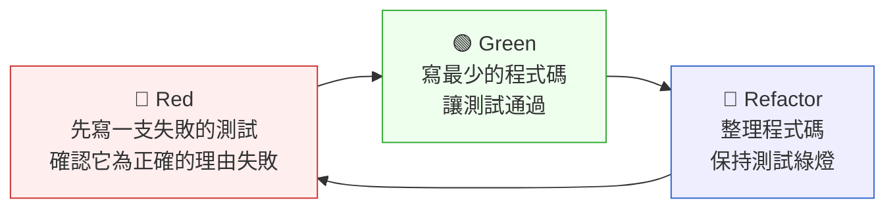

# 第 11 章｜單元測試與 TDD 的落地
## ⸺ 測行為、不測實作,才是讓測試真正撐住你的秘訣

> **前置閱讀**:[第 10 章｜可測試的程式碼設計](./ch-10-testable-code-design.md)
> **下游章節**:[第 12 章｜契約測試與整合測試](./ch-12-contract-and-integration-tests.md)

## 11.1 共感現場:綠燈全亮,卻還是上線出事了

你可能也有過這樣的經驗。

CI 流水線一片綠,測試全過。你把這支功能推上暫存環境,跑了一遍,沒問題。PM 也確認了 demo,你帶著幾分踏實感把它合入 main。

然後隔天,客服那邊傳來一份 bug 單。

小佳是一位在虛構金融科技公司 ClearFund 工作的工程師,去年遇到的就是這樣的情境。她負責的是一支轉帳手續費計算模組,底下有大約四十幾個單元測試。那些測試都在跑,全是綠的。但當行員開始用真實資料跑的時候,一種特定的組合型費率——同時符合「企業戶」且「當日累積金額超過門檻」的情況——算出來是錯的。客戶被多收了費用。

小佳事後翻了那四十幾支測試,發現問題出在什麼地方:所有測試都在驗「輸入一組數字、看輸出的數字對不對」,但沒有任何一支覆蓋到費率規則「同時疊加」的行為。測試不少,但它們都在測同一件事。而且因為測試和實作高度耦合——很多地方都在驗私有方法的回傳值——只要她稍微改一下內部邏輯,就有三四支測試跟著失敗,逼她每次都要「修測試」而不是「修程式碼」。

這個處境很多人都走過。測試不是沒寫,但它沒有真正撐住你。問題並不出在懶惰,而是在「測什麼」和「怎麼寫」這兩件事上,少了一個清楚的方向。接下來,我們就一起把它慢慢拆開。

## 11.2 真正的問題:測試測的是「實作」,不是「行為」

把小佳的情況慢慢拆開來看,會發現它其實反映了一個很常見的認知差距:我們以為測試在保護「功能」,但它實際上保護的,是某一種特定的「實作方式」。

這兩件事的差別,聽起來抽象,但結果差很遠。

當你的測試在驗「這個私有方法回傳 350」,它其實在說的是:「在這個特定的實作裡,有一個叫這個名字的方法、做了這件事、回傳這個值。」只要你稍微重構一下——把方法合併、抽一個策略類別、改變計算順序——這支測試就失敗了,即使功能完全沒有壞。這就是「脆弱測試(Fragile Test)」的根源:它和實作細節的耦合太深,以至於重構比不寫測試還痛。

也就是說,脆弱測試帶來的不只是噪音,而是一種惡性循環:測試一脆弱,大家就開始不信任它們。測試失敗了,大家第一個反應不是「壞了」而是「又是假警報吧」。漸漸地,測試變成一個儀式——每次 CI 紅了就快速改一下讓它變綠,而不是真正去思考「行為有沒有保住」。

順著這個道理,我們就能看出小佳那個案例裡真正缺的東西:

第一,測試覆蓋的是**輸入輸出的一個點**,沒有覆蓋到費率規則「組合疊加」這個**行為場景**。這不是數量的問題——四十幾支測試可以全都在描述同一件事。

第二,測試和**實作細節耦合**,導致重構比不測試還痛,讓她在每次修改時都要先花時間「讓測試不要紅」,而不是先想「行為有沒有對」。

這就是 TDD(Test-Driven Development,測試驅動開發)真正想解決的問題所在。但在談 TDD 怎麼做之前,我們需要先把「好的單元測試長什麼樣」這件事講清楚——因為方法對了,測試才是資產;方法錯了,測試只是負擔。

## 11.3 一起做判斷:好測試的四個特徵與 TDD 的務實做法

讓我們先從「好的單元測試長什麼樣」開始,因為這是基礎。不管你用不用 TDD,寫出好的測試都需要對這幾件事有感覺。

### 11.3.1 好測試的四個特徵(FIBS)

這四個特徵可以用縮寫 **FIBS** 記:**F**ast、**I**ndependent、**B**ehavior-focused、**S**ingle-reason。我們一個一個慢慢來。

---

**第一個特徵:快(Fast)**

單元測試要快。「快」的意思是一整套測試跑下來在幾秒鐘內完成,讓你每次修改後都能馬上跑一遍確認。如果跑一次要五分鐘,大家就會開始攢在一起跑,失去即時反饋——這和「有沒有寫測試」幾乎沒有差別。

快的前提是:單元測試不應該碰真實資料庫、不發 HTTP request、不讀真實的設定檔。那些外部依賴會讓測試時間從毫秒跳到秒甚至分鐘。要把外部依賴隔離出去,就需要用到測試替身(Test Double)——這個家族包含 mock、stub、fake、spy 等工具,第 13 章我們會完整展開它們的選擇與寫法。這裡先記住一個原則:Fast 這個特徵,是靠「隔離外部」來達成的。

---

**第二個特徵:彼此獨立(Independent)**

每支測試都應該能夠獨立跑,而且跑的順序不影響結果。這件事聽起來理所當然,但很容易在不知不覺中被違反。

最常見的場景是:測試 A 先跑,在共享的 `setUp` 裡設定了某個全域狀態(例如一個 singleton 的快取),測試 B 依賴這個狀態才能通過。一旦測試 A 因為某個無關的原因跳過或順序改變,測試 B 就會神秘地失敗。這時候你看到的是「兩支紅」,但問題只有一個,診斷方向因此被帶偏。

做法上,每支測試應該在自己的 `setUp` 裡建立自己需要的物件和狀態,跑完後的清理也由自己負責,不依賴別人留下的環境。

---

**第三個特徵:測行為,不測實作(Behavior-focused)**

這個特徵是本章最核心的一件事,也是小佳案例的核心問題所在。

一個測行為的測試描述的是:「在這個情境下,系統應該從外部表現出這個行為」。它不在乎內部怎麼計算、用什麼私有方法、呼叫哪個 helper——只在乎「從外部可觀察的結果來看,行為對不對」。

以 ClearFund 的費率模組為例,一個測行為的測試長這樣:

```python
# Python 3.12, pytest 8.x
def test_企業戶且當日累積超門檻時疊加費率():
    calculator = FeeCalculator(account_type="corporate")
    result = calculator.calculate(amount=600_000, daily_accumulated=1_500_000)
    assert result.fee == 58  # 企業費率 + 累積加成費率的疊加結果
```

它不管 `calculate()` 內部有幾個私有方法,只關心「叫它算、看它給的費用對不對」。這樣的測試,即使你把內部的計算邏輯完全重構——把兩個私有方法合併成一個、改成策略模式、或者把規則移到設定檔——只要外部行為沒有改變,這支測試就不會紅。這就是「測試保護重構」的真正意義。

同樣的邏輯,換到 TypeScript 的話是這樣:

```typescript
// TypeScript 5.x, Jest 29.x
it("企業戶且當日累積超門檻時應疊加費率", () => {
  const calculator = new FeeCalculator({ accountType: "corporate" });
  const result = calculator.calculate({ amount: 600_000, dailyAccumulated: 1_500_000 });
  expect(result.fee).toBe(58);
});
```

換到 Go:

```go
// Go 1.22, testing 標準庫
func TestCorporateAccountOverThreshold_ShouldApplyBothRates(t *testing.T) {
    calc := NewFeeCalculator("corporate")
    result := calc.Calculate(FeeInput{Amount: 600_000, DailyAccumulated: 1_500_000})
    if result.Fee != 58 {
        t.Errorf("expected fee 58, got %d", result.Fee)
    }
}
```

三種語言,測試的名字和意圖完全相同:描述一個「業務行為」。語言是細節,Behavior-focused 是原則。

---

**第四個特徵:只有一個失敗的理由(Single Reason to Fail)**

一支測試最好只驗一件事。如果一支測試同時驗了費率計算正確、輸出格式化正確、日誌有沒有記錄三件事——那任何一件出問題,你都只看到「這支測試紅了」,卻不知道哪件事壞了。把它拆成三支,每次紅就是一個清楚的訊號,讓你馬上知道從哪裡開始看。

多寫幾支測試沒有關係。測試是便宜的,診斷困難的時間才貴。

---

這四個特徵合在一起,就是 **FIBS** 量尺。它不要求你每支測試都完美同時做到,但每次你覺得「這支測試怪怪的」,拿 FIBS 對一遍,通常能找到癥結。

正因為好測試需要這幾個特徵,TDD 的做法才顯得自然——它把「先想清楚行為場景」這件事,拉到了寫程式碼之前。

### 11.3.2 TDD 的紅綠重構循環:完整程式碼走一遍

TDD(Test-Driven Development)的基本循環叫做「紅—綠—重構(Red–Green–Refactor)」:



光看圖容易覺得抽象。我們直接拿 ClearFund 費率模組,走一次完整的三步循環。

---

**步驟一:Red — 先寫失敗的測試**

在 `FeeCalculator` 任何程式碼存在之前,先寫這支測試:

```python
# Python 3.12, pytest 8.x
# tests/test_fee_calculator.py

def test_企業戶且當日累積超門檻時疊加費率():
    """
    業務規則:企業戶費率(基礎 10 元)+ 累積加成費率(累積超過 1,000,000 加 48 元)
    預期:600,000 元轉帳,企業戶,當日累積 1,500,000 → 費率 = 58 元
    """
    calculator = FeeCalculator(account_type="corporate")
    result = calculator.calculate(amount=600_000, daily_accumulated=1_500_000)
    assert result.fee == 58
```

現在跑 `pytest`:

```
FAILED tests/test_fee_calculator.py::test_企業戶且當日累積超門檻時疊加費率
NameError: name 'FeeCalculator' is not defined
```

這是正確的失敗:測試紅了,因為 `FeeCalculator` 根本還不存在。這支測試「為正確的理由失敗」——它說出了我們接下來要實現的東西。

---

**步驟二:Green — 寫最少的程式碼讓測試通過**

注意這裡的「最少」:不是寫出最完整、最乾淨的設計,而是先讓這支測試綠起來。

```python
# Python 3.12
# fee_calculator.py

from dataclasses import dataclass

@dataclass
class FeeResult:
    fee: int

class FeeCalculator:
    CORPORATE_RATE = 10
    THRESHOLD_BONUS = 48
    THRESHOLD = 1_000_000

    def __init__(self, account_type: str):
        self.account_type = account_type

    def calculate(self, amount: int, daily_accumulated: int) -> FeeResult:
        fee = 0
        if self.account_type == "corporate":
            fee += self.CORPORATE_RATE
        if daily_accumulated > self.THRESHOLD:
            fee += self.THRESHOLD_BONUS
        return FeeResult(fee=fee)
```

再跑 `pytest`:

```
PASSED tests/test_fee_calculator.py::test_企業戶且當日累積超門檻時疊加費率
```

綠了。這一步的目標只有一個:讓測試通過。程式碼可以不漂亮,但它必須正確。

---

**步驟三:Refactor — 整理程式碼,保持測試綠**

現在測試在,你可以安心地整理了。把硬編碼的費率規則抽出到設定表,讓程式碼更容易擴充:

```python
# Python 3.12
# fee_calculator.py (重構後)

from dataclasses import dataclass
from typing import NamedTuple

class RateRule(NamedTuple):
    base_rate: int
    threshold: int
    threshold_bonus: int

RATE_RULES: dict[str, RateRule] = {
    "personal":  RateRule(base_rate=15, threshold=1_000_000, threshold_bonus=30),
    "corporate": RateRule(base_rate=10, threshold=1_000_000, threshold_bonus=48),
}

@dataclass
class FeeResult:
    fee: int

class FeeCalculator:
    def __init__(self, account_type: str):
        if account_type not in RATE_RULES:
            raise ValueError(f"unknown account type: {account_type!r}")
        self._rule = RATE_RULES[account_type]

    def calculate(self, amount: int, daily_accumulated: int) -> FeeResult:
        fee = self._rule.base_rate
        if daily_accumulated > self._rule.threshold:
            fee += self._rule.threshold_bonus
        return FeeResult(fee=fee)
```

再跑 `pytest`——仍然全綠。我們把費率規則從方法裡抽出來變成資料表,日後新增帳戶類型只需要加一行設定,完全不碰核心邏輯。而測試始終沒有動過,也始終是綠的。

這就是紅綠重構循環真正的保護:你不是「改完才測」,而是「測著改」,每一步都知道自己沒有搞壞任何東西。

### 11.3.3 TDD 的務實用法:什麼時候先測、什麼時候後測

TDD 的爭議常常來自「它是不是黃金律、必須全部測試都先寫」。一個務實的看法是:先測還是後測是一個工具選擇,不是一個道德問題。

下面這張決策表可以幫你判斷:

| 情境 | 建議做法 | 理由 |
|---|---|---|
| 邏輯複雜、有明確輸入輸出規則(如費率計算) | **先寫測試(TDD)** | 先測能幫你把邊界場景想清楚,避免漏掉疊加條件 |
| 純粹的 UI 渲染、樣式調整 | **後補測試(或不測)** | 行為難以精確描述,測試維護成本高於收益 |
| 探索式開發、需求不確定 | **先 spike、穩定後補測試** | 先建立清楚的需求再回頭固定行為 |
| Bug 修復 | **先寫重現測試、再修** | 重現測試確保這個 bug 不會悄悄回來 |
| 整合流程、跨服務呼叫 | **整合測試層處理(見第 12 章)** | 單元測試無法完整覆蓋這個層次 |

這張表裡最值得停下來展開的,是「Bug 修復」這一列——因為它是 TDD 最容易被接受的切入點。

**Bug 修復的完整流程**

每次修 bug 之前,先寫一支能「重現這個 bug」的測試。這支測試現在應該要紅,然後你修完程式碼讓它變綠,之後它就永遠留在測試套件裡,成為這個 bug 的「活文件」。

用 ClearFund 的例子走一遍:

```python
# 第一步:寫重現測試(這支現在應該要失敗)
def test_企業戶且當日累積超門檻時_費率不應只套用基本費率():
    """
    Bug 重現:原有邏輯對企業戶只套用 CORPORATE_RATE,
    未疊加 THRESHOLD_BONUS,導致多收費情況被低報。
    """
    calculator = FeeCalculator(account_type="corporate")
    result = calculator.calculate(amount=600_000, daily_accumulated=1_500_000)
    # 舊邏輯只回傳 10(只有企業費率),正確應該是 58
    assert result.fee == 58  # 此時這支測試紅
```

確認測試確實為正確的理由紅了之後,才去修 `FeeCalculator` 的邏輯。修完之後,這支測試變綠,而且從此以後任何人動到費率計算,只要犯了同樣的錯誤,它就會再次紅起來,提醒你。

這樣的做法不需要從零開始實踐 TDD,就能立刻嘗到「測試保護行為」的滋味——每修一個 bug,就讓測試套件多一個守衛。

### 11.3.4 測試場景的規劃:從「行為清單」開始

不管先測還是後測,寫測試之前都有一個步驟容易被跳過:**把你要測的行為場景先列出來**。這個步驟不需要工具,一張白紙或一個 Notion 頁面就夠——它的目的是讓你在動手之前,先問一遍「我有沒有漏掉什麼組合?」

對 ClearFund 的費率模組,一個行為清單可能長這樣:

| 場景描述 | 輸入條件 | 預期行為 |
|---|---|---|
| 一般個人戶、小額轉帳 | 個人戶、金額 < 門檻 | 套用基本費率 15 元 |
| 企業戶、小額轉帳 | 企業戶、金額 < 門檻 | 套用企業費率 10 元 |
| 個人戶、當日累積超門檻 | 個人戶、累積 > 門檻 | 套用累積加成費率 |
| **企業戶、當日累積超門檻** | 企業戶、累積 > 門檻 | **同時疊加兩種費率** ← 這條之前沒有 |
| 金額為零 | 任何戶型、金額 = 0 | 費率 = 0,不報錯 |
| 負數金額 | 任何戶型、金額 < 0 | 拋出 ValueError |
| 未知帳戶類型 | account_type = "unknown" | 拋出 ValueError |

先列清單再寫測試,你就能在動手寫程式之前先問自己:「我有沒有漏掉什麼組合?」這個步驟花不了多少時間,但它讓「測試覆蓋場景」而不是「測試覆蓋行數」。

場景清單並不只適用於金融計算。把同樣的方法帶到電商折扣場景,邏輯完全相通:

| 場景描述 | 輸入條件 | 預期行為 |
|---|---|---|
| 無任何優惠券 | 訂單 1,000 元、無券 | 最終金額 1,000 元 |
| 單一固定折扣券 | 訂單 1,000 元、折 100 元 | 最終金額 900 元 |
| 單一百分比折扣券 | 訂單 1,000 元、打九折 | 最終金額 900 元 |
| **固定折扣 + 百分比券同時使用** | 訂單 1,000、折 100 再打九折 | **先折後打?先打後折?** ← 業務規則定義點 |
| 折扣後金額低於 0 | 訂單 50 元、折 100 元 | 最終金額 0 元(不能為負) |
| 折扣券已過期 | 任何訂單、過期券 | 拋出 DiscountExpiredError |

這兩份清單結構完全一樣:先列出正常路徑、再列邊界條件、最後列錯誤情況。「固定折扣 + 百分比券同時使用」這條,和 ClearFund 的「企業戶且累積超門檻」一樣,都是「規則疊加」的組合——這類條件最容易在沒有清單的情況下被漏掉。

從需求文件推導場景清單時,有一個簡單的方法:每找到一條「當 X 時執行 Y」的業務規則,就問自己「這條規則和其他條規則可以同時成立嗎?如果可以,那個組合的行為是什麼?」把每個這樣的組合都加到清單裡,覆蓋就不會有死角。

## 11.4 容易絆倒的地方

下面這幾個地雷,在很多寫了一段時間測試的工程師身上都出現過。這裡列出來,不是要指責誰,而是讓你下次遇到的時候心裡有底。

---

**絆倒處一:測試驗的是「實作細節」,導致重構一動就紅一片。**

這個地雷出現的方式通常很隱性。你開始的時候用 `mock` 隔離資料庫——這是正確的。但慢慢地,測試開始多驗一件事:「那個私有方法有沒有被呼叫、被呼叫幾次」。這種驗法讓測試和程式碼的內部結構高度耦合。

小佳的原始測試套件就是這樣:

```python
# ❌ 反模式:驗私有方法呼叫次數,而不是驗結果
# Python 3.12, pytest 8.x
def test_費率計算_反模式():
    with patch.object(FeeCalculator, '_apply_corporate_rate') as mock_corp, \
         patch.object(FeeCalculator, '_apply_threshold_rate') as mock_thresh:
        calculator = FeeCalculator(account_type="corporate")
        calculator.calculate(amount=600_000, daily_accumulated=1_500_000)
        mock_corp.assert_called_once()
        mock_thresh.assert_called_once()
```

這支測試在說的是:「我知道你內部有這兩個方法,而且我要求你各呼叫一次。」一旦你把兩個方法合併成 `_resolve_combined_rate()`,這支測試就紅了——即使最終費率算得完全正確。你修的不是 bug,你只是在改設計,但測試讓你付出代價。

修正後的版本,把驗證點移到外部行為:

```python
# ✅ 修正後:只驗外部可觀察的結果
def test_企業戶且當日累積超門檻時疊加費率():
    calculator = FeeCalculator(account_type="corporate")
    result = calculator.calculate(amount=600_000, daily_accumulated=1_500_000)
    assert result.fee == 58
```

不管內部用幾個方法、怎麼命名、怎麼分工——只要最終費用是 58,這支測試就是綠的。重構內部結構是你的自由,測試不應該限制它。

把 mock 的使用邊界定清楚:mock 用於隔離**外部依賴**(資料庫、外部 API、時鐘),不用於窺探**內部呼叫**。這條原則能替你擋掉大多數「脆弱測試」的根源。

---

**絆倒處二:一支測試塞了太多驗證,失敗了也不知道哪裡壞。**

這個習慣的來源通常是好意:「這幾件事都和這個功能有關,放在一起跑比較方便。」但結果是,測試紅了,你要從頭翻到尾才知道哪個 `assert` 出問題,診斷時間遠高於多寫幾支測試的時間。

想像一支同時驗了費率計算、回傳格式、日誌輸出的測試:

```python
# ❌ 反模式:一支測試驗三件事
def test_企業戶費率計算_綜合版():
    calculator = FeeCalculator(account_type="corporate")
    result = calculator.calculate(amount=600_000, daily_accumulated=1_500_000)

    assert result.fee == 58           # 費率對不對
    assert result.currency == "TWD"   # 格式對不對
    assert result.description != ""   # 說明有沒有
    # 三個斷言,任何一個壞掉都叫做「這支測試紅了」
```

當 `result.currency` 因為一次不相關的重構而變成 `None`,你看到的是「費率計算測試紅了」——但費率明明沒問題。把它拆成三支,每次紅就是一個清楚的訊號。

多寫幾支測試沒有關係。測試是便宜的,模糊的失敗訊號才昂貴。

---

**絆倒處三:TDD 一開始跑不起來,就覺得「這個不適合我們」。**

TDD 有一段真實的學習曲線。前幾天會慢,特別是在你還不確定「這個場景我到底要測什麼」的時候。有些工程師試了一個任務,感覺速度比以前慢了一倍,就把它放棄了——但其實這時候還在練習期,還沒到能感受到保護感的那個時間點。

TDD 的收益不在「開發時多快」,而在「三週後重構時有多安心」。那個安心感,要在你第一次踏進一段「有完整 TDD 覆蓋的程式碼、安心地改了一個關鍵計算邏輯、看著測試全綠」的時候,才能真正體會到——不是任何說明能給你的感受。

一個降低門檻的方式:不要從零開始全專案推 TDD。挑一個「下週要修的 bug」或「一個獨立的計算模組」,試試看完整的紅綠重構循環。先有一次成功的親身體驗,再慢慢擴大。一次完整的循環就夠了。

---

**絆倒處四:Green 之後跳過 Refactor,技術債藏在測試保護的傘下越堆越深。**

「測試過了就好」是個危險的想法。它背後的隱含邏輯是:「反正有測試保護,程式碼醜一點也沒關係。」但測試只保護「行為不會改變」,它沒辦法保護「程式碼不會腐爛」。

當你跳過 Refactor 那一步,你的程式碼會在「功能正確」的表象下慢慢腐爛:方法越來越長,命名越來越隨意,下一個接手的人越來越難讀懂。而且最諷刺的是,這時候你有測試,你本來可以放心地整理,卻因為「趕著做下一件事」而選擇不整理。

把 Refactor 當成紅綠循環裡正式的一步,不是「有空再說」。一個好用的問法是:「如果今天下午有人要接手這段程式碼,他讀得舒服嗎?」不舒服,現在就是整理的時候——測試在,你重構得很安全。讓測試成為你整理程式碼的底氣,而不是讓整理「永遠是下一件事」。

---

下面是一張統整四個絆倒處的快速對照表,方便你做 code review 時當成參考:

| 絆倒處 | 症狀 | 根因 | 修正方向 |
|---|---|---|---|
| 測實作細節 | 重構一動,測試紅一片 | mock 驗私有方法呼叫 | mock 只用於隔離外部依賴,驗回傳值不驗呼叫鏈 |
| 斷言太多 | 紅了不知哪個壞 | 一支測試塞多件事 | 一支測試一個場景,拆多支 |
| TDD 學習曲線 | 感覺比以前慢,放棄 | 還在練習期,未到收益期 | 從一個 bug 修復開始,體驗完整循環 |
| 跳過 Refactor | 程式碼在綠燈下腐爛 | 「過了就好」心態 | Refactor 是正式步驟,不是可選項 |

## 11.5 帶得走的工具 ⸺ 一頁式「行為場景測試卡」

把上面的思路整理成一張工作前可以對照的卡片。它的目的不是清單主義,而是幫你在「開始寫測試之前」先想清楚兩件事:我要測的場景有沒有列全?我的測試測的是行為還是實作?

```text
行為場景測試卡 ⸺ {模組 / 功能名稱}
日期:{YYYY-MM-DD}  負責人:{@name}

【正常路徑場景】
- 場景 1: {描述條件} → 預期行為: {描述}
- 場景 2: {描述條件} → 預期行為: {描述}
  (每個獨立的業務規則組合都要一條;規則可以疊加的,每個組合都要一條)

【邊界條件場景】
- 場景 B1: {邊界描述,如:金額為零、字串為空} → {預期行為}
- 場景 B2: {剛好等於門檻} → {預期行為}
- 場景 B3: {剛好超過門檻} → {預期行為}

【錯誤 / 例外場景】
- 場景 E1: {非法輸入或異常狀態} → {預期拋出的例外或回傳的錯誤}
- 場景 E2: {未知枚舉值或非法狀態} → {預期行為}

【測試健康度自查(FIBS)】
□ Fast:測試不碰真實資料庫/外部 API,有用 fake/stub 隔離
□ Independent:每支測試自帶 setUp,不依賴其他測試的執行順序
□ Behavior-focused:驗的是外部可觀察的回傳值,不驗私有方法呼叫
□ Single-reason:每支測試只有一個斷言場景,失敗訊息清楚

【TDD 循環確認(如適用)】
□ 紅:先寫測試,確認它為正確的理由失敗(不是莫名其妙地通過)
□ 綠:只寫讓這支測試通過的最少程式碼
□ 重構:整理後重跑,全部測試仍然綠
```

為什麼把「場景列表」和「健康度自查」放在同一張卡?因為兩個問題最容易被各自跳過——場景列清楚了才知道要測什麼,健康度自查才知道測得對不對。兩個加在一起也只有一頁,貼在你的 PR 描述或 Notion task 上剛剛好。

### 11.5.1 範例:ClearFund 費率模組的行為場景測試卡

回到小佳的那個費率計算模組。如果在開始寫測試之前,她先填了這張卡,那個「企業戶疊加費率算錯」的 bug 很可能在測試設計階段就被發現了——它就藏在「正常路徑場景」裡一個從來沒被列出來的組合裡。

```text
行為場景測試卡 ⸺ ClearFund 轉帳手續費計算模組 (FeeCalculator)
日期: 2026-03-12  負責人: @xiao-jia

【正常路徑場景】
<!-- 為什麼這欄:正常路徑最容易漏掉「規則疊加」的情境;
     每個獨立業務條件的組合都應該有一行,不能只測「最常見的那一條」。 -->
- 場景 1: 個人戶、金額 10,000、當日累積 50,000 → 基本費率 15 元
- 場景 2: 企業戶、金額 10,000、當日累積 50,000 → 企業費率 10 元
- 場景 3: 個人戶、金額 300,000、當日累積 1,200,000 → 累積加成費率 45 元
- 場景 4: 企業戶、金額 600,000、當日累積 1,500,000 → 企業+累積雙重疊加 = 58 元
  ← 這條之前不存在於測試清單。這就是 bug 所在。

【邊界條件場景】
<!-- 為什麼這欄:邊界條件是程式最容易「差一點」的地方;
     門檻值「剛好等於」和「剛好超過」的行為常常是兩回事。 -->
- 場景 B1: 累積金額 = 1,000,000(剛好等於門檻) → 不觸發加成,套用基本費率
- 場景 B2: 累積金額 = 1,000,001(剛好超過門檻) → 觸發加成費率
- 場景 B3: 轉帳金額 = 0 → 費率 = 0,正常回傳

【錯誤 / 例外場景】
- 場景 E1: 轉帳金額 = -5,000 → 拋出 ValueError("amount must be non-negative")
- 場景 E2: account_type = "unknown" → 拋出 ValueError("unknown account type: 'unknown'")

【測試健康度自查(FIBS)】
<!-- 為什麼這欄:這四個自查是「脆弱測試」的防火牆;
     不自查就容易寫出「耦合私有方法」的測試,重構時一片紅。 -->
☑ Fast:使用 FakeAccountRepository 取代真實資料庫;所有測試 < 0.2 秒
☑ Independent:每支測試自帶 FeeCalculator 初始化,無共享狀態
☑ Behavior-focused:所有斷言都在驗 calculate() 的 FeeResult.fee,不驗私有方法
☑ Single-reason:每支測試只驗一個場景,測試名稱即為場景描述

【TDD 循環確認】
☑ 紅:先寫場景 4 的測試,確認它回傳 10(非 58),為正確的理由失敗
☑ 綠:在 calculate() 中加入 threshold 條件判斷,測試通過
☑ 重構:把費率規則提取到 RATE_RULES 字典,分離設定與邏輯,全部測試仍然綠
```

如果小佳當時手上有這張卡,「場景 4:企業戶疊加費率」就不會是一個在生產環境被客戶發現的 bug,而是一張在開發階段就被她自己補上的紅燈——然後在修完之後安靜地變成綠的。測試的目的不是製造麻煩,而是把「你本來會忘記問的那幾個問題」在對的時候替你問出來。

## 11.6 本章回顧

讀完這一章,你應該已經能:

- [ ] 說清楚「測行為」和「測實作」的差別,以及為什麼後者會造成脆弱測試
- [ ] 列舉好測試的四個特徵(FIBS:Fast、Independent、Behavior-focused、Single-reason),並說出每個特徵不可或缺的原因
- [ ] 走完一次完整的紅—綠—重構循環,理解每一步的目的和節奏
- [ ] 判斷一個情境適合「先測(TDD)」還是「後補測試」,並說出理由
- [ ] 用「行為場景清單」規劃一個模組的測試覆蓋,不靠直覺隨手寫
- [ ] 辨認四個常見絆倒處,知道對應的修正方向

如果想先從一件事開始——**下次修一個 bug 之前,先寫一支能重現它的測試,再修程式碼讓它變綠**。這支測試之後就永遠留在你的套件裡。一次下來你會親身感受到「原來測試能這樣保護我」——那個感覺,比任何說明都更有說服力。

## Cross-References

- **前一章**:[第 10 章｜可測試的程式碼設計](./ch-10-testable-code-design.md) ⸺ 可測試的設計是這一章的地基;設計不可測,TDD 寸步難行
- **下一章**:[第 12 章｜契約測試與整合測試](./ch-12-contract-and-integration-tests.md) ⸺ 單元測試守住行為,整合測試守住協作;兩者互補
- **強連結**:[第 13 章｜測試替身(mock/stub/fake)的取捨](./ch-13-test-doubles.md) ⸺ 本章說「用 fake/stub 隔離外部依賴」,第 13 章教你怎麼選和怎麼寫每種類型
- **強連結**:[第 8 章｜重構的時機與安全網](../part-02-craft/ch-08-refactoring.md) ⸺ 測試是重構的安全網;本章的「重構」步驟與第 8 章深度連動
- **跨書連結**:[SA/SD Playbook Ch27 — 為可測試性而設計](https://github.com/EddyKuo/sa-sd-playbook) ⸺ 架構高度的可測試性設計;RD 的「怎麼寫測試」承接 SA/SD 的「怎麼設計」
