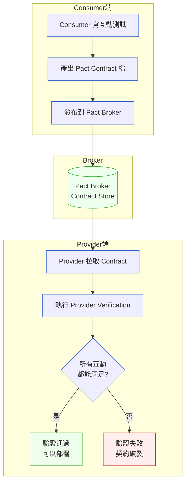

# 第 12 章｜契約測試與整合測試
## ⸺ 測試金字塔的中層,常常是最難說清楚的那一層

> **前置閱讀**:[第 11 章｜單元測試與 TDD 的落地](./ch-11-unit-tdd.md)
> **下游章節**:[第 13 章｜測試替身(mock/stub/fake)的取捨](./ch-13-test-doubles.md)

## 12.1 共感現場:「我這邊明明是好的」

你可能也卡在這裡過——本來都測好、都信心滿滿,結果一整合就出事了。

那種感覺很具體:後端說「API 我測過了,沒問題」,前端說「我 mock 的 response 也是照著文件來的」,兩邊都有根據、兩邊都沒錯——然後整合環境一部署,頁面白屏,錯誤訊息說某個欄位是 `null`。

查了半小時,才發現:後端三週前把 `userId` 改成了 `user_id`,Swagger 文件忘了同步,前端的 mock 當然還是舊的。沒有人粗心,沒有人偷懶——但接縫裂了,而且裂得很安靜。

這不是誰的問題。現代服務很少只有一個人、一個 repo。支付閘道、通知服務、帳戶系統——每個團隊各自顧好自己的那一塊,但當兩塊拼起來的瞬間,就是整合的邊界開始說話的時候。而整合邊界很少大聲,通常是靜靜地裂開,直到上了 staging 環境、或者更慘,上了 production。

最難受的地方在於:每一邊的測試都過了,卻在整合的那個瞬間翻車。這不是測試不夠多,而是測試守的位置不對。

那麼問題來了:有沒有一種方法,能讓這條裂縫在每次 CI 跑起來的時候就被抓到,而不是要等到整合環境才現形?

這就是本章要陪你一起想清楚的事。

## 12.2 真正的問題:測試金字塔的中層空洞

讓我們把這件事慢慢拆開來看。

測試金字塔你一定不陌生:底層是跑很快的單元測試,頂層是跑很慢的 E2E 測試,中間那層是整合測試(Integration Test)。理論上,中層負責驗證「兩個東西接在一起」的那個接縫。可是在實務裡,中間那層常常是長得最奇怪的:有人把它寫成「起一個 database、跑一個完整 use-case」的大型測試,有人乾脆略過中層、直接靠 E2E 擋。

這不是大家不懂測試金字塔。真正的問題是——**整合測試的邊界不夠清晰**。

我們往往把「整合」當成一個詞,但它背後藏著三種截然不同的接縫,各自需要不同的守法:

1. **資料庫邊界** — 你的 SQL/ORM 下去,真實的資料庫引擎還認識你嗎? schema 有沒有跟得上? 遷移腳本有沒有副作用?
2. **服務與服務之間的同步邊界** — 你呼叫別人的 HTTP API,它的 response 格式有沒有你以為的那些欄位?你的期待有沒有變成雙方共識?
3. **服務與服務之間的非同步邊界** — 你透過訊息佇列(Message Queue)和別人溝通,訊息格式有沒有一致?消費者和生產者對 schema 的理解有沒有分岐?

這三種接縫如果混在一起測,就會出現一種很累的整合測試:起一個完整的環境,每次跑都要五分鐘,出錯了也不知道是哪條接縫裂了。更麻煩的是,三種接縫混在同一個測試裡,也讓失敗訊息模糊——你無法快速判斷是 schema 飄移、欄位改名,還是訊息格式衝突。

也就是說,「整合測試」這個詞背後藏著好幾種不同的問題。而契約測試(Contract Testing)是專門為「服務與服務之間的邊界——包含同步 HTTP 和非同步訊息」所設計的解法——它不是整合測試的替代品,而是填補兩個特定空洞的工具。搞清楚這個定位之後,接下來的選擇就會清晰很多。

## 12.3 一起做判斷:三條接縫,三種策略

順著上面的分類,我們來看每一條接縫應該怎麼守。這一節的邏輯是:先把接縫說清楚,再選對應的工具——工具的選擇是結果,不是起點。

### 12.3.1 資料庫邊界:讓真實資料庫說話

資料庫邊界的整合測試,目的是確認你的 SQL/ORM 在真實 schema 下能正確運作。這裡有一個容易被跳過的關鍵:**要跑真實的資料庫引擎,不是 in-memory 的替代品**。

SQLite 在行為上和 PostgreSQL 17 不一樣。`RETURNING`、視窗函數、JSON 操作——有些語法 SQLite 不支援,有些行為細節不同,而你的生產環境跑的是 Postgres。測了等於沒測。

一個實用的做法是用 Docker 起一個 PostgreSQL 17 容器,搭配遷移工具(如 Flyway 或 Liquibase)在測試開始前跑一次乾淨的遷移,每個測試用例之後 rollback 或清空。這個策略讓測試相互隔離,又保留了真實引擎的行為。

但這種做法有個問題:每個工程師的本機 Docker 環境都不一樣,有人 daemon 沒跑,有人版本不符,CI 和本機很容易出現行為差異。這就帶出了下一個工具——**Testcontainers**(testcontainers.com)。

Testcontainers 是一個程式庫,讓你在測試程式碼裡用幾行 code 宣告「我需要一個 PostgreSQL 17 容器」,測試結束後自動清掉。它把「起容器」這件事內嵌進測試生命週期,CI 上和本機行為完全一致,不需要事先準備好一個手動管理的 database container。這樣一來,「資料庫邊界的整合測試」就變成了一件可以穩定跑的事,而不是一個需要提前協調環境的儀式。

資料庫邊界守住了,我們自然會往上問:服務與服務之間的邊界,又該怎麼守?

### 12.3.2 服務間同步邊界:消費者驅動契約測試

這是本章最核心的那一塊,也是最容易講得讓人困惑的地方——所以我們慢慢來。

**什麼是消費者驅動契約測試(Consumer-Driven Contract Testing)?**

想像這樣的關係:服務 A(消費者,Consumer)呼叫服務 B(提供者,Provider)的 API。傳統做法是 B 把 API 文件寫好、A 照著文件寫 mock、兩邊各自測。問題是文件可能過期,而且兩邊都不知道對方的 mock 是不是還在對的狀態。這就是開頭那個 `userId` → `user_id` 悲劇發生的根本原因。

消費者驅動契約的思路翻轉了這件事:**由消費者 A 先描述「我只需要你給我這些」——這叫做契約(Contract)**,然後把這份契約交給提供者 B,讓 B 在自己的測試裡驗證「我確實能提供你需要的」。

這樣的好處是:B 的 API 不管怎麼演化,只要還能滿足 A 寫下的契約,它就沒有破壞性變更。反之,一旦 B 改掉了 A 依賴的欄位,契約驗證會立刻失敗——不需要等整合環境。

讓我們用一張圖把這個流程畫出來,這樣會清楚很多:



目前最廣泛採用的工具是 **Pact**(pact.io),它提供了消費者端寫契約、提供者端驗證契約的完整流程,並有 Pact Broker 作為契約的中央存放和版本管理。

這個流程的關鍵在於:兩邊的測試都在各自的 CI 裡獨立跑,不需要同時啟動對方的服務。**消費者的測試快,提供者的驗證也快**——整個過程比起起一個完整整合環境要便宜非常多。

順著這個道理往下想:契約要跑得快、又要能安心讓提供者自由演進,靠的是 Pact 一個關鍵設計——**寬鬆比對(Loose Matching)**。它的規則是:只要消費者需要的欄位存在、型別正確,提供者多給任何額外欄位都不會讓測試失敗。舉例來說:消費者契約只驗證 `user_id`、`balance`、`currency` 三個欄位;但提供者 API 實際回傳了 `user_id`、`balance`、`currency`、`last_login`、`preferences` 五個欄位——寬鬆比對確保了多出來的那兩個欄位不會讓契約驗證失敗。這個設計很重要,因為它讓契約只描述消費者「真正用到」的那一小部分,而不是提供者 API 的全貌;也正因為如此,提供者才能放心新增欄位、調整內部實作,而不必擔心驚動一份和自己無關的契約。這個原則會在後面決定契約要寫多細,先記住它,再往下看就會順很多。

這裡有一個細節值得多說一句。很多人第一次接觸 Pact 時會問:「消費者端的測試,到底在測什麼?」答案是:它在測**消費者自己的行為**——「當我收到這樣格式的回應,我的程式碼會正確處理嗎?」同時,它把這個「我期待的回應格式」記錄成契約存起來。真正驗證提供者能不能給出那個格式,是在提供者端的 Verification 步驟。這個分工很重要:消費者不需要啟動提供者,提供者不需要啟動消費者,兩邊各自跑各自的,透過 Broker 上的契約檔案溝通。

同步的 HTTP 邊界說清楚了,正因為同樣的「格式不一致」問題也會出現在非同步訊息上,我們接著看非同步邊界。

### 12.3.3 服務間非同步邊界:訊息契約測試

當兩個服務不是透過 HTTP 直接溝通,而是透過訊息佇列(Message Queue,MQ)——例如 Kafka、RabbitMQ——傳遞事件時,同樣的「格式悄悄跑掉」問題就會以不同的面貌出現。

生產者(Producer)發了一個 `payment.completed` 事件,消費者(Consumer)讀進來解析——如果生產者某天把 `amount` 欄位從整數改成字串,消費者可能要等到下一次事件流進來才發現炸了。而且這種炸法更難抓:沒有立即的 HTTP 500,只有靜靜地積在佇列裡的損壞訊息。

Pact 有一個訊息格式契約(Message Pact)的擴充,讓你用和 HTTP 契約相似的方式描述「我期待收到的訊息格式」,並讓生產者端驗證自己發出的訊息符合這個格式。整個流程和 HTTP 契約測試一樣走 Pact Broker,差別只在於不是驗 HTTP response,而是驗訊息的 payload schema。

非同步邊界有一個特別值得注意的地方:由於消費者和生產者不在同一個時間點運行,這個接縫更容易被漏測。很多團隊花力氣守住了 HTTP 邊界,卻讓 MQ 的格式在無人監看的情況下飄走。把訊息契約測試和 HTTP 契約測試一起納入 CI,才是把非同步邊界真正守住的做法。

### 12.3.4 你是提供者時:防守消費者的破壞性變更

有時候你是提供者那一側。你做了一個改動,覺得「只是重構,行為不變」,但消費者端有一個欄位你沒注意到已經被依賴了。

這種情況,Pact 的 Provider Verification 就是你的護欄:只要消費者有寫下契約,你每次改完跑一次驗證,立刻知道有沒有破掉別人的期待。

這也是「消費者驅動」這四個字最重要的含義:不是提供者決定它要給什麼,而是**消費者的實際使用方式定義了什麼是「破壞性變更」**。提供者可以自由新增欄位、重構內部實作,只要消費者依賴的那幾個欄位還在、型別還對,就不是破壞性變更。API 版本管理的難題,很大一部分都可以用這個框架重新思考。

### 12.3.5 四種接縫的選型決策表

現在我們把三條接縫加上 E2E 放在一起,整理成一張決策表。用法很簡單:先問「我要守的是哪條接縫」,再選對應的策略——不要一開始就問「要用什麼工具」。

| 接縫類型 | 推薦策略 | 測試工具方向 | 跑的速度 | 環境需求 |
|---|---|---|---|---|
| 資料庫邊界 | 真實引擎 + 遷移腳本 | Docker + Testcontainers | 中(秒~分鐘) | Docker |
| 服務間 HTTP 邊界 | 消費者驅動契約測試 | Pact、Spring Cloud Contract | 快(毫秒) | Pact Broker |
| 服務間非同步邊界(MQ) | 訊息契約測試 | Pact Message Pact | 快(毫秒) | Pact Broker |
| 完整端到端流程驗證 | E2E 測試(金字塔頂端) | Playwright、Cypress | 慢(分鐘) | 完整環境 |

把每條接縫都用 E2E 守,跑起來就會又慢又脆弱;把資料庫邊界全用 mock 跳過,就會出現「本機過了、staging 炸了」的悲劇;讓 MQ 邊界沒有任何契約覆蓋,就是在等一個靜靜損壞的訊息流。每條接縫有它自己的守法,弄清楚接縫在哪裡,選型才有依據。

## 12.4 容易絆倒的地方

下面這幾個地雷在實務上很常見。我們先理解「為什麼會這樣」——因為每一個都有它的來由,不是誰不小心——再看修正方向。

---

**絆倒處一:契約越寫越像整份 API 規格書**

剛開始寫 Pact 契約的時候,很容易把提供者的所有欄位都驗一遍。畢竟文件就在那裡,複製過來感覺很安心。但這樣做的契約,一旦提供者新增了任何欄位,消費者端就會失敗——即使那個欄位和消費者完全無關。

這讓契約變成了一個脆弱的鎖:提供者不敢加欄位,消費者也不想維護一份老是紅燈的契約。結果大家都覺得「Pact 不好用」,其實是用法偏了。

> **修正方向**:回到前面提過的寬鬆比對(Loose Matching)——契約只描述消費者實際用到的欄位,不用到的不管它,提供者多給欄位不會讓測試紅燈。這不是一個要額外背下來的規則,而是 Pact 本來就有的行為;真正要調整的,是寫契約時的習慣:每加一個驗證斷言之前,先問一句「我的程式真的用到這個欄位嗎」。把這個習慣落實下去,契約會安靜很多。

---

**絆倒處二:整合測試直接對外部 API 發真實 HTTP 請求**

有些整合測試會在跑的時候真的呼叫外部支付 API、真的送 SMS——這在開發機上乍看沒問題,但一旦進 CI,你就面對幾個麻煩:需要真實的 API key、網路不穩會讓測試間歇性失敗、每次跑可能產生真實費用或副作用。

> **修正方向**:外部 API 邊界的整合測試,用 WireMock 或 MockServer 起一個本機 stub 服務,讓你的應用程式對著這個 stub 發請求。它速度快、可以精確控制回應、沒有副作用——這樣的測試才能穩定進 CI。

---

**絆倒處三:Pact Broker 沒人維護,契約慢慢變成殭屍**

Pact 需要一個 Broker 作為契約的中央倉庫。一開始很興奮地架起來、發布了幾個契約——但三個月後,消費者 A 的服務改版了,舊的契約沒人刪,新的契約格式也沒人確認對不對。提供者驗證一直過,但過的是已經沒人用的舊契約。整個機制靜靜地失去了意義。

> **修正方向**:在 Pact Broker 開啟「can-i-deploy」檢查,讓部署前必須確認提供者的最新版通過了所有有效消費者的驗證。搭配 Webhook 在契約發布或驗證失敗時通知相關團隊——讓這套機制變成 CI 的一部分,而不是一個需要人去關注的外部系統。

---

**絆倒處四:把「整合測試」當成測試邏輯的地方**

整合測試的用途是驗證「接縫在不在」,不是驗證「業務邏輯對不對」。但有時候因為整合測試起了真實資料庫,大家就開始在裡面塞各種邊界條件、驗各種計算結果。

這會讓整合測試越來越慢、越來越難維護,而且出錯了不知道是接縫問題還是邏輯問題。

> **修正方向**:業務邏輯的邊界條件,還是回到單元測試去驗(第 11 章談過的)。整合測試只問一件事:「兩個東西接起來,資料有沒有流對?」越聚焦這個問題,整合測試就越乾淨。

---

**絆倒處五:MQ 邊界沒有訊息契約,格式悄悄飄走**

非同步邊界很容易被忽略——因為它不像 HTTP 那樣有立即的錯誤回傳。訊息格式改了,通常要等到消費者在某次處理事件時才炸,而且炸的現場往往離改動的時間點很遠,很難追溯。

很多團隊在引入 Pact 之後,只守了 HTTP 接縫,MQ 的訊息格式繼續靠「大家默默知道」的共識維持——這份共識比文件還脆弱。

> **修正方向**:把非同步邊界也納入 Pact 的訊息契約測試。生產者端驗證自己發出的訊息格式符合消費者寫下的契約;消費者端驗證自己的解析邏輯能正確處理預期的訊息格式。一樣走 Pact Broker,一樣進 CI——讓 MQ 邊界和 HTTP 邊界受到同等的保護。

## 12.5 帶得走的工具 ⸺ 一頁式「服務間契約檢查清單」

把契約測試做對,光靠選對工具還不夠。有幾個容易遺漏、但後來會很懊悔的環節,得有人在流程裡守住——特別是治理那一塊。下面這張清單的目的,就是讓你在引入或審查契約測試時,有一個可以過一遍的參照。

```text
服務間契約檢查清單 ⸺ {消費者服務名稱} ↔ {提供者服務名稱}

── 消費者端 ──
[ ] 契約只描述消費者實際用到的欄位(非整份 API spec)
[ ] 每個互動(Interaction)都對應一個真實的業務場景,有命名
[ ] 契約已發布到 Pact Broker,並標記了消費者版本(git SHA)
[ ] 本機可執行消費者端契約測試(不需要啟動提供者)

── 提供者端 ──
[ ] CI 中有 Provider Verification 步驟,拉取 Broker 上的最新契約
[ ] 驗證失敗會阻斷 CI(不只是 warning)
[ ] 部署前執行 can-i-deploy 確認消費者端契約都有通過

── 非同步邊界(如有 MQ)──
[ ] MQ 訊息格式已有對應的 Pact Message Pact 契約
[ ] 生產者端 CI 驗證訊息格式符合消費者契約
[ ] 消費者端 CI 驗證解析邏輯能正確處理預期訊息格式

── 契約治理 ──
[ ] Pact Broker 有 Webhook 通知機制(契約更新 → 觸發提供者重新驗證)
[ ] 定期確認 Broker 上沒有已廢棄但未刪除的舊契約
[ ] 消費者與提供者的負責人都知道如何查看 Broker 上的驗證結果
[ ] 了解 Webhook 與 can-i-deploy 是整套機制的骨架——沒有它們契約會淪為無人在意的文件

── 環境 ──
[ ] 整合測試不依賴外部真實 API(用 WireMock 或等效 stub)
[ ] 資料庫整合測試使用真實引擎(非 in-memory 替代品)
[ ] CI 可獨立跑每一段測試,不需要依賴特定的整合環境
```

這張清單有四個區塊:消費者、提供者、非同步邊界、治理。最容易被跳過的是治理那一欄——Webhook 和 can-i-deploy 聽起來像是「之後再說的優化」,但它們才是讓整套機制真正運作的骨架。沒有它們,契約很快就會淪為無人在意的文件。同樣地,MQ 那一欄也容易被遺忘——服務間如果有非同步溝通,就應該一起守,不能只守 HTTP。

### 12.5.1 範例:ClearPay 支付閘道與帳戶服務的契約

你還記得開頭說的 `userId` → `user_id` 那個案例嗎?ClearPay 就是那家公司——一家虛構的台灣金融科技公司,旗下有兩個微服務:負責清算的支付閘道服務(Payment Gateway)和負責帳戶餘額的帳戶服務(Account Service)。Payment Gateway 是消費者,Account Service 是提供者。

那次欄位改名發生在三週前。如果當時已經有一份 Pact 契約,這張清單填起來會是這樣——每一欄旁邊的註解說明「為什麼這個環節重要」:

```text
服務間契約檢查清單 ⸺ payment-gateway ↔ account-service

── 消費者端 ──
[x] 契約只描述消費者實際用到的欄位
    欄位:user_id, balance, currency
    ← payment-gateway 只需要這三個欄位做授權判斷;
      account-service 回傳的 last_login、preference 等欄位與它無關,
      不寫進契約才不會被無關變更牽連。

[x] 每個互動都有業務場景命名
    互動一:「取得有效帳戶的餘額」
    互動二:「帳戶不存在時回傳 404」
    ← 用業務場景命名而非用 HTTP method,
      讓驗證失敗時立刻知道是哪個業務流程的接縫裂了。

[x] 契約已發布到 Pact Broker
    Consumer version: git-sha-a3f812
    Branch: main

[x] 消費者端契約測試可在本機獨立執行 ✓
    ← 不需要啟動 account-service,payment-gateway 工程師可以
      在本機直接跑契約測試,驗證自己的解析邏輯對預期格式能正確運作。

── 提供者端 ──
[x] CI 有 Provider Verification 步驟
    account-service CI 在每次 PR merge 後拉 Broker 的
    payment-gateway 契約驗證
    ← 當 account-service 開發者把 userId 改成 user_id 時,
      這一步會立刻失敗並阻斷 CI,在 merge 之前就抓到問題。
      那次白屏事件就不會發生了。

[x] 驗證失敗阻斷 CI:是(exit code 1)

[x] 部署前執行 can-i-deploy:是(Pact CLI 整合到 deploy script)
    ← can-i-deploy 查詢 Broker「這個版本的提供者,
      有沒有通過所有消費者的驗證」;沒過就不讓部署,
      這是整套機制最後的一道護欄。

── 非同步邊界(如有 MQ)──
[ ] 本案例服務間僅有同步 HTTP 邊界,暫不適用
    ← 若日後引入 Kafka 發布 account.balance_updated 事件,
      應補訂 Pact Message Pact 契約。

── 契約治理 ──
[x] Webhook 已設定:
    Account Service PR merge → 觸發 payment-gateway 重新驗證
    ← 沒有這個 Webhook,account-service 改完不會主動通知
      payment-gateway 重新跑驗證;契約就會靜靜地落後。

[x] Broker 上無過期廢棄契約
    ← 每季由平台組審查一次 Broker 上的活躍契約清單。

[x] 雙方 owner 都在 #contract-alerts Slack 頻道
    ← 驗證失敗第一時間通知到人,不需要主動去 Broker UI 查。

[x] 了解治理機制是骨架:Webhook + can-i-deploy 沒到位,
    契約只是死文件。✓

── 環境 ──
[x] payment-gateway 整合測試用 WireMock stub 模擬 account-service
[x] account-service 資料庫整合測試使用 PostgreSQL 17(Testcontainers)
[x] CI 兩段測試均可獨立執行
```

你看,那次 `userId` → `user_id` 的改動,會在 account-service 的 CI 裡跑 Provider Verification 的那一步就被抓到——不需要等整合環境,也不需要等前端白屏。ClearPay 的工程師不用再花半小時查是誰動了什麼,因為 CI 已經把答案指給他們看了。

從這個範例可以看到:清單上每一欄都不是形式,都對應到一個真實發生過(或可能發生)的問題。把它一欄一欄過完,整套機制才能真正轉起來。

## 12.6 本章回顧

讀完這一章,你應該已經能:

- [ ] 分辨測試金字塔中層的三種接縫(資料庫、服務間 HTTP、訊息),並知道各自對應的測試策略
- [ ] 解釋「消費者驅動契約測試」的核心翻轉:由消費者定義需求、提供者驗證能否滿足
- [ ] 用「只寫消費者實際用到的欄位」這個原則,避免契約變成脆弱的 API 規格鎖
- [ ] 知道非同步邊界(MQ)同樣需要訊息契約測試,不能只守 HTTP
- [ ] 在引入 Pact 時,把 can-i-deploy 和 Webhook 當成骨架而非優化——沒有它們,契約治理就是空架子
- [ ] 用一張清單審查現有的契約設置是否完整

如果想先從一件事開始——**先寫一個消費者端的契約互動、把它發布到 Pact Broker**。只要有了第一份契約,提供者端的驗證就有了依據,整套機制才能真的轉起來。第一步永遠是最重要的那一步,之後的每一步都會因為有了基礎而變得自然。

## Cross-References

- **上一章**:[第 11 章｜單元測試與 TDD 的落地](./ch-11-unit-tdd.md) ⸺ 單元測試守業務邏輯,本章守服務邊界
- **下一章**:[第 13 章｜測試替身(mock/stub/fake)的取捨](./ch-13-test-doubles.md) ⸺ 契約測試裡用到的 stub/mock 選型深探
- **強連結**:[第 15 章｜與 CI 整合的測試流水線](./ch-15-ci-testing.md) ⸺ 把契約測試接入 CI 的具體做法
- **強連結**:[第 19 章｜跨團隊的介面契約與相依](../part-04-collaboration/ch-19-interface-contracts.md) ⸺ 從工程師層上升到團隊協作層的契約管理
- **跨書連結**:[SA/SD Playbook — 第 27 章｜測試策略設計](https://github.com/EddyKuo/sa-sd-playbook) ⸺ 架構高度的「為可測試性而設計」
- **跨書連結**:[QA Playbook](https://github.com/EddyKuo/qa-playbook) ⸺ 契約測試在整體測試策略中的定位與治理
