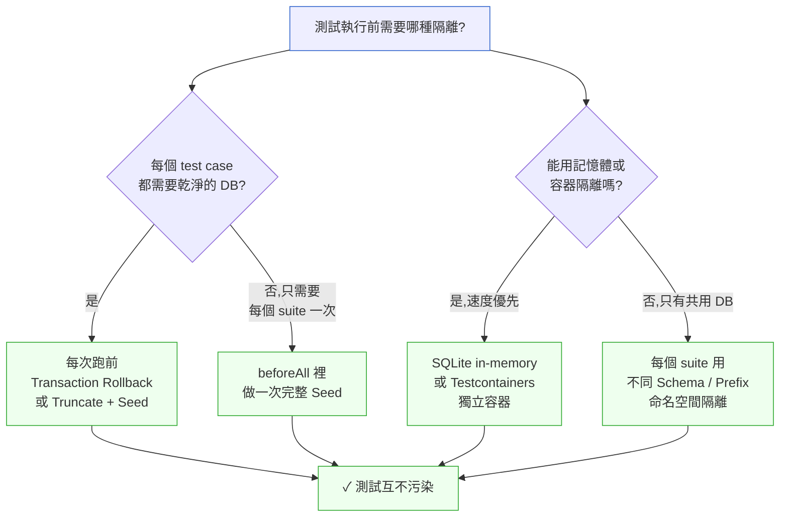

# 第 14 章｜測試資料與測試環境
## ⸺ 當測試在「不同的世界」跑,結果就沒辦法相信

> **前置閱讀**:[第 13 章｜測試替身(mock/stub/fake)的取捨](./ch-13-test-doubles.md)
> **下游章節**:[第 15 章｜與 CI 整合的測試流水線](./ch-15-ci-testing.md)

## 14.1 共感現場:那個「只有本機才能跑過」的測試

你可能也遇過這樣的狀況——測試在你的電腦上是綠的,推上去 CI 就紅了;或者更糟的是,昨天是綠的,今天什麼都沒改,卻突然紅了。那種感覺很奇怪:你明明做對了所有事,但 CI 告訴你「不行」。你開始懷疑自己是不是漏了什麼,或者開始覺得「CI 就是這樣,不穩定是正常的」——後者其實是比前者更危險的念頭。

我帶過一個叫小燕的工程師,她在一家做線上購物平台的公司 Cartly 工作。Cartly 是個成立三年的電商平台,商品評論是那一季要補齊的功能——讓買過東西的用戶可以留下星評和文字評論,賣家看到後可以公開回覆。那陣子團隊剛把後端 API 做完,小燕負責補整合測試。

她很認真地寫了一批測試:測試新增評論之後資料是否正確寫入、測試評論數量統計 API 的回傳值、測試同一個用戶不能對同一商品重複評論。她在本機反覆跑了幾遍,每一條都通過,然後很開心地把 PR 推出去。

CI 把那批測試全標成了失敗。

小燕把錯誤訊息貼給我看:

> `AssertionError: expected 3 reviews, but got 5`

她說:「我不懂,我在本機插了 3 筆就是 3 筆,怎麼 CI 跑出來會有 5 筆?」

我問她:「跑測試之前你有清過資料庫嗎?」

她停頓了一下:「我每次都手動清的啊——但我沒有把這個清的動作寫進測試裡。」

就在這句話說完的時候,她自己就想通了。CI 環境的資料庫裡,留著上一輪測試跑完沒有清乾淨的 2 筆評論——可能是某個 PR 的 CI 跑到一半失敗、cleanup 步驟沒跑到;也可能是另一個功能的測試在同一個 DB 裡寫了資料。小燕的測試預期「空的資料庫裡插入 3 筆評論,然後查詢應該得到 3 筆」,卻碰上了前人留下的 2 筆殘骸,於是查出來的是 5 筆,斷言失敗。

本機是綠的,因為她每次跑之前都手動清過一遍。CI 是紅的,因為沒有人手動清——也不應該要手動清。「清資料庫」這個動作在她腦子裡是測試流程的一部分,但它沒有被寫進程式裡。

這就是測試資料問題最典型的樣子:**測試本身的邏輯是對的,但它賴以運行的環境是不穩定的,所以結果就變得不可信了。**

這個問題之所以值得一整章來談,是因為它不只是「記得加一行清資料庫的程式碼」這麼簡單。背後有一套值得理解清楚的思路,這套思路一旦建立起來,你對測試環境的判斷會整個不一樣。

## 14.2 真正的問題:測試的可信度,建立在環境的可重複性上

把小燕那個案例慢慢拆開,你會發現問題不在測試邏輯寫錯了,而在一個更深的假設沒有被滿足。

測試之所以有意義,是因為我們相信**兩次執行相同的測試,應該要得到相同的結果**。這聽起來像廢話,但實際上它需要一個條件做保證:測試執行的起始狀態必須是已知的、固定的。如果起始狀態每次都不一樣——資料庫裡殘留著前一輪的資料、環境變數因機器而異、隨機種子每次不同——那測試的「結果」就不是在驗證程式邏輯,而是在驗證「今天的環境剛好長什麼樣」。

也就是說,測試的可信度其實有兩根柱子:

1. **邏輯正確**:測試在驗證對的東西。
2. **環境穩定**:每次執行的起點是可預期的。

大多數人寫測試時只守住第一根柱子,卻讓第二根柱子隨緣。本機剛好乾淨,就通過了;CI 剛好有殘留,就失敗了。而你永遠不知道失敗是因為程式碼真的有問題,還是因為環境恰好不乾淨。

更麻煩的是,當測試的可信度不夠時,有時候「通過」反而更危險——你以為沒問題,但可能只是今天環境剛好補上了你沒有測到的漏洞,下次環境換了就破了。一個測試如果不能讓你相信「綠燈代表真的沒問題」,那它帶給你的安全感是虛假的。

順著這個道理,我們就能理解為什麼「測試資料管理」和「測試環境一致性」在工程上是真正的問題,而不只是「記得清資料庫」這麼簡單的執行細節。它關乎的是:你有沒有辦法相信自己的測試。

這就帶出了本章要一起討論的三個主題:如何建造可控的測試資料、如何讓環境在每次執行前都回到同一個起點、以及如何防止測試之間互相污染。

## 14.3 一起做判斷:讓測試環境變得可預期

### 14.3.1 測試資料的三種建造策略

先從「資料怎麼來」這個問題開始。

測試需要資料,而這些資料的來源決定了你的測試有多脆弱。常見的做法大概有三種:

| 建造方式 | 做法 | 優點 | 風險 |
|---|---|---|---|
| **直接寫死** | `user = { id: 1, name: "Alice", role: "admin" }` | 簡單直接 | schema 一改就全壞;容易到處複製出不同版本 |
| **資料建造者(Builder)** | `UserBuilder().role("admin").build()` | 集中管理、彈性組合、改一處全部更新 | 需要一點初始投資 |
| **共享固定資料(Fixture)** | 從一份 YAML/SQL seed 讀進來 | 接近真實資料形狀 | 測試之間共享,容易污染;fixture 體積往往越長越大 |

對大多數測試場景來說,**資料建造者(Data Builder)** 是最值得養成的習慣。它的概念很簡單:為每一種核心資料型別,寫一個會回傳「合理預設值」的建造器,然後在每個測試裡只覆蓋「這個測試真正在乎的欄位」。

舉個具體的樣子(以 TypeScript / Vitest 0.34 為例):

```typescript
// test/builders/product.builder.ts
export class ProductBuilder {
  private data = {
    id: "prod-001",
    name: "測試商品",
    price: 100,
    stock: 10,
    isActive: true,
    tags: [] as string[],
  };

  withId(id: string)         { this.data.id = id; return this; }
  withPrice(price: number)   { this.data.price = price; return this; }
  withStock(stock: number)   { this.data.stock = stock; return this; }
  outOfStock()               { this.data.stock = 0; return this; }
  inactive()                 { this.data.isActive = false; return this; }
  withTags(tags: string[])   { this.data.tags = tags; return this; }

  build() { return { ...this.data }; }
}
```

這樣一來,當一個測試只在乎「缺貨」這件事,它只要寫:

```typescript
// 只聲明「缺貨」這一件事,其他欄位全由建造者給合理預設值
const product = new ProductBuilder().outOfStock().build();

it("缺貨商品不能加入購物車", () => {
  const result = cart.addItem(product, quantity: 1);
  expect(result.ok).toBe(false);
  expect(result.reason).toBe("out_of_stock");
});
```

與對照版本相比,差異立即可見:

```typescript
// ❌ 舊做法:每個測試都要寫出完整物件,schema 一動就全改
const product = {
  id: "prod-001",
  name: "測試商品",
  price: 100,
  stock: 0,           // 這才是測試真正在乎的欄位
  isActive: true,
  tags: [],
  // 如果 schema 新增 `rating: number`,就要在每個這樣的地方補上
};
```

你看到了嗎?舊做法裡,`name`、`price`、`isActive`、`tags` 全都是在測試裡重複打字的噪音——這個測試根本不在乎這些欄位,但它被迫要填寫它們。當 `Product` schema 在某次功能迭代中新增了一個必填欄位 `rating: number`,你就要去找所有這樣的字面值物件一一補上,否則 TypeScript 就會在每個地方報型別錯誤。

使用 Builder 之後,你只要在 `ProductBuilder.data` 裡補上 `rating: 3.5` 作為預設值,所有測試就自動更新了。這個「只需改一處」的性質在大型 codebase 裡能省下相當多的時間——更重要的是,它讓你能放心重構 schema,因為你知道測試不會因為「欄位漏填」而失敗,而是真的因為「行為不符預期」才失敗。

### 14.3.2 固定種子與隨機資料的取捨

說到這裡,有些讀者可能會想:「測試資料可不可以用隨機值?」

隨機值的誘惑很真實——用亂數產生的資料更接近「真實世界的多樣性」,比手動想像的幾個邊界案例更有機會找到意外的 bug。這個直覺沒有錯,但它有一個代價需要考慮:當測試失敗了,你要怎麼重現那次失敗?

先看一個具體的場景。假設我們用 `Math.random()` 產生評論內容,有一次 CI 失敗了:

```typescript
// ❌ 純隨機:每次執行都得到不同的值
function randomString(len: number): string {
  const chars = "abcdefghijklmnopqrstuvwxyz!@#$%^&*()";
  return Array.from({ length: len }, () =>
    chars[Math.floor(Math.random() * chars.length)]
  ).join("");
}

it("評論內容不能包含特殊符號", () => {
  const content = randomString(20);
  // 有時通過(沒抽到特殊符號),有時失敗(抽到了 @#$)
  // 失敗時的 content 無法重現——下次 CI 再跑就消失了
  const result = review.validate({ content });
  expect(result.ok).toBe(true);
});
```

這個測試在某次 CI 跑出了 `content: "ab!c#xyz%"` 而失敗,顯示出一個真實 bug——`validate` 應該允許某些特殊符號但它沒有。問題是,這個 `"ab!c#xyz%"` 字串在下一次 CI 執行就消失了。你能看到「它壞了」,但不能重現「它為什麼壞」,而這通常讓 debug 困難許多。

一個好用的角度是:**讓隨機性「可重現」**,也就是使用固定種子(Fixed Seed)。先決定一個整數作為隨機種子,每次測試執行都用同一個種子初始化隨機數產生器——這樣產生的「隨機」資料,其實是完全確定性的:

```typescript
// ✅ 固定種子:每次執行都得到相同的「隨機」序列
import { faker } from "@faker-js/faker"; // @faker-js/faker 8.x

beforeEach(() => {
  faker.seed(2026); // 固定種子,每次執行都得到同樣的序列
});

it("評論內容包含中文與標點都能通過驗證", () => {
  const content = faker.lorem.sentence();
  // 種子固定後,faker.lorem.sentence() 每次都回傳同一個字串
  // 例如:"A qui provident consequuntur ducimus."
  // 這個字串在 CI 和本機完全一致,失敗時能立刻重現
  const result = review.validate({ content });
  expect(result.ok).toBe(true);
});
```

固定種子之後,`faker.lorem.sentence()` 在種子 `2026` 之下永遠回傳同樣的字串序列。你既保留了「讓 faker 幫你想出各式各樣的字串」的多樣性,又保留了「失敗時能重現那次確切的資料」的可調試性。

如果你想同時享有「真正的多樣性」和「失敗可重現」兩個好處,可以考慮屬性測試(Property-Based Testing)工具,例如 fast-check(JavaScript)或 Hypothesis(Python)。這些工具會自動記錄讓測試失敗的那個輸入,失敗時你能直接拿到那組值。不過這屬於進階工具,不是每個測試都需要——一般場景,固定種子就夠了。

### 14.3.3 測試環境一致性:讓「起點」每次都一樣

回到小燕的問題:她的測試在 CI 失敗,是因為資料庫的起始狀態每次都不同。

要解決這件事,首先要理解**每個測試在開始之前,必須主動把環境帶回到它預期的起點**,而不是假設別人會幫它清好。這個「主動」很重要:不是靠手動操作、不是靠「前一個測試剛好沒有留髒資料」,而是每個測試自己負責自己的起點。

不過,「帶回起點」有不同的做法,適合不同情境。選哪一種,主要取決於兩個維度:你對隔離程度的需求、以及你對測試執行速度的容忍度。下面的流程圖可以幫你思考:

在看圖之前,先把兩個關鍵問題放在心上:

第一,**你需要多乾淨的隔離?** 如果每個 test case 之間都可能互相影響,那就需要每個 test case 都有自己的乾淨狀態;如果同一個 test suite 裡的 test cases 共用相同的前置資料,那可能只需要在 suite 開始時 seed 一次就夠了。

第二,**你的基礎設施有什麼限制?** 如果可以用容器,Testcontainers 提供最徹底的隔離;如果只能連共用 DB,就要靠 Schema 命名空間來區隔。



從這張圖可以看出,大多數情況下你會面對兩條路:

**Transaction Rollback** 是最常見、也最推薦給整合測試的做法。在每個測試開始時開啟一個資料庫事務,測試結束後不 commit 而是 rollback。資料庫就永遠回到原始狀態,速度又快(不需要真正刪資料再重建)。在 Prisma + Vitest 的環境下,可以用一個簡單的 helper 把這個模式包裝起來:

```typescript
// test/helpers/db-transaction.ts
import { prisma } from "../src/db";

export async function withTransaction(fn: () => Promise<void>) {
  await prisma.$transaction(async (tx) => {
    await fn();
    // 永遠 rollback:測試結束後資料消失,不留痕跡
    throw new Error("__test_rollback__");
  }).catch((e) => {
    if (e.message !== "__test_rollback__") throw e;
  });
}

// 在測試裡這樣用:
it("新增評論後評論數量 +1", async () => {
  await withTransaction(async () => {
    await reviewService.create({ productId: "p1", content: "好", rating: 5 });
    const count = await reviewService.count({ productId: "p1" });
    expect(count).toBe(1); // 不管 CI 上面有沒有殘留資料,這裡永遠是 1
  });
});
```

對於純單元測試來說,Transaction Rollback 已經夠了,也最快。對於整合測試如果需要真正測試資料庫的行為(例如要測 constraint 或 trigger),則可以考慮 **Testcontainers**——它會在測試開始時啟動一個真實的 PostgreSQL 容器,測試結束後整個容器丟掉,隔離程度最徹底。代價是每次啟動容器需要幾秒鐘,但對於整合測試而言,這個代價通常值得。

### 14.3.4 避免測試互相污染

有了環境隔離的機制之後,還需要留意一類更隱蔽的問題:測試之間的隱性耦合。

測試污染(Test Pollution)有兩種方向值得注意:

**前污染**:前一個測試留下的狀態影響了後一個測試。這就是小燕那個案例的本質——資料庫有殘留。用 Transaction Rollback 或容器隔離可以解決資料層面的前污染。但程式層面的前污染同樣要小心:全域變數被修改、module-level 的 singleton 被改了狀態、`beforeAll` 裡建立的物件被測試修改後沒有還原——這些都可能讓測試之間悄悄耦合。

最安全的做法是:如果一個測試會修改一個物件,那個物件就應該在 `beforeEach` 重新建立,而不是被共用:

```typescript
// ❌ 有風險:reviewService 在 beforeAll 建立一次,但 spy 狀態會殘留
let reviewService: ReviewService;
beforeAll(() => {
  reviewService = new ReviewService(prisma);
});

it("test A: 驗證 save 被呼叫", () => {
  const spy = vi.spyOn(reviewService, "save");
  reviewService.create(/* ... */);
  expect(spy).toHaveBeenCalled();
  // 這裡沒有 spy.mockRestore()!下一個測試的 reviewService.save 仍是 spy
});

// ✅ 安全:每個測試都從乾淨的物件開始
let reviewService: ReviewService;
beforeEach(() => {
  reviewService = new ReviewService(prisma); // 每次重建
});
```

**順序依賴**:測試 B 依賴測試 A 先跑完並留下某個狀態。這更隱蔽,因為在本機按順序跑通常沒問題,但一旦 CI 環境改變了執行順序(或做平行化),就會隨機失敗。

> 一個簡單的自測方式:隨機打亂測試的執行順序(Vitest 用 `--sequence.shuffle`,Jest 用 `--randomize`),看看有沒有測試因此失敗。如果有,那個測試就有順序依賴——它沒辦法獨立存在,需要修正。

「所有測試能以任意順序獨立執行」不只是一條規則,它是一個讓你對測試套件有信心的前提。只要這條成立,你就能放心做 CI 平行化、放心拆分測試分批跑,而不必擔心「這幾個測試一定要按這個順序執行才不會壞」。

## 14.4 容易絆倒的地方

掌握了上面的做法之後,還有幾個地方在實際執行時很容易卡住。這些地方大多數人都絆過,有人絆了好幾次才想通,先幫你提前看一眼。

**絆倒處一:Fixture 越長越大,沒有人知道哪個測試用到哪一筆**

這個情況很常見。一開始放了 10 筆 seed 資料,很快就長到 100 筆——因為每次有測試需要一個稍微不同的情境,就往 fixture 裡加一筆。到最後沒有人敢刪任何一筆,因為不知道誰在用。fixture 檔案變成了一個「神祕的資料堆」,只能加不能刪,最後成為整個測試套件最脆弱的地方。

任何一次 schema 改動都要去改 fixture,但 fixture 裡的資料沒有意圖說明,你不知道哪筆是真的重要、哪筆只是某個早就不存在的測試留下的遺跡。

> 修正方向:讓每個測試自己建造它需要的資料(用 Builder),fixture 只保留「所有測試都共用的系統初始狀態」(比如基礎的分類、設定值、必要的查找表資料),不讓它承擔「測試場景資料」的角色。場景資料是每個測試自己的責任。這樣 fixture 就能保持小而穩定,每一筆資料都有存在的理由。

**絆倒處二:在 CI 用不同的環境變數,跑出不同的行為**

這個問題有時候很難察覺,因為表面上看起來是「程式碼問題」,但根本原因是「環境設定不一致」。比如本機的 `DATABASE_URL` 指向 PostgreSQL 17,CI 卻指向一個舊版本的映象;或者本機的時區是 `Asia/Taipei`,CI 是 `UTC`——時區差異可以讓「查詢今天的訂單」這種測試在 CI 上神秘失敗,因為 UTC 的「今天」和台北時間的「今天」在深夜的邊界時刻是不同的。

這類問題特別惡毒,因為它們不是每次都失敗,而是「在特定時間點或特定機器上才失敗」——這讓排查的難度倍增。

> 修正方向:把測試需要的環境變數集中管理在一個 `.env.test` 檔案,並且明確列出哪些值在 CI 和本機可能不同。如果用容器(Docker Compose)把測試的依賴服務也容器化,本機和 CI 就跑在完全一樣的基礎設施上,這類差異就大幅減少。時區問題則建議直接在測試初始化時設定 `process.env.TZ = "UTC"`,讓兩端行為一致。

**絆倒處三:「這個測試要有 admin 身份,所以我先跑登入測試讓它設定 session」**

這是一個隱形的順序依賴陷阱。表面上看起來很聰明——複用了另一個測試的副作用——但它讓你的測試不能獨立存在。一旦那個「登入測試」因為任何原因沒跑、被跳過、或者改了行為,這個測試就無聲無息地失去了它賴以存在的前提。

更麻煩的是,這種依賴通常沒有文件化。六個月後的你(或者另一位工程師)看到這個測試失敗,根本不會想到「哦,它需要先跑那個登入測試」——而是會花時間追查程式碼邏輯,結果問題不在那裡。

> 修正方向:每個需要特定身份的測試,應該自己透過 Builder 或 helper 直接建立那個身份的資料,而不是靠其他測試的副作用。這樣每個測試才能獨立跑、隨機跑、甚至平行跑。例如:

```typescript
// ✅ 每個測試自己建立所需的身份,不靠其他測試的副作用
it("admin 可以刪除任意評論", async () => {
  const admin = await UserBuilder().admin().createInDB(prisma);
  const review = await ReviewBuilder().create(prisma);
  const result = await reviewService.delete(review.id, { as: admin });
  expect(result.ok).toBe(true);
});
```

**絆倒處四:以為「用 mock 就不需要管測試環境」**

這個誤解很常見,因為 mock 確實強大——它能把外部依賴都擋住,讓測試在一個隔離的空間裡跑。但 mock 只能擋住「外部依賴」,它沒辦法幫你管理「被測程式碼本身的內部狀態」。

如果你的 `ReviewService` 有一個 in-memory 的快取 Map、或者在 module 層級持有一個連線物件、或者有 `static` 的計數器——這些都不是 mock 能管的,需要你自己在 `beforeEach` 重置。

> 修正方向:對 mock 和「環境隔離」的適用範圍有清楚的理解——前者處理「外部依賴的隔離」,後者處理「測試的內部狀態管理」。兩件事都要做,不能互相替代。一個好用的自問是:「如果我把這個測試挪到一個全新的 Node.js process 裡執行,它還能通過嗎?」如果能,那它的隔離做得夠好。

## 14.5 帶得走的工具 ⸺ 一頁式「測試環境設定清單」

把上面談到的判斷點整理成一份清單,在每次為新功能設計測試環境時過一遍。它不需要每次都全部回答,但能提醒你「這個地方有沒有考慮到」。

```text
測試環境設定清單 ⸺ {功能 / 模組名稱}

── 資料建造 ──────────────────────────────────────────
□ 測試資料是否用 Builder 或 Factory 建造?
  - 核心 Builder 放在:{路徑}
  - 還在用字面值的地方:{說明 或「無」}

□ 隨機資料是否設定了固定種子?
  - 種子值:{整數} / 工具:{faker-js / fast-check / Hypothesis / 其他}
  - 未設定原因:{說明 或「不用隨機資料」}

── 環境起始狀態 ──────────────────────────────────────
□ 每個 test case 執行前如何確保起始狀態乾淨?
  - 做法:{Transaction Rollback / Truncate+Seed / Container / Schema 隔離}

□ Fixture(共用種子資料)的範圍是否有界限?
  - Fixture 只負責:{系統初始設定 / 所有測試共用的靜態資料}
  - 不放在 Fixture 的:測試場景資料(由各 Builder 負責)

── 環境一致性 ────────────────────────────────────────
□ 本機和 CI 使用的服務版本是否一致?
  - DB 版本:{PostgreSQL 17 / MySQL 8 / ...}
  - 其他服務:{Redis / MQ / ...}
  - 對齊方式:{Docker Compose 版本固定 / testcontainers / 其他}

□ 環境變數是否集中管理?
  - 測試用 env 檔:{.env.test}
  - 本機與 CI 的差異:{已記錄在 ... / 無差異}

□ 時區設定是否明確?
  - 測試初始化是否設定 process.env.TZ:{已設 / 不涉及時間邏輯}

── 污染防護 ──────────────────────────────────────────
□ 測試是否可以隨機順序執行?
  - 驗證方式:{--sequence.shuffle 跑過 / 未驗證}

□ 是否有 beforeEach 中重建被多個測試共用的物件?
  - 共用物件清單:{無 / 以下幾個已在 beforeEach 重建:...}

□ 是否有測試依賴其他測試的副作用?
  - 已知順序依賴:{無 / 以下已修正:...}
```

這份清單不是要你每次都全部填完——它更像一面鏡子,幫你在設計測試環境的時候,看到那些「通常被遺忘的角落」。

### 14.5.1 範例:Cartly 商品評論功能的測試環境設定

回到小燕那個案例。那次 CI 失敗之後,我們花了大約半天把評論功能的測試環境整理了一遍。下面是填好的清單,以及每個決策背後的原因。

```text
測試環境設定清單 ⸺ 商品評論(Product Review)

── 資料建造 ──────────────────────────────────────────
□ 測試資料是否用 Builder 或 Factory 建造?
  - 核心 Builder 放在:test/builders/review.builder.ts
  - 還在用字面值的地方:無(已統一重構)

□ 隨機資料是否設定了固定種子?
  - 種子值:2026
  - 工具:@faker-js/faker 8.x

── 環境起始狀態 ──────────────────────────────────────
□ 每個 test case 執行前如何確保起始狀態乾淨?
  - 做法:Transaction Rollback(用 Prisma 的 $transaction + test helper)

□ Fixture 的範圍是否有界限?
  - Fixture 只負責:商品分類、評分等級設定(系統初始化靜態資料)
  - 不放在 Fixture:每個評論測試的評論內容、評分、使用者(由 Builder 建)

── 環境一致性 ────────────────────────────────────────
□ 本機和 CI 服務版本是否一致?
  - DB 版本:PostgreSQL 17.2
  - 對齊方式:docker-compose.test.yml 鎖定 postgres:17.2-alpine

□ 環境變數是否集中管理?
  - 測試用 env 檔:.env.test
  - 本機與 CI 差異:DATABASE_URL 不同(本機 localhost,CI 用容器 hostname)
    已在 .env.test.ci 另存一份,CI 用 --env-file .env.test.ci 啟動

□ 時區設定是否明確?
  - 測試初始化設定:process.env.TZ = "UTC"(前後端統一用 UTC)

── 污染防護 ──────────────────────────────────────────
□ 測試是否可以隨機順序執行?
  - 驗證方式:vitest --sequence.shuffle 跑過,全綠

□ 共用物件是否在 beforeEach 重建?
  - 先前有一個 reviewService 在 beforeAll 建立後被多個測試修改 spy
  - 已移至 beforeEach 重建,避免 spy 狀態殘留

□ 是否有測試依賴其他測試的副作用?
  - 無(已驗證)
```

**幾個關鍵決策的說明:**

改造前,評論相關的測試檔案有 5 個,每個都各自定義了 `reviewer` 物件和 `product` 物件的字面值。後來 `Review` schema 加了 `helpfulCount` 欄位,就要去改 5 個地方。改完還要確認沒有漏掉哪個——這種事很容易犯錯。集中到 `ReviewBuilder` 之後,schema 變動只需改一處。

評論內容之所以選用 faker 而不是寫死字串,是因為評論文字的格式多樣(長短不一、含標點、含數字),用隨機產生能更接近真實情境。但不固定種子的話,CI 和本機的資料就不同——有一次某個含特殊符號的評論只在 CI 出現,本機永遠無法重現那個失敗。固定種子之後,那個邊界案例從此可重現。

Transaction Rollback 是解決小燕那次 CI 失敗的核心改動。改成每個 test 都在 transaction 裡跑、結束後 rollback 之後,CI 就不會再看到前一輪的殘留資料。這個改動讓測試套件的通過率從「有時紅」變成了「穩定綠」。

整理完這份清單之後,評論功能的測試在 CI 上從來沒有再隨機失敗過。小燕後來說,她最有感的不是哪一個技術細節,而是「第一次覺得測試是可以相信的」——這正是所有這些做法想要換來的東西:測試的可信度。

## 14.6 本章回顧

讀完這一章,你應該已經能:

- [ ] 說清楚測試環境不一致為什麼會讓測試「在本機是綠的、CI 是紅的」,以及這和程式邏輯對不對沒有直接關係
- [ ] 用 Builder 模式建造測試資料,讓 schema 改動只需修改一處
- [ ] 對隨機資料設定固定種子,保留可重現性,同時理解它和「純隨機」的差異
- [ ] 選擇合適的環境隔離策略(Transaction Rollback、Testcontainers、Schema 命名空間),讓每個測試都從乾淨的起點開始
- [ ] 用「隨機順序執行」來自我檢測測試之間有沒有隱性的順序依賴
- [ ] 識別並修正測試污染的兩種方向:前污染與順序依賴

如果只能先做一件事,我會建議——**在 `beforeEach` 裡加上環境隔離**,不管是 rollback 或清資料。這一件事能立刻消除一大類「神秘失敗」,讓測試從「我說不準它可不可以信」變成「我知道它告訴我的是真的」——有了這個底,其他的事情才值得繼續投入。

## Cross-References

- **上一章**:[第 13 章｜測試替身(mock/stub/fake)的取捨](./ch-13-test-doubles.md) ⸺ 替身處理「外部依賴的隔離」,本章處理「測試環境的內部一致性」,兩者互補
- **下一章**:[第 15 章｜與 CI 整合的測試流水線](./ch-15-ci-testing.md) ⸺ 本章打好的環境隔離基礎,讓 CI 流水線能放心做平行化與快取
- **強連結**:[第 11 章｜單元測試與 TDD 的落地](./ch-11-unit-tdd.md) ⸺ Builder 模式和固定種子在單元測試同樣適用
- **強連結**:[第 12 章｜契約測試與整合測試](./ch-12-contract-integration.md) ⸺ 整合測試對環境一致性的需求最高,本章策略直接適用
- **跨書連結**:[SA/SD Playbook](https://github.com/EddyKuo/sa-sd-playbook) ⸺ 「可測試性設計」從架構層為本章提供基礎
