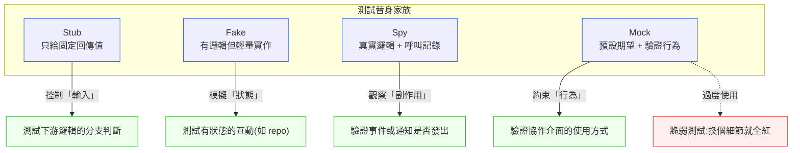

# 第 14 章｜測試替身的取捨
## ⸺ 當 mock 越來越多,測試卻越來越不可信

> **前置閱讀**:[第 12 章｜單元測試與 TDD 的落地](./ch-12-unit-tdd.md)、[第 13 章｜契約測試與整合測試](./ch-13-contract-integration.md)
> **下游章節**:[第 15 章｜測試資料與測試環境](./ch-15-test-data.md)、[第 16 章｜與 CI 整合的測試流水線](./ch-16-ci-testing.md)

## 14.1 共感現場:測試全綠,上線就掛

你可能也遇過這樣的場面。

小雅是一家支付公司 ClearPay 的後端工程師,負責一個核心模組:交易授權服務。這個服務要對接外部的風控 API,在每筆交易送出之前問一聲「這筆通過嗎」。測試當然要寫,因為這是資金流動——沒有測試,沒人敢上線。

小雅花了不少心力,把風控 API 整個 mock 掉,寫了十幾個單元測試,覆蓋了「通過」「拒絕」「超時重試」各種路徑。跑起來速度很快,CI 全綠,她也覺得踏實。

上線前 review 的時候,她把測試展示給帶她的前輩看。前輩默默看了一會兒,問了一句:「你 mock 的風控 API 回傳格式,跟真正的 API 文件對過嗎?」

小雅愣了一下。她的 mock 是根據三個月前的一份文件自己手寫的,但那份文件後來有沒有更新過,她沒注意到。

後來確認了:對方悄悄加了一個新欄位 `risk_code`,影響了她的判斷邏輯,但她的 mock 從來不會回傳這個欄位。測試全綠——但測試跟真實行為之間,早就悄悄裂開了一道縫。

這種情況,其實比大家意識到的還要常見。問題不是「不應該用 mock」,而是「在什麼地方、用哪一種替身、要注意什麼」——這才是這章想聊的事情。

## 14.2 真正的問題:替身種類搞混了,邊界就守不住

讓我們慢慢把事情拆開來看。

測試替身(Test Double)這個詞,來自 Gerard Meszaros 在《xUnit Test Patterns》裡的整理,後來被 Martin Fowler 進一步推廣。很多人用「mock」泛稱所有替身,但它其實是個傘狀詞——底下有四種概念不同的工具。把這四種混用,就容易選錯工具,測試要麼太脆弱、要麼保護力不足。

我們一種一種慢慢看。

### Stub — 最安靜的那個

**Stub(樁)** 是最被動的替身。它只做一件事:你問它問題,它給你預設好的答案。沒有記憶,也不在乎你問了幾次、用什麼姿勢問。它的價值在於把「不確定的外部資料」換成「可預期的固定輸入」,讓你能穩定地測試下游邏輯。

在 Python(pytest)裡,一個典型的 Stub 長這樣:

```python
# Python 3.12 / pytest 8.x
from unittest.mock import MagicMock

def test_approve_when_risk_low():
    risk_client = MagicMock()
    risk_client.evaluate.return_value = {"approved": True, "risk_level": "LOW"}
    # ↑ 這是 Stub:只設定回傳值,不在乎被呼叫幾次或怎麼呼叫

    service = AuthorizationService(risk_client=risk_client)
    result = service.authorize(amount=500)

    assert result.approved is True
```

Stub 的優點是速度快、設定簡單。缺點是它的「世界觀」完全由你決定——如果你設定的回傳值和真實 API 脫節,你測的其實是一個由你單方面預設、但沒人再回頭核對過的世界。

### Fake — 有能力的輕量替身

**Fake(假物件)** 是有真正行為邏輯的替身,只是用更輕量的方式實作。最常見的例子是用記憶體 HashMap 取代真正的資料庫:讀寫都能運作,只是資料不會持久化。Fake 讓你跑「近真實」的場景,速度還是比整合測試快很多。

```python
# Python 3.12
class FakeTransactionRepository:
    """輕量的記憶體實作,行為與真實 Repository 一致,但不碰資料庫。"""

    def __init__(self):
        self._store: dict[str, Transaction] = {}

    def save(self, txn: Transaction) -> None:
        self._store[txn.id] = txn

    def find_by_id(self, txn_id: str) -> Transaction | None:
        return self._store.get(txn_id)
```

Fake 的優點是「近真實」:它真的跑邏輯,讓你能測試讀寫之間的狀態流轉。代價是它需要額外維護——真實介面改動時,Fake 也要跟著更新,否則它會和真實實作悄悄出現語義差異。

### Spy — 加了一層記錄的真實物件

**Spy(間諜)** 讓真正的邏輯跑,但同時在側邊記下「你呼叫了什麼方法、傳了什麼參數、被呼叫了幾次」。測試結束後,你可以問它「某個方法有沒有被呼叫、用什麼參數呼叫的」,用來驗證副作用。

Spy 最適合的場景是:你想確認某個事件有沒有被發出、某個通知有沒有被送出——但你不想改掉真實物件的行為。

```python
# Python 3.12 / pytest 8.x
from unittest.mock import MagicMock, patch

def test_event_published_after_authorization():
    event_publisher = MagicMock(wraps=RealEventPublisher())
    # ↑ wraps= 讓真實邏輯跑,同時記錄呼叫

    service = AuthorizationService(event_publisher=event_publisher)
    service.authorize(amount=500)

    event_publisher.publish.assert_called_once()
    args = event_publisher.publish.call_args[0][0]
    assert args.type == "TRANSACTION_AUTHORIZED"
    # ↑ 驗參數,不只驗「有沒有被呼叫」
```

### Mock — 最強主張,也最容易出問題

**Mock(模擬物件)** 是最「強主張」的替身。你不只設定它的回傳值,還預先設定「我期望你被這樣呼叫」——如果實際呼叫不符合期望,測試直接失敗。這讓你能驗證「行為」,而不只是「結果」。

Mock 的強大之處,正是它的危險所在:你預設的「期望」必須忠實反映真實協作對象的行為,不然你只是在測試一個幻象。小雅的問題就在這裡——她的 Mock 對風控 API 的期望,三個月沒有對照過真實文件。

也就是說,這四種工具各有各的守備範圍:



圖中的虛線箭頭說明了一件重要的事:Mock 是四種替身裡唯一有「往危險方向滑動」風險的工具。當 Mock 的期望設定越來越細(驗參數、驗順序、驗次數),它與真實行為的距離就越遠,也越難維護。Stub、Fake、Spy 則相對穩定——它們要麼只給值、要麼模擬狀態、要麼觀察行為,不會讓測試「綁死在一個實作細節上」。

順著這個道理,問題就變清楚了:小雅用的是 Mock——她不只設定了風控 API 的回傳值,還讓 mock 框架幫她驗證「呼叫時的參數格式」。這本來是好的。但她的問題在於,mock 的回傳格式是手動維護的,沒有任何機制保證它跟真實 API 同步。

那麼問題來了:我們怎麼在測試速度、隔離性、和「與現實接地」這三個需求之間找到平衡?

## 14.3 一起做判斷:選對替身的四個維度

這裡有一個好用的判斷框架,分成四個維度,每個維度問一個問題。不需要四個都滿足,而是依情況決定哪個維度最重要。

### 維度一:你要驗證「結果」還是「行為」?

| 想驗證的東西 | 適合的替身 | 原因 |
|---|---|---|
| 計算結果、回傳值 | **Stub** | 只需要控制輸入,讓下游邏輯跑就好 |
| 資料讀寫的狀態 | **Fake** | 需要真實的讀寫互動 |
| 副作用有沒有發生 | **Spy** | 在不改變行為前提下觀察 |
| 協作方式是否正確 | **Mock** | 需要約束「怎麼被呼叫」 |

### 維度二:替身的「保真度」夠嗎?

這是最容易被忽略的一題。替身越輕量、速度越快,但越可能和真實行為脫節。衡量保真度的指標很直接:

- **Stub / Mock**:保真度取決於「你的預設值有多精準」——容易漂移。
- **Fake**:保真度取決於「輕量實作有多忠實」——要花功夫維護,但比較可靠。
- **真實整合**:也就是完全不用替身,直接對接真實服務或測試環境。保真度最高,速度最慢——它不算本章介紹的第五種替身,而是「用不用替身」這道選擇題的另一端,拿來當作保真度光譜的參照點。

一個實用的原則:如果你的替身要代表一個你**不控制**的外部服務(第三方 API、外部資料庫),就要特別在意保真度,因為它隨時可能靜悄悄地改變。

### 維度三:這層測試的「目的」是什麼?

測試金字塔(Test Pyramid)給了一個很好的定位框架。把替身放進金字塔來想,會更清楚:

| 層次 | 目的 | 適合的替身策略 |
|---|---|---|
| 單元測試 | 驗證單一函式/類別的邏輯 | Stub、Mock — 快速隔離依賴 |
| 整合測試 | 驗證元件之間的互動 | Fake — 近真實但可控 |
| 端對端測試 | 驗證整體流程 | 盡量不用替身;用真實服務的測試環境 |

### 維度四:這個替身「誰來維護」?

這個問題常被忽略。Mock 是程式碼,需要有人在真實介面改變時同步更新。如果沒有人負責,它就會悄悄漂移——你的測試還是綠的,但測的是一個已經過時的世界。

> 一個好記的原則:如果你的 mock/stub 反映的是**你不擁有**的介面,那你需要一個機制(例如契約測試,見第 13 章)來保證它不過時。

---

把這四個維度整理成一張決策表,你可以在每次需要選替身的時候快速查閱:

| 場景 | 外部依賴? | 驗證目標 | 推薦替身 | 注意事項 |
|---|---|---|---|---|
| 驗證業務邏輯分支 | 是 | 結果 | Stub | 設定夠典型的輸入值 |
| 驗證 Repository 讀寫 | 內部 | 狀態 | Fake (in-memory) | 確保 Fake 行為與真實一致 |
| 驗證事件/通知有沒有發出 | 是 | 副作用 | Spy | 真實物件跑,只觀察 |
| 驗證呼叫協作方的方式 | 是 | 行為 | Mock | 需搭配契約測試防漂移 |
| 外部第三方 API | 是 | 兩者 | Mock + 契約測試 | 最容易漂移,最需要保護 |

---

### 第二個場景:HealthTrack 的 EMR 整合

為了讓這個框架更立體,我們再看一個不同領域的例子。

HealthTrack 是一家虛構的醫療 SaaS 廠商(CASE-HCR-013b),他們的住院紀錄服務需要對接醫院的電子病歷系統(EMR)——一個由院方維護、完全不由 HealthTrack 控制的 HL7 FHIR API(版本 R4)。工程師小川在寫「寫入住院記錄」這個功能的測試時,面臨了和小雅類似但又不太一樣的困境。

HealthTrack 的「寫入住院記錄」服務有三個依賴:

- **FHIRClient** — 對接院方 FHIR API,負責把住院記錄轉換成 FHIR Encounter resource 發送出去。這是外部的、HealthTrack 無法控制的介面。
- **AdmissionRepository** — 內部 PostgreSQL 17 資料庫,記錄住院狀態。
- **AuditLogger** — 內部的稽核日誌服務,每次寫入都要記錄操作者與時間戳。

小川做了這樣的選擇:

| 依賴 | 選用替身 | 理由 |
|---|---|---|
| FHIRClient | Mock + Pact 契約測試 | 外部介面,FHIR R4 格式會更新;需要防漂移 |
| AdmissionRepository | Fake (in-memory) | 需要驗證「寫入後能查到」的狀態流轉 |
| AuditLogger | Spy | 只需確認「有沒有記錄、記錄了什麼欄位」 |

這個選擇和 ClearPay 的小雅幾乎是同樣的結構——外部的用 Mock 配契約測試,有狀態的用 Fake,純副作用的用 Spy。金融支付和醫療病歷,兩個看起來毫不相干的領域,卻推導出同一組答案,這提示我們背後有共同的邏輯在支撐,而不是巧合:只要把「外部/內部」和「要驗什麼」這兩個維度想清楚,答案自然會浮現,無論依賴長在哪個產業裡。

但光知道怎麼選還不夠——實務中,我們都會在某些地方踩坑。下面是最常見的幾個絆倒點。

## 14.4 容易絆倒的地方

下面這些絆倒點,幾乎每個工程師都踩過,沒什麼特別需要怪自己的。知道它們存在,下次就能更快認出來。

---

**絆倒處一:把 mock 當預設值,連內部依賴也一起 mock。**

這是最普遍的習慣。有些工程師習慣把每一個依賴都 mock 掉,包含自己控制的內部模組——這樣測試快、隔離乾淨。但這樣做到最後,你的測試只在驗證「這一段程式碼呼叫了它的依賴一次」,而不是「它真的做到了正確的事」。

一個典型的反模式長這樣:

```python
# ❌ 反模式:連內部 Repository 也 Mock,導致測試只驗「呼叫關係」
def test_authorize_saves_transaction_antipattern():
    risk_client = MagicMock()
    risk_client.evaluate.return_value = {"approved": True}

    repo = MagicMock()          # ← 問題:這個 Mock 不驗「寫進去讀得出來」
    repo.save.return_value = None

    service = AuthorizationService(risk_client=risk_client, repo=repo)
    service.authorize(amount=500)

    repo.save.assert_called_once()  # ← 只驗「有呼叫」,不驗「結果正確」
```

改成 Fake 之後,你才真正能驗「寫入後能查到」:

```python
# ✅ 改善:用 Fake Repository 驗狀態
def test_authorize_saves_transaction():
    risk_client = MagicMock()
    risk_client.evaluate.return_value = {"approved": True, "risk_level": "LOW"}

    fake_repo = FakeTransactionRepository()   # ← 有真實讀寫邏輯

    service = AuthorizationService(risk_client=risk_client, repo=fake_repo)
    result = service.authorize(amount=500)

    saved = fake_repo.find_by_id(result.transaction_id)
    assert saved is not None
    assert saved.status == "APPROVED"
    # ↑ 真正驗「寫進去的資料是否正確」
```

> 修正方向:對你自己擁有、且邏輯不複雜的內部依賴,優先用真實物件或 Fake,而不是 Mock。把 Mock 留給外部的、你不擁有的協作介面。

---

**絆倒處二:Mock 的行為比真實物件寬鬆(或更嚴格)。**

你的 Mock 可能永遠都能回傳資料;但真實 API 有時會回傳 null、有時會拋出特定錯誤碼。或者反過來:你的 Mock 超嚴格,真實 API 其實容許某些彈性——這樣你的測試會一直失敗,你可能就把程式碼改得更複雜,只為了讓 Mock 通過。

小雅的 Mock 就是典型的「過於寬鬆」:它永遠回傳漂亮的 JSON,從不拋出 `ConnectionTimeout`,也從不回傳 `risk_code` 欄位。真實 API 的邊界行為,完全不在測試的覆蓋範圍內。

> 修正方向:在設定 Mock 回傳值時,刻意問一句「這個值/這個錯誤,真實服務真的會回傳嗎?」不確定就去看文件,或寫一個 smoke test 驗證。

---

**絆倒處三:Fake 只實作了「快樂路徑」,邊界行為沒覆蓋。**

用記憶體 HashMap 做 Fake Repository 是個好主意,但真實資料庫在鍵值重複時的行為、在 transaction 失敗時的 rollback——這些往往在 Fake 裡被簡化掉了。你的測試在 Fake 上全過,到了真實環境卻出現奇怪的邊界問題。

```python
# ❌ 反模式:FakeRepository 遇到 duplicate key 不拋錯
class NaiveFakeTransactionRepository:
    def __init__(self):
        self._store = {}

    def save(self, txn: Transaction) -> None:
        self._store[txn.id] = txn  # ← 靜默覆寫,真實 DB 會拋 UniqueConstraintError

# ✅ 改善:讓 Fake 的邊界行為和真實 DB 一致
class FakeTransactionRepository:
    def __init__(self):
        self._store = {}

    def save(self, txn: Transaction) -> None:
        if txn.id in self._store:
            raise DuplicateTransactionError(txn.id)   # ← 模擬真實 DB 的約束
        self._store[txn.id] = txn
```

> 修正方向:Fake 值得多寫一組「邊界行為測試」,確認 Fake 的行為和真實實作的語義一致。這要花時間,但比事後才發現差異便宜很多。

---

**絆倒處四:Spy 驗證了「呼叫次數」,卻忘了驗證「參數正確性」。**

「這個方法被呼叫了一次」——這很容易驗,但往往不夠。被呼叫一次,卻傳了錯誤的參數,結果還是錯的。

```python
# ❌ 只驗次數
event_publisher.publish.assert_called_once()

# ✅ 連參數一起驗
event_publisher.publish.assert_called_once_with(
    TransactionEvent(type="TRANSACTION_AUTHORIZED", amount=500, currency="TWD")
)
# 或用更靈活的方式:
args = event_publisher.publish.call_args[0][0]
assert args.type == "TRANSACTION_AUTHORIZED"
assert args.amount == 500
```

> 修正方向:用 Spy 時,連同「被呼叫時的參數」一起驗,不只驗次數。大部分的 mock 框架都提供 `assert_called_once_with(...)` 或 `toHaveBeenCalledWith(...)` 的斷言。

---

**絆倒處五(也是本章主角):Mock 和真實服務悄悄漂移。**

這正是小雅遇到的情況。測試全綠,但 mock 反映的已經不是真實服務的行為了。這通常不是一次性的大改版造成的,而是對方悄悄加了一個欄位、悄悄改了一個欄位的型別——小改動,卻在 mock 上留下了影子。

HealthTrack 的小川也遇過類似的情況:FHIR API 在某次更新後,`Encounter.status` 欄位的合法值從 `"in-progress"` 改成了 `"in_progress"`(底線取代連字號)。小川的 Mock 設定了舊的值,測試當然全過;但真實 FHIR Client 送出的 payload 卻因為格式不對被院方的 API gateway 拒絕了。

> 修正方向:任何你不擁有的外部介面,mock 完之後,要配套一個「契約測試(Contract Testing)」或「API 整合 smoke test」,定期驗證 mock 的假設還在。第 13 章談的契約測試,就是為了解決這個問題。

---

把五個絆倒點都走過一遍之後,你可能會想:有沒有一個工具,可以讓我在寫測試的時候、在 code review 的時候,一次把這些風險都想清楚、寫下來?答案是有的——那就是下面這張一頁式的選用卡。

## 14.5 帶得走的工具 ⸺ 一頁式「測試替身選用卡」

把前面的判斷框架壓縮成一張卡片,讓你在寫測試、做 code review、或是想重構舊測試的時候,可以快速對照。

```text
測試替身選用卡 ⸺ {被測模組名稱}

【依賴清單】
  依賴 1:{名稱} | 類型:{外部/內部} | 複雜度:{高/低}
  依賴 2:{名稱} | 類型:{外部/內部} | 複雜度:{高/低}
  (每個依賴填一行)

【每個依賴的替身選擇】
  依賴 1:
    - 選用替身:{Stub / Fake / Spy / Mock / 真實物件}
    - 選擇理由:{驗 結果 / 驗 狀態 / 驗 副作用 / 驗 行為}
    - 漂移風險:{高 / 低} | 保護機制:{契約測試 / smoke test / 手動維護}
  依賴 2:
    - 選用替身:...
    - 選擇理由:...
    - 漂移風險:... | 保護機制:...

【保真度確認】
  - 替身的快樂路徑反映了:{真實服務的哪個版本/文件}
  - 已覆蓋的邊界情況:{空值 / 超時 / 錯誤碼 / 重複鍵}
  - 尚未覆蓋的情況:{填寫,或「全部覆蓋」}

【下次需要更新替身的觸發條件】
  - {對方 API 版本升級 / 內部介面改動 / 資料格式變更}
```

這張卡片只有四個區塊。每個依賴「選了什麼、為什麼、漂移風險是高是低」——這三件事想清楚了,測試才算真的想清楚了。「漂移風險高」的地方,一定要填保護機制,不然遲早會出現小雅那樣的情況。

### 14.5.1 範例:ClearPay 交易授權服務的替身選用

讓我們回到小雅的 ClearPay。前輩帶著她把授權服務的三個依賴一一拆開:外部風控 API、內部的交易 Repository、以及一個用來發出通知事件的 EventPublisher。這三個依賴的性質完全不同,所以需要三種不同的替身策略。把它們填進選用卡之後,哪裡是高風險、哪裡需要保護,一眼就清楚了:

```text
測試替身選用卡 ⸺ TransactionAuthorizationService

【依賴清單】
  依賴 1:RiskEvaluationClient  | 類型:外部 | 複雜度:高
  依賴 2:TransactionRepository | 類型:內部 | 複雜度:中
  依賴 3:EventPublisher        | 類型:內部 | 複雜度:低

【每個依賴的替身選擇】
  <!-- 為什麼這欄:每個依賴性質不同,選同一種替身是最常見的錯誤。
       分開列出,才能在 review 時一眼看出哪裡風險最高。 -->

  依賴 1:RiskEvaluationClient
    - 選用替身:Mock
    - 選擇理由:驗行為——授權邏輯要根據風控回傳的 risk_level 做分支判斷
    - 漂移風險:高(外部第三方,改版不會通知我們)
    - 保護機制:契約測試(ch-13 的 Pact 契約),每次 CI 觸發驗簽
    <!-- 為什麼這欄:這是整張卡最重要的一行。外部 API 是漂移的重災區;
         沒有契約測試,這個 Mock 只是「自我感覺良好」的綠燈。 -->

  依賴 2:TransactionRepository
    - 選用替身:Fake (in-memory HashMap)
    - 選擇理由:驗狀態——授權成功後要能查到交易記錄
    - 漂移風險:低(內部實作,我們控制)
    - 保護機制:手動維護;Repository 介面改動時同步更新 Fake
    <!-- 為什麼這欄:這裡選 Fake 而非 Mock,是因為要驗「寫進去之後讀得出來」
         這個狀態——Mock 只能驗「被呼叫了」,不能驗後續的讀取。 -->

  依賴 3:EventPublisher
    - 選用替身:Spy
    - 選擇理由:驗副作用——授權完成後事件有沒有發出、發的是哪種事件
    - 漂移風險:低(內部介面,我們控制)
    - 保護機制:無需額外保護

【保真度確認】
  - 替身的快樂路徑反映了:RiskEvaluation API v2.3 文件(2026-05-12)
  - 已覆蓋的邊界情況:超時重試(3 次)、risk_level=HIGH 拒絕、HTTP 503 降級
  <!-- 為什麼這欄:「快樂路徑全過」是假安全感的溫床;
       把「已覆蓋的邊界」寫出來,才能看出遺漏在哪裡。 -->
  - 尚未覆蓋的情況:API 部分回傳(partial response)— 排期 Sprint+1

【下次需要更新替身的觸發條件】
  - RiskEvaluation API 版本升級(Pact 契約驗簽失敗時會自動提醒)
  - TransactionRepository 介面新增欄位
```

你可以看到,三個依賴用了三種不同的替身,理由都不一樣。這不是為了求多樣性,而是因為它們的性質真的不同:外部的、有漂移風險的,配契約測試保護;內部的、有狀態的,用 Fake 讓測試更近真實;只需要驗「有沒有發出」的副作用,Spy 就夠了,不需要讓 mock 框架接管整個 EventPublisher。

在 review 時把這張卡攤開,同事一眼就能看出:哪裡是高風險、哪裡有保護、哪裡還有空缺。這讓替身的選擇不再是黑盒子,也讓測試的品質討論變得具體起來——「為什麼這裡用 Mock 而不是 Stub」有了一個可以對話的起點。

## 14.6 本章回顧

讀完這一章,你應該已經能:

- [ ] 說出 Stub、Fake、Spy、Mock 四種替身的守備範圍,以及它們之間最關鍵的差異
- [ ] 用「驗結果 / 驗狀態 / 驗副作用 / 驗行為」四個問題,為每個依賴選合適的替身
- [ ] 辨識「替身漂移」的風險,並知道搭配契約測試或 smoke test 來保護
- [ ] 在 code review 時,看出「全用 Mock」或「Mock 格式沒對過文件」這兩個常見問題
- [ ] 用一頁式選用卡,把替身選擇、漂移風險、保護機制一次說清楚

如果想先從一件事開始,建議從這裡下手:**把你目前測試裡風險最高的那個外部依賴的 Mock,去對照一次最新的 API 文件**。漂移通常不是大改版造成的,而是一個你沒注意到的小欄位。找到那個縫,比把所有測試都重寫更有效率。

下一章,我們會繼續這個主題的下一個問題:要讓測試真的能跑、能重複跑,還需要想清楚測試資料從哪裡來、測試環境如何隔離——那就是第 15 章要聊的事情。

## Cross-References

- **前章**:[第 13 章｜契約測試與整合測試](./ch-13-contract-integration.md) ⸺ 本章提到的「保護 Mock 不漂移」的契約測試機制在這裡
- **下一章**:[第 15 章｜測試資料與測試環境](./ch-15-test-data.md) ⸺ 替身選好了,測試資料從哪來?
- **強連結**:[第 12 章｜單元測試與 TDD 的落地](./ch-12-unit-tdd.md) ⸺ 替身在 TDD 裡的使用時機
- **強連結**:[第 16 章｜與 CI 整合的測試流水線](./ch-16-ci-testing.md) ⸺ 契約測試如何在 CI 中定期觸發
- **強連結**:[第 38 章｜審查 AI 生成的程式碼](../part-08-ai-era/ch-38-reviewing-ai-code.md) ⸺ AI 生成的測試往往傾向全用 Mock,需要用本章的視角審查
- **跨書連結**:[QA Playbook](https://github.com/EddyKuo/qa-playbook) ⸺ 測試替身的「選策略」屬 QA 高度,「怎麼寫」屬 RD 高度
