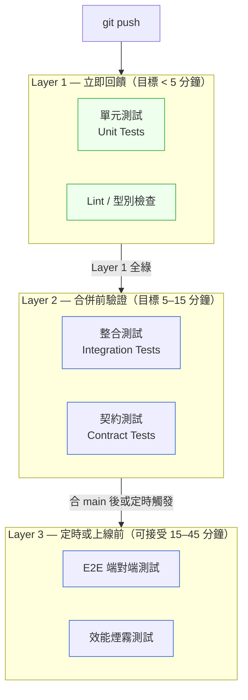

# 第 15 章｜與 CI 整合的測試流水線
## ⸺ 讓每一次 push,都能安心等待那道綠燈

> **前置閱讀**:[第 14 章｜測試資料與測試環境](./ch-14-test-data.md)
> **下游章節**:[第 16 章｜Code Review:看什麼、怎麼給回饋](../part-04-collaboration/ch-16-code-review.md)

## 15.1 共感現場:那條讓大家都不敢動的 CI

你可能也遇過這樣的狀況。

一家叫做 Cartify 的電商公司,後端工程師小晴接到了一個任務:在結帳流程裡加一個「滿額折扣」的邏輯。需求不大,改起來大概半天的功夫。她改完、寫了幾支單元測試,確認本機能跑,然後把程式碼推上去——接著就盯著那條 CI 的進度條開始等。

等了五分鐘,進度條還在跑。

等了十分鐘,整合測試剛剛啟動。

等了二十分鐘,E2E 測試開始——那兩支她從來沒看它順利過的。

這不是她第一次這樣等。Cartify 的 CI 跑一次要接近半小時,因為所有測試——單元、整合、E2E 端對端——通通排在一條流水線裡,從頭跑到尾。沒有分層,沒有平行化,先進先等。更糟的是,整合測試有時候因為測試資料庫的連線鎖卡住而失敗,要重跑一次才會過;E2E 裡有兩支測試天生就不穩定,大家心照不宣「那兩支跑紅了再跑一次就好」。

等 CI 的時間怎麼過?小晴已經習慣切去處理另一張票。拉開另一個 branch,繼續開發別的功能,或是去回一下 Slack 裡積了半天的訊息。等 CI 終於跑完,她得把自己拉回到之前的情境:「我剛才改的是哪個地方來著?那個折扣邏輯的邊界條件是什麼?」有時候紅燈跑出來,看到失敗的測試名稱,她腦子裡要轉個五秒才能把它對回自己剛才寫的那行程式碼。

同事阿磊有一次問她:「那條 CI 有沒有意義?」

小晴沉默了一下。「有,但……大家都知道有些紅燈是假的。所以真的紅了,你也不確定是不是真的壞了。」

阿磊點頭:「我上週合了一個本來紅的 PR。主管說先過,有空再補。」

這句話說起來平靜,背後卻是整個團隊已經習慣了一個事實:CI 告訴你的事情,不一定要認真對待。久而久之,大家在心裡對 CI 打了折——紅燈不代表壞,只代表「可能壞了」。而「可能」這兩個字,讓人可以選擇繞過去。

小晴自己也知道這樣不太對,但又說不清楚問題出在哪裡。「測試不是都有寫嗎?CI 不是都有跑嗎?」

有些東西就是這樣——擺在眼前,但你得換一個角度,才能看清楚它真正在告訴你什麼。

## 15.2 真正的問題:速度與信任,缺一不可

我們把 Cartify 的狀況慢慢拆開來看。你會發現它其實不是「測試寫得不夠」的問題——事實上他們的測試覆蓋率並不低,開發前期有個很認真的工程師把框架都搭好了。真正的問題,藏在兩件事的組合裡:**回饋太慢**,還有**信任已經破裂**。這兩件事彼此強化,讓對方變得更嚴重。

先說「回饋太慢」。CI 存在的目的,是讓你在每次改動之後,盡快知道有沒有破壞什麼。這個「盡快」有多快算快?一個經驗法則是:如果工程師在 push 之後必須去做別的事才能等 CI 跑完,那個 CI 就太慢了。

這不只是「浪費等待時間」的問題——情境切換(context switching)本身有認知成本。工程師切去做別的事,等回來的時候,需要時間重新把思路拉回原本的問題。更關鍵的是,越慢的回饋,工程師越難把「紅燈」和「我剛才那行程式碼」連結起來。程式碼記憶是熱的,剛寫完的二十分鐘之內,你對每一行的理由都很清楚;等二十分鐘之後回來看紅燈,那份清晰度已經降溫了。

也就是說,一條慢的 CI,就算它最終跑出了結果,它給的回饋也已經「涼了」——工程師早就往前走了。這就是為什麼 Cartify 的工程師會習慣「先切去做別的事」:不是他們不在乎,而是 CI 的設計讓「在乎」這件事的成本太高。

再說「信任已經破裂」。這是更隱性的傷害。不穩定的測試(Flaky Tests)是信任殺手,而且它的破壞方式是緩慢的、累積的。一開始,可能只有一支測試偶爾紅;工程師跑一次,過了,繼續。然後又一支,再一支。每一次「跑一次就好了」的處理方式,都在工程師的認知裡埋下一個印象:這條 CI 的紅燈,不一定是真的。

一旦這個印象形成,它就很難消去。工程師開始在看到紅燈的第一秒就問:「是真的還是假的?」而不是「我哪裡寫錯了?」這個心理預設的轉移,讓整條 CI 從「可靠的守門員」變成了「大概率能過、但有時候亂叫的警報」。警報亂叫久了,人就學會忽略它——這是人類的正常適應,不是工程師的問題。

順著這個道理,我們就能看懂:Cartify 的問題不是「沒有 CI」,也不是「沒有測試」,而是他們的 CI 同時失去了**速度**和**信任**這兩樣東西。補測試沒用——更多的測試只會讓 CI 跑得更慢。多跑幾次也沒用——多跑幾次只是在繞過問題。要修的,是這條流水線的設計方式。

正因為問題根源是「設計」,接下來我們要談的三個原則,也都是設計層次的判斷——不是「要寫多少測試」,而是「測試要怎麼組織和觸發」。

## 15.3 一起做判斷:流水線設計的三個核心原則

既然問題是速度與信任,那我們就從這兩個方向想起。接下來的三個原則不是清單式的教條,而是你在設計或調整一條 CI 流水線時,可以帶著它們去思考、去判斷的角度。Cartify 在每一個原則上都踩了地雷——我們會邊談原則、邊帶回去看他們哪裡出了問題。

### 15.3.1 測試分層:快的不要等慢的

一條沒有分層的 CI,就像一間辦公室把所有會議——短的、長的、緊急的、定期的——全部排進同一個房間,一個接著一個。最快的討論也得等最長的報告結束,效率從一開始就被設計壞了。

Cartify 的狀況正是如此。他們把單元測試、整合測試、E2E 端對端測試全部排在一條線裡,每次 push 都要完整跑完三層。問題是,這三種測試本來就有截然不同的速度和目的:

- **單元測試**跑起來是毫秒等級。它的問題是「我這個函式的邏輯對嗎?」
- **整合測試**需要啟動資料庫、外部服務,通常是秒到分鐘。它的問題是「我和依賴的服務接得上嗎?」
- **E2E 端對端測試**要啟動整個系統,走完真實的使用者流程,可能要幾十分鐘。它的問題是「整個系統的功能從頭到尾是通的嗎?」

改一個折扣計算的邏輯,最需要立刻知道的,是單元測試有沒有過——不是整個結帳流程的 UI 點擊流程有沒有跑通。讓工程師等 E2E 才知道自己的邏輯對不對,是一種設計上的浪費。

一個好用的分層角度,是把測試依照「你需要多快拿到這個答案」來分組,並搭配不同的觸發時機:



**Layer 1** 的目標,是讓工程師在 push 之後五分鐘內拿到第一個訊號。如果第一層就紅了,根本不需要等後面——立刻知道,立刻修,情境還熱,代價最低。Cartify 之所以回饋慢,很大原因是他們沒有這一層:最快的測試和最慢的測試排在一起,工程師的第一個訊號要等到半小時後。

**Layer 2** 在 PR 準備合併前跑,確認元件之間的互動沒有問題。整合測試和契約測試(Contract Tests)放在這裡——它們需要跑,但不需要在每次 push 的當下立刻完成。

**Layer 3** 可以在合併到 main 之後、或定時排程跑——它的目的是全系統驗收,不是擋住每一次 commit。讓 E2E 從「擋 PR 的關卡」變成「合完 main 才跑的守衛」,是一個很常見、也很有效的速度提升方式。

分層設計不是要你減少測試,而是讓每一種測試在對的時間點回答對的問題。這樣工程師在等 Layer 1 的那五分鐘裡,真的有理由繼續等——因為那個答案是即時的、準確的、和他剛才的改動直接相關的。

### 15.3.2 平行化:能同時跑的,不要排隊

分層解決了「快的不用等慢的」,但 Layer 2 裡面的整合測試本身可能也很多。Cartify 的整合測試將近一百五十支,如果全部排隊跑,光是這一層就要接近十五分鐘——而且這個時間會隨著服務複雜度增加而不斷增長。這時候另一個值得想的角度是:有哪些測試可以同時跑?

現代的持續整合(Continuous Integration,CI)系統——GitHub Actions、GitLab CI、Buildkite——都支援 job 矩陣(matrix)或平行執行。一個直觀的做法是按模組切分:訂單模組的測試、庫存模組的測試、付款模組的測試,各自在獨立的 runner 上同時跑,最後只要等最慢的那個模組結束。Cartify 若把整合測試拆成三個平行 job,原本十五分鐘可以壓到五分鐘以內。

不過,平行化也不是越多越好。這裡有一個常被忽略的現實:更多的平行化意味著更多的 runner,而更多的 runner 就是更高的雲端費用(或自建 runner 的維運成本)。每增加一個平行 job,都是在用金錢換時間——這個交換在什麼條件下值得,值得認真想一想。

| 策略 | 適合情境 | 注意事項 | 大約成本含義 |
|------|---------|---------|-------------|
| **按模組切分** | 各模組互相獨立、有清楚邊界 | 需確保測試 DB 也是獨立的 | 增加 N-1 個 runner |
| **按測試類型切分** | 單元 / 整合 / E2E 數量都多 | 最直觀,也最容易維護 | 通常 2–3 個 runner |
| **動態分片(sharding)** | 同類測試量很大(如 200+ 整合測試) | 需要工具支援(如 Jest sharding、pytest-xdist) | 成本最高,效果也最大 |
| **不平行** | 測試少、跑得已夠快 | 不要為了平行化而平行化 | 最省,但未來擴充性低 |

一個好的判斷起點是:先量測你的流水線現在哪個 job 最慢、慢多少,再問「這裡值得投入一個 runner 的成本嗎?」。如果那個 job 是整個 PR 流程的瓶頸,而且平行化之後可以省下十分鐘、全團隊每天有十幾個 PR,那個投報率通常是划算的。如果整條 CI 本來就只跑三分鐘,加平行化只是讓配置複雜——先省這個力氣。

Cartify 的問題不在於沒有平行化,而是連分層都沒有,所以哪裡慢、慢多少根本看不清楚。先分層,再量測,再決定哪裡值得平行化——這個順序很重要。

### 15.3.3 紅燈即停:讓失敗變成一個有重量的訊號

這是三個原則裡最簡單,卻最容易被忽略的一條:當 CI 跑紅了,團隊的預設行為應該是**停下來修它**,而不是先繞過去。這條原則有個常用的說法叫做「快速失敗」(Fail Fast),但它的意義不只是技術設定——它更是一種團隊文化的校準。

先說技術面。大多數 CI 系統都可以設定「若上一個 job 失敗就不觸發下游 job」——這樣可以避免浪費資源在一個明知要紅的流水線上繼續跑。更重要的是,在 PR 合併規則裡設定「必須 CI 全綠才能合」,讓「紅燈」從一個「供參考的資訊」變成一個「真實的阻擋」。GitHub 的 branch protection rules、GitLab 的 protected branch merge checks,都可以做到這件事——技術門檻不高。

但文化面才是真正的挑戰。Cartify 的紅燈之所以沒有阻擋力,不只是因為技術上沒有設阻擋——更因為工程師已經學會了「這個紅燈可能不是真的」。這個認知一旦形成,任何技術上的強制阻擋都只是增加摩擦,而不是增加信任。工程師找主管、找理由繞過去,或者乾脆把那支測試標 skip——阻擋本身沒有解決問題。

Flaky tests 是這個信任破裂的主要元兇。一支不穩定測試的成本,遠遠不只是「偶爾重跑一次」——它最大的傷害,是讓工程師對整條 CI 的可信度打折。當你知道某個紅燈「跑一次就好了」,你就不再把所有紅燈當真。更長遠來看,放任 flaky tests 存在,也在無聲地傳遞一個訊息:「測試是裝飾品,不是守門員。」這個文化一旦固化,要改就很難了。

「把 flaky test 隔離並開 issue」這個動作,看起來只是個技術處理,但它背後是一個姿態:我們承認這支測試有問題,但我們不假裝沒看見,也不讓它繼續汙染整條流水線的信譽。隔離之後,整條 CI 的紅燈就重新有了可信度——因為每一個紅燈都是「真的出問題了」。

怎麼建立這樣的團隊習慣?技術工具可以輔助,但習慣本身需要從約定開始:

| 情境 | 建議行動 | 理由 |
|------|---------|------|
| 紅燈是我這次改動造成的 | 立刻修,不要合 | 情境還熱,修起來最快;合了之後情境就涼了 |
| 紅燈是別人的改動造成的 | 標記責任人、通知、暫緩合 | 不讓問題被後來的 commit 疊蓋而難追 |
| 紅燈是 flaky test | 隔離(skip)並立刻開 issue | 消除假紅燈,才能讓真紅燈重新有意義 |
| 整條 CI 長期很慢 | 回頭看 §15.3.1 和 §15.3.2 | 慢本身是一種信任問題,間接原因和 flaky 相同 |
| 不確定紅燈是真的還是假的 | 查 issue tracker,有沒有對應的 flaky 記錄 | 不確定就先當真,這是比較安全的預設 |

還有一個常見的阻力值得提:「修紅燈應該比繼續開發優先」這個約定,在 sprint 壓力大的時候很容易被擠壓。這時候一個有用的對話角度是:每一次跳過紅燈,都是在借一筆債——而且這筆債的利率很高,因為它讓後來的每一個人都在一個可信度更低的環境裡工作。修紅燈不是在「浪費時間」,而是在保護整個團隊往後的工作效率。

「紅燈即停」的本質,是讓測試回饋保持有重量。只要團隊習慣繞過紅燈,再精心設計的流水線都會慢慢失去意義——因為一條沒有人認真對待的 CI,等同於沒有 CI。

## 15.4 容易絆倒的地方

下面這幾個地雷,在實際的 CI 設計裡非常常見。很多團隊不是沒想到,而是當時看起來沒問題,或者「先這樣就好,之後再調」——然後就再也沒有「之後」了。把它們列出來,是希望你下次遇到的時候,心裡有個底,知道往哪個方向走。

**絆倒處一:把所有測試都當成同一級**

很多團隊在最初建 CI 的時候都會這樣想:「測試都要跑嘛,就全部放進去。」初期測試量少,跑五分鐘就好——這樣設計完全合理。問題是程式碼會長大,測試也會長大,但 CI 的結構沒有跟著調整。等到某天突然發現「怎麼 CI 要跑半小時了」,那個混在一起的結構已經跑了兩年,要拆就很麻煩了。

Cartify 就是這個典型。他們不是一開始就決定要把所有測試排在一條線——那是一個逐漸長出來的結果。每次加新測試,最簡單的選擇就是往現有的流水線後面加;沒有人「決定」要讓 CI 跑半小時,它只是慢慢變成這樣的。

> **修正方向**:把測試依速度與目的分成至少兩層——「快速回饋層」和「完整驗證層」——並搭配不同的觸發時機。不需要一次做到三層,先把最慢的那些拆出去異步跑,就能立刻感受到差異。

**絆倒處二:允許不穩定測試長期存在**

初看之下,一支偶爾失敗的測試好像沒有大礙——重跑一次就好,大家都知道那是哪支,繞過去就行。但這個「繞」的成本被低估了。它的直接成本是每次要多等一次重跑;它的隱性成本,是工程師對整條 CI 的信任一點一點地在流失。

等到團隊開始用「這個紅燈可能是假的」的心態看所有紅燈,真正的問題已經很難補救了。因為信任一旦破裂,就得靠一段時間的「紅燈每次都是真的」才能重建——而那段時間要很長,代價很高。

> **修正方向**:把不穩定測試(Flaky Tests)納入技術債管理。發現 flaky test 就立刻隔離(mark as skip 並開 issue),而不是放著任它繼續干擾。隔離不是放棄它,而是保護整條流水線的可信度——先讓其他紅燈重新有意義,再去追查這支為什麼不穩定。

**絆倒處三:把 CI 配置當成一次性的工作**

這個地雷很隱性。很多團隊在剛建立 CI 的時候非常用心,設計了合理的結構,跑起來也不錯。但之後隨著程式碼增加、測試增加、服務增加,流水線越跑越慢——卻沒有人去優化,因為「它還是有跑,也沒有明顯的錯」。

CI 配置不是蓋完就好的房子,它更像一條需要定期保養的馬路。你不一定每天在修它,但如果三年沒有看它一眼,它已經慢了一倍你還不知道。

> **修正方向**:把 CI 的執行時間當成一個需要定期 review 的指標,就像你會 review 程式碼效能一樣。每個月看一眼最慢的幾個 job,問自己「這些值得平行化嗎?有沒有沒用的測試拖慢整體?」一個小時的定期維護,往往能省下工程師每天加起來的等待成本。

**絆倒處四:在本機「能跑過」,在 CI 就是紅**

這個情況出現的原因通常有幾種:環境變數只在本機有、測試之間有順序相依、用了本機才有的服務或絕對路徑。對工程師來說,這是最讓人煩躁的狀況之一——不確定「紅是我的問題還是 CI 的問題」。

這種不確定性本身就有成本:工程師得花時間去排查、重現、確認——而這些時間,在多人的 CI 環境裡往往很難有效率地利用。更麻煩的是,當這個情況發生頻率夠高,工程師又開始對紅燈打折:「說不定只是 CI 的環境問題。」

> **修正方向**:讓本機跑測試的指令和 CI 跑的指令越接近越好。一個好用的做法是用 Docker Compose 把測試環境容器化,讓本機和 CI 都從同一份環境定義出發。這不是每個團隊都需要的,但當「本機/CI 不一致」的問題已經開始消耗調試時間,它就值得投資了。

## 15.5 帶得走的工具 ⸺ 一頁式「CI 流水線設計卡」

把前面三個原則——分層、平行化、紅燈即停——濃縮成一張你在設計或優化流水線時可以對照的卡片。這張卡的用途,不是讓你一次把所有欄位填滿,而是讓你知道自己目前的流水線在哪些地方還沒想清楚。空白模板如下:

```text
CI 流水線設計卡 ⸺ {專案 / 服務名稱}

【Layer 1 — 快速回饋（目標 < {X} 分鐘）】
觸發時機: {每次 push / 每次開 PR}
包含的測試類型:
  - {e.g. 單元測試}
  - {e.g. Lint / 型別檢查}
是否平行化: {是 / 否 / 按模組}
失敗行為: {立即停止,不觸發 Layer 2}

【Layer 2 — 合併前驗證（目標 {X}–{Y} 分鐘）】
觸發時機: {PR ready-for-review / PR merge 前}
包含的測試類型:
  - {e.g. 整合測試}
  - {e.g. 契約測試}
平行化策略: {按模組 / 按類型 / 動態分片 / 不平行}
相依服務: {Test DB / Mock server / ...}
估算 runner 數量與雲端成本影響: {N 個 runner,約增加 X% 費用}

【Layer 3 — 定時或上線前（可接受 {X}–{Y} 分鐘）】
觸發時機: {合 main 後 / 定時排程 / 上線前手動觸發}
包含的測試類型:
  - {e.g. E2E 端對端}
  - {e.g. 效能煙霧測試}
失敗行為: {阻擋部署 / 通知但不阻擋}

【紅燈即停規範】
哪些 Job 必須全綠才能合 PR: {Layer 1 / Layer 1+2}
不穩定測試(flaky)的處理方式: {隔離並開 issue}
目前已知的 flaky tests: {列出 / 無}

【定期健康檢查（建議每月一次）】
最慢的 Job: {Job 名稱, 執行時間}
上個月平均總執行時間: {X 分鐘}
這次 review 的改善動作: {具體行動}
```

為什麼要分三層而不是一層?因為三個層次對應三個不同的問題:「我的邏輯改動有沒有破壞最近的東西」、「元件之間的邊界有沒有問題」、「整個系統從頭到尾是通的嗎」。把它們分開觸發,就是讓每個層次在對的時機回答對的問題,而不是讓工程師每次都得等最慢的那個答案。

### 15.5.1 範例:Cartify 的結帳服務流水線重設計

回到小晴和 Cartify 的故事。那條混在一起的 CI 跑了近半小時,讓工程師習慣性忽略紅燈、合了再說。下面是如果她拿著這張卡重新設計,流水線會長什麼樣子:

```text
CI 流水線設計卡 ⸺ Cartify 結帳服務 (checkout-service)

【Layer 1 — 快速回饋（目標 < 4 分鐘）】
觸發時機: 每次 push (任意分支)
  <!-- 為什麼:push 就觸發 Layer 1,是讓工程師最早拿到訊號的方式。
       如果只在 PR 才跑,等到開 PR 時可能已累積很多改動,紅了也難定位。 -->
包含的測試類型:
  - 單元測試 (Jest v29, ~800 tests, 約 90 秒)
  - TypeScript 型別檢查
  - ESLint
是否平行化: 是(型別檢查與 Lint 各自一個 job,與單元測試並行)
失敗行為: 立即停止,不觸發 Layer 2

【Layer 2 — 合併前驗證（目標 8–12 分鐘 → 平行化後目標 4–6 分鐘）】
觸發時機: PR 標記 ready-for-review 時,以及每次 push 到 PR 分支
包含的測試類型:
  - 整合測試 (Postgres 15 + Redis 7 in Docker, ~150 tests)
  - 契約測試 (Pact v10, checkout-service ↔ inventory-service)
平行化策略: 按模組切分 — 訂單模組、付款模組、折扣模組各一個 job
  <!-- 為什麼:三個模組的測試 DB 是隔離的,平行跑不互相干擾。
       增加 2 個額外 runner,月費預估增加約 8–12 USD;
       換來每個 PR 節省約 6–8 分鐘,以每天 15 個 PR 計算,
       等待時間節省約 1.5 小時/天,投報率明顯划算。 -->
相依服務: Postgres 15, Redis 7 (docker-compose.test.yml)
估算 runner 數量與成本: 原 1 個 runner → 現 3 個,GitHub Actions 月費+~10 USD

【Layer 3 — 定時或上線前（可接受 25–40 分鐘）】
觸發時機: 合 main 後觸發 + 每日 02:00 排程
包含的測試類型:
  - E2E 端對端 (Playwright v1.x, 結帳完整流程 × 5 個場景)
  - 效能煙霧測試 (k6 v0.49, 模擬 200 concurrent 用戶)
失敗行為: 阻擋 production 部署;失敗通知 #on-call Slack 頻道

【紅燈即停規範】
哪些 Job 必須全綠才能合 PR: Layer 1 + Layer 2(所有 job)
  <!-- 為什麼:只要求 Layer 1+2 全綠,不把 E2E 擋在 PR 前,
       是因為 E2E 慢且偶有環境問題;讓它在合 main 後跑,
       保留了速度,又不放棄全系統驗證。 -->
不穩定測試的處理方式: 發現即在 jest.config 標 skip + 開 GitHub issue,貼 #flaky 標籤
目前已知的 flaky tests:
  - E2E/checkout-flow.spec.ts L87(第三方金流 sandbox 偶發逾時) → Issue #flaky-123

【定期健康檢查（建議每月一次）】
最慢的 Job: 折扣模組整合測試, 平均 4 分 30 秒
上個月平均總執行時間: 22 分鐘 (Layer 1+2 含等待,重設計前)
                      →  5 分 20 秒 (Layer 1+2,重設計後平行化)
這次 review 的改善動作: 折扣模組測試資料改用 in-memory SQLite 取代 Postgres
```

小晴在改完這張卡一週後說:「現在 push 完去倒杯水回來,Layer 1 就好了。我真的會看那個結果,因為它是真的。」

這句話背後是什麼?是信任回來了。當工程師說「它是真的」,就代表那道紅燈重新有了重量——代表紅燈亮了,值得停下來。

一條讓人「真的願意看」的 CI,才是真正有用的 CI。

## 15.6 本章回顧

讀完這一章,你應該能夠:

- [ ] 解釋為什麼「慢的 CI」和「不穩定的 CI」會讓整條測試流水線失去意義,以及這兩件事是如何彼此強化的
- [ ] 把測試分成至少兩層,設定不同的觸發時機和目標執行時間,讓快的測試在對的時間回答對的問題
- [ ] 評估哪些 job 值得平行化,並理解「更多平行化 = 更高的 runner 成本」這個取捨
- [ ] 在 PR 合併規則裡設定哪些 job 必須全綠,讓「紅燈」從供參考的資訊變成真實的阻擋
- [ ] 遇到不穩定測試(Flaky Tests)時,用隔離而非忽略的方式處理,並知道為什麼這件事比看起來更重要
- [ ] 用一張設計卡定期檢視你的 CI 流水線健康狀態

如果想先從一件事開始,試試這個:把目前最慢的那幾個 job 拆出去異步跑,讓每次 push 的第一個回饋在五分鐘內到手。不需要把整條流水線翻掉,先讓最快的那一層快起來。工程師一旦開始認真看那道綠燈,後面的改善就會自然跟上——因為信任會帶來更多信任。

## Cross-References

- **前一章**:[第 14 章｜測試資料與測試環境](./ch-14-test-data.md) ⸺ 流水線裡的整合測試需要可靠的測試資料與環境,這兩件事相互依存
- **下一章**:[第 16 章｜Code Review:看什麼、怎麼給回饋](../part-04-collaboration/ch-16-code-review.md) ⸺ CI 全綠是 PR 進入 review 的入場條件,兩者串聯形成完整的品質關卡
- **強連結**:[第 20 章｜CI/CD 流水線設計](../part-05-delivery/ch-20-cicd.md) ⸺ 本章談測試層的設計與分層,第 20 章談整條交付流水線的架構
- **強連結**:[第 10 章｜可測試的程式碼設計](./ch-10-testable-code.md) ⸺ 可測試的設計是流水線能快的前提;模組邊界清楚,才能有效按模組平行化
- **跨書連結**:[SA/SD Playbook Ch28｜測試策略與品質門禁](https://github.com/EddyKuo/sa-sd-playbook) ⸺ 架構層的質量門禁設計,與本章的實作層 CI 設計互補
