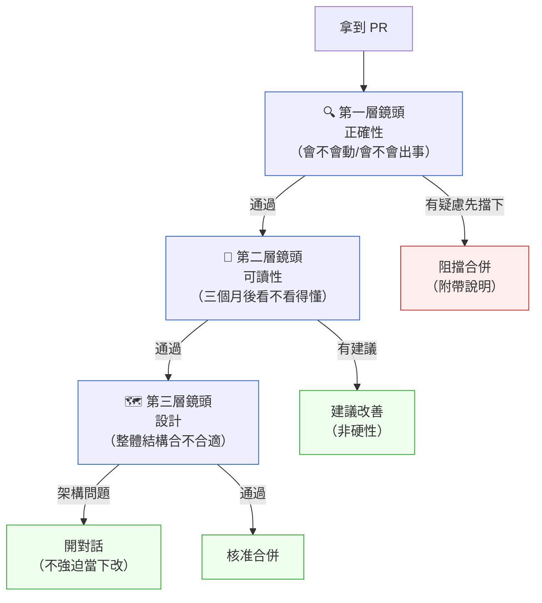

# 第 16 章｜Code Review:看什麼、怎麼給回饋
## ⸺ 評審的目的不是找錯,而是讓整個團隊走得更遠

> **前置閱讀**:[第 15 章｜與 CI 整合的測試流水線](../part-03-testing/ch-15-ci-testing.md)
> **下游章節**:[第 17 章｜Pull Request 的拆分與描述](./ch-17-pull-request.md)

## 16.1 共感現場:那條「看起來沒問題」的 comment

你可能也遇過這樣的情景。

有一天,一位年輕工程師 — 就叫她小琪吧 — 提了她第一個正式的 Pull Request。程式碼不複雜,一個新的帳單計算模組,大約三百行。她等了兩天,終於等到資深工程師 Darren 的 review 回來了。

回饋只有四條,其中兩條是這樣的:

> "這裡命名不好。"
>
> "邏輯應該抽出去。"

小琪盯著螢幕看了很久。她不知道「命名不好」是指哪個名字,也不知道「邏輯應該抽出去」抽到哪裡、怎麼抽。她鼓起勇氣去問 Darren,Darren 說:「你自己想想看。」

這件事之後,小琪提 PR 的頻率明顯降低了。她開始把程式碼在自己的 branch 上多放幾天,感覺「萬全」了才送出去。

Darren 不是壞人,他是真的想提供回饋。問題是,他跳過了一件最重要的事:把「他在心裡看到的問題」,翻譯成「對方聽得懂、做得到的建議」。這個翻譯的過程,正是 code review 最難的地方,也是本章想好好陪你一起想清楚的事。

## 16.2 真正的問題:review 卡在什麼地方

順著小琪和 Darren 的故事,我們慢慢把它拆開來看。

表面上,問題是「回饋沒說清楚」。但真正的問題,其實有兩層。

**第一層:不知道看什麼。** Darren 直覺感覺「哪裡不對」,但他心裡的那把尺是不系統的。他看命名,是因為命名剛好跳入眼簾;他看到邏輯複雜,是因為他改過類似的 bug。問題是,review 不能只靠直覺跳出什麼就說什麼——那樣會漏掉很多東西,也會讓回饋顯得隨機而不可預測。

**第二層:不知道怎麼說。** 就算看出問題,從「我腦袋裡的判斷」到「對方聽了會有能力去改」,中間有一段距離。「命名不好」是一個觀察,不是一個建議。換句話說,對方要能真的根據你的 comment 採取行動,最需要知道三件事:好在哪個維度?怎麼改?改了之後會好在哪裡?少了任何一件,對方拿到的都只是一個評語,而不是一個可以動手的方向。

也就是說,code review 有兩個並行的技能:「知道看什麼」和「知道怎麼說」。這兩件事都可以學,都有結構可以依循。我們一件一件來。

## 16.3 一起做判斷:review 的三層鏡頭與回饋的結構

### 16.3.1 三層鏡頭

把「看什麼」這件事系統化,最好用的方法是給自己三個鏡頭,由淺到深、依序掃描。

在說這三層是什麼之前,先說一下「為什麼是這三層、而不是別的分法」。

如果你上網搜尋 code review checklist,會看到各式各樣的分類:有人按「功能 / 非功能 / 架構」分,有人按「安全 / 效能 / 可維護性」分,有人按「現在 / 未來 / 不知道何時」分。那些分法都有道理,但都有一個共同的問題:它們把「問題的重量」混在一起了。

三層鏡頭的核心邏輯是**按照「發現問題後該採取什麼行動」來分層**:

- **正確性問題** → 阻擋合併,現在解。程式碼合進去之後可能讓功能不正確或讓系統不安全,這個代價通常是立即的、具體的。
- **可讀性問題** → 建議修改,不擋合併。這類問題的代價是累積的——程式碼現在能跑,但三個月後你或接手的人看到這段會多花半小時理解。
- **設計問題** → 開對話,不急著改。設計決定通常有歷史背景和取捨,一個 PR 不是決定架構方向的好場合;先理解脈絡,再排時間討論。

這個分法讓 reviewer 和作者都知道「這條 comment 的重量是多少」,也就知道要用什麼力道回應。如果把安全漏洞和命名偏好混在同一份清單,作者沒辦法判斷優先序,review 就容易變成一場沒有焦點的拉鋸。



**第一層:正確性** — 最優先。這層的問題會讓功能不正確、讓系統不安全,或讓別人踩坑。邊界條件有沒有守住?例外有沒有處理?多執行緒下有沒有競爭條件?有沒有可能的 SQL injection 或未授權存取?這層發現問題,要擋下合併,附帶清楚說明。

> **小案例 A(Kova SaaS)**: 小琪的 `calculateProration()` 在帳單週期起訖日相同時會除以零。這是第一層問題——帳單金額算錯,影響是立即且具體的(客戶被多收或少收費)。Darren 應該擋下合併,並附上修正建議。

**第二層:可讀性** — 重要但通常不擋。命名是否表達意圖?函式是否只做一件事?邏輯的層次是否清晰?這層的問題值得指出,但留給作者決定怎麼改,只要最後程式碼能被下一個人理解就好。

> **小案例 B(CartHub ECM)**: 電商平台 CartHub 有一個函式叫 `processData(d, f)`。`d` 是訂單清單,`f` 是折扣旗標。這是第二層問題——功能完全正確,但三個月後要改的人(很可能就是作者自己)要多花幾分鐘猜 `d` 和 `f` 到底是什麼。改成 `applyDiscount(orders, isFlashSale)` 不擋合併,但值得說。

**第三層:設計** — 需要對話而非命令。依賴方向是否合理?抽象層次是否一致?這個模組和現有架構的邊界有沒有被尊重?設計問題通常不是一個 commit 能解決的事,應該開一個討論、約時間白板,而不是在 review comment 裡打架。

> **小案例 C(CareLink HCR)**: 醫療平台 CareLink 有一個新的排程模組,直接依賴了資料庫 ORM 和外部通知服務。這可能是值得討論的設計邊界問題,但這個 PR 的目標是修一個約診提醒的 bug,不是重構整個模組。Reviewer 應該把觀察記下來、開個 issue,而不是因此擋合併。

看完這三個小案例,你可能會發現一件事:光是分層本身,就已經在替你解決一半的爭議。這就帶出了三層鏡頭最重要的隱含規則:**先問自己「這是哪一層的問題」,再決定嚴重程度和給回饋的方式。** 很多 review 的衝突,是因為 reviewer 心裡是第一層的判斷(我認為這是正確性問題),但作者感覺被用第三層的強度對待(好像整個設計都不對)。把層次說清楚,大家都更好對話。

### 16.3.2 決策表:這條 comment 我該不該寫?

有時候看到一個東西不順眼,但不確定要不要說。下面這張表可以幫你想清楚:

| 判準 | 說 / 不說 | 理由 |
|---|---|---|
| 這是正確性問題(會出 bug/安全漏洞)嗎? | **必須說**,阻擋合併 | 不說等於共同承擔後果 |
| 這是可讀性問題,且我能說出「為什麼讀起來難」嗎? | 說,建議性質 | 可讀性改善是對未來維護者的善意 |
| 這是我的個人喜好(命名風格、縮排偏好)? | **不說**,或標記 nit | 喜好沒有對錯;說了只是製造摩擦 |
| 這是設計問題,但我自己也不確定更好的方案是什麼? | 說,但用提問句 | 「我在想這裡的依賴方向,你當初這樣設計是有什麼考量嗎?」比陳述句安全得多 |
| 這個問題現在解決 vs 開 issue 補,哪個效益更高? | 視嚴重程度;小問題考慮開 issue | 不要讓每個 PR 變成技術債大清算;否則 PR 永遠合不掉 |

這張表有一個軸貫穿始終:「我說這條 comment,是為了讓程式碼和系統更好,還是只是讓我自己感覺說了什麼?」只要問出這個問題,很多不該說的 comment 就會自動消失了。

### 16.3.3 回饋的四個要素

找到問題之後,怎麼說出來?一個對對方真正有用的 comment,需要四個要素:

1. **觀察**:我看到什麼了?
2. **影響**:這樣下去可能發生什麼?
3. **建議**:你可以試著這樣做。
4. **開放**:你有沒有別的考量我沒看到的?

把這四個要素帶進去,原本的「這裡命名不好」可以變成:

> 「這個參數叫 `data` 讓我讀的時候停了一下,不太確定裡面裝的是什麼(觀察)。如果之後有人或你自己在三個月後需要修改這個函式,可能要往上追好幾層才知道 `data` 的結構(影響)。你覺得叫做 `invoiceLineItems` 或類似更具體的名字,會不會讀起來好一些?(建議 + 開放)」

這個例子不是要你每次都寫三行,只是要把四個要素的「骨架」放進心裡。有時候一行就能帶到所有要素:「`data` 這個名字不太透露內容,如果叫 `invoiceLineItems` 後面的人會更快理解,你覺得呢?」一句話,有觀察、有影響、有建議、有開放。

順著這個道理,我們也就能回頭看出小琪碰到的那個問題:Darren 的回饋只有觀察,沒有影響和建議,所以小琪拿到 comment 什麼事都做不了。

## 16.4 容易絆倒的地方

知道了三層鏡頭和四要素,實際做 review 的時候還是會遇到一些常見的地雷。這裡幾個很多人都走過的坑。

---

**絆倒處一:全部都說,搶著把問題找完。**

有些 reviewer 會在一個 PR 裡留二十幾條 comment,從 typo 到架構問題一起說。作者打開 review,看到一片紅,第一反應不是「好感謝你幫我找到這麼多問題」,而是「天啊我的程式碼這麼爛嗎」。

而且這二十幾條裡面,有的是「除以零,必改」,有的是「這個縮排我個人習慣不同」。兩件事的重量差十倍,但在 review 介面上看起來一樣——都是一個灰色方框。

> **修正方向**:把 comment 分三類:必改(正確性問題,阻擋合併)、建議改(可讀性/輕度設計)、參考(個人觀察,不一定要改)。前兩類才出現在 review;第三類如果值得說,標上 `nit:` 或 `fyi:`,讓作者知道這個不是硬性要求。

以下是同一個觀察、用不同寫法的對比:

```diff
# 讓作者迷失的寫法
- 「這個邏輯有問題。」

# 讓作者知道怎麼動的寫法
+ 「[必改] calculateProration() 在 billingCycleStart == billingCycleEnd 時
+   會除以零。建議在函式開頭加保護:
+   if (daysDiff == 0) return 0;」

+ 「[nit] 這裡的縮排我個人習慣用 2 格,不過專案用 4 格就沒問題,不用改。」
```

這樣作者打開 review,一眼就知道「我一定要處理哪幾件事」;`nit:` 標記的部分看一眼就能跳過。

---

**絆倒處二:說「這個不好」,但沒說比較好的是什麼。**

「這樣設計不好」「這個邏輯有問題」——這類 comment 是觀察,不是建議。作者知道你覺得有問題,但不知道你認為的方向在哪裡,只能猜。

以下是常見的對比場景,取自一個支付模組(FIN 領域)的 review 記錄:

```diff
# 只有觀察、沒有方向
- 「這個 retry 邏輯不好。」

# 有觀察、有建議、有開放
+ 「這個 retry 邏輯在外部服務連續失敗時會以固定間隔重試,
+   如果對方本來就過載,固定間隔可能讓問題更嚴重。
+   一個常見的做法是指數退避(exponential backoff):
+   第一次等 1 秒,第二次 2 秒,第三次 4 秒……
+   不確定這個服務有沒有 SLA 對退避策略有要求,你知道嗎?」
```

> **修正方向**:如果你有一個更好的方案,就直接說或附程式碼片段。如果你只是「感覺哪裡不對」但自己也說不出為什麼,先問一個問題:「我對這段的依賴順序有點不確定,你能解釋一下你的考量嗎?」有可能作者有你沒看到的理由;也有可能問出來之後你們一起找到更好的方向。

---

**絆倒處三:把 review 當成同步的對話。**

留了 comment,等著對方回,對方回了再留,來來回回幾輪,一個 PR 拖了一周還沒合。這種情況很常見,特別是在跨時區的團隊。

有時候一個設計問題用三行文字說不清楚,reviewer 和作者在 comment 串裡各說各的,最後都不確定對方在說什麼。這是工具本身的限制,不是任何人的錯——文字的非同步通道就是有它的上限。

> **修正方向**:如果一個問題需要來回超過兩次確認,就約一個 15 分鐘的同步通話或白板討論,比在 comment 串裡你一言我一語有效率得多。Review 是非同步溝通的工具,但非同步工具有其邊界;超過邊界就切換到同步。討論完之後,把結論補回 PR 的 comment 或 description,讓記錄留在脈絡裡。

---

**絆倒處四:review 都在說「要改」,沒有「做得好的地方」。**

這點很微妙。Code review 不需要一直說好話,但完全沒有正向回饋的 review,久了會讓作者感覺每次提 PR 都是在接受審判,而不是在協作。

特別是對剛加入團隊的工程師,或者剛嘗試一個新技術方向的成員。他們提了一個他們認為還不錯的 PR,收到的全是「這不好、那不對」,很難不開始懷疑自己的判斷力。

> **修正方向**:如果看到一段設計得很乾淨、或者一個邊界條件處理得特別細心的地方,說一句「這裡的分頁保護設計得很周到」就夠了。不需要每個 PR 都堆讚美;但讓對方知道好的東西被看見了,是讓 review 文化長久健康的重要習慣。

## 16.5 帶得走的工具 ⸺ 一頁式「Review Checklist」

把三層鏡頭化成一張 checklist,讓你每次 review 都有個起點,而不是每次都靠直覺重來。空白模板如下:

```text
Code Review Checklist ⸺ {PR 標題}
審查人:{你的名字} | 日期:{YYYY-MM-DD}
PR 連結:{URL}

─── 第一層:正確性(阻擋型) ───────────────────────────────
[ ] 邊界條件是否都覆蓋?(空輸入、極大值、null)
[ ] 例外處理是否合理?(會不會靜默吞錯誤?)
[ ] 有沒有安全疑慮?(SQL injection、未授權存取、secrets 外洩)
[ ] 多執行緒/並發問題?(race condition、shared state)
[ ] 功能行為與 AC(驗收條件)是否一致?

─── 第二層:可讀性(建議型) ───────────────────────────────
[ ] 命名是否表達意圖?(函式名、變數名、型別名)
[ ] 函式/方法是否只做一件事?(超過 30 行要問一下)
[ ] 邏輯層次是否清晰?(有沒有過深的巢狀條件)
[ ] 重要的非直覺決策有沒有留下註解說明?
[ ] 錯誤訊息是否對除錯有幫助?

─── 第三層:設計(討論型) ───────────────────────────────
[ ] 新模組的邊界和依賴方向是否合理?
[ ] 有沒有引入不必要的抽象或重複?
[ ] 測試覆蓋是否足夠?(尤其是第一層的邊界條件)
[ ] 有無隱性假設未來可能需要改動?

─── 回饋摘要 ──────────────────────────────────────────
必改: {N} 條
建議: {N} 條
nit:  {N} 條
整體評估: {approve / request changes / comment}
```

### 16.5.1 範例:三層鏡頭在不同領域的實際 review

把這張 checklist 帶到具體情境,效果會更清楚。下面用三個不同領域的 PR 片段,示範三層鏡頭如何在實際工作中落地。除了範例 A(Kova SaaS,對應 CASE-SAS-016)之外,範例 B、C 的 ClearPay、CartHub 為演示目的採用的簡化情境,不對應完整案例檔案,僅標註所屬領域(FIN / ECM)供你對照判斷的脈絡。

---

#### 範例 A:Kova SaaS 帳單模組(CASE-SAS-016)

如果 Darren 手上有這張 checklist,那次 review 的過程可能會很不一樣。小琪的 PR 是帳單計算模組,為 Kova 這家 SaaS 公司做計費週期的結算邏輯。

**第一層:正確性**

```text
[x] 邊界條件:
    → 🔴 必改:calculateProration() 在 billingCycleStart == billingCycleEnd
      時會除以零。建議在函式開頭加:
        if (daysDiff == 0) return 0;
      帳單模組裡,NaN 或拋例外都會讓金額算錯,而金額算錯很難退款補正。

[x] 例外處理:
    → 🔴 必改:processInvoice() 在 stripe.charge() 失敗時呼叫了
      logger.info("payment failed"),但沒有 rethrow 也沒有重試佇列。
      支付失敗靜默吞錯等同把收入損失藏起來,這不是一個謹慎的設計。
```

**第二層:可讀性**

```text
[ ] 命名:建議 data → lineItems 或 invoiceLineItems
    原因:computeTotal(data) 光看簽名不知道 data 裝什麼;
    改成 computeTotal(lineItems) 後,呼叫方和三個月後維護的人不用往上追兩層。

[ ] 函式長度:applyDiscounts() 目前 58 行、4 層巢狀條件。
    建議把百分比折扣和固定折扣邏輯拆成兩個小函式。
    不一定要這個 PR 改,可以開 issue 追蹤。
```

**第三層:設計**

```text
[ ] BillingCalculator 直接依賴 StripeClient;未來換支付閘道改動範圍廣。
    這個 PR 不需要改,後面有機會可以聊聊是否值得加 PaymentGateway 介面。
```

**回饋摘要**

```text
必改: 2 條(正確性,阻擋合併)
建議: 2 條(命名 + 函式拆分)
nit:  0 條
整體評估: request changes(解完兩條必改之後 approve)
```

小琪打開這份 review,第一眼看到的是「必改 2 條」——她馬上知道要先處理哪裡。必改都附有「為什麼這會有問題」和「可以怎麼改」;命名建議有說明原因,但沒有硬性要求。設計的想法被提出來,卻是邀請往後對話而不是阻擋這次合併。

---

#### 範例 B:ClearPay 支付閘道(FIN 領域)

ClearPay 有一個新的轉帳限額驗證函式需要 review。這個 PR 相對小,只改了 `validateTransferLimit()` 一個函式,但第一層藏了一個不明顯的問題。

**第一層:正確性**

原始程式碼:

```typescript
// TypeScript — 轉帳限額驗證
function validateTransferLimit(amount: number, userId: string): boolean {
  const limit = getLimitForUser(userId);
  return amount <= limit;
}
```

Reviewer 的 comment:

```text
🔴 必改:getLimitForUser() 在使用者不存在時回傳 undefined,
  此時 amount <= undefined 會是 false(NaN 比較),
  但語意應該是「找不到使用者,拒絕轉帳」。
  目前的行為碰巧正確(拒絕了),但靠 NaN 比較行為當安全機制不穩固。
  建議明確處理:
    const limit = getLimitForUser(userId);
    if (limit == null) throw new UnknownUserError(userId);
    return amount <= limit;
```

**第二層:可讀性**

```text
建議:函式名 validateTransferLimit 暗示它會拋例外或回傳結構化結果;
  但目前只回傳 boolean,建議改名 isWithinTransferLimit 或
  在 JSDoc 加一行說明回傳語意。
  不擋合併,隨你決定。
```

這個例子說明:同一個函式可以同時有第一層問題(邊界條件語意不明確)和第二層問題(命名暗示錯誤)。把兩者分開說,作者就知道第一個必改、第二個可以考慮。

---

#### 範例 C:CartHub 商品搜尋(ECM 領域)

CartHub 有一個 PR 加入了全文搜尋功能,reviewer 在 checklist 走完後留下了這份摘要:

**第一層:正確性**

```text
[x] 安全:搜尋關鍵字直接拼入 SQL WHERE 子句。
    → 🔴 必改:SELECT * FROM products WHERE name LIKE '%{keyword}%'
      這裡如果 keyword 帶了 ' 或 --, 就是 SQL injection。
      請改用 parameterized query 或 ORM 的 where() 方法。
```

**第二層:可讀性**

```text
[ ] searchProducts() 目前 74 行,包含分頁、排序、過濾三個邏輯。
    建議後續拆成三個較小的組合函式——這個 PR 先上沒問題,但建議開 issue。
```

**第三層:設計**

```text
[ ] 這次實作是全資料表掃描,在商品量大時效能會明顯下降。
    是否計畫加 full-text index?可以在對應的 migration ticket 一起討論。
    現在先上沒問題,只是想確認這個已在計畫中。
```

**回饋摘要**

```text
必改: 1 條(SQL injection,阻擋合併)
建議: 1 條(函式拆分)
nit:  0 條
整體評估: request changes(SQL injection 修完後 approve)
```

三個領域的例子擺在一起,你會發現三層鏡頭的核心沒有變:先問「這是哪一層的問題」,再決定回饋的重量和方式。領域不同,但判斷的結構是一樣的。

## 16.6 本章回顧

讀完這一章,你應該已經能:

- [ ] 用三層鏡頭(正確性 / 可讀性 / 設計)系統性地審查一個 PR,知道每一層問題的嚴重程度和處理方式
- [ ] 在寫 comment 之前先問自己「這是哪一層的問題」,避免把喜好包裝成硬性要求
- [ ] 用四要素(觀察 / 影響 / 建議 / 開放)把心裡的判斷翻譯成對方聽得懂、做得到的回饋
- [ ] 拿起 Review Checklist,讓每次 review 都有個系統起點而不只是靠感覺
- [ ] 分辨必改/建議/nit 三個等級,讓作者打開 review 就知道哪裡要先動

如果想先從一件事開始,試試**把你下一次的 comment 先問問自己「這是第幾層的問題」**。光是搞清楚層次,你的回饋就已經比大多數的 review 清晰了;對方知道要優先處理什麼,事情就能動起來。

下一章,我們會往前走一步:一份好的 PR 描述,能讓 reviewer 在看第一行程式碼之前就知道「這個 PR 想解決什麼、我應該怎麼看它」。PR 拆得好不好、描述寫得清不清楚,直接決定 review 的品質 — 因為給回饋的前提是先理解脈絡。

## Cross-References

- **下一章**:[第 17 章｜Pull Request 的拆分與描述](./ch-17-pull-request.md) ⸺ review 的品質從 PR 描述就開始了
- **強連結**:[第 5 章｜可讀性:為下一個人而寫](../part-02-craft/ch-05-readability.md) ⸺ 第二層鏡頭(可讀性)的深度展開
- **強連結**:[第 6 章｜命名、抽象與邊界](../part-02-craft/ch-06-naming-abstraction.md) ⸺ 命名回饋的理論基礎
- **強連結**:[第 37 章｜審查 AI 生成的程式碼](../part-08-ai-era/ch-37-reviewing-ai-code.md) ⸺ 三層鏡頭用在 AI 產出上
- **跨書連結**:[SA/SD Playbook Ch 29 ⸺ 品質審查的架構決策](https://github.com/EddyKuo/sa-sd-playbook) ⸺ 第三層設計問題的系統設計高度
