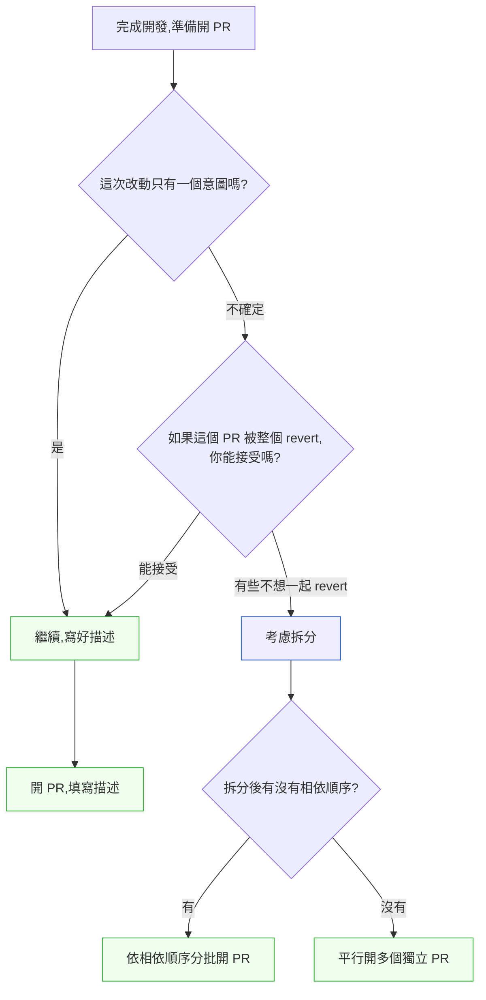

# 第 17 章｜Pull Request 的拆分與描述
## ⸺ 讓審查者讀得懂,你才算真的做完

> **前置閱讀**:[第 16 章｜Code Review：看什麼、怎麼給回饋](./ch-16-code-review.md)
> **下游章節**:[第 18 章｜結對/群體程式設計的時機](./ch-18-pairing.md)

## 17.1 共感現場:那個「應該差不多」的 PR

你可能也有過這樣的經驗——

接到一個需求,花了四天把它完成:資料庫 schema 改了兩個欄位、後端 API 新增了三個端點、前端介面也調整了、順手還把幾個舊的 helper 整理了一遍,外加補了測試。四天的工作量,一次推上去。PR 的標題就叫「feat: 實作訂單篩選功能」,描述欄裡貼了一個 Jira 連結。

你按下 Create pull request,標題和連結都齊全,功能完整,測試也跑過了。

按下去的隔天早上,看到 reviewer 留了一句話:「可以先幫我說一下這個 PR 做了什麼嗎?」

你做了四天,對方卻好像完全不知道從哪裡開始看。其實這裡有個常被誤解的地方:reviewer 不是在刁難你,而是他看到的東西,和你腦袋裡的東西,根本就不一樣。你走過整個開發過程,知道為什麼要改 schema、為什麼要加這個端點、為什麼舊的 helper 要動;但他開啟 PR 頁面的時候,那些脈絡完全不在那裡。對他來說,這是一個有七十幾個 changed files 的 diff,沒有地圖,沒有起點。

這不是誰的錯,而是一件很容易被忽略的事:**PR 不只是你完成工作的憑證,它是你和 reviewer 之間的溝通橋梁**。這座橋沒搭好,工作做完了也等於還沒交付。

## 17.2 真正的問題:脈絡不在 diff 裡

我們把這個情況慢慢拆開來看。

程式碼的 diff 只記錄了「什麼改變了」,但 reviewer 真正需要的,是「為什麼改、往哪個方向改、改了之後怎麼知道它對了」。這三個問題,diff 一個都回答不了。

也就是說,一份 PR 要讓別人能夠好好審查,需要兩件事同時到位:

**第一,大小要可審**。如果一個 PR 混了四種不同目的的改動——功能開發、schema 遷移、重構、補測試——reviewer 很難知道「我現在在看哪個脈絡裡的改動」,容易看漏,也容易產生沒必要的疑惑。每次看到一個看似不相關的改動,他都要先停下來想「這個是要幹嘛的」,思緒就斷了。

**第二,描述要給脈絡**。就算改動很小,reviewer 還是需要知道「這個改動想解決什麼問題」「選擇這個做法是基於什麼考量」「如果我想確認它是對的,我該看什麼地方」。這些東西不寫在描述裡,他就只能猜——而猜出來的不一定對。

順著這個道理,我們會發現一件事:很多拖很久的 PR review,並不是 reviewer 太忙或太挑剔,而是他每次打開那個 PR 頁面,都不確定要先看哪裡、看完之後要確認什麼,所以一直往後排。讓 review 快起來的關鍵,往往不是催人,而是把 PR 整理得讓人「看得進去」。

這就帶出了本章要談的兩件事:**怎麼拆 PR**、以及**怎麼描述它**。

### 17.2.1 拆分的心理障礙:為什麼大家都知道,還是不拆?

知道「要拆 PR」和「真的去拆」之間,有一道很現實的門檻。

最常見的理由是:「我的功能改動都是互相依賴的,根本拆不開。」這個說法有時真的成立;但更常見的情況是,工程師其實是「不確定怎麼拆」,或者「不知道拆了之後如何在 local 驗證完整流程」。後者是可以解決的具體技術問題——後面會用 branch stacking 的方式,讓你在本機一邊等待上一個 PR 合併,一邊繼續開發依賴它的下一個 PR,§17.3.3 會示範完整步驟。

另一個常見的心理是:「我已經把功能做完了,現在再回頭拆,感覺是在走回頭路。」這個感覺是真實的。但可以換個角度想:拆分不是「把完成的工作拆散」,而是「決定用什麼順序把這件事說給 reviewer 聽」。你的腦袋裡已經有完整的工作,拆 PR 只是在選一個讓別人最容易跟上的敘事順序。

還有一種情況更微妙:**有些工程師其實在等「被要求拆」**。他們不確定自己這樣算不算太細,也不確定團隊有沒有這個習慣,所以先出一個大 PR 試試水溫。如果你有這個擔心,你可以直接在描述裡說:「這個 PR 包含了 A 和 B 兩個部分,如果你希望我拆開,我可以拆——只是因為 B 依賴 A 的 schema 改動,會需要按順序看。」這樣的主動說明,往往能把模糊的期待說清楚,reviewer 反而更容易給你一個明確的回應。

### 17.2.2 「可審性」的三個維度

讓一個 PR 「可審」,可以從三個角度來想,而不只是「夠不夠小」:

**維度一:意圖的清晰度**。reviewer 打開 diff 的第一秒,能不能判斷「這份改動想讓系統變成什麼樣子」?如果每個 file 的改動都能放進同一個故事裡,這個 PR 就是「意圖清晰」的。如果有幾個 file 看起來像是另一個故事的開頭,那就需要拆。

**維度二:回滾的粒度**。假設這個 PR 上線之後出了問題,你願意把什麼一起回滾?如果你有些改動「不想回滾」或「不需要回滾」,那它們就不應該和「主要改動」混在一起。這個問題問起來有點反直覺,但它幫助你快速識別「哪些東西是獨立的、哪些是真正綁在一起的」。

**維度三:審查的認知負荷**。reviewer 需要在腦袋裡維持多少個「工作記憶槽」才能看完這個 PR?一個意圖清晰、改動聚焦的 PR,他只需要維持一個脈絡;一個混了重構、功能、bug fix 的 PR,他需要不斷在三個脈絡之間切換,每次切換都有思緒斷裂的成本。

理解這三個維度,能幫你在拆分的時候更有方向感——不是為了「數字上夠小」,而是為了「讓 reviewer 最容易跟上」。

## 17.3 一起做判斷

### 17.3.1 怎麼拆:一個 PR,一個意圖

PR 要拆到多小,是很多人問過的問題。這裡有一個好用的判準,不是「幾個 files」或「幾行改動」,而是:**一個 PR,一個意圖**。

「意圖」指的是「這份改動想讓系統從哪個狀態,移動到哪個狀態」。如果一個 PR 裡同時有兩個意圖,就可以考慮拆開。

下表整理了幾個常見的混合情況,和對應的拆法:

| 混在一起的情況 | 問題所在 | 建議拆法 |
|---|---|---|
| 功能 + 重構 | 重構前後邏輯應該一樣;一起審很難判斷行為有無改變 | 先出重構 PR(行為不變),再出功能 PR |
| 功能 + schema 遷移 | 遷移有自己的回滾考量,獨立審才能聚焦 | 遷移先出並合併,功能 PR 接在後面 |
| 主功能 + 順手整理 | reviewer 不知道哪些改動是「必要的」、哪些是「順便的」 | 整理另開 PR 或先暫存,不要混入 |
| 多個子功能一起出 | 其中一個有問題會卡住全部 | 按相依順序逐一出 PR |
| bug fix + 預防性重構 | bug fix 通常要快速合入,重構混入反而拖慢緊急修復 | bug fix 獨立出 PR 先合,重構另開追蹤項目 |
| 功能 + 補文件/README | 文件改動雖然低風險,但會稀釋 reviewer 的注意力 | 文件可以一起出,但在描述裡明確標示「哪些是純文件改動」 |

有一個常見的擔心是:「拆這麼細不會很累嗎?開很多 PR 不是更麻煩?」這個擔心很合理。但可以換個角度想:一個大 PR 卡了三天、最後被要求拆開重提,那才是真正累的地方。小的 PR 通常幾小時內就能合併,一天出三個小 PR 比一個大 PR 卡三天要輕鬆。

另一個好用的判準是:**如果這個 PR 被 revert,你願意一起 revert 的東西是什麼**。如果你不想把「重構的部分」也一起 revert,那它就不應該和「功能的部分」混在一起。

下面是一張流程圖,幫你在開始寫 PR 之前,想一下要不要拆:



### 17.3.2 怎麼描述:脈絡、風險、驗證

拆好之後,描述要怎麼跟上?一份乾淨的 PR diff 還不夠——它只解決了「reviewer 看得到什麼」,沒有解決「reviewer 看得懂為什麼」。這也就是說,拆分和描述是相輔相成的兩步:拆分讓 diff 聚焦成一個意圖,描述則讓 reviewer 不用自己猜這個意圖是什麼。

PR 描述不是寫「我做了什麼事」的流水帳,而是要回答 reviewer 心裡三個最重要的問題。你可以把描述結構化成三個區塊:

**1. 脈絡(Context):為什麼要做這件事?**
這裡寫的不是「這個 PR 修改了 X」——那 diff 已經說了。而是「這個改動在回應什麼問題」「為什麼選擇這個方向而不是另一個」。這件事之所以重要,是因為 diff 只顯示代碼改變了什麼,不會顯示改動想解決的問題;如果 reviewer 不知道這份改動的目的,他很容易把「必要的修改」和「順手做的優化」混在一起看,最後回一句「這個改動必要嗎」,review 就這樣被卡住了。反過來,他有了這段脈絡,才知道要用什麼視角來看 diff——是在確認一個修 bug 的邏輯,還是在評估一個新設計的取捨。

**2. 風險(Risk):哪裡可能出問題?**
這個區塊最容易被跳過,但它對 reviewer 最有幫助。你自己最清楚這份改動哪裡是你比較不確定的、哪個地方的邏輯比較複雜、有沒有已知的邊界情況還沒處理。把這些誠實地寫出來,reviewer 就知道要把注意力放在哪裡,不會平均花時間在每一行。

**3. 驗證(Verification):我怎麼確認它是對的?**
寫清楚你自己是怎麼測試這份改動的——有哪些 case 跑過了、有沒有在本機或 staging 環境驗證過、有沒有什麼情況沒辦法自動化只能手動確認。reviewer 知道這些之後,才能決定他要額外確認什麼、還是直接信任你的測試結果。

這三個問題,合在一起就構成了一份完整的 PR 描述。它的目的不是讓描述看起來很長很正式,而是讓 reviewer 打開 PR 頁面的時候,不需要猜。

### 17.3.3 依相依拆分:PR 串接的實際做法

在實際操作上,「按相依順序出 PR」聽起來簡單,但很多人第一次嘗試時會遇到一個問題:「我在本機怎麼開發後續的 PR,如果前一個還沒合進 main?」

這裡有一個常見的做法:用「branch stacking」的方式進行。

1. 從 `main` 開出第一個分支 `feat/order-schema-migration`,完成 schema 遷移後開 PR-A。
2. 從 `feat/order-schema-migration` 再開第二個分支 `feat/order-filter-api`,在上面繼續開發後端 API,開 PR-B(base branch 設為 `feat/order-schema-migration`)。
3. 等 PR-A 合入 main 之後,把 PR-B 的 base branch 改回 `main`,這時候 PR-B 的 diff 就會自動只顯示「後端 API 的改動」,不包含 schema 的部分。

這個流程需要稍微熟悉一下,但一旦習慣了,你會發現它讓每個 PR 的 diff 都非常乾淨。每個 reviewer 只需要看屬於自己那一層的改動,不需要在混合的 diff 裡找方向。

下表整理了三種常見的 PR 串接策略,以及各自適合的場景:

| 策略 | 做法 | 適合場景 |
|---|---|---|
| 順序串接(Stacked PRs) | 從上一個分支開出,PR-B base 設為 PR-A | 改動有強相依,後者依賴前者的 schema 或介面 |
| 平行開出,合前再 rebase | 各自從 main 開分支,先合小的,後者 rebase | 改動邏輯獨立,只是剛好同期開發 |
| 功能開關(Feature Flag) | 所有改動在同一 PR,功能藏在 flag 後面 | 改動難以拆分,但不希望影響上線功能 |

選哪個策略,不需要教條式地決定。你可以問自己:「如果 reviewer 今天只有三十分鐘,他看哪一個 PR 最容易給出有品質的 review?」答案指向的那個策略,通常就是對的。

## 17.4 容易絆倒的地方

### 絆倒處一:描述只貼 Jira 連結

「詳見 ticket」這類描述很常見。不是說 Jira 不重要,而是 reviewer 要先打開另一個分頁、閱讀背景、再回來看 diff,這中間的跳躍很消耗專注力。而且 ticket 裡的內容通常是「需求」,不是「這個 PR 怎麼實作這個需求」——兩者不一樣。

> **修正方向**:Jira 連結當然可以貼,當成補充資料;但 PR 描述裡至少要有一段話,用你自己的話說清楚「這個 PR 在做什麼、為什麼這樣做」。三句話就夠了,reviewer 不需要完整的需求背景,他只需要能夠開始看 diff 的那個入口。這麼做的道理很直接:你花三句話省下的,是 reviewer 每次打開 PR 都要重新切換分頁、重新定位的成本——一次不多,但一個團隊一天審十個 PR,省下來的專注力就很可觀。

### 絆倒處二:因為「只改了一點點」就不寫描述

改動小不代表不需要描述。有時候一行改動才最需要解釋——比如說改了一個常數值、調整了一個逾時時間、把一個 enum 加了新成員。這些改動 reviewer 看一眼 diff 完全不知道為什麼,如果沒有說明,他只能選擇「信任你」或者「問你」。前者有風險,後者拖時間。

> **修正方向**:改動越小、越不直觀,越要在描述裡說「為什麼改這個、改了之後有什麼效果」。「這一行把 timeout 從 5 秒改成 30 秒,因為下游服務 P99 latency 在峰值時大約是 22 秒,5 秒的設定會導致非必要的重試風暴」——這一句話就能把問題說清楚。之所以值得花這一句話,是因為一行改動的 diff 幾乎不帶任何線索,reviewer 沒有辦法從代碼本身推回原因,寫出來比讓他來問你快得多。

### 絆倒處三:把「我不確定的地方」藏起來

有些工程師會擔心:如果在描述裡寫「這個地方我不太確定」,reviewer 會覺得自己不夠認真或不夠能幹。但其實完全相反——有能力識別自己的不確定點,本身就是一種能力。把不確定藏起來,reviewer 看不到它,反而可能略過;寫出來,reviewer 就會特別注意那裡,這才是 review 機制真正發揮作用的方式。

> **修正方向**:在「風險」區塊裡,誠實地寫「這個部分的邏輯我有些不確定,尤其是在 X 情況下的行為」。這不是示弱,而是讓 review 更有效率的做法——因為 reviewer 的注意力是有限資源,你標出來的地方,他就會多花一點心思;沒標出來的地方,他多半會假設你已經確認過了,直接略過。與其讓他平均分散注意力、可能剛好漏掉那個真正該看的地方,不如自己先把風險點指出來。

### 絆倒處四:功能加重構一起出

這是最容易讓 review 變慢的組合。reviewer 看到一個函式的邏輯被改了,他需要判斷這個改動是「這次功能的必要改動」還是「順手重構」——如果搞不清楚,他就得問,review 就卡了。

> **修正方向**:重構先出、先合併,再開功能 PR。這個順序雖然多一個步驟,但正因為兩個 PR 各自邏輯單純,reviewer 不需要在「這是重構還是功能」之間來回判斷,認知負荷低,各自的審查速度自然就快;兩段加起來的總時間,通常比一個混著的 PR 被打回重提要短。

### 絆倒處五:PR 太大又不知道怎麼拆,就選擇不拆

這是一個隱性的絆倒:有些工程師在開 PR 之前,就已經知道這個 PR「有點大」,但因為不確定怎麼拆、或者時間壓力大,最後選擇直接送出、希望 reviewer 願意看。

這個情況通常的結果是:reviewer 拖了兩天,最後留了一句「可以先拆一下嗎」,然後你又花時間重新整理——比一開始就拆還累。

> **修正方向**:如果你在開 PR 之前有「這個可能有點大」的感覺,先停下來問自己§17.3.1 裡的那個問題:「如果這個 PR 被整個 revert,哪些改動我不想一起回滾?」找到之後,那部分就是可以先拆出去的。哪怕當下只能拆出一個「schema 遷移」的小 PR,讓剩下的 PR 清楚一點,都比全部混在一起送出要好。這是因為「先拆一點」和「完全不拆」的差距,遠比「拆一點」和「拆到最理想」的差距大——一旦你拆出第一塊,reviewer 面對的認知負荷就降了一截,後面即使還有點大,他也比較願意接手。

### 絆倒處六:描述寫完就不再更新

PR 在 review 過程中往往會迭代:你根據回饋改了邏輯、補了測試、調整了邊界行為。但有些人在這個過程中只更新了 code,沒有回頭更新描述——最後描述說的是「這個 PR 的初版狀態」,和最終合入的 code 不一致。

這不是大問題,但會讓未來需要追溯這個 PR 歷史的人感到困惑。更重要的是,如果 PR 經過幾輪修改之後,「風險區塊」裡原本標注的不確定點其實已經被解決了,但沒有更新,reviewer 可能還在花時間看一個「已確認安全」的地方。

> **修正方向**:每一輪 push 之後,花一分鐘瀏覽一下 PR 描述,確認「脈絡、風險、驗證」三個區塊還和現在的 code 狀態對得上。如果有什麼改了,在描述裡加一行更新說明——不需要重寫整份描述,一句「Update: date_range 的邊界問題已在第三次 commit 解決」就夠了。這一分鐘值得花,是因為描述和 code 對不上時,reviewer 沒有辦法分辨「這句話過時了」還是「這個風險其實還在」,保守起見他只能重新確認一次——那一分鐘的更新,換掉的是他重新確認的十分鐘。

## 17.5 帶得走的工具 ⸺ 一頁式「PR 描述模板」

下面是一份空白模板,可以直接貼進你的 GitHub / GitLab PR 描述欄,每次開 PR 的時候填一遍:

```markdown
## 這個 PR 在做什麼

{用一到兩句話描述這份改動想讓系統達到什麼狀態}

## 為什麼這樣做

{說明為什麼選擇這個方向,如果有其他選項,簡短說明為什麼沒選}

## 風險與不確定點

{哪個地方可能有問題、有沒有已知的邊界情況、reviewer 要特別看哪裡}

如果沒有特別的風險點,寫:「沒有已知的風險點,但請重點確認 {某個地方}。」

## 驗證方式

- [ ] {自動化測試已覆蓋 X 情況}
- [ ] {手動驗證了 Y 流程(步驟:...)}
- [ ] {在 staging 環境確認了 Z}

## 相關資訊

- Jira / Issue:{連結}
- 相依的 PR:{如果有的話}
- 部署注意事項:{如果有 migration 或 feature flag 要開,寫在這裡}
```

為什麼這五個欄位?因為它們各自回答了 reviewer 最想先知道的事——「這在幹嘛」讓他能定位視角;「為什麼」讓他知道設計意圖;「風險」讓他知道要把注意力放在哪裡;「驗證方式」讓他知道還需要自己確認什麼;「相關資訊」讓他不需要自己去找其他資源。少了任何一欄,他就可能需要問你才能繼續。

### 17.5.1 範例:蝦皮拼拼的訂單篩選 PR

蝦皮拼拼(虛構)是一家做社群電商的 SaaS 平台,剛剛完成了一個訂單篩選功能——讓賣家可以依照訂單狀態、日期區間與買家 ID 做複合篩選。負責這個功能的工程師小琳,前一次開 PR 時曾經等了三天 review,最後還被要求拆開重提,那次的經驗讓她想清楚一件事:與其等 reviewer 主動來問,不如先搞清楚什麼樣的描述能讓對方一打開就知道從哪裡下手。這次她按照上面的模板,把描述結構化地填了一遍,花了大約十五分鐘。

這份 PR 只涵蓋後端 API 的部分(前端介面和 schema 遷移各自已在上一個 PR 合併完成),所以改動範圍很清楚。

```markdown
<!-- CASE-ECM-017: 蝦皮拼拼訂單篩選功能後端 API -->

## 這個 PR 在做什麼

新增 `GET /api/v2/orders` 端點,支援 status、date_range、buyer_id 的複合篩選。
這是賣家後台篩選功能的後端部分;前端串接和 DB migration 各自已在上一個 PR 合併。

## 為什麼這樣做

複合篩選原本可以在 query string 做自由組合,但那樣會讓 SQL 的 WHERE 子句難以
用索引,篩選條件越多、查詢越慢。

我先考慮了 Elasticsearch(全文搜尋能力強,理論上也能處理複合篩選),但訂單篩選
的三個欄位都是精確匹配,不需要全文搜尋,用 ES 有點大材小用,還會多一套維運成本。
最後選了 PostgreSQL 17 的複合索引方案:固定 status、date_range、buyer_id 三個
篩選維度,讓 DB 端可以建立 (seller_id, status, created_at) 的複合索引,P99 查詢
時間從目前的 ~380ms 降至實測 ~40ms(見下方驗證方式)。

## 風險與不確定點

1. `date_range` 的邊界處理:目前是 inclusive start、exclusive end([2026-01-01, 2026-02-01))。
   這個語義和前端 calendar 的選取方式是否一致,請 reviewer 特別確認。
2. `buyer_id` 篩選是否會穿過 tenant 邊界?我加了 seller_id 的前置過濾,
   但麻煩幫我看一下 `OrderRepository#filter_orders` 的 WHERE 順序是否正確。

## 驗證方式

- [x] 單元測試覆蓋 status/date_range/buyer_id 各自篩選和三個條件同時指定的情況
- [x] 整合測試用真實 DB 跑了 seed 資料 10,000 筆,P99 < 50ms
- [ ] 尚未在 staging 環境以真實賣家資料驗證(預計在 merge 後用 feature flag 開給內部帳號)

## 相關資訊

- Jira: SPPP-4821
- 上一個 PR(schema migration): #1203(已合併)
- 前端串接 PR: #1218(等本 PR 合併後會 rebase)
- 部署注意事項:需確認 PostgreSQL 複合索引已由 migration #1203 建立完成才能上線
```

你看,這份描述不長,但 reviewer 打開 PR 頁面的那一刻,就已經知道要用什麼視角看 diff、要特別注意哪兩個地方、哪些情況已經驗證過了。從「需要問才能開始看」變成「可以直接開始看」——這就是一份好的 PR 描述的作用。

比起上一次等了三天,這個 PR 當天下午就合進去了。

## 17.6 本章回顧

讀完這一章,你應該已經能:

- [ ] 用「一個 PR,一個意圖」的原則判斷要不要拆分
- [ ] 理解「可審性」的三個維度:意圖清晰度、回滾粒度、審查認知負荷
- [ ] 在拆分時依照相依順序決定 PR 的出場順序(例如重構先行、遷移先合)
- [ ] 用 branch stacking 在本機維持串接 PR 的開發流程
- [ ] 寫出包含脈絡、風險、驗證三個區塊的 PR 描述
- [ ] 識別六個容易絆倒的地方,以及各自的修正方向

如果想先從一件事開始,我會建議——**在下一個 PR 的描述裡,加上「風險與不確定點」這個區塊**,因為它是最容易被省略、也對 reviewer 最有幫助的一欄。填完之後你會發現,光是寫這段的過程,就能讓你自己再檢查一遍那個地方——有時候問題就在這個時候被你自己發現了。

## Cross-References

- **上一章**:[第 16 章｜Code Review：看什麼、怎麼給回饋](./ch-16-code-review.md) ⸺ PR 是 code review 的前置準備,兩章互為表裡
- **下一章**:[第 18 章｜結對/群體程式設計的時機](./ch-18-pairing.md) ⸺ 協作的另一種形式:在寫碼階段就一起工作
- **強連結**:[第 4 章｜版本控制策略](../part-01-foundations/ch-04-version-control.md) ⸺ PR 拆分策略與分支模型密切相關
- **強連結**:[第 20 章｜CI/CD 流水線設計](../part-05-delivery/ch-20-cicd.md) ⸺ 小而乾淨的 PR 是讓 CI 流水線健康的前提
- **跨書連結**:[SA/SD Playbook Ch 32](https://github.com/EddyKuo/sa-sd-playbook) ⸺ 從 Platform Engineering 與 IDP 的角度,把 PR/交付流程設計成內部開發者平台的產品能力
