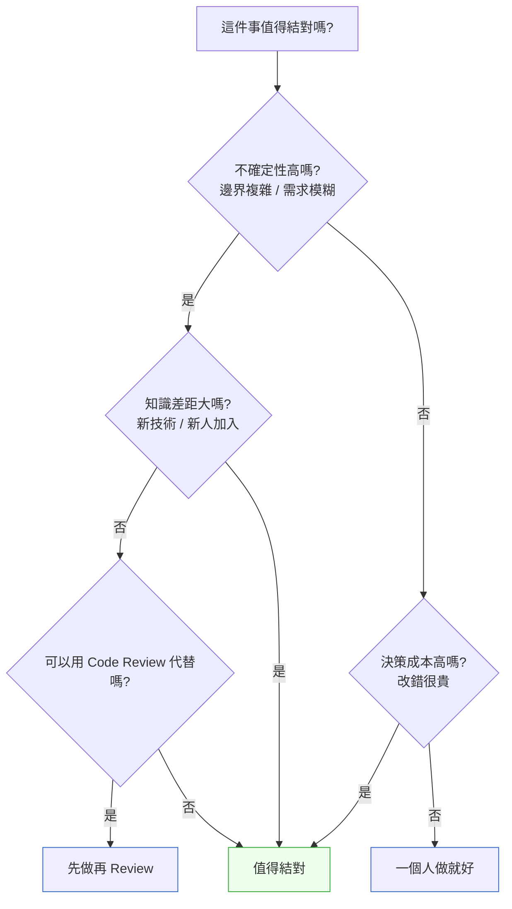
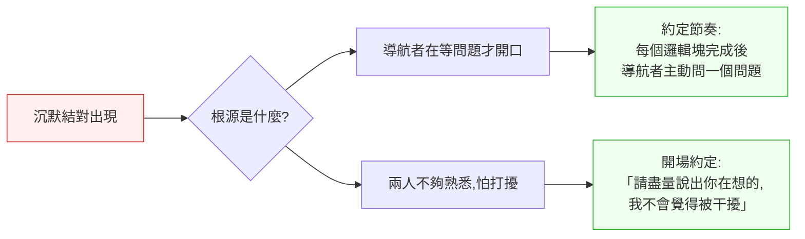

# 第 18 章｜結對與群體程式設計的時機
## ⸺ 不是每件事都要兩個人,但有些事一個人真的做不好

> **前置閱讀**:[第 16 章｜Code Review：看什麼、怎麼給回饋](./ch-16-code-review.md)、[第 17 章｜Pull Request 的拆分與描述](./ch-17-pull-request.md)
> **下游章節**:[第 19 章｜跨團隊的介面契約與相依](./ch-19-interface-contract.md)

## 18.1 共感現場:那個卡住的下午

你可能也遇過這樣的時刻。

我帶過一個技術很紮實的工程師,叫她小云。她在一家多租戶 SaaS 公司 Flowcast 上班,負責一支新的帳單計費模組。那段時間她每天很早進辦公室,把自己關起來,一個人悶著頭把東西做出來,做完再寄 PR。

有一次她遇到一個設計節點:計費週期跨月時,金額要怎麼分攤?她估算了好幾個方案,寫了兩頁文件,然後選了一個「看起來最通用」的做法。寫完花了三天,PR 開出去之後,reviewer 第一個留言是:「這邊有個邊界——如果租戶中途升降方案呢?」

小云當場就看到了問題。但那個當下的感受,她後來跟我說:「不是覺得被 review、是覺得自己白花了三天。」

這個感受,很多工程師都很熟。不是能力不夠、設計不認真,而是**在最關鍵的那個決策節點,旁邊沒有人一起看**。她一個人把三天想通了,卻在第一個留言裡發現有個角落沒看到——那個角落,一個五分鐘的對話可能就擋住了。

順著這個故事,我們就可以問一個更根本的問題了:結對程式設計到底是什麼?它又值得在什麼時候用?

## 18.2 真正的問題:獨自開發的隱形成本

我們把這件事慢慢拆開。

小云的遭遇,表面上是「沒想到那個邊界」,但如果更往前問一步:為什麼她沒想到?其實不是她不認真,而是因為**一個人長時間在自己的思維模型裡轉,很難看到自己的盲點**。這就像你在編輯一篇文章時,自己寫的字會自動被大腦「補全」——你以為你讀到的是你寫的,其實大腦偷偷幫你修正了。

開發程式碼也是一樣。你越熟悉自己的想法,就越不容易看到它的漏洞。這個現象有個很俗但很準的說法:**思維定勢(Fixation)**——你的注意力會集中在你已經有答案的地方,而不是你還沒有答案的地方。

也就是說,真正的問題不是「小云的設計有沒有問題」,而是「她的工作方式,讓這個問題一直到 PR 才被看見」。而那三天,其實是可以省下來的。

順著這個道理,我們就能理解結對程式設計(Pair Programming)到底在解決什麼:**它是一種讓兩個人的認知視角即時疊加的工作模式,目的是在問題累積到 PR 之前,就把它看見。**

但——這裡有一個很重要的「但」——結對不是萬靈丹。它有成本:兩個人的時間、溝通的耗損、心理上的壓力。如果用錯了時機,代價會比一個人獨立開發還高。所以下一個要回答的問題是:什麼時機值得結對?

## 18.3 一起做判斷:結對的時機框架

那我們來一起想這個問題。

決定「要不要結對」,本質上是在問三件事:

1. 這件事的**不確定性**有多高?
2. 這件事的**知識差距**有多大(兩人之間,或一人對技術的理解)?
3. 這件事的**決策成本**有多高?(做錯了,代回頭修要花多久?)

把這三個維度組合起來,大概可以得到這樣的判斷圖:



這張圖有幾個地方值得仔細看。

第一,「不確定性高」不等於「難」。一個技術上很難但邊界很清楚的實作,一個人做反而效率高;但一個看起來很簡單、邊界卻很模糊的功能(像是跨月計費分攤),反而是結對的最好候選。

第二,Code Review 是結對的「替代品」,不是「競爭者」。Review 適合「已有方向、需要找漏洞」的場景;結對適合「方向本身還需要一起找」的場景。如果你連方向都不確定,先做再 Review 的成本往往比直接結對高。

記得小云的案例嗎?她面對的「跨月計費分攤」恰好落在三個維度都高的地方:邊界不清楚(不確定性高)、計費算錯要退款公告(決策成本高)、她和阿澤各自只熟悉模組的一半(知識差距存在)。三個維度一疊加,答案就很清楚了——這是結對的最佳時機,而不是等到 PR 才發現。

### 18.3.1 駕駛與導航者:結對的基本角色

結對程式設計有一個最簡單、也最容易上手的分工:

| 角色 | 英文 | 在做什麼 | 視角範圍 |
|---|---|---|---|
| **駕駛(Driver)** | Driver | 手在鍵盤上,寫程式碼 | 當下這段邏輯的正確性 |
| **導航者(Navigator)** | Navigator | 眼睛在更高一層,看方向、找問題、問問題 | 整體方向與下一步 |

這個分工的精髓在於:**駕駛負責「現在」,導航者負責「接下來」**。駕駛專注在手上這段邏輯的正確性;導航者站在更遠的視角,想「這個方向對嗎」「有沒有漏掉什麼」「下一步是什麼」。

兩個人如果都盯著眼前的程式碼,結對就變成了「一個人打字、一個人看」,效果會很差。導航者的價值,在於**主動問問題**——不是批評,是好奇:「這邊的假設是什麼?」「如果租戶中途升方案呢?」就是這樣一個問題,讓小云的三天可以換成一個下午。

角色每隔一段時間(通常 15–30 分鐘)互換,避免一個人太累、另一個人太閒。有些團隊用番茄鐘計時,做完一個番茄就換手。

這個看起來很自然的分工,在幾個常見組合下容易跑偏。讓我們具體看幾個情境:

**情境一:新人當駕駛**

新人頭一次當駕駛,旁邊坐著資深同事。理論上新人「在做」、資深「在看」,感覺很像學習。但實際上常常是:新人打字打到一半手抖,大腦全部算力都在「我這樣打對嗎」,根本沒有餘裕思考邏輯。導航者說「等等,這邊不對」,新人只有一個感受:被監視。

更有效的做法是反過來——讓資深者當駕駛、新人當導航者。新人的工作是「問清楚這段邏輯在做什麼」,不是「不出錯地打字」。當導航者,新人可以自在地說「這個 condition 是什麼意思?」資深者解釋,雙方都學到東西。等新人對脈絡有基本掌握之後,再換他試試駕駛——這時候壓力小得多,因為他已經知道方向了。

**情境二:防禦性導航者**

有時候導航者對駕駛的程式碼保持沉默,不是因為沒問題,而是因為不想讓對方感覺被挑剔。這種「善意的沉默」最容易在兩人不熟悉、或是資歷差距大的時候出現。

結果就是:兩個人坐在一起一小時,駕駛打了一堆程式碼,導航者一句話沒說,最後 PR 開出去還是有問題——和一個人做的結果差不多,但多花了一倍時間。

對這種情況,可以在結對開始前約定一個簡單的節奏:「我每寫完一個邏輯塊,你問我一個問題」——不必是刁難,就是問一個「這段在解決什麼問題?」的問題。有了這個約定,沉默就有了一個自然的打破點,不需要靠人刻意開口。

**情境三:隱性角色翻轉**

還有一種情況是:駕駛打著打著,發現自己卡住了,開始抬頭問導航者「你說應該怎麼做?」導航者說了一個方案,駕駛繼續打。接下來五分鐘,導航者實際上在「口述程式碼」,駕駛變成了速記員。

這不是真正的結對——這是一種偽裝成結對的知識轉移。兩個人都在消耗精力,但沒有產生第二視角的效果。修正方式很直接:如果導航者發現自己在說「你在那個 condition 裡加一個 else」,那就換手,讓他來駕駛。

### 18.3.2 群體程式設計:三人以上的結對

正因為結對能讓兩個人的視角即時疊加,有些情境下會自然浮現一個問題:如果是三個人各有不同的關鍵視角,能不能也用類似的模式?答案是可以,這就是**群體程式設計(Mob Programming)**。

Mob Programming 的基本形式是:一台電腦、一個螢幕,但三人以上。分工是:
- **一個駕駛**:在鍵盤上打字。
- **其他所有人都是導航者**:負責思考、提問、討論。
- 駕駛定期輪換,通常每 5–10 分鐘。

它聽起來「浪費人」,但一個好用的原則是:**知識傳遞的效率,往往比產出的效率更值錢。** 一個三人 Mob Session 花了半天,讓三個人都完全理解了一個關鍵模組——這比一個人寫完、另兩個人靠 PR 或文件學習,在後續的維護成本上常常划算得多。

**什麼時候升級到 Mob?**

| 情境 | 說明 |
|---|---|
| 跨職能設計決策 | 後端、前端、QA 都需要即時對齊,不適合串行討論 |
| 新人快速上手整個系統 | 讓新人作為旁觀導航者,在真實開發情境中學習 |
| 關鍵模組的知識轉移 | 原作者離職前,把脈絡一次傳給多人 |
| 多人都卡在同一個問題 | 每個人都有一塊拼圖,需要同時在場才能拼起來 |

Mob 的典型 session 節奏可以這樣設計:

1. **開場 5 分鐘**:確認今天要解決的具體問題是什麼,輸出預期是什麼。
2. **工作塊 25 分鐘**:一位駕駛,其他人導航。時間到就輪換,不論當下在哪裡。
3. **輪換 2 分鐘**:新駕駛接手,花一分鐘用自己的話說「接下來我們要做什麼」——這個步驟強迫每個人都要真的理解當下進度。
4. **每 90 分鐘休息 10 分鐘**:不休息的 Mob 在第二個小時之後通常品質急速下降。
5. **收場 10 分鐘**:寫下今天做了什麼決定、下一步是什麼、有哪些未解問題。

Mob 的最大風險是「流程失控」——沒有明確收場時間,討論無止境。一個好用的做法是在開始前就定下「今天的 Mob 到幾點為止」,並在時間到的時候強制停下寫收場筆記。沒有固定結束時間的 Mob,最終都會耗盡每個人的精力,讓人對下一次 Mob 產生排斥。

### 18.3.3 遠距結對:工具設定與節奏管理

疫情之後,很多團隊的結對變成了「遠距結對(Remote Pairing)」。遠距結對本質上和面對面一樣,但有幾個地方特別容易出問題,值得一個一個說清楚。

正因為小云的 Flowcast 案例也有遠距協作的情境,這一節我們把遠距結對的挑戰從三個擴展到六個,並且給出具體的工具設定建議。

**① 螢幕共享的延遲感**

對方打字你看見的有延遲,很容易變成「我以為他已經寫完了,原來還在改」。

工具建議:優先使用 **VSCode Live Share**(Microsoft)而非純螢幕共享。Live Share 允許兩個人同時在自己的 IDE 裡看同一份程式碼,並且各自移動游標——延遲感大幅降低,導航者可以在自己的視窗裡標記問題。

駕駛打字前說「我要開始改這個 function」,讓導航者知道視角在哪。這句話不長,但能省掉很多「等等你改的是上面那個還是下面那個」的確認成本。

**② 輪換的儀式感**

面對面換手,自然有個起身走動的動作。遠距沒有這個訊號,很容易一個人一直開著另一個人在旁邊發呆。

VSCode Live Share 的換手儀式可以這樣做:駕駛說「換你了」,然後在 Live Share 的聊天頻道貼一句「當前狀態:正在實作 X function,下一步要處理 Y edge case」——新駕駛把這句話讀完再接手鍵盤。這個步驟強迫每次換手都有一個明確的交接點,而不是默默地「不知道從哪裡開始」。

**③ 疲勞的不可見性**

面對面的時候,你看得到對方是不是累了。遠距看不到。建議每 90 分鐘一定休息,結對者要主動說「我們休息五分鐘」,而不是等對方說。可以在 Slack 開一個計時器,或是用 **Cuckoo**(cuckoo.team,免費瀏覽器計時器)讓兩個人都看到同一個倒計時。

**④ 時區錯位:誰是「夜班導航者」**

跨時區結對有一個沒人說破的問題:在當事人早上 10 點、對方下午 6 點的時候配對,時間上看似重疊,但其實一個人精力充沛、另一個人快要下班了。這種非對稱的精力狀態很容易讓「累的那個」退化成被動的點頭者,而不是真正的導航者。

解法不是「避免跨時區結對」,而是**輪流承擔精力不對稱的那一邊**。如果這週 A 在下午 6 點配合 B,下週就讓 B 在他的傍晚配合 A。讓每個人都平均地承擔「夜班導航者」的疲勞,而不是讓同一個人一直在精力低谷時當導航者。

**⑤ 非同步「結對」的陷阱**

有些團隊在遠距條件困難時,改成「非同步協作」——一個人寫完一段,留下 comment,讓另一個人繼續。這不是結對,這是分工加文字 Review 的組合。它有它的價值,但不提供「即時第二視角」的效果。

如果真的無法同步,比同步結對更好的替代方案是:先用一個短的**同步開場(15 分鐘)**對齊方向和邊界,然後各自分工去做,最後再用一個**同步收場(15 分鐘)**確認結果是否一致。這個「三明治」結構保留了最關鍵的「方向對齊」環節,不會讓非同步的分工在起點就走錯方向。

**⑥ 網路延遲破壞回饋迴路**

網路品質差的時候,語音通話斷斷續續,駕駛說「我剛才改了這個」,導航者只聽到「我……這個」。這種狀態下兩個人都在猜測對方的意圖,回饋迴路完全失效。

在網路條件不穩定的情況下,優先在語音之外備一條文字頻道(Slack 或 Teams),用來補充說不清楚的資訊。駕駛把關鍵決策打成一句話貼在文字頻道,即使語音斷了,導航者還是知道發生了什麼。

## 18.4 容易絆倒的地方

知道了什麼時候值得結對之後,我們來看看幾個常見的地雷。這裡提的每一個,在不同團隊裡都很常見,遇到了不要覺得只有你這樣。

**絆倒處一:結對變成「兩個人一起沉默」。**
有時候兩個人坐在一起,駕駛在打字,導航者在看著——但沒有對話。這種狀態通常叫作「沉默結對(Silent Pairing)」,它其實比一個人獨立開發更累,因為你額外多了「被看著」的壓力,但沒有得到第二個視角的好處。

根源是什麼?通常不是兩個人都不想說話,而是**導航者不知道「說什麼才算正確的導航」**。他在等一個明確的問題出現才開口,但真正好的導航是「說出你在想什麼」,不需要等問題出現。



> 修正方向:導航者可以每隔幾分鐘說一句「我在看你這邊的邏輯,想確認一件事…」——這句話很短,但能立刻把對話重新打開。

**絆倒處二:每件事都要結對。**
有些團隊接受了「結對很好」的觀念之後,就把所有事情都排進結對,包括改一行文字、補一個 log 格式。這樣很快就會讓大家覺得累且沒意義。

結對是工具,不是儀式。過度使用的症狀是:大家開始不喜歡「結對排程」這四個字,看到日曆上有結對就想找藉口換掉。

> 修正方向:把「值得結對的事」列出來:新人 onboarding、設計決策節點、風險高的改動——其他的放手讓人自己做。其實用「18.3 的決策流程圖」篩一遍,就能快速判斷。

**絆倒處三:知識都留在兩個人的頭腦裡。**
結對的時候學到很多,但沒有留下任何文字記錄。兩個人當下非常有共識,但一個月後換人,那些脈絡全不見了。

這個問題在 Mob Programming 更嚴重——三四個人對齊了一堆東西,但 Mob 結束後每個人各走各的,沒有人寫下「我們今天達成了什麼共識」。

> 修正方向:結對結束後花十分鐘寫一個「決策筆記」,記下「我們為什麼選這個方向」「考慮過哪些選項」「有哪些已知的邊界」。這不需要很長,半頁就夠——它的受眾是三個月後接手的人,包括你自己。

**絆倒處四:新人當駕駛讓他更焦慮。**
為了讓新人學習,把他排成駕駛,但新人在被看著的壓力下根本打不好,更談不上思考。本質上是把「表演」和「學習」搞混了——你要的是學習,但設計出來的情境是表演。

> 修正方向:新人 onboarding 的時候,讓資深者當駕駛、新人當導航者,反而更有效。等到新人對脈絡有基本掌握之後,再讓他試試駕駛。(這個建議和 §18.3.1 的情境一呼應——設計好的結對情境,是讓新人安全地問問題,而不是安全地打字。)

**絆倒處五:不相容的配對夥伴。**
不是每兩個人都適合結對,至少不是在任何時候。有幾種組合特別容易卡:

- **工作節奏差異很大**:一個人習慣先規劃再動手,另一個人習慣邊做邊想。在沒有對齊的情況下,前者會覺得對方在「亂」,後者會覺得前者在「拖」。
- **溝通頻寬差異**:一個人需要沉默思考,另一個人習慣大聲說出每一步——這在面對面結對時特別容易製造摩擦。
- **對同一問題的理解差距太大**:不是知識差距(那通常有幫助),而是連「問題是什麼」都沒有共識,導致整個 session 都在定義問題,而不是解決問題。

> 修正方向:在開始結對之前,用幾分鐘說清楚「這次我們要解決的問題是什麼」「我習慣怎麼工作,你呢?」這不是浪費時間,而是替接下來的一兩個小時建立共同的工作語言。大部分的「結對夥伴不合」,本質上是「沒有在開始前對齊工作模式」。

**絆倒處六:知識孤島仍在形成。**
有一個更隱微的風險:結對讓特定兩個人對一個模組非常熟悉,但其他人完全不知道那個模組做什麼。長久下來,這個模組只有「那兩個人」能動——換人了,模組就成了黑盒子。

結對本來是為了打破知識孤島,但如果永遠是同樣兩個人結對,效果正好相反:你建立了一個更穩固、更隱蔽的二人孤島。

> 修正方向:定期輪換結對夥伴。不需要每次都換,但每個月讓每個人至少和不同的夥伴結對一次。Mob Programming 是解決這個問題的好工具——一個 Mob Session 可以讓三四個人同時對一個模組有基本認識。

## 18.5 帶得走的工具 ⸺ 一頁式「結對判斷卡」

下面這張卡片可以在開始任何一次結對之前填一遍,幫你和你的夥伴確認「這次結對的目標和節奏」。它也可以反過來用:填的時候發現「其實不需要結對」,那也是好的結果。

```text
結對判斷卡 ⸺ {任務名稱 / 功能}

一、值不值得結對?
   □ 不確定性高(邊界複雜、需求模糊)
   □ 知識差距大(新技術、新成員)
   □ 決策成本高(改錯很貴、影響範圍大)
   → 勾到任何一個,考慮結對。一個都沒有,先一個人做再 Review。

二、這次結對的目標
   - 具體想解決的問題:{一句話描述}
   - 預計產出:{程式碼 / 設計文件 / 決策筆記 / 其他}

三、角色與換手節奏
   - 駕駛:{誰先開始}
   - 導航者:{另一位}
   - 換手間隔:{____ 分鐘,或每個完整邏輯塊}

四、遠距補充(面對面可跳過)
   - 共享螢幕工具:{VSCode Live Share / Tuple / 其他}
   - 溝通頻道:{語音 / 視訊 + 備用文字頻道}
   - 計時器工具:{Cuckoo / Slack reminder / 其他}
   - 休息間隔:{每 ____ 分鐘}

五、結束後
   - 決策筆記負責人:{誰在結對結束後記錄}
   - 記錄位置:{PR 描述 / Notion / 其他}
   - 有無未解問題留待下次:{是 / 否,如是請列出}
```

這張卡不必每次都填完。它的用途是在結對開始前的那幾分鐘裡,幫你們把「我們到底要做什麼、誰做什麼、多久換手」這幾件最容易含糊的事說清楚。前三個問題想清楚了,後面自然順。

### 18.5.1 範例:Flowcast 帳單計費的那個下午

還記得小云嗎?讓我們回到那個故事——這次換一個情境,假設在她打開那個設計文件之前,她先拉了同事阿澤來結對。

```text
結對判斷卡 ⸺ 帳單計費模組:跨月分攤邏輯

<!-- 為什麼這欄:填「值不值得結對」時,是讓兩個人在開始前對齊
     「這次結對的動機」——不只是啟動理由,也是中途迷失時的錨點。 -->
一、值不值得結對?
   ☑ 不確定性高(計費邊界複雜:升降方案、退費、試用期混用)
   ☑ 決策成本高(計費錯誤直接影響客戶收費,改錯要退款 + 公告)
   → 值得結對。

二、這次結對的目標
   - 具體想解決的問題:確定跨月分攤的計算規則,含租戶中途升降方案的場景
   <!-- 為什麼這欄:「具體問題」要窄到能在一個結對 session 裡有結論,
        太寬會讓結對變成漫談,結束了也不知道做到哪。 -->
   - 預計產出:決策筆記 + 邊界情境清單(給 QA 看)

三、角色與換手節奏
   - 駕駛:小云(對模組最熟)
   - 導航者:阿澤(對計費領域有經驗)
   - 換手間隔:每個邊界情境討論完後換手

四、遠距補充
   - (跳過,面對面)

五、結束後
   - 決策筆記負責人:阿澤
   <!-- 為什麼這欄:讓駕駛以外的人寫筆記,往往品質更好——
        因為導航者的視角在「整體」,而不是「我剛打了什麼」。 -->
   - 記錄位置:PR 描述 + Notion 計費設計頁
   - 有無未解問題:是——試用期中途升方案的退費規則,需要問 PM 確認
```

那個下午,阿澤在擔任導航者的第二十分鐘問了一個問題:「如果租戶在月中從 Pro 降到 Starter,那個月的差額算誰的?」小云停了三秒,然後說:「這個我沒想到。」接著兩個人花了四十分鐘把這個場景想清楚,寫進了邊界情境清單裡。

那份清單後來成了 QA 的測試案例來源。小云的 PR 開出去,第一個留言是:「這個分攤邏輯文件寫得很清楚,謝謝。」

一張卡、一個導航者的問題,讓一件可能要在 PR 反覆來回的事,在下午的白板前就說清楚了。這不是魔法,而是**讓第二雙眼睛在最關鍵的時刻出現**。

## 18.6 本章回顧

讀完這一章,你應該已經能:

- [ ] 說清楚結對程式設計在解決什麼問題(思維定勢與隱形盲點)
- [ ] 用「不確定性 / 知識差距 / 決策成本」三個維度判斷一件事值不值得結對
- [ ] 區分駕駛與導航者的職責,並知道換手節奏的設計方式
- [ ] 辨識三種常見角色跑偏的情境(新人駕駛、防禦性導航者、隱性角色翻轉)
- [ ] 知道 Mob Programming 的適用情境與 session 節奏設計
- [ ] 辨識遠距結對的六個高頻卡點,並知道每個卡點的工具與節奏對策
- [ ] 辨識六種常見地雷,並對每一個有修正方向
- [ ] 結對結束後,寫一份簡短的決策筆記讓知識留下來

如果想先從一件事開始,我會建議——**下次遇到設計決策節點,先填一下「值不值得結對?」那三個問題**。不一定要真的結對,但花兩分鐘想清楚自己面對的不確定性有多高,本身就值得。很多時候你會發現,你其實不需要結對,只是需要一個人問你一個問題——這個人可以是你自己。

下一章,我們從「怎麼和一個人一起寫程式」,放大到「怎麼和其他團隊說清楚我們之間的邊界」——這是跨團隊介面契約的故事。

## Cross-References

- **前一章**:[第 17 章｜Pull Request 的拆分與描述](./ch-17-pull-request.md) ⸺ PR 是結對的自然後續,兩者互補
- **下一章**:[第 19 章｜跨團隊的介面契約與相依](./ch-19-interface-contract.md) ⸺ 協作從二人延伸到跨團隊
- **強連結**:[第 16 章｜Code Review：看什麼、怎麼給回饋](./ch-16-code-review.md) ⸺ Review 與結對的適用場景對比
- **強連結**:[第 45 章｜判斷力的養成](../part-09-capstone/ch-45-judgment.md) ⸺ 結對是刻意養成判斷力的重要機制
- **跨書連結**:[SA/SD Playbook Ch 30｜團隊拓撲與協作模式](https://github.com/EddyKuo/sa-sd-playbook) ⸺ 組織層級的協作設計
