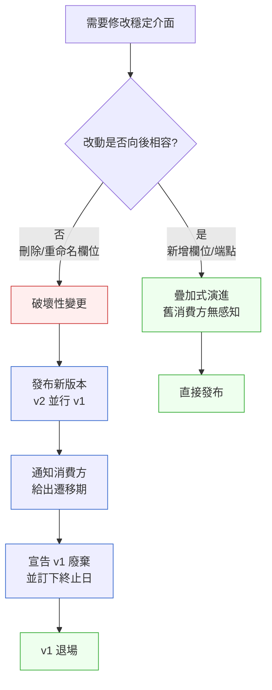

# 第 19 章｜跨團隊的介面契約與相依
## ⸺ 當兩支團隊同時改 API,到底誰說了算?

> **前置閱讀**:[第 17 章｜Pull Request 的拆分與描述](./ch-17-pull-request.md) ⸺ 理解如何把改動說清楚,是協調介面變更的前提
> **下游章節**:[第 20 章｜CI/CD 流水線設計](../part-05-delivery/ch-20-cicd-pipeline.md) ⸺ 契約測試要能自動跑,才能在流水線裡守住

---

## 19.1 共感現場:那個「我以為你不會動它」的週一早上

你可能也遇過這樣的場景。

我帶過一個做 SaaS 多租戶計費系統的團隊,剛分出一個叫「訂閱服務(Subscription Service)」的新模組。分法很自然:帳務團隊負責計費邏輯,核心平台團隊負責使用者與租戶的基礎資料。兩支團隊各自有 sprint,各自有 KPI,也各自對自己的程式碼有完全的修改權。

某個星期五下午,帳務團隊把一支 API `GET /v1/subscription/{id}` 的回傳欄位做了調整。他們把 `plan_name` 改成了 `plan_display_name`,因為這個名字在前端展示時更清楚。對帳務團隊來說,這是一個很小、很合理的改動——畢竟他們才是這支 API 的「主人」。

週一早上,核心平台團隊的部署流水線亮起了紅燈。他們有一支整合測試會呼叫這支 API,並且直接讀取 `plan_name` 欄位來判斷租戶的計費等級。欄位消失了,測試爆了,正在做的其他功能也被迫暫停。

更麻煩的是,兩支團隊都沒有做錯什麼。帳務團隊有改動 API 的權力;核心平台團隊用 API 的方式也完全合理。問題出在一個沒有人明確定義過的東西:**這支 API 的「保證」到底是什麼?誰改之前需要通知誰?通知的方式又是什麼?**

這種場景不罕見。隨著團隊規模增長、服務拆分,越來越多的協作邊界會出現。而每一條邊界,都是一個潛在的「我以為你不會動它」的地雷。

---

## 19.2 真正的問題:API 不等於介面契約

我們把這件事慢慢拆開來看。

帳務團隊改動 API 這件事本身沒有問題。有問題的是:**API 的存在,並不等於「介面契約(Interface Contract)」的存在**。這兩者之間有一個很關鍵的差距,很多團隊走了很久才意識到。

API 是個技術產物——它是一組端點、請求格式、回傳格式的實作。而「介面契約」是一個協議:它說清楚「哪些東西是我承諾不會無故改動的」「改動之前要做什麼」「消費方可以依賴哪個版本多久」。

也就是說,API 是事實(fact),契約是承諾(promise)。沒有契約的 API,就像一張沒有保固條款的產品:你知道它現在長什麼樣,但你不知道明天會不會變。

### 沒有契約會發生什麼?三個常見場景

這不只是 FlowBill 一家公司的問題。換個角度看,「有 API 但沒契約」在成長中的工程組織裡是非常普遍的狀態,它會以幾種不同的面貌出現:

**場景一:靜默遷移,然後下游爆開。** 就像 FlowBill 的案例:提供方做了在自己看來很合理的改動,沒有任何「壞心」,但消費方因為不知道什麼東西是穩定的、什麼東西可以改,就完全沒有辦法預防。等到錯誤冒出來,已經在 production 或整合測試環境了,補救成本很高。

**場景二:提供方被反鎖定(Locked Provider)。** 反過來的情況也有:消費方太多,提供方不敢動任何東西,因為沒有辦法知道改了什麼會影響到誰。這時候 API 就變成了技術債的容器——大家都知道它設計得不好,但沒有人敢碰它。一支本來應該可以演進的服務,就這樣被凍結了。這個狀況在沒有契約測試、也沒有明確消費方清單的情況下特別容易發生。

**場景三:多版本並行失控。** 有些團隊的解法是「凡事都加版本號」——看到 v1 快被別人依賴了,就趕快發 v2,避免以後不好改。但如果沒有退場機制,v1、v2、v3 最後都在跑,測試矩陣暴增,維護成本節節高升。版本化是好工具,但沒有配套的廢棄協議,版本只會越堆越多。

這三個場景的共同根源是一樣的:「API 的邊界存在,但責任的邊界沒有被說清楚。」

### 責任邊界的兩半

順著這個道理,我們自然會問:責任應該怎麼劃分?

一個常見的直覺是「誰提供 API,誰就要配合消費方」,但這個直覺如果走到極端,API 的提供方就會無法自主演進——任何改動都要跟所有消費方協商,速度慢到窒息。

更健康的觀念是把責任切成兩半:**提供方負責「明確版本化並給出遷移期」,消費方負責「不依賴未文件化的行為」**。這兩件事缺一不可,而且都需要被明確說出來,不能靠默契。

| 角色 | 責任 | 如果沒做到 |
|---|---|---|
| **提供方** | 明確標示哪些介面是穩定的;破壞性變更前通知並給遷移期 | 消費方無法預防被動爆開 |
| **消費方** | 只依賴文件明確承諾的行為;不悄悄依賴「現在有但沒說過」的細節 | 提供方任何重構都可能意外破壞消費方 |

這張表乍看很簡單,但它把「週一紅燈」的責任從「誰的錯」變成了「雙方的職責清單」。不是要找人算帳,而是要讓協作有可依循的基準。

週一早上那場紅燈,根源不是帳務團隊壞心,也不是核心平台團隊不夠小心。根源是兩支團隊從來沒有坐下來說清楚:「這支 API 裡的哪些欄位是穩定的?改動之前我們要怎麼溝通?」這句話沒說,就只能靠默契——而默契,在組織成長之後,是最不可靠的東西。

---

## 19.3 一起做判斷:建立介面契約的四件事

那麼,一個團隊要怎麼開始把「有 API」變成「有契約」?

這件事不複雜,但需要把幾個步驟變成習慣。我整理成四件事,每一件都可以獨立開始,不需要等到全部到位。

### 19.3.1 先把「穩定 vs 實驗性」說清楚

不是所有 API 端點都需要同樣強度的保護。一個好用的起點,是把你對外暴露的端點分成兩類:

| 類別 | 定義 | 對消費方的承諾 | 範例標記方式 |
|---|---|---|---|
| **穩定介面** | 消費方可以長期依賴 | 改動前提前通知、給遷移期 | `@stable`、`/v1/`、OpenAPI `x-stability: stable` |
| **實驗性介面** | 仍在演進中,可能改動 | 不承諾相容性,用自負風險 | `@experimental`、`/v0/`、`x-stability: experimental` |

有了這個區分,帳務團隊改 `plan_name` 這件事就會很不一樣。如果那支 API 被標記為「穩定介面」,那麼改動之前需要走一個版本協商流程;如果是「實驗性介面」,那核心平台團隊在使用時就要知道它可能變動,要為此設計防護。

順著這個道理,我們就能往下問:如果是穩定介面,改動要怎麼走?

### 19.3.2 版本相容的兩條路

當穩定介面需要演進時,有兩個主要路徑:



**疊加式演進(Additive Evolution)**是改動穩定介面時最友善的方式。想要加新欄位?加在回傳 JSON 的後面,舊消費方讀不到新欄位,但它們的程式碼不會爆。想要加新端點?加就好,舊端點不動。這類改動消費方無感知,可以直接發布。

**破壞性變更(Breaking Change)**就需要更謹慎了。刪除一個欄位、重命名一個欄位、改變回傳格式——這些都是破壞性的。這時候標準做法是:發布新版本(例如 `v2`),讓 `v1` 繼續跑一段時間,讓消費方有時間遷移。具體要跑多久?這要看消費方的數量和遷移複雜度,但通常不應少於一個 sprint,對外部消費方甚至需要數個月。

兩條路的時間成本差很多,值得有個直觀感:疊加式演進幾乎是「當天發布,沒有後顧之憂」;破壞性變更如果消費方多,從通知到 v1 退場,完整走下來常常需要兩個月以上。這不是嚇你——而是讓你在設計 API 的時候,傾向於「先用疊加的方式能不能達到目的?」能疊加就不要破壞,這是省下最多溝通成本的方式。

### 19.3.3 用契約測試(Contract Testing)把協議落地

光有口頭協議是不夠的,因為時間一長,口頭協議就會模糊。把契約變成可執行的測試,才能讓它在每次部署時都自動被驗證。

契約測試(Contract Testing)的概念很直接:消費方定義「它期待 API 長什麼樣」,提供方執行這份期待來確認自己有沒有破壞它。市面上的工具(例如 Pact,pact.io)可以自動化這個過程:消費方的測試產出一份 pact 檔案,提供方的 CI 流水線拿這份檔案來跑驗證。

這樣一來,如果帳務團隊把 `plan_name` 改成 `plan_display_name`,他們的 CI 就會在跑核心平台團隊提交的 pact 時爆開——在進入 production 之前,問題就被發現了。這比週一早上的紅燈,要好太多了。

有了個別 API 的契約測試之後,我們還需要回過頭來想一個更大的問題:**哪支服務應該能依賴哪支服務?** 個別契約只保護了「這一對提供方與消費方之間的約定」;但如果整體的依賴拓撲(dependency topology)設計得不好,即使每個契約都執行得很嚴謹,系統也可能變成一張牽一髮而動全身的蜘蛛網。

### 19.3.4 相依方向的判斷準則

除了個別 API 的契約,「哪支服務可以依賴哪支服務」這個大問題也值得花一點時間想清楚。

一個好用的原則是:**讓相依方向遵循穩定性方向**。穩定的服務(核心平台、帳號服務、基礎設施)可以被很多人依賴;不穩定的服務(剛分出來的新模組、還在演進的功能)應該盡量只被它真正需要的消費方依賴。

用表格來說:

| 提供方穩定性 | 消費方數量 | 建議 |
|---|---|---|
| 穩定(核心域) | 多 | 嚴格版本化,給長遷移期,契約測試必跑 |
| 穩定(核心域) | 少 | 版本化,中等遷移期,建議有契約測試 |
| 演進中(新模組) | 多 | 先等穩定再讓多方依賴;若必須,標明 experimental |
| 演進中(新模組) | 少 | 明確標記 experimental,雙方默契要明文化 |

這個判斷表不是要限制你——它只是幫你在開始被很多人依賴之前,先想清楚「我現在準備好扮演這個角色了嗎?」

---

## 19.4 容易絆倒的地方

理解了原則之後,我們來看幾個很常見的地方。這些坑幾乎每個成長中的工程團隊都走過,不是因為粗心,而是因為在小團隊時這些問題根本不會出現,等到大了才突然冒出來。

### 反模式一:隱式版本化——「版本在 URL 裡」就以為安全了

很多團隊看到路徑裡有 `/v1/` 就鬆了口氣,以為版本化做完了。但版本化的本質不是「路徑裡有個數字」,而是「消費方知道這個版本的保證是什麼、什麼時候會退場」。

如果你有 `/v1/subscription/{id}`,但從來沒有文件說過「v1 在哪些條件下會改動」「多久後退場」「退場前會怎麼通知」——那這個 `v1` 只是個裝飾,沒有實質的保護力。

這種狀況在實務上往往長這樣:某天一個新工程師加入,看到路徑上有 `/v1/` 就以為「有在做版本控制」,放心地把它當作穩定 API 接進去。幾個月後,提供方發了個「小調整」,改了某個回傳欄位的型別——對他們來說是「沒有改版本號的小事」,對接入的消費方來說卻是週一的紅燈。

> **修正方向**:版本號要配合「版本策略文件」才有意義。每個穩定版本旁邊,放一份簡短的說明:這個版本的穩定承諾是什麼、計畫維護到什麼時候、有問題找誰。一段話就夠,不用寫論文。你也可以在 OpenAPI 規格裡用 `x-stability: stable` 或 `x-stability: experimental` 標記,讓文件工具自動幫你呈現這個資訊。

### 反模式二:消費方依賴「未文件化的行為」

有時候消費方會悄悄地依賴一些提供方「沒有說過但確實有」的行為。例如:回傳的陣列剛好是按時間排序的,但 API 文件裡並沒有承諾這件事;或者錯誤回傳的 HTTP 狀態碼是 `400`,但提供方沒有把這個狀態碼寫進契約。

這類依賴很危險,因為提供方的任何重構,都可能在不知情的情況下破壞它。

一個實際的場景:電商系統裡,訂單服務呼叫庫存服務的 `GET /v1/stock/{sku}`,回傳陣列裡剛好是依照倉庫優先級排序的。訂單服務的開發者發現了這個規律,於是直接用 `response[0]` 來取優先倉的庫存。後來庫存服務為了效能改了 SQL 的 ORDER BY,排序邏輯沒變但順序稍有不同——訂單服務的撿貨邏輯就開始挑錯倉了。這個 bug 在 production 跑了兩週才被發現,因為絕大多數情況下第一個倉還是正確的,只有特殊情況才出問題。

> **修正方向**:消費方在接入一支 API 時,只依賴「文件明確說過的」行為。對任何「文件沒說但現在有」的行為,要主動回去問提供方:「這個行為是承諾還是巧合?」如果是承諾,那就請提供方把它寫進文件或 pact 裡;如果是巧合,那消費方就要自己做防護,不能把它當作可依賴的契約。

### 反模式三:通知只在口頭,遷移期沒有追蹤

改動之前通知消費方這件事,如果只靠即時通訊軟體的一則訊息,很容易被淹沒。訊息發出去、對方說「收到」,但兩週後 v1 退場時,消費方還沒遷移完——因為那則訊息在 Slack 河流裡沉底了。

這個問題比想像的嚴重。特別是當消費方不只一支的時候:一則 Slack 訊息對帳務服務的對口工程師說了「v1 在四週後退場」,但對口工程師剛好那週請假,回來看到一百則新訊息,沒有看到這一則。或者看到了,回覆「收到」,但沒有開票追蹤,等到遷移視窗快到了才發現自己的 sprint 已經排滿。這些都是很真實的場景,不是疏忽,是「口頭協議在大組織裡天然的失效模式」。

> **修正方向**:破壞性變更的通知要有追蹤機制。最簡單的做法是開一張 ticket,列出「哪些消費方需要遷移」「預計遷移完成日期」「聯絡窗口」,讓這件事有個不會消失的存在。API 廢棄通知也可以直接放進 HTTP 回應的 header(`Deprecation: true`、`Sunset: <date>`),這是 RFC 8594 定義的標準做法——讓消費方在每次呼叫時都能看到。消費方的監控系統可以攔截這個 header 自動發警示,完全不需要靠人工追訊息。

### 反模式四:契約測試只有消費方做,提供方不跑

這個狀況比你想的常見。消費方費心寫了 pact 檔案,也推到了 Pact Broker;但提供方的 CI 流水線沒有設定 `pact:verify` 這個步驟,或者設了但只在本地跑。結果是:pact 存在,但它只是一份靜態文件,沒有真正把契約變成可執行的守門人。

這就像是雙方都簽了合約,但合約鎖在抽屜裡,每次交貨都沒有對照合約內容——合約的存在沒有改變任何行為。

> **修正方向**:契約測試的執行必須在提供方的 CI 流水線裡自動觸發——每次 PR 合併之前都要跑 `pact:verify`,而且結果要是 blocking(失敗就擋住合併)。Pact 工具(pact.io)支援透過 Pact Broker 讓提供方自動拉取所有消費方的最新 pact 來執行,這樣新消費方加入之後,提供方的 CI 也會自動多一份驗證,不需要手動維護清單。

看完這四個反模式,你可能會想:「要把這些都做好,需要維護好多東西。」有這個感覺很正常。好消息是,這些事情可以被整合進一份輕量的文件——不是為了製造文書工作,而是為了讓跨團隊的溝通有個不用每次重新說的共同基準。

---

## 19.5 帶得走的工具 ⸺ 一頁式「介面契約書」

把上面的判斷整理成一頁文件,放在 API 旁邊——不是為了審查,而是為了讓兩支團隊在溝通的時候有一個共同的基準。這份文件不需要多,一頁就夠。

下面是空白模板,放在 README 或 Confluence 裡都行:

```text
介面契約書 ⸺ {服務名稱} / {端點或端點群}

提供方:{team name}
消費方:{team name(s)}
建立日期:{YYYY-MM-DD}
最後更新:{YYYY-MM-DD}

────────────────────────────────────────
1. 穩定性等級
   □ 穩定(Stable)   □ 實驗性(Experimental)

2. 當前版本
   版本號:{v?}
   版本策略:{本版本計畫維護到何時,或何種條件下會發布新版本}

3. 承諾的介面
   端點:{HTTP 方法 + 路徑}
   請求格式:{JSON 範例或 schema 連結}
   回傳格式:{JSON 範例或 schema 連結}
   承諾的欄位:{列出消費方可穩定依賴的欄位}
   不承諾的行為:{列出「現在有但不保證的」行為,例如排序、隱含預設值}

4. 破壞性變更協議
   通知方式:{Slack + ticket / email / ...}
   通知提前時間:{至少幾個 sprint 前}
   遷移期長度:{v_old 會並行多久}
   廢棄通知機制:{是否在 header 回傳 Deprecation / Sunset}

5. 契約測試
   □ 已有 pact 檔案 / □ 無,計畫於:{日期}補上
   pact 存放位置:{repo 路徑或 Pact Broker URL}

6. 聯絡窗口
   提供方:{name / Slack handle}
   消費方:{name / Slack handle}
```

為什麼是一頁、而且欄位這麼少?因為這份文件的目的不是覆蓋所有可能性,而是把「最容易忘記說清楚的幾件事」固定下來。欄位一多,大家就不填;少到六欄,每次新 API 上線或舊 API 要改動時,兩支團隊花半小時填一填,後面就省掉很多週一早上的紅燈。

### 19.5.1 範例:FlowBill 訂閱 API 的介面契約書

FlowBill 是一家多租戶 SaaS 計費公司(虛構)。帳務團隊那次週一紅燈之後,技術主管帶著兩支團隊坐下來補了這份文件。下面是他們填好的版本:

```text
介面契約書 ⸺ Subscription Service / GET /v1/subscription/{id}

提供方:帳務團隊(Billing Team)
消費方:核心平台團隊(Core Platform Team)
建立日期:2026-03-10
最後更新:2026-03-10

────────────────────────────────────────
1. 穩定性等級
   ✅ 穩定(Stable)
   <!-- 為什麼這欄:填這欄之前,帳務團隊第一次意識到「我們從來沒有說過這支 API
        是穩定的還是實驗性的」。填了之後,兩支團隊對「改動需要協商」這件事
        才有了共同的基準。 -->

2. 當前版本
   版本號:v1
   版本策略:v1 計畫維護至少 6 個月。若需要破壞性變更,發布 v2 並並行 v1
             至少 2 個 sprint(約 4 週)後再退場。
   <!-- 為什麼這欄:「版本策略」是很多團隊忘記填的。光有版本號沒有策略,
        消費方不知道要不要現在就遷移——這欄把「維護多久」講清楚。 -->

3. 承諾的介面
   端點:GET /v1/subscription/{id}
   請求格式:路徑參數 {id} 為 UUID v4
   回傳格式:
     {
       "id": "string (UUID)",
       "tenant_id": "string (UUID)",
       "plan_name": "string",        ← 承諾欄位
       "status": "active|suspended|cancelled",
       "current_period_end": "ISO 8601 date"
     }
   承諾的欄位:id, tenant_id, plan_name, status, current_period_end
   <!-- 為什麼這欄:明確列出「承諾欄位」是這份文件最重要的一行。
        如果當初有這欄,帳務團隊就會知道 plan_name 不能靜默改名——
        它已經被消費方列為依賴。 -->
   不承諾的行為:回傳欄位的順序不保證;未列出的欄位可能任何時候調整

4. 破壞性變更協議
   通知方式:開 Jira ticket 標記兩支團隊,並在 #billing-api-updates Slack
             channel 發公告
   通知提前時間:至少 2 個 sprint(4 週)前
   遷移期長度:舊版本並行 4 週後退場
   廢棄通知機制:退場前 2 週,回應 header 加入
                 Deprecation: true
                 Sunset: 2026-06-01T00:00:00Z
   <!-- 為什麼這欄:Deprecation / Sunset header 是 RFC 8594 的標準做法。
        加了這個 header,消費方的 log 監控工具就能自動標出「這支 API 快退場了」,
        不用靠人工追訊息。 -->

5. 契約測試
   ✅ 已有 pact 檔案
   pact 存放位置:core-platform-service/pacts/subscription-v1.pact.json
   CI 整合:帳務服務的 GitHub Actions 會在每次 PR 時跑 pact verify
   <!-- 為什麼這欄:把 pact 存放位置填在這裡,是為了讓「契約在哪」不再是
        口頭知識。任何新加入的工程師,打開這份文件就知道去哪找驗證腳本、
        去哪更新消費方的期待——不需要問人。 -->

6. 聯絡窗口
   提供方:Lily Chen / @lily (Slack)
   消費方:Jason Wu / @jason (Slack)
   <!-- 為什麼這欄:當 v1 需要調整時,不用翻組織圖找人——這欄直接告訴你
        「打給誰」。人員異動時更新這欄,協商流程就不會因為「不知道找誰」
        而卡住。 -->
```

這份文件花了兩支團隊大約一個下午填好。填的過程本身比文件更有價值——因為「承諾的欄位」那一欄,迫使帳務團隊第一次問自己:「我們到底承諾了哪些東西?」這個問題,在那支 API 上線一年半之後,才第一次被認真想過。

有了這份文件,下次再有欄位調整的需求,帳務團隊會先來看它——不是因為規定,而是因為它讓協商變得很簡單:一張表格、兩個窗口、一個 ticket。週一的紅燈,不用等它出現。

---

## 19.6 本章回顧

讀完這一章,你應該已經能:

- [ ] 說清楚「有 API」和「有介面契約」之間的差距是什麼
- [ ] 把自己團隊的端點分成「穩定介面」和「實驗性介面」,並知道各自的保護力度
- [ ] 區分「疊加式演進」和「破壞性變更」,並知道後者需要走哪些步驟
- [ ] 開始補一份「介面契約書」,讓跨團隊的協商有共同基準
- [ ] 理解契約測試(Pact)如何把口頭協議變成可執行的自動化驗證

如果想先從一件事開始,我會建議——**先把你和其他團隊共享的一支最重要的 API,填一份介面契約書**。不需要完美,六欄裡先填三欄也行。最有價值的那一欄,往往是「承諾的欄位」:寫完你才會知道自己到底承諾了什麼,而另一支團隊也才知道他們可以依賴什麼。很多協作的誤解,就是在填這欄的時候第一次被說清楚的。

---

## Cross-References

- **前一章**:[第 18 章｜結對/群體程式設計的時機](./ch-18-pairing.md) ⸺ 介面設計的早期討論,結對是個好時機
- **下一章**:[第 20 章｜CI/CD 流水線設計](../part-05-delivery/ch-20-cicd-pipeline.md) ⸺ 契約測試要能自動跑,流水線是它的家
- **強連結**:[第 12 章｜契約測試與整合測試](../part-03-testing/ch-12-contract-integration-testing.md) ⸺ Pact 的具體寫法與測試雙方的角色
- **強連結**:[第 15 章｜與 CI 整合的測試流水線](../part-03-testing/ch-15-ci-test-pipeline.md) ⸺ pact verify 要在哪個階段跑
- **跨書連結**:[SA/SD Playbook ⸺ 服務邊界設計](https://github.com/EddyKuo/sa-sd-playbook) ⸺ 本章談「如何協商介面」;SA/SD 談「如何決定邊界在哪裡」

---
