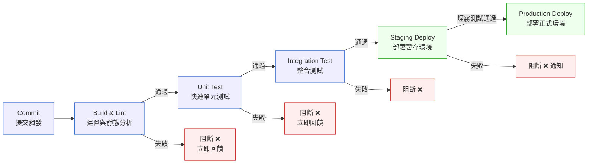

# 第 20 章｜CI/CD 流水線設計
## ⸺ 流水線不是儀式,是你對「安全交付」的具體承諾

> **前置閱讀**:[第 15 章｜與 CI 整合的測試流水線](../part-03-testing/ch-15-ci-test-pipeline.md)、[第 17 章｜Pull Request 的拆分與描述](../part-04-collaboration/ch-17-pull-request.md)
> **下游章節**:[第 21 章｜Feature Flag 與漸進式發布](./ch-21-feature-flag.md)、[第 22 章｜藍綠/金絲雀部署](./ch-22-blue-green-canary.md)

## 20.1 共感現場:那個每次都在「希望不要壞」的部署時刻

你可能也有過這樣的下午。

團隊花了一個衝刺的力氣,把一批功能做完了。Code review 也通過了,測試在本機是好的。然後到了部署那天,大家的聊天室裡多了一行訊息:「我在佈署,大家先別動 main。」接著是沉默。有人在釘書聊天室頻道等待,有人偶爾問一句「好了嗎」,有人打開監控畫面盯著錯誤率。部署的那個人,每次按下去都不太確定這次會不會出事。

這種感覺很難說清楚。程式碼是對的,測試也過了,但就是不安心——因為**整個「從 commit 到上線」的路徑,從來沒有人把它變成一件可預測的事**。每次部署都是手工的、個人的、憑感覺的。成功,是運氣好;失敗,才是資訊。

我帶過一個電商團隊,叫他們 Cartly 吧。他們做的是中型的 B2C 訂單系統,旺季流量大概是平日的五倍。在改善 CI/CD 之前,他們的部署流程是這樣的:工程師在本機跑一遍測試,沒有問題就 push,然後通知 DevOps 的阿明幫忙部署到正式環境。整個過程裡,阿明的那台電腦就是「唯一知道怎麼部署」的地方。阿明請假的那個週末,一個緊急 hotfix 卡了三小時沒人敢動。

那三小時不是因為沒有人會寫程式,而是因為**整個交付流程的知識,只活在一個人的腦袋和操作習慣裡**。

順著這個道理,我們就能看到 CI/CD(持續整合/持續交付,Continuous Integration / Continuous Delivery)的本質不是工具,而是一個承諾——對整個團隊承諾:這條路,我們走過、測過、記錄過,下一次走也會一樣安全。

## 20.2 真正的問題:可重現性不是「剛好」,是設計出來的

把 Cartly 的處境慢慢拆開來看,你會發現三個問題纏在一起,看起來像一個問題。

**第一個問題:知識在人腦裡,不在流程裡。** 部署步驟只有阿明知道,不是因為他藏私,而是從來沒有人把它寫成「任何人都能執行一遍、結果都一樣」的東西。這叫做「可重現建置(Reproducible Build)」的缺失——同樣的 commit、同樣的環境,你應該要能保證每次的建置結果都完全一致。沒有這個保證,你就沒辦法信任部署。

**第二個問題:品質門檻模糊。** Cartly 的測試只在「有空的時候」跑,沒有人規定「到底什麼條件達到才能合進 main」。所以每個人自己衡量,自己決定。這樣的問題不是人不認真,而是**在缺乏品質門檻(Quality Gate)的情況下,「主觀覺得沒問題」就變成了唯一的標準**。

**第三個問題:回饋太慢。** 程式碼寫完了,要等到部署後才知道有沒有問題。中間這段「合進去之後到上線之前」的空白,像一個資訊的黑洞。問題在裡面悶著,越積越大,直到上線那一刻才爆出來。

也就是說,CI/CD 真正要解決的,不是「讓部署更快」,而是把這三個問題各自對症:讓**知識流程化**、讓**品質有明確門檻**、讓**回饋盡量靠近問題發生的那一刻**。

這就帶出了下一個問題:一條好的流水線,要有哪些階段?每個階段又守著什麼?

## 20.3 一起做判斷:流水線的五個階段與品質門檻

一條 CI/CD 流水線不是越長越好,也不是越短越快。它的設計原則只有一個:
**讓每個問題,盡量在距離它產生最近的那個位置被擋下來。**

理由很簡單——越晚發現,修復成本越高。在 commit 階段發現的問題,修一下就好;到了正式環境才發現,可能已經影響到真實用戶了。

### 20.3.1 五個階段的流水線設計

下面是我建議的五段式結構,從「最快、最低成本」到「最慢、最接近生產」依序排列:



每個階段守的東西不一樣,成本也不一樣:

| 階段 | 觸發時機 | 執行時間目標 | 守著什麼 | 阻斷條件 |
|---|---|---|---|---|
| **Build & Lint** | 每次 push | < 2 分鐘 | 語法、靜態型別、程式風格 | 任何 lint error、型別錯誤 |
| **Unit Test** | 每次 push | < 5 分鐘 | 單一函式/模組的正確性 | 任何 test failure |
| **Integration Test** | PR 合入前 | < 15 分鐘 | 跨模組/服務的互動 | 任何 test failure |
| **Staging Deploy** | 合入 main 後 | < 10 分鐘 | 可部署性、基本煙霧測試 | 部署失敗或煙霧測試不通過 |
| **Production Deploy** | 手動觸發或排程 | 依策略而定 | 真實環境下的正常運行 | 健康檢查失敗、錯誤率異常 |

這張表想說的是:前兩段要**非常快**——如果等超過五分鐘才知道自己是否寫錯了什麼,工程師很快就會開始「跑測試的時候去做別的事」,一旦有了這個習慣,流水線的回饋價值就大打折扣。

### 20.3.2 可重現建置的四個要素

可重現建置由四件具體事項組成:

| 要素 | 做法 | 如果沒做 |
|---|---|---|
| **相依版本鎖定** | `package-lock.json`、`Pipfile.lock`、`go.sum` 等 lockfile 必須進版控 | 同樣 commit 在不同時間建置,可能拿到不同版本的套件 |
| **環境隔離** | 用 Docker 容器建置,不依賴 CI 機器上的全域工具 | 在你電腦跑得過,在 CI 跑不過(或反過來) |
| **建置產物不可變** | 建好的 Docker image 加 digest 標記,部署時拉的是同一份 | Staging 測的版本和 Production 跑的版本可能不一樣 |
| **秘鑰/設定外掛** | 程式碼不含環境設定,透過 Secret Manager 或環境變數注入 | 不同環境行為不一致,或秘鑰意外進入版控 |

這四件事,每少做一件,你對「Staging 測過的東西就是 Production 會跑的東西」這個承諾就少一分可信度。

### 20.3.3 回饋速度的設計

設計好五個階段與品質門檻後,還有一個同樣重要的維度常被忽略:回饋速度。一條「理論上很完整」但「每次跑 40 分鐘」的流水線,最終的命運往往是大家繞過它。

一個好用的角度是:把流水線想成一個「成本遞增的漏斗」。

- **最便宜的事放最前面**:靜態分析、型別檢查、lint,這些幾乎不花時間,卻能擋掉最蠢的一類錯誤。
- **單元測試要快到像反射動作**:< 5 分鐘是合理目標,超過 10 分鐘就要開始想辦法分割或平行化。
- **慢測試和部署放後面**:整合測試、E2E 測試、部署,放在合進主幹之後的階段,不要卡在開發者的本機迴圈裡。

## 20.4 容易絆倒的地方

下面這幾個地方,幾乎每個建流水線的人都踩過。說這些不是要提醒你「不要犯錯」,而是希望你下次遇到的時候,心裡有個底。

---

**絆倒處一:流水線太長、太慢,大家開始繞過去。**

這是流水線最常見的死亡方式。一開始用心設計了很多階段,然後越加越多,跑一次要半小時。工程師面對長耗時的流水線,會尋求捷徑(在 commit message 中加 `[skip ci]` 或直接推到 main)——這不是態度問題,而是流水線本身給了繞路的理由。

流水線的存在前提是「大家真的在用它」。

> **修正方向**:每次新增一個步驟,先量它會讓整體時間增加多少。如果超過五分鐘,想辦法和現有步驟平行執行,或者移到更後面的階段。目標是讓「提交 → 收到第一個回饋」這個迴圈保持在三分鐘以內。

---

**絆倒處二:只有 CI,沒有 CD——Staging 的部署還是靠手動。**

持續整合(CI)做得很完整,但「部署到 Staging 測試」還是要靠某個人手動執行。這樣做表面上沒有問題,但帶來的後果是:Staging 上的版本常常和 main 不一致,測的是過時的程式碼,發現問題時也說不清楚「你測的到底是哪個版本」。

> **修正方向**:Staging 的部署應該自動化——每次合進 main,就自動部署到 Staging。讓「Staging 永遠反映 main 的最新狀態」成為一個不需要思考的事實。

---

**絆倒處三:環境設定混在程式碼裡,每個環境部署時都要手動改。**

開發環境的資料庫位址是 `localhost`,Staging 是另一串,Production 是又一串。有人把這些值直接寫在程式碼裡,每次部署前要記得改一次。這不是懶,是當初沒有把「程式碼」和「設定」的界線畫清楚。

反模式的樣子大概是這樣:

```python
# ⚠️ 反模式:環境設定硬編碼在程式碼裡
DATABASE_URL = "postgresql://prod-db.internal:5432/cartly"
API_KEY = "sk-prod-xxxxxx"
```

> **修正方向**:所有環境相依的設定(資料庫位址、API 金鑰、Feature Flag 開關),一律從環境變數或 Secret Manager 讀取。程式碼只知道「去哪裡讀設定」,不知道設定的值是什麼。這樣同一份建置產物,才能安全地在不同環境執行。

---

**絆倒處四:「測試通過」就直接部署 Production,沒有 Staging 這一層。**

有些小團隊覺得 Staging 是多餘的——本機測過了,CI 也通過了,直接上 Production 有什麼問題?問題是,Production 有很多 CI 沒有的東西:真實的資料量、真實的網路拓撲、真實的外部服務、真實的設定值。這些細節常常是問題的藏身之處。

> **修正方向**:把 Staging 視為「隔離的 Production 複製品」,而非「讓測試有個地方跑」的備用環境。Staging 要用和 Production 相同的建置產物、相近的設定方式、真實的(但可能是脫敏過的)資料結構。

## 20.5 帶得走的工具 ⸺ 一頁式 CI/CD 流水線設計表

下面是一份空白的「CI/CD 流水線設計表」,你可以把它貼在新專案的 wiki 第一頁,或者放進第一次設計流水線的 PR 描述裡:

```text
CI/CD 流水線設計表 ⸺ {專案名稱}
最後更新:{日期}
撰寫者:{誰}

═══════════════════════════════════════
一、建置可重現性確認
═══════════════════════════════════════
□ 相依版本鎖定檔(lockfile)已納入版控?  是 / 否
□ 建置在 Docker 容器內執行,不依賴本機環境?  是 / 否
□ 建置產物標記了不可變的 digest/tag?  是 / 否
□ 所有環境設定從外部注入,未硬編碼?  是 / 否

═══════════════════════════════════════
二、流水線階段設計
═══════════════════════════════════════
階段 1 — Build & Lint
  觸發時機:{每次 push / PR 建立}
  執行目標時間:{填寫}
  品質門檻:{填寫,例:lint 零 error、型別零錯誤}
  阻斷行為:{合併阻斷 / 警告不阻斷}

階段 2 — Unit Test
  觸發時機:{每次 push}
  執行目標時間:{填寫}
  覆蓋率要求:{填寫,例:新增程式碼行覆蓋率 ≥ 80%}
  阻斷行為:{填寫}

階段 3 — Integration Test
  觸發時機:{PR 合入前}
  執行目標時間:{填寫}
  測試範圍:{填寫,例:訂單服務 ↔ 庫存服務 API 契約}
  阻斷行為:{填寫}

階段 4 — Staging Deploy
  觸發時機:{合入 main 後自動 / 手動}
  健康檢查:{填寫,例:HTTP 200 煙霧測試}
  自動回滾條件:{填寫}

階段 5 — Production Deploy
  觸發時機:{手動批准 / 排程 / 自動}
  部署策略:{Rolling / Blue-Green / Canary}
  Health Check:{填寫}
  回滾方案:{填寫}

═══════════════════════════════════════
三、回饋速度目標
═══════════════════════════════════════
Commit → 第一個 CI 回饋:目標 {___} 分鐘
PR 合入 → Staging 可測:目標 {___} 分鐘
Staging 批准 → Production 完成:目標 {___} 分鐘
```

為什麼是一頁?因為流水線設計最容易遇到的問題是「太複雜、沒人維護」。把它壓縮在一頁裡,是在提醒自己:**設計是給人用的,不是給人景仰的**。欄位可以隨著團隊成熟再加,但從一頁開始,比從一份百頁文件開始容易堅持得多。

### 20.5.1 範例:Cartly 電商團隊的重建流水線

讓我們回到 Cartly 那個阿明請假、hotfix 卡住的故事。他們後來花了兩個 sprint 重建了流水線,下面是他們設計表的填寫版:

```text
CI/CD 流水線設計表 ⸺ Cartly 訂單系統
最後更新:2026-03-15
撰寫者:阿明、小琪

═══════════════════════════════════════
一、建置可重現性確認
═══════════════════════════════════════
□ 相依版本鎖定檔(lockfile)已納入版控?  ✅ 是
  (package-lock.json + pip requirements.txt with --hash)
□ 建置在 Docker 容器內執行,不依賴本機環境?  ✅ 是
  (GitHub Actions(GitHub 官方 CI/CD 服務)使用 docker build(Docker 24.0+),基底 python:3.12-slim)
<!-- 為什麼這欄:Cartly 之前有過「在 Mac 跑得過,CI 上掛掉」的慘痛記憶,
     根本原因是 CI runner 的系統 Python 版本和本機不一樣。
     用 Docker 建置之後,這個問題直接消失了。 -->
□ 建置產物標記了不可變的 digest/tag?  ✅ 是
  (tag 格式:cartly-order:main-{git-sha},同時推 SHA 和 latest)
<!-- 為什麼這欄:用 latest 部署的話,Staging 和 Production 可能拉到不同版本。
     加 git-sha 之後,「我部署的是哪個 commit」這個問題有了確定的答案。 -->
□ 所有環境設定從外部注入,未硬編碼?  ✅ 是
  (資料庫連線字串、Stripe API key 全走 GitHub Secrets → 容器環境變數)

═══════════════════════════════════════
二、流水線階段設計
═══════════════════════════════════════
階段 1 — Build & Lint
  觸發時機:每次 push(含 feature branch)
  執行目標時間:< 2 分鐘
  品質門檻:ruff(Python linter)零 error;mypy 型別檢查零錯誤
  阻斷行為:合併阻斷 + 在 PR check 顯示失敗行

階段 2 — Unit Test
  觸發時機:每次 push
  執行目標時間:< 4 分鐘(目前 3.2 分鐘)
  覆蓋率要求:新增行覆蓋率 ≥ 80%;整體不退步
<!-- 為什麼這欄:「整體不退步」比「整體 ≥ 80%」更有意義——
     前者會讓人靠舊有覆蓋率護體繼續加沒有測試的程式碼。
     後者確保每次 PR 至少不讓測試債更多。 -->
  阻斷行為:合併阻斷

階段 3 — Integration Test
  觸發時機:PR 合入 main 前
  執行目標時間:< 12 分鐘
  測試範圍:訂單服務 ↔ 庫存服務 API 契約;訂單 ↔ 支付 Webhook
  阻斷行為:合併阻斷(旺季前兩週升級為人工 review)

階段 4 — Staging Deploy
  觸發時機:合入 main 後自動觸發
  健康檢查:GET /health 連續三次 HTTP 200;p95 回應時間 < 500ms
  自動回滾條件:健康檢查失敗或錯誤率 > 1% 持續 3 分鐘
<!-- 為什麼這欄:自動回滾的條件要具體——「感覺不對」不是條件。
     Cartly 用錯誤率 1% 是因為他們的 SLO 是 99.5%,這個門檻給了足夠的緩衝。 -->

階段 5 — Production Deploy
  觸發時機:Staging 健康通過後,手動在 Slack Bot 按「批准」
  部署策略:Rolling Deploy(Pod 逐步替換,滾動比例 25%/次)
  Health Check:與 Staging 相同 + 訂單建立 E2E 煙霧測試
  回滾方案:kubectl rollout undo(Kubernetes 1.26+),目標 < 3 分鐘還原

═══════════════════════════════════════
三、回饋速度目標
═══════════════════════════════════════
Commit → 第一個 CI 回饋:目標 3 分鐘(實測 2.8 分鐘)
PR 合入 → Staging 可測:目標 15 分鐘(實測 13 分鐘)
Staging 批准 → Production 完成:目標 10 分鐘(實測 8 分鐘)
```

Cartly 把這份設計表貼在他們的 Notion 專案首頁。第一次旺季,阿明請假了——這次沒有人卡住,因為流水線的每一步都寫清楚了「觸發什麼、守什麼、出事怎麼辦」。小琪第一次獨立上線了一個 hotfix,她說「我第一次覺得部署不是在賭博」。

流水線的價值,不是讓部署「變快」——而是讓部署從一件靠「某個人在場」的事,變成一件靠「設計」的事。那個改變,才是真的安全。

## 20.6 本章回顧

讀完這一章,你應該已經能:

- [ ] 說清楚 CI/CD 的本質:讓「從 commit 到上線」的路徑可預測、可重現、不依賴特定個人
- [ ] 設計一條五段式流水線,知道每個階段守著什麼、成本多少、阻斷條件是什麼
- [ ] 列出可重現建置的四個要素(lockfile、環境隔離、不可變產物、設定外掛),並說明少做一件的後果
- [ ] 識別「流水線太慢被繞過」「Staging 靠手動」「設定硬編碼」「沒有 Staging 層的風險」四個常見地雷,並知道修正方向

如果想先從一件事開始,我會建議 ⸺**把 Staging 的部署自動化**,因為「Staging 永遠反映 main 的最新狀態」這個單一改變,就能讓你的「測試通過 = 可以上線」這個信念,第一次站在一個扎實的基礎上。其他的階段可以慢慢補,但先讓自動化的 Staging 存在,你已經踏出了最重要的一步。

下一章,我們會談流水線之後的事:當你已經能安全部署了,如何用 **Feature Flag** 讓「部署」和「功能上線」分開——讓你在不做新部署的前提下,控制誰能看到哪些功能。

## Cross-References

- **下一章**:[第 21 章｜Feature Flag 與漸進式發布](./ch-21-feature-flag.md) ⸺ 讓部署與功能開關分離,實現漸進式上線
- **強連結**:[第 15 章｜與 CI 整合的測試流水線](../part-03-testing/ch-15-ci-test-pipeline.md) ⸺ 本章流水線的測試階段基礎
- **強連結**:[第 22 章｜藍綠/金絲雀部署](./ch-22-blue-green-canary.md) ⸺ Production Deploy 階段的策略選擇
- **強連結**:[第 23 章｜回滾與前向修復決策](./ch-23-rollback.md) ⸺ 自動回滾條件的決策細節
- **強連結**:[第 25 章｜可觀測性落地](../part-06-operations/ch-25-observability.md) ⸺ 健康檢查與錯誤率門檻的量測基礎
- **跨書連結**:[SA/SD Playbook](https://github.com/EddyKuo/sa-sd-playbook) ⸺ 部署策略的架構高度選擇
- **跨書連結**:[QA Playbook](https://github.com/EddyKuo/qa-playbook) ⸺ 品質門檻的整體策略治理
