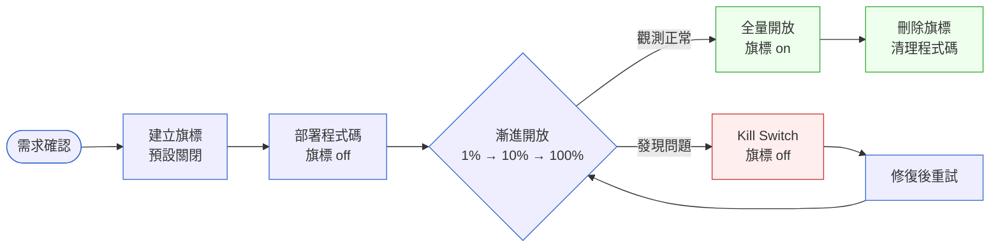

# 第 21 章｜Feature Flag 與漸進式發布
## ⸺ 把「部署到線上」和「讓使用者看到」這兩件事,分開處理

> **前置閱讀**:[第 20 章｜CI/CD 流水線設計](./ch-20-cicd.md)
> **下游章節**:[第 22 章｜藍綠/金絲雀部署](./ch-22-blue-green-canary.md)

## 21.1 共感現場:「功能已上線,但我不敢讓人用」

你可能也遇過這樣的時刻。

功能寫完了,測試也過了,CI 全綠。照理說,這時候按下部署,一切就結束了。可是工程師偏偏在那個按鈕前面猶豫了很久——因為那支功能關係到金流,或者改動了一個很核心的結帳邏輯,或者 PM 希望等某個行銷活動啟動才公開。問題是,PM 要等兩週。

於是有兩條路:要嗎把這段程式碼在分支上多坐兩週,等到時機到了再合併、再部署;要嗎趕快先部署上線,讓它靜靜地待在後端,等到需要的時候再「打開」。

很多團隊選了第一條路。程式碼在分支上越坐越久,等到終於要合併的那天,主幹已經動了幾十次,衝突一大片。那種感覺,大概做過的人都會心有戚戚焉。

第二條路,就是今天要聊的主角:**功能旗標(Feature Flag)**。它讓你把一件很自然的事做到底:程式碼可以部署上線,但「使用者看不看得到這個功能」,是另一個獨立的開關。

## 21.2 真正的問題:部署和發布,其實是兩件事

我們把這件事慢慢拆開來看。

### 21.2.1 「部署 = 發布」這個假設從哪裡來

過去,「部署」和「發布」幾乎是同義詞——程式碼上線了,功能就公開了,沒有中間地帶。這個模式在功能數少、發布節奏慢的時代行得通:你只要在對的時機按下部署就好。整個流程很簡單:開發完成 → 測試通過 → 部署 → 使用者可以用。這條線是直的,中間沒有岔路。

問題是,這個假設是建立在「每次部署都是一件大事」的前提上。過去一個月才部署一次,你有時間等到業務準備好、行銷活動啟動、法規審查完成,再一次性上線。但現在的開發節奏很不一樣了。

CI/CD 讓部署這個動作變得非常便宜,一天可以發好幾次。工程師提一個 PR、merge 到 main、流水線自動跑完,幾分鐘後程式碼就上線了。這對工程品質是好事——小批量、高頻率的部署讓問題更容易定位,也讓回滾代價更低。

但「功能對誰公開、什麼時候公開」這個決定,卻不是技術問題,而是業務問題。它牽涉到行銷時程、A/B 測試、風控審查,甚至監管合規。這些事情的節奏,和工程師提 PR 的節奏根本不在同一個頻道上。

也就是說,技術上的「我可以部署」和業務上的「我可以讓人看到」,節奏根本不一樣。把這兩件事強行綁在一起,就會出現一個很尷尬的局面:要嗎讓程式碼在分支上等業務決策,要嗎讓業務行程配合工程節奏。這兩個方向都會製造摩擦。

### 21.2.2 解耦之後,發布變成一個「過程」

功能旗標的核心想法就是把這個綁定鬆開:**部署是工程的節奏,發布是業務的節奏,讓兩邊各自跑各自的。** 程式碼先到線上去,旗標先設為「關閉」;等業務準備好,翻一個開關,功能就對指定的使用者開放了——不需要再部署一次。

順著這個道理,我們就能理解為什麼很多工程書上說「漸進式發布(Progressive Delivery)」是比「部署」更準確的詞:發布是一個過程,不是一個瞬間的動作。

具體來說,這個過程可以是這樣走的:

1. **程式碼上線,旗標關閉**:功能存在於線上環境,但沒有任何用戶能看到它。這讓工程師可以做端對端的冒煙測試(Smoke Test),確認部署本身沒問題。

2. **開放給內部用戶或測試帳號**:讓 QA、PM、設計師先用。這是最便宜的驗證——真實環境、真實資料、但風險幾乎是零。

3. **按比例開放給真實用戶**:先給 1%、5%、10%……這個過程中,可觀測性(Observability)工具會告訴你 error rate 有沒有異常、P99 latency 有沒有爬升。

4. **全量開放,旗標設為常開**:這時候功能才算真正「發布」給所有人。

5. **刪除旗標,清理程式碼**:這一步很多團隊漏掉,但它決定了你的旗標系統能不能長期健康。

這五個步驟,讓「發布」從一個緊繃的時刻,變成一個有依據、有退路的漸進過程。每一步都比前一步多一點信心,而不是一口氣賭上所有用戶。

### 21.2.3 旗標帶來的不只是安全感,還有能力邊界的擴展

把部署和發布拆開之後,有幾件本來做不到的事變得可能了:

**A/B 測試變成工程的一部分**:你可以讓 50% 的用戶看舊版 UI,50% 看新版,然後用數據決定哪一個更好。這件事以前要靠很複雜的基礎設施才能做到,有了功能旗標,它就是一個普通的開發工作。

**Kill Switch 成為標準配備**:每個關鍵功能都可以有一個緊急關閉的開關。真正出事的時候,你不需要等部署,一個設定更新就能讓功能在幾秒內對所有用戶消失。對於影響核心業務的功能,這個能力的價值很難用數字衡量。

**業務決策和工程決策各自獨立**:PM 可以在準備好的時候打開旗標,不需要等工程師部署;工程師可以在功能完成後立刻合入主幹,不需要等行銷活動的日期。這兩邊的自主性都提升了。

**多租戶或分層開放變得自然**:SaaS 產品常見的「Enterprise 方案才有這個功能」,可以直接用業務旗標(Permission Flag)實作。不需要在程式碼裡硬寫方案判斷,旗標的評估邏輯就能處理。

這些不是附帶好處,它們是漸進式發布真正的核心價值。理解了這些,我們就能更清楚地思考「旗標應該怎麼設計、怎麼管理」——也就是下一節要談的內容。

## 21.3 一起做判斷:旗標的種類、生命週期與決策清單

功能旗標聽起來是一個很簡單的概念——不就是 `if (flagEnabled) { ... }` 嗎?確實,技術上可以這樣實作。但如果只停留在「一個 if 判斷」的思維,遲早會遇到一個讓人頭痛的問題:旗標越來越多,沒人知道哪個還有用、哪個可以刪,最後整個程式碼變成一片「已死的 if」——也就是大家說的「旗標債務(Flag Debt)」。

所以在動手之前,先花一點時間弄清楚旗標的種類,對後面的管理幫助非常大。

### 21.3.1 四種旗標,用途各有不同

| 旗標種類 | 用途 | 預期存活期 | 常見錯誤 |
|---|---|---|---|
| **發布旗標(Release Flag)** | 隱藏未完成的功能,讓程式碼先上線 | 短暫,功能穩定後刪 | 忘刪,變成永久旗標 |
| **實驗旗標(Experiment Flag)** | A/B 測試、流量分流 | 中期,實驗結束後刪 | 實驗結束沒清理 |
| **運維旗標(Ops Flag / Kill Switch)** | 緊急關閉有問題的功能 | 長期,需要維護 | 太多 Kill Switch,不知道哪個是真的 |
| **業務旗標(Permission Flag)** | 依租戶/方案開放不同功能 | 永久(業務需要) | 和發布旗標混用 |

這四種旗標的生命週期差很多:發布旗標用完就應該刪,業務旗標則可能跑幾年。把它們混在一起管理,是旗標債務最常見的根源。

值得多說一句的是「業務旗標」。它和其他三種在性質上有一個根本的不同:其他三種旗標都是「工程師在控制發布節奏」,而業務旗標是「系統在評估用戶應該有什麼能力」。業務旗標更像是一個功能的存取控制(Access Control)層,而不是一個暫時的開關。這個差別決定了它的設計方式:業務旗標的評估邏輯通常更複雜、更需要可測試性,而不只是一個 boolean。

### 21.3.2 旗標的完整生命週期

一支旗標從誕生到刪除,大概會走這樣一條路:



這張圖想說的重點有兩個:

第一,旗標有一個**明確的終點**——刪除。一支從來不打算刪除的旗標,在建立的那一天就埋下了技術債。所以每支旗標在建立時,就應該登記好它的「到期日」或「刪除條件」。

第二,「漸進開放」這個步驟是真正的價值所在。不是一口氣打開給所有人,而是先給 1% 的流量,觀測幾分鐘看看 error rate 和 latency 有沒有異常,沒問題再開到 10%,再到 100%。這個過程讓你在問題變大之前,就有機會發現並收回來。

漸進開放還有一個常被忽略的好處:它讓「我們不確定這個功能好不好」這個正常的不確定性,有了一個合理的出口。你不需要在上線前把所有事情都確認清楚;你可以讓功能在真實環境裡慢慢累積信心,每一步都比前一步多一點依據。

### 21.3.3 在哪一層評估旗標:決策清單

用旗標的時候,有一個判斷很容易被跳過:「這個旗標的評估,應該在哪一層做?」

這個問題很重要,因為它決定了你能控制的粒度、需要付出的延遲代價,以及安全性的邊界。下面這張表把四個常見的選擇並排,讓你一眼看清楚取捨:

| 評估層 | 適合場景 | 延遲與效能影響 | 安全性考量 |
|---|---|---|---|
| **後端 API 層** | 功能涉及資料寫入/業務邏輯 | 每個 request 都要查詢旗標服務,若無快取約增加 5–30ms;加本地快取可壓到 <1ms | 旗標結果不暴露給用戶端,最安全;適合計費、權限、金流相關功能 |
| **前端渲染層** | 只是 UI 顯示/隱藏 | 旗標在頁面載入時一次取回,後續渲染無額外延遲 | 旗標值可能被用戶端看到或操控,不適合有安全疑慮的功能;需確保後端也有對應防護 |
| **基礎設施層(CDN)** | 流量導向、A/B routing、靜態資源版本 | 在邊緣節點(Edge)評估,延遲最低(通常 <5ms);評估發生在最靠近用戶的位置 | 只能取得請求頭資訊(IP、Cookie、UA),做不了細粒度的用戶屬性判斷 |
| **資料庫層** | 搭配資料 Schema 遷移的漸進切換 | 對資料庫的存取本身就有延遲;通常不做「即時旗標查詢」,而是用批次遷移工具控制 | 最謹慎,但侵入性最高;需要 DBA 協同,不適合快速迭代 |

大多數場景下,旗標評估放在**後端 API 層**是最安全的起點——你對業務邏輯的控制是完整的,也不用擔心旗標的值被用戶端看到或操控。如果日後發現 latency 有壓力,再考慮加本地快取(In-Process Cache)或下移到 CDN。

一個好用的角度是:旗標放的位置,決定了你能控制的粒度。放越靠近使用者,越能做細緻的流量分割,但同時也越難保證一致性——同一個用戶在同一次 session 裡,可能因為快取過期而「看到的功能狀態前後不一致」。這種不一致對大多數 UI 功能是可接受的,但對計費邏輯或狀態機轉換,就可能造成嚴重的數據問題。

選擇評估層的時候,一個簡單的問題可以幫你決定:「如果這個旗標的值在這個 request 中途改變了,會發生什麼事?」如果答案是「用戶看到一個按鈕消失了」,那風險很低;如果答案是「一筆訂單的計費邏輯前後不一致」,就要選一個能保證 request 內一致性的層——後端 API 層加上「request 開始時讀取一次、request 內不再重新評估」的模式。

### 21.3.4 旗標系統的選型考量

旗標的技術實作可以從非常簡單到相當複雜,端看你的需求。在選擇的時候,有幾個維度值得想清楚:

**自建 vs. 使用旗標服務**

自建最簡單的形式是一個資料庫表格,欄位包含旗標名、預設值、目標規則(JSON)。這個方案對小團隊完全夠用——沒有外部依賴,查詢延遲可以自己控制,也不用擔心旗標服務本身出問題影響你的服務。

使用外部旗標服務(如 LaunchDarkly、Unleash、Flagsmith)的好處是:評估邏輯、百分比流量分配、用戶屬性分組、旗標歷史記錄……這些能力它們都做好了,你不用自己實作。代價是多了一個外部依賴——如果旗標服務不可用,你的旗標評估要怎麼 fallback?大多數旗標服務都有本地快取(Local Cache)機制,讓你在服務中斷時繼續用最後一次的值,但這個行為是你要主動確認和測試的。

**評估速度**

旗標評估如果在每個 request 的熱路徑(Hot Path)上,延遲就是一個真實的問題。本地快取(In-Process Cache)是最常見的解法:啟動時從旗標服務拉一次設定,之後每隔幾秒輪詢更新。這樣旗標評估的延遲幾乎為零,但旗標變更的生效時間會有幾秒的延遲——對大多數場景這是完全可接受的。

**旗標變更的可觀測性**

旗標值改變的那一刻,你知道嗎?系統行為的改變——error rate 突然上升、某個 API 的流量突然減少——如果你不知道旗標剛剛被改過,排查起來會非常困難。一個好的旗標系統應該把每次旗標變更寫到事件日誌裡,讓它可以和 APM(Application Performance Monitoring)工具的 timeline 對齊。這樣你才能回答:「那個 error spike 是在旗標打開的前後嗎?」

## 21.4 容易絆倒的地方

下面幾個地方,很多團隊在第一次引入功能旗標時都走過。不是要嚇你,只是讓你心裡有個底。

---

**絆倒處一:旗標建立了,沒人負責刪除。**

這是最普遍的問題。發布旗標用完之後,沒人去清理,因為「功能已經全量了,那個 if 又不會壞什麼」。但三個月後,程式裡有了二十個這樣的 if,沒人知道哪個是活的。更麻煩的是,這些「死旗標」包裝著的分支,在後來的重構中有可能被意外改動——因為沒人知道那段程式碼還有用。

> **修正方向**:每支旗標在建立的時候,就在 ticket 上登記一個「刪除日期」或「刪除條件」(例如「全量穩定兩週後刪」)。可以在 CI 裡加一個 lint 規則,掃到沒有 expiry 的旗標就警告。這樣旗標債務就不是靠記憶在管理,而是靠流程。

---

**絆倒處二:Kill Switch 太多,不知道哪個是真正有效的。**

團隊因為出過幾次事故,習慣「每個新功能都加一個 Kill Switch」,結果系統裡有幾十個開關。真正出事的時候,on-call 工程師不知道要關哪一個、關了某個又擔心影響別的功能。這種猶豫的代價,在事故的每一秒都在累積。

> **修正方向**:Kill Switch 要有分類和文件。建議用一個簡單的表格登記「開關名稱 / 關掉會影響什麼 / 誰可以操作 / 最後操作時間」。而且真正重要的 Kill Switch,應該在壓力較低的時候演練一遍——確認關掉它真的能達到預期效果,而不是等到出事才第一次操作。

---

**絆倒處三:旗標的評估邏輯太複雜,測試跟不上。**

有時候旗標的規則越加越細:「台灣用戶、而且是 Pro 方案、而且不是在黑名單裡的」。這樣的複合條件,如果沒有對應的單元測試,每次改規則都是在走鋼絲。

更微妙的版本是:工程師意識到「這個邏輯很複雜,應該要測試」,但因為旗標的評估邏輯和業務邏輯耦合在一起,很難獨立測試。最後的結果是「先跳過,等有時間再補」——然後就再也沒補。

> **修正方向**:旗標的評估邏輯,要和業務邏輯一樣對待——寫測試。把各種組合(旗標開/關、用戶類型、方案等)的預期行為測試清楚,這樣改規則的時候至少有防護網。如果發現「這個邏輯很難測試」,那通常是個信號:旗標評估和業務邏輯的邊界劃得不清楚,要先重整邊界。

---

**絆倒處四:前後端的旗標狀態不同步。**

後端把旗標關了,但前端已經把 UI 渲染出來了(因為前端有快取)。用戶點了按鈕,後端說「這個功能不開放」,UI 卻顯示操作成功。這種不一致讓用戶很困惑,而且很難重現——因為它只發生在「旗標剛被改變、前端快取還沒過期」這個短暫的時間窗口裡。

> **修正方向**:前後端旗標要有一個「主控方」——通常是後端。前端的 UI 狀態,盡量從後端取得旗標評估結果來決定,而不是前端自己評估一套、後端也評估一套。如果有快取,快取的過期時間要和旗標的更新頻率對齊。對於關鍵功能的旗標,可以在前端每次操作前做一次輕量的「旗標狀態確認」,而不是依賴啟動時快取的值。

---

**絆倒處五:旗標名稱沒有命名規範,久了沒人看得懂。**

這個問題聽起來很小,但影響很深遠。三個月後,你的旗標清單裡可能有 `new_ui`、`feature_v2`、`beta_checkout`、`exp_jan_2026`……沒人知道這些是哪個功能、現在是什麼狀態、是哪個種類的旗標。要刪除之前必須先搞清楚「這個旗標還有人在用嗎」,但光是名字就讓人不想深挖。

> **修正方向**:建立一個旗標命名規範。一個好用的格式是 `{種類}_{功能模組}_{描述}_{年月}`,例如 `release_billing_dashboard_v2_202605`、`exp_checkout_cta_color_202604`。種類前綴讓人一眼看出生命週期;年月後綴讓你知道這支旗標是多久以前建的。這個規範不需要很複雜,重要的是所有旗標都遵守同一套,讓列表可以被人類快速掃描。

---

**絆倒處六:漸進開放沒有明確的「繼續條件」,靠感覺決定。**

工程師把旗標開到 10%,觀測了一段時間,「感覺還好」,就直接跳到 100%。這個「感覺」背後沒有數字支撐——不知道 error rate 是多少、P99 latency 有沒有變化、業務指標有沒有異常。

這樣做不是因為工程師不負責任,而是因為「繼續的條件」從來沒有在事前寫下來。一旦事前沒有寫,事後就只能靠感覺。而感覺在壓力大的時候特別不可靠——你可能因為 PM 催進度就加速開放,可能因為看到一個不確定的 spike 就猶豫,這些都是不必要的壓力。

> **修正方向**:在建立漸進開放計畫的時候,就把「繼續條件」寫進追蹤卡:例如「error rate < 0.1% 且 P99 latency < 200ms,持續 30 分鐘,才進入下一步」。有了具體數字,每一步的決策就是在看儀表板,而不是在猜。這也讓「是否繼續開放」成為一個可以由多人參與的技術判斷,而不是某一個人的直覺。

## 21.5 帶得走的工具 ⸺ 一頁式「旗標生命週期追蹤卡」

旗標管理最大的敵人是「忘記」——忘記刪、忘記誰負責、忘記這個旗標是做什麼的。一張簡單的追蹤卡,可以把這些資訊在旗標建立的當下就捕捉下來。

下面是空白模板,適合放在 PR 描述裡,或者貼到 Notion/Confluence 的功能頁面:

```text
旗標生命週期追蹤卡 ⸺ {旗標 ID}

## 基本資訊
旗標名稱(程式碼中):{flag_key}
旗標種類:{發布旗標 / 實驗旗標 / 運維旗標 / 業務旗標}
建立日期:{YYYY-MM-DD}
負責工程師:{名字}
關聯功能/PR:{連結}

## 評估邏輯
預設值:{true / false}
評估層:{後端 API / 前端渲染 / CDN / 資料庫}
開放條件:{例:全量 / 指定租戶 / 1% 流量}
複合規則:{有或沒有;有的話描述清楚}

## 發布計畫
漸進開放步驟:
  - [ ] {1% 流量,觀測 N 分鐘}
  - [ ] {10% 流量,觀測 N 分鐘}
  - [ ] {50% 流量,觀測 N 分鐘}
  - [ ] {100% 全量}
觀測指標:{error rate / P99 latency / 業務指標}
繼續條件:{每個步驟的具體數字門檻}
回滾觸發條件:{例:error rate 超過 0.5%}

## 生命週期終點
刪除條件:{例:全量穩定兩週後 / 實驗結束後}
預計刪除日:{YYYY-MM-DD}
刪除時需清理的程式位置:
  - {檔案路徑 / 行數}
```

為什麼這張卡的每個欄位都有它的道理?「刪除條件」是最重要的一欄——沒有寫下來的刪除計畫,就等於沒有刪除計畫。「觀測指標」和「回滾觸發條件」讓漸進開放有明確的判斷基準,而不是靠感覺決定「好像可以了」。「繼續條件」是這次新加的欄位,它解決了「絆倒處六」的根本問題:什麼時候可以放心地走到下一步,要有數字說話。「清理的程式位置」讓幾個月後要刪旗標的人不用翻整個 codebase 找 `flag_key`。

### 21.5.1 範例:Cloudhive 的新計費頁上線

Cloudhive 是一家做 SaaS 專案管理工具的公司。他們計畫把計費儀表板(Billing Dashboard)從舊版的靜態帳單頁面,改成支援即時用量顯示的新版本。這個改動涉及一個新的 API 端點和前端元件的完全重寫,是那種「改到一半、用戶看到會很困惑」的功能。

PM 希望等到新後台穩定兩週後再公開,所以工程師決定用發布旗標讓程式碼先上線,旗標先關著,等通知再逐步開放。

```text
旗標生命週期追蹤卡 ⸺ CASE-SAS-021

## 基本資訊
旗標名稱(程式碼中):release_billing_dashboard_v2_202605
旗標種類:發布旗標
<!-- 為什麼這欄:種類決定生命週期;發布旗標設計上就是短暫的,
     建立的那刻就應該計畫好何時刪除,而不是「先建再說」。 -->
建立日期:2026-05-01
負責工程師:Chia-Yu Chen
關聯功能/PR:#PR-1842(新計費儀表板)

## 評估邏輯
預設值:false
評估層:後端 API 層(GET /api/billing/summary 回傳欄位依旗標決定)
<!-- 為什麼這欄:計費資料有安全疑慮,選後端 API 層是因為旗標的評估
     結果不會暴露給前端,避免用戶端繞過或手動啟用。
     評估層選定後,前端 UI 的顯示/隱藏依賴後端回傳的欄位,
     不在前端自行評估旗標——確保前後端狀態一致。 -->
開放條件:先指定測試租戶(id: tenant-007 / tenant-012),再全量
複合規則:無

## 發布計畫
漸進開放步驟:
  - [x] 指定 2 個測試租戶,觀測 48 小時
  - [ ] 5% 隨機租戶,觀測 24 小時
  - [ ] 20% 租戶,觀測 24 小時
  - [ ] 100% 全量
觀測指標:
  - API error rate < 0.1%
  - GET /api/billing/summary P99 latency < 300ms
  - 新儀表板頁面的前端 JS error(Sentry)< 舊版基線
繼續條件:以上三項指標同時達標,持續 60 分鐘,才進入下一步
<!-- 為什麼這欄:有具體的繼續條件,才能在對的時候果斷決策往前走。
     模糊的「感覺還好」會讓人猶豫,也可能在壓力下做出不應該加速的選擇。 -->
回滾觸發條件:error rate 超過 0.5% 持續 5 分鐘,立即關閉旗標

## 生命週期終點
刪除條件:全量穩定兩週後,且所有監控指標正常
預計刪除日:2026-06-15
<!-- 為什麼這欄:有了截止日,才不會變成「那個 if 一直在那邊但不知道能不能刪」
     的狀態。截止日一到,負責工程師會收到 ticket 提醒。 -->
刪除時需清理的程式位置:
  - backend/api/billing/summary.go:L42-L58(feature flag 判斷區塊)
  - frontend/components/BillingDashboard/index.tsx:L12(feature check)
  - infra/feature-flags.yaml:release_billing_dashboard_v2_202605 定義
```

Cloudhive 後來在「5% 租戶」那個步驟發現了一個計算邏輯的邊界條件——在某些訂閱週期跨月的租戶上,用量數字會多算一天。因為流量只有 5%,影響範圍很小,工程師有充裕的時間修好再重開旗標。這個問題如果在全量之後才發現,就不只是「讓幾個租戶看到錯誤數字」這麼簡單了,還會牽涉到客服、補償和信任損失。

一張追蹤卡沒有辦法預測 bug,但它讓「安全地發現 bug」這件事成為可能。更具體地說:因為「繼續條件」在事前就寫好了,5% 那個步驟在指標達標前不會被跳過——工程師就算被催,也有一個文件上的理由說「我們要等指標穩定」。這個小小的護欄,是漸進式發布真正保護你的地方。

## 21.6 本章回顧

讀完這一章,你應該已經能:

- [ ] 說清楚「部署」和「發布」是兩件事,功能旗標讓它們解耦
- [ ] 區分四種旗標(發布/實驗/運維/業務)各自的用途和生命週期
- [ ] 知道旗標的評估應該放在哪一層,以及各層的延遲、安全性取捨
- [ ] 識別旗標債務的根源,並用「每支旗標都有刪除條件」來防止它累積
- [ ] 看懂常見的六個絆倒處,並知道每個的修正方向
- [ ] 填完一張旗標生命週期追蹤卡,讓漸進開放有依據、有退路

如果想先從一件事開始,一個好用的起點是——**下一支功能旗標建立的時候,在 ticket 上寫下刪除條件和繼續條件**。不需要一口氣導入整套流程,光是這兩個習慣,就能防止你的 codebase 三個月後出現一片「不知道可不可以刪」的 if,也能讓漸進開放有數字依據而不是靠感覺。旗標應該讓你更有自信地發布,不是讓你更焦慮地維護。

## Cross-References

- **前一章**:[第 20 章｜CI/CD 流水線設計](./ch-20-cicd.md) ⸺ Feature Flag 是 CI/CD 流水線的延伸,讓「持續部署」和「受控發布」同時成立
- **下一章**:[第 22 章｜藍綠/金絲雀部署](./ch-22-blue-green-canary.md) ⸺ 漸進式發布的另一個維度:在基礎設施層做流量切換
- **強連結**:[第 23 章｜回滾與前向修復決策](./ch-23-rollback.md) ⸺ 功能旗標的 Kill Switch 是最輕量的回滾手段
- **強連結**:[第 25 章｜可觀測性落地](../part-06-operations/ch-25-observability.md) ⸺ 旗標的漸進開放需要可觀測性的配合,才能有依據地做判斷
- **跨書連結**:[SA/SD Playbook｜漸進式交付策略](https://github.com/EddyKuo/sa-sd-playbook) ⸺ 本章討論「工程師怎麼實作」,SA/SD 則討論「架構層面如何設計漸進式交付」
