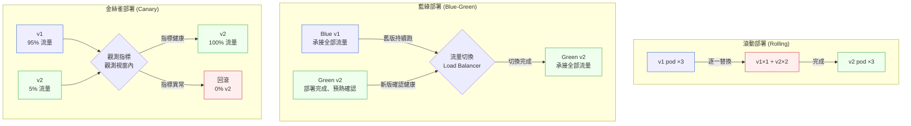

# 第 23 章｜藍綠與金絲雀部署
## ⸺ 流量切換不只是技術,更是對「什麼時候能確定沒問題」的判斷

> **前置閱讀**:[第 22 章｜Feature Flag 與漸進式發布](./ch-22-feature-flags.md)
> **下游章節**:[第 24 章｜回滾與前向修復決策](./ch-24-rollback.md)

---

## 23.1 共感現場:那個「只是重新部署」的星期五下午

你可能也遇過這種感覺。

我帶過一個很有經驗的工程師,就叫他小傑吧。他在一家做企業應用系統的 SaaS 公司 Kronway 工作,負責一套支付對帳模組。那天是星期五下午兩點,小傑要上一個改了核心計算邏輯的版本——改動不大,主要是修正一個財季末的四捨五入精度問題,讓尾數處理更符合 IEEE 754 的 round-half-even 語意。

他在 staging 上測了三個小時,數字全部正確。PM 很滿意,說「這版本等很久了」。小傑按下部署按鈕,新版本上線了。

接下來十五分鐘風平浪靜。他喝了一杯咖啡,打算等觀察期過了就下班。

然後,監控告警跳出來了。

對帳任務的失敗率從 0.3% 跳到了 14%。

小傑立刻把流量切回舊版本。告警在兩分鐘內消失了。事後查才發現,那個精度修正動到了一個舊版資料庫欄位的格式假設——具體來說,是 `amount_precision` 欄位儲存的小數點後位數,舊版用 `INT` 存 2 或 4,新版的計算邏輯預設它一定是 4。staging 的測試資料剛好都是新帳戶,全部是 4 位精度,所以完全沒測到那個邊界案例。生產環境裡卻有一批 2019 年以前建立的老帳戶,精度是 2 位——批次對帳跑到這批帳號時,程式讀到 `2` 之後做了一個超出範圍的轉型,對帳任務就靜默失敗了。

這個故事最讓人印象深刻的部分不是「出了 bug」——那是可以接受的,沒有人的 staging 環境能完美模擬生產的每一個角落。讓人印象深刻的是:小傑能在**兩分鐘內**把流量切回來。那兩分鐘,不是因為他反應特別快,而是因為他事先把藍綠部署(Blue-Green Deployment)架好了,舊版服務從頭到尾都在那裡,只是沒有在承接流量。把流量切換器撥回去,它就立刻復活了。

如果沒有那個架構,小傑大概會在那個星期五下午,花好幾個小時搶救一個對帳系統——手忙腳亂地在生產環境上 hotfix,或者花更久的時間找到「到底是哪個版本出問題」。

那個「兩分鐘」和「幾個小時」的差距,值得我們好好想清楚它是怎麼來的。

---

## 23.2 真正的問題:「部署」和「發布」是兩件事

這背後真正的問題是什麼呢?我們把小傑的故事慢慢拆開來看,你會發現它在說一件更根本的事。

傳統的思維裡,「部署」和「發布」幾乎是同一件事:把新程式碼放上去,使用者就用上新版本了。這很直覺,但它的問題在於,這兩件事被**強制綁在一起**——你要在使用者的流量還在線的同時,把舊版換成新版。如果新版有問題,那個「換」的動作已經讓使用者先感受到了,而你才剛剛開始發現問題。

也就是說,在傳統部署下,**確認沒問題這件事,只能在流量全進來之後才做**。這是一個不對稱的賭局:

- 好的情況:新版沒問題,大家繼續,什麼事都沒發生。
- 壞的情況:新版有問題,你在生產環境上有一段時間的壞狀態——時間長短,取決於你多快發現、多快能有辦法回頭。

小傑之所以那個星期五能在兩分鐘內脫身,其實是被一年多前的另一次事故教出來的。那是他第一次部署對帳模組,用的就是傳統的滾動替換:新版上線了,舊版的 pod 被一個個關掉,等他發現一批對帳任務開始大量失敗時,舊版已經沒了——他沒有一個現成的「撤退路線」。那次他花了將近四個小時,在壓力下一邊 hotfix 一邊祈禱資料沒有損壞太多。

正因為那次的教訓,他之後重新設計了部署流程,把「部署」和「發布」拆開來:

- **部署**(Deploy):把新版本的服務跑起來,但流量還不進去。這一步可以慢慢做、反覆確認,出問題直接把新版本移除就好,使用者毫無感知。
- **發布**(Release):把流量導入新版本。這一步很快,但因為前一步已經確認過了,你帶著信心做——而且萬一發現問題,舊版本就在旁邊,切回去幾乎是即時的。

藍綠部署(Blue-Green Deployment)和金絲雀部署(Canary Deployment)解決的,就是這個「賭局的不對稱性」。它們的核心概念不是讓部署更快,而是**讓你在決定「流量進不進去」之前,有機會先確認新版本是健康的**。

這就是這兩個策略的根本價值:不是讓你永遠不出問題,而是讓你「出了問題之後的代價」從幾小時壓縮到幾分鐘。

順著這個道理,接下來要回答的問題就自然浮出來了:這兩個策略應該怎麼選?它們各自適合什麼情況?又分別有哪些我們需要提前想清楚的地方?

---

## 23.3 一起做判斷:藍綠、金絲雀、還是直接部署?

這兩個策略並不是一個比另一個好,而是在不同情境下各有用處。我們來一起把這個判斷想清楚。

不過在比較藍綠和金絲雀之前,得先把基準點釐清:如果什麼都不做,直接用最原始的滾動部署(Rolling Deployment),會遇到什麼問題?正是這些問題,才讓藍綠或金絲雀變得有必要——所以下面的比較會把滾動部署也放進來一起看,它是理解「為什麼需要這兩個策略」的參照點。

### 三種策略的本質差異

先用一張圖把三者放在一起看:



三個策略背後代表的判斷思路是不同的:

- **滾動部署(Rolling)**:接受「新舊版本短暫共存」,用來降低停機時間,但沒有乾淨的切換點——某個時間窗口,使用者可能打到 v1 也可能打到 v2。如果新版有問題,回滾需要把已替換的 pod 再一一換回去,時間不短。
- **藍綠部署(Blue-Green)**:新版部署好之後,一次性把全部流量切過去。回滾就是把流量切回藍色——幾秒鐘的事。代價是需要維持兩套完整環境,資源成本是其他策略的兩倍。
- **金絲雀部署(Canary)**:把新版本給一小部分使用者先用,觀測指標正常之後才逐步擴大比例。適合改動影響面廣、不確定性高的情況——用生產環境的真實流量做最後一道確認,但只讓少數使用者暴露在風險裡。

### 滾動部署在哪裡會讓你措手不及

滾動部署看起來最省事——不需要雙份資源,也不需要額外的流量切換基礎設施。但有兩個情境下它會讓你很痛苦:

第一,**當你的新版本做了不向後兼容的 API 變更時**。滾動過程中,服務 A 可能在同一時間點既跑著 v1 也跑著 v2。如果它們的 API 格式不兼容,下游服務打進來的請求就會隨機成功或失敗,排查起來非常困難。

第二,**當你需要快速確定性的回滾時**。滾動回滾需要把 pod 一個個換回來,每個 pod 都有 health check 等待時間。如果你的系統有 20 個 pod、每個替換要 30 秒,那滾動回滾可能要花上 10 分鐘——這段時間裡,問題還在繼續發生。

這就是為什麼當業務對回滾速度有要求時,藍綠部署是更穩健的選擇。

那藍綠部署是不是就把這些問題都解決了?在「切換速度」和「回滾確定性」這兩點上,答案是肯定的——秒級切回,不用一個個等 pod 換回來。但藍綠部署自己也帶著一個最大的複雜度,而且它不在應用層,是藏在資料庫裡。

### 資料庫狀態:藍綠部署的最大複雜度

藍綠部署的架設看起來不難,但有一個地方常常被忽略:**資料庫**。之所以容易被忽略,是因為開發者的注意力天然會放在應用層——把兩套服務跑起來、確認流量切換器能正常運作,這件事直觀又容易驗證。但資料庫通常只有一套,沒辦法像應用層那樣跑兩份,這個「共用一份」的事實,才是後面所有麻煩的根源:當你的新版本(Green)做了資料庫 schema 遷移時,那個 schema 是新舊版本共享的——切換流量的那一刻,如果舊版(Blue)還有連線在跑,它可能會因為遇到新 schema 的欄位而出錯。

處理這個問題的手法叫做**兩階段遷移(Expand-Contract Migration)**:

```
階段一(與 Green 版本一起部署):Expand
  - 新增新欄位,舊欄位保留不動
  - 新版程式碼讀新欄位,舊版程式碼讀舊欄位
  - 新舊版本可以安全共存
  → 流量切換到 Green

階段二(等 Blue 確認不再使用後才做):Contract
  - 清除舊欄位
  - 此時只剩 Green 在跑,沒有向後兼容的壓力
```

Kronway 的 `amount_precision` 問題,就是因為沒有做這個兩階段——小傑直接修改了讀取欄位的邏輯,但沒有考慮到舊版服務在切換期間還可能讀到那個欄位。第 25 章「資料庫遷移與零停機變更」會對這個手法有更詳細的討論,這裡先把它和部署策略的關係建立清楚。

### 怎麼選:一張決策表

有了上面的背景,做選擇的時候可以問自己這幾個問題:

| 考量維度 | 傾向藍綠部署 | 傾向金絲雀部署 |
|---------|------------|--------------|
| **資源成本** | 能接受暫時維持兩倍運算資源 | 資源吃緊,只想多跑少數幾個額外 pod |
| **改動風險與不確定性** | 改動相對可控,想要一個「乾淨的切換點」 | 改動影響面廣,想用真實小樣本先試水溫 |
| **DB schema 變更** | schema 已向後兼容,或已做好兩階段遷移 | 無 schema 變更,或新舊版本可共存讀寫 |
| **回滾速度需求** | 需要秒級切回,業務損失容忍度極低 | 接受「指標不對就自動停止推進」的節奏 |
| **使用者體驗差異** | 能接受所有使用者同時換版本 | 希望先讓特定族群(如 Beta 客戶)試用 |
| **API 兼容性** | 新舊版本 API 有破壞性變更 | 新舊版本可以在同一時間對外同時存在 |

一個簡單的口訣是:**藍綠部署解決「部署的速度與確定性」,金絲雀部署解決「發布的風險分散」**。如果你的服務同時需要兩者,可以把它們疊在一起用——整體做金絲雀(逐步導流),但每個流量比例的目標環境都是一套藍綠(保有乾淨的切回點)。

這樣一來,你既有「先試少數人」的謹慎,也有「出問題秒級切回」的保障。

### 金絲雀的觀測指標:看哪幾個才夠?

確定了用金絲雀之後,下一個問題就來了:看什麼指標、看多久才能說沒問題?這才是金絲雀部署真正的核心判斷。

一個好用的框架是把指標分成三層:

| 層次 | 類型 | 典型例子 | 為什麼重要 |
|------|------|---------|-----------|
| **第一層:快訊號** | 錯誤率、延遲 | HTTP 5xx error rate、p99 latency | 出事後幾秒內就能看到,適合設為自動回滾的第一道防線 |
| **第二層:慢訊號** | 業務成功率 | 對帳成功率、支付完成率、訂單確認率 | 有些問題要等業務流程完整跑完才看得見——就像 Kronway 的 14% 失敗率 |
| **第三層:資源訊號** | 記憶體、連線 | JVM heap 成長趨勢、DB connection pool 使用率 | 有些問題要跑幾分鐘甚至幾十分鐘才會顯現 |

金絲雀觀測視窗的時間長短,取決於你的業務**最慢的那個指標**多久可以穩定。對帳系統這類有批次處理的服務,可能需要等一個完整的批次週期才能確認業務指標正常。如果你只看 5xx 就說沒問題,就可能漏掉慢訊號——Kronway 那次的對帳失敗率,是在批次任務啟動之後才爆發的,快訊號在那 15 分鐘裡幾乎都是正常的。

### 自動回滾判準:何時讓機器決定?

金絲雀部署通常會搭配自動回滾機制(Auto Rollback),讓你不需要半夜盯著螢幕。但自動回滾判準需要謹慎設計:太靈敏會誤觸(正常的流量抖動就觸發回滾),太鈍感會讓問題發酵太久。

用數字來看會更具體。假設 Kronway 對帳服務的正常 error_rate 是 0.3%,新版本剛上線時因為連線池還在暖機,短暫跳到 0.5%–0.8% 是常見的正常抖動。如果閾值設在「> 0.5%」,幾乎每次部署都會被暖機期的抖動誤觸,自動回滾——這就是太靈敏;但如果為了避免誤觸,把閾值放寬到「> 2%」,那真正的問題(比如 Kronway 那次跳到 14%)可能要等好幾分鐘、影響一批使用者之後才會被抓到,這就是太鈍感。閾值該落在兩者中間,而且要搭配下面會談到的 `hold_off` 暖機保護期一起看,才不會把「正常暖機」誤判成「新版本壞了」。

一個穩健的做法是設定兩道閾值,分別對應快訊號與慢訊號:

```yaml
# 自動回滾判準範例(偽設定檔)
auto_rollback:
  triggers:
    # 快訊號:立即反應
    - metric: error_rate_5xx
      threshold: "> 1.0%"       # 相對於 baseline 的絕對值
      window: 3m                # 需要持續超過才觸發,避免瞬間抖動

    # 慢訊號:等業務跑起來再看
    - metric: reconciliation_success_rate
      threshold: "< 98.5%"      # baseline 是 99.2%
      window: 10m               # 給夠時間讓批次任務完成

  hold_off: 5m                  # 版本剛上時給一段穩定期
  action: rollback_to_stable
```

`hold_off` 這個設定很容易被忽略。服務剛啟動的前幾分鐘,JVM 還在 warm-up、連線池還沒穩定,這段時間的指標可能天然偏高。如果自動回滾沒有 `hold_off`,每次上新版都可能因為 warm-up 期被誤觸——你看到的「回滾」其實是正常的啟動波動。

### 推進判準:金絲雀要怎麼「畢業」?

設好了回滾判準,還有一件同樣重要的事:**推進判準**——金絲雀觀測通過之後,自動擴大流量比例的條件。

如果沒有推進判準,金絲雀就沒有出口。你可能會看到一套系統同時跑著新舊兩個版本好幾天,沒有人去確認「現在可以全量了嗎」——維運複雜度悄悄加倍,但因為沒有出事,也沒有人去處理它。

推進判準的設計和回滾判準是鏡像的:「在觀測視窗 T 內,所有指標都在健康閾值內,自動推進到下一個比例」。通常會設計成階梯式:5% → 20% → 50% → 100%,每個階梯都有對應的觀測視窗,逐步確認問題不會在更大流量下才現形。

---

## 23.4 容易絆倒的地方

下面幾個地雷,在實際落地這兩個策略的時候很常見。認識它們,下次遇到就知道怎麼應對。

### 絆倒處一:藍綠部署做到一半,資料庫被遺忘了

把兩套應用服務架起來並不難,但如果新版改了資料庫 schema,就會掉進一個陷阱:新版服務對應的新 schema 和舊版服務是不兼容的。切換流量的那一刻,如果舊版還有連線在跑(例如有長事務沒有優雅結束),它可能因為遇到新欄位而出錯——或者更糟,寫入不完整的資料。

這很常發生在「開發者只測試了快樂路徑」的情況下:本機測試時,切換就是切換,沒有殘留連線;但生產環境有長連線、有正在跑的批次任務、有沒有 graceful shutdown 的舊版 pod。

> 修正方向:資料庫遷移要用「兩階段 Expand-Contract 手法」,如前面 §23.3 討論的。**先做向後兼容的 schema 擴展**(新欄位加上去,舊欄位保留),讓新舊版都能正常讀寫;等流量完全切到新版、舊版確定退場後,才做第二個 migration 清掉舊欄位。這個順序不能顛倒。

具體到 Kronway 的情況:

```
正確的兩階段做法:

Stage 1 — 與 v2.3.1 一起部署:
  ALTER TABLE transactions ADD COLUMN amount_precision_v2 SMALLINT;
  UPDATE transactions SET amount_precision_v2 = amount_precision;
  -- v2.3.1 讀 amount_precision_v2,v2.2.x 讀 amount_precision
  -- 兩版共存時不衝突

Stage 2 — 確認 v2.2.x 完全退場後:
  ALTER TABLE transactions DROP COLUMN amount_precision;
  ALTER TABLE transactions RENAME COLUMN amount_precision_v2 TO amount_precision;
```

如果一開始就把這兩步合成一個 migration 直接上,切換瞬間就是地雷。

### 絆倒處二:金絲雀的流量比例太低,等不到問題

把 1% 的流量給金絲雀版本,聽起來很謹慎,但如果問題只在特定使用者行為下觸發——例如使用了某個冷門的付款方式,或者帳號是在 2019 年以前建立的——那 1% 的流量可能跑幾個小時都碰不到那個路徑。等你把比例擴到 20%,問題才浮出來,而你以為 1% 的觀測已經驗證沒問題了。

這種「樣本偏差」的問題比技術問題更難察覺,因為指標上什麼都是綠的。

> 修正方向:流量比例要根據**觸發問題所需的最低樣本量**來設定。如果業務有長尾行為,5–10% 通常是一個比 1% 好很多的起點。更有效的做法是結合**基於使用者屬性的路由**,而非純隨機——例如把 Beta 客戶、或者特定行為的老用戶固定路由到金絲雀版本。Kronway 的案例說明:如果一開始就把「帳號建立時間 < 2022」的老用戶優先路由到金絲雀,老格式的邊界問題很可能在 5% 的觀測階段就現形,而不是等到全量之後。

屬性路由的實作方式因基礎設施而異,但大多數服務網格(Istio、Linkerd)和 API Gateway(Kong、AWS API Gateway)都支援基於 Header 或 Cookie 的路由規則。

### 絆倒處三:金絲雀沒有推進判準,永遠不「畢業」

這個地雷比前兩個更安靜,因為它不會造成立即的錯誤——它只是悄悄增加你的維運複雜度。

金絲雀跑著跑著,指標正常,但沒有人定義什麼條件算是「通過了」。結果是:一套系統同時跑著新舊兩個版本好幾天,on-call 工程師每次收到告警都要先想「現在是哪個版本在承接流量」。更麻煩的是,如果這期間又要上另一個版本,你就要先處理金絲雀尾,才能進行下一輪部署——兩個未完成的金絲雀同時存在是很難管的。

> 修正方向:在金絲雀部署計畫裡,除了設定回滾判準,也要設定明確的推進判準:「如果在觀測視窗 T 內,所有指標都在健康閾值內,自動推進到下一個比例(或全量)」。金絲雀要有出口,不能是一個沒有終點的狀態。同時,對觀測的**最長等待時間**也要有上限——如果超過 X 分鐘還沒有自動推進,要觸發人工確認流程,而不是讓金絲雀一直掛著。

### 絆倒處四:切換完成就以為「發布結束了」

切換到新版本是發布的中間點,不是終點。有些問題是延遲浮現的——記憶體洩漏可能要跑幾個小時才會讓 heap 觸頂;快取失效場景可能要等到 TTL 到期才會出現;某些定時任務可能要等到下一個觸發點才會運行。

比較典型的情況是「全量切換後一個小時,某個定時報表任務跑起來,發現資料格式和舊版不同步」。這個時候舊版如果已經被回收了,你又面臨一個「要回滾但沒有路走」的局面。

> 修正方向:全量切換後,保持至少一個**完整業務週期**的觀測。對帳系統就等一個完整的對帳批次跑完;訂閱計費就等一個完整的計費跑批完成;有每小時定時任務的服務就至少觀測兩個週期以上。在這段觀測期內,舊版不要急著回收——保留它,把它當作你的安全網。等觀測期安靜過去,再優雅地退場。

---

## 23.5 帶得走的工具 ⸺ 一頁式「部署策略規劃卡」

把上面所有的判斷整合成一張可以帶進部署前會議的卡片,比臨時靠腦袋想更可靠。下面是空白模板:

```text
部署策略規劃卡 ⸺ {服務名稱} v{版本號}

一、策略選擇
  部署策略: [ ] 藍綠  [ ] 金絲雀  [ ] 藍綠+金絲雀疊用  [ ] 滾動
  選擇理由: {一句話說明為什麼選這個,涵蓋:資源限制 / 改動風險 / 回滾需求}

二、部署前確認
  DB 遷移兼容性: [ ] 向後兼容  [ ] 需要兩階段遷移  [ ] 無 DB 變更
  新舊版本共存期間的讀寫行為: {新舊版讀寫同一份資料時有沒有衝突}
  API 兼容性: [ ] 向後兼容  [ ] 有破壞性變更(說明:__)

三、金絲雀觀測設定(若適用)
  初始流量比例: {N}%
  目標使用者群: [ ] 隨機  [ ] 指定屬性 → {屬性條件及理由}
  觀測視窗: {時間長度,根據最慢的業務指標決定}

  快訊號(秒級):
    - 指標: {error_rate / latency_p99}  閾值: {數字}  視窗: {時間}
  慢訊號(分鐘級):
    - 指標: {業務成功率}  閾值: {數字}  視窗: {時間}

四、推進判準
  下一個比例: {N%}  觸發條件: {所有指標在視窗內健康}
  全量條件: {最終指標要求}
  舊版保留期限: 全量後保留 {時間} 再回收

五、回滾判準
  自動回滾觸發: {指標 + 閾值 + 持續時間}
  手動回滾聯絡人: {On-call 負責人}
  回滾後確認步驟: {驗證舊版恢復正常的方式}

六、溝通計畫
  通知對象: {PM / 客戶成功 / 關鍵客戶}
  觀測期間狀態更新頻率: 每 {N} 分鐘在 #{slack-channel} 更新
```

這張卡裡有兩個欄位最容易被跳過:「**目標使用者群**」和「**觀測視窗**」。它們逼你真的去想:誰最可能觸發問題?你的業務最慢的那個指標要多久才能穩定?這兩個問題想清楚了,金絲雀才有機會真正抓到問題,而不是讓問題在觀測期的盲區裡逃過去。

### 23.5.1 範例:Kronway 支付對帳模組 v2.3.1

讓我們回到小傑那次部署。在他按下部署按鈕之前,如果他手上有這張卡並且填好了,那個事前沒發現的老格式邊界案例,很可能在「DB 遷移兼容性」那一欄就被抓出來——因為那個欄位逼你去思考「新版和舊版共存時,資料格式有沒有衝突」。

```text
部署策略規劃卡 ⸺ Kronway 支付對帳模組 v2.3.1

一、策略選擇
  部署策略: [x] 藍綠+金絲雀疊用
  選擇理由: 對帳模組是財務核心,需要乾淨切回點(藍綠);
             新版改了精度計算邏輯,老帳戶格式假設未驗證,風險未知(金絲雀先試)
  <!-- 策略選擇理由:說清楚是因為風險未知才選金絲雀,
       讓 reviewer 和自己都知道這個選擇背後的假設是什麼。 -->

二、部署前確認
  DB 遷移兼容性: [x] 需要兩階段遷移
  說明: v2.3.1 修改了 amount_precision 欄位的讀取邏輯
        Stage 1:新增 amount_precision_v2,雙版本讀各自欄位,無衝突
        Stage 2(v2.3.2 退役後):DROP 舊欄位,完成清理
  <!-- 兼容性說明:這一欄逼你在部署前想清楚「新版和舊版能不能共存」——
       Kronway 真正的失誤就藏在這裡。 -->
  新舊版本共存期間: 新版讀 amount_precision_v2,舊版讀 amount_precision,無衝突

三、金絲雀觀測設定
  初始流量比例: 5%
  目標使用者群: [x] 指定屬性 → 帳號建立時間 < 2022-01(老帳戶,最可能有舊精度格式)
  觀測視窗: 20 分鐘(一個完整對帳批次週期 12 分鐘 + 緩衝 8 分鐘)

  快訊號:
    - 指標: http_5xx_rate  閾值: > 0.8%  視窗: 3m
    - 指標: api_latency_p99  閾值: > 1200ms (baseline 800ms)  視窗: 3m
  慢訊號:
    - 指標: reconciliation_success_rate  閾值: < 98.5%  視窗: 15m

四、推進判準
  下一個比例: 20%  觸發條件: 5% 金絲雀視窗內所有指標健康
  全量條件: 20% 觀測通過,reconciliation_success_rate 穩定 > 99.0%
  最長等待: 若 45 分鐘內未自動推進,人工確認後決定推進或停止
  舊版保留期限: 全量後保留 4 小時(含完整批次週期觀察)再回收

五、回滾判準
  自動回滾觸發: reconciliation_success_rate < 98.5% 持續 15m,
                 或 http_5xx_rate > 0.8% 持續 3m
  手動回滾聯絡人: On-call @wei-lun-chen,備援 @sarah-huang
  回滾後確認: 切回 Blue 後,手動跑一批對帳確認數字恢復正常

六、溝通計畫
  通知對象: 財務部門對帳負責人 Tina、客戶成功 David
  觀測期更新: 每 10 分鐘在 #deploy-status 更新一次狀態
```

填這張卡最花時間的不是格式本身,而是第二欄和第三欄逼你做的思考。把老帳戶優先路由到金絲雀,讓問題在 5% 的小範圍就現形,而不是讓它全量爆開——這是一個在事前五分鐘想清楚的決定,可以省下事後幾個小時的搶救。

這張卡不能保證你永遠不出問題,但它讓你的判斷有跡可循,讓你的 reviewer 和接班人也看得懂你在守護什麼。

---

## 23.6 本章回顧

讀完這一章,你應該已經能:

- [ ] 說清楚「部署」和「發布」的差別,以及為什麼把它們拆開對回滾速度有決定性的影響
- [ ] 根據資源成本、改動風險、DB 兼容性、API 兼容性等維度,判斷該用藍綠還是金絲雀
- [ ] 理解兩階段 DB 遷移(Expand-Contract)的必要性,以及在藍綠部署中的正確順序
- [ ] 設計三層觀測指標(快訊號 / 慢訊號 / 資源訊號),不讓慢訊號成為盲區
- [ ] 設定自動回滾和推進判準,讓金絲雀有明確的出口而不是永遠掛著
- [ ] 在部署前填好一張規劃卡,讓判斷有跡可循而不是靠感覺

如果只能從這一章帶走一件事,我會建議——**在部署前問自己「目標使用者群要不要定向路由」這個問題**。純隨機的金絲雀很容易讓問題藏在樣本盲區裡,把最可能觸發問題的使用者群優先路由過來,你才是真的在用小比例做驗證,而不是在碰運氣。

下一章,我們會接著談一個和本章密不可分的決策:**當你已經發現問題了,要回滾,還是要前向修復?** 這個選擇背後的判斷框架,會讓你在線上事故的壓力下,不只是靠直覺反應。

---

## Cross-References

- **上一章**:[第 22 章｜Feature Flag 與漸進式發布](./ch-22-feature-flags.md) ⸺ Feature Flag 是另一種「把部署和發布拆開」的工具,兩者互補
- **下一章**:[第 24 章｜回滾與前向修復決策](./ch-24-rollback.md) ⸺ 金絲雀觸發回滾之後的下一步判斷
- **強連結**:[第 25 章｜資料庫遷移與零停機變更](./ch-25-db-migration.md) ⸺ 藍綠部署中 DB 兩階段遷移(Expand-Contract)的詳細手法
- **強連結**:[第 26 章｜可觀測性落地](../part-06-operations/ch-26-observability.md) ⸺ 本章的三層觀測指標需要可觀測性基礎設施支撐
- **跨書連結**:[SA/SD Playbook Ch 32｜部署架構模式](https://github.com/EddyKuo/sa-sd-playbook) ⸺ 藍綠/金絲雀的架構層設計決策
