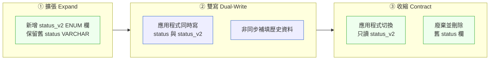

# 第 24 章｜資料庫遷移與零停機變更
## ⸺ Schema 不能回頭,但你可以讓它走得更穩

> **前置閱讀**:[第 23 章｜回滾與前向修復決策](./ch-23-rollback.md)
> **下游章節**:[第 25 章｜可觀測性落地](../part-06-operations/ch-25-observability.md)

## 24.1 共感現場:那個「看起來很小的欄位異動」

你可能也遇過這樣的時刻。

任務說明只有一行:「把 `users.phone` 從 `VARCHAR(20)` 改成 `VARCHAR(30)`」。改個長度而已,看起來比加一個 API 還簡單。工程師小裴按照常規做法,寫了一行 `ALTER TABLE` 放進部署 script,系統在週末的低峰時段發布。

然後事情發生了。

那個 `ALTER TABLE` 在 PostgreSQL 14 上需要對整張 `users` 表加 Access Exclusive Lock。`users` 表有 380 萬筆資料,鎖住了大約 40 秒。那 40 秒裡,所有依賴這張表的查詢都在等待,連線池被塞滿,最後 HTTP 閘道回傳了一整排 503。客服電話在凌晨兩點開始響。

小裴事後說:「我真的沒想到這樣也會出事,就是改個長度。」

這句話說得很真實。**資料庫遷移的危險,不在於你改了多大的東西,而在於你改的那件小事,在生產環境上的成本,完全不是開發機上看到的那樣。** 沒有人好好教過小裴這件事——不是他的問題,是這個領域從來不在教科書裡。

## 24.2 真正的問題:Schema 的不可逆性與部署的原子性之間的張力

我們把小裴的遭遇慢慢拆開來看。

表面上,問題是「ALTER TABLE 加了鎖」。但如果只學到「某些操作會鎖表」,你只是在收集一份禁忌清單,下次換一個新的資料庫版本或一個新的操作,這份清單又失效了。真正理解這件事,要看它背後的兩個張力。

**第一個張力:Schema 的不可逆性。**

程式碼發布出了問題,可以快速回滾——把上一個版本推回去就好。但 Schema 不一樣。如果你新增了一欄、刪了一欄、或改了一個欄的型別,資料已經在裡面了。回滾應用程式不會讓 Schema 跟著回去,而強行回滾 Schema 可能讓剛才寫進去的資料無家可歸,或者破壞資料完整性。也就是說,**資料庫遷移一旦走出去,它比程式碼的任何東西都更難反悔。**

**第二個張力:部署的原子性假設。**

我們習慣把「部署」想成一個時間點:T0 之前是舊版,T0 之後是新版。但真實的部署不是這樣的——它是一個**時間窗口**,在這個窗口裡,新舊版本的應用程式同時在跑,新舊 Schema 可能同時存在。

小裴那次出事,還有第二個問題藏在裡面:他在同一次部署裡,先跑 Schema 遷移,再換應用程式版本。這代表有一段時間,舊版的應用程式拿著新版的 Schema 在服務——這不一定會炸,但一旦新舊 Schema 語義不兼容,就會悄悄地讓資料出錯,比當機還更難察覺。

順著這兩個張力,我們就能看見真正的問題:**資料庫遷移需要被當成一個「和部署流水線解耦的、有方向性的、不可逆的操作」來對待,而不是程式碼部署的附帶步驟。**

這就帶出了這一章的核心判斷:你不能用對待程式碼的方式對待 Schema,但你可以用「讓每一步走得向後兼容」來讓整件事變得可控。

## 24.3 一起做判斷:擴張收縮法與雙寫模式

那麼,怎麼讓 Schema 的變更走得穩?

資料庫遷移界最廣為應用的心法,叫做**擴張收縮法(Expand–Contract Pattern)**,有時候也叫 Parallel Change 或 Blue-Green Database Migration。它的核心想法只有一句話:**永遠把一次「破壞性的 Schema 變更」拆成三個向後兼容的小步驟。**

### 24.3.1 擴張收縮法的三個階段

讓我們用小裴的案例換一個場景來說明。假設你要把 `orders` 表的 `status` 欄從 `VARCHAR` 改成 `ENUM`——這是一個典型的「改了之後,舊程式碼就不認識了」的破壞性變更。



**第一步:擴張(Expand)**。只做加法,不碰舊東西。新增 `status_v2` ENUM 欄位,允許 NULL(這樣舊程式碼不需要填它)。Schema 遷移只做這一件事,它向後兼容,舊版應用程式看不見這個欄位,完全不受影響。

**第二步:雙寫(Dual-Write)**。新版應用程式上線後,同時寫 `status`(舊欄)和 `status_v2`(新欄)。同時,跑一個批次作業,把歷史資料從舊欄複製填寫到新欄。這個階段結束後,你可以確認 `status_v2` 裡的資料是完整的。

**第三步:收縮(Contract)**。確認資料完整之後,應用程式切換成只讀 `status_v2`。觀察一段時間沒有問題,再跑一個遷移把舊 `status` 欄刪掉。

三個步驟,三次獨立部署,每一步都向後兼容,每一步都可以觀察。

### 24.3.2 向後兼容 Schema 的判斷準則

擴張收縮法的靈魂,在於每一步都要是「向後兼容(Backward-Compatible)」的。以下是判斷一個 Schema 操作是否向後兼容的快速準則:

| 操作 | 是否向後兼容 | 說明 |
|------|:---:|---|
| 新增欄位(允許 NULL 或有預設值) | ✅ | 舊程式不認識,但也不會出錯 |
| 新增欄位(NOT NULL 且無預設值) | ❌ | 舊程式插入時缺值,直接報錯 |
| 新增索引(CONCURRENT) | ✅ | PostgreSQL 17 支援 `CREATE INDEX CONCURRENTLY` |
| 刪除欄位 | ❌ | 舊程式若讀/寫該欄,立刻炸 |
| 欄位改名 | ❌ | 等於刪+加,舊程式認不得新名字 |
| 欄位型別收窄(如 VARCHAR→ENUM) | ❌ | 舊程式寫入不符合的值,報錯 |
| 欄位型別放寬(如 INT→BIGINT) | ✅ | 舊程式讀到更寬的值,通常無礙 |
| 新增表(不修改現有表) | ✅ | 舊程式不知道,不影響 |
| 新增 NOT NULL 約束 | ❌ | 若舊程式可能寫入 NULL,就會炸 |

這張表的用法很簡單:**每次要做 Schema 操作之前,先看一眼這張表。如果落在 ❌ 區,就代表這個操作需要拆成擴張收縮法的三個步驟,而不是一次直接做。**

### 24.3.3 雙寫的細節:三個你一定要注意的地方

雙寫聽起來直覺,但有幾個地方容易被忽略:

**一、讀的時候先讀哪個?** 切換期間,新資料進 `status_v2` 是對的,但讀的時候要讀哪個?一個可靠的做法是:讀的時候優先讀 `status_v2`(有值的話),`NULL` 才 fallback 讀舊欄。這個邏輯確保你在歷史資料補填完成前,不會讀到空的新欄。

**二、批次補填要做流量控制。** 把 380 萬筆歷史資料一次 `UPDATE` 是非常危險的,它會鎖表或產生大量的 MVCC 版本,拖垮效能。正確的做法是分批(例如每批 1000 筆),批次之間加 sleep,讓資料庫有喘息空間。

**三、補填完之後要驗證。** 切到只讀新欄之前,需要先驗證 `status_v2 IS NULL` 的資料筆數是 0(或者你可以接受的範圍)。可以跑一個查詢確認,也可以寫成一個遷移前置檢查,讓部署流水線在確認之前不繼續走。

了解了這些細節之後,自然會想問:實際動手時,最容易在哪個地方出狀況?下面我們來看看那些常見的絆腳石。

## 24.4 容易絆倒的地方

下面這些地雷,很多資深工程師也踩過。分享出來,不是要提醒你「要小心」,而是想讓你下次遇到時,心裡有個底。

---

**絆倒處一:以為「零停機」等於「隨便什麼時間發布都行」。**

零停機部署讓工程師有一種安全感,覺得遷移沒有時間窗口的壓力。但這個安全感有個邊界:雙寫階段的每一筆寫入,你同時要維護兩個欄位,資料庫的寫入負荷提高了。如果在高峰期做大批次的歷史資料補填,一樣會對效能造成壓力。

> **修正方向**:補填批次排在離峰時段,並設上限(例如每秒最多更新 500 筆)。零停機不是免死金牌,它只是讓你選擇何時走、如何走,而不是可以不管走的時機。

---

**絆倒處二:擴張階段把新欄位設成 NOT NULL。**

這是最常見的一個失誤。你想說:「反正我馬上就要填資料了,所以直接設 NOT NULL。」但在擴張階段,舊程式碼仍然在跑,它不認識這個新欄位,不會填值。一旦舊程式碼做了任何 INSERT,就會因為 NOT NULL 約束而失敗。

> **修正方向**:擴張階段的新欄位**一律允許 NULL**,或者設一個應用層可接受的預設值。NOT NULL 約束留到收縮階段,等舊程式碼完全下線、資料也補填完整之後,再補上約束。

---

**絆倒處三:「我先刪欄,再補欄」的直覺式重構。**

有時候工程師想重新命名一個欄位,直覺動作是:寫一個遷移刪掉舊欄,再加一個新欄。這個動作會在刪舊欄的那一刻,讓所有仍在讀舊欄的應用程式實例直接報錯——而且是靜悄悄的資料庫錯誤,不是 HTTP 500,更難被監控即時抓到。

> **修正方向**:欄位改名等於「刪舊欄 + 加新欄」,一定要走完整的擴張收縮三步驟,因為只有這樣,每一步才都是可觀察、可回頭的。步驟一加新欄,步驟二雙寫並補填,步驟三刪舊欄。多花一點時間,換來的是任何一步出錯都能安全停下來。

---

**絆倒處四:用一個大型遷移把多個不兼容操作打包。**

你可能會看到一個 migration 檔案裡同時做:加欄、刪欄、改名、加索引、改型別。這些操作各自都可能是破壞性的,打包在一起之後:遷移失敗時很難部分回滾、觀察問題的粒度消失了、也很難判斷是哪個步驟出了錯。

> **修正方向**:每個遷移檔只做一件事。如果一次 Schema 變更需要多個步驟,就拆成多個遷移檔,讓每個檔案是原子的、可單獨觀察的。稍微多一些檔案,換來的是之後排查問題時的清醒頭腦。

## 24.5 帶得走的工具 ⸺ 一頁式「零停機 DB 遷移計畫書」

在真實的工作環境裡,資料庫遷移計畫書的作用有兩個:讓自己在動手之前想清楚每一步,也讓 reviewer 和 DBA 一眼看到風險點在哪裡。下面是空白模板,可以直接貼進 PR 描述或 Confluence 頁面:

```text
零停機 DB 遷移計畫書 ── {功能名稱 / 票號}

一、變更摘要
  - 目標表(s):
  - 變更描述:{一句話說清楚要改什麼}
  - 驅動原因:{為什麼需要這個變更}

二、向後兼容性評估
  - 此操作是否向後兼容?  □ 是  □ 否
  - 若否,拆成幾個步驟?: {N 步}

三、擴張收縮步驟(若需要)
  步驟 1 ── 擴張(Expand)
    - Schema 操作:
    - 應用程式改動:
    - 向後兼容確認:
  步驟 2 ── 雙寫(Dual-Write)
    - 雙寫邏輯:
    - 歷史資料補填方式:{批次大小 / 速率限制}
    - 補填完成驗證查詢:
  步驟 3 ── 收縮(Contract)
    - 切換時機確認條件:
    - Schema 清理操作:

四、風險與回滾
  - 最壞情況:{若此步驟出錯,會怎樣}
  - 回滾方式:{可否回滾 / 如何回滾}
  - 不可逆操作:{明確列出哪些步驟走出去就不能反悔}

五、觀察指標
  - 遷移期間需監控:{哪些 metric / log / 錯誤率}
  - 何時確認安全,可走下一步:
```

這張表的欄位不多,但每一欄都是在「不問會吃虧」的地方設卡。尤其是「不可逆操作」那欄:把不能反悔的步驟明確寫出來,讓執行前的確認變成一個有意識的動作,而不是「應該沒問題吧」的默認。

### 24.5.1 範例:FinPulse 的帳務狀態欄型別升級

FinPulse 是一家虛構的支付清算 SaaS 公司,服務著數十家中小型支付機構。他們的 `transactions` 表有一個 `status` 欄,原本是 `VARCHAR(20)`,記錄交易狀態(如 `pending`、`cleared`、`failed`)。隨著業務擴張,風控團隊需要新增更多細分狀態,並要求型別有明確的列舉約束,以避免應用程式寫入不合規的字串值。

這是我們在 §24.3 討論過的那種「不兼容型別變更」——直接改會炸,所以走擴張收縮三步。

```text
零停機 DB 遷移計畫書 ── CASE-FIN-024 / 帳務狀態欄 VARCHAR→ENUM 升級

一、變更摘要
  - 目標表(s): transactions
  - 變更描述:將 status VARCHAR(20) 升級為 ENUM('pending','cleared',
                'failed','reversed','under_review','compliance_hold')
  <!-- 為什麼這欄:用一句話說清楚,讓 reviewer 不需要去翻背景票;
       型別收窄是破壞性操作,越早讓人看見,越容易在計畫階段提問。 -->
  - 驅動原因:風控需要新增 under_review / compliance_hold 兩個狀態,
              並防止應用程式寫入任意字串

二、向後兼容性評估
  - 此操作是否向後兼容?  □ 是  ☑ 否
  - 若否,拆成幾個步驟?: 3 步(擴張→雙寫→收縮)

三、擴張收縮步驟

  步驟 1 ── 擴張(Expand)
    - Schema 操作:
        CREATE TYPE tx_status AS ENUM(
          'pending','cleared','failed',
          'reversed','under_review','compliance_hold'
        );
        ALTER TABLE transactions ADD COLUMN status_v2 tx_status NULL;
    <!-- 為什麼這欄:新欄必須允許 NULL;舊版應用程式做 INSERT 時不填這欄,
         NOT NULL 會讓所有舊版插入立刻報錯。NULL 是向後兼容的護欄。 -->
    - 應用程式改動:無(舊版程式碼不需要改)
    - 向後兼容確認:舊版應用程式可繼續讀寫 status,不感知 status_v2

  步驟 2 ── 雙寫(Dual-Write)
    - 雙寫邏輯:
        新版應用程式上線後,INSERT/UPDATE 同時寫
        status(VARCHAR) 與 status_v2(ENUM)
        讀取時優先取 status_v2,NULL 則 fallback 到 status
    - 歷史資料補填方式:
        每批 1,000 筆;批次間 sleep 200ms;
        離峰時段執行(00:00–05:00 UTC)
        UPDATE transactions
          SET status_v2 = status::tx_status
        WHERE status_v2 IS NULL
          AND id > {cursor} ORDER BY id LIMIT 1000;
    <!-- 為什麼這欄:380 萬筆一次 UPDATE 會產生大量 WAL,
         拖垮複本同步並鎖定熱行;分批+限速讓資料庫有喘息空間。 -->
    - 補填完成驗證查詢:
        SELECT COUNT(*) FROM transactions WHERE status_v2 IS NULL;
        -- 確認為 0 才進行步驟 3

  步驟 3 ── 收縮(Contract)
    - 切換時機確認條件:
        補填驗證查詢回傳 0;雙寫觀察 48 小時無錯誤告警
    - Schema 清理操作:
        ALTER TABLE transactions DROP COLUMN status;
        -- 注意:此操作不可逆

四、風險與回滾
  - 最壞情況:步驟 1 後發現 ENUM 缺漏某個狀態值,舊 status 仍在,
              可直接 DROP COLUMN status_v2 回退,零損失
  - 回滾方式:步驟 1 可回滾;步驟 2 可中途停止雙寫、保留 status 欄;
              步驟 3(DROP 舊欄)走出去後無法回滾
  <!-- 為什麼這欄:明確寫出不可逆的那一步,讓執行者在按下去之前做一次
       有意識的確認,而不是在流水線裡默默跑過去。 -->
  - 不可逆操作:步驟 3 的 ALTER TABLE transactions DROP COLUMN status

五、觀察指標
  - 遷移期間需監控:
      transactions 表的查詢延遲 p99、
      applications 的 DB 錯誤率、
      replication lag(若有讀副本)
  - 何時確認安全,可走下一步:
      步驟 2:補填驗證查詢為 0 且錯誤率維持基線 48 小時
      步驟 3:執行後觀察 24 小時,確認無 "column does not exist" 類錯誤
```

FinPulse 的工程師按照這三個步驟,在四週內分三次部署完成了型別升級,全程沒有一次停機,也沒有一次生產錯誤。最後那個「DROP COLUMN status」的動作,在第三週的深夜由工程師親自確認計畫書上的「不可逆操作」欄之後,才按下執行。那個「親自確認不可逆操作」的動作,雖然只多花了三十秒,但讓每個人都知道自己在做什麼、為什麼現在可以做了。

## 24.6 本章回顧

讀完這一章,你應該已經能:

- [ ] 說清楚為什麼 Schema 遷移比程式碼回滾更需要謹慎:不可逆性 + 部署窗口期的新舊並存
- [ ] 判斷一個 Schema 操作是否向後兼容,並知道不兼容時該怎麼拆步驟
- [ ] 用擴張收縮法(Expand–Contract)把一個破壞性的 Schema 變更拆成三個安全的小步驟
- [ ] 在雙寫階段正確處理讀的 fallback 邏輯與歷史資料批次補填
- [ ] 填出一份零停機 DB 遷移計畫書,特別把不可逆操作明確標出來

如果想先從一件事開始,我會建議 ⸺**在你下次的 DB 遷移 PR 裡,明確標注哪一個步驟是「走出去就不能回頭的」**,因為讓不可逆操作在按下之前被清楚看見,是整個遷移計畫裡成本最低、收益最大的一件事。很多時候,事後的「怎麼沒人提醒我」,其實只需要一行字就能提醒自己。

## Cross-References

- **前一章**:[第 23 章｜回滾與前向修復決策](./ch-23-rollback.md) ⸺ 理解什麼時候能回滾,才知道為什麼 Schema 的不可逆性需要額外謹慎
- **下一章**:[第 25 章｜可觀測性落地](../part-06-operations/ch-25-observability.md) ⸺ 遷移期間需要監控什麼、如何確認每個步驟安全
- **強連結**:[第 20 章｜CI/CD 流水線設計](./ch-20-cicd.md) ⸺ 遷移計畫書如何整合進部署流水線的 gate 設計
- **強連結**:[第 22 章｜藍綠/金絲雀部署](./ch-22-blue-green-canary.md) ⸺ 應用程式層的零停機部署,與 Schema 層的零停機遷移如何搭配
- **跨書連結**:[SA/SD Playbook Ch 15｜資料庫設計的演化性](https://github.com/EddyKuo/sa-sd-playbook) ⸺ Schema 設計階段就考慮可遷移性,是更上游的決策

