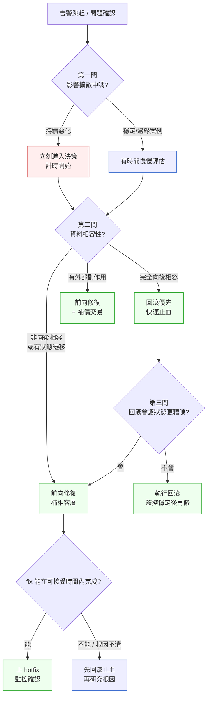

# 第 24 章｜回滾與前向修復決策
## ⸺ 線上出事的那一刻,你的第一個念頭決定了接下來兩個小時

> **前置閱讀**:[第 23 章｜藍綠與金絲雀部署](./ch-23-blue-green-canary.md)、[第 22 章｜Feature Flag 與漸進式發布](./ch-22-feature-flags.md)
> **下游章節**:[第 25 章｜資料庫遷移與零停機變更](./ch-25-db-migration.md)、[第 27 章｜從告警到根因:生產環境除錯](../part-06-operations/ch-27-alert-to-rootcause.md)

---

## 24.1 共感現場:告警一跳,大家眼神都看向你

你可能也有過這種瞬間。

告警在半夜兩點跳出來,或者在下午四點的 on-call 值班時突然響起——新版本三十分鐘前剛部署完,現在錯誤率從不到 0.1% 一路爬到 8%,客服那邊已經開始有人進來問了。Slack 上,主管轉發了一條問題截圖,後面跟著一個問號。

這種時刻最難受的不是技術本身,而是那個問題:「**現在到底要回滾,還是繼續修?**」

我帶過一位叫小涵的工程師,她在一家叫 Clearflow 的支付公司做後端。那次她推了一個帳單金額計算的改版——之前的邏輯在特定匯率組合下會產生浮點誤差,這次修正很乾淨,測試也全過了。上線後二十分鐘,監控發現有一批舊格式的匯率資料讀取失敗,影響約 3% 的交易請求。

> 「我要回滾嗎?」她問我。
>
> 「先別急著回答這題,」我說,「先把它換成兩個問題:資料有沒有損壞?還有多少人在等?」

這兩個問題,後來成為她整理那次事件的切入角度。那次最後選擇了前向修復(forward fix),花了四十分鐘上了一個相容補丁,沒有回滾——因為那批舊格式資料在回滾後仍然會被讀到,問題依然存在。回滾不但救不了她,反而會讓已經部分轉換的資料陷入更複雜的狀態。

那時候她如果憑直覺按了回滾,本來會更糟——可是沒有清楚的判斷框架,她一開始慌了。

正因為在這個時刻腦袋需要快速做決策,所以更需要一個清楚的框架可以走。這一章想給你的,就是那個框架。

---

## 24.2 真正的問題:為什麼「直覺回滾」這麼危險

我們把那個慌亂的瞬間慢慢拆開來看。

直覺告訴我們「出事就回滾」,因為這個動作**看起來很安全**——把程式碼退回上一個版本,理論上系統就恢復了。但這個直覺有一個很大的前提假設,而這個假設在現代系統裡常常不成立:

> **假設:回滾程式碼,就等於回滾系統狀態。**

可惜這個假設在很多情況下都是錯的,而且越是真實的生產系統,越容易錯。

讓我們一起想想,在程式碼上線之後,什麼東西**不會跟著回滾**:

- **資料庫 schema 的變更**:如果這次部署包含了一個 PostgreSQL 17 的 `ALTER TABLE`(或其他資料庫的等效 DDL),新程式碼已經跑了一段時間,新欄位裡也已經寫入了資料。程式碼回滾了,schema 卻留在新版本,舊程式碼可能直接找不到欄位或者讀到格式不對的資料。
- **已經消費的事件**:如果你的系統用了 Kafka 3.x 或 RabbitMQ 3.x,那些 message 已經被消費並觸發了後續副作用——外部系統收到了通知、帳款已過帳、郵件已發出。回滾程式碼,不會撤回這些已經發生的事。
- **外部 API 的狀態變更**:支付、簡訊、倉庫鎖定——這些動作很多都是單向的。
- **使用者看到的 UI 變更**:如果前端已經快取或者使用者已經接受了新介面的流程,回滾可能製造中間狀態的不一致。

也就是說,「回滾」這個動作本身是安全的,但它只能把**程式碼**退回去,卻無法把**資料與副作用**一起退回去。這個落差,就是「直覺回滾」最常踩的坑。

順著這個道理,我們就能理解,真正的決策問題其實不是「要不要回滾」,而是:

> **在目前的系統狀態下,哪個方向能讓系統更快、更安全地收斂到一個一致的狀態?**

這個問題的答案,取決於兩件事:**損壞的範圍**,以及**資料的相容性**。前者決定緊迫度,後者決定方向。

---

## 24.3 一起做判斷:三問定方向

那麼,當告警跳起來的那一刻,要怎麼讓這個判斷過程快一點、不靠運氣?

我整理了一個三問流程,它不是要讓你在告警跳起的三秒內就想清楚所有細節,而是給你一個**可以快速走完的思考順序**,避免在慌亂中跳過關鍵的那一個問題。我的建議是:不要等到事故發生才想這些問題。好的 on-call 團隊會在平時就把這些分叉點演練好,到時候只需要走流程就行。

### 24.3.1 第一問:影響擴散了嗎?

首先要確認的是:這個問題的邊界在哪裡?

- 錯誤率是多少,有沒有在持續上升?
- 影響的是讀路徑還是寫路徑?
- 有沒有帶出資料損壞,還是只是服務降級?

這個問題的目的,是確認**你有多少時間可以思考**。如果錯誤率在快速上升、核心寫入路徑受影響、有損壞風險,那計時就已經開始了,要加速決策。反過來,如果是少數邊緣案例,讀路徑的 degraded response,可以多給自己幾分鐘想清楚。

### 24.3.2 第二問:資料相容性是什麼狀況?

這是最關鍵的一問,也是最容易在慌亂中被跳過的。下表評估的核心問題是:「回滾程式碼之後,資料庫裡已有的資料,舊版程式碼還讀得了嗎?」

| 情境 | 相容性判斷 | 建議方向 |
|---|---|---|
| 純邏輯 bug,無 schema 變更,無資料寫入 | ✅ 完全相容 | **回滾優先**,快速止血 |
| 有 schema 變更(向後相容,舊程式可讀) | ✅ 可回滾,但需確認欄位語義 | **可回滾**,注意新欄位有無必填約束 |
| 有 schema 變更(非向後相容,舊程式讀不了) | ❌ 不相容 | **前向修復**,回滾會讓舊程式碼遇到新 schema 直接爆 |
| 有狀態遷移(資料已按新格式寫入) | ❌ 不相容 | **前向修復**,回滾後舊程式讀新格式資料會解析失敗 |
| 有外部副作用(支付/通知/倉庫已觸發) | ⚠️ 部分相容 | **前向修復 + 補償交易**,回滾不撤回已發生副作用 |

Clearflow 那次就是第四種情境——匯率資料有一部分已按新格式寫入,舊程式碼讀到新格式資料會直接解析失敗。回滾不但救不了,反而會讓那批新格式資料變成永久的地雷。

### 24.3.3 第三問:修正的代價是多少?

確認了方向之後,還有一個問題要想:如果選前向修復,這個 fix 多快能出?

- 問題的根因清楚了嗎?
- 修正的程式碼可以在三十分鐘內寫完測完嗎?
- 這個 fix 本身有沒有引入新的風險?

如果前向修復的時間不確定、根因還沒找到,那暫時回滾先止血,等根因清楚再部署修正版,這也是一個合理的選擇——只要確認回滾本身不會讓資料狀態更差。

### 24.3.4 決策流程圖

用一張圖把三問的走法整理起來:



這張圖並不是要讓你在告警出來的一秒內全部走完。它的用途是:在事前演練(而不是事中慌亂)的時候,讓你和團隊把這幾個分叉點想清楚。**把判斷做在演練裡,而不是做在事故裡**——這是這張圖最重要的使用方式。

---

## 24.4 容易絆倒的地方

三問框架說起來簡單,但實際出事的時候,有幾個地方特別容易讓人在正確的岔路口走錯邊。這些地雷很多人都踩過,所以這裡不是要提醒你「要小心」,而是讓你下次遇到時,心裡有個底。

### 絆倒處一:把「沒有 migration」等於「可以回滾」

很多人會做一個判斷捷徑:「這次沒有資料庫 migration,所以回滾是安全的。」

這個捷徑其實有個盲點。Schema 沒變,不代表資料格式沒變。如果你的程式碼這次改變了某個 JSON 欄位的結構、某個 enum 的可能值、或者某個第三方 payload 的解析方式,那資料庫裡已經按新格式存進去的那批記錄,舊程式碼一樣讀不了。

> **修正方向**:「可以回滾的判斷」除了「有沒有 migration」,還要加一個問題:「已寫入的資料,舊程式碼讀得了嗎?」只有兩個都是 Yes,才能放心說回滾是安全的。

### 絆倒處二:在根因不清楚的時候先上 hotfix

出事的壓力很大,大家都想快一點止血。有時候這個心情會推著你在根因還沒釐清的時候,就把「看起來有關」的程式碼改了推上去。

這樣做的風險是:你解了一個假症狀,沒解真問題——然後三十分鐘後同樣的告警又跳起來,而你剛才的 hotfix 還加了一層複雜度進去。

> **修正方向**:如果根因還不清楚,先讓系統回到一個已知的穩定狀態(回滾,或者關掉 feature flag),然後在**不上線的壓力下**研究根因。知道是什麼問題、知道修法正確,再推。穩了之後再研究,比在慌亂中猜測後推上去要安全得多。

### 絆倒處三:沒有驗證「回滾指令」可以真的跑

告警跳起來的那一刻,很多人跑去找 deploy script,才發現:「等等,這個 rollback 指令上次更新是六個月前,不知道現在還能不能用?」

> **修正方向**:回滾能力需要**定期演練**,不能在需要它的時候才第一次執行。理想上,每次 on-call 輪班開始前,就應該確認「如果今天出事,我手邊的回滾腳本、流程、權限,是不是都是現在可以跑的」。這不是偏執,這是護城河。

### 絆倒處四:回滾完之後就以為結束了

回滾讓錯誤率降下來、告警靜下去——這個時候很自然會長出一種「好了」的感覺。但還有幾件事沒做完:

- 那段時間的影響使用者,有沒有需要補償或通知的?
- 「下次遇到類似的情況,判斷路徑是什麼?」有沒有寫進 runbook?
- 那個 bug 的根因找到了嗎?修正版什麼時候上?

> **修正方向**:把「回滾完」當成「止血完」,而不是「事情完」。事情完成的標誌,是根因修好了、有 postmortem 記錄了、runbook 更新了。

---

## 24.5 帶得走的工具 ⸺ 一頁式「回滾決策卡」

下面是空白模板,可以貼進你的 on-call runbook,或者在 postmortem 文件裡填:

```text
回滾決策卡 ⸺ {事件描述}

[第一問:影響範圍]
- 事件時間:                    (格式:ISO 8601,例如 2026-03-12T14:32Z)
- 錯誤率:          %  (趨勢:上升 / 穩定 / 下降)
- 影響路徑:        讀 / 寫 / 兩者皆有
- 有無資料損壞跡象: 是 / 否 / 尚不確定
- 估計影響用戶數:

[第二問:資料相容性]
- 本次部署包含 schema migration:    是 / 否
- 新格式資料已寫入生產:             是 / 否 / 未確認
- 舊版程式碼讀得了已寫入的新格式:   是 / 否 / 未確認
- 有無外部副作用已觸發:             是 / 否  (支付/通知/倉庫/…)

[第三問:修正代價]
- 根因已確認:       是 / 否(假設:                    )
- 若回滾:預計完成時間     分鐘  / 有無阻礙:
- 若前向修復:根因清楚度   %  / 預計完成時間     分鐘

[決策結論]
選擇:  回滾 / 前向修復 / 先回滾再前向修復
理由(一句話):
後續 fix 計劃:
Postmortem owner:
```

為什麼是這幾欄、而不是更多?因為出事的時候,腦袋裡很難同時追超過五件事。這張卡的設計原則是:讓你在壓力下還能**順著順序填完**,不跳過那個最容易被跳過的「資料相容性」欄位。欄位不多,但每個欄位背後都是一個「沒問清楚會吃虧」的判斷點。

### 24.5.1 範例:Clearflow 帳單計算改版事件

回到小涵那次。Clearflow 推了帳單計算邏輯的改版,上線二十分鐘後,監控發現 3% 的交易請求在讀取匯率資料時失敗。

就是這種時刻,如果手邊有這張決策卡,決策過程大概會是這樣走的:

```text
回滾決策卡 ⸺ 帳單計算改版 / 匯率讀取失敗事件

[第一問:影響範圍]
- 事件時間: 2026-03-12T14:32Z  <!-- ISO 8601 格式,全書統一 -->
- 錯誤率: 3.1%  (趨勢:穩定,未繼續上升)
<!-- 為什麼這欄:錯誤率趨勢決定你有多少時間可以想——3% 且穩定,
     代表有幾分鐘可以認真走完第二問,不需要盲目搶快。 -->
- 影響路徑: 讀路徑(匯率資料讀取)
- 有無資料損壞跡象: 否(失敗的是讀操作,未產生錯誤寫入)
- 估計影響用戶數: ~120 筆/分鐘交易受影響

[第二問:資料相容性]
- 本次部署包含 schema migration: 否(純邏輯改版)
- 新格式資料已寫入生產: 是
  ⟶ 生產環境現在同時存在兩種格式:殘留的舊格式(flat JSON)與本次已寫入的新格式(nested JSON)
  ⟶ 目前的失敗來自新程式碼讀不了那批殘留的舊格式記錄(新邏輯期待 nested,舊記錄是 flat,丟 KeyError)——這就是那 3% 的來源
<!-- 為什麼這欄:「沒有 migration」不代表可以安全回滾。
     這次雖然沒有 ALTER TABLE,但生產裡新舊兩種 JSON 格式並存,任一版程式碼都只認得其中一種。
     這是最容易被跳過、也最危險的一問。 -->
- 舊版程式碼讀得了已寫入的新格式: 否
  ⟶ 舊程式碼期待 flat JSON,新格式是 nested,讀取會丟 KeyError——所以回滾也救不了
- 有無外部副作用已觸發: 否(問題在讀路徑,交易未過帳)

[第三問:修正代價]
- 根因已確認: 是(生產裡新舊兩種格式並存,新程式碼讀不了殘留的舊格式記錄——這是當下 3% 的來源;而回滾又會讓舊程式碼讀不了已寫入的新格式)
- 若回滾: 回滾後舊程式碼讀到已覆寫的新格式資料,仍然失敗 → 回滾解決不了問題
<!-- 為什麼這欄:這一欄的意義是逼你確認「回滾真的有用嗎」——很多人在這裡沒想過，
     就直接按了回滾。Clearflow 這次,回滾反而會讓已轉換格式的資料成為永久地雷。 -->
- 若前向修復: 加一個讀取相容層(支援 flat / nested 兩種格式同時解析),預計 35 分鐘

[決策結論]
選擇: 前向修復
理由: 回滾無法解決已寫入的新格式資料;加相容讀取層可讓新舊兩種格式都能讀取
後續 fix 計劃: 相容層上線後,批次將舊格式資料補轉為新格式,再移除相容層
Postmortem owner: 小涵
```

決策卡走完,方向清楚了:不回滾,加相容層。小涵花了三十八分鐘完成 fix 並上線,錯誤率降回 0%。後來她說,最有感的不是那個解法本身,而是「因為走了第二問,我知道回滾會更糟——那個確定感讓我在做 fix 的時候沒有慌」。

不慌不是靠意志力,是靠有框架。把判斷做在腦袋清楚的時候,在出事的那一刻你就只需要走流程。

---

## 24.6 本章回顧

讀完這一章,你應該已經能做到下面這幾件事。這些 checkbox 留白是刻意的——請在你真的有把握的時候再打勾,把它當成自我檢核的小工具:

- [ ] 說清楚「直覺回滾」為什麼有時候反而更危險——程式碼能回滾,資料狀態和外部副作用不一定能
- [ ] 在告警跳起的時候,用三問框架快速確認方向:影響擴散程度、資料相容性、修正代價
- [ ] 判斷哪些情境適合回滾、哪些情境適合前向修復、哪些情境需要先回滾再前向修復
- [ ] 把「回滾決策卡」貼進 on-call runbook,讓判斷做在演練裡而不是事故裡

如果想先從一件事開始,我會建議 ⸺**現在就把「資料相容性」那個問題加進你團隊的 on-call checklist**,因為這是三問裡最容易被跳過、也最容易讓回滾決策走錯方向的一個。其他的判斷點相對比較直覺,這個需要刻意提醒。

下一章,我們會把這個思路往前一步:當資料庫的 schema 本身就是你需要「回得去」或「往前走」的對象時,**零停機的資料庫遷移**是怎麼做的。

---

## Cross-References

- **上一章**:[第 23 章｜藍綠與金絲雀部署](./ch-23-blue-green-canary.md) ⸺ 藍綠部署的 traffic 切換正是回滾能力的一種實現
- **下一章**:[第 25 章｜資料庫遷移與零停機變更](./ch-25-db-migration.md) ⸺ 資料相容性問題的完整解法
- **強連結**:[第 22 章｜Feature Flag 與漸進式發布](./ch-22-feature-flags.md) ⸺ Feature flag 是另一種「可快速關閉」的前向修復手段
- **強連結**:[第 27 章｜從告警到根因:生產環境除錯](../part-06-operations/ch-27-alert-to-rootcause.md) ⸺ 根因找到之後,才是 hotfix 的起點
- **強連結**:[第 29 章｜On-call 與事故處理](../part-06-operations/ch-29-on-call.md) ⸺ 回滾決策卡應放進 on-call runbook
- **跨書連結**:[SA/SD Playbook — 資料一致性設計](https://github.com/EddyKuo/sa-sd-playbook) ⸺ Schema 向後相容設計屬於系統設計高度

---
