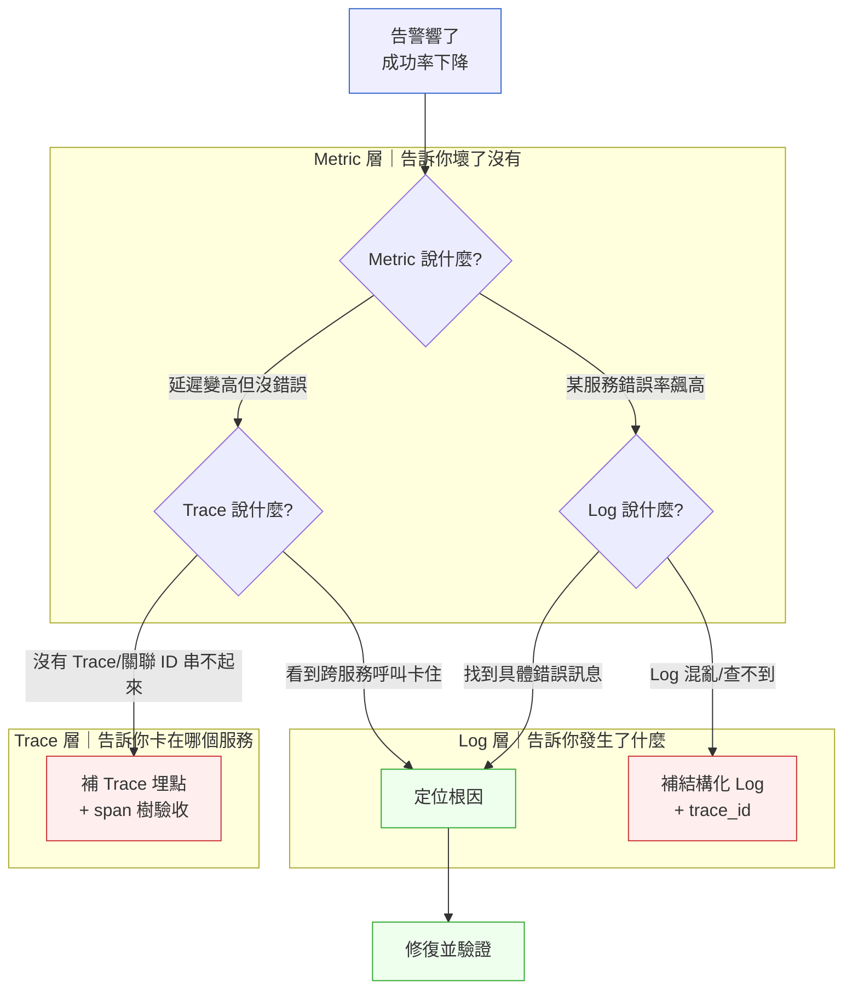

# 第 25 章｜可觀測性落地
## ⸺ 當系統說不出話,你怎麼知道它生病了?

> **前置閱讀**:[第 24 章｜資料庫遷移與零停機變更](../part-05-delivery/ch-24-db-migration.md)
> **下游章節**:[第 26 章｜從告警到根因:生產環境除錯](./ch-26-alert-to-rootcause.md)

## 25.1 共感現場:打開 Kibana,什麼都沒搜到

凌晨兩點多,Zara 的手機震了起來。

她在一家叫做 ClearPay 的支付公司做後端工程師,那天晚上剛接了 on-call。告警說某個支付閘道服務的成功率在五分鐘內從 99.6% 掉到 94%——放在金流系統上,這個數字已經讓人冷靜不起來。

她打開 Kibana,搜了服務名稱。日誌有,幾千筆,但全是 `INFO: Payment request received`、`INFO: Payment request completed` 這類兩字通知。她試著加了 `level:ERROR`,幾乎沒有什麼出來。她又換了關鍵字 `failed`,還是零。

問題明明在發生,但系統好像在說:「我很好,沒事的。」

接下來的一個小時,Zara 做的事是很多工程師都做過的:一層層翻 log,試各種關鍵字,把幾個看起來可疑的服務的 log 全拉出來比對時間戳,在那幾千行的 INFO 裡靠眼力找異常。最後,她在一個第三方清算介接服務的某個角落,看到兩行幾乎被淹沒的錯誤訊息——連 request ID 都沒有,只寫著 `Unexpected error during settlement`。

那次事故最後排查了將近兩個小時,影響的交易金額超過一百萬台幣,最終根因是一個清算 API 的逾時配置在上週的部署中被靜默改掉了。不是難找的 bug,但因為系統的 log 沒有辦法說清楚「這筆交易從哪裡來、去了哪裡、在哪個環節卡住」,所以同樣的問題花了本來三十分鐘就能找到、卻用了兩個小時。

這種情況你可能也遇過。不一定是金流,可能是 API 回應突然變慢、某個 job 靜靜地失敗了、用戶投訴訂單狀態不對——你知道系統出事了,但打開 log 之後,系統說不出話來。那種翻日誌翻到手軟、卻找不到方向的感覺,真的很難受。

## 25.2 真正的問題:log 是寫給誰看的?

我們把 Zara 的情況慢慢拆開看,你會發現這不只是「log 寫少了」的問題,而是一個更根本的認知差距。

很多工程師在寫 log 的時候,心裡想的是「記下我做了什麼」——這很自然,因為 log 最直覺的受眾是「寫程式的自己」。所以我們習慣寫 `INFO: Payment request received`、`INFO: Processing…`、`INFO: Done`,這種 log 在開發中確實有用,它讓你跟著程式碼走,確認每一步都執行了。

但一旦系統上線,真正需要 log 的人換了——不再是「知道程式怎麼跑」的你,而是「凌晨兩點被叫起來、完全不知道哪裡壞了、必須在最短時間定位問題」的 on-call 工程師。這兩個讀者的需求,其實相差很遠。

也就是說,生產環境的 log 要回答的不是「程式有沒有跑」,而是「**哪一筆交易、在哪個服務、因為什麼原因、在什麼時間點出了問題**」。當你把這個問題寫在紙上,再去讀 Zara 看到的那些 `INFO: Payment request received`,你就會明白為什麼那些 log 找不到線索——它們從來就沒有被設計成能回答這個問題的。

順著這個道理,我們就能看懂 Zara 的困境從哪裡來:她找不到的不是 log,而是一條把這些資訊串起來的線索。每個服務各自說自己的話,但沒有人說「我在處理的是 #TX-20240312-98271 這筆交易」。一旦問題跨越了服務邊界,她就只能靠時間戳和直覺去猜。

這就帶出了可觀測性(Observability)這個概念的核心:系統能不能讓你從外部觀察,推斷出它內部的狀態。它不是一個工具,而是一種設計屬性——就像可測試性、可維護性一樣,是你在寫程式的時候就要一起設計進去的東西。

可觀測性通常由三根柱子組成:**Log(日誌)**、**Metric(指標)** 和 **Trace(追蹤)**。三者各有分工,缺了哪一根,系統在出事的時候就會有一個方向是看不到的。接下來,我們就一根一根地把這三根柱子看清楚。

## 25.3 一起做判斷:三根柱子的分工與落地

讓我們用一個比喻來理解三根柱子的關係,這樣記起來比較不容易混。

**Metric** 是你的體溫計和血壓計。它告訴你整體的健康指標:現在的請求成功率是多少、p99 延遲是幾毫秒、CPU 用了多少。它不告訴你「為什麼壞」,但它最先告訴你「壞了沒有」。Metric 的特點是聚合過的數字,量少但反應快。

**Log** 是醫生的病歷紀錄。它記的是具體事件:「14:32:07,這筆請求用了什麼參數、走了哪個路徑、回傳了什麼結果、遇到什麼例外」。粒度高、資訊豐富,但量也大,所以需要結構和規律才找得到。Log 是「當下發生了什麼」的完整記錄。

**Trace** 是追蹤一個病人在醫院各科室移動的動線記錄。它回答的問題是:「這一筆請求從 API gateway 進來,經過了哪些服務、各用了多少時間、在哪個環節開始慢」。在微服務架構裡,這是最難靠直覺拼湊的一塊,也是最容易被漏掉的一塊。

三者放在一起,出事時的排查路徑大概是這樣走:



這張圖的重點不是告訴你「先查 metric 再查 log」這個順序,而是讓你看到:每一個「查不到」的節點背後,都對應著一個平常沒有建好的基礎設施。Metric 層、Log 層、Trace 層各自負責一個面向的可見度——少了任何一層,你在出事時就會有一個方向是瞎的。出事時才想補,是最慢的時候。

### 25.3.1 結構化日誌:讓 log 可以被機器讀

所謂結構化日誌(Structured Logging),就是把 log 從自由格式的文字,改成機器可以解析的結構——最常見的是 JSON 格式。

直接看差別最清楚:

```text
# 非結構化(傳統寫法)
2024-03-12 14:32:07 INFO Payment request received from user 9821, amount 2500 TWD
```

```json
{
  "timestamp": "2024-03-12T14:32:07.412Z",
  "level": "INFO",
  "service": "payment-gateway",
  "environment": "production",
  "event": "payment_request_received",
  "user_id": "9821",
  "payment_id": "PAY-20240312-98271",
  "amount": 2500,
  "currency": "TWD",
  "merchant_id": "MCH-0042",
  "trace_id": "4bf92f3577b34da6a3ce929d0e0e4736",
  "span_id": "00f067aa0ba902b7"
}
```

後者的優勢不是讀起來更漂亮,而是當你在 Kibana 或 Grafana Loki 搜尋的時候,可以直接用 `user_id: 9821 AND event: payment_request_received` 過濾,而不是靠正則表達式在字串裡挖。尤其當問題是「某個特定用戶在某個特定時間段的所有請求」,結構化 log 的查詢速度和精確度差了一個量級。

在工具的選擇上,Node.js 生態系的 `pino`(v8.x)是效能最好且預設輸出 JSON 的選項;Python 有 `structlog`(v23.x);Java 的話 `logback`(v1.4.x)配合 `logstash-logback-encoder` 是常見組合。選擇哪個工具不是重點——重點是**整個 service 的 log 格式一致**,讓 log 聚合系統可以統一解析。

除了格式之外,log level 的語意也需要全團隊達成共識。很多 codebase 的問題不是格式不對,而是 level 的語意沒有人定義——`ERROR` 裡混著 retry 成功的訊息,`INFO` 裡淹著真正的錯誤。下面這個簡單的語意對照表,可以直接放進你的 ADR:

| Level | 語意 | 典型場景 | 是否需要人介入 |
|---|---|---|---|
| `DEBUG` | 詳細的執行步驟 | 本機開發、CI debug | 否(生產環境關閉) |
| `INFO` | 業務流程的里程碑 | 訂單建立成功、交易完成 | 否 |
| `WARN` | 值得注意但系統能自我修復 | 第三方 API retry、快取未命中 | 否(但可監控頻率) |
| `ERROR` | 某件業務邏輯失敗了,需要人處理 | 交易失敗、資料不一致 | 是 |

這個共識寫進 ADR 比工具配置更重要——工具可以換,但沒有語意共識,換再好的工具也找不到東西。

### 25.3.2 關聯 ID:跨服務的那條線

正因為結構化 log 讓我們能查詢單一欄位,接下來自然會想到:如果能在所有相關的 log 裡放一個共同的 ID,那跨服務的路徑不就能一口氣撈出來了?

這就是關聯 ID(Correlation ID)的核心思路。有時候也叫 Trace ID 或 Request ID,它的作用很簡單:在一個請求進入系統的時候,給它一個唯一識別碼,然後讓這個 ID **跟著這筆請求走過的每一個服務、每一條 log**。

Zara 那次找了一個小時,最關鍵的缺失就是這個。她能看到每個服務各自的 log,但沒有一條線索說「這些 log entry 都屬於同一筆交易」。一旦加上關聯 ID,她需要做的只是三步:

1. 從 Metric 的告警定位到出事的時間窗口
2. 在那個時間窗口裡撈 log,找到錯誤的 entry,取得 `trace_id`
3. 用那個 `trace_id` 在全部服務的 log 裡搜尋,整條交易路徑就出來了

實作上,關聯 ID 的傳遞方式是在 HTTP header 帶著走。進入系統的第一個服務(通常是 API gateway 或 BFF)如果看到請求帶了 `X-Trace-Id`,就原樣往下傳;如果沒有,就自己生成一個 UUID,也往下傳。每個服務收到請求後,把 `trace_id` 存進 thread local(或 Go 的 context、Rust 的 task local),之後所有的 log 自動帶上它——這個自動注入的機制是最不會出錯的方式,不要靠工程師手動傳。

這個模式在 OpenTelemetry 1.x 裡有完整的標準定義,`W3C Trace Context` 規格讓跨語言、跨框架的 trace ID 傳遞有了統一格式——如果你的系統之後打算接 Jaeger(v1.x)或 Tempo,從一開始就用 OpenTelemetry 的 SDK 埋點會省掉很多遷移成本。

不只是 HTTP 呼叫——message queue 的 produce/consume、排程工作的觸發,都應該把關聯 ID 帶進去。分散式系統的除錯難點就在於邊界,在每一個邊界都把 ID 傳過去,就是在每一個邊界都留下一盞燈。

### 25.3.3 Metric 的三個層次

有了結構化 log 和關聯 ID,我們就能在「出事後」快速找到根因。但更好的情況是:在用戶被影響之前,Metric 就先告訴我們某個地方不對勁。

Metric 最容易走的彎路是「量了很多,但不知道要看哪個」。一個好用的角度是把 Metric 分成三個層次來思考:

| 層次 | 典型指標 | 回答的問題 | 工具 |
|---|---|---|---|
| **業務層** | 支付成功率、訂單轉換率 | 使用者有沒有被影響到 | 自訂 counter/gauge |
| **服務層** | RPS、p99 延遲、錯誤率 | 哪個服務有問題 | Prometheus(v2.x) + RED 方法 |
| **基礎設施層** | CPU、記憶體、GC pause | 是不是資源問題 | Node exporter、cAdvisor |

RED 方法(Rate / Errors / Duration)是一個很好用的服務層 Metric 框架。你在任何一個服務上,只要顧好這三個,就能回答「它健不健康」的基本問題——不用量 50 個指標,先把這三個弄好,之後再視需要擴充。

業務層的 Metric 最容易被忽略,但往往是最有意義的。ClearPay 的案例裡,最早讓 Zara 被叫起來的就是支付成功率這個業務指標——比任何基礎設施告警都早了將近三分鐘。當基礎設施層一切看起來正常、但業務就是在出血,業務層 Metric 是你唯一的線索。那三分鐘的差距,在金流系統上,代表的是幾十萬台幣的交易。

Metric 的告警設計也是技術活。告警太多、太靈敏,工程師很快就會開始忽略它;告警太少、太遲鈍,等告警響的時候損失已經很大了。一個好的起點是:先設定「業務層指標超過合理範圍 2 分鐘以上才觸發」,而不是「任何一個請求失敗就告警」——前者告訴你有真正的問題,後者製造雜訊。

### 25.3.4 Trace 的實作策略

有了前面的 Metric 和 Log,我們能知道「什麼時候壞了」和「在哪個服務壞了」。但在微服務架構裡,一筆請求往往會跨越三到五個服務——就算知道哪個服務有問題,要找到「為什麼那個服務在那個時間點變慢」,還需要 Trace。

Trace 的核心概念是 span 樹。每一筆請求對應一個根 span(root span),它呼叫的每一個下游服務或資料庫查詢,各自對應一個子 span,樹狀結構完整地描述了整筆請求的時間分布。看 span 樹,你能一眼看出:「這筆請求總共花了 850ms,其中 650ms 都卡在清算 API 的那個 span 上。」

實作上,OpenTelemetry 1.x 是目前最推薦的標準切入點。它的 SDK 覆蓋了主流語言(Node.js、Python、Java、Go),並且有大量自動埋點的插件——HTTP client、資料庫驅動、message queue 的 span 大部分都不需要手寫,只需要在啟動時 `require('@opentelemetry/auto-instrumentations-node')` 就能自動建立。

手動埋點的場景是業務邏輯層的關鍵路徑,例如「計算動態手續費率」或「查詢風控規則」這類業務上有意義、但框架不知道怎麼自動識別的操作。在這些地方加上自訂 span,讓 Trace 不只告訴你「哪個 HTTP 呼叫慢」,還告訴你「業務邏輯的哪個決策點花了多少時間」。

Trace 的驗收方式也很直接:埋完之後跑一筆真實的請求,打開 Jaeger UI 或 Grafana Tempo,確認 span 樹完整地長出來了——能看到從 API gateway 一路往下到資料庫查詢的完整鏈。如果 span 樹只有一個根節點,就代表下游的 context 傳遞有斷掉,要回去找斷點。

## 25.4 容易絆倒的地方

從前面的道理走到這裡,我們已經知道要做什麼了。但在實際落地的時候,有幾個地方很多人都絆過一跤,提前知道的話可以省掉不少彎路。這些不是「不小心才會犯」的錯誤,而是「沒人事先提醒就很容易走的路」。

**絆倒處一:log 的 level 沒有紀律**

最常見的情形是整個 codebase 幾乎全是 `INFO`,偶爾突然一個 `ERROR`——但那個 `ERROR` 可能只是一個無傷大雅的 retry 成功了的訊息。Kibana 搜 `level:ERROR` 應該要直接帶你到「真正的錯誤」,不是「被標成 ERROR 的 INFO」。

這種混亂的後果是:出事了,搜 ERROR 出來一百條,你還是得一條一條看哪個是真的——等同沒有 log level。

> **修正方向**:為 log level 的語意建立團隊共識(見 §25.3.1 的對照表),把共識寫進 ADR,比工具配置更重要。拿一個已有的 codebase 試試:搜 `level:ERROR`,看看第一頁裡有幾條是真的讓你需要馬上處理的。如果不到一半,就是 level 語意需要重整的訊號。

**絆倒處二:Trace 只埋了入口,沒有埋出口**

有工程師做到了在 API gateway 生成 trace ID,但忘了讓它往下游服務傳遞;或是傳到了下游服務,但下游呼叫第三方 API 或資料庫的時候,span 沒有被正確建立。最後 Trace 只有一個 root span,看起來整筆請求在一個服務裡瞬間完成——這種 Trace 幾乎沒有診斷價值。

這個錯誤很常見的原因是:測試 Trace 的時候只測「有沒有 trace_id」,沒有測「span 樹有沒有完整長出來」。結果在 code review 時感覺過關了,到了出事才發現 span 是空的。

> **修正方向**:把「Trace 能跨越服務邊界」和「Trace 能進入資料庫、HTTP client、message queue」當成兩個驗收條件,在第一次 Trace 埋點完成後,實際跑一筆請求、在 Jaeger UI 裡確認 span 樹長出來了。看得到 span 樹才算完成,不是程式碼合併就算。

**絆倒處三:什麼都 log,結果搜不到重要的**

這是「log 多不等於好的可觀測性」最典型的表現。每個函數都加 `INFO: Entering function X`、`INFO: Exiting function X`,最後 log volume 爆了,真正重要的 ERROR 被淹死在流量裡,搜起來又慢又吵。

更麻煩的是儲存成本——每天幾 GB 的 log,保留七天就是幾十 GB,全是無用的進出函數記錄。這種壓力最後往往讓團隊把 log 保留期限壓縮,反而在需要查歷史的時候找不到了。

> **修正方向**:用一個簡單的問句篩選每一條 log:「如果我在凌晨被叫起來,這條 log 會讓我的除錯更快嗎?」如果答案是否,那條 log 改成 DEBUG 或直接拿掉。把 log 當成「給未來的 on-call 自己的訊息」,而不是「給 linter 看的執行記錄」。

**絆倒處四:Metric 的 cardinality 失控**

Prometheus 的 label 很好用,但如果不小心把 `user_id` 或 `request_id` 放進 label,cardinality 會爆炸——幾千萬個 user 就有幾千萬個 time series,直接讓 Prometheus 記憶體撐破。這個問題在系統規模小的時候完全看不出來,等量起來之後才發現是個大洞。

這種問題的觸發通常很無辜:有人想查「特定用戶的請求延遲」,就在 Histogram 的 label 裡加了 `user_id`。前兩週測試環境沒問題,到了生產環境幾萬個用戶同時用,Prometheus 開始 OOM。

> **修正方向**:Metric label 的 cardinality 上限大約是幾百到幾千個 distinct value。用 user ID、交易 ID 這類高基數欄位做維度的需求,應該改走 Log 和 Trace 解決,而不是塞進 Metric 的 label。一個簡單的檢查:label value 是「有限集合」(如 status_code、merchant_id 的大類)還是「無限集合」(如 user_id、request_id)?是後者就不能放進 label。

前面談了這些容易絆倒的地方,現在的問題是:既然知道了地雷在哪,怎麼才能確保每一次埋點都埋對了呢?這就是下一節想帶給你的東西——一張能逐項確認的清單,讓你在新服務上線前有一個固定的驗收動作。

## 25.5 帶得走的工具 ⸺ 一頁式「可觀測性埋點清單」

可觀測性最大的挑戰不是工具選擇,而是「不知道哪些地方需要埋點、埋了什麼才算夠」。

為什麼用清單格式?因為可觀測性的埋點很容易在「其實還沒做完」的狀態下被認為做完了——Log 有了但沒有 trace_id、Metric 有了但沒有業務層、Trace 有了但 span 樹只有入口。清單逼你逐項確認,一頁的篇幅也強迫你把最重要的項目找出來,不能什麼都列。下面這張清單是「最不埋會吃虧」的基本盤:

```text
可觀測性埋點清單 ⸺ {服務名稱} / {版本} / {日期}

負責人:{RD 名稱}      審查人:{Tech Lead}

## Log 層
□ 結構化格式(JSON)已統一,所有服務使用相同 schema
□ 所有 log 帶 trace_id 與 span_id(由框架或 middleware 自動注入)
□ 所有 log 帶 service、environment、version 欄位
□ Log level 語意對照表已建立並寫入 ADR(DEBUG/INFO/WARN/ERROR)
□ 所有 ERROR 帶足夠上下文(user_id / request_id / failure_reason / upstream_code)
□ 已確認 Kibana 搜 level:ERROR 只回傳真正需要人介入的錯誤
□ 無 log 塞爆情形:生產環境的 log volume 在合理範圍(已估算每日 GB 數)

## Metric 層
□ RED Metric 已建立:Rate(RPS)/ Errors(錯誤率)/ Duration(p50/p99)
□ 業務層 Metric 已建立:{填入核心業務事件,如 payment_success_rate}
□ 基礎設施 Metric:CPU / 記憶體 / GC pause 已由 exporter 自動收集
□ 所有 Metric label 均為低基數欄位(distinct value < 1000)
□ 告警閾值已設定並有人 review 過(不可只靠工具預設)
□ 告警已接上通知渠道(PagerDuty / Slack),並做過一次端對端測試

## Trace 層
□ 入口服務正確生成 / 傳遞 trace_id(W3C Trace Context 格式)
□ 所有服務間 HTTP 呼叫都正確傳遞 context(已用 OpenTelemetry 1.x 自動埋點)
□ 資料庫查詢有 span(SELECT / INSERT / UPDATE,包含慢查詢)
□ 第三方 API 呼叫有 span,帶 upstream_endpoint 與 http_status_code
□ Message queue 的 produce/consume 有 span
□ 業務關鍵路徑有手動自訂 span(如計費規則計算、風控查詢)
□ 跑一筆請求後,Jaeger / Tempo UI 能看到完整 span 樹(標注實際 span 數量)

## 驗收
□ 用 trace_id 能在所有服務 log 裡撈到這筆請求的完整路徑
□ 出事時的排查 runbook 已存在,且有人試走過一遍
□ 新進工程師能在 30 分鐘內靠 runbook 獨立查一筆歷史事故的根因
```

### 25.5.1 範例:ClearPay 支付閘道的埋點改善

讓我們回到 Zara。那次凌晨兩點的事故之後,她帶著團隊做了一次系統性的補點。下面是他們用這張清單整理出來的成果——它不完美,但它讓第二次類似的事故排查時間從兩小時縮到十八分鐘:

```text
可觀測性埋點清單 ⸺ ClearPay / payment-gateway / v2.3.1 / 2024-04-01

負責人:Zara Chen      審查人:Kai (Tech Lead)

## Log 層
✅ 結構化格式:改用 pino v8.x,統一輸出 JSON
   ↳ 上次事故 Kibana 查不到關鍵字,主因是 log 格式不一致;
     改成 JSON 後,欄位查詢從「猜正則」變成「選欄位值」。

✅ 所有 log 帶 trace_id 與 span_id:透過 AsyncLocalStorage 自動注入,
   不靠工程師手動傳

✅ service: "payment-gateway" / environment: "production" / version: "2.3.1"

✅ Log level 對照(已寫入 ADR-031):
   DEBUG=開發用 | INFO=業務里程碑 | WARN=清算逾時重試 | ERROR=交易失敗、需介入
   ↳ 上次搜 ERROR 撈到的大半是 WARN 等級的 retry 訊息;語意對齊後,
     搜 ERROR 的第一頁全是需要人看的真實失敗。

✅ ERROR 欄位:user_id, payment_id, merchant_id, failure_reason, upstream_code
   ↳ upstream_code 是這次新增的欄位——清算 API 的逾時錯誤碼上次就藏在這裡,
     有了這欄,下次直接在 log 裡就能看到是哪個上游失敗、用什麼錯誤碼回應。

✅ Log volume 約 8 GB / day;已確認 ERROR 搜尋只回傳真實失敗

⚠️ 高基數欄位:payment_id 已從 Prometheus label 中移除,改走 log 查詢

## Metric 層
✅ Rate:payment_requests_total (counter, by status_code, merchant_id)
✅ Errors:payment_errors_total (counter, by error_type)
   (error_type 低基數:timeout / validation_error / upstream_failure)
✅ Duration:payment_duration_seconds (histogram, p50/p95/p99)
✅ 業務 Metric:payment_success_rate (gauge, 每分鐘更新)
   ↳ 這個指標讓 Zara 在事故的第一分鐘就被告警叫醒;
     缺了它,要等基礎設施告警,可能晚三到五分鐘。
✅ 告警閾值:success_rate < 98.5% 持續 2 min → PagerDuty

## Trace 層
✅ 入口:API gateway 生成 trace_id (W3C Trace Context 格式)
✅ 服務間 HTTP:透過 OpenTelemetry 1.x SDK 自動傳遞 context
✅ DB span:PostgreSQL 查詢透過 opentelemetry-instrumentation-pg 自動埋
✅ 第三方 API:清算介接、卡組織 API 有手動建立 span,帶 upstream_endpoint
   ↳ 上次的根因就藏在清算 API 的那個 span;
     埋了之後 Trace 直接指向 clearlink-settlement 的 span,耗時 650ms,一目了然。
✅ Message queue:Kafka produce/consume 有 span (opentelemetry-instrumentation-kafkajs)
✅ 業務自訂 span:fee_calculation、risk_check 兩個關鍵路徑有手動 span
✅ 驗收:跑一筆測試交易,Tempo UI 看到完整 span 樹
   (9 個 span,涵蓋 3 個服務:payment-gateway → clearlink-settlement → card-network-adapter)

## 驗收
✅ 用 trace_id 能在 Grafana Loki 撈到這筆交易所有服務的 log
✅ Runbook 已更新:「用 payment_id 找 trace_id → 用 trace_id 找完整路徑 → 看 Tempo span 樹找卡點」
✅ 新工程師 Aaron 獨立用 runbook 還原了上次事故的根因,花了 22 分鐘
```

Zara 說,整個補點工作花了兩個 sprint,但帶來的改變不只是下次找得到——她的 on-call 壓力明顯降低了。告警響的時候不再是「不知道從哪裡下手」的焦慮,而是有了一套固定的路徑可以走。系統終於能說清楚它自己的狀態了。

## 25.6 本章回顧

讀完這一章,你應該已經能夠:

- 說清楚 Log / Metric / Trace 各自負責回答什麼問題,以及它們如何分工配合
- 把 log 改成結構化格式(JSON),並為 log level 在團隊內建立一致的語意
- 在服務間傳遞關聯 ID(Trace ID),讓一筆請求的完整路徑可以被追蹤
- 為服務建立 RED Metric,加上業務層 Metric,在事故發生前先有告警
- 用可觀測性埋點清單,在新服務上線前做完整的驗收

如果你現在只想從一件事開始,建議先加上關聯 ID——它不需要更換工具,只需要在 HTTP header 傳一個 UUID,卻能讓排查跨服務問題的速度大幅提升。結構化 log、Trace、業務 Metric 都可以慢慢補,但關聯 ID 愈早加愈好。每一次沒有它的排查,都是在用時間換它本來能省下的麻煩。

下一章,我們會接著談「有了可觀測性之後,怎麼從告警一路走到根因」——那是另一套思路,但它的起點,正是這一章建好的三根柱子。

## Cross-References

- **下一章**:[第 26 章｜從告警到根因:生產環境除錯](./ch-26-alert-to-rootcause.md) ⸺ 可觀測性是燃料,這章教你怎麼開車
- **前章**:[第 24 章｜資料庫遷移與零停機變更](../part-05-delivery/ch-24-db-migration.md) ⸺ 遷移過程中的可觀測性同樣重要
- **強連結**:[第 27 章｜向下穿透抽象層](./ch-27-penetrating-abstraction.md) ⸺ 當 Trace 追到底層,你需要下潛的能力
- **強連結**:[第 28 章｜On-call 與事故處理](./ch-28-on-call.md) ⸺ 本章建的基礎設施,在 on-call 時發揮作用
- **跨書連結**:[SA/SD Playbook Ch 29｜可觀測性架構設計](https://github.com/EddyKuo/sa-sd-playbook) ⸺ 架構高度的可觀測性設計
