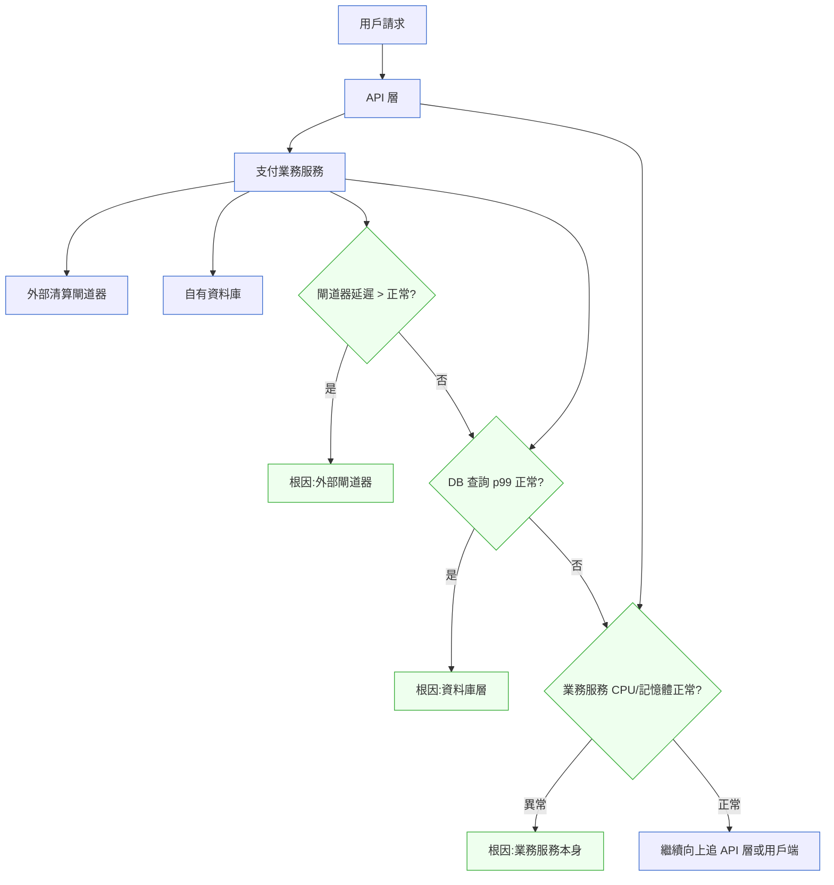

# 第 26 章｜從告警到根因:生產環境除錯
## ⸺ 大膽假設、小心求證:讓每一步都縮小搜尋範圍

> **前置閱讀**:[第 25 章｜可觀測性落地](./ch-25-observability.md) ⸺ log/metric/trace 是本章的彈藥;沒有它們,除錯只能靠猜
> **下游章節**:[第 27 章｜向下穿透抽象層](./ch-27-penetrate-abstractions.md) ⸺ 當根因跨越了你熟悉的那個層,就需要下鑽

## 26.1 共感現場:那個同時響起三支電話的清晨

你可能也遇過這樣的早晨。

凌晨四點半,小涵的手機同時跳出三條 PagerDuty 告警:支付成功率下滑、p99 延遲飆到 8 秒、交易失敗數每分鐘超標。她坐起來,第一個念頭幾乎是所有人都有過的那種——先重啟服務看看會不會好。

她帶我看這段故事的時候說:「那時候腦袋空空的,只覺得要做點什麼,不能只是呆坐著。」

這個反應很正常。告警一響、壓力一來,人的本能是「先動」,最快能動的手就是那顆重啟按鈕。可是重啟之後,警報沉默了十分鐘,接著又全部回來了——問題根本沒解決。那十分鐘讓她更慌了:到底是什麼壞掉了?

這是生產事故除錯裡一個很典型的困境:告警告訴你「有東西壞了」,卻不告訴你「哪裡壞了、為什麼壞」。從警報到根因之間,有一段距離。那段距離用重啟、用猜測、用亂槍打鳥去填的話,很可能在真正的原因浮出之前,就把局面搞得更亂。

小涵那天早晨面對的不是能力問題,而是方法問題。她缺的不是「更聰明」,而是一套結構化的思路——一個能告訴她「現在該往哪走、下一步該問什麼」的框架。

## 26.2 真正的問題:告警是症狀,不是診斷

讓我們慢慢把這件事拆開來看。

告警系統能做到的事其實很有限:它能偵測**度量值超出閾值**,並把這個事實通知你。支付成功率低於 98%——告警觸發。p99 延遲高於 5 秒——告警觸發。告警非常擅長說「有東西不對勁了」,但它本身並不分析原因。

也就是說,收到告警的那一刻,你得到的資訊是**症狀的外觀**,不是**病灶的位置**。就像體溫計顯示 39.5 度,它告訴你發燒了,但沒告訴你是流感、細菌感染,還是別的什麼。

順著這個道理,我們就能看懂小涵那次重啟行為的問題所在了。重啟是「希望症狀消失」的操作,而不是「針對病灶的治療」。如果根因是一個資料庫查詢跑滿了連線池,重啟應用服務器只是短暫釋放連線、讓症狀暫停——但根因沒動,連線池很快又會被撐滿,症狀自然回來。

那麼問題來了——如果重啟、猜測、亂試都只是在症狀層面打轉,什麼才是能真正往根因靠近的方式?

問題歸根結蒂不在工具,而在思路。答案藏在兩個字裡:假設。

生產環境除錯的本質,是一場**假設驅動的搜尋**。你手上有症狀(告警、指標、錯誤訊息),你需要用這些線索建構一個**因果假設**——「我懷疑是 X 造成了 Y」——然後用觀測工具去**驗證或推翻**這個假設。每驗一次,搜尋空間就縮小一半。這就是所謂的「大膽假設、小心求證」。

沒有假設的試誤,搜尋空間不會收斂。有了假設,每一步都在替你排除可能性,幾步之後就能逼近根因。兩種方式面對同一個問題,耗費的時間可能差上十倍。

## 26.3 一起做判斷:假設驅動除錯的四個步驟

讓我帶你走一遍這個方法,順著小涵那天早晨的案例來看。

小涵所在的公司是一家虛構的支付平台 **ClearPay**,系統架構大致是:前端 API 層 → 支付業務服務 → 外部清算閘道器(第三方)+ 自有資料庫。那天凌晨的症狀是支付成功率驟降、延遲飆升。

### 步驟一:觀察,把症狀轉成問題邊界

除錯開始前,先花三到五分鐘把「你看到的東西」整理成結構化的描述:

- **症狀**:什麼指標異常?從什麼時間點開始?
- **影響面**:所有用戶?特定地區?特定功能?
- **規律性**:是持續的、還是週期性的?

小涵整理後得到:支付失敗從 04:12 開始,影響所有用戶,失敗類型主要是 timeout。這三個事實很重要——「04:12 開始」說明在這個時間點前後有什麼改變,「所有用戶」排除了特定用戶的設定問題,「timeout」給了一個類型方向。

### 步驟二:建立假設清單,找最高可能性的先問

症狀邊界確認之後,問自己:**什麼原因能同時解釋所有我看到的事實?**

把可能的假設列出來,每個假設都要能「覆蓋」所有症狀。不能覆蓋的就先放一邊。

針對小涵的案例,可以列:

| 假設 | 能否解釋「04:12 才開始」 | 能否解釋「所有用戶」 | 能否解釋「timeout 類型」 |
|---|---|---|---|
| 外部清算閘道器回應變慢 | ✅ 閘道器有可能在那時出問題 | ✅ 所有支付都走閘道器 | ✅ 閘道器慢 → timeout |
| 我們自己的資料庫慢 | ✅ 可能 | ✅ 共用資料庫 | ✅ DB 慢 → 業務層等待 → timeout |
| 新部署引入 bug | ⚠️ 需確認那時間點有沒有部署 | ✅ 如果是全局邏輯 | ⚠️ 要看 bug 類型 |
| 流量暴增超出容量 | ✅ 可能 | ✅ 全面影響 | ✅ 資源不足 → 慢 → timeout |

每個假設對應的驗證方式不同。優先驗「最便宜、最快能確認」的那個。

### 步驟三:二分定位——先確認問題在哪個層

假設清單有了以後,下一個問題自然來了:這些假設同時成立的機率幾乎是零——我們需要一個有策略的方式去確認問題究竟落在哪一層。接下來不是亂驗,而是有邏輯地縮小範圍。一個好用的思路是從你的系統的分層模型入手,找到讓系統「一分為二」的那個切割點:



這張圖的核心不是順序,而是「每一個節點的答案都能排除一半的可能性」。這就是二分的力量——你不需要知道答案在哪,你只需要每一步都讓搜尋空間減半。

小涵查了閘道器的 outbound 延遲 metric:p99 從平時 300ms 飆到 6 秒,而同時間 DB 查詢的延遲完全正常。外部閘道器——假設確認了。

### 步驟四:驗證假設,再往下一層追

確認了「問題在哪個層」之後,還需要問「具體是什麼」——定位到層只是把搜尋空間從整個系統縮小到一個子系統,真正的根因往往還需要再往下一層追。確認了「外部閘道器有問題」之後,下一個問題不是「怎麼修」,而是「這是他們那邊的問題,還是我們給他們的請求格式有問題?」繼續假設 → 驗證。

查閘道器的 status page:那個時間點他們確實有一次計畫外維護,影響了特定地區的節點。根因確認:外部服務降級導致 timeout 堆積。應對方式隨之清晰:在閘道器回應緩慢時啟用降級流程、設定 circuit breaker 斷路。

把這個流程整理成一個可以複用的結構:

| 除錯步驟 | 動作 | 目的 |
|---|---|---|
| **① 邊界觀察** | 整理症狀、時間線、影響面 | 把「卡住感」變成結構化問題 |
| **② 建立假設** | 列出能覆蓋所有症狀的可能原因 | 把搜尋空間轉成有邊界的清單 |
| **③ 二分定位** | 從系統分層找切割點,逐層排除 | 每一步讓搜尋空間減半 |
| **④ 驗證 + 下鑽** | 對最高可能性假設取證,確認或推翻 | 把猜測換成事實 |
| **⑤ 確認根因** | 問「為什麼這個根因會在這時發生」 | 防止對症下藥漏掉真正誘因 |

這五個步驟不是公式,而是一條思路:每一步都比前一步更靠近根因,每一步都能被觀測資料所驗證。

## 26.4 容易絆倒的地方

這一段不是要指出誰的錯,而是想讓你下次遇到類似情況時,心裡有個底。下面這幾個模式幾乎所有工程師都走過——它們有個特點:一個比一個藏得更深。

**絆倒處一:先動手再動腦**

告警響起、壓力一來,最自然的反應就是「先做點什麼」。重啟服務、回滾上一個版本、增加機器數——這些動作感覺是在掌控局面。但如果根因沒找到就亂動,有可能讓局面更複雜:回滾了不相干的程式碼、改了沒問題的設定,卻讓之後的除錯多了更多雜訊。

> **修正方向**:告警來了,先給自己三到五分鐘做「步驟一:邊界觀察」——整理症狀、看時間線。這段時間不是浪費,它讓後面每一步都更準確。只有在系統完全不可用、必須「先讓它能動再找原因」的情況下,才考慮先重啟。

但就算忍住了「先動」的衝動、願意先觀察,還有另一個坑在等著。這就帶出了下一個容易犯的錯:

**絆倒處二:把第一個找到的異常當成根因**

Grafana 一打開,看到某個指標異常,人的大腦很容易說「就是這個!」——這叫「第一個顯眼的嫌疑人偏誤」。有時候那個異常確實是根因,但更多時候,它只是另一個症狀,或者是根因的下游反應。

舉個例子:連線池耗盡是很常見的告警指標,但連線池耗盡本身可能是因為某支 SQL 查詢鎖表了、讓每個請求都在等、進而把連線池用光。根因是那支 SQL,而不是連線池。

> **修正方向**:找到一個異常之後,繼續問「它是原因還是結果?」——看它的時間點比告警早還是晚;看它的上下游。把「顯眼的指標」當成線索,而不是答案。

知道要把異常當線索而不是答案之後,接下來的挑戰是:我有好幾條線索,然後呢?這就帶出了第三個容易犯的錯:

**絆倒處三:假設太多、驗一個放棄一個,沒有收斂**

「可能是 DB」「可能是閘道器」「可能是新部署」「可能是流量大」——全部都查一遍,結果每個都查了一半,沒有一個查清楚。這種狀態容易在緊急情況下出現,尤其是多個人同時在除錯的時候。

> **修正方向**:先完整列假設清單,然後排出優先序——哪個假設如果成立最能解釋所有症狀?先驗最高可能性的那個。驗完之前,不要跳到下一個。如果是多人協作,明確分工:A 查閘道器、B 查 DB,不要三個人同時查同一個。

假設清單管住了之後,你大概率能找到根因。但找到根因之後,還有最後一個坑——也是最容易忽略的一個:

**絆倒處四:根因確認了,卻沒問「為什麼是現在」**

「閘道器問題」確認了,修復了,警報消了。但沒有人問:閘道器那邊的狀況為什麼這次影響這麼大?過去他們也有維護期,怎麼以前不會這樣?

這個問題很重要,因為它通常指向的是**我們自己這邊缺少了什麼保護**——circuit breaker 沒設、timeout 值太寬、fallback 機制不存在。根因確認只是除錯的第一步,預防復發才是最終目標。

> **修正方向**:根因確認後,用一句話回答「為什麼這個根因,恰好在這個時間點造成這個規模的影響?」這個問題的答案,往往就是你下一個改善項目的起點。

## 26.5 帶得走的工具 ⸺ 一頁式「生產事故除錯記錄卡」

下面是空白模板。它的設計邏輯是跟著假設驅動除錯的五個步驟走,每一欄對應一個思考動作。在緊急情況下,逐欄填寫能讓你的思路保持結構化,而不是在壓力下亂成一團。

這張卡有另一個用途:在事後復盤時,它就是還原當時決策邏輯的最快方式——你為什麼先查閘道器?你什麼時候判斷根因在資料庫?這些推理過程如果沒有記錄,事後很難重建。

```text
生產事故除錯記錄卡 ⸺ {事件編號} / {日期時間}

═══════════════════════════════════════════
① 邊界觀察
─────────────────────────────────────────
告警觸發時間:{YYYY-MM-DD HH:MM UTC}
症狀描述:{哪些指標異常、異常幅度}
影響範圍:{所有用戶 / 特定地區 / 特定功能}
錯誤類型:{timeout / 5xx / 資料異常 / 其他}
告警觸發前後有無部署/設定變更:{有 / 無 / 待確認}

═══════════════════════════════════════════
② 假設清單
─────────────────────────────────────────
假設 A:{...} — 可能性:{高 / 中 / 低}
假設 B:{...} — 可能性:{高 / 中 / 低}
假設 C:{...} — 可能性:{高 / 中 / 低}
優先驗證:{假設 X,因為它最能覆蓋所有症狀且最快取證}

═══════════════════════════════════════════
③ 二分定位過程
─────────────────────────────────────────
切割點:{從哪個層往哪個方向縮小範圍}
觀測到:{具體數字或現象}
結論:{排除 / 縮小到}

(重複此欄直到定位到層)

═══════════════════════════════════════════
④ 根因確認
─────────────────────────────────────────
根因:{一句話描述}
確認依據:{哪個 metric / log / trace 作為證據}
根因發生時間:{與症狀開始時間比較}
為什麼是現在:{這次為何影響特別大 / 以前為何沒觸發}

═══════════════════════════════════════════
⑤ 緩解與後續
─────────────────────────────────────────
緩解措施:{立即做了什麼讓系統恢復}
根因修復:{計畫做什麼防止再發}
改善項目:{這次暴露的結構性問題}
```

讓我們回到小涵那個凌晨四點半的故事。如果她當時手上有這張卡,那段摸索就不會是在黑暗裡亂試,而是會變成有邏輯的推進——每填一欄,就離根因近一步。下面是填好的版本:

### 26.5.1 範例:ClearPay 2026-03-15 支付成功率事件

```text
生產事故除錯記錄卡 ⸺ INC-2026-0315-001 / 2026-03-15 04:12 UTC

═══════════════════════════════════════════
① 邊界觀察
─────────────────────────────────────────
告警觸發時間:2026-03-15 04:12 UTC
<!-- 為什麼這欄:時間點是除錯最重要的第一條線索。
     「04:12 才開始」讓你可以去查那個時間前後有沒有部署、
     外部服務有沒有維護視窗、流量是不是在那時跑起來。
     沒有時間點,你就失去了最快排除假設的工具。 -->
症狀描述:支付成功率 98% → 61%;p99 延遲 400ms → 8200ms;
          每分鐘交易失敗數 > 1200 筆
影響範圍:所有用戶 / 全功能
錯誤類型:主要為 timeout(504),少量 5xx(連線池相關)
04:12 前後有無部署/設定變更:無(上一次部署是 03-14 17:30 UTC,已穩定 10 小時)

═══════════════════════════════════════════
② 假設清單
─────────────────────────────────────────
假設 A:外部清算閘道器(TrustGate)回應變慢 — 可能性:高
假設 B:自有 PostgreSQL 資料庫出現慢查詢或鎖定 — 可能性:中
假設 C:支付業務服務本身資源耗盡(CPU/記憶體/連線池) — 可能性:中
假設 D:流量暴增超出容量 — 可能性:低(凌晨 4 點非高峰)
<!-- 為什麼這欄:假設要「能覆蓋所有症狀」才有意義。
     假設 D 在這裡弱,因為 04:12 是非高峰,流量暴增不合理。
     先把低可能性的排到後面,讓驗證精力集中在真正有機會的地方。 -->
優先驗證:假設 A,因為閘道器是所有支付的必經之路,
          且 timeout 類型高度符合外部依賴慢的特徵

═══════════════════════════════════════════
③ 二分定位過程
─────────────────────────────────────────
切割點:看 outbound 到 TrustGate 的 p99 延遲(Grafana,tracing tag: gateway=trustgate)
觀測到:04:12 起 p99 從 280ms → 6400ms,04:47 開始緩慢回落
結論:外部閘道器確認異常 → 排除 DB / 業務服務本身為主因

補充確認:TrustGate status page 顯示 04:10–04:52 UTC 亞太節點計畫外維護
<!-- 為什麼這欄:外部服務的 status page 是「閉環驗證」的最後一步。
     光看自己的 metric 只能知道「對方慢了」;
     看對方的狀態頁能確認「是對方的問題,不是我們的請求格式出了錯」。
     兩個都查,才能放心說根因在外部。 -->

═══════════════════════════════════════════
④ 根因確認
─────────────────────────────────────────
根因:TrustGate 亞太節點計畫外維護,導致所有清算請求 timeout
確認依據:outbound p99 曲線與 TrustGate status page 維護時段完全吻合
根因發生時間:04:10(比告警早 2 分鐘,符合延遲堆積需要時間)
為什麼是現在:ClearPay 未設 circuit breaker;閘道器慢時,
              支付服務仍持續送出請求,每個請求等到 30s timeout 才放棄,
              導致執行緒池被耗盡,形成雪崩式連帶影響
<!-- 為什麼這欄:「為什麼是現在」這個問題回答的不是閘道器的問題,
     而是我們自己為什麼被影響這麼深。
     這裡答案是「沒有 circuit breaker」——
     這才是真正的改善起點,不是等 TrustGate 不再出問題。 -->

═══════════════════════════════════════════
⑤ 緩解與後續
─────────────────────────────────────────
緩解措施:04:38 手動啟用支付降級模式(返回「暫時無法支付」而非無限等待),
          連帶讓執行緒池恢復;04:52 TrustGate 維護結束,服務自動回升
根因修復:實作 circuit breaker(Resilience4j 2.x),
          TrustGate p99 > 2s 時自動開路,15s 後 half-open 試探
改善項目:①閘道器 timeout 從 30s 縮為 5s  ②加入 fallback queue 供用戶稍後重試
          ③訂閱 TrustGate status page webhook 作為告警前置
```

你看,小涵最後找到的根因,不是一個很難發現的東西——閘道器的 metric 在 Grafana 上都有,status page 也是公開的。真正讓那個早晨變得很長的,是沒有一個結構幫她知道「先看什麼、看完之後問什麼」。有了這張卡之後,那段路從四十分鐘摸索,變成了十五分鐘的邏輯推進。下次你遇到同樣的凌晨四點,它就是你的那張地圖。

## 26.6 本章回顧

讀完這一章,你應該已經能:

- [ ] 說清楚「告警是症狀、不是診斷」——知道為什麼告警觸發之後需要一個結構化的除錯流程
- [ ] 在事故發生時先做「邊界觀察」三到五分鐘,而不是立刻亂動
- [ ] 建立假設清單,用「能否覆蓋所有症狀」來排定驗證優先順序
- [ ] 用系統分層模型做二分定位,每一步讓搜尋空間減半
- [ ] 根因確認後,問「為什麼是現在」——找到改善的真正起點
- [ ] 填寫「生產事故除錯記錄卡」作為除錯過程的思路記錄與復盤素材

如果想先從一件事開始,我會建議——**下一次除錯之前,先花三分鐘把「症狀、時間線、影響範圍」寫下來**,因為這三件事確定了,你就不再是在黑暗裡摸索,而是已經拿到了地圖的邊框;後面的每一步都會快很多。

下一章,我們要往更深的地方走:當根因不在你熟悉的那一層,需要穿越框架、穿越語言運行時、一路追到底層才能找到答案——那就是「向下穿透抽象層」的技藝。

## Cross-References

- **上一章**:[第 25 章｜可觀測性落地](./ch-25-observability.md) ⸺ log/metric/trace 是本章除錯的彈藥來源
- **下一章**:[第 27 章｜向下穿透抽象層](./ch-27-penetrate-abstractions.md) ⸺ 當根因跨越了熟悉的層,就需要「大膽假設、小心求證」的下鑽技藝
- **強連結**:[第 28 章｜On-call 與事故處理](./ch-28-oncall-incident.md) ⸺ 本章是個人除錯思路,第 28 章是事故時的團隊協作協定
- **強連結**:[第 1 章｜為什麼工程實作需要決策框架](../part-01-foundations/ch-01-why-engineering-decisions.md) ⸺ 「大膽假設、小心求證」呼應第 1 章的「交付前四問」,兩者都是結構化判斷的應用

