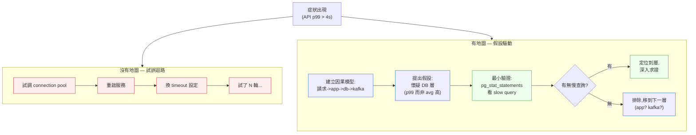
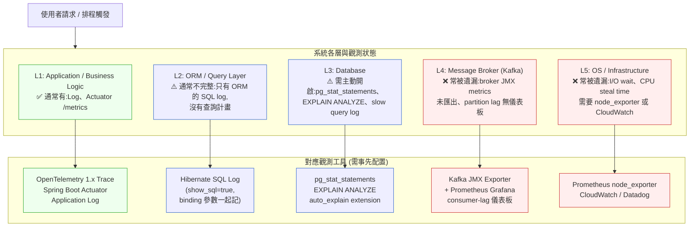

# 第 27 章｜向下穿透抽象層
## ⸺ 當抽象漏水時,有地圖的人三十分鐘解決,沒地圖的人瞎測兩天

> **前置閱讀**:[第 25 章｜可觀測性落地](./ch-25-observability.md)、[第 26 章｜從告警到根因](./ch-26-alert-to-rootcause.md)
> **下游章節**:[第 28 章｜On-call 與事故處理](./ch-28-on-call.md)、[第 45 章｜判斷力的養成](../part-09-synthesis/ch-45-cultivating-judgment.md)

## 27.1 共感現場:「我試了三天,還是不知道為什麼」

你可能也遇過這種卡法。

問題很具體:一支 API 在壓測時 p99 latency 突然飆到 4 秒,但平均值看起來好好的。你打開 dashboard,數字沒有異常;你看了 application log,也只有幾行普通的 INFO。然後你開始試——換連線池大小、加 timeout 設定、重啟服務——每試一輪要等十分鐘,試了半天,數字上上下下但規律不明。三天後你跟主管說:「好像稍微好了一點點?」

這不是努力不夠。這是在**沒有地圖**的情況下找路——每一步都可能對,也都可能錯,而你根本不知道差別在哪裡。

讓我說一個更具體的情境。Finyuan(泛遠金融科技,一家提供企業收付款 API 服務的新創)有一位工程師叫小璇。她負責維護一套清算排程系統:每天凌晨兩點,系統會把前一天的所有交易打一批帳,產生清算報表,傳給銀行合作夥伴。這套系統用的是很成熟的技術棧:Spring Boot、PostgreSQL 17、Kafka 3.x。架構上看起來很乾淨。

有一天,清算排程開始偶發性地超時。不是每天,不是每筆,是隨機的——十次裡有兩次。小璇在 application 層的 log 裡看到超時,換了幾個參數,有時好一點有時更糟。她查過 Kafka 的 consumer lag,正常;查過 JVM heap,也正常。但問題就是在那裡,偶爾出現,然後消失,再出現。

她跟我說:「每次我覺得找到了,下次又不是這個原因。」

這句話道出了沒有地圖除錯的核心困境:**你不是在收斂,你是在做有序的隨機試誤。** 每一輪測試都消耗時間,但因為沒有對「問題在哪一層」做出清晰的假設,每一輪測試的結果也幾乎無法排除其他可能性。

那麼,問題不在她不夠聰明,也不在工具不夠好。問題在於——這一代的開發環境,早已把「被逼著往下鑽」的時刻抽掉了。

## 27.2 真正的問題:抽象層拿走了你下降的肌肉

我們把這件事慢慢拆開來看。

現代工程師工作的抽象層高度,和二十年前相比,已經完全不同。二十年前寫 C 的工程師,記憶體、指標、stack frame 幾乎沒有緩衝——東西一炸,只能硬著頭皮往下讀 core dump。這很痛,但那份痛把「往下走」的肌肉逼出來了。

今天的情況不一樣。Framework 幫你管記憶體、connection pool、retry 邏輯、序列化/反序列化。ORM 讓你幾乎不用看 SQL。前後端分離讓前端工程師不需要知道資料庫怎麼跑,後端工程師也不用知道瀏覽器怎麼渲染。這些都是好事——抽象讓我們生產力大幅提升。

但它帶來一個代價:抽象是向上漏的。

「**Leaky Abstraction(洩漏的抽象)**」是一個老概念,說的是每一個抽象層在正常時候幫你擋住底層,但出事的時候——恰恰是你最需要往下看的時候——它不會幫你下去。ORM 出了效能問題,最終你得看 SQL;Kafka 的 consumer 偶發超時,最終你得看 broker 設定和 partition 分配;Spring 的 connection pool 抖動,最終你得看 TCP 連線的生命週期。

也就是說,抽象層很像電梯——上行效率極高,但如果電梯故障了,你得靠自己爬樓梯。問題是,如果你從沒爬過樓梯,不只不知道怎麼爬,甚至不知道樓梯在哪裡。

前後端分離是這個問題在架構層面最典型的一個先例。職涯被拆成兩半——前端工程師只看到請求的上半段,後端工程師只看到下半段——而一個跨層的 bug,比如「從使用者按下 button 到資料寫進 DB,到底哪一段慢了」,恰好需要完整的路徑模型。當組織裡沒有人持有那條完整路徑,這類問題就變成了「大家互相說對方那邊沒問題」的循環。

小璇遇到的,正是這個情形。她的日常工作是在 Spring Boot 這一層——寫 service、寫 repository、看 application log。PostgreSQL 查詢計畫、Kafka 的 broker 配置、OS 層的 I/O 排程器——這些都在她的日常視野之外。所以當問題跨越了那條線,她的搜尋空間就從「哪一行程式碼」擴展成了「整條 stack 上的任何一點」,而那個空間大到沒有窮舉的可能。

順著這個道理,我們就能看出:問題不在於小璇不夠努力,而在於**她的搜尋策略是線性的——一個可能性、一個可能性地試——但問題空間是指數的**。唯一能讓搜尋收斂的,是先有一個假設,把搜尋空間縮小到一層,然後在那一層求證。

這就帶出了本章最核心的一個觀念:**大膽假設、小心求證**。

## 27.3 一起做判斷:有地圖的除錯 vs 沒有地圖的試誤

「大膽假設、小心求證」這句話很多人聽過,但它的意思常常被誤解成「多猜幾次」。其實它的真義是:**先建立一個基於系統因果模型的假設,再設計一個能夠驗證或推翻這個假設的最小實驗**。

也就是說,它有兩個前提:

1. **因果模型**——你得先知道這個系統的各層是怎麼連起來的,問題在哪一層才有可能影響什麼現象。
2. **可驗證的假設**——假設必須是可以被推翻的。「可能是 DB 慢」不是假設;「如果是 DB 的問題,pg_stat_statements 應該會顯示某個查詢的 mean_exec_time 超過 500ms」才是假設。

我們用一張圖來看「有地圖」和「沒有地圖」的除錯路徑差異:



左邊的迴路看起來很努力,但每一輪都是獨立的、無法互相排除的試誤——搜尋空間不會縮小。右邊的路徑,每一步都在根據假設的結果做決策:有慢查詢,就往 DB 層深入;沒有,就把 DB 排除,往下一層去。這就是 **log(n) 收斂** vs **線性甚至組合爆炸**的差距。

### 27.3.1 建立請求的完整生命週期地圖

「因果模型」聽起來抽象,但其實它有一個很具體的起始點:把請求的完整生命週期畫出來。

以 Finyuan 的清算系統為例,一筆清算請求的路徑大致是:

```
Scheduler → Spring BatchJob → Service Layer → Repository(JPA/Hibernate)
→ PostgreSQL 17 → (結果) → Kafka Producer → Kafka Broker → 下游消費者
```

每一個箭頭都是一個可能出問題的「關節」。「大膽假設」的意思,是根據症狀的特徵,推斷最可能是哪個關節出了問題,然後設計驗證手段。

症狀是「偶發超時、p99 高但平均低」——這個特徵本身就有信息量:

| 症狀特徵 | 指向的假設 |
|---|---|
| p99 高但 average 正常 | 長尾效應;某種「偶爾觸發」的資源競爭或鎖等待 |
| 偶發性,非每次 | 跟負載、時序、狀態有關,不是邏輯錯誤 |
| 批次作業時出現 | 與大量寫入或 table-level 操作有關 |
| 查完 application log 無特殊 | 問題不在 application 邏輯,可能在 infrastructure 層 |

這四個特徵疊加起來,指向的第一個假設應該是:**PostgreSQL 層的鎖競爭或 IO 爭搶**。下降路徑:看 `pg_stat_activity`(查當下有無 blocked 查詢)和 `pg_stat_statements`(查慢查詢統計)。

這種「症狀特徵 → 假設方向」的推理是可以學習、可以積累的。下面列出幾個常見的症狀樣式與它們最常指向的層:

| 症狀樣式 | 排除方向 | 往下看的目標層 | 推薦觀測工具 |
|---|---|---|---|
| p99 高、average 正常 | 不是邏輯慢 | DB 鎖競爭 / IO 爭搶 | `pg_stat_activity`、`pg_stat_statements` |
| 請求成功,但偶爾多花 2–3 倍時間 | 不是程式錯誤 | 連線池耗盡 / GC pause | HikariCP metrics、JVM GC log |
| 錯誤率突然從 0 升到 2–3%,且每隔幾分鐘有一批 | 不是程式邏輯 | 上游或下游間歇性不可達 | Distributed Trace span duration、外部 API error rate |
| 本機跑得快、CI / staging 也正常,但生產慢 | 不是程式碼問題 | 環境差異:索引、資源配額、連線數限制 | `EXPLAIN ANALYZE`(生產慢查詢)、慢查詢 log |
| Consumer lag 緩慢增加,但消費速度看起來夠 | 不是 consumer 本身 | Kafka partition 分配不均 / rebalance | Kafka JMX: `records-lag-max`、partition assignment |
| 某個 API 在特定時段突然慢,其他時段正常 | 不是請求本身的問題 | 背景排程搶資源:cron job、backup、autovacuum | OS crontab、DB 背景工作排程 |

這張表不是公式,是起點。每一個「指向」都需要你拿對應的工具去驗證——不驗證就只是猜測。但有了這張表,你的第一個假設比「亂試」要精準得多,搜尋空間在開始的第一輪就縮小了。

正因為症狀本身含有這麼多信息量,養成「先讀症狀特徵、再建假設」的習慣,是穿透力最快速的提升方法。接下來,我們看下降的動作本身要怎麼走。

### 27.3.2 向下穿透的三個動作

每次需要下降一層時,可以按這個順序走:

**第一步:先測量,再行動。** 任何假設都需要一個可以被測量的指標來驗證。「DB 可能慢」要變成「我去看 `pg_stat_statements` 的 mean_exec_time 是否在超時期間超過 X ms」才能動手。先決定測量方式,再下降。

**第二步:一次只移動一層。** 不要同時在 application 層和 DB 層改設定。每次只動一個層,觀察一輪,確認你的假設是否被支持或推翻。同時動多層,等於讓結果無法歸因。

**第三步:設計一個「能推翻假設」的最小測試。** 好的假設應該是可以被推翻的。如果你的假設是「DB IO 爭搶」,那麼在非批次時段跑同樣的查詢,如果 latency 正常,假設就被支持了;如果也很慢,就可以排除批次是原因的可能性。

把這三個動作組合起來,就能讓每一輪測試都有明確的結論,而不是「好像好一點但也說不定是巧合」。

### 27.3.3 AI 在這裡是探針,不是答案

有一件事很值得單獨說:AI 工具在有地圖的除錯和沒有地圖的除錯裡,扮演完全不同的角色。

有因果模型的人用 AI 的方式是:**「我懷疑是 PostgreSQL 的 autovacuum 在批次作業期間和清算查詢搶 IO,幫我查 pg_autovacuum_naptime 和 autovacuum_vacuum_cost_delay 的關係,以及如何在特定表上設定不同的 autovacuum 參數。」** 這是把 AI 當探針——你已經知道要看哪一層、找什麼東西,AI 幫你加速那一層的查找和驗證。

沒有因果模型的人用 AI 的方式是:**「我的 API 超時,幫我看看這段程式碼有什麼問題?」** 然後把 AI 給的建議一個個貼上去試。這是 **vibe-debugging**——看起來在積極行動,實則是換了一個速度更快的隨機試誤工具。AI 建議一個可能性,你試一輪;AI 再給一個,你再試一輪。搜尋空間沒有縮小,只是每輪試誤的速度加快了——但更快地在大搜尋空間裡繞圈,並不等於收斂。

也就是說,**AI 不會補上缺失的穿透力,它放大「有無因果地圖」的差距,而不是彌平它**。手上有地圖的人,AI 讓他們下降得更快;沒有地圖的人,AI 讓他們繞圈繞得更勤快。

### 27.3.4 穿透的前提:每一層都要先有觀測孔

在談「怎麼向下走」之前,有一件比技巧更根本的事要先確認:**你的系統每一層是否已經有可以觀測的入口?**

這個問題聽起來顯而易見,但在實際工程環境裡,答案往往是「某些層有,某些層沒有」。以 Finyuan 的清算系統為例:Spring Boot 這層有 application log 和 Actuator metrics,所以小璇能輕鬆看到 BatchJob 超時;但 PostgreSQL 這層的 `pg_stat_statements` 擴充套件預設沒有開啟,Kafka broker 的 JMX metrics 也沒有匯出到 monitoring 系統。當問題指向這兩層的時候,就算你知道要看什麼,也看不到任何數據。

這就是為什麼可觀測性(Observability)是除錯能力的基礎設施,而不是「有空再加」的可選項。

下面這張圖展示一個典型的後端系統各層觀測點,以及常見的覆蓋漏洞:



這張圖的重點不是讓你一次把所有工具裝好——而是讓你在服務設計階段,就問一個問題:「如果這一層出了問題,我有辦法看到它嗎?」

一個好的觀測前提清單在服務設計或 sprint 結束時可以長這樣:

| 層 | 最低要求觀測點 | 驗證方式 |
|---|---|---|
| Application | 有結構化 log + 請求 trace ID 傳播 | 在 staging 發一個請求,確認 log 有 trace_id |
| ORM / Query | SQL 查詢 log 含執行時間 | 確認 `show_sql=true` 且有 binding 參數 |
| Database | `pg_stat_statements` 開啟 | `SELECT * FROM pg_stat_statements LIMIT 5` 有結果 |
| Message Broker | Consumer lag 有儀表板 | 確認 Grafana 的 `records-lag-max` 有數據 |
| OS / Infra | CPU/Memory/IO wait 有儀表板 | 確認 `node_exporter` 指標流入 Prometheus |

這份清單不需要在每次除錯時才去確認——應該在每個新服務第一次部署到 staging 時就跑過一遍。把它寫進 deployment checklist 或 DoD(Definition of Done),觀測孔就會從「問題發生後才緊急加上」變成「一開始就在那裡等著你用」。

順著這個道理,當觀測前提具備了,假設驅動的穿透策略才能真正發揮效果。那麼在實際執行的過程中,有哪些常見的絆倒處是需要事先知道的?

## 27.4 容易絆倒的地方

下面幾個絆倒處幾乎每個工程師都遇過。說這些,不是要提醒你「別這樣做」,而是讓你下次遇到的時候,心裡有個底。

**絆倒處一:把「換了設定、現象消失」當成「找到根因」。**

超時消失了,大家很開心,結案。可是,你不知道「為什麼消失了」——是真的修好了,還是問題在潛伏、只是剛好沒觸發?下次遇到類似症狀,還是一樣找不到原因。

> **修正方向**:解決問題之後,多花十分鐘問一個問題:「我現在能用語言解釋這個問題的因果機制嗎?」能解釋的才算真的找到了;不能解釋的,就記錄下來作為待確認的假設。這一句話日後會省下很多時間。

**絆倒處二:把 AI 的第一個建議當成答案。**

AI 給的建議通常是「最常見的可能性」——這有機率意義,但不保證和你的問題吻合。最常見的可能性,不一定是你這個具體系統、這個具體負載下的實際原因。

> **修正方向**:把 AI 的建議當成「一個需要驗證的假設」,而不是「一個需要執行的操作」。先問「如果 AI 說的是對的,我能設計什麼測試來驗證?」再動手,而不是先貼上去看看。

**絆倒處三:一次改多個變數,結果什麼都學不到。**

為了快點解決問題,連線池、timeout、batch size 一起改。問題消失了,但你不知道是哪個改動有效——下次遇到類似問題,還是要再試一輪。

> **修正方向**:忙的時候很難守住「一次一個變數」,但至少在改動之前,在 log 或 ticket 裡寫下「我這次改的是 X,我預期看到的變化是 Y」。這個紀錄會讓你在觀察結果時有一個可以對照的基準,而不是事後茫然地猜「到底是哪個有用」。

**絆倒處四:因為沒下過某一層,就認定「那層沒問題」。**

「我看過 DB 了,沒問題。」但你看的是 application log 裡的 ORM 日誌,不是 `pg_stat_statements`。你認定沒問題,是因為沒問題,還是因為你用的觀測工具還在上一層?

> **修正方向**:每次說「X 層沒問題」之前,確認你用的觀測工具是屬於那一層的原生工具,而不是上一層的日誌。`pg_stat_statements`、`EXPLAIN ANALYZE`、Kafka broker metrics——這些是 DB 層和 Kafka 層的工具,不是 application 層的日誌。

**絆倒處五:沒有事先確認「能不能看到那一層的數據」,就開始除錯。**

有時候不是工程師不懂得往下走,而是當問題發生的時候,才發現那一層根本沒有開任何觀測——沒有 `pg_stat_statements` 擴充套件、沒有 Kafka JMX metrics 匯出、trace 只到 service 層就停了。這就像你知道問題在地下室,但電梯直接跳過地下室、樓梯門也是鎖著的。

這個絆倒處的後果特別隱匿:你不會看到錯誤,只是看不到任何東西——然後得出「那層沒問題」的錯誤結論。

> **修正方向**:在服務上線之前(不是在問題發生之後),把「這條 stack 上每一層的關鍵觀測點是否已經開啟」列成清單,並在 staging 環境驗證它們真的在產出數據。可觀測性(Observability)是除錯地圖存不存在的前提;沒有它,「穿透抽象層」就只是空談。

**絆倒處六:找到根因之後,沒有更新自己的「層級地圖」。**

這個問題在小璇身上也出現了——解決 autovacuum 問題之後,她知道了 PostgreSQL 17 有 autovacuum 這個行為,也知道了怎麼用 `pg_stat_activity` 觀測。但是這份知識只留在她的腦子裡。三個月後換別人接手,同樣的問題從頭再走一遍。

> **修正方向**:每次成功定位到一個新的層或機制之後,把「這是什麼」「怎麼觀測」「常見觸發條件」三件事記在一個團隊共用的地方——可以是 wiki、可以是 runbook、可以是 repo 的 docs 資料夾。你花了兩天學到的東西,不應該只活在你一個人的記憶裡。知識留在人頭裡,是技術債的一個常被忽略的面向。

知道了這些常見絆倒處,下一步自然會問:有沒有一個工具,能把這些教訓——「先建假設」「一層一層走」「每輪都要有結論」——組織成每次除錯都能直接拿來用的結構?

## 27.5 帶得走的工具 ⸺ 一頁式「跨層除錯地圖」

當問題跨越了你的日常工作層,最有幫助的工具是先把搜尋空間畫出來,然後按假設的信心度逐層下降。下面是空白的「跨層除錯地圖」模板,可以貼在 incident ticket 或 debug log 的最前面:

```text
跨層除錯地圖 — {問題標題 / Ticket ID}

症狀描述:
  - 觀察到什麼:{具體數字、什麼時候發生、多高頻率}
  - 不是什麼:{已排除的可能性}

系統路徑(從入口到出口):
  {L1:層名} → {L2:層名} → {L3:層名} → {L4:層名}

症狀特徵分析:
  - 特徵 1:{症狀特徵} → 指向假設:{哪一層、什麼機制}
  - 特徵 2:{症狀特徵} → 指向假設:{哪一層、什麼機制}

當前最高信心假設:
  - 假設內容:{用一句話說明}
  - 若假設成立,應觀察到:{可測量的預期}
  - 驗證工具 / 指令:{具體的查看方式}
  - 驗證結果:{填入觀察到的數字}

假設驗證紀錄:
  輪次 1 | 假設:{} | 預期:{} | 結果:{} | 結論:{支持/推翻}
  輪次 2 | 假設:{} | 預期:{} | 結果:{} | 結論:{支持/推翻}
  輪次 3 | ...

根因結論:
  - 根因層:{哪一層}
  - 根因機制:{為什麼這一層、這個機制導致那個症狀}
  - 修復行動:{做了什麼}
  - 驗證修復:{怎麼確認修好了}
```

這張模板的設計邏輯很簡單:先把已知的限縮住(症狀特徵、已排除的),再讓假設從高信心的開始走,每一輪都留下「假設是什麼、預期什麼、看到什麼、結論是什麼」的完整紀錄。它不是要讓你慢下來,而是讓每一輪的等待時間都能給你一個明確的答案,而不是「也許稍微好了一點」。

### 27.5.1 範例:Finyuan 清算超時事件

讓我們回到小璇那個偶發清算超時的問題。如果她一開始就用這張地圖來組織自己的除錯思路,這個問題大概可以在第一個工作天的下午就收斂。

```text
跨層除錯地圖 — CASE-FIN-027 / 清算排程偶發超時

症狀描述:
  - 觀察到什麼:每天凌晨 02:00 清算排程,10 次中約 2 次超時;
    application log 顯示 BatchJob.run() 超過 30s timeout;
    平均執行時間正常(約 8s),p99 才出問題
  <!-- 為什麼這欄:「平均正常但 p99 高」是非常有價值的信號——
       它幾乎直接排除了「查詢邏輯本身低效」的可能性,
       因為那會讓平均也高。指向的是「偶爾觸發的競爭或等待」。-->
  - 不是什麼:Kafka consumer lag 正常;JVM heap 正常;
    application 業務邏輯無錯誤 log

系統路徑(從入口到出口):
  [L1: Spring Batch Scheduler]
  → [L2: Service Layer / Transaction]
  → [L3: JPA/Hibernate ORM]
  → [L4: PostgreSQL 17]
  → [L5: Kafka Producer]
  → [L6: Kafka Broker]

症狀特徵分析:
  - p99 高、average 正常 → 指向假設:L4 偶發鎖等待或 IO 爭搶
  - 凌晨批次時出現 → 指向假設:和大批量寫入相關,可能是 autovacuum 或 lock
  - 非邏輯錯誤(無 ERROR log) → 指向假設:infrastructure 層,不在 L1-L3

當前最高信心假設:
  - 假設內容:PostgreSQL 的 autovacuum 在清算批次寫入高峰期搶佔 IO,
    導致 INSERT/UPDATE 偶爾等待 autovacuum 釋放資源
  <!-- 為什麼這欄:autovacuum 在 PostgreSQL 17 預設是背景執行,
       當表上有大量 dead tuples(例如批次 UPDATE 後),
       autovacuum 會觸發 VACUUM,和正常查詢競爭 shared_buffers 和 IO。
       批次凌晨執行、偶發、p99 高,這三個特徵的組合高度指向這個機制。-->
  - 若假設成立,應觀察到:在超時期間,pg_stat_activity 裡有 autovacuum worker
    在跑清算相關表;或 pg_stat_user_tables 的 n_dead_tup 在清算後飆高
  - 驗證工具:
    SELECT pid, state, wait_event_type, wait_event, query
    FROM pg_stat_activity
    WHERE query LIKE '%autovacuum%' OR wait_event = 'Lock';

    SELECT relname, n_dead_tup, last_autovacuum
    FROM pg_stat_user_tables
    WHERE relname IN ('transactions', 'settlements');
  - 驗證結果:凌晨 02:14(超時發生時)pg_stat_activity 顯示
    autovacuum 正在跑 transactions 表;n_dead_tup = 1,240,000
    <!-- 為什麼這欄:看到 n_dead_tup 超過百萬,就能估算 autovacuum
         需要清理的工作量,也能估算對 IO 的影響程度。
         這個數字讓你從「可能是 autovacuum」變成「幾乎確定是 autovacuum」。-->

假設驗證紀錄:
  輪次 1 | 假設:autovacuum IO 競爭 | 預期:pg_stat_activity 有 autovacuum on transactions
          | 結果:確認,02:14 autovacuum 在跑,持續約 45s | 結論:支持

  輪次 2 | 假設:調整 autovacuum 參數後改善 | 預期:下次批次 p99 < 5s
    ALTER TABLE transactions SET (
      autovacuum_vacuum_cost_delay = 20,   -- 預設 2ms,放慢 autovacuum IO 佔用
      autovacuum_vacuum_scale_factor = 0.01 -- 更早觸發,讓每次清理量更小
    );
          | 結果:連續五天 p99 < 3s,無超時 | 結論:支持,修復確認
  <!-- 為什麼這欄:這裡記錄「做了什麼改動」和「改動的理由」,
       而不只是「改了參數」。這樣三個月後接手的人才看得懂為什麼這些參數是這個值,
       而不是隨機調出來的「魔法數字」。-->

根因結論:
  - 根因層:L4 — PostgreSQL 17
  - 根因機制:清算批次 UPDATE 產生大量 dead tuples,觸發 autovacuum VACUUM;
    autovacuum 預設參數導致 IO 搶佔時間過長,與批次主查詢競爭 shared_buffers,
    造成偶發等待,表現為 p99 高而 average 正常
  - 修復行動:per-table autovacuum 參數調整(見輪次 2)
  - 驗證修復:連續五天監控 pg_stat_user_tables.last_autovacuum 與 p99 latency
```

這份紀錄的尾端,是小璇從「試了三天、不知道為什麼」變成「五步驗證、根因明確」的全過程。你可以看到,每一輪都有明確的「假設→預期→結果→結論」——不是碰運氣,是在一步一步縮小搜尋空間。當第一輪的驗證結果出來,搜尋空間就從「整條 stack」縮到了「PostgreSQL 層的 autovacuum 行為」——那個縮減,就是 log(n) 的力量。

把這張地圖帶進下一次的除錯,你不需要一開始就知道答案。你只需要在動手之前,先問一個問題:「如果問題在某一層,我能設計什麼測試來驗證或推翻它?」只要這個問題有答案,你就已經在收斂的路上了。

## 27.6 本章回顧

讀完這一章,你應該已經能:

- [ ] 解釋「Leaky Abstraction(洩漏的抽象)」為什麼讓上層工程師在出事時失去方向感
- [ ] 說清楚 p99 高但 average 正常這類症狀特徵,如何指向假設的方向
- [ ] 從常見症狀樣式表中,找到第一個值得驗證的假設方向
- [ ] 確認系統每一層「觀測孔是否到位」,並能說出各層的最低要求觀測點
- [ ] 在動手改設定之前,先寫下「我的假設是什麼、我預期看到什麼」
- [ ] 區分「探針式使用 AI(有因果模型)」和「vibe-debugging(試誤渦輪)」的差別
- [ ] 用「跨層除錯地圖」模板,讓每一輪等待都有明確的結論
- [ ] 每次找到根因之後,把這一層的觀測方式記錄下來,傳給下一個接手的人

如果想先從一件事開始,建議從觀測前提清單開始:把你現在負責的服務列出來,每一層對應一個觀測工具,確認它們在 staging 環境都有在產出數據。這件事不需要等到問題發生——做完之後,你對這個系統的掌握感會大不相同。

等觀測孔都在位了,再配上「假設→驗證→結論」的節奏,跨層 bug 就不再是讓你亂試三天的黑盒子,而是一個你能在一個工作天內走完的地圖。

## Cross-References

- **上一章**:[第 26 章｜從告警到根因](./ch-26-alert-to-rootcause.md) ⸺ 本章的前半段:如何從 alert 開始收斂
- **下一章**:[第 28 章｜On-call 與事故處理](./ch-28-on-call.md) ⸺ 把穿透力用在生產事故的即時決策
- **強連結**:[第 25 章｜可觀測性落地](./ch-25-observability.md) ⸺ 穿透需要工具;metrics/trace/log 是你的觀測眼
- **強連結**:[第 45 章｜判斷力的養成](../part-09-synthesis/ch-45-cultivating-judgment.md) ⸺ 「被逼著下降的肌肉」如何在 AI 時代刻意培養
- **強連結**:[第 36 章｜AI 輔助編碼的工作流重塑](../part-08-ai-era/ch-36-ai-assisted-coding.md) ⸺ vibe-debugging 反模式的完整討論
- **跨書連結**:[SA/SD Playbook Ch 27](https://github.com/EddyKuo/sa-sd-playbook) ⸺ 架構設計高度的可觀測性設計,與本章實作面互補

