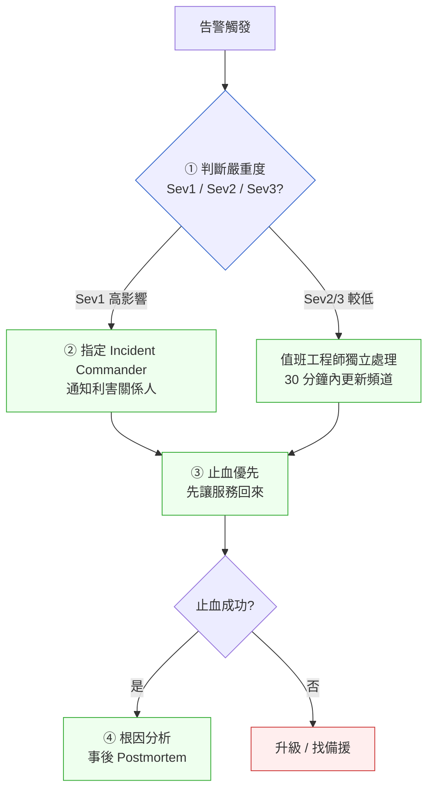

# 第 29 章｜On-call 與事故處理
## ⸺ 凌晨三點的告警,考的不是技術,是判斷

> **前置閱讀**:[第 27 章｜從告警到根因:生產環境除錯](./ch-27-alert-to-rootcause.md) ⸺ 學會讀告警、定位問題再來這章
> **前置閱讀**:[第 26 章｜可觀測性落地](./ch-26-observability.md) ⸺ 事故處理的資訊來源
> **下游章節**:[第 30 章｜SLO/錯誤預算的實作面](./ch-30-slo.md) ⸺ 事故之後,用數據守住邊界

## 29.1 共感現場:那通凌晨三點的電話

你可能也有這樣的記憶。

PingPay 是一家提供跨境即時轉帳的金融科技公司。2025 年某個週四深夜,值班的後端工程師阿銘剛要睡著,手機響了。是 PagerDuty 的告警,說轉帳成功率從 99.7% 跌到 61%,並且還在繼續下滑。

阿銘坐起來,腦子還沒完全清醒。他打開筆電,第一件事是看 Grafana dashboard——一片紅,到處都是紅。接下來呢?他打開了 Slack,想問問有沒有人知道怎麼回事,但又想先自己查一下再說。他切到 application logs,資料量太多,不知道從哪裡看起。十分鐘過去了,他還在翻日誌。

面對一個陌生的故障現場,你知道事情很嚴重,你也想快點找到答案,但不知道「接下來一步」是什麼——這種一直無法推進的時刻,比技術本身更讓人耗盡。

主管在十五分鐘後被另一個告警驚醒,發現 Slack 裡沒有任何狀態更新,趕緊進來問「現在怎麼了」。阿銘回「還在查」。又五分鐘後,客服那邊開始收到用戶投訴,業務主管也進來了,頻道開始變混亂——每個人都在問「有沒有進展」,阿銘面對一堆訊息,更難集中精力查原因。

事故最後查出是一個第三方清算服務的 TLS 憑證到期,一個自動化更新腳本悄悄失敗了。從告警到止血,花了 54 分鐘。技術問題本身不複雜——換一張憑證,切換到備援清算商,不到五分鐘。

那 49 分鐘花在哪裡?花在「不知道接下來要做什麼」上面。

這不是阿銘的問題。沒有人天生就知道事故現場該怎麼走。事故處理是一套需要被學習的技藝,而且在平靜的時候不容易練到——偏偏它又在最緊張的時候被需要。

## 29.2 真正的問題:事故的代價,大多不是技術成本

我們把阿銘那個夜晚慢慢拆開,你會發現一件有點反直覺的事:整個過程裡,技術問題的比重其實不大。換憑證、切備援清算商——五分鐘。可是事故拖了 54 分鐘。

也就是說,那 49 分鐘裡消耗的東西,不是「技術難度」,而是另外三件事:

### 29.2.1 為什麼是判斷,而不是技術

在我們拆解那三件事之前,值得先停下來想一個問題:為什麼相同性質的技術問題,有的團隊 5 分鐘止血,有的團隊 54 分鐘?這不是技術能力的差異——查出 TLS 憑證到期不需要高深的技術水平,任何中級工程師都查得出來。

差異在於:事故發生的當下,工程師腦子裡有沒有一條「接下來做什麼」的路。

這條路,不是靠技術能力臨時想出來的。它是靠**提前設計的流程**在壓力下被執行出來的。認知心理學裡有個概念叫「認知負荷(Cognitive Load)」——當一個人同時要處理太多決策,每一個決策的品質都會下降。凌晨三點、告警持續響、Slack 不斷跳訊息,這種情境下的認知負荷極高。此刻如果還要「現場決定接下來做什麼」,出錯的機率很高。

提前設計好的流程,本質上是「把決策的成本從壓力下移到平靜時」。平靜時做好的決定,在壓力下直接執行,不需要再思考。這就是為什麼這一章的副標說「考的不是技術,是判斷」——判斷的品質,在事故之前就已經決定了。

### 29.2.2 三個讓事故代價膨脹的根因

正是因為有這個認知負荷的背景,我們才能理解阿銘那晚的三個問題不是個人失誤,而是**系統性缺失**。

**一、決策空白。** 阿銘知道有事情壞了,但沒有清楚的「接下來做什麼」的路。他同時要 debug、要回報狀態、要回應主管——這三件事互相搶奪注意力。

這裡有個認知科學的背景值得了解。大腦在高壓下處理並行任務時,並不是真正「同時進行」,而是快速在任務之間切換——心理學上叫「任務切換(Task Switching)」。每一次切換都有可觀的認知成本:從一個思維脈絡跳到另一個,大腦需要時間重新聚焦,不是切回去就能立刻恢復原本的專注深度。阿銘那晚的情況,就是在 debug(需要深度專注)、回應 Slack(需要切換情境)、評估是否升級(需要做判斷)之間不斷切換。每一次切換都讓除錯效率大幅下降。

**二、資訊真空。** 頻道裡沒有狀態更新,每個人都不知道現在進展到哪,於是大家都開始發問。

沒有更新為什麼會導致「噪音」?因為人在不確定的情況下會主動尋找資訊,而阿銘不是唯一一個處在不確定裡的人——主管、客服、業務主管,每個人都在各自的不確定中,獨立地想弄清楚「現在怎麼了」。找不到答案,就用「發問」來填補空白。結果是,原本只是一個人(阿銘)要查的問題,變成十幾則「有進展嗎」「需要我幫什麼」「現在狀況怎樣」同時出現在頻道裡。這些發問本身都是善意的,但累積起來,原本一個人的查詢負擔,就變成了阿銘被打斷十幾次的認知成本——他每一則都要花時間判斷「我需要回這個嗎」,這個判斷本身,就是更多的認知負荷。

**三、止血與根因的混淆。** 阿銘一直在「找原因」,但事故現場其實有更緊迫的事:先讓服務回來。

有時候工程師會問:「不查清楚原因就動手,不是更危險嗎?」這個疑問很合理,但在 Sev1 現場其實是一個迷思。**止血動作(rollback、切流量、Feature Flag 關閉)本身是低風險的可逆操作**——做了可以回復,效果也立竿見影。「先查根因再動」的問題是:找根因可能要一個小時,但這一個小時裡服務繼續中斷,用戶繼續受影響,而且你可能在那一個小時裡什麼都沒查到。止血和根因分析不是競爭關係,而是**時序問題**:先止血,後根因。

順著這個道理,我們就能看出事故處理的真正難點不是「能不能找到 bug」,而是**在壓力與混亂下,能不能讓正確的事按正確的順序發生**。這是一個協調與判斷問題,不純粹是技術問題。

這也是為什麼成熟的工程團隊會把事故處理當成一套需要設計的流程,而不是靠值班工程師現場臨機應變。臨機應變在壓力下表現最差;提前設計的流程,才能在壓力下被執行。

## 29.3 一起做判斷:事故處理的四個節點

那麼,一個設計得好的事故處理流程長什麼樣?我想用四個節點來帶你看,它們按時間順序排列,每個節點都有一個明確的問題要回答。



**節點一:嚴重度分級(Severity Level)**

第一件事不是「找原因」,而是「這件事有多嚴重」。嚴重度決定接下來的資源投入規模。一個好用的分級大概是這樣:

| 等級 | 判斷依據 | 需要的動作 |
|---|---|---|
| **Sev1** | 核心服務中斷或資安事件,用戶大面積受影響 | 立刻叫人,指定 IC,每 15 分鐘外部更新 |
| **Sev2** | 重要功能降級,有一定規模用戶受影響 | 值班 + 備援待命,每 30 分鐘內部更新 |
| **Sev3** | 邊緣功能異常或潛在問題,尚未顯著影響用戶 | 值班工程師獨立處理,記錄 ticket 即可 |

分級不必精確,大方向對就好。阿銘那晚的事件是 Sev1——轉帳成功率跌破 70%,直接影響資金流動。這個等級的事件,值班工程師不應該一個人扛。

**灰色地帶:那些不好分級的情境**

分級表看起來清楚,但實務中常有讓人猶豫的邊界案例。例如:成功率 85%、延遲翻倍、客訴開始湧入——這算 Sev1 還是 Sev2?

為什麼會猶豫?因為多數人下意識用「指標有沒有跌破某條線」來判斷 Sev1,而 85% 這個數字剛好卡在「看起來還沒崩,但也不算正常」的模糊地帶,所以拿不定主意。但 Sev1 真正的判斷標準,從來就不是某條線,而是「這件事有沒有在主動傷害用戶」——一旦你開始認真思考「這會不會傷害用戶」,通常代表真實的傷害已經在發生了。順著這個道理:成功率 85% 意味著每 7 筆轉帳就有 1 筆失敗,對一個金融服務來說,這已經是主動傷害,不是「降級」。所以一個好用的判斷原則是:**如果你在猶豫「這算不算 Sev1」,那八成已經是了。**

另一個常見的邊界:深夜告警、但目前只有少量流量受影響——算 Sev1 嗎?這裡要看「潛在擴散性」。如果問題只發生在特定條件下(例如只影響某一種幣別、某一個節點),可以先用 Sev2 處理,但要設一個「如果 30 分鐘內沒止血就升 Sev1」的觸發條件。不要讓分級決策本身拖太久——分級的目的是快速啟動正確規模的資源,不是要做一個精準的診斷。

**節點二:指定事故指揮官(Incident Commander,IC)**

Sev1 觸發之後,第一件事不是除錯,而是**指定一個人來統籌協調**——這個角色叫事故指揮官(Incident Commander,IC)。IC 不一定是最懂技術的人,但必須是那個負責「流程往前走」的人。

IC 的職責很清楚:維持頻道秩序、推進決策、對外輸出狀態更新。IC 通常不做技術除錯,把這件事留給最懂那個系統的人。兩個角色分開,彼此不會互相干擾。

> IC 不是要搶指揮權,而是讓「誰在查技術」和「誰在管頻道秩序」這兩件事各有人負責,不互相消耗。

**IC 在第一個 15 分鐘裡要做什麼**

很多工程師第一次扮演 IC 時,不確定「我現在應該做什麼」。這裡列出一個具體的行動順序:

1. **宣告事故開始**:在事故頻道發一條訊息,說明「這是一個 Sev1 事故,我是 IC,現在開始統籌」。這個宣告讓頻道有了秩序感。
2. **確認技術負責人**:「誰最懂這個系統?請你全力除錯,其他事情交給我。」明確的角色分配,讓技術工程師可以放下「我還要回應嗎」的顧慮。
3. **通知利害關係人**:按照預先定義的清單通知——主管、客服、必要時業務單位。不要讓他們因為不知道狀況而主動湧入頻道發問。
4. **設下第一個 15 分鐘更新的計時器**:無論進展如何,15 分鐘後就在頻道更新一次狀態。

**IC 不要做的事**也很重要:不要主動去除錯(除非沒有其他人),不要回應頻道裡的每一個問題(選擇性回應即可),不要在沒有新資訊時發「還在查」——等有實質進展再更新。

**節點三:止血優先於根因(Stop the Bleeding First)**

這是事故處理裡最反直覺、也最重要的一條原則:**先讓服務回來,再找原因**。

工程師的本能是找到「為什麼壞了」。但在 Sev1 事件裡,找到原因之前可能要一個小時——這一個小時裡,服務可能已經靠 rollback(回滾)、切流量、重啟服務等手段先恢復。讓用戶先能用,是優先於「搞清楚為什麼」的事。

止血的常見手段依速度排列:

| 手段 | 適用情境 | 時間成本 |
|---|---|---|
| **Rollback(回滾)** | 最近有部署,可以先退版 | 分鐘級 |
| **切流量(Traffic Shift)** | 有多個節點或區域,可以繞開問題機器 | 秒到分鐘 |
| **關閉功能(Feature Flag)** | 問題功能可獨立關閉而不影響整體 | 秒級 |
| **重啟或重新部署** | 狀態問題、記憶體洩漏、僵化的連線 | 分鐘級 |
| **擴容** | 流量突增、容量不足 | 分鐘到小時 |

注意,這個表格裡的動作,幾乎不需要知道根因就能做到。先試最快的幾個,如果有一個讓成功率回升了,那服務就先恢復了——根因可以之後再查。

**關鍵補充:止血後要留下記錄**

止血是暫時的動作,有時候並不解決根本問題。做了止血動作之後,在頻道留一行記錄:「已回滾至 v2.3.1,成功率回升至 98%。根因尚未確認,將在服務穩定後繼續調查。」這行記錄有兩個作用:讓所有人知道服務已經回來了,同時明確說明後續還有工作要做,避免「止血後大家就散了」的情況。

**節點四:事後分析(Postmortem,事後檢討)**

服務恢復後,才是真正查根因的時候。這個階段的產出是一份「事後分析報告(Postmortem,事後檢討)」,它的目的不是追責,而是讓這件事不再發生。

Postmortem 的核心問題只有三個:
1. 發生了什麼?(事件時間軸)
2. 根本原因是什麼?(5 Why 或 Fishbone 分析)
3. 我們怎麼讓它不再發生?(action items,附負責人與截止日)

寫 Postmortem 的原則是「無責任文化(Blameless Postmortem)」——紀錄的是「系統與流程的問題」,不是「誰的錯」。原因是:追責讓人不敢說實話;說不出實話的 Postmortem 就沒有真正的根因。

Blameless 不是說「沒有人有責任」。它是說:我們相信每個人在當時的資訊條件與壓力下,做了他能做到的最好決策。如果結果不好,問題在於系統設計、流程設計、或資訊提供——這些是可以改善的,不是靠「下次小心一點」能解決的。

## 29.4 容易絆倒的地方

從阿銘的例子,以及很多工程師的 on-call 經驗裡,有幾個地雷特別常見。這裡不是要嚇你,而是讓你下次遇到的時候,心裡有個底。

---

**絆倒處一:一個人扛 Sev1,不叫人。**

值班工程師有時候會想「再查一下再說,叫人好像大題小作」。這個心態有它的深層原因——沒有人想給別人添麻煩,特別是深夜叫醒別人這件事,這是一種很自然的社會焦慮:不想因為「還不確定」就打擾到別人的睡眠。

但這個顧慮,恰好和 Sev1 現場的真實情況相反。Sev1 的本質是「一個人的注意力不夠用的情境」——當你同時要除錯、要管頻道、要做決定,三件事都做得不夠好,再加上壓力下的認知負荷,你做的每一個判斷品質都在下降。也就是說,「要不要叫人」這個猶豫本身,正在消耗你當下最稀缺的資源(壓力下的認知能力),去做一個原本應該在平靜時就訂好規則的決定。這就是為什麼系統設計要把這個猶豫直接拿掉,而不是留給值班工程師在凌晨三點獨自權衡。

還有一個心理機制值得留意:「確認偏誤(Confirmation Bias)」——在壓力下,人傾向於「先找到一個看起來像原因的東西」再停下來,而不是系統性地測試假設。一個人獨自除錯時,這個偏誤更難被發現。第二雙眼睛不只是更多的人力,而是打破這個偏誤的結構性方式。

> **修正方向**:定一條清楚的線:只要成功率跌破 X%,或者超過 Y 分鐘還沒止血,就主動升級。不要等「確定嚴重了」再叫人——那時候通常已經晚了。

---

**絆倒處二:頻道裡「還在查」三個字循環出現。**

沒有資訊的更新,不代表沒有進展——但旁觀者不知道這件事。於是每個人開始問「有沒有進展」,IC 或值班工程師要一邊回應一邊查,效率大幅下降。

為什麼會發生這個情況?通常有兩個根本原因:第一是沒有人被明確指定「負責更新頻道」——如果 IC 也在除錯,這件事就沒有人記得做。第二是沒有「固定更新頻率」的慣例——當更新是「有感覺了再更新」,就容易變成「一直沒有感覺所以一直沒更新」。

這也有心理學背景。人在壓力下的「時間感」會失準——主觀覺得過了五分鐘,可能實際上已經過了二十分鐘。沒有計時提醒的 IC 或值班工程師,很容易就讓頻道靜默了半小時。

> **修正方向**:每 15 分鐘(Sev1)或 30 分鐘(Sev2)固定發一次更新,格式不用複雜:「現在時間 / 目前狀況 / 下一步」三行就夠。讓頻道有節奏,大家就不會隨意插話。建議 IC 在事故開始時就設一個實體計時器或手機倒計時,不要依賴「記得更新」。

---

**絆倒處三:止血前先寫了完整的根因分析。**

有工程師習慣「不弄清楚原因不動手」,覺得不確定原因就做動作很危險。這個謹慎在非緊急情況是美德,但 Sev1 現場是例外。

為什麼這個謹慎習慣在 Sev1 會失效?有兩個原因。第一,在 Sev1 現場,你的「找到原因再動手」是在告訴用戶「你們多等等,我要先搞清楚」——但用戶的損失是實時發生的。第二,止血動作本身(rollback、切流量、Feature Flag)都是**可逆的低風險操作**,做了可以復原。「不確定就不動手」的前提是「動手的代價很高、難以逆轉」——但止血動作剛好相反。

還有一個常見迷思:「如果我不知道原因就切換到備援,萬一備援也有問題怎麼辦?」這個擔憂很正常,但解法不是「等查到原因再切換」,而是「切換備援的同時,觀察指標是否往好的方向走,如果五分鐘內沒改善就考慮下一個止血手段」。把止血當成**假設驗證**的動作——「如果切備援能讓成功率回升,說明問題在主要清算商」——比純粹「先找再動」更有效率。

> **修正方向**:接受「止血動作可能只是暫時的」這個現實。先回滾或切流量讓服務回來,打一行 log 記錄「此為暫時止血,根因待查」,然後進入根因分析。服務回來的每一秒,都比「等我搞清楚再動」更值錢。

---

**絆倒處四:Postmortem 寫了,但 action items 沒有人盯。**

Postmortem 文件寫得很漂亮,列了五條改善事項,但兩個月後再看,一條都沒做。這比沒寫還讓人洩氣,因為它讓人覺得「寫了也沒用」。

為什麼會發生這種情況?根本原因是 action items 沒有被「放進現有的工作流程」。Postmortem 通常在事故後的兩三天內完成,此時工程師心有餘悸,動力也強。但如果這些 items 只是存在一份 Google Doc 裡,而沒有被放進 sprint backlog,它們就會慢慢被日常工作淹沒。

還有一個常見問題:Postmortem 裡的 action items 描述太模糊。「改善告警系統」不是一個 item——「為所有第三方 TLS 憑證加 30 天到期預警告警,並在 staging 環境驗證」才是。模糊的 item 沒辦法被排進 sprint,因為工程師不知道要花多少時間。

> **修正方向**:action items 每一條都必須有名字和截止日,並且在下一次 sprint 開始前進 backlog。沒有被排進 sprint 的 action item,等於還沒有被承諾——別讓 Postmortem 只是一份「讀完就算」的文件。

---

**絆倒處五:On-call 輪值設計得讓人耗盡。**

有些團隊的 on-call 輪值是一個人扛整週,包含週末;或者告警量太大,每晚都響。這種設計下,工程師幾週後就會心力交瘁,反應速度反而更慢。

為什麼會設計出這樣的輪值?通常不是惡意的,而是「默認延續」。告警沒有人系統性地清理,所以噪音越來越多;輪值週期沒有人重新設計,所以一直是「一個人扛一週」。工程師逐漸接受「on-call 就是會睡不好」,把它當成工作的一部分——而不是把它當成一個「需要被設計改善」的問題。

這裡有個惡性循環值得注意:當工程師因為 on-call 疲憊而反應變慢,事故處理的品質下降,Postmortem 的 action items 也沒有精力跟進——於是告警量沒有改善,下個輪值的人還是很累。打破這個循環,需要把 on-call 設計本身當成一個「需要有人負責」的系統問題。

> **修正方向**:健康的 on-call 有幾個設計原則:輪值週期不超過一週、每週有一到兩天「不值班」的緩衝、告警必須是可操作的(不能是「不知道怎麼處理」的噪音告警)。告警數量如果超過工程師能從容消化的量,是系統設計問題,不是值班工程師的問題。每個月統計一次「每次 on-call 的告警數量與應對時間」,把它放在工程週會上討論——可見才可改善。

## 29.5 帶得走的工具 ⸺ 一頁式「事故處理 Runbook」

下面是一份空白模板。它的設計原則是:凌晨三點被電話叫醒的人,能在五分鐘內看完並知道下一步。欄位不多——能多少就多少。

```text
事故處理 Runbook ⸺ {服務名稱}
版本:{YYYY-MM-DD}

=========================================
一、告警觸發後的前五分鐘
=========================================

嚴重度評估:
  □ Sev1:核心服務中斷 → 立刻執行下面的「Sev1 流程」
  □ Sev2:重要功能降級 → 通知備援,自行處理,30 分鐘更新頻道
  □ Sev3:邊緣功能異常 → 記錄 ticket,正常班處理

Sev1 流程:
  1. 到 #{事故頻道} 發出「🚨 Sev1 事故開始,我是值班,正在評估」
  2. 指定 IC(如無人主動,值班工程師暫代)
  3. 通知 {on-call 負責人清單}

=========================================
二、止血手段(依序試)
=========================================

  □ 回滾到上一個穩定版本:{回滾指令或連結}
  □ 切流量繞開問題節點:{traffic shift 指令}
  □ 關閉問題 Feature Flag:{Flag 名稱 / 操作位置}
  □ 重啟服務:{restart 指令}
  □ 升級或聯絡 {第三方廠商}:{聯絡方式}

=========================================
三、頻道更新節奏
=========================================

  格式:「[HH:MM] 狀況:{一句話} / 下一步:{一句話}」
  Sev1:每 15 分鐘更新一次
  Sev2:每 30 分鐘更新一次

=========================================
四、服務恢復後
=========================================

  □ 確認指標回穩(成功率 / 延遲 / 錯誤率)
  □ 在頻道發「✅ 服務恢復,事故結束」
  □ 48 小時內完成 Postmortem 初稿
  □ 下次 sprint 排入 action items

=========================================
五、Postmortem 模板(事後填)
=========================================

事件摘要:{一兩句說明發生了什麼}

事件時間軸:
  HH:MM  {告警觸發}
  HH:MM  {...}
  HH:MM  {服務恢復}

根本原因:{為什麼會發生}

貢獻因素:{哪些系統或流程讓問題更嚴重或更難察覺}

Action Items:
  - {改善事項}  負責人:{名字}  截止:{日期}
```

為什麼只有五個區塊?因為事故現場的人沒有時間讀長文。這份模板要能在五分鐘內讀完並知道第一個動作。欄位再多,大家就不看了——不看的 Runbook,和沒有 Runbook 沒有差別。

### 29.5.1 填表指南

在看範例之前,先了解每個欄位背後的設計邏輯,會讓你在替自己的服務填表時更清楚「填什麼、為什麼這樣填」。

**版本日期**:Runbook 是活文件,半年沒更新的 Runbook 裡的指令和聯絡人很可能已經過期。看到版本日期過舊,要先確認指令還有效再執行。建議每次事故後都更新版本日期,即使內容沒有大幅變動。

**嚴重度評估的判斷標準**:不要用「核心服務」這種模糊描述——要量化。「成功率 < 80% 且持續超過 5 分鐘」比「服務不正常」更容易在凌晨三點快速判斷。每個服務的閾值不同,填表時要根據你服務的 SLO(服務等級目標)來訂。

**止血手段的順序**:順序很重要——先列最快、最低風險的手段。Rollback 和 Feature Flag 通常是最快的,應該排在前面。「聯絡第三方廠商」通常最慢,排在最後。每個手段要有具體的指令或連結,不是「回滾到舊版」而是「`./scripts/rollback.sh <previous-tag>`」。

**通知清單的格式**:列有名有姓的人,不要只寫「相關人員」。壓力下大腦會空白,清楚的名字讓值班工程師不用思考直接執行。聯絡方式也要明確:是 Slack 私訊、電話還是 Email?什麼情況下用哪個管道?

**Postmortem 的貢獻因素 vs 根本原因**:這兩欄要分開。根本原因是「為什麼壞了」;貢獻因素是「為什麼這麼久才止血、或為什麼我們沒有提前預防」。兩個都要修,但優先順序不同——根本原因通常更緊急。

**Action Items 的寫法**:每個 item 要能被一個工程師在一個 sprint 內完成。「改善監控」不是一個 item。「為所有外部依賴的 TLS 憑證加 30/14/7 天預警告警,並確認告警在 staging 環境驗證有效」才是一個 item。

### 29.5.2 範例:PingPay 的 Sev1 Runbook

讓我們回到阿銘那個夜晚。如果 PingPay 當時有一份下面這樣的 Runbook,那五十幾分鐘裡的大部分混亂,其實是可以避免的。

```text
事故處理 Runbook ⸺ PingPay 轉帳核心服務
版本:2025-11-01

=========================================
一、告警觸發後的前五分鐘
=========================================

嚴重度評估:
  □ Sev1:轉帳成功率 < 80% 且持續超過 5 分鐘 → 立刻執行下面的「Sev1 流程」
  □ Sev2:轉帳延遲 > 10s 但成功率 > 90% → 通知備援,30 分鐘更新
  □ Sev3:單一幣別結算延遲 → 記錄 ticket,正常班處理

Sev1 流程:
  1. 到 #incident-live 發:「🚨 Sev1 開始 [時間] 值班:@阿銘 評估中」
  2. IC:值班工程師,直到主管或 SRE 接手
  3. 通知:@主管 @SRE lead @客服負責人(順序:Slack 私訊 → 電話)

=========================================
二、止血手段(依序試)
=========================================

  □ Step 1 – 確認是否有最近部署
        git log --oneline -5  (看過去 6 小時有無 deploy)
        如有:./scripts/rollback.sh <previous-tag>

  □ Step 2 – 確認第三方清算服務狀態
        curl -o /dev/null -s -w "%{http_code}" https://status.clearpay.io/health
        如 ≠ 200:切換到備援清算商 → ops/switch-clearing.sh --provider backup
        憑證有效期查詢:openssl s_client -connect clearpay.io:443 2>/dev/null | openssl x509 -noout -dates

  □ Step 3 – 關閉高風險 Feature Flag
        LaunchDarkly console → 搜尋 "cross-border-v2" → 關閉
        (此 flag 影響新轉帳路由邏輯;關閉後退回舊路由)

  □ Step 4 – 重啟 transfer-gateway pod
        kubectl rollout restart deployment/transfer-gateway -n payments

  □ Step 5 – 升級聯絡 ClearPay 技術支援
        support@clearpay.io / +886-2-XXXX-XXXX(24h on-call)

=========================================
三、頻道更新節奏
=========================================

  格式:「[HH:MM] 狀況:{一句話} / 下一步:{一句話}」
  Sev1:每 15 分鐘更新一次
  範例:「[03:17] 狀況:成功率 61% 持續中,已排除最近部署因素 / 下一步:查第三方憑證狀態」

=========================================
四、服務恢復後
=========================================

  □ 確認 Grafana dashboard "transfer-health" 連續 5 分鐘 > 99%
  □ 在 #incident-live 發:「✅ [時間] 服務恢復,事故結束,感謝大家」
  □ 48 小時內完成 Postmortem 初稿,發到 #postmortem channel
  □ 下次 sprint planning 前,action items 進 Jira backlog

=========================================
五、Postmortem 模板(事後填)
=========================================

事件摘要:2025-11-07 03:04–03:58,PingPay 跨境轉帳成功率從 99.7% 跌至 61%,
          持續約 54 分鐘,影響約 1,200 筆待處理轉帳。

事件時間軸:
  03:04  Grafana 告警觸發,PagerDuty 通知阿銘
  03:06  阿銘開始查 application log
  03:19  主管被第二條告警驚醒,加入頻道
  03:31  SRE 確認第三方 TLS 憑證到期
  03:36  切換到備援清算商,成功率開始回升
  03:58  成功率回到 99.5%,事故結束

根本原因:ClearPay 清算服務 TLS 憑證於 03:00 到期;
          自動更新腳本因環境變數遺失靜默失敗,無告警。

貢獻因素:
  - Runbook 缺少「第三方憑證狀態」的快速檢查步驟
  - 憑證到期未配置 30 天預警告警
  - 事故頻道無固定更新節奏,導致資訊真空

Action Items:
  - 為所有第三方 TLS 憑證加 30/14/7 天預警告警  負責人:阿銘  截止:2025-11-21
  - 修復憑證自動更新腳本,加入失敗通知        負責人:SRE   截止:2025-11-14
  - 更新 Runbook 加入「第三方憑證快速查」步驟   負責人:阿銘  截止:2025-11-12
  - 建立事故頻道「15 分鐘更新」慣例             負責人:主管  截止:2025-11-15
```

這份範例和阿銘那晚的差別在哪?差別不是工程師更聰明,而是**流程設計幫他在壓力下維持了正確的順序**。Step 2 裡的那行 `openssl` 指令,在阿銘不知道去哪裡找的時候,已經等在他面前了。

這份 Runbook 每一欄背後的考量,呼應的就是 §29.2 分析的三個問題:決策空白(靠嚴重度分級和 IC 流程解決)、資訊真空(靠固定更新節奏解決)、止血/根因混淆(靠「止血手段」區塊和「服務恢復後」清單的先後順序解決)。

一份好的 Runbook,就是你給未來那個凌晨三點被電話叫醒、還沒清醒的自己,準備的禮物。

## 29.6 本章回顧

讀完這一章,你應該已經能:

- [ ] 理解「判斷而非技術」的核心觀點:相同的技術問題,有團隊 5 分鐘止血、有的 54 分鐘,差異在於提前設計的流程品質,不在於技術能力
- [ ] 用嚴重度分級(Sev1/Sev2/Sev3)快速決定要投入多少資源,包含如何處理「成功率 85%、延遲翻倍」這類灰色地帶
- [ ] 理解「指定事故指揮官(Incident Commander,IC)」的作用:讓「查技術」和「管頻道」各自有人負責,並知道 IC 在第一個 15 分鐘應該做什麼、不應該做什麼
- [ ] 記住「止血優先於根因」——服務先回來,根因再查,兩件事可以分開做,止血動作本身是低風險可逆操作
- [ ] 用每 15 分鐘固定更新頻道的節奏,防止資訊真空讓頻道陷入混亂
- [ ] 用無責任文化(Blameless Postmortem)的原則寫事後分析,讓 action items 真的進 sprint 被執行
- [ ] 寫出一份讓自己「凌晨三點讀五分鐘就知道下一步」的 Runbook

如果想先從一件事開始,我會建議——**把你最常被告警叫醒的那個服務,今天就寫一份「止血手段」清單**。不需要完整的 Runbook,只要列出「先試回滾、再試切流量、再試重啟」這樣的順序就夠了。有了這份清單,下一次的凌晨三點,你至少知道第一步要做什麼。這一步做完了,再慢慢把 IC 流程、更新節奏、Postmortem 模板補上去。你已經知道道理了,剩下的是動手的時機。

## Cross-References

- **前置**:[第 26 章｜可觀測性落地](./ch-26-observability.md) ⸺ Runbook 裡的每個指令,都仰賴可觀測性(Observability)基礎設施提供的資訊
- **前置**:[第 27 章｜從告警到根因:生產環境除錯](./ch-27-alert-to-rootcause.md) ⸺ 止血後的根因分析,延續這一章的除錯方法
- **下一章**:[第 30 章｜SLO/錯誤預算的實作面](./ch-30-slo.md) ⸺ 事故發生後,用錯誤預算數據決定下一步怎麼走
- **強連結**:[第 24 章｜回滾與前向修復決策](../part-05-delivery/ch-24-rollback.md) ⸺ 止血手段裡的「回滾(Rollback)」,這章有更完整的判斷框架
- **強連結**:[第 44 章｜一次生產事故的完整復盤](../part-09-synthesis/ch-44-incident-postmortem.md) ⸺ 把本章的 Postmortem 框架展開成完整的復盤案例
- **跨書連結**:[SA/SD Playbook Ch 30｜可靠性工程治理](https://github.com/EddyKuo/sa-sd-playbook) ⸺ SLO、錯誤預算、Chaos Engineering 的架構層設計
