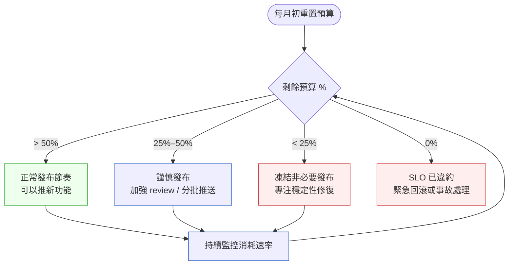

# 第 29 章｜SLO 與錯誤預算的實作面
## ⸺ 從「不能掛」到「可以掛多少」的思維轉換

> **前置閱讀**:[第 25 章｜可觀測性落地(log/metric/trace)](./ch-25-observability.md)、[第 28 章｜On-call 與事故處理](./ch-28-on-call.md)
> **下游章節**:[第 30 章｜災難復原演練](./ch-30-disaster-recovery.md)

## 29.1 共感現場:「我們的目標是零停機」

你可能也在 sprint planning 裡聽過這句話。

有一組工程師在一家叫 LucidPay 的支付公司工作,負責轉帳核心服務。某一季,PM 在路線圖裡寫下:「Q3 目標:轉帳服務達到 99.99% 可用性」。這個數字聽起來很厲害,工程師們也沒有反駁——畢竟「高可用」是每個人都想要的事情。

接下來幾個月,只要發生任何一次告警,不管是深夜三點還是週五下班前,on-call 工程師就得衝進去看。即使只是一個短暫的 spike、即使影響範圍只有 0.1% 的請求、即使五秒後就自動恢復了。「因為我們的目標是零停機嘛。」

這樣下去,有幾件事同時發生了。第一,工程師開始告警疲勞(alert fatigue),收到通知的反應從「立刻看」慢慢變成「這次應該也是假警報」。第二,新功能的部署速度開始放慢——因為任何變更都可能「違反目標」,所以大家開始猶豫,review 一次不夠再 review 一次。第三,那個 99.99% 的目標到底有沒有達成?沒人說得清楚,因為從來沒有人好好定義過:用什麼量測?在哪段時間窗口內?從哪個觀察點量?

到了季末,工程師累、PM 也不確定到底算不算達標。這一切,並不是因為大家不努力,而是因為「可用性」這件事,從來沒有被說清楚過。

## 29.2 真正的問題:「不能掛」是一個沒辦法被測量的目標

我們把這件事慢慢拆開來看。

LucidPay 那個「99.99% 可用性」目標出了什麼問題?表面上看起來是個數字,但它其實缺少了三件關鍵的事:

**第一,沒有定義「可用」是什麼意思。** 轉帳服務「可用」指的是:HTTP 200?p99 延遲在 500 ms 以內?成功完成轉帳的比例超過某個門檻?這三個定義在大多數時候差不多,但在真正出事的時候,它們的行為可以差很遠。這件事叫做 SLI(服務層級指標,Service Level Indicator)的定義,而沒有它,後面所有的數字都是空的。

**第二,沒有決定「多少才夠」。** 99.99% 和 99.9% 在一年內的差距,是從大約 52 分鐘變成 8.7 小時的不可用時間。這個差距意味著完全不同的工程投入,也意味著不同的運維成本。但更重要的是:這個目標是從客戶的真實需求來的,還是隨口說說的?

**第三,沒有建立「用完了怎麼辦」的機制。** 這才是最核心的缺失。SLO 的設計初衷不只是量測,而是提供一個**決策框架**:當錯誤預算(error budget)還充裕的時候,團隊可以大膽推進新功能;當錯誤預算快燒完的時候,暫停發布、優先修穩定性。這個框架讓「要不要發布」這個問題,從主觀判斷變成數字驅動。

也就是說,真正的問題不是工程師不夠努力——而是「可靠性」這件事從來沒有被量化成**可以用來做決策的東西**。

順著這個道理,我們就能看懂為什麼 SLI → SLO → 錯誤預算這三個概念要一起談:它們是一條因果鏈,缺了任何一環,整件事就會回到「我們的目標是零停機」這個聽起來很好、但沒辦法落地的狀態。

## 29.3 一起做判斷:從 SLI 到燃燒率告警

那麼,這條因果鏈實際上怎麼搭建?我們一步一步來。

### 29.3.1 第一步:定義 SLI — 量什麼?從哪裡量?

SLI 是一個比率,通常的形式是:

> **好的事件數 / 總事件數**

「好的事件」的定義,決定了整件事的品質。以下是幾個常見的選擇:

| 服務類型 | 常見 SLI 定義 | 注意事項 |
|---|---|---|
| HTTP API | 成功回應(2xx/3xx)/ 總請求數 | 要區分「客戶端錯誤(4xx)」與「我們的錯誤(5xx)」,前者通常不算入 |
| 轉帳/支付 | 成功完成交易 / 總發起交易 | 注意「最終一致」場景:非同步完成的要另外追蹤 |
| 延遲型 SLI | p99 延遲 < 1 秒的請求 / 總請求數 | 不要只看平均值——平均值掩蓋長尾 |
| 批次任務 | 在期限內完成的 job / 總 job 數 | 「成功」不只看結果,也要看時效 |

一個好用的角度是:先問「**使用者什麼時候會覺得服務壞了?**」然後把那個感受量化成一個可以量測的比率。以 LucidPay 的轉帳服務為例,比較合適的 SLI 定義可能是:

- **可用性 SLI**:HTTP 5xx 以外的回應 / 總 API 請求數
- **延遲 SLI**:p99 延遲 < 800 ms 的轉帳請求 / 總轉帳請求數

定義好「什麼叫好的事件」之後,下一個同樣關鍵的選擇是:**從哪裡量?** 這決定了 SLI 數據的真實性。

**量測點的折衷:四個層級的選擇**

SLI 的定義只解決了「量什麼」——但同樣重要、也常常被忽略的,是「**從哪裡量**」。量測點的選擇會直接影響數字的真實性,而不同層級各有取捨:

| 量測層級 | 優點 | 缺點 | 適合情境 |
|---|---|---|---|
| 客戶端(SDK / 瀏覽器) | 最接近使用者真實體驗;能捕捉網路層問題 | 部署與維護成本高;客戶端版本分散難統一 | 面向 C 端的產品;有 RUM(Real User Monitoring)基礎設施 |
| 負載平衡器 | 相對容易取得;涵蓋進入服務的所有流量 | 看不到客戶端到負載平衡器之間的網路延遲 | 大多數 B2B API 的首選量測點 |
| 服務端(應用程式本身) | 最精確反映應用程式行為;除錯友好 | 漏掉負載平衡器層的問題;自我量測有盲點 | 微服務間的 SLI;與 tracing 整合較容易 |
| 合成監控(Synthetic) | 可模擬真實用戶操作;即使沒有真實流量也能量 | 有代表性問題——模擬行為未必真實;維護成本高 | 流量低的服務;對外 SLA 驗證的輔助手段 |

正因為每個層級各有盲點,實務上常見的做法是**分層組合**:負載平衡器量測作為主 SLI,搭配合成監控作為輔助(確保在低流量時段仍有訊號),如果有條件,再加上少量客戶端錯誤追蹤。無論選哪種組合,最重要的一件事是:**把你選的量測點寫進 SLO 文件**,讓每個讀到這份文件的人都知道「這個數字代表的是哪一側的視角」。

LucidPay 的案例最終選擇了 Nginx 負載平衡器層,理由是:介於使用者與服務之間、數據容易取得、也能捕捉到服務本身 crash 時的失敗請求。這不是唯一正確的答案,但它是一個**有意識做出來的選擇**——而這正是 SLI 定義最核心的要求。

### 29.3.2 第二步:設定 SLO — 多少才夠?

SLO(服務層級目標,Service Level Objective)是你承諾要維持的 SLI 水準,以及量測的時間窗口。

一個常見的誤區是把 SLO 設得越高越好。想像 SLO 從 99.9% 升到 99.95%,一個月允許的失敗時間窗就從 40 分鐘縮到 20 分鐘。結果是什麼呢?任何一次 30 分鐘的部署測試,即使只造成 0.1% 的失敗,也會立刻吃掉整月預算的一半。**這就是「空間變少」的含義**——越高的目標,越小的錯誤預算,意味著**越少的空間做任何會有風險的事**。所以 SLO 應該反映的是「客戶真正需要的可靠性」,而不是「工程師覺得應該達到的完美」。

一個好用的角度:先問你的客戶(或 PM)「如果服務中斷 X 分鐘,你們會受到什麼影響?」然後從那個答案反推合理的 SLO。

以下是時間窗口的選擇對照:

| 時間窗口 | 特性 | 適合情境 |
|---|---|---|
| 滾動 28 天 | 始終反映最近四週的現況 | 大多數服務的預設選擇 |
| 日曆月 | 與合約/報告週期對齊 | 對外 SLA 承諾時 |
| 滾動 7 天 | 反應更敏感 | 快速迭代、需要即時回饋 |

LucidPay 的轉帳服務,設定如下會比較合理:

- **可用性 SLO**:99.9%,滾動 28 天(容許 ~40 分鐘/月的失敗窗口)
- **延遲 SLO**:p99 < 800 ms,99.5%,滾動 28 天

### 29.3.3 第三步:計算錯誤預算 — 還剩多少可以「燒」?

一旦 SLO 定下來,錯誤預算就自動計算出來了:

> **錯誤預算 = (1 - SLO) × 時間窗口內的總請求數**

以 99.9% 可用性、每天 1,000,000 次請求、28 天為例:
- 總請求數:28,000,000
- 允許失敗次數:28,000,000 × 0.001 = **28,000 次**

這 28,000 次失敗就是你的預算。你可以把它花在:
- 部署新功能時的短暫不穩定
- 基礎設施升級時的小波動
- 非預期的邊緣情況

還是花在生產事故上。

**不同場景下的預算計算:三個案例對比**

錯誤預算的意義,在不同的服務特性下差距很大。以下三個案例可以幫你直觀感受「同樣的 SLO 數字,在不同情境下代表完全不同的工程壓力」:

**案例 A:高流量電商 API(每日 5,000 萬請求,SLO 99.9%)**

- 每日允許失敗:50,000 次
- 28 天允許失敗:1,400,000 次
- 聽起來很多?但一次小型發布事故,5 分鐘內錯誤率 10%,就會消耗約 17,000 次——整個月預算的 1.2% 在 5 分鐘內燒掉
- 這類服務的重點在於:**發布流程的安全性**。即使 SLO 看起來「寬鬆」,流量基數讓每次波動都很昂貴

**案例 B:低流量內部 API(每日 10,000 請求,SLO 99.5%)**

- 每日允許失敗:50 次
- 28 天允許失敗:1,400 次
- 聽起來很少?但因為流量小,一次 5 分鐘的完全中斷可能只造成 35 次失敗——佔整月預算 2.5%
- 這類服務的重點在於**雙重盲點**:首先,低流量導致燃燒率波動極大——一次 15 秒的故障就可能讓燃燒率飆到 8x,容易誤觸告警,結果工程師開始習慣性忽略;其次,絕對失敗數本身很小(月預算才 1,400 次),人工檢視時不容易察覺漸進式的消耗,往往到月底才驚覺快燒完了
- 建議補充合成監控作為第二個訊號源,避免低流量造成的數字盲區

**案例 C:支付核心服務(每日 150 萬請求,延遲 SLO p99 < 500ms,達標率 99.5%)**

- 延遲型預算:每日允許超過 500ms 的請求:7,500 次
- 28 天允許:210,000 次
- 支付場景的特殊性:延遲超標比可用性中斷更難察覺,但對使用者的影響(「這筆錢出去了嗎?」的焦慮感)同樣嚴重
- 延遲 SLO 的預算管理建議:要追蹤「延遲超標事件的叢集性」——零散的超標和連續 10 分鐘的超標,工程意義完全不同

這三個案例說明的共同點是:**錯誤預算只有放在具體數字和發布行為的對照下,才會有指導意義。** 光把公式算出來是第一步;真正有用的是養成「每次部署前估一下會花多少預算」的習慣。

用一張圖來看錯誤預算的狀態與對應決策:



### 29.3.4 第四步:燃燒率告警 — 比「超標了」更早知道

只在預算歸零時才告警,太晚了。我們需要的是:在**預算快要燒完之前**,就能察覺到有問題的速率。

這就是**燃燒率(burn rate)**的概念。燃燒率 = 當前錯誤率 / 允許的長期平均錯誤率。

舉例:SLO 99.9% 意味著允許的長期平均錯誤率是 0.1%。如果現在的錯誤率是 1%,那燃燒率就是 1% / 0.1% = **10x**,代表你正在以正常速率的 10 倍消耗預算。

Google SRE Book《Site Reliability Engineering》第 4 章提議的告警設計是雙重窗口(multi-window, multi-burn-rate alerting):

| 告警層級 | 燃燒率 | 短窗口 | 長窗口 | 緊急程度 |
|---|---|---|---|---|
| P1(嚴重) | > 14.4x | 5 分鐘 | 1 小時 | 立即喚醒 |
| P2(警告) | > 6x | 30 分鐘 | 6 小時 | 工作時間內處理 |
| P3(注意) | > 3x | 6 小時 | 24 小時 | 下次迭代審視 |

為什麼要同時看短窗口和長窗口?因為短窗口只看短時間可能觸發假警報(一個偶發 spike);長窗口只看長時間可能反應太慢。兩個條件都成立,才是真正需要注意的訊號。

**燃燒率告警的常見誤區:如何區分真警報與噪音**

理解了雙窗口的設計邏輯之後,再來看幾個實務中容易踩到的坑。這裡的問題不是「設計本身錯了」,而是「參數配置沒有跟著服務特性走」——結果要麼噪音太多、要麼太晚才知道。

**誤區一:對所有服務用同一套參數(14.4x / 6x / 3x)**

這套參數是 Google 針對高流量、流量均勻分布的服務校準出來的。如果你的服務有明顯的流量低谷(例如深夜流量只有高峰期的 3%),低谷期即使發生幾次失敗,燃燒率也可能在短窗口內飆升到 20x 以上,但絕對失敗次數其實只有十幾個。

修正方向:針對低流量時段設定最小觸發閾值(例如短窗口內絕對失敗數 < 100 就不觸發 P1),或者把 P1 告警的觸發條件改成「燃燒率 > 14.4x **且**短窗口絕對失敗數 > 閾值」。

**誤區二:長短窗口的比例設定不當**

雙窗口的設計邏輯是:短窗口捕捉速度、長窗口驗證持續性。兩者的比例大約是 1:12(5 分鐘 vs 1 小時)。如果你把短窗口縮到 1 分鐘、長窗口維持 1 小時,比例變成 1:60,短窗口的代表性太弱,幾乎每次 spike 都會觸發。

修正方向:先從 Google SRE 建議的比例出發,跑三到四週之後看告警紀錄——如果 P2 告警裡超過 40% 最後判定為「不需要處理」,就需要往上調整燃燒率閾值或延長短窗口。

**誤區三:把燃燒率當成「當下錯誤率」解讀**

燃燒率是一個相對速率,不是當下的絕對錯誤率。燃燒率 6x 不代表「現在有 6% 的請求失敗」——對 SLO 99.9% 的服務,它代表「現在的錯誤率是 0.6%,消耗預算的速度是正常速率的 6 倍」。這個區分很重要,因為它決定了你在看 dashboard 時的解讀方式。

修正方向:在 dashboard 上同時顯示「燃燒率(N×)」和「當前錯誤率(N%)」兩個數字,避免讀錯誤的那個。

**誤區四:誤把計畫性維護窗口的錯誤算進 SLO**

如果你在一個計畫性維護窗口內讓服務下線 15 分鐘,這段時間的失敗理論上不應該算進 SLO 的錯誤預算——因為它是預期中的、且提前通知過客戶的。但如果沒有做任何設定,monitoring 系統會照單全收,導致維護結束後預算已經燒掉一大塊。

修正方向:維護窗口開始前,在 monitoring 系統(例如 PagerDuty、Grafana OnCall)建立 Maintenance Window 記錄,讓這段時間的告警靜音、且不計入 SLO 統計。這是一個容易忘記但設定起來很快的習慣。

**這些決策對後續運維的長期影響**

燃燒率告警的配置方式,會直接影響兩件長遠的事:第一是 on-call 工程師對告警的信任程度——如果告警噪音太高,工程師慢慢就會開始忽略它,而這會在真正的問題出現時造成嚴重延誤;第二是發布決策的數字基礎——燃燒率數據準確了,發布前「這個月還剩多少空間」的估算才有意義。

所以在設計燃燒率告警時,不只是在設定參數:你在塑造整個 on-call 文化對「告警」這件事的態度。值得花時間調到對。

## 29.4 容易絆倒的地方

下面這幾個坑,在第一次實作 SLO 的團隊裡幾乎都會碰到。知道它們在哪裡,遇到的時候就不會那麼慌。

**絆倒處一:SLI 量測點放錯了。**

在負載平衡器之前、在服務本身、在客戶端,量出來的數字可以差很多。客戶端看到的才是使用者的真實體驗,但通常最難量。服務端的量測比較容易,但會漏掉網路問題。

> 修正方向:盡量靠近使用者的那一側量測,至少要把「負載平衡器 4xx」和「服務本身 5xx」區分開來記錄。如果只能在服務端量,要誠實地寫進 SLO 文件:「這是服務端可用性,不包含網路層」。

**絆倒處二:SLO 設了但從來不看。**

每個月月底翻出來看一眼,發現「喔我們達標了」然後關掉——這樣的 SLO 只是一個裝飾品。

> 修正方向:把錯誤預算消耗速率做成 dashboard,放在 on-call handoff 的固定議程裡。不是「出問題才看」,而是「每週回顧預算還剩多少」。

**絆倒處三:把 SLO 當成 SLA 來用。**

SLO 是你對**自己**設的目標;SLA(Service Level Agreement)是你對**客戶**的合約承諾。SLO 應該比 SLA 更嚴格——你對自己的要求要高於對外承諾。如果 SLO = SLA,那一違反 SLO 就立刻違約,完全沒有緩衝。

> 修正方向:SLO 至少比對外 SLA 高一個 9,或留 10–20% 的緩衝空間。這個緩衝讓你在接近邊界時有時間介入,而不是直接炸鍋。

**絆倒處四:所有告警都用同一個嚴重程度。**

半夜三點的 P1 告警叫醒 on-call 工程師,結果發現只是一個燃燒率 0.5x 的低速消耗——這就是告警疲勞的來源。

> 修正方向:根據燃燒率的嚴重程度分層告警(如 §29.3.4 的表格)。P1 才值得半夜喚醒;P2 第二天工作時間處理就夠了。「緊急程度分層」是告警可靠性的基礎。

**絆倒處五:錯誤預算燒完了,沒有任何後續。**

預算歸零,發了一個 Slack 訊息說「這個月 SLO 違反了」,然後什麼都沒發生。下個月繼續。

> 修正方向:預算違反要觸發一個固定流程:填寫事後報告(postmortem)、召開穩定性優先會議、暫停非必要的功能發布直到下一個窗口。流程不需要很重,但它要**真的發生**,才能讓 SLO 對發布決策產生約束力。

## 29.5 帶得走的工具 ⸺ 一頁式「SLO 定義與預算追蹤卡」

有了前面的概念,現在來把它變成一個可以貼在 wiki、放進 runbook 的一頁工具。這張卡的目的只有一件事:讓任何一個加入這個服務的工程師,五分鐘內就能知道「我們怎麼定義可靠性、目前預算還剩多少、快燒完時要做什麼」。

```text
SLO 定義與預算追蹤卡 ⸺ {服務名稱}
更新日期:{YYYY-MM-DD}  |  負責人:{on-call team}

━━━ 服務層級指標 (SLI) ━━━━━━━━━━━━━━━━━━━━━━━
可用性 SLI:
  定義:{好的回應類型} / {總請求類型}
  量測點:{負載平衡器 / 服務端 / 客戶端}
  排除項:{哪些請求不算(如健康檢查、客戶端錯誤)}

延遲 SLI(選填):
  定義:p{N} 延遲 < {threshold} ms 的請求 / 總請求數
  量測點:{同上}

━━━ 服務層級目標 (SLO) ━━━━━━━━━━━━━━━━━━━━━━━
可用性 SLO:{NN.NN}%  |  時間窗口:{滾動 28 天 / 日曆月}
延遲 SLO:{NN.NN}%    |  時間窗口:{同上}

對外 SLA(如有):{NN.NN}%  ← 此值應低於 SLO

━━━ 錯誤預算 ━━━━━━━━━━━━━━━━━━━━━━━━━━━━━━━━━
月均請求量:{N} 次 / 28 天
允許失敗次數:{N} 次(= 月均請求量 × (1 - SLO))
當前剩餘:{N} 次  |  剩餘 %:{N}%  |  更新時間:{timestamp}

燃燒率 Dashboard 連結:{URL}

━━━ 告警策略 ━━━━━━━━━━━━━━━━━━━━━━━━━━━━━━━━━
P1 喚醒:燃燒率 > {N}x,短窗 {N} 分鐘 + 長窗 {N} 小時
P2 通知:燃燒率 > {N}x,短窗 {N} 分鐘 + 長窗 {N} 小時

━━━ 預算狀態與對應決策 ━━━━━━━━━━━━━━━━━━━━━━━
> 50%  → 正常發布節奏
25–50% → 謹慎發布:加強 review,分批推送
< 25%  → 暫停非必要發布,專注穩定性
  0%   → 緊急處理;填寫 postmortem;下月初討論是否調整 SLO

━━━ 聯絡與參考 ━━━━━━━━━━━━━━━━━━━━━━━━━━━━━━
Runbook:{URL}  |  On-call Rotation:{URL}  |  SLA 文件:{URL}
```

這張卡欄位設計的邏輯是:從「量什麼」到「多少才夠」到「還剩多少」到「快燒完時怎麼辦」,每一個欄位都有它要回答的問題。空白的地方越少,表示 SLO 實作越踏實。

### 29.5.1 範例:LucidPay 轉帳服務的 SLO 卡

回到本章一開始的 LucidPay。在那個季度之後,他們的 SRE 和工程師一起坐下來,把之前模糊的「99.99% 可用性目標」,重新整理成這張卡。整理的過程並不輕鬆——最難的不是填欄位,而是第一次認真地問:「我們系統最大的使用者每天打多少次 API?」那個數字很多工程師從來沒查過。

```text
SLO 定義與預算追蹤卡 ⸺ LucidPay 轉帳核心服務 (transfer-api)
更新日期:2026-05-30  |  負責人:payment-sre-team

━━━ 服務層級指標 (SLI) ━━━━━━━━━━━━━━━━━━━━━━━
可用性 SLI:
  定義:非 5xx 回應 / 總 API 請求(不含健康檢查)
  <!-- 為什麼這欄:「2xx only」會把正常的 3xx redirect 算成失敗;「非 5xx」
       才真正代表「服務本身出了問題」。不排除健康檢查,數字會被稀釋。 -->
  量測點:Nginx 負載平衡器層(upstream_status)
  排除項:GET /healthz、客戶端認證錯誤(401/403)

延遲 SLI:
  定義:p99 延遲 < 800 ms 的轉帳請求 / 轉帳請求總數
  <!-- 為什麼這欄:用平均值會掩蓋長尾;p99 代表 100 個請求裡最慢的那一個。
       對支付場景,使用者等超過 1 秒就會開始擔心「轉出去了嗎?」。 -->
  量測點:Nginx 負載平衡器層

━━━ 服務層級目標 (SLO) ━━━━━━━━━━━━━━━━━━━━━━━
可用性 SLO:99.9%  |  時間窗口:滾動 28 天
延遲 SLO:99.0%    |  時間窗口:滾動 28 天
<!-- 為什麼 99.9% 而非 99.99%:後者一個月只容許 ~4 分鐘失敗,需要複雜多活架構;
     現在的客戶合約 SLA 是 99.5%,99.9% SLO 留了足夠的緩衝,也與架構能力對齊。 -->

對外 SLA:99.5%(見企業合約 §4.2)

━━━ 錯誤預算 ━━━━━━━━━━━━━━━━━━━━━━━━━━━━━━━━━
月均請求量:42,000,000 次 / 28 天
允許失敗次數(可用性):42,000 次(= 42M × 0.001)
<!-- 為什麼要寫絕對次數:百分比很抽象;「42,000 次」讓工程師能和部署事件對比,
     例如「上次部署的 rolling restart 消耗了約 800 次」,有感覺。 -->
當前剩餘:28,400 次  |  剩餘 67.6%  |  更新時間:2026-05-30 08:00 UTC

燃燒率 Dashboard 連結:https://grafana.lucidpay.internal/d/slo-transfer

━━━ 告警策略 ━━━━━━━━━━━━━━━━━━━━━━━━━━━━━━━━━
P1 喚醒:燃燒率 > 14.4x,短窗 5 分 + 長窗 1 小時(PagerDuty 電話)
P2 通知:燃燒率 > 6x,短窗 30 分 + 長窗 6 小時(Slack #sre-alerts)

━━━ 預算狀態與對應決策 ━━━━━━━━━━━━━━━━━━━━━━━
> 50%  → 正常發布節奏(現況:✅ 67.6%)
25–50% → 謹慎發布:加強 review,分批推送
< 25%  → 暫停非必要發布,專注穩定性
  0%   → 緊急處理;填寫 postmortem;Payment Engineering Weekly 討論 SLO 調整

━━━ 聯絡與參考 ━━━━━━━━━━━━━━━━━━━━━━━━━━━━━━
Runbook:https://wiki.lucidpay.internal/runbook/transfer-api
On-call Rotation:https://pagerduty.lucidpay.internal/schedules/payment-sre
SLA 文件:https://legal.lucidpay.internal/sla/enterprise-v3
```

看到這張填好的卡,LucidPay 的 on-call 工程師說了一句讓人印象很深的話:「以前的問題不是我們不在乎可靠性,而是在乎的方式是每次事故都很痛——現在有了這張卡,我知道還剩多少空間,知道什麼時候該踩煞車,不用每次都靠直覺。」這正是 SLO 想做到的事:把「可不可以發布」這個每次都要吵一次的問題,變成一個大家都能看著同一個數字說話的討論。

## 29.6 本章回顧

讀完這一章,你應該已經能:

- [ ] 說清楚 SLI、SLO、錯誤預算這三個概念的因果關係,以及缺了任何一個會發生什麼
- [ ] 為自己負責的服務定義出至少一個可量測的 SLI(可用性或延遲),並說明量測點的選擇理由
- [ ] 根據客戶需求與架構能力,設定一個合理的 SLO,而不是「越高越好」
- [ ] 計算錯誤預算的絕對次數,並能用它和具體部署事件做對比
- [ ] 設計雙窗口燃燒率告警,區分 P1/P2 的緊急程度,並避免常見的配置誤區
- [ ] 建立預算狀態與發布決策的連結:預算充裕時大膽推進,快燒完時踩煞車

如果只想先從一件事開始,建議 ⸺ **把你服務的錯誤率拉出來,試著算一次「這個月還剩多少錯誤預算」**,因為光是把這個數字算出來,你就會發現很多原來模糊的問題變得清晰:我們的流量大概多少?什麼叫「失敗」?上次部署花掉了幾次?這些問題的答案,比任何框架都更能讓你理解自己的服務。

下一章,我們要把這種「預先思考失敗」的態度再往前推一步:不只量測失敗,而是**主動演練失敗**——那就是災難復原演練的實作面。

## Cross-References

- **上一章**:[第 28 章｜On-call 與事故處理](./ch-28-on-call.md) ⸺ SLO 提供了判斷事故嚴重程度的數字基礎
- **下一章**:[第 30 章｜災難復原演練](./ch-30-disaster-recovery.md) ⸺ 把「接受失敗」的態度付諸演練
- **強連結**:[第 25 章｜可觀測性落地](./ch-25-observability.md) ⸺ SLI 的量測數據來自 metric pipeline
- **強連結**:[第 26 章｜從告警到根因](./ch-26-alert-to-rootcause.md) ⸺ 燃燒率告警觸發後的偵錯流程
- **跨書連結**:[SA/SD Playbook Ch 29｜可靠性設計](https://github.com/EddyKuo/sa-sd-playbook) ⸺ 架構層的高可用設計,與本章的實作量測互補

