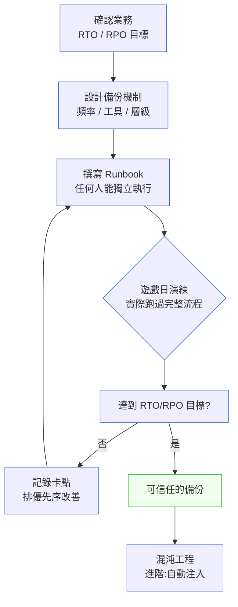

# 第 31 章｜災難復原演練
## ⸺ 真正的備份,是你演練過的那一份

> **前置閱讀**:[第 30 章｜SLO/錯誤預算的實作面](./ch-30-slo.md)
> **下游章節**:[第 32 章｜效能量測先於優化](../part-07-performance/ch-32-measure-first.md)

## 31.1 共感現場:那個「有備份」的禮拜五下午

你可能也遇過類似的情況。

某個禮拜五下午,生產環境的主資料庫硬碟控制器突然故障,整個服務掉線。Team Lead 小雯第一時間跳進 Slack 通知大家:「沒事,我們有備份的,AWS S3 那裡每天備份一次。」

大家都鬆了口氣。

可是接下來的幾個小時,問題一個接著一個浮出來。備份的還原步驟,文件上次更新是八個月前;當時用的是舊版的 PostgreSQL 14,現在是 16,還原流程有一段 SQL 語法不相容。負責這塊的工程師小偉剛在三週前離職,沒人知道那段流程的完整脈絡。嘗試了兩個小時之後,還原出來的資料庫沒辦法啟動,大家才發現備份的設定裡有一個 `wal_level` 參數沒有隨著升級一起更新。

到最後,服務停了將近五個小時才恢復。

後來小雯在事故回顧會上說了一句話:

> 「我們一直以為有備份就夠了。可是我們從來沒有試過把它還原回來。」

在當時的條件下,整個團隊的視野被「備份排程成功」這個訊號所限制——沒有人建立過還原驗證的習慣,所以沒有人知道「備份存在」和「備份有效」之間有一道不一樣的門。

## 31.2 真正的問題:信心,來自演練,不是計畫

我們把小雯那個下午的狀況慢慢拆開來看,你會發現問題不在備份本身有沒有做,而在「備份有效性的確認機制」。

很多團隊都有備份。但備份是否有效,只在兩個時間點會被驗證:第一是演練,第二是真的出事。兩者的差異在於成本——演練失敗,我們有時間修;真實災難中失敗,就是小雯那個禮拜五的故事。

這就帶出了兩個關鍵概念,它們長得像縮寫,但背後的意涵很不一樣:

**RTO(Recovery Time Objective,復原時間目標)** — 系統可以容忍停機多久?這是一個從業務需求出發的問題:銀行的核心清算系統,RTO 可能只有五分鐘;內部的員工管理系統,RTO 可能可以放寬到兩個小時。

**RPO(Recovery Point Objective,復原點目標)** — 系統可以接受丟失多少資料?如果每天備份一次,最壞情況下我們會丟失接近 24 小時的資料;如果每小時備份一次,最多丟失一小時。這也是業務問題:金融交易的 RPO 通常要求接近零(每一筆交易都不能丟);部落格平台的 RPO 可能一天都行。

RTO 和 RPO 其實是同一件事的兩個維度:前者問「系統停多久」,後者問「資料會丟多少」。一個系統的復原能力,既取決於能多快恢復運行,也取決於最多能容忍丟多少資料——只確認其中一個,另一個就會變成沒人管的漏洞:你可能十分鐘就把系統救回來了,但如果救回來的資料是三天前的版本,對業務造成的傷害不會比停機十小時小多少。兩者缺一不可。

也就是說,RTO 和 RPO 不是技術決策,它們是業務需求,只是剛好需要技術來實現。團隊常犯的誤解是「先把技術做好,再去問 RTO/RPO」——但其實應該反過來:先確認業務對停機和資料損失的容忍底線,再依此設計備份與還原的頻率、機制、工具選型。

這裡有一個容易忽略的細節:RTO/RPO 和 SLO(Service Level Objective,服務水準目標)之間是互為表裡的關係。你在第 30 章確立的 SLO——例如「每月可用性 99.9%」——其實已經隱含了一個 RTO 上限:99.9% 的月可用性換算下來,每月最多允許約 43 分鐘的中斷。如果你的備份機制需要四個小時才能完成還原,那麼不管 SLO 怎麼寫,你都無法在真實事故中兌現它。所以 RTO 目標不只是和 PM 談出來的數字,也需要和已經承諾的 SLO 對齊——兩者矛盾時,要麼調整 SLO,要麼投資更快的還原機制。

但這三個數字的背後邏輯往往互相矛盾。工程師估算還原需要四個小時,那是根據現有的備份機制算出來的技術極限;PM 卻說客戶只能接受一個小時,因為超過這個時間,客訴就會湧進客服;業務主管又需要確認「如果超時,SLA 違約會賠多少錢」,因為這個數字決定了公司願意花多少預算去縮短 RTO。這三個立場各自成立,卻彼此拉扯——工程師沒辦法單方面把還原時間從四小時變成一小時,PM 也沒辦法單方面要求客戶多忍耐三小時。正因為如此,對齊不是某一方讓步就能解決的,而是需要三方把各自真實的約束條件都攤開來,才能找到一個既滿足業務、也在技術上可行的邊界。也就是說,這個對話不只是協商,而是把所有的隱含假設都挖出來。

這個對齊的對話往往需要三方坐在一起:工程師負責估算「我們的技術手段能做到多快」,PM 負責代入「客戶能接受停多久」,業務主管確認「SLA 賠償條款的觸發點在哪裡」。把這三個數字放在白板上,RTO 目標自然就有了邊界。

順著這個道理,我們自然會問下一個問題:確認了 RTO/RPO 的目標之後,怎麼知道我們現在的備份機制,真的能在目標內完成還原?

答案是:演練。而且是要真的跑過還原流程的那種演練,不是讀一遍文件。

這就是為什麼「遊戲日(Game Day)」這個概念在 SRE 社群裡如此被重視。所謂遊戲日,就是刻意在一個受控的環境下模擬真實的故障情境,讓所有應該響應的人——工程師、on-call 輪值者、甚至 PM——都走過一遍完整的流程。這不是考試,也不是懲罰,而是讓「備份可以還原」這件事,從一個大家「相信」的事情,變成一個大家「見過」的事情。

## 31.3 一起做判斷:從 RTO/RPO 到演練的四個步驟

那麼,具體該怎麼把「我們有備份」這個句子,變成「我們演練過還原,在 X 分鐘內完成」?

以下是一個可以直接用的四步流程。

### 第一步:確認業務的 RTO/RPO

這一步很常被跳過,因為它需要跨團隊的對話。但如果你不知道目標,就不知道自己的備份設計是不是夠好。

一個實用的問法是去問 PM 或業務主管兩個問題:「如果系統完全停用,客戶可以接受幾個小時?」和「如果我們把資料還原到昨天的狀態,有哪些業務損失是不可接受的?」

通常問了之後,答案比工程師預期的更嚴格——這是好事,這才是真實的約束。

很多工程師會根據「備份和還原流程最多需要四個小時」這個技術指標,就直接把它當成 RTO 宣稱給業務——這個推論看起來很自然,卻忽略了一個關鍵:技術上跑得完的最長時間,和業務能接受的停機時間,是兩件完全不同的事。前者是「我們能做到多快」,後者是「客戶願意等多久」,兩者中間沒有必然的關聯,只是剛好常常被混為一談。

有一個工程師朋友跟我分享過他第一次做這個對話的經過。他以為訂單系統的 RTO 是四個小時,結果 PM 告訴他:「超過一個小時,我們就要主動發簡訊給所有等待出貨的客戶,到兩個小時,客服就會被打爆。」那次對話結束之後,他們把 RTO 目標從「四小時」改成了「一個小時」,然後才發現現有的還原機制根本做不到——但至少現在知道差距在哪裡,可以開始補。這比在真實事故中才發現,要好得多。

### 第二步:建立並審查還原流程文件

把備份的還原步驟寫成一個任何人都能獨立執行的操作手冊(Runbook)。注意幾個關鍵:版本號(你的 DB 版本是什麼?CLI 工具的版本?)、環境變數(哪些設定在還原時需要手動填入?)、以及驗證步驟(還原完成後怎麼確認資料完整?)。

文件寫好之後,不妨讓一位沒接觸過這塊的團隊成員試著獨立讀一遍。凡是需要問「這是什麼意思?」的地方,就是文件需要補充的地方。

### 第三步:跑一次完整的遊戲日演練

選一個相對閒的時段(通常是周間白天,not 禮拜五下午),在一個隔離的環境(可以是 staging,也可以是獨立的 cloud 帳號)中,模擬主系統失效的情境。

演練的目標不是「看看備份在不在」,而是走過整條流程:從發現問題、查找 Runbook、執行還原、驗證資料完整性,一直到服務重新上線。計時,記錄時間與每個步驟的卡點。

這一步最常出現的結論是:「我們以為 RTO 是一個小時,但實際演練花了三個小時。」這不是壞消息——這是有價值的真實資料,讓你知道差距在哪裡,也讓你知道接下來要改哪裡。

### 第四步:評估結果,迭代改善

演練完之後,把觀察到的卡點整理成一張清單,依照「改了就能縮短多少 RTO」來排優先序。然後在下一次演練中,驗證這些改善是否有效。

從備份機制的選型來看,不同的技術手段對應不同的 RTO/RPO 水位:

| 機制 | RPO 典型值 | RTO 典型值 | 適用情境 |
|---|---|---|---|
| 每日全量備份(S3 snapshot) | ~24 小時 | 1–4 小時 | 非核心系統、容忍資料損失 |
| 每小時增量備份 | ~1 小時 | 30–90 分鐘 | 中等重要性業務系統 |
| WAL 串流複製(PostgreSQL) | 接近零(秒級) | 5–30 分鐘 | 金融交易、使用者帳戶 |
| 多區域主動-主動部署 | 接近零 | 秒級 | 極高可用性需求 |

選哪一層?答案是你在第一步確認的 RTO/RPO 目標決定的。不是貴的就好,是剛好能滿足業務需求就好。

還有一個概念值得在這裡介紹:**混沌工程(Chaos Engineering)**。它是遊戲日的進階版——不只模擬全系統崩潰,而是主動、有節制地在生產或 staging 環境中注入故障(隨機終止節點、切斷網路、讓第三方服務回傳錯誤),看系統在「非預期失效」下的真實行為。Netflix 開源的 Chaos Monkey 是最有名的例子;對大多數團隊來說,先在 staging 跑幾輪手動的遊戲日,再逐步引入自動化的混沌注入,是比較穩健的路徑。

下面這張圖示意了從「有備份」到「可信任的備份」的完整路徑:



但即便流程講得再清楚,不少團隊在第一次執行遊戲日時仍會踩到同樣的坑。我們把最常見的四個地雷整理出來——不是要嚇你,而是讓你下次遇到的時候,能更快認出它。

## 31.4 容易絆倒的地方

這裡有幾個幾乎每個團隊都走過的彎路。

**絆倒處一:把備份存在「能不能備」,而不是「能不能還原」。**

設置備份流程的人,目標通常是「讓備份成功」;但備份的真正目的是「讓還原成功」。這兩件事聽起來很接近,其實是不同的驗收標準。有些備份每天都成功寫入 S3,但裡面的資料是加密的,而還原流程的 Runbook 沒有寫解密步驟;有些備份檔案完整,但還原到比原本更高版本的資料庫時會報錯。

> 修正方向:把「備份可以還原」定義為備份流程的結束條件——也就是說,備份沒做過還原驗證之前,它就還不算完成。每個月跑一次還原驗證,不需要動到生產,在隔離環境裡做就夠了。

**絆倒處二:Runbook 只有一個人看得懂。**

寫 Runbook 的人和最常執行的人是同一個人,所以從來沒有人發現文件裡有跳步驟、有隱含假設。等到那個人不在的時候,Runbook 就變成謎語。

> 修正方向:每次演練都輪換「主操作者」——讓上次沒執行過的人當主角,上次的主角旁觀。這樣不只能發現文件的盲點,也讓還原能力分散到團隊裡多個人身上。

**絆倒處三:演練時間選在壓力最大的時候。**

有些團隊把遊戲日排在發布日前後,或是 Q4 的衝刺期,結果演練還沒跑完就被中斷,卡點也沒有時間好好整理。久了,演練就變成一個「每季排程但總是被取消」的項目。

> 修正方向:把遊戲日視同程式碼 review,是工程品質的投資,不是額外負擔。選一個沒有發布窗口的平靜周,至少留半天的緩衝給卡點的後續追蹤。一年兩次,比「每季計畫、每季取消」有效得多。

**絆倒處四:混沌工程從生產環境開始。**

看完 Netflix Chaos Monkey 的介紹後,有些團隊躍躍欲試,直接在生產環境隨機殺掉服務實例——在系統彈性設計還沒有充分驗證之前。結果演練還沒跑完,真實的 SLO 就違反了。

> 修正方向:混沌工程的進入序列是:**了解系統 → staging 演練 → staging 混沌 → 生產低峰混沌 → 生產全時混沌**。每一層都要先確認系統在那個層級的注入下能正常恢復,才往下一層走。

現在我們知道演練要避開哪些坑了,具體該怎麼把一次演練的計畫寫得既實用又不臃腫呢?

## 31.5 帶得走的工具 ⸺ 一頁式「災難復原演練計畫」

演練計畫不需要是一份長達二十頁的文件,太長的計畫反而會讓人不去執行。下面是一頁就能放進 Confluence 或 Notion 的空白模板:

```text
災難復原演練計畫 ⸺ {系統名稱}

一、目標
   系統 RTO: {X} 分鐘
   系統 RPO: {X} 小時 / 分鐘
   業務依據: {誰確認的、什麼時候確認的}

二、本次演練情境
   模擬故障: {例:主資料庫無法連線 / 整個 AZ 失效}
   演練環境: {staging / 隔離帳號 / 生產低峰期}
   演練時間: {預計日期} {預計時段}
   主操作者: {誰}
   觀察者:   {誰}

三、備份機制確認
   備份類型: {全量 / 增量 / WAL 串流}
   備份頻率: {多久一次}
   最後一次備份: {時間}
   備份位置: {S3 路徑 / 其他}

四、還原流程(Runbook 連結)
   Runbook 版本: {版本號或最後更新日期}
   Runbook 連結: {URL}
   上次還原驗證: {時間}

五、演練計時記錄
   故障發生時間:        ____
   開始執行還原時間:    ____
   還原完成時間:        ____
   服務重新上線時間:    ____
   總耗時:              ____ 分鐘
   是否達到 RTO 目標:  是 / 否

六、卡點記錄
   卡點 1: {描述} → {後續行動} → 負責人: {誰}
   卡點 2: {描述} → {後續行動} → 負責人: {誰}
   ...

七、下次演練計畫
   下次演練時間: {日期}
   預計改善項目: {列出}
```

為什麼是一頁?因為遊戲日的價值不在計畫書有多完整,在於你有沒有真的跑過。模板越短,被使用的機率越高;一頁的計畫被執行十次,遠比一份精美的二十頁文件被擱在 Confluence 一年更有價值。

### 31.5.1 範例:捷灃支付的第一次遊戲日

讓我們回到小雯那個禮拜五的事故。事故平息三週後,她帶著團隊做了第一次正式的遊戲日。下面是那次演練計畫的填好版本:

```text
災難復原演練計畫 ⸺ 捷灃支付核心清算服務

一、目標
   系統 RTO: 30 分鐘
   <!-- 為什麼這欄:RTO 目標要寫具體數字,不是「越快越好」。
        30 分鐘是小雯和業務主管確認後的底線:清算延誤超過
        30 分鐘會觸發客戶 SLA 賠償條款。知道這個數字,
        才能在演練後評估「差多遠」。 -->
   系統 RPO: 5 分鐘
   業務依據: 業務主管 Kevin 確認,2026-05-12 的架構會議

二、本次演練情境
   模擬故障: 主資料庫 (PostgreSQL 16) 主節點無法連線
   演練環境: staging(與生產同規格的獨立帳號)
   演練時間: 2026-05-28 週三 10:00–13:00
   主操作者: 小雯(本次親自跑一遍,下次換其他人)
   觀察者:   後端工程師小立、DevOps 工程師小翰

三、備份機制確認
   備份類型: WAL 串流複製 + 每日全量 S3 備份
   <!-- 為什麼這欄:WAL 串流可以把 RPO 壓到秒級;
        S3 全量備份是最後防線,確保 WAL 串流失效時還有回頭路。
        兩種機制並存,讓 RPO 和成本取得平衡。 -->
   備份頻率: WAL 持續串流;S3 每日 02:00 UTC
   最後一次備份: 2026-05-27 02:03 UTC (S3 全量)
   備份位置: s3://jf-pay-backup/pg-main/

四、還原流程(Runbook 連結)
   Runbook 版本: v1.2 (更新於 2026-05-10,PG16 還原語法尚未完整同步)
   <!-- 為什麼這欄:標記版本日期很重要。上次事故的根因之一,
        就是 Runbook 停在 PG14 的語法,升版時沒有同步更新。
        此欄讓日後的審查者能立刻發現文件是否過時。 -->
   Runbook 連結: https://wiki.jf-pay.internal/dr-runbook-pg-main
   上次還原驗證: 從未驗證 → 本次演練即為第一次

五、演練計時記錄
   故障發生時間:        10:05
   開始執行還原時間:    10:08
   還原完成時間:        10:47
   服務重新上線時間:    10:52
   總耗時:              47 分鐘
   是否達到 RTO 目標:  否(目標 30 分鐘,超出 17 分鐘)

六、卡點記錄
   卡點 1: 還原指令的 --target-time 參數寫法與 PG14 不同,
           小立花了 12 分鐘翻文件 →
           後續行動:更新 Runbook,直接寫出完整指令範例 →
           負責人:小立,完成期限 2026-06-04
   <!-- 為什麼這欄:卡點要寫具體的時間損耗,才能量化改善。
        「花了 12 分鐘翻文件」比「Runbook 不夠清楚」更能說服
        團隊把修文件列為高優先級。 -->
   卡點 2: 還原完成後的健康檢查步驟未在 Runbook 中列出,
           小翰花了 8 分鐘手動確認各 table 筆數 →
           後續行動:新增還原後驗證 Checklist →
           負責人:小雯,完成期限 2026-06-04

七、下次演練計畫
   下次演練時間: 2026-08-27(約 13 週後)
   預計改善項目: 修復上述兩個 Runbook 卡點;主操作者換小立
```

這次演練沒有達到 RTO 目標,但那不是失敗,而是演練最有價值的地方:小雯和團隊在沒有客戶壓力的情況下,發現了兩個如果在真實事故中才遇到會非常昂貴的卡點。

兩個 Runbook 修正加起來不超過一個小時;但下次真的出事時,它們可能省下的不只是時間,而是整個團隊在那個最壓力的夜晚的慌亂。把問題留在演練裡解決,是這件事最划算的地方。

## 31.6 本章回顧

讀完這一章,你應該已經能:

- [ ] 說清楚 RTO 和 RPO 各是什麼、應該從業務需求出發確認,而不是從技術手段反推
- [ ] 區分「備份成功」和「還原成功」這兩件事的不同驗收標準
- [ ] 規劃一次遊戲日演練的完整流程,包含選情境、計時、記錄卡點到後續改善
- [ ] 知道混沌工程的進入序列,不會從生產環境直接開始

如果想先從一件事開始,我會建議 ⸺**約一次遊戲日,把備份的還原流程實際跑過一遍**,因為「能不能在壓力下還原」這個問題,只有你跑過之後才有答案。做一次演練,你就把「我們相信備份有效」這句話,換成「我們見過備份有效」——而這兩句話之間的差距,往往就是平靜的禮拜五下午和五個小時緊急搶修的差距。

下一章,我們把視角轉向另一個方向——在系統恢復正常之後,怎麼確認它的效能表現是我們預期的?

## Cross-References

- **下一章**:[第 32 章｜效能量測先於優化](../part-07-performance/ch-32-measure-first.md) ⸺ 系統恢復後,怎麼確認效能水位
- **強連結**:[第 29 章｜On-call 與事故處理](./ch-29-on-call.md) ⸺ 遊戲日是 on-call 的平時演習
- **強連結**:[第 30 章｜SLO/錯誤預算的實作面](./ch-30-slo.md) ⸺ RTO/RPO 目標與 SLO 互為表裡
- **強連結**:[第 26 章｜可觀測性落地](./ch-26-observability.md) ⸺ 演練中的健康確認,依賴 metric 與 log
- **跨書連結**:(外部連結) [SA/SD Playbook — Ch 29 可用性設計](https://github.com/EddyKuo/sa-sd-playbook) ⸺ RTO/RPO 目標的設計高度屬於系統設計層;本章與 SA/SD Playbook 的 Ch 29 可用性設計互為延伸
