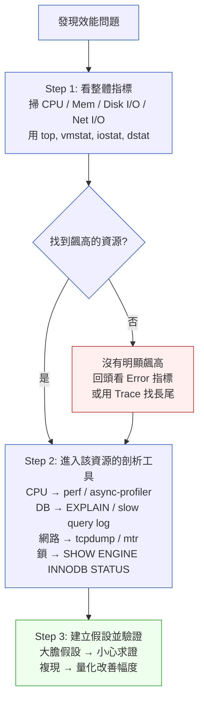

# 第 32 章｜瓶頸定位
## ⸺ 量測之前別動手,動手之前先看數字

> **前置閱讀**:[第 31 章｜效能量測先於優化](./ch-31-measure-first.md)
> **下游章節**:[第 33 章｜快取的層次與失效策略](./ch-33-caching.md)

---

## 32.1 共感現場:「它就是慢,先加快取吧」

你可能也遇過這樣的情形。

產品上線幾個月後,有一天 PM 在群組裡轉貼了一張截圖——一個用戶留言說「結帳頁面好慢」。討論串很快就活躍起來,有人說「是不是該換個快一點的雲端方案」,有人說「是資料庫,我看 CPU 一直飆高」,也有人直接說「先加快取吧,快取加下去通常就好了」。

討論熱鬧,但其實還沒人看過一行監控數字。

就先從這裡說起。我帶過一個叫小薇的工程師,她在一家叫做 CartFlow 的電商平台工作,負責後端。CartFlow 的結帳流程涉及庫存扣減、優惠計算、金流呼叫三個環節,平常 p99 回應時間大約 800ms,算是勉強能接受。可是某次大型促銷過後,p99 飆到了 3.2 秒,客服開始收到投訴。

小薇和同事商量了一下,覺得「應該是資料庫」,就先對主查詢加了 Redis 快取。Deploy 上去,監控一看——p99 從 3.2 秒降到了 2.9 秒。改善存在,但不明顯;更關鍵的是,無法判斷剩下的瓶頸在哪裡、問題是否往正確方向走。

之所以講這個故事,不是說加快取是壞事——快取本身沒有錯。而是「先猜再動」這個順序,讓她花了一個下午補了一個可能不需要那麼急的東西,同時也錯過了真正慢在哪裡的答案。

找瓶頸這件事,有點像診病。你不會因為病人說「我全身不舒服」就直接給消炎藥——你得先問哪裡不舒服、做什麼會更痛、什麼時候開始的。效能問題也一樣,要先定位,才值得動手。

---

## 32.2 真正的問題:沒有定位就沒有槓桿

我們把小薇那次的處境慢慢拆開來看。

系統慢的時候,有四個地方最常出問題,而且它們的症狀很像、但解法完全不同:

| 瓶頸類型 | 典型症狀 | 常見根因 | 治法方向 |
|---|---|---|---|
| **CPU 飽和** | CPU 使用率持續 > 80%,回應時間和 CPU 同步上升 | 大量計算、序列化/反序列化、正規表達式 | 演算法優化、水平擴展 |
| **I/O 阻塞** | CPU 很低但回應很慢,wait 時間高 | 慢查詢、全表掃描、磁碟 I/O | 索引、批次讀取、非同步化 |
| **網路延遲** | CPU/I/O 都正常,但 latency 分佈有長尾 | 連線建立成本、外部 API 呼叫、封包遺失 | 連線池、Keep-Alive、就近部署 |
| **鎖競爭** | 並發量上升後 latency 突然暴增,CPU 卻不高 | 資料庫行鎖、應用層 mutex、分散式鎖 | 縮短鎖的持有時間、樂觀鎖、隊列化 |

這四種瓶頸的解法幾乎沒有交集。CPU 問題靠快取沒多少用;I/O 問題靠加機器只是讓所有機器一起等慢查詢;鎖的問題再怎麼優化 CPU 也無濟於事。

也就是說,**在定位之前動手,不只是運氣問題,更是槓桿問題**——解法用錯地方,再努力也撬不動那根桿子。

順著這個道理,我們就能理解小薇那次的狀況。她在沒有量測的情況下猜「是資料庫」,而 CartFlow 的促銷瓶頸其實是另一回事——結帳時每筆訂單都會呼叫一個外部金流 API,而那個 API 在促銷高峰期回應時間從平均 120ms 漲到 1.8 秒,每個請求都在等它。快取緩解了一點資料庫的壓力,但主要的 latency 來自那個外部呼叫,快取完全碰不到。

找到真正的瓶頸之前,所有的動作都是猜測;找到之後,解法往往反而簡單。

---

## 32.3 一起做判斷:USE 方法 + 三步定位流程

那麼,怎麼系統性地找出瓶頸?這裡我想介紹一個很好用的框架,叫做 **USE 方法**(Utilization / Saturation / Errors),由效能工程師 Brendan Gregg 提出。

USE 方法的核心思路很直觀:對系統裡每一個資源,問三個問題:

- **U(Utilization)** — 這個資源被用了多少?(%,越接近 100% 越可疑)
- **S(Saturation)** — 這個資源是不是有工作在排隊等待?(queue depth、wait time)
- **E(Errors)** — 這個資源有沒有報錯?(connection timeout、retry count)

對 CPU、記憶體、磁碟、網路介面、資料庫連線池,依序掃一遍 USE,通常幾分鐘內就能把「有問題的資源」圈出來。

### 32.3.1 三步定位流程

把 USE 方法和實際的工具串在一起,操作起來大概是這三步:



這張圖最重要的地方是「Step 1」和「Step 2」之間的順序——**先看整體,再鑽細節**。很多人習慣一遇到問題就直接開 slow query log、或直接 `EXPLAIN` 那支最慢的 SQL,但如果問題根本不在資料庫而在 CPU 或外部呼叫,這些工具的答案對你沒有意義。

### 32.3.2 各瓶頸類型的常用工具

| 瓶頸 | 觀察指標 | 推薦工具 | 看什麼數字 |
|---|---|---|---|
| **CPU** | `%user`, `%sys`, `load avg` | `top`, `perf top`, `async-profiler`(JVM) | 哪個函式/call stack 消耗最高 |
| **I/O** | `%iowait`, `await ms`, `queue size` | `iostat -x 1`, `iotop`, DB slow log | 慢查詢、全表掃描、filesort |
| **網路** | RTT, retransmit rate, bandwidth | `mtr`, `tcpdump`, `ss -s` | 長尾 latency、連線數量、TIME_WAIT |
| **鎖** | 等待時間、死鎖次數 | `SHOW ENGINE INNODB STATUS`, `pg_stat_activity` | `lock_wait_timeout`、waiting trx |
| **外部 API** | 呼叫 latency 分佈、error rate | Distributed Trace (OpenTelemetry 1.x)、Span | 哪個 span 最長、p99 是什麼 |

「外部 API」這一行值得特別注意。很多工程師的觀察工具清單裡,習慣只有「自己的系統」——資料庫、快取、應用程式。但在現代系統裡,一個請求往往會呼叫三到五個外部服務,任何一個都可能是瓶頸。這就是為什麼分散式追蹤(Distributed Tracing)這麼重要——它讓你看到一個請求的完整時間線,而不是只看應用程式自己那一段。

有了這些工具,關鍵還是怎麼用。同一個工具,在不同的假設底下會看到完全不同的信號——拿 `perf top` 去查一個其實是外部 API 慢的問題,只會看到 CPU 大部分時間都在等待,什麼也查不出來。這就是為什麼工具之前,還需要有一個先問「我現在懷疑的是什麼」的姿態。

### 32.3.3 「大膽假設、小心求證」的核心姿態

找瓶頸有一個核心方法論,貫穿所有工具:先用現有線索提出「最可能的假設」,再用最小成本的工具驗證,然後根據結果修正假設。

這和亂槍打鳥的差別在於:**假設是有因果依據的**。舉例來說,「CPU 飆高 → 可能是序列化成本」這個假設有依據,因為序列化(把物件轉成 JSON 或 protobuf)本身就是已知會吃 CPU 的操作,你可以直接用 profiler 去驗證;但「應該是資料庫」這種假設太籠統了——資料庫可能慢在慢查詢、可能慢在連線數不夠、也可能根本不慢,這種假設沒辦法告訴你下一步該打開哪個工具。也就是說,有因果依據的假設,才能替你指出「去哪裡找證據」;沒有依據的假設,再多工具都用不上力。

「假設 → 驗證 → 修正」這個循環有一個關鍵細節:驗證的方式要「最小成本」。什麼叫最小成本?就是「能用一個指令回答的問題,不要用部署來回答」。比如懷疑是慢查詢,先對那支最慢的 SQL 下 `EXPLAIN`,看它有沒有用到索引、有沒有走全表掃描;懷疑是外部 API 超時,先在 Distributed Trace 裡看那幾個 span 的實際 latency 分佈——如果 p99 都落在 1,800ms 附近,就足以確認問題出在那個外部呼叫上,不需要真的動手改代碼才知道。每一步都只比上一步多開一扇門,而不是一次把所有門都打開。

這個節奏之所以重要,是因為定位瓶頸通常發生在壓力很高的時候——系統正在慢、PM 在問、客服在收投訴。這種時候最容易的反應就是「先做些什麼」,但「先做些什麼」如果方向錯了,往往會在已經混亂的系統裡再加一個變數,讓後續的定位更難。慢下來先做假設,反而讓整個過程更快。

順著這個思路,我想特別提一下一個很容易被忽略的場景:「USE 三個指標都不高,但系統就是慢」。這時候往往是 latency 藏在長尾裡——p50 正常、p99 很慢。這種情況的第一個工具應該是 Trace,看 p99 的那幾個請求在哪個 span 上花了最多時間,再去那個方向挖。

還有一種情況值得特別說明:問題只在特定時段出現,或只有特定用戶遭遇。這類「間歇性慢」往往不是資源本身的問題,而是**競爭**的問題——某個定時任務在整點執行,佔用了大量 I/O;某個大客戶的操作觸發了沒有分頁的全表查詢;某條程式碼路徑在特定輸入下走到了更複雜的分支。對付這類問題,除了 USE 方法,還需要對比「慢的時候」和「正常的時候」的指標差異——把兩個時間窗口的 metric 並排,差距最大的那個資源,通常就是方向。

有了框架還只是開始。實際運作時,幾個地方特別容易讓人不小心走偏——下面這幾個地方,幾乎每個工程師在學效能定位的路上都會踩到一遍,提前認識它們,下次遇到就會少繞一圈。

---

## 32.4 容易絆倒的地方

### 絆倒處一:直接猜、直接動

這是最常見的一個。系統慢,大家腦中有一個直覺——「應該是資料庫」或「應該是快取沒打到」——然後就開始優化那個直覺裡的地方。

如果猜對了,當然幸運;但更常見的情況是改了半天,慢的問題沒動到,反而多花了時間,也模糊了後來的定位。

> **修正方向**:把「猜測」先轉成「假設」,然後用最快的方式確認或否定它。假設需要五分鐘量測才能驗證,那就先花這五分鐘,比猜錯之後花幾小時重來划算多了。

### 絆倒處二:只看平均值

很多時候,效能問題不是「平均很慢」,而是「大多數請求快、少數請求極慢」。如果你只看平均 latency,那些「極慢」的請求會被稀釋掉,你完全看不見它。

真實世界裡,用戶抱怨的那幾個「好慢」,往往都是 p99 或更長尾的請求,而不是平均值。

> **修正方向**:觀察指標時,至少看 p50、p95、p99 三個百分位。如果 p99 比 p50 大超過三倍,就值得認真調查長尾的來源。

### 絆倒處三:在開發環境量測

開發環境和生產環境的差異很大:資料量不同、連線數不同、硬體規格不同、網路拓撲不同。很多在本機跑很快的東西,到了生產環境才暴露問題——就像本書第一章裡的小俊一樣,他在自己電腦上把功能測過一輪,一切正常,程式碼一路綠燈通過,結果一部署到生產環境就出了狀況,才發現本機的資料量和並發數根本撐不起真實流量的樣子。詳見[第 1 章｜為什麼工程實作需要決策框架](../part-01-foundations/ch-01-why-engineering-decisions.md)。

在開發環境做的剖析(profiling)有參考價值,但不能當作問題的最終定位依據;如果可以,應該盡量在接近生產的環境量測,或者用生產的流量 replay 來觸發問題。

> **修正方向**:定位效能問題時,優先用生產或 staging 的監控數據。如果一定要在本機重現,記得注意資料量、並發數這兩個最容易造成環境差異的因子。

### 絆倒處四:優化之後沒有量測改善幅度

這個絆倒處比較細膩,但影響很大。優化做完了,deploy 上去,有人說「感覺快了一點」——然後就結案了。這樣其實無法知道問題有沒有真的被解決,也不知道還剩多少空間可以優化。

> **修正方向**:每一次優化都有一個前後的量測。改之前記錄基準值(p50、p99 各是多少),改之後量測相同條件下的數字,用百分比說明改善了多少。這樣不只讓你知道有沒有效,也讓你知道還剩多少問題沒解決。

### 絆倒處五:優化了佔比很小的那個瓶頸

有時候你確實做了量測、也確實找到了一個真實存在的慢點——但它只佔整體 latency 的 8%。就算把它優化到零,整體 p99 也只會改善 8%。然而你可能花了兩天在上面,同時忽略了另一個佔了 60% 的慢點。

這個絆倒處的根因不是「沒有量測」,而是「量測了但沒有計算佔比」。找到慢點之後,多做一個動作:算一下「這個慢點佔整體 latency 幾 %」——如果不到 20%,先把它記下來,把精力放到更大的那個上面。

> **修正方向**:每次 Step 2 深入剖析之後,先算 span 佔比再決定優化順序。優先解決佔比最高的那個瓶頸,能帶來最大的槓桿效果。這個習慣在 Trace 工具裡很容易養成——大多數 Trace 介面都會自動顯示每個 span 的時間與比例。

---

## 32.5 帶得走的工具 ⸺ 一頁式「瓶頸定位工作表」

把上面的三步流程和工具選擇,收進一張你真的會用的工作表。空白模板如下:

```text
瓶頸定位工作表 ⸺ {系統名稱 / 功能名稱}

== 問題描述 ==
症狀:      {p99 多少 ms? 哪個 API? 什麼時候開始?}
觸發條件:  {高並發? 特定資料量? 促銷流量?}
影響範圍:  {多少用戶? 哪個租戶? 哪個功能?}

== Step 1: 整體指標掃描 ==
CPU 使用率:   {%user / %sys}      → 是否飆高? {Y/N}
Mem 使用率:   {%used / swap 量}   → 是否飆高? {Y/N}
Disk I/O:     {%iowait / await}   → 是否飆高? {Y/N}
Net I/O:      {bandwidth / RTT}   → 是否飆高? {Y/N}
DB 連線池:    {active / waiting}  → 是否排隊? {Y/N}
外部 API:     {平均 / p99 latency}→ 是否長尾? {Y/N}

== 最可能的瓶頸 ==
類型: {CPU / IO / 網路 / 鎖 / 外部 API / 其他}
根據: {哪個指標讓你得到這個假設}

== Step 2: 深入剖析 ==
使用工具:  {perf / EXPLAIN / tcpdump / Trace / ...}
發現:      {具體的 call stack / slow query / span}
量化數字:  {這裡佔了多少 ms? 佔整體 latency 的幾%?}

== Step 3: 假設與驗證 ==
假設:      {如果 XXX,則 latency 應該降低 YYY ms}
驗證方式:  {在 staging / production 怎麼量測}
結果:      {實際改善了多少?}

== 優化前後對比 ==
基準 (優化前):  p50={} ms  p95={} ms  p99={} ms
優化後:         p50={} ms  p95={} ms  p99={} ms
改善幅度:       p99 降低了 {}%
```

為什麼這張工作表有「問題描述」那一欄?因為瓶頸定位最常見的陷阱,就是跳過「症狀是什麼」直接開始「解決方案是什麼」。把觸發條件和影響範圍寫下來,常常就能讓直覺假設浮現——「只在促銷時才慢」和「隨時都慢」會指向完全不同的根因。

### 32.5.1 範例:CartFlow 結帳頁面慢的定位過程

讓我們回到小薇和 CartFlow 的故事。如果促銷後那天,她坐下來先填這張工作表,整個定位的過程大概會是這樣。下面是她填寫時的完整思考過程,括號裡的註解標示了「為什麼要記這個」——這些反思不是事後補上去裝飾用的,而是定位瓶頸時本來就該養成的習慣:

```text
瓶頸定位工作表 ⸺ CartFlow 結帳頁面 / checkout API

== 問題描述 ==
症狀:      p99 從 800ms 飆到 3,200ms,/api/checkout POST
觸發條件:  雙十一促銷活動期間,並發量約為平日 8 倍
<!-- 為什麼這欄:觸發條件「只在促銷」這個關鍵字,
     立刻指向「並發飆高」而非「邏輯本身有問題」,
     這樣第一步量測的重點就會放在資源飽和,而不是程式碼邏輯。 -->
影響範圍:  所有使用者,結帳完成率下降 23%

== Step 1: 整體指標掃描 ==
CPU 使用率:   43% user / 12% sys     → 是否飆高? N
Mem 使用率:   68%,無 swap           → 是否飆高? N
Disk I/O:     %iowait 2%,await 4ms  → 是否飆高? N
Net I/O:      100 Mbps / RTT 正常    → 是否飆高? N
DB 連線池:    active=28 / waiting=0  → 是否排隊? N
外部 API:     金流 API p99 = 1,820ms → 是否長尾? Y ⚠️
<!-- 為什麼這欄:CPU / IO / DB 都正常,只有外部 API latency 飆高,
     這個掃描結果立刻排除了「加快取」「加索引」的方向,
     把注意力引到外部依賴——這正是不量測就會猜錯的地方。 -->

== 最可能的瓶頸 ==
類型: 外部 API(金流服務 PayEdge)
根據: 金流 API p99 在促銷期間從 120ms 漲到 1,820ms

== Step 2: 深入剖析 ==
使用工具:  OpenTelemetry 1.x Distributed Trace
發現:      checkout span 內,payedge_authorize span 佔 1,750ms(54.7%)
<!-- 為什麼這欄:量化「這個 span 佔幾 %」非常重要——
     就算找到了最慢的地方,如果它只佔 10%,
     解決它對整體 p99 的影響也有限;54.7% 才值得優先處理。 -->
量化數字:  1,750ms / 3,200ms = 54.7%

== Step 3: 假設與驗證 ==
假設:      若在 checkout 加入逾時上限 (1,000ms) + 降級(暫存訂單,稍後補授權),
           則 p99 應降至 1,500ms 以內,且結帳不中斷
驗證方式:  staging 環境模擬 8 倍並發,呼叫 mock PayEdge(回應時間設為 1,800ms)
結果:      p99 = 1,280ms,結帳成功率回升至 96%

== 優化前後對比 ==
基準 (優化前):  p50=610ms  p95=1,900ms  p99=3,200ms
優化後:         p50=430ms  p95=980ms    p99=1,280ms
改善幅度:       p99 降低了 60%
```

你看,整個定位過程花了不到半小時——Step 1 的整體掃描只要三分鐘,但它立刻排除了四個方向,讓剩下的工作全部集中在一個地方。小薇那天如果先做這一步,就不會在快取上花一個下午,也不會繞遠路。

工作表最溫暖的地方在這裡:它不是要讓你變得更聰明,而是當你壓力很大、腦袋裡嗡嗡作響的時候,幫你把「下一步該看哪裡」這個問題回答掉。拿去用,你會發現定位瓶頸其實沒有那麼神祕。

---

## 32.6 本章回顧

讀完這一章,你應該已經能:

- [ ] 說出 CPU / I/O / 網路 / 鎖 四種瓶頸的典型症狀,以及它們為什麼解法不能混用
- [ ] 用 USE 方法(Utilization / Saturation / Errors)對系統資源做第一層掃描
- [ ] 依照「整體指標 → 深入剖析 → 假設驗證」三步順序定位瓶頸,而不是直接猜
- [ ] 填出一張「瓶頸定位工作表」,記錄症狀、掃描結果、假設和優化前後對比
- [ ] 在優化之後量測改善幅度,用 p50/p95/p99 說明結果

如果想先從一件事開始,我會建議 ⸺**下次遇到效能問題時,先花五分鐘做 Step 1:掃一遍 CPU、I/O、網路、DB 連線池、外部 API 這幾個整體指標**。這一步做完,你對「瓶頸可能在哪裡」的猜測,就會從直覺升格成有依據的假設。那個差距,往往就是省下兩小時還是繞路一整天的差距。

下一章,我們會談到瓶頸定位後最常見的第一個解法:快取。找到了是外部 API 慢、是熱點資料被反覆讀取,快取是那個時候最該拿起來的工具——但快取有層次,也有失效的陷阱,我們一起來看看。

---

## Cross-References

- **下一章**:[第 33 章｜快取的層次與失效策略](./ch-33-caching.md) ⸺ 定位到 I/O 瓶頸或外部 API 慢之後,快取通常是第一個工具
- **前一章**:[第 31 章｜效能量測先於優化](./ch-31-measure-first.md) ⸺ 本章的前置:沒有量測就沒有基準,沒有基準就無法判斷優化是否有效
- **強連結**:[第 26 章｜從告警到根因:生產環境除錯](../part-06-operations/ch-26-alert-to-rootcause.md) ⸺ 除錯方法論「大膽假設、小心求證」和瓶頸定位共用同一套思路
- **強連結**:[第 25 章｜可觀測性落地](../part-06-operations/ch-25-observability.md) ⸺ USE 方法需要 metric/trace 的基礎建設才能運作
- **強連結**:[第 34 章｜並發、非同步與背壓](./ch-34-concurrency.md) ⸺ 鎖競爭定位之後,解法往往在這裡
- **跨書連結**:[SA/SD Playbook Ch 27｜效能與可靠性屬性](https://github.com/EddyKuo/sa-sd-playbook) ⸺ 架構高度的效能屬性設計,與本章實作高度的定位互補

---
