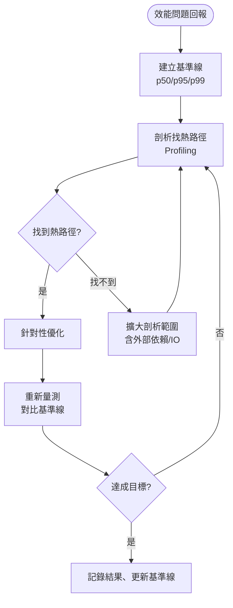

# 第 32 章｜效能量測先於優化
## ⸺ 不知道慢在哪裡,改再多也只是猜

> **前置閱讀**:[第 27 章｜從告警到根因:生產環境除錯](../part-06-operations/ch-27-alert-to-rootcause.md)
> **下游章節**:[第 33 章｜瓶頸定位:CPU/IO/網路/鎖](./ch-33-bottleneck.md)

## 32.1 共感現場:那個「直覺」優化掉三天

你可能也遇過這種任務:「這支 API 很慢,幫我優化一下。」

我帶過一個後端工程師,就叫他阿宇吧。他在一家電商公司 CartWave 工作,負責維護訂單管理系統。有一天 PM 反映商品列表頁加載「感覺很慢」,於是阿宇拿到了這個任務。

他是個認真的人,接到任務的第一反應是打開程式碼找「可以優化的地方」。他看到商品查詢用的是全欄位 `SELECT *`,就改成只選需要的欄位;看到一個迴圈裡有重複的條件判斷,就抽出來;又發現有一個地方沒加 Redis 快取,就加上去。三天後,他把這些改動都推上去了。

上線之後,PM 說:「好像快了一點點,但還是很慢。」

阿宇去看了一眼監控,發現 p99 回應時間幾乎沒有改變——從 3.2 秒降到了 3.0 秒。三天的工,換來 200 毫秒。

他有點沮喪,跟我說:「我覺得我改的那些明明是問題。」

他說的也沒錯,那些確實是可以改的地方。可是真正讓這支 API 慢的地方,是一個他沒注意到的東西:在商品列表底層,有一個呼叫庫存服務的 HTTP 請求,每次都在等 600 毫秒。不管前面的查詢怎麼優化,這 600 毫秒都在那裡穩穩等著。

這就是為什麼「先做測量」這件事如此重要——不是因為直覺不值錢,而是在沒有數據之前,直覺常常帶我們去改那些「看起來可疑」的地方,而不是「真正造成慢的」地方。

## 32.2 真正的問題:把「優化欲望」和「優化目標」分開

我們把阿宇的案子慢慢拆開來看,你會發現他遇到的困境其實很常見,有個名字:過早優化(Premature Optimization)。

Donald Knuth 在 1974 年的論文〈Structured Programming with go to Statements〉裡說了一句後來被反覆引用的話:

> "Premature optimization is the root of all evil."

這句話被引用了五十年,但也被斷章取義了五十年。完整的段落是:「程式設計師花費大量時間去思考、擔憂程式中非關鍵部分的速度,這些對效率的優化嘗試,實際上有強烈的負面影響——我們應該忘記那些微小的效率改善,大約 97% 的時間是這樣;過早優化是萬惡之根。然而,我們不應該錯過那關鍵的 3% 的機會。」

Knuth 從沒說「不要優化」。他說的是:在你還不知道那 3% 在哪裡之前,就去「感覺有問題」的地方動手,幾乎必然會花在那 97% 的地方——那些改了對速度幾乎沒有幫助的部分。

這個觀察並非孤例。1971 年,電腦科學家 Donald Gillies 記錄了類似的發現:大多數程式的效能問題集中在不到 10% 的程式碼路徑上。工具公司 Dynatrace 在 2023 年的 APM 調查報告裡也呼應了相似的數字——超過八成的生產環境效能問題,根源在外部依賴或資料庫,而非工程師最常「感覺有問題」的業務邏輯本身。

順著這個道理,阿宇的三天就能解釋了。`SELECT *`、迴圈條件、快取——這些確實不是最佳實踐,但在整體 3 秒的 API 裡,它們加起來可能只佔 200 毫秒不到。而那個庫存服務的 HTTP 呼叫佔了 600 毫秒,阿宇從來沒看到它,因為他沒有去量——他直接從「看程式碼找問題」開始。

這就帶出了工程師面對效能問題時,真正容易混淆的兩件事:

| | 優化欲望 | 優化目標 |
|---|---|---|
| 驅動力 | 直覺、程式碼品味、「這看起來不對」 | 量測數據、剖析結果 |
| 關注點 | 程式碼寫法 | 實際執行時間分佈 |
| 危險 | 改了對品質有益但對速度無感的地方 | — |
| 正確順序 | 第二步(有了目標才執行) | 第一步 |

「優化欲望」不是壞事——它推動我們維持程式碼品質。可是拿它來對付效能問題,就容易走偏。效能問題有一個特質:它的成因往往不是你「感覺有問題」的地方,而是藏在某條你不知道存在的慢路徑裡。

那麼問題來了——如果不能靠直覺,那效能問題該從哪裡開始?

## 32.3 一起做判斷:四步建立量測基礎

答案其實很直接:**先量,再找瓶頸,改動要小步驗證,最後更新基準線留存。** 這個順序一旦確立,優化工作就會從「猜測」變成「驗證」。

讓我們一步一步走過這個流程。

### 32.3.1 第一步:建立基準線(Baseline)

在改任何東西之前,你需要先知道「現在的樣子」。這聽起來很基本,但很多人跳過了這步——包括阿宇,他開始改動之前,沒有記錄下任何具體數字。

一個好用的基準線包含三個要素:

```
基準線三要素:
  ① 在哪個環境量測(盡量接近生產)
  ② 用什麼負載模式量測(真實流量模式或貼近真實的合成負載)
  ③ 量哪些指標(p50、p95、p99 回應時間、吞吐量、錯誤率)
```

為什麼是 p95 和 p99 而不是平均值?因為平均值很容易被少數快速請求拉低,讓你以為情況比實際好。p99 告訴你「最慢的 1% 用戶的體驗」——通常那正是用戶在抱怨的族群。

對於 CartWave 的商品列表,阿宇如果先量了基準線,他會記錄到:p50 = 800ms、p95 = 2100ms、p99 = 3200ms。那個 p99 的 3200ms,就是他要打敗的目標——而不是漫無方向地找「可以改的地方」。

在實務上,建立基準線最容易踩的一個坑是「用本機數字代替」。本機環境很難重現生產的問題——生產上跑著幾百個並發請求,本機只有你一個人在測;生產資料庫裡有幾千萬筆資料,本機可能只有測試用的幾百筆。阿宇案例裡,如果他在本機測試庫存服務呼叫,可能只要 5ms,因為本機測試的 mock 服務根本不會有網路延遲。Staging 環境對接真實庫存服務之後,那 600ms 才現身。

正因如此,基準線的環境說明要寫清楚——「Staging,對接生產庫存服務」和「本機,用 mock 服務」量出來的數字,不能拿來直接比較。把這件事明確寫進紀錄卡的「環境」欄位,下次有人看這份紀錄,才不會拿著本機的基準線去評估生產的效能改善幅度。

### 32.3.2 第二步:剖析找熱路徑(Profiling)

有了基準線,下一步是找「時間花在哪裡」。這就是剖析(Profiling)的工作。

剖析工具的選擇依你的技術棧而定,但原理一樣:讓程式在執行過程中記錄每一段操作的時間,然後給你一張「時間分佈圖」。你要找的是那個佔了總時間最大比例的部分——那就是真正的瓶頸。



上圖有一個很重要的地方:剖析不只看「程式碼內部」,還要含「外部依賴與 IO」。阿宇案例裡的那個庫存服務 HTTP 呼叫,就是一個外部依賴——如果他只剖析自己的 Python 程式碼,就看不到那 600ms 被吃掉在哪裡。完整的剖析需要追蹤「一個請求從進來到出去,經過了哪些步驟,每步花了多久」。這就是為什麼分散式追蹤(Distributed Tracing)工具,例如 OpenTelemetry 1.x 搭配 Jaeger 或 Tempo,在微服務架構下格外重要——它能讓你看到跨服務的完整時間分佈。

這裡值得先釐清一個容易混淆的地方:阿宇在 §32.1 靠看程式碼找到的 `SELECT *`、多餘的條件判斷、快取缺失,這些確實是問題,改了也確實能讓程式碼品質變好。但效能瓶頸有個特質——真正造成慢的地方,往往不在「看起來可疑」的業務邏輯裡,而是藏在某條你沒預料到的外部依賴或 IO 路徑上。也就是說,「找到問題」和「找到瓶頸」是兩件不同的事,阿宇需要的是後者,而剖析工具正是為了補上這一塊而存在的。

在 CartWave 的案例裡,阿宇打開 Jaeger 的追蹤詳情後,看到的畫面大概是這樣:一個 820ms 的請求被分成了幾個 span:資料庫查詢佔了約 60ms、業務邏輯處理約 30ms,然後是 20 個幾乎一模一樣的 `GET /inventory` span,每個約 35ms,串行排在一起加總 700ms。這 700ms 正是那條藏起來的外部依賴路徑——而那段程式碼本身看起來就是一行普通的 `for product in products: inventory_service.get(product.id)`,沒有任何「看起來有問題」的跡象,阿宇靠看程式碼永遠找不到它。

剖析的另一個實務技巧是:**先從整體追蹤(Trace)入手,鎖定慢 span 之後,再用 Application Profiler 深入那個 span 的 CPU 行為。** 兩層工具配合使用——Trace 告訴你「哪裡慢」,Profiler 告訴你「慢的那一段在做什麼」——比單獨使用任一個都更有效率。

### 32.3.3 第三步:小步改、快速驗

找到熱路徑之後,一個好用的角度是:**一次只動一個變量,改完就量,再改再量。** 這樣做有兩個好處:第一,你知道每個改動的實際效果;第二,如果有一個改動沒有幫助,你能直接發現並回滾,而不是把五個改動捆在一起推上去,事後不知道哪個有用哪個沒用。

阿宇在找到庫存服務串行呼叫是熱路徑之後,他列出了幾個可能的改法:

1. 把串行呼叫改為批次 API(一次送 20 個 product_id,改串行為一次呼叫)
2. 庫存結果加 Redis 快取,TTL 60 秒
3. `SELECT *` 改為只取需要欄位

他選擇先改第一個——因為 Jaeger trace 顯示熱路徑在外部呼叫的串行,批次 API 直接對症。改完之後,他重跑了同樣的負載測試:p99 從 3200ms 降到 1850ms,改善 42%。這個數字告訴他這個方向是對的。

接著他再改第二個(快取),再量:p99 從 1850ms 降到 980ms。然後改第三個(選欄位),再量:p99 從 980ms 降到 940ms,改善只有 4%。

這 4% 非常說明問題:SELECT * 的問題確實存在,但在整個請求的時間分佈裡它就是個邊際效應。如果阿宇三天前就是從這裡開始改,花了三天,效果就是這個 4%。

**一個常見的踩坑是:「我在本機測了,快很多。」然後推上 Staging 之後,數字沒有預期中的改善。** 原因通常是本機環境的資料量、並發量、外部依賴的延遲都和生產不同。所以「小步驗」的驗,一定要在有代表性的環境裡量——不能拿本機的「感覺快了」當成驗證通過的標準。

### 32.3.4 第四步:更新基準線

前面三步之後,效能工作還差最後一件事:把最終的數字記錄下來,作為下一輪的起點。

這步常被跳過,原因很簡單——優化完了,PM 說謝謝,大家去做下一件事了。但三個月後,同一支 API 的效能回歸了(也許是某個新功能引入了新的 N+1 查詢),沒有人手上有對比數字,只知道「以前好像比較快」。這時候又要從頭建立基準線,重走一遍量測流程。

把「更新基準線」列進優化工作的 Definition of Done,只需要三個數字(p50/p95/p99)和一句環境說明,但每次改動後都要做這件事。

正因如此,31.3 的流程是**四步**,不是三步——前面提到的三步(基準線→剖析→小步改)是核心循環,但少了「更新基準線」這個收尾,整個流程就不閉合:下次遇到問題,你還是從零開始。

把這四步整合成一個決策框架,大概是這樣:

| 步驟 | 要做的事 | 不做的風險 |
|---|---|---|
| **① 建立基準線** | 記錄 p50/p95/p99、吞吐量、錯誤率;固定測試環境與負載模式 | 改了之後不知道有沒有用;無法向 PM 說明進展 |
| **② 剖析熱路徑** | 用 Profiler 或 Trace 找出時間最集中的那一段(含外部依賴) | 優化了無關緊要的地方,真正的瓶頸還在 |
| **③ 小步改+驗** | 一次一個變量,每改一個就重量一次 | 多個改動混在一起,不知道哪個有效;難以回滾 |
| **④ 更新基準線** | 將最終結果記錄為新的基準線,作為下一輪的起點 | 下次遇到效能回歸,沒有對比數字 |

這四步的本質,其實就是「大膽假設、小心求證」——先用剖析結果建立假設(「慢在這裡」),再透過小步改動來驗證假設,讓數字說話而不是讓直覺說話。

### 32.3.5 工具箱一覽

不同技術棧有不同的剖析工具,但用途是共通的。下表版本號供參考,各工具大版本間 API 相近,實際使用前建議確認最新穩定版本。

| 類型 | 常見工具 | 適用場景 |
|---|---|---|
| **Application Profiler** | py-spy v0.3+、async-profiler v3+(JVM)、pprof v1.1+(Go) | 找 CPU 熱點、找記憶體洩漏 |
| **Database Query Profiler** | EXPLAIN ANALYZE(PostgreSQL 17)、slow query log(MySQL 8.0+) | 找慢查詢、索引缺失 |
| **Distributed Tracing** | OpenTelemetry 1.x + Jaeger v1.50+ / Tempo v2.x | 跨服務找慢點(含外部依賴) |
| **Load Testing** | k6 v0.50+、Locust v2.x、JMeter 5.x | 建立可重現的負載模式、量測基準線 |
| **APM** | Datadog APM v2.x、New Relic、Grafana Faro | 生產環境持續監控 |

選工具的原則很簡單:先確認你能看到「外部依賴的時間」——很多問題藏在那裡,而純粹的 Application Profiler 看不到。

## 32.4 容易絆倒的地方

下面幾個地雷,在效能工作裡幾乎每個工程師都踩過一兩個。說出來不是要提醒你「別犯這些錯」,而是希望你下次遇到類似情況時,能更快認出它。

### 絆倒處一:在自己機器上量,覺得夠快就好

本機環境很難重現生產的問題。生產上跑著幾百個並發請求,本機只有你一個人在測;生產資料庫裡有幾千萬筆資料,本機可能只有測試用的幾百筆。

有一個真實發生過的模式:工程師在本機優化了一個查詢,平均從 20ms 降到 5ms,覺得很滿意。推上 Staging 後跑負載測試,p99 依然在 2000ms 以上——因為那個查詢在大資料量下走了全表掃描,本機的幾百筆資料根本看不出來。工程師只用了 `EXPLAIN` 而不是 `EXPLAIN ANALYZE`,沒有拿到實際執行計畫,就以為問題解決了。

> **修正方向**:基準線要在接近生產的環境量測(Staging + 接近真實流量的負載模式)。如果必須在本機量,要清楚地在報告裡標注「本機 N 筆資料,僅供初步參考」,不能拿這個數字去評估生產的效能。

### 絆倒處二:只看平均值,忽略長尾

平均回應時間 300ms 聽起來很好,但如果 p99 是 5000ms,那 1% 的用戶每次請求要等 5 秒——而那 1% 可能正是你最大的幾個客戶。

一個具體的量化反例:CartWave 在優化前,商品列表 API 的平均回應時間約 820ms,看起來「還好」。但 p99 是 3200ms——那 1% 的用戶,每次刷商品列表都要等超過三秒。這個 p99 就是 PM 反映「感覺很慢」的源頭,而平均值把它掩蓋了。

> **修正方向**:養成習慣看 p95 和 p99。大部分的監控工具(Prometheus + Grafana)都能輕鬆取得百分位數;把它加進你的基準線模板,讓它成為每次效能工作的標準語言。

### 絆倒處三:改了覺得快了,但沒有數字支撐

「感覺快了」是最容易騙人的。點擊幾次、覺得反應快一點,就認為優化成功——但可能只是快取剛好被預熱了,或是測試資料剛好比較少。

量化反例也很清楚:阿宇在第一輪的三天改動之後,PM 的回應是「好像快了一點點」,阿宇自己點擊幾次也覺得「感覺有快」。但實際數字是 p99 只從 3200ms 降到 3000ms——改善 6%,遠不夠。如果阿宇只憑感覺就認為優化完成,那個庫存服務串行呼叫的問題永遠不會被解決。

> **修正方向**:任何效能改動,都要配一份「改前 vs 改後」的對比量測,具體的數字才能讓你(和 PM、Tech Lead)真正確認效果。沒有數字,等同於沒有改動。

### 絆倒處四:把所有地方都加快取

快取是把雙刃劍。加快取當然能讓請求變快——至少在快取命中的時候是這樣。但代價是快取失效(Cache Invalidation)管理的複雜性和資料不一致的風險。更重要的是,它會掩蓋底層的真正瓶頸:當快取命中率高時,你看不到那個慢查詢依然存在;一旦快取失效或遇到冷啟動,問題就會全面復發,而且因為表面上看起來「已經解決過」,反而更難被重新注意到。

一個具體的量化反例:如果阿宇一開始直覺加了 Redis 快取(不經過剖析),確實 p99 可能降到了 1000ms 左右,看起來問題解決了。但庫存服務那個串行呼叫依然存在——快取命中率低的時候(例如新上架的商品、快取冷啟動之後),p99 還是會回到 3000ms+。三個月後,促銷活動上線,新品大量湧入,快取命中率驟降,效能問題全面復發,而這時候根因已經被快取層埋起來,更難找了。

> **修正方向**:快取是工具,不是萬能藥。在加快取之前,先用剖析確認那個慢查詢是不是真的必要;如果查詢本身能被優化(加索引、改寫 SQL、改為批次呼叫),應該先優化查詢本身,再評估是否還需要快取。這樣的結果更乾淨,也更容易長期維護。

### 絆倒處五:優化完沒有更新基準線

優化成功之後,把新的數字記錄下來作為新的基準線——這步常被忽略。結果三個月後出現效能回歸,大家手上沒有對比數字,又要從頭量起。

量化反例:CartWave 優化完成後,如果沒有記錄新的基準線(p99 = 940ms),三個月後某個新功能引入了一個 N+1 查詢,p99 悄悄升到了 1500ms。沒有人注意到,因為沒有明確的「起點」可以對比——大家只知道「以前好像沒這麼慢」,卻說不出「以前是幾 ms」。重新找問題的時間,就是當初「花五分鐘更新基準線」代價的幾十倍。

> **修正方向**:把「更新基準線」列進優化工作的 Definition of Done。一段話、三個數字(p50/p95/p99)就夠了,但每次改動後都要做這件事。

## 32.5 帶得走的工具 ⸺ 一頁式「效能量測紀錄卡」

效能工作最容易迷失的地方,不是不知道怎麼優化,而是沒有對照——不知道自己從哪裡出發、改了什麼、效果是什麼。下面這張卡片的目的很簡單:讓你每次做效能工作,都有一份可以回顧的紀錄。

```text
效能量測紀錄卡 ⸺ {功能 / API 名稱}

【目標】
  - 效能問題描述:{PM 或告警說了什麼}
  - 量測時間:{日期}
  - 環境:{Staging / Production / 本機 + 說明差異}

【基準線(改動前)】
  - 負載模式:{N 個並發用戶,X 筆請求/秒,持續 Y 分鐘}
  - p50 回應時間:{ms}
  - p95 回應時間:{ms}
  - p99 回應時間:{ms}
  - 吞吐量:{req/s}
  - 錯誤率:
  - 工具:{用了什麼 Profiler / Tracer}

【改動清單】(每次一個,改完量一次)
  | # | 改動描述 | 改後 p99 | 效果 |
  |---|---------|---------|------|
  | 1 | {描述} | {ms} | {+N% / 無效} |
  | 2 | {描述} | {ms} | {+N% / 無效} |

【新基準線(改動後)】
  - p50:{ms}(原:{ms},改善:)
  - p99:{ms}(原:{ms},改善:{%})

【結論】
  - 達成目標?{是 / 否,說明原因}
  - 後續待辦:{還有什麼瓶頸未處理、或需要觀察的}
```

為什麼是這些欄位?「剖析發現」那欄很關鍵——它逼你在改動之前先說清楚「我找到的熱路徑是什麼」,這樣改動清單才是有根據的行動,而不是猜測。「改動清單」用表格一行一行記錄,是因為混在一起推的改動很難事後分析哪個有效;一行一個,讓每個決定都可以被單獨檢視。

**欄位填寫指南**:填這張卡時有三個地方容易填錯或漏填。

- **環境欄位**:很多人寫「Staging」就結束了。更有用的寫法是「Staging,120 萬筆商品資料,對接生產庫存服務(非 Mock)」——說清楚和生產的差異,下次看這份紀錄的人才能判斷數字的參考價值。
- **剖析發現欄位**:這欄的目的是讓你在寫下改動之前,先白紙黑字說清楚「熱路徑在哪裡」。如果你發現自己填不出這欄,那很可能就是還沒做剖析、還不知道慢在哪裡——這時候不應該去填「改動清單」,而是應該先去剖析。
- **改動清單的「效果」欄**:不要只寫「有效」或「無效」,寫具體數字:「p99 從 1850ms → 980ms(-47%)」。這個數字下次你要向 Tech Lead 或 PM 說明效能工作的價值時,就是最有力的依據。

### 32.5.1 範例:CartWave 商品列表 API 優化紀錄

回到阿宇那支讓 PM 喊慢的商品列表。如果他當初帶著這張卡去工作,整個流程大概是這樣的:

```text
效能量測紀錄卡 ⸺ GET /api/v2/products (商品列表 API)

【目標】
  - 效能問題描述:PM 反映商品列表「很慢」;用戶體驗不佳
  - 量測時間:2026-03-15
  - 環境:Staging,資料量 120 萬筆商品,與生產庫存服務對接
    (說明:選 Staging 而非本機,是因為需含外部依賴真實延遲;
     本機 mock 服務看不出庫存服務的 600ms)

【基準線(改動前)】
  - 負載模式:50 個並發用戶,分頁第 1 頁(每頁 20 筆),持續 5 分鐘
  - p50 回應時間:820 ms
  - p95 回應時間:2100 ms
  - p99 回應時間:3200 ms
    (說明:p99 是用戶感受最差的那群人;PM 說的「很慢」就是這裡;
     優化目標針對 p99,不只看平均值)
  - 吞吐量:38 req/s
  - 錯誤率:0.2%

【剖析發現】
  - 主要熱路徑:每次請求對庫存服務發一個同步 HTTP GET /inventory?product_ids=...
    → 每筆商品各呼叫一次,20 筆商品 = 20 次串行 HTTP 請求
    → 每次平均 35ms,串行加總約 700ms
  - 佔總時間比例:700ms / 820ms ≈ 85%
  - 工具:OpenTelemetry 1.x + Jaeger v1.50(追蹤跨服務呼叫)
    (說明:光看 Python Profiler 看不到外部服務時間;
     分散式追蹤才能看到這 85%;這是阿宇原本沒做到的那一步)

【改動清單】
  | # | 改動描述 | 改後 p99 | 效果 |
  |---|---------|---------|------|
  | 1 | 庫存服務呼叫改為批次 API(一次送 20 個 ID,改串行為一次) | 1850 ms | -42% ✅ |
  | 2 | 庫存結果加 Redis 快取,TTL 60 秒(庫存允許 1 分鐘延遲) | 980 ms | -47% ✅ |
  | 3 | 商品查詢從 SELECT * 改為只取需要欄位 | 940 ms | -4% (邊際) |

【新基準線(改動後)】
  - p50:310 ms(原:820 ms,改善:62%)
  - p95:720 ms(原:2100 ms,改善:66%)
  - p99:940 ms(原:3200 ms,改善:71%)
    (說明:記錄改善百分比,下次出現效能回歸才有對比基準;
     這也是向 PM 交代成果最有力的數字)

【結論】
  - 達成目標?是。p99 從 3200ms → 940ms,PM 定義的「可接受」目標為 1000ms 以下。
  - 後續待辦:庫存服務若擴展到更多 SKU 品類,批次 API 上限(目前 100 個 ID/次)
    需要評估;快取 TTL 策略在促銷期間需另行討論。
```

你注意到了嗎?第 3 個改動(SELECT * 改為選欄)只帶來 4% 的改善——那個改動本身是好的實踐,但它對效能問題幾乎沒有幫助。如果阿宇一開始只做那三天的改動,就是把力氣花在了這個 4% 上。

效能工作的價值不是「改得多」,而是「改對地方」。這張卡最大的用處,就是讓你在動手之前先知道那個「85%」在哪裡——剩下的事,就是照著做。

## 32.6 本章回顧

讀完這一章,你應該已經能:

- [ ] 說清楚「先量再改」和「直覺優化」的差別,以及過早優化為什麼是效能工作最常見的陷阱
- [ ] 在開始任何效能工作之前,建立一份包含 p50/p95/p99 的量測基準線
- [ ] 使用剖析工具(含 Distributed Tracing)找出熱路徑,而不是靠「看程式碼找問題」
- [ ] 一次只改一個變量,改完就量,讓數字說明每個改動的實際效果
- [ ] 填出一份「效能量測紀錄卡」,讓你的優化工作有始有終

如果想先從一件事開始——**下次遇到效能問題,先用五分鐘跑一遍剖析工具,看清楚時間花在哪裡,再開始改**。這五分鐘有很高的機率幫你省下三天,就像阿宇的那三天,其實只需要一個 Jaeger trace 就能找到方向。

下一章,我們會在「找到熱路徑」的基礎上往下走:當你知道瓶頸存在,如何判斷它是 CPU 問題、IO 問題、網路問題、還是鎖競爭?定位瓶頸的類型,才能選對優化手段。

## Cross-References

- **下一章**:[第 33 章｜瓶頸定位:CPU/IO/網路/鎖](./ch-33-bottleneck.md) ⸺ 找到熱路徑之後,如何判斷瓶頸類型
- **強連結**:[第 27 章｜從告警到根因:生產環境除錯](../part-06-operations/ch-27-alert-to-rootcause.md) ⸺ 生產環境的量測視角與除錯方法論
- **強連結**:[第 26 章｜可觀測性落地](../part-06-operations/ch-26-observability.md) ⸺ p50/p95/p99 的基礎設施來自可觀測性建設
- **強連結**:[第 34 章｜快取的層次與失效策略](./ch-34-caching.md) ⸺ 本章 §32.4 提到快取不是萬能藥,第 34 章深入快取的正確用法
- **跨書參考**:見 SA/SD Playbook 第 30 章｜效能品質屬性 ⸺ 效能目標的設計高度(架構層);本章處理實作層的量測與優化
