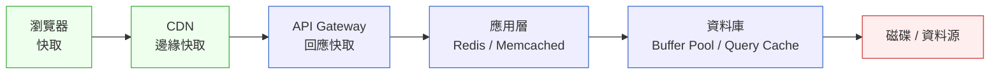
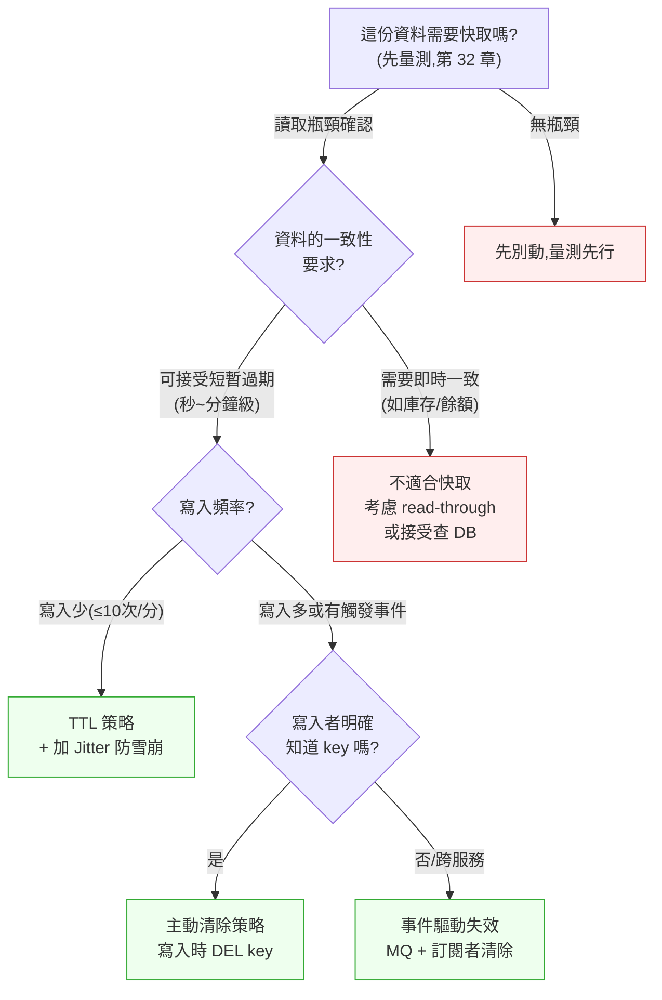

# 第 34 章｜快取的層次與失效策略
## ⸺ 放對地方,才是真正的快

> **前置閱讀**:[第 33 章｜瓶頸定位(CPU/IO/網路/鎖)](./ch-33-bottleneck.md)、[第 32 章｜效能量測先於優化](./ch-32-measure-first.md)
> **下游章節**:[第 35 章｜並發、非同步與背壓](./ch-35-concurrency.md)、[第 36 章｜容量規劃與壓力測試](./ch-36-capacity.md)

## 34.1 共感現場:「加了快取,但系統還是慢」

你可能也遇過這樣的處境。

一位工程師叫小薇,在一家做電商平台的公司 CartNova 負責商品列表的後端。某一個季度,流量開始明顯上升,商品詳情頁的資料庫查詢時間在壓測時爬到了幾百毫秒,PM 催著優化。

小薇很快做了決定:「加 Redis 快取。」她在服務層加了一段邏輯——每次請求先查 Redis,如果命中就直接返回,沒命中再查資料庫,然後把結果寫回 Redis,TTL 設定為 10 分鐘。

加完上線,p99 延遲確實降了一半。大家都鬆了一口氣,覺得這件事做完了。

可是兩個月後,問題慢慢浮現:促銷活動開始的瞬間,大量請求在同一時刻打到資料庫,因為促銷商品的快取剛好在活動前幾分鐘集體過期了。另一件事是,商品的庫存更新之後,有些用戶還是看到舊的庫存數字,客服接到投訴。快取命中率一直是 90% 以上,但偏偏在最關鍵的時候,它就是幫不了你。

問題不是「有沒有加快取」,而是「快取加在哪、怎麼讓它失效」。這兩件事,在大家說「快取」的時候,往往被當成理所當然,但它們才是真正需要決策的地方。

## 34.2 真正的問題:快取不是一個開關,是一套設計

從小薇的故事往裡看一層,你會發現真正的問題並不是工具選錯了——Redis 本身沒問題。問題在於:她做了一個決定(「加快取」),但這個決定背後還有幾個更深的問題沒有被問到。

**快取應該放在哪一層?**

一個完整的系統,從瀏覽器到資料庫,至少有五個可以放快取的地方——客戶端、CDN、API Gateway、應用層、資料庫查詢快取。小薇在應用層加了 Redis,這個選擇本身沒有錯,但她沒有問的是:「有沒有更前面的層可以擋掉更多請求?商品圖片和靜態資訊,為什麼不在 CDN 就擋住?」

這個問題為什麼重要?因為快取的節省效益,跟它距離資料源的遠近成正比。CDN 命中代表請求根本沒碰到後端伺服器,每秒能擋住的請求量遠遠超過應用層 Redis。如果一筆靜態資料放在應用層 Redis,每次命中雖然比查資料庫快,但這個請求依然需要通過負載平衡器、網路、應用服務,才能抵達 Redis——而同一筆資料放在 CDN,整個後端都不需要被喚醒。選對層,比選什麼工具更重要。

**資料的變化頻率是多少?**

快取的本質是「用短暫的不一致換取速度」。接受這個交換的前提是:我知道我願意接受多長時間的不一致。如果你快取的東西幾乎不變(例如商品分類名稱),設定 1 小時 TTL 完全合理。但如果你快取的是庫存數量,一個下單動作就會讓快取裡的數字過期——10 分鐘 TTL 不是太長或太短的問題,而是這個欄位根本不適合用 TTL 作為失效策略,因為任何一個時間點的過期都可能讓用戶看到錯誤的可購數量。

這就是為什麼同一支 API 回應裡的不同欄位,可能需要完全不同的快取策略——商品名稱可以快取幾分鐘,但庫存數量一旦改變就必須立刻失效。把整個回應物件當成一個快取單位,是大多數快取問題的起點。

**誰來決定快取什麼時候失效?**

這就帶出了快取設計裡最核心的一道問題。失效有三種思路:讓快取「自然老死」(TTL)、讓寫入者主動「通知它該走了」(Cache Invalidation on Write)、或讓整個系統透過事件流廣播更新訊號(事件驅動失效)。大多數工程師只用 TTL,因為它最容易實作,不需要協調寫入端與快取端——但它的代價是「過期之前資料不準、過期的瞬間所有快取同時失效、大家都去打 DB」。理解這三種思路各自的邊界,才能在設計時做出有意識的取捨。

也就是說,「快取」不是你打開或關掉的一個開關,而是一套需要思考放哪、存什麼、多久有效、如何更新的設計。理解了這三件事,才能讓快取真的幫到你,而不是幫你藏住另一個定時炸彈。接下來,我們把這三個問題一起變成可以操作的判準。

## 34.3 一起做判斷

順著上面的三個問題,我們一起把它們變成可以操作的判準。

### 34.3.1 快取的層次圖:先選放哪,再選怎麼快

一個請求從瀏覽器到資料庫,會經過以下幾個位置。每個位置都可以放快取,但適合擋的東西不一樣。

在選擇層次之前,有一個思維轉換很有幫助:不要把快取想成「加速工具」,而要把它想成「需求攔截器」。每往更前面的層次移動一步,能攔截的需求量就成倍增加——CDN 可以攔截全球分散的讀取需求,API Gateway 可以攔截熱門公開查詢,應用層 Redis 可以攔截 DB 讀取壓力。問「這份資料應該在哪一層被攔截?」比問「我應該用什麼快取工具?」更能讓你找到正確的起點。



越靠左邊的快取,命中時節省的成本越高——CDN 命中就不需要觸碰後端伺服器,而應用層 Redis 命中還是得走一次網路。所以在決定「快取加在哪」之前,先問:「這份資料能被哪個層合法地快取?」

| 快取層級 | 適合的資料 | 不適合的資料 |
|---|---|---|
| 瀏覽器本地 | JS/CSS 靜態資源、使用者偏好 | 需要即時更新的內容 |
| CDN 邊緣 | 商品圖片、靜態文案、公開 API 回應 | 需要驗證身份的個人化回應 |
| API Gateway | 熱門的公開查詢(如排行榜) | 低重複率的個人化請求 |
| 應用層 Redis | 資料庫查詢結果、Session Token | 庫存/餘額等需要嚴格一致的欄位 |
| DB Buffer Pool | 資料庫自行管理,無需手動介入 | — |

### 34.3.2 失效策略的選擇:TTL、主動清除、還是事件驅動

快取放好了,接下來要決定「它什麼時候失效」。這裡有三種主要策略,各有適用的情境。

**策略一:TTL(Time-To-Live,時間驅動)**

設定一個存活時間,時間到了自動過期。實作最簡單,不需要協調。

適合:可以接受短暫過期的唯讀或低寫入資料——例如商品描述、促銷條文、推薦清單(用戶通常不會察覺推薦內容有 1-5 分鐘的延遲,所以這類欄位可以放心用較長的 TTL)。

不適合:需要即時一致性的欄位(庫存、餘額)、或高並發下大量快取同時過期的場景(雪崩風險)。

**策略二:主動清除(Cache Invalidation on Write)**

資料被更新時,主動刪除對應的快取 key,讓下次讀取重新建立。

適合:寫入者明確知道哪些 key 需要清除的場景——例如後台更新商品名稱時,清除商品詳情的快取。

不適合:資料關聯複雜、一筆更新會影響幾十個快取 key 的情況(清除邏輯容易漏掉)。

**策略三:事件驅動失效(Event-Driven Invalidation)**

透過訊息佇列或 CDC(Change Data Capture)廣播「資料已更新」的事件,讓快取訂閱者自行清除或更新。

適合:跨服務的快取需要保持一致時——例如庫存服務更新後,通知商品展示服務清除對應快取。

不適合:團隊沒有訊息佇列基礎設施、或一致性要求低到 TTL 就夠的場景。

這三個策略不是互斥的。CartNova 的實作思路可以是:商品描述用 TTL(5 分鐘),庫存用「主動清除 + 版本號比對」,跨服務的促銷資訊用事件驅動。

值得多想一下的是「主動清除」這個策略的邊界條件。當寫入者主動清除快取 key 時,有一個細節容易被忽略:如果寫入操作失敗了(例如資料庫交易回滾),快取清除的動作有沒有跟著回滾?答案通常是沒有——因為 Redis 的操作和資料庫交易是兩個獨立的系統。這帶來一個微妙的不一致:資料庫還是舊資料,但快取已經被清空,下一次讀取會去資料庫取到「正確的舊值」重新快取——這個情境下,主動清除反而幫了你。但如果寫入成功、清除失敗(例如 Redis 短暫不可用),快取裡就會留著舊資料,而資料庫已經是新的了。這種「寫成功但快取沒清」的窗口,就是主動清除策略需要搭配短 TTL 作為保底的原因:即使清除失敗,TTL 到期也能讓快取自然更新。兩種機制搭配使用,比任何一個單獨使用都要穩健。

### 34.3.3 決策樹:給這份資料選策略

下面是一個可以帶走的決策流程,幫你在遇到「這個要不要快取、怎麼快取」的問題時有個起點:



看到「不適合快取」這個節點,你可能會覺得有點奇怪——走到這裡是不是代表我們什麼都做不了?其實不是這樣的。「不快取」是一個主動的、重要的策略選擇,不是被迫的妥協或缺失。當一份資料的一致性要求很高(例如庫存數量在搶購時刻不能有任何誤差),讓每次讀取都直接查資料庫,是對這個欄位最誠實的處理方式——它確保讀者拿到的永遠是最新狀態,代價是多一次 DB 查詢。這個代價通常比因為過期快取導致超賣要小得多。你可以針對「高一致性要求的欄位」考慮 read-through 模式(讀取時同步刷新快取)、或者接受它不快取,同時把精力放在優化這個欄位的資料庫查詢效率上。「不快取某個欄位」和「不懂快取」是兩件完全不同的事。

現在假設你已經決定要加快取,接下來必須知道一個關鍵事實:快取一旦上線並被大量請求依賴,就會暴露三種常見的危機。這三種危機的名字相近但成因不同,理解清楚才能設計好防護。

### 34.3.4 三大快取危機的防護:雪崩、穿透、擊穿

**快取雪崩(Cache Avalanche)**

大量快取在同一時刻過期,導致同一批請求全部打穿到資料庫。最常見的原因是所有 key 都設了相同的 TTL。

修正方向:在 TTL 基礎上加入隨機 Jitter(抖動)——例如 TTL = 5 分鐘 + rand(0~60秒),讓過期時間分散。

**快取穿透(Cache Penetration)**

請求的 key 在資料庫和快取裡都不存在(例如查詢一個不存在的商品 ID),導致每次都穿透到資料庫。

修正方向:對不存在的 key 也快取一個空值(短 TTL),或者使用 Bloom Filter 在快取層前攔截不可能存在的 key。

**快取擊穿(Cache Breakdown / Hotspot)**

一個極熱門的 key 過期瞬間,大量並發請求同時去重建它,造成資料庫瞬間高負載。

修正方向:用 Mutex Lock(互斥鎖)或 Singleflight 模式確保同一時刻只有一個請求去重建快取,其他請求等待結果。Go 標準函式庫的 `golang.org/x/sync/singleflight` 就是為了這個場景設計的;在其他語言裡,也可以用 Redis 的 SET NX(Not Exists)原語實現分散式互斥鎖,確保跨多個實例也只有一個請求去重建快取。

另一個值得注意的地方是:三種危機有時會同時發生。促銷活動開始時,大量 key 集體過期(雪崩)→ 熱門商品 key 被大量請求搶著重建(擊穿)→ 有人查詢了不存在的促銷碼(穿透)。這三件事可以在幾秒內疊加發生。所以在大促前的技術 checklist 裡,這三個防護手段都要確認就位,而不是「只要其中一個」。

| 危機類型 | 起因 | 關鍵解法 |
|---|---|---|
| 雪崩 Avalanche | 大量 key 同時過期 | TTL Jitter、快取預熱 |
| 穿透 Penetration | key 根本不存在 | 快取空值 + 短 TTL、Bloom Filter |
| 擊穿 Breakdown | 熱 key 過期瞬間 | Mutex / Singleflight 鎖定重建 |

## 34.4 容易絆倒的地方

快取的概念理解起來不難,但在實作時有幾個地方很多人都踩過一腳。所以這裡不是提醒你「注意」,而是讓你下次看見它的時候,心裡有個底。

---

**絆倒處一:用「全部」或「什麼都不快取」的二元思維。**

剛接觸快取的工程師,容易走兩個極端——要麼「這個服務全部加 Redis」,要麼「快取很複雜,先不動」。這兩個決定都有問題:前者沒有問過「每個欄位的一致性要求」,後者放棄了一個有效的工具。

> **修正方向**:快取決策是逐欄位的,不是逐服務的。針對同一張 API 回應裡不同的欄位,可以有不同的策略——商品名稱用長 TTL,庫存數量不快取或用極短 TTL 加主動清除。

---

**絆倒處二:TTL 設太長,然後被過期資料燒一次,就改成「不快取」。**

被過期資料害到投訴之後,有人的第一個反應是「那我把 TTL 改成 30 秒」或「那乾脆不快取這個欄位」。但這兩個做法其實都沒有解決根本問題——30 秒 TTL 只是把過期資料的窗口縮小了,沒有讓它消失。

> **修正方向**:如果一個欄位在任何時刻的過期都會引起問題,正確的解法是換失效策略,而不是調 TTL 數字。寫入時主動清除,或加上版本號比對,才能讓快取「資料更新時就失效」。

---

**絆倒處三:快取了包含太多欄位的大型物件。**

為了省事,有人直接把整個商品物件序列化後存進 Redis。這帶來兩個問題:其一,任何一個欄位的更新都會讓整個大 key 過期;其二,不同請求者可能只需要欄位的一個子集,快取的效率低落。

> **修正方向**:考慮按欄位群組拆分快取 key——把「不常變的靜態欄位」和「頻繁更新的動態欄位」分開存。讀取時組合,這樣更新一個欄位不會把另一群欄位的快取也清掉。

---

**絆倒處四:只監控快取命中率,不監控過期後的行為。**

命中率 90% 聽起來很好,但如果那 10% 的 miss 集中在促銷活動開始的前幾秒——也就是最需要快的時候——那這個 90% 其實是個假象。更重要的監控指標是「miss 的分布是否均勻」以及「miss 的峰值是否可被 DB 承受」。

> **修正方向**:在監控快取命中率之外,同時監控「快取 miss 時資料庫的 QPS 峰值」。如果 miss 會觸發 DB 峰值超過安全水位,就需要考慮快取預熱或限流保護。

一個好用的監控組合是:命中率(Redis INFO stats 中的 keyspace_hits / keyspace_misses)搭配 DB 端的 QPS 儀表板,兩個指標一起看,才能判斷「miss 的代價是否在可接受範圍內」。如果你使用 OpenTelemetry 1.x,可以在快取層建立自訂 span,在每次 miss 時記錄對應的 key pattern 與 DB 查詢耗時,讓 miss 的分布圖在每次促銷前成為標準的 pre-flight checklist 之一。

---

**絆倒處五:快取預熱(Cache Warm-up)被遺忘在計畫之外。**

有些系統的快取命中率在正常流量下很漂亮,但服務重啟之後的幾分鐘內,快取是空的——所有請求都要打穿到 DB 才能重建快取,這段時間俗稱「冷啟動期」。在流量低的時候重啟,通常沒有感覺。但如果重啟發生在促銷活動開始前,或者流量突然大幅上升的時刻,冷啟動期的 DB 壓力可能遠超平時。

> **修正方向**:針對高命中率的熱門 key,在服務啟動時或促銷活動前執行「預熱腳本」——提前把熱門商品或常用資料寫入快取,讓服務從第一個請求進來就有快取可用。CartNova 的做法是在每次促銷開始前 30 分鐘,自動執行一個批次腳本將活動商品的靜態資料推入 Redis,確保快取在流量高峰前就已就位。

## 34.5 帶得走的工具 ⸺ 一頁式「快取設計決策卡」

當你在設計一個新功能的快取策略,或者在 code review 裡看到一段新的快取邏輯,這張卡片可以幫你把關鍵問題都過一遍。它不是要讓你填很多東西,而是確保你問到了真正會出事的那幾個問題。

```text
快取設計決策卡 ⸺ {功能/資料名稱}

一、放在哪一層?
   - 候選層级:[ ] 瀏覽器  [ ] CDN  [ ] Gateway  [ ] 應用層(Redis)  [ ] DB
   - 選擇:{你的選擇} | 原因:{為什麼這層合適}

二、快取什麼?
   - 快取的資料粒度:{整個物件 / 欄位群組 / 單一欄位}
   - 一致性要求:
     - 這份資料過期幾秒/幾分鐘,業務上可以接受嗎? {是 / 否}
     - 如果用戶看到的資料是舊的,會有什麼影響? {說明}

三、失效策略?
   - [ ] TTL  TTL = {X} 秒,加 Jitter = {0~Y} 秒  →  適合「{說明}」
   - [ ] 主動清除  觸發點:{哪個寫入操作}  清除哪些 key:{列出}
   - [ ] 事件驅動  訊息來源:{哪個 topic/channel}

四、三大危機的防護?
   - 雪崩:TTL 是否加了 Jitter? {是 / 否 / 不適用}
   - 穿透:不存在的 key 是否有保護? {空值快取 / Bloom Filter / 不適用}
   - 擊穿:熱 key 過期是否有 Mutex 或 Singleflight? {是 / 否 / 不適用}

五、監控計畫?
   - 命中率目標:{X%}
   - DB QPS 在 miss 峰值時的安全上限:{X QPS}
   - 告警條件:{例如 miss rate > 20% 持續 1 分鐘}
```

為什麼是五個問題,而不是一張表格或一個 TTL 數字?因為快取設計的坑,幾乎全都藏在「只想到其中一兩件事」裡。這張卡片的目的是讓你在設計時和 review 時,都不會遺漏第三、第四件事。

### 34.5.1 範例:CartNova 商品詳情頁的快取設計

讓我們回到 CartNova 和小薇的故事。如果她在加快取之前,先用這張卡片過一遍,商品詳情頁的快取設計大概會長這樣:

```text
快取設計決策卡 ⸺ CartNova 商品詳情頁

一、放在哪一層?
   - 候選層级:[x] CDN  [x] 應用層(Redis)
   <!-- 為什麼這欄:商品的靜態圖片與描述文案適合放 CDN,不需要打後端;
        但庫存數量是動態的,CDN 會快取到舊值,只能在應用層管控。
        這就是為什麼「商品詳情」這個 API 不能整包塞進同一層快取。 -->
   - 靜態資產(圖片/描述)→ CDN,TTL 24h
   - 動態資料(庫存/價格)→ Redis 應用層,個別欄位策略

二、快取什麼?
   - 快取的資料粒度:按欄位群組分開存
     - Group A(靜態):商品名稱、描述、圖片 URL、規格  → key: product:{id}:static
     - Group B(動態):庫存數量、促銷價格             → key: product:{id}:dynamic
   <!-- 為什麼這欄:把靜態和動態分開,是為了讓庫存更新時只清 dynamic key,
        不影響靜態內容的快取。如果整包存在一個 key 裡,每次庫存變動都要清整個物件。 -->
   - 一致性要求:
     - 靜態欄位:過期幾分鐘可以接受 → 是
     - 庫存欄位:過期1秒都可能讓用戶看到錯誤庫存 → 否(不用 TTL)

三、失效策略?
   - Group A: [x] TTL = 300 秒,Jitter = 0~60 秒
     → 商品後台更新時也同步主動清除對應 key
   - Group B: [x] 主動清除
     → 觸發點:庫存服務的 inventory.updated 事件
     → 清除:product:{id}:dynamic
   <!-- 為什麼這欄:庫存用主動清除而非 TTL,是因為庫存不準確的窗口
        太長會引發超賣或錯誤展示。把責任放在「寫入者清除」而非「時間到期」,
        一致性才有保障。 -->

四、三大危機的防護?
   - 雪崩:Group A TTL 加了 Jitter ✅
          促銷前 30 分鐘執行快取預熱腳本,提前補滿熱門商品 ✅
   - 穿透:查詢不存在的 product_id 時,快取空物件,TTL = 60 秒 ✅
   - 擊穿:促銷活動開始時的熱 key,用 Singleflight 控制並發重建 ✅

五、監控計畫?
   - 命中率目標:≥ 85%
   - DB QPS 安全上限:1,000 QPS(壓測確認)
   - 告警:Group B miss rate 連續 1 分鐘 > 30% 觸發 PagerDuty
```

你可以看到,這張卡片並沒有幫小薇做決定——它只是讓每個決定都被問到了。「庫存欄位用主動清除」這個判斷,只有問過第二欄的一致性要求之後才會自然浮出來。把事情想清楚,不需要更高深的工具,只需要問對問題的習慣。

## 34.6 本章回顧

讀完這一章,你應該已經能:

- [ ] 說出快取的五個層次,並且能根據資料的特性,判斷應該在哪一層快取
- [ ] 區分 TTL、主動清除、事件驅動三種失效策略的適用情境
- [ ] 解釋快取雪崩、穿透、擊穿的成因,以及各自的防護手段
- [ ] 在設計快取時,把靜態欄位和動態欄位分開考慮,而不是整個物件統一策略
- [ ] 用「快取設計決策卡」在 code review 或設計討論時,快速把關關鍵問題

如果想先從一件事開始,我會建議 ⸺**檢查你現有的快取 TTL 有沒有加 Jitter**,因為「大量快取同時過期」是最容易在流量高峰時突然爆發的問題,而 Jitter 只需要一行程式碼,卻能顯著分散壓力。先守住這一件,你已經排除了快取雪崩這個最常見的地雷。

下一章,我們會往旁邊看——當系統不只靠快取提速,而是需要同時處理大量並發請求時,並發與非同步的設計選擇,又有哪些是值得仔細想清楚的。

## Cross-References

- **上一章**:[第 33 章｜瓶頸定位(CPU/IO/網路/鎖)](./ch-33-bottleneck.md) ⸺ 確認瓶頸在資料庫讀取後,再考慮快取
- **下一章**:[第 35 章｜並發、非同步與背壓](./ch-35-concurrency.md) ⸺ 快取解決了讀取瓶頸,並發設計處理的是同時大量寫入與請求的問題
- **強連結**:[第 32 章｜效能量測先於優化](./ch-32-measure-first.md) ⸺ 量測是決定「哪裡需要快取」的前提
- **強連結**:[第 36 章｜容量規劃與壓力測試](./ch-36-capacity.md) ⸺ 快取 miss 時 DB 能承受的 QPS,需要壓測才知道
- **跨書連結**:[SA/SD Playbook](https://github.com/EddyKuo/sa-sd-playbook) ⸺ 快取策略的架構設計高度(CAP 取捨、一致性協議)

