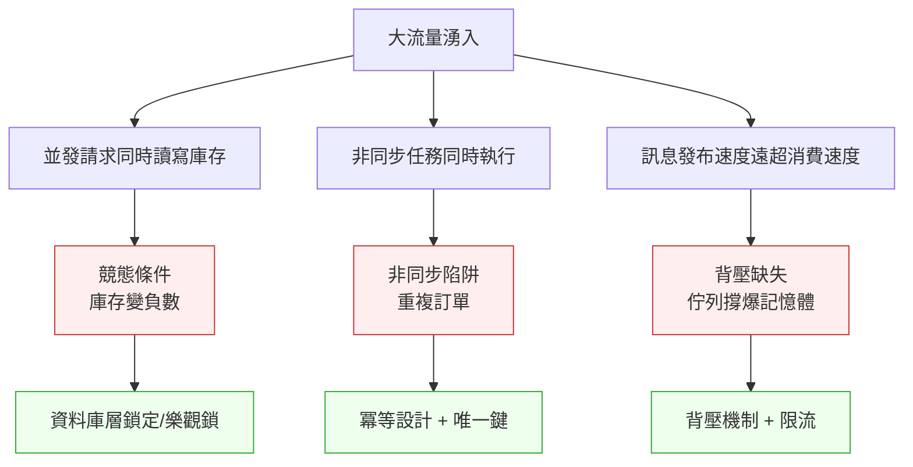
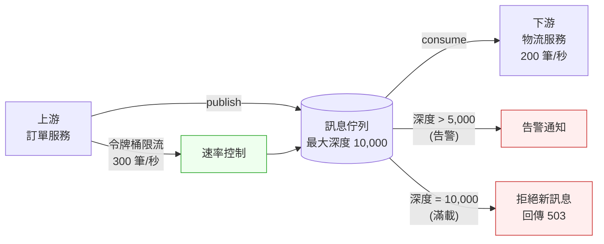
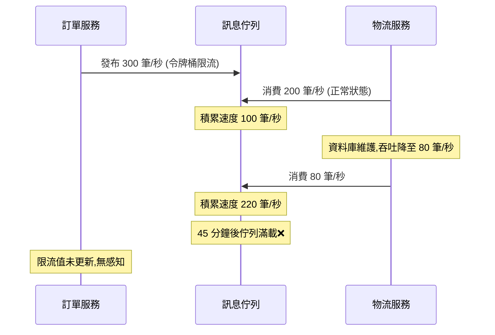

# 第 34 章｜並發、非同步與背壓
## ⸺ 當流量比你想的快一步,問題就在這裡等你

> **前置閱讀**:[第 33 章｜快取的層次與失效策略](./ch-33-caching.md)
> **下游章節**:[第 35 章｜容量規劃與壓力測試](./ch-35-capacity-planning.md)

## 34.1 共感現場:那個「平常完全沒問題」的服務

你可能也遇過這樣的場景。

平常跑得好好的服務,一到大流量就開始出怪事。不是直接 crash、不是報錯滿螢幕,而是那種曖昧的「有時候慢、有時候卡、有時候資料看起來不太對」。你跑去看監控,CPU 和記憶體都正常;去看日誌,一切看起來沒事。重開服務,奇怪,又好了。

帶過不少工程師的前輩可能會說:「這種症狀,十之八九是並發的問題。」

這一章要陪你聊聊三個彼此相關、但經常被混著用的概念:並發(Concurrency)、非同步(Asynchronous)、還有背壓(Backpressure)。它們在平常流量下幾乎隱形,一到真實負載就會現形——而且每次現形的方式,往往都稍微不一樣,讓人很難一眼看穿。

讓我用一個虛構的電商公司「ShopStream」的故事,把這三件事的關係說清楚。

---

ShopStream 是一家中型電商平台,做的是限時快閃活動。他們的訂單服務(Order Service)負責接收下單請求、扣庫存、建立訂單記錄,再非同步通知物流服務。平常流量每秒大約 80 筆訂單,一切順暢。

某個週五傍晚,他們跑了一場「萬人搶購」活動,流量在兩分鐘內飆到每秒 1,200 筆。結果:有一批訂單建立成功了,但庫存數字變成負數;有些訂單重複出現兩筆;物流通知的訊息佇列越堆越長,最後把記憶體撐到極限。

工程師小瑄打開程式碼,看到的是這樣一段:

```python
# Python 3.11 + asyncio
async def create_order(user_id: int, item_id: int, qty: int):
    stock = await db.get_stock(item_id)        # 讀取庫存
    if stock < qty:
        raise InsufficientStockError()
    await db.update_stock(item_id, stock - qty) # 更新庫存
    order = await db.insert_order(user_id, item_id, qty)
    await mq.publish("order.created", order)   # 發訊息到佇列
    return order
```

看起來很合理,對吧?讀庫存、判斷、扣庫存、建訂單、發訊息——步驟清楚,邏輯正確。

但問題正是藏在這段「邏輯正確」的程式碼裡。

## 34.2 真正的問題:三種問題,三條不同的根

讓我們把 ShopStream 的事情慢慢拆開,你會發現那個週五傍晚同時發生了三件不同性質的壞事,而每一件都有自己的根因。

### 34.2.1 競態條件:兩個執行緒看到同一個「還沒扣掉的庫存」

`create_order` 裡的這段讀-改-寫序列,在單執行緒的世界沒有問題。但在並發環境下,問題就浮出來了。

假設庫存剩 1 件,同時有兩個請求 A 和 B 進來:

1. A 讀到庫存 = 1,判斷夠用
2. B 也讀到庫存 = 1,也判斷夠用
3. A 扣掉 1,庫存變 0
4. B 也扣掉 1,庫存變 -1

這就是競態條件(Race Condition)。「讀到值」和「寫回去」之間有一個時間縫隙,而並發請求就從這條縫裡滑進來了。它很難在本機重現,因為你很少在本機同時發 1,200 個請求。

### 34.2.2 非同步陷阱:await 不代表原子性

小瑄的程式碼裡用了 `async/await`,這讓很多人以為「它是非同步的,所以是安全的」。但非同步和執行緒安全是兩回事。

`async/await` 解決的是 **I/O 等待的效率問題**:當你在等資料庫回應時,可以把執行權讓出去,讓事件迴圈處理別的請求,而不是乾等著。它不保證你的讀-改-寫之間「不會有人插進來」。換句話說,`async/await` 讓你同時服務更多請求,但同時服務更多請求,正好是競態條件最容易發生的場景。

這就是為什麼很多工程師剛學到 `asyncio` 或 Node.js Event Loop 的時候,會以為「非同步 = 不用擔心並發」。其實恰好相反,非同步程式設計讓你更容易同時跑多件事,也就讓你更需要考慮它們之間的干涉。

### 34.2.3 背壓缺失:下游吞不下去,佇列就爆掉

第三個問題,在物流服務那邊。`mq.publish("order.created", order)` 把訊息丟進佇列,就結束了。訂單服務不知道、也不在乎物流服務目前有沒有能力消化。

物流服務每秒能處理 200 筆訊息,但訂單服務每秒送進去 1,200 筆。佇列越積越長,記憶體不夠用,最後整個程序 OOM(Out of Memory)崩潰。

這就是背壓(Backpressure)問題——上游生產速度超過下游消費速度時,如果沒有機制把「我吞不下了」的訊號回傳給上游,系統就只能靠記憶體撐,直到撐不住為止。

三個問題,三條不同的根:



把根因分清楚,非常重要——因為這三個問題的解法不同,如果混在一起處理,很容易解了A、沒解B,然後以為問題解決了。

## 34.3 一起做判斷:三個問題,三個對應的判準

現在我們知道問題在哪了,順著這個道理,讓我們一步步看怎麼處理。三個問題來自三條不同的根,解法也不能混著用——如果用冪等設計去解競態條件,你會發現它只解了「重複請求」這一面,「同時讀到相同庫存」的縫隙還是在。所以我們逐一來看。

### 34.3.1 處理競態條件:鎖定策略的選擇

當「讀-改-寫」這個操作不能被打斷時,你需要讓這三個步驟對外「看起來是一個動作」。常見的做法有兩條路:

**悲觀鎖(Pessimistic Locking)**:先拿鎖再讀資料,確保沒有人能同時碰同一筆記錄。適合衝突頻率高、資料正確性要求嚴格的場景,例如金融交易。代價是等鎖的時間,高並發下可能成為瓶頸。

```sql
-- PostgreSQL 17:SELECT ... FOR UPDATE 在交易中拿悲觀鎖
BEGIN;
SELECT stock FROM inventory WHERE item_id = $1 FOR UPDATE;
-- 現在只有我能改這筆,其他人等著
UPDATE inventory SET stock = stock - $2 WHERE item_id = $1;
COMMIT;
```

**樂觀鎖(Optimistic Locking)**:讀資料時帶一個版本號,更新時確認版本號沒變。如果版本號被人改過,就重試。適合衝突頻率低的場景,如一般訂單建立。吞吐量高,但需要應用層寫重試邏輯。

```python
# 帶 version 欄位的樂觀鎖 (Python 3.11)
async def update_stock_optimistic(item_id: int, delta: int, retries: int = 3):
    for _ in range(retries):
        row = await db.fetchrow(
            "SELECT stock, version FROM inventory WHERE item_id = $1", item_id
        )
        new_stock = row["stock"] - delta
        if new_stock < 0:
            raise InsufficientStockError()
        updated = await db.execute(
            "UPDATE inventory SET stock=$1, version=$2 "
            "WHERE item_id=$3 AND version=$4",
            new_stock, row["version"] + 1, item_id, row["version"]
        )
        if updated == "UPDATE 1":
            return  # 成功,版本號符合,表示期間沒人插隊
        # 版本號被改過,重試
    raise ConcurrentUpdateError("無法在重試次數內完成庫存更新")
```

| | 悲觀鎖 | 樂觀鎖 |
|---|---|---|
| **適合衝突頻率** | 高 | 低~中 |
| **吞吐量** | 偏低(等鎖) | 高 |
| **實作複雜度** | 較低(資料庫處理) | 較高(需重試邏輯) |
| **典型場景** | 帳戶餘額扣款、座位預訂 | 一般訂單、計數器更新 |
| **ShopStream 適用?** | 可用,但擔心等鎖瓶頸 | 推薦,衝突時重試即可 |

#### 分散式鎖:當資料跨越多個資料庫節點

上面兩種鎖都假設「所有請求共用同一個資料庫」。當你開始做水平擴展(例如分庫分表、多個資料庫副本),資料庫層的鎖就不夠用了——你需要一個所有服務都能看到的「共用協調點」。

分散式鎖(Distributed Lock)就是這個協調點的實作方式。最常見的兩種方案:

**Redis 單節點分散式鎖(SET NX EX)**:用 `SET key value NX EX seconds` 指令原子地設定一個帶 TTL 的鍵,拿到鍵就等於拿到鎖。簡單、快速,但 Redis 單節點有單點故障風險。

```python
# Redis 分散式鎖 (redis-py 5.x, Python 3.11)
import asyncio
import uuid
import redis.asyncio as aioredis

async def acquire_lock(redis: aioredis.Redis, resource: str,
                       ttl_seconds: int = 10) -> str | None:
    """拿鎖:成功回傳 lock_value,失敗回傳 None"""
    lock_value = str(uuid.uuid4())
    acquired = await redis.set(
        f"lock:{resource}", lock_value,
        nx=True,   # 只在 key 不存在時設定
        ex=ttl_seconds
    )
    return lock_value if acquired else None

async def release_lock(redis: aioredis.Redis, resource: str,
                       lock_value: str) -> bool:
    """還鎖:用 Lua Script 確保「只有持鎖者才能釋放」"""
    lua_script = """
    if redis.call("GET", KEYS[1]) == ARGV[1] then
        return redis.call("DEL", KEYS[1])
    else
        return 0
    end
    """
    result = await redis.eval(lua_script, 1, f"lock:{resource}", lock_value)
    return bool(result)

# 使用範例
async def update_hot_item_stock(item_id: int, delta: int):
    lock_value = await acquire_lock(redis_client, f"inventory:{item_id}", ttl_seconds=5)
    if not lock_value:
        raise LockAcquisitionError("無法取得鎖,請稍後重試")
    try:
        await _unsafe_update_stock(item_id, delta)
    finally:
        await release_lock(redis_client, f"inventory:{item_id}", lock_value)
```

**Redlock(多節點分散式鎖)**:Redlock 算法在多個獨立的 Redis 節點上同時嘗試拿鎖,超過半數成功才算拿到。提高了容錯性,但實作複雜度與延遲都更高。適合對鎖的正確性要求極高、且 Redis 有多節點部署的場景。

正因為分散式鎖的複雜度和風險都更高,下面這張決策表可以幫你判斷什麼時候真的需要它:

| 情境 | 建議策略 |
|---|---|
| 單一資料庫、衝突頻率低 | 樂觀鎖(版本號) |
| 單一資料庫、衝突頻率高 | 悲觀鎖(SELECT FOR UPDATE) |
| 多資料庫節點、熱點資源 | Redis 單節點分散式鎖 + TTL |
| 多資料庫節點、正確性要求極高 | Redlock(多節點) |
| 操作本身天然冪等(如純更新) | 無鎖 + CAS(Compare-And-Swap)原子操作 |

一個好用的思路是:先問「我真的需要鎖嗎?」——很多時候,把操作設計成天然冪等,可以讓你完全繞過鎖的問題。

### 34.3.2 處理非同步陷阱:冪等性設計

競態條件修好之後,第二個問題是「重複訂單」。這通常是因為:用戶端在逾時後重試、網路抖動造成請求被送兩次,或是佇列的 at-least-once 投遞讓消費端收到兩份同樣的訊息。

解決這個問題的核心概念叫做**冪等性(Idempotency)**:同一個操作做一次和做兩次的結果相同。

最簡單的做法是在請求層引入一個冪等鍵(Idempotency Key):

```python
# 客戶端帶 idempotency_key,服務端去重
async def create_order(user_id: int, item_id: int, qty: int,
                       idempotency_key: str):
    # 先查有沒有這個 key 的結果
    cached = await redis.get(f"idem:{idempotency_key}")
    if cached:
        return json.loads(cached)  # 直接回傳上次的結果

    # 沒有才真的建訂單
    order = await _do_create_order(user_id, item_id, qty)

    # 存 24 小時
    await redis.setex(f"idem:{idempotency_key}", 86400, json.dumps(order))
    return order
```

資料庫層也可以加一道防線:在 `orders` 表的 `(user_id, item_id, idempotency_key)` 上加唯一索引,讓重複插入直接被資料庫拒絕,而不是靠應用層邏輯去擋。兩層保護,才真的穩。

但這裡有一個細節很值得注意:冪等鍵的「去重窗口」要配合業務語意來設計。TTL 太短,過了窗口的重試還是會建重複訂單;TTL 太長,你得多用 Redis 儲存空間,而且同一用戶在窗口內買相同商品的合理重複下單也會被擋掉。一般建議:

| 操作類型 | 建議去重窗口 | 理由 |
|---|---|---|
| 支付、扣款 | 24–72 小時 | 對帳週期長,需要較長保護 |
| 一般訂單建立 | 1–24 小時 | 配合用戶的重試行為 |
| 通知、推送 | 5–30 分鐘 | 重複通知影響較低,短窗口節省空間 |
| 資料更新(非金融) | 1–5 分鐘 | 衝突窗口短,重試頻繁 |

正因為去重窗口是業務決策,建議在設計評審時明確記錄「這個操作的冪等窗口是多少、為什麼」,而不是隨手填一個 24 小時了事。

### 34.3.3 處理背壓缺失:讓下游有機會說「慢一點」

背壓的核心想法是:當下游吞不下去,這個訊號應該被傳回上游,讓上游減速或等待,而不是讓中間的佇列無限膨脹。

處理背壓有幾個常用策略,根據場景可以組合使用:

| 策略 | 概念 | 適用場景 | 注意事項 |
|---|---|---|---|
| **佇列限制 + 拒絕** | 佇列滿了就拒絕新訊息,回傳 429 | 對外 API | 客戶端要能處理 429 |
| **令牌桶限流(Token Bucket)** | 每秒最多發出 N 個令牌,沒令牌就等 | 主動生產端 | 允許短暫爆發 |
| **漏桶限流(Leaky Bucket)** | 以固定速率從桶裡流出 | 需要平滑流量 | 不允許爆發 |
| **背壓傳播(Reactive Streams)** | 消費端主動告訴生產端「我要 N 個」 | 服務對服務串流 | 雙方都要支援協定 |
| **Circuit Breaker(斷路器)** | 下游失敗率過高就暫停呼叫 | 任何 RPC 呼叫 | 需要合理的半開策略 |

ShopStream 最適合的組合是:

1. 在訂單服務裡加**令牌桶限流**,限制每秒最多發布 N 條訊息到佇列
2. 給佇列設定**最大深度**,滿了就回傳 `FULL` 錯誤
3. 訂單服務收到 `FULL` 時,**降級到排隊等候**而不是直接報錯給用戶

這樣的組合,讓系統在超載時優雅降速,而不是硬撐到崩潰。

以下是令牌桶限流的一個簡單實作示意:

```python
# 令牌桶限流 (Python 3.11 + asyncio)
import asyncio
import time

class TokenBucket:
    """每秒補 rate 個令牌,最多存 capacity 個。"""
    def __init__(self, rate: float, capacity: float):
        self.rate = rate
        self.capacity = capacity
        self._tokens = capacity
        self._last_refill = time.monotonic()
        self._lock = asyncio.Lock()

    async def acquire(self) -> bool:
        async with self._lock:
            now = time.monotonic()
            elapsed = now - self._last_refill
            # 補充令牌,但不超過容量上限
            self._tokens = min(
                self.capacity,
                self._tokens + elapsed * self.rate
            )
            self._last_refill = now

            if self._tokens >= 1:
                self._tokens -= 1
                return True  # 拿到令牌
            return False  # 令牌不足

# 使用範例:每秒最多發 300 條訊息到佇列
order_limiter = TokenBucket(rate=300, capacity=300)

async def publish_order_event(order: dict):
    allowed = await order_limiter.acquire()
    if not allowed:
        # 令牌不足:進入等待佇列或回傳 503
        raise BackpressureError("下游佇列繁忙,請稍後重試")
    await mq.publish("order.created", order)
```

背壓的設計還有一個面向值得一提:當佇列積累到一定深度時,你的監控要能察覺——佇列深度是一個很好的「預警指標」,它通常比服務崩潰早幾分鐘出現。把佇列深度納入告警規則(例如:超過最大深度 50% 就告警),可以讓你在問題惡化前有時間反應。



正因為三個問題有三種解法,在實際工作中把它們搭在一起設計時,一個好用的角度是先問「這個問題的來源是哪一層?」——競態條件在資料層,冪等性在請求層,背壓在流量層。每一層的解法都是獨立的,但組合起來才能讓系統在真實負載下保持穩定。

## 34.4 容易絆倒的地方

了解了三個問題的本質和解法之後,值得在設計評審時把幾個常見的誤區一起對照——在設計階段把這幾個角度納入思考,往往能讓上線後的調整空間大很多。

### 絆倒處一:把「非同步」誤解為「安全」

這是剛學 `asyncio`、`Promise`、或 Node.js 的工程師最常碰上的情況。`async/await` 解決的是 I/O 等待效率,不是並發安全。當你的服務能同時處理很多請求時,競態條件的風險反而升高。

ShopStream 事故後,小瑄跑去查了自己的另一個服務「優惠券核銷」模組,發現裡面有幾乎一樣的結構:讀取優惠券的「已使用次數」、判斷是否超過上限、然後更新。本機測試完全沒問題——直到她在測試環境用 locust 跑了 100 個並發請求,發現同一張優惠券被核銷了三次。

> 修正方向:在 Code Review 時主動問一句:「這段讀-改-寫之間,如果有另一個請求插進來,會怎樣?」這個問題問起來很簡單,但在忙著趕功能的時候特別容易跳過。養成把它列進 Code Review checklist 的習慣,是最省力的預防方式。

### 絆倒處二:全部用悲觀鎖,然後發現吞吐量上不去

悲觀鎖很安全,也很直覺。許多工程師在解決競態條件問題後,會順手把系統裡所有「讀-改-寫」序列都換成悲觀鎖——因為它讓人有安全感。但在高並發場景下,等鎖會讓請求排隊,吞吐量很快就撞到天花板。

有一個團隊在電商平台的「庫存扣減」上全面換了 `SELECT FOR UPDATE`,上線前壓測顯示 p99 延遲從 120ms 升到 840ms。追查原因發現:大部分商品的並發購買頻率其實不高,「搶購」只發生在少數熱門商品身上。把熱門商品改用分散式鎖、一般商品改回樂觀鎖之後,p99 回到 150ms。

> 修正方向:先量測衝突頻率。大多數情況下衝突是少數,樂觀鎖的吞吐量更好。只有在「同時搶同一筆資料」的頻率確實很高時——例如限購 1 件的熱門商品——才考慮悲觀鎖或分散式鎖。「鎖的強度配合衝突頻率」是這個判斷的核心原則。

### 絆倒處三:冪等鍵窗口「夾縫」引發的重複處理

應用層的冪等鍵機制有一個細節性的弱點,很少被人討論:如果應用在「查完冪等鍵、還沒把結果寫進 cache」之間崩潰,重啟後收到重試請求,還是會處理兩次。

更細微的變體是:`redis.setex` 成功了,但訂單的資料庫寫入失敗——Redis 裡記錄「已處理」,但訂單實際上沒有建成。下次客戶端重試,服務說「已處理,回傳舊結果」,但客戶根本沒有訂單。

這兩個情況都是「夾縫失敗」——失敗恰好發生在去重機制的前後兩步之間。

> 修正方向:應用層的 Redis 去重是「大多數情況」的防線,速度快、輕量;資料庫層的唯一索引是「任何情況」的防線,因為資料庫的唯一約束是原子的。兩層不是重複,而是互補——Redis 攔大多數情況,唯一索引兜底邊緣情況。至於夾縫失敗的訂單缺失,則需要加上對帳機制來發現:定期比對「Redis 有記錄但 DB 沒有訂單」的情況,自動觸發告警或補償。

### 絆倒處四:限流到位了,但背壓監控沒有跟上

有時候工程師加了 Rate Limiting(限流),以為這樣就解決了背壓問題。限流確實能控制「進來的速度」,但它是靜態的——它說的是「每秒最多進 N 個」,而背壓問題說的是「下游的吞吐量是動態的,如果下游慢了一倍,我的限流值就要對應調整」。

具體的失敗場景是這樣的:ShopStream 加了令牌桶限流,設定每秒最多 300 條訊息。但物流服務在某次資料庫維護後,消費速度從 200 筆/秒降到 80 筆/秒。限流值沒有跟著調整,佇列還是慢慢積累——只是比之前「慢一點爆」而已。



> 修正方向:限流負責控制入口速度,背壓監控負責感知下游狀態。兩者搭配:限流說「進來不能超過 N」,背壓監控告訴你「下游的 N 現在是多少」。最實用的做法是把**佇列深度**加入監控告警:當佇列超過最大深度的 50% 時,自動告警工程師——這比等到佇列滿載崩潰早很多。

### 絆倒處五:分散式鎖的 TTL 設太短或設太長

分散式鎖的 TTL(存活時間)是一個很容易被忽略的參數。設太短:持鎖的操作還沒完成,鎖就過期釋放,另一個請求拿到鎖進來,造成並發衝突——你加鎖的目的沒達到。設太長:持鎖的服務崩潰了,鎖沒有機會釋放,其他請求一直等到 TTL 過期才能繼續——造成數秒甚至數分鐘的服務停頓。

> 修正方向:TTL 要根據操作的預期執行時間設定,建議是「正常執行時間的 3–5 倍」。如果操作可能執行數十秒(例如涉及外部 API 呼叫),要考慮使用「鎖延期(Lock Renewal)」機制——持鎖者定期重設 TTL,表示「我還在跑,請繼續等」——這樣可以避免 TTL 過期與操作卡住同時發生的問題。

## 34.5 帶得走的工具 ⸺ 一頁式「並發安全審查單」

設計並發相關的功能時,最容易漏掉的不是「不知道」,而是「忙著寫功能邏輯,忘記問那幾個關鍵問題」。下面這張審查單,適合在 Code Review 或設計評審前自己過一遍。

```text
並發安全審查單 ⸺ {功能或服務名稱}

一、競態條件
  □ 這段程式碼有「讀-改-寫」序列嗎?
    如果有:
    □ 衝突頻率預估:{高 / 低}
    □ 選擇的鎖定策略:{悲觀鎖 / 樂觀鎖 / 原子操作 / 其他}
    □ 在最大並發下,鎖定策略有沒有成為瓶頸的風險?

二、冪等性
  □ 這個操作可以安全地被重複呼叫嗎?
    如果不行:
    □ 冪等鍵的設計:{欄位 / Header / 來源}
    □ 應用層去重機制:{Redis / DB cache / 其他}
    □ 資料庫層保護:{唯一索引的欄位組合}
    □ 重試時 idempotency_key 是否保持一致?

三、背壓
  □ 這個功能有「發布訊息到佇列」嗎?
    如果有:
    □ 下游消費速度預估:{N 筆/秒}
    □ 上游生產速度峰值預估:{N 筆/秒}
    □ 佇列最大深度設定:{N}
    □ 佇列滿時的行為:{拒絕 / 等待 / 降級}
    □ 是否有限流機制控制生產速度?

四、測試覆蓋
  □ 有沒有並發測試驗證競態條件?
  □ 有沒有重複請求測試驗證冪等性?
  □ 有沒有佇列滿載測試驗證背壓行為?
```

為什麼要把這幾個面向整理在一張單子上?在設計評審時把這幾個角度一起帶入,通常能讓後續的調整空間大很多——不是因為功能有問題,而是這三個問題在平常流量下幾乎隱形,只有在你刻意問到它們時才會浮現。欄位不多,每次填一遍只需要幾分鐘,但它能讓你在按下部署之前,先把最容易忽略的角落都掃一遍。

### 34.5.1 範例:ShopStream 訂單服務的並發安全審查

讓我們回到 ShopStream 那個週五傍晚的故事。如果小瑄在功能設計評審時,手邊有這張審查單,那場「庫存變負數、訂單重複、佇列爆掉」的事故很可能在上線前就被攔下來:

```text
並發安全審查單 ⸺ ShopStream 訂單服務 / create_order

一、競態條件
  ✓ 這段程式碼有「讀-改-寫」序列嗎?
    → 是:get_stock → 判斷 → update_stock
  <!-- 為什麼這欄:讀庫存和扣庫存之間存在時間縫隙,高並發下兩個請求
       可能同時讀到庫存=1,都通過判斷,導致庫存扣成-1。
       只要看到「先讀、後判斷、再寫」就要停下來問這個問題。 -->
  ✓ 衝突頻率預估:高(萬人搶購,熱門商品)
  ✓ 選擇的鎖定策略:樂觀鎖(version 欄位)+ 重試最多 3 次
  ✓ 瓶頸風險:一般商品衝突率低,熱門商品考慮加 Redis 原子操作輔助

二、冪等性
  ✓ 這個操作可以安全地被重複呼叫嗎?
    → 不行:重複建立訂單會產生兩筆收費記錄
  <!-- 為什麼這欄:網路不穩定時客戶端會自動重試;如果服務沒有去重,
       用戶可能被扣兩次款、收到兩張訂單確認信。上線前必須明確設計
       「同一個請求被重送時,結果是否一致」。 -->
  ✓ 冪等鍵的設計:客戶端帶 X-Idempotency-Key Header,UUID v4
  ✓ 應用層去重機制:Redis,TTL 24 小時
  ✓ 資料庫層保護:orders 表加 UNIQUE(user_id, idempotency_key)
  ✓ 重試時 idempotency_key:客戶端保持同一個 key 重試

三、背壓
  ✓ 這個功能有「發布訊息到佇列」嗎?
    → 是:發布到 order.created 佇列,通知物流服務
  <!-- 為什麼這欄:訂單服務只管「發出去」,物流服務的消費速度
       它不知道。如果物流服務因為壓力變慢,佇列會無限積累到記憶體
       撐不住為止。上線前要問:萬一下游慢了,這邊怎麼辦? -->
  ✓ 下游消費速度預估:物流服務 200 筆/秒
  ✓ 上游生產速度峰值預估:萬人搶購約 1,200 筆/秒
  → 差距 6 倍,佇列會積累,需要保護機制
  ✓ 佇列最大深度設定:10,000 筆(約 50 秒緩衝)
  ✓ 佇列滿時的行為:回傳 503 並讓用戶進入排隊等候頁
  ✓ 限流機制:令牌桶,訂單服務每秒最多發 300 條訊息

四、測試覆蓋
  ✓ 並發測試:用 locust 模擬 200 並發同時搶同一商品,驗證庫存不會為負
  ✓ 冪等性測試:同一個 idempotency_key 送 3 次,確認只建立 1 筆訂單
  ✓ 佇列滿載測試:模擬物流服務停止消費,確認佇列滿後訂單服務回傳 503 而非崩潰
```

你看,這張單子做的事情並不神奇——它只是把「那幾個在忙的時候最容易跳過的問題」,整理成你每次都能花幾分鐘過一遍的格式。ShopStream 那個週五傍晚的三個問題,在第一欄、第二欄、第三欄都會被它擋下來。事故不是因為工程師不夠聰明,而是因為在設計時沒有一個系統性的框架,幫你把這幾個角度都想到。

## 34.6 本章回顧

讀完這一章,你應該已經能:

- [ ] 分辨「競態條件」「非同步陷阱」「背壓缺失」這三個不同性質的問題
- [ ] 根據衝突頻率,選擇悲觀鎖或樂觀鎖,並理解各自的吞吐量代價
- [ ] 設計冪等鍵機制,在應用層和資料庫層都加上保護
- [ ] 區分「限流」和「背壓」的不同,並知道它們如何搭配使用
- [ ] 在 Code Review 或設計評審前,用並發安全審查單掃過關鍵問題

如果想先從一件事開始,我會建議 ⸺**在每一個「讀-改-寫」序列前停下來問一句:「兩個請求同時進來,會怎樣?」** 因為這個問題在本機測試裡幾乎看不到,但在生產環境的真實流量下會反覆出現——先養成問這個問題的習慣,你已經把最常見的並發問題擋掉了一大半。

下一章,我們會把今天學到的「知道系統能撐多少」這件事,延伸到**容量規劃與壓力測試**——在真實流量打來之前,先知道自己的極限在哪裡。

## Cross-References

- **前一章**:[第 33 章｜快取的層次與失效策略](./ch-33-caching.md) ⸺ 快取失效與並發同樣需要考慮競態
- **下一章**:[第 35 章｜容量規劃與壓力測試](./ch-35-capacity-planning.md) ⸺ 知道系統的承載上限,才能設計合理的限流與背壓參數
- **強連結**:[第 26 章｜從告警到根因：生產環境除錯](../part-06-operations/ch-26-debugging-production.md) ⸺ 競態條件引發的事故,根因定位方法
- **強連結**:[第 32 章｜瓶頸定位](../part-07-performance/ch-32-bottleneck.md) ⸺ 鎖等待是常見的 CPU/IO 瓶頸來源
- **跨書連結**:[SA/SD Playbook Ch 29 — 一致性模型](https://github.com/EddyKuo/sa-sd-playbook) ⸺ 樂觀鎖背後的一致性設計決策
- **跨書連結**:[QA Playbook — 並發測試策略](https://github.com/EddyKuo/qa-playbook) ⸺ 如何設計並發測試覆蓋竟態場景

