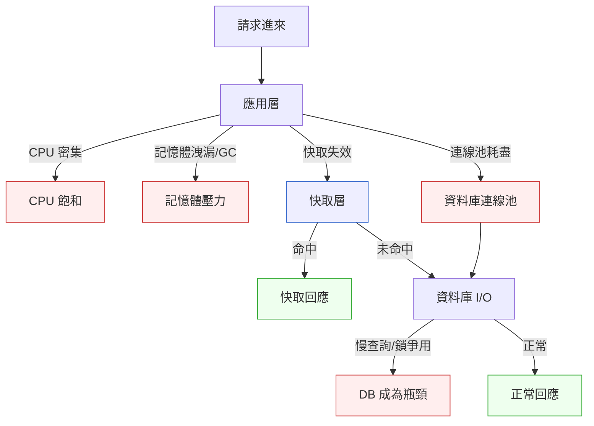

# 第 35 章｜容量規劃與壓力測試
## ⸺ 在流量壓垮你之前,先把它請進來問問清楚

> **前置閱讀**:[第 34 章｜並發、非同步與背壓](./ch-34-concurrency.md)
> **下游章節**:[第 36 章｜AI 輔助編碼的工作流重塑](../part-08-ai-era/ch-36-ai-assisted-coding.md)

---

## 35.1 共感現場:大促前三天的那場會議

如果你在電商或 SaaS 公司待過,可能對這個場景不陌生。

大促還有三天。PM 拿著去年的流量圖進來:「今年預估訂單量是去年的兩倍。沒問題吧?」工程師互看一眼:「應該沒問題,我們去年跑得挺順的。」

然後促銷開跑。前五分鐘一切正常,第六分鐘結帳 API 回應時間開始往上爬,第十二分鐘告警炸開,第十五分鐘資料庫連線池塞滿,訂單落庫幾乎停擺。

事後復盤,問題很清楚:去年是均勻分佈的日常流量,今年大促是集中衝擊的脈衝——兩倍訂單量,但瞬間峰值是十二倍。沒有人在那場會議前把這件事算清楚。

「我們去年跑得挺順的」用了一個錯誤的前提推論。去年順,代表去年流量沒超過去年容量;但它完全沒有告訴你今年的流量會不會超過今年的容量。順著這個道理,我們就能看清楚這一章真正要解決的問題。

---

## 35.2 真正的問題:容量是一條線,流量是一個分佈

我們把這件事慢慢拆開。

「能不能撐住」,本質上是在問兩件事的關係:**系統能提供多少(容量上限)**,和**流量最多會有多少(負載峰值)**。工程上常見的錯誤,是把「平均」和「峰值」混在一起用。

「去年平均 TPS(Transactions Per Second,每秒交易數)是 500,今年兩倍,所以準備 1000 TPS 就夠了」——這句話假設流量分佈的形狀不會改變。大促活動破壞了這個假設:整日訂單量只是兩倍,但促銷開跑那一刻的瞬間 TPS 可能飆到 8000。

也就是說,容量規劃分成三個層次:

1. **我的系統理論上能撐多少?**(容量上限)
2. **流量實際上長什麼形狀?**(負載模型)
3. **在最壞的那個形狀下,容量還夠嗎?**(瓶頸驗算)

缺少任何一個,你對自己系統的自信都建立在錯誤的前提上。

那要怎麼把這三個問題的答案找出來?這就是本章的核心——在流量真的衝進來之前,先把它「請進來」模擬一遍。這個模擬我們叫它壓力測試(Stress Test),而在做壓力測試之前,需要先把負載模型想清楚。

---

## 35.3 一起做判斷:從負載模型到瓶頸驗算

### 35.3.1 第一步:畫出你的負載模型

負載模型(Load Model)是對「流量長什麼樣」的一個具體描述。它不只是一個數字,而是一個分佈。建立負載模型,你需要回答以下幾個問題:

| 問題 | 描述 | 拿去問誰 |
|---|---|---|
| 日常平均吞吐量 | 每秒/每分鐘的典型交易數 | 生產監控(如 Prometheus、Datadog) |
| 峰值倍率 | 高峰時是平均的幾倍 | 過去的日誌分析 |
| 峰值持續時間 | 高峰能維持幾分鐘/小時 | 業務活動時間表 |
| 讀寫比例 | 讀操作與寫操作各佔幾成 | 資料庫 slow query log |
| 熱點分佈 | 流量是否集中在少數資源(某商品、某 API) | 應用層 trace |
| 突發模式 | 是否有事件驅動的瞬間衝擊(促銷、推播) | PM 的活動規劃 |

這張表不是一次填完的,而是你和 PM、SRE 一起坐下來,把業務時序與技術指標對齊的過程。

一個好的負載模型看起來大概像這樣:

```
日常 TPS:200
工作日早晨高峰:400(2x)
大促啟動瞬間:2,400(12x,持續 5 分鐘)
大促穩定期:800(4x,持續 2 小時)
讀寫比:8:2
熱點:前 50 個商品貢獻 70% 流量
突發模式:整點推播後 30 秒內衝擊
```

有了負載模型,你才知道壓測要模擬哪一個場景,目標是把哪一個形狀的流量請進來。

### 35.3.2 第二步:找到你的瓶頸

在壓測之前,先用紙筆做一次**瓶頸外推**,能幫你預測「問題最可能出在哪」,也能幫你決定壓測要觀察什麼指標。

一般來說,系統的瓶頸有四個常見位置:



對每一個可能的瓶頸,你可以用一個簡單的外推公式估算它的理論上限:

**應用層 CPU**:
> 理論並發上限 ≈ CPU 核心數 × 單核每秒可處理請求數

**資料庫連線池**:
> 最大 TPS ≈ 連線數 × (1 / 平均查詢時間)

**I/O 等待**:
> 吞吐上限 ≈ 磁碟/網路頻寬 / 平均請求資料量

這些公式算出來的數字,不是精確預測,而是「你的危險邊界大概在哪」的粗估。把每個瓶頸的理論上限算出來,取最小的那個——那就是你整條鏈路最薄弱的一環,壓測要先從它開始施壓。

### 35.3.3 第三步:設計有意義的壓力測試

壓力測試最常見的誤解是「把流量開到最大,看什麼時候掛」。這樣的測試能找到崩潰點,但無法告訴你在崩潰之前,系統的降級行為是什麼,也無法幫你做容量決策。

一個完整的壓測計畫,通常包含三種測試類型:

| 類型 | 目標 | 描述 |
|---|---|---|
| **基準測試**(Baseline) | 量化正常狀態 | 在日常流量下,延遲/吞吐/錯誤率的基線值 |
| **負載測試**(Load Test) | 驗證目標容量 | 把流量升到負載模型的峰值,看能否維持 SLO |
| **壓力測試**(Stress Test) | 找到崩潰點與降級行為 | 持續加壓超過峰值,觀察哪個瓶頸先觸發、如何降級 |
| **尖峰測試**(Spike Test) | 模擬突發衝擊 | 瞬間注入幾倍流量,模擬大促啟動、整點推播 |
| **浸泡測試**(Soak Test) | 找出長時間運行的問題 | 維持中等負載 24–48 小時,觀察記憶體洩漏、連線池耗用 |

這幾種類型不一定都要跑,但大促前最關鍵的是**尖峰測試**:它最接近真實場景,也最容易暴露那個「瞬間 12 倍」的問題。

壓測工具方面,常見的選擇是 k6(Grafana 出品,腳本用 JavaScript 寫)或 Apache JMeter(老牌,配置靈活)。用 k6 寫一個尖峰測試的輪廓大概長這樣:

```javascript
// k6 v0.52+ 尖峰測試輪廓範例
import http from 'k6/http';
import { check, sleep } from 'k6';

export const options = {
  stages: [
    { duration: '1m', target: 200 },   // 暖機:升至日常流量
    { duration: '30s', target: 2400 }, // 尖峰:模擬大促啟動(12x)
    { duration: '5m', target: 800 },   // 穩定期:大促高峰
    { duration: '2m', target: 200 },   // 收斂:流量退潮
    { duration: '1m', target: 0 },     // 停止
  ],
  thresholds: {
    http_req_duration: ['p(95)<500'],  // 95 百分位延遲 < 500ms
    http_req_failed: ['rate<0.01'],    // 錯誤率 < 1%
  },
};

export default function () {
  const res = http.get('https://api.example.com/products/hot');
  check(res, { 'status was 200': (r) => r.status === 200 });
  sleep(0.1);
}
```

這個輪廓的關鍵不在參數的精確,而在「形狀對不對」——它模擬的是你在負載模型裡看到的那個脈衝形狀,而不是一條平坦的直線。

### 35.3.4 第四步:看懂結果,做出容量決策

壓測跑完,你會拿到一堆數字。真正重要的,是這幾個:

| 指標 | 看什麼 | 判斷方式 |
|---|---|---|
| **延遲百分位** | p95、p99 的絕對值 | 是否在 SLO 範圍內(如 p95 < 500ms) |
| **吞吐量飽和點** | TPS 開始下降的那個拐點 | 拐點 = 你的實際容量上限 |
| **錯誤率陡升點** | 錯誤率開始爬坡的時機 | 超過這個點就要加緩衝 |
| **資源使用率** | CPU/記憶體/連線池使用率 | 哪個先到 80%,就是你的真實瓶頸 |
| **恢復時間** | 壓力撤除後多久回到基線 | 衡量系統的彈性 |

看到 p99 延遲是 2 秒,你需要問的不是「這樣對不對」,而是「**我的 SLO 是什麼,這樣有沒有超過?**」——容量決策永遠是相對於你的服務水準目標(SLO),不是相對於一個抽象的「夠快」。

---

## 35.4 容易絆倒的地方

### 絆倒處一:用平均值做容量規劃

「平均回應時間 80ms,看起來很健康。」但如果 p99 是 4 秒,代表每一百個用戶裡有一個人的體驗極差——在高流量時,這個人的請求堵住連線池,可能讓後面的人都等。

> **修正方向**:用百分位數(p95、p99)而非平均值做判斷。平均值被少數正常請求拉低,遮住了尾部延遲的真實面貌;p99 才是用戶在最糟狀況下的實際感受。

---

### 絆倒處二:壓測環境和生產環境差太遠

「測試環境跑得很好,上線就出事了。」常見差距包括:資料量只有生產的 1%、連線池設定不同、快取策略不一樣、少了 CDN 層。

> **修正方向**:壓測環境的資料量要在量級上接近生產(形狀要對,不需完全相同);最好接到 staging 跑而非輕量 dev 環境。資源不允許時,至少把「這個結果在生產上的偏差」明確寫進壓測報告。

---

### 絆倒處三:只跑一次壓測,當作永久結論

「去年三月跑過了,應該沒問題。」但從那時到現在,資料量可能翻了三倍、加了新的外部 API 呼叫、連線池設定被某個 PR 悄悄改掉了。

> **修正方向**:把壓測納入 CI/CD 的 pre-production 流程,或至少設定每季一次的例行計畫。不需要每次都是完整大壓測——一個輕量的「冒煙壓測(smoke load test)」確認基線沒有大幅退步,就能避免「不知不覺退化」。

---

### 絆倒處四:壓測通過了,忘記準備降級策略

「壓測在峰值 2400 TPS 下通過了」——但如果真實流量超過 2400 呢?系統到時候會怎麼反應?如果沒有設計熔斷器(Circuit Breaker)或排隊緩衝,超過容量的那部分請求可能直接讓整個服務崩潰,而不是優雅地回一個「目前很忙,請稍後再試」。

> **修正方向**:容量規劃的終點不是「壓測通過」,而是「壓測通過 + 超過容量時的降級行為也被驗證過」。在壓測裡刻意跑超過峰值的場景,確認系統在超容量時是優雅降級,而不是雪崩崩潰。

---

## 35.5 帶得走的工具 ⸺ 一頁式「容量規劃與壓測計畫」

下面是一份空白的容量規劃與壓測計畫模板。它的目的不是讓你填一份文件交差,而是讓你在壓測之前,把那幾個「不問會吃虧」的問題先想清楚。欄位設計成可以貼進 Confluence、Notion 或 PR 描述裡的形式。

```text
容量規劃與壓測計畫 ⸺ {服務名稱 / 活動名稱}

## 一、負載模型
日常平均 TPS:         {數字}
工作日高峰:           {數字}(平均的 {X} 倍)
活動/事件峰值(瞬間):  {數字}(平均的 {X} 倍,持續 {Y} 分鐘)
活動穩定高峰:          {數字}(平均的 {X} 倍,持續 {Y} 小時)
讀寫比:               {讀:寫}
熱點分佈:             {例:前 N 個資源貢獻 X% 流量}
突發觸發機制:          {例:整點推播、開搶按鈕、排程任務}

## 二、瓶頸預測
預計最薄弱的環節:      {例:資料庫連線池 / 結帳 API CPU}
理論上限估算:          {連線池 N 條 × 平均 Xms = 最大 Y TPS}
上次壓測日期:          {yyyy-mm-dd}
上次壓測容量上限:       {TPS}

## 三、壓測計畫
壓測環境:              {staging / 生產灰度}
資料量說明:            {測試資料與生產的比例或差異}
工具:                  {k6 / JMeter / Locust,版本號}
測試類型:              □ 基準  □ 負載  □ 壓力  □ 尖峰  □ 浸泡
目標場景:              {描述要模擬哪一個流量形狀}
SLO 通過門檻:
  - p95 延遲(第 95 百分位數):  < {X} ms
  - p99 延遲(第 99 百分位數):  < {X} ms
  - 錯誤率:                    < {X}%
  - 吞吐量:                    ≥ {Y} TPS

## 四、超容量降級行為(必填)
超過峰值容量時的預期行為: {例:熔斷後回傳 503、進排隊佇列}
降級已驗證:              □ 是  □ 否(壓測計畫包含超容量場景)

## 五、壓測結果摘要(壓測後填)
實際容量上限:           {TPS}
真實瓶頸:               {觀察到哪個資源先飽和}
p95 / p99 延遲(峰值時): {X ms} / {Y ms}
SLO 是否通過:           □ 是  □ 否
後續行動:               {擴容計畫 / 調整連線池 / 加快取 ...}
```

為什麼這份計畫有「超容量降級行為」欄位?因為容量規劃最容易犯的錯,是只問「峰值下能不能撐住」,而忘了問「撐不住的時候,會怎麼倒下」。優雅降級和雪崩崩潰,對用戶的感受天差地別;把這個問題逼出來,才算規劃完整。

---

### 35.5.1 範例:FlashMart 大促壓測計畫

FlashMart 是一家虛構的中型電商平台,主要商品是快閃特賣。上一節提到的那場「大促前三天的會議」就發生在這裡——去年大促第十五分鐘資料庫連線池塞滿,訂單落庫幾乎停擺。今年他們決定在促銷活動前三週,認真把這份計畫填一遍。

```text
容量規劃與壓測計畫 ⸺ FlashMart 2026 雙十二大促 / 結帳服務

## 一、負載模型
日常平均 TPS:         180
<!-- 為什麼這欄:這是你的「正常」基準線;
     往後所有的倍率都從這個數字出發。
     沒有這個數字,你說「兩倍流量」其實沒有錨點。 -->
工作日高峰:           360(平均的 2 倍)
活動/事件峰值(瞬間):  2,160(平均的 12 倍,持續 3 分鐘)
活動穩定高峰:          720(平均的 4 倍,持續 2 小時)
讀寫比:               7:3(結帳流程寫操作比例較高)
熱點分佈:             前 30 個特賣商品貢獻 65% 流量
突發觸發機制:          整點開搶按鈕 + 站內推播同時發送

## 二、瓶頸預測
預計最薄弱的環節:      資料庫連線池(PostgreSQL 17,預設 100 條)
<!-- 為什麼這欄:去年事故的根因就是連線池耗盡;
     把它寫在這裡,是提醒整個團隊:我們知道歷史,
     這次要看它有沒有真的被修好。 -->
理論上限估算:          100 條連線 × (1 / 0.008s 平均查詢時間) ≈ 12,500 TPS 理論值
                        但應用層 thread pool 限制在 500 並發,實際瓶頸在應用層
上次壓測日期:          2025-09-15
上次壓測容量上限:       1,200 TPS(去年設施)

## 三、壓測計畫
壓測環境:              staging(資料量為生產的 30%,約 600 萬筆商品記錄)
資料量說明:            快取熱點商品列表已預熱;訂單表為空白但有相同索引結構
工具:                  k6 v0.52(Grafana 出品)
測試類型:              ☑ 基準  ☑ 負載  ☑ 壓力  ☑ 尖峰  ☑ 浸泡
目標場景:              重點跑尖峰測試,模擬整點開搶:
                        暖機 1min → 尖峰 2,160 TPS 持續 3min → 穩定 720 TPS 持續 2hr
SLO 通過門檻:
  - p95 延遲:           < 400 ms
  - p99 延遲:           < 1,200 ms
  <!-- 為什麼這欄:去年 p99 在峰值時飆到 8 秒;
       這次把 1,200ms 設為明確通過標準,才有東西可以比。
       沒有明確門檻,壓測結果永遠是「好像還好」。 -->
  - 錯誤率:             < 0.5%
  - 吞吐量:             ≥ 2,160 TPS(尖峰期維持)

## 四、超容量降級行為(必填)
超過峰值容量時的預期行為: 結帳請求進排隊佇列(Redis Stream),
                           隊列滿(1 萬筆)後回傳 HTTP 503 + Retry-After 標頭
降級已驗證:              ☑ 是(壓測計畫包含注入 3,000 TPS 超容量場景,驗證 503 行為)
<!-- 為什麼這欄:去年超容量時整個結帳服務崩潰而非優雅降級;
     這次刻意把「超容量怎麼倒下」納入測試範圍,
     確認用戶看到的是「請稍後再試」而不是超時白屏。 -->

## 五、壓測結果摘要(壓測後填)
實際容量上限:           2,350 TPS(比去年 1,200 提升 96%)
真實瓶頸:               應用層 Goroutine pool(Go 1.22,預設 500);
                          連線池本次未成為瓶頸(連線數最高使用 73%)
p95 / p99 延遲(峰值時): 310ms / 890ms ✅ 通過 SLO
SLO 是否通過:           ☑ 是
後續行動:               調整 Goroutine pool 上限至 800,再跑一次確認能否達到 2,800 TPS
```

這份計畫最有價值的一行,是去年事故的根因被寫在「瓶頸預測」欄位裡——不是為了要怪誰,而是讓整個團隊在壓測開始之前,就知道「今年要證明的事情是什麼」。壓測的目的從來都不是製造一份通過的報告,而是找出那個「如果我們今天不知道,三天後大促當場才發現」的問題。先把它請進來,它就嚇不到你了。

---

## 35.6 本章回顧

讀完這一章,你應該已經能:

- [ ] 說清楚「去年跑得順」為什麼不能代表「今年也沒問題」——容量是上限,流量是分佈,兩者都要看
- [ ] 建立負載模型:把日常 TPS、峰值倍率、突發模式用具體數字描述出來
- [ ] 用外推公式估算各個瓶頸的理論上限,找到最薄弱的一環
- [ ] 區分基準、負載、壓力、尖峰、浸泡測試的用途,知道大促前優先跑哪一種
- [ ] 把「超容量時的降級行為」納入壓測驗證,而不只是看峰值下能否通過 SLO

如果想先從一件事開始,我會建議 ⸺**把你的流量峰值倍率算出來**,因為很多災難都藏在「平均值的幾倍」這個數字裡;只要把這個數字寫清楚,後續的壓測計畫就有了錨點,一切都會更有方向。

---

## Cross-References

- **上一章**:[第 34 章｜並發、非同步與背壓](./ch-34-concurrency.md) ⸺ 背壓機制是容量超出時的緩衝手段,兩章互為表裡
- **下一章**:[第 36 章｜AI 輔助編碼的工作流重塑](../part-08-ai-era/ch-36-ai-assisted-coding.md) ⸺ 進入 AI 時代研發的核心章群
- **強連結**:[第 31 章｜效能量測先於優化](./ch-31-measure-first.md) ⸺ 本章的壓測數據來源,需先讀懂量測
- **強連結**:[第 32 章｜瓶頸定位](./ch-32-bottleneck.md) ⸺ 瓶頸外推的詳細方法論
- **強連結**:[第 29 章｜SLO/錯誤預算的實作面](../part-06-operations/ch-29-slo.md) ⸺ 容量規劃的 SLO 門檻從這裡來
- **跨書連結**:[SA/SD Playbook Ch 27｜可靠性設計](https://github.com/EddyKuo/sa-sd-playbook) ⸺ 從架構設計高度看容量規劃

---
