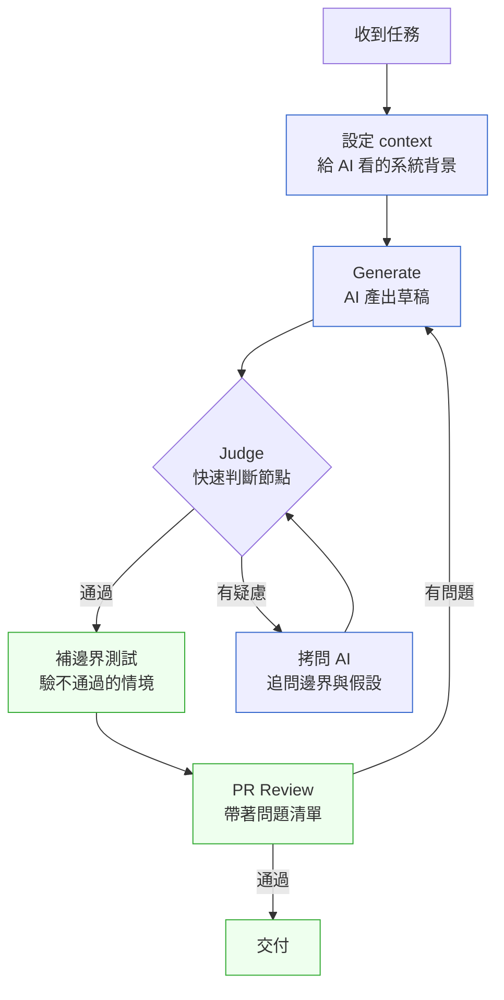

# 第 36 章｜AI 輔助編碼的工作流重塑
## ⸺ 當產出變得廉價,如何讓判斷跟上來

> **前置閱讀**:[第 1 章｜為什麼工程實作需要決策框架](../part-01-foundations/ch-01-why-engineering-decisions.md)、[第 16 章｜Code Review:看什麼、怎麼給回饋](../part-04-collaboration/ch-16-code-review.md)
> **下游章節**:[第 37 章｜審查 AI 生成的程式碼](./ch-37-reviewing-ai-code.md)、[第 40 章｜Prompt 與 context 作為工程產物](./ch-40-prompt-as-artifact.md)

## 36.1 共感現場:螢幕上的程式碼比你快

有一種感覺,在過去這幾年很多工程師都遇過。

你打開 IDE,旁邊開著一個 AI 助手的視窗。需求不算複雜,你才打了幾行描述,螢幕上就出現了完整的函式、正確的型別簽章、甚至連測試骨架都附上了。你讀了一遍,感覺沒什麼問題。你按下採用,接著繼續往下做下一件事。

效率很好。這一天做了平常三天的事。你甚至有點得意。

可是幾天後,有一個同事來問你:「這段 API 在 tenant 建立時會不會觸發兩次 webhook?」你停下來想,突然發現自己說不上來。你去看程式碼,讀了一遍,有點陌生——像是某個你認識但很久沒聯絡的人寫的。你知道它在做什麼,但你不確定它在某些邊界條件下會怎樣。

這不是你的記憶力問題。更不是你的能力問題。

這是一種新的工作狀態帶來的副作用:程式碼的產出速度,已經遠遠超過你消化它、理解它、對它負責的速度。AI 幫你寫,但它不替你擔。寫和擔之間的那段距離,被我們不知不覺地跳過了。

正因為上面這個體驗——那種「我知道它能跑,但我不確定它在邊界條件下怎樣」的陌生感——我們得先把傳統的開發流程攤開來看,才能看清楚為什麼 AI 輔助之後這種感覺變得這麼普遍。

## 36.2 真正的問題:工作流被「拉快」了,但 judge 的步驟被遺落了

我們先把一個傳統的開發流程攤開來看。

以前的工程師寫一個功能,通常是這樣走的:想一想要怎麼設計、查一查有沒有現成的工具、動手寫、寫到一半發現有個邊界沒想清楚、回頭重想、再繼續寫、寫完測試、交出去。這個過程慢,但慢有慢的好處——在那些「停下來查」「停下來重想」的空檔裡,你其實一直在對程式碼做判斷。那些判斷不是額外加上去的步驟,它就藏在「寫」的過程裡,幾乎自動發生。

現在不一樣了。AI 幫你把那個「停下來想」的空檔填滿了——用程式碼填滿。這當然讓你快了很多,但它同時也把那些夾在「寫」裡面的判斷機會,一起帶走了。

也就是說,問題不在於 AI 寫得不好。問題在於,AI 只負責 **Generate(產出)**;而 **Judge(判斷)**——這段程式碼對不對、在我們的系統裡合不合適、在最壞的情況下會怎樣——這件事沒有人接住,就悄悄掉下去了。

這就是 Generate vs Judge 的核心張力:兩件事過去是捆在一起的,慢慢做的過程就把 judge 做了。但現在它們分開了,generate 極快,judge 卻要另外刻意去做,不做就自動跳過。

那麼問題來了——如果 judge 這一步不是自動發生的,我們要怎麼讓它穩定地發生?這就是我們在這一章要一起想的事。

## 36.3 一起做判斷:把工作流設計成「generate 之後一定要 judge」

要讓 judge 穩定發生,最好的辦法不是靠自律,而是靠**工作流設計**——把判斷的時機,安排在流程裡一個自然的位置,讓它變成一個你「做完 generate 之後自然會走到」的步驟。

有一個很具體的起點:**把 AI 當成一位不認識你系統的新同事**。

這個比喻不是在說 AI 不厲害,而是在說一件事實:你系統裡最重要的那些脈絡——誰是最大的租戶、哪個 API 是核心熱點、這個欄位的 null 代表什麼業務語意——這些東西只存在你和你的團隊的腦袋裡。AI 不知道。一位剛入職的新同事也不知道。所以你不會讓新同事的程式碼跳過 review 直接上線;AI 的程式碼,也一樣。

當你有這個心態之後,下一步是:把 judge 的動作設計成一個**明確的工作流節點**,而不是一個「心情好的時候做」的額外步驟。

我用一個虛構的案例來讓這件事更具體。

---

**案例:Nova Spend,SaaS 費用管理平台的 AI 輔助開發重整**

Nova Spend 是一家做企業費用管理的 SaaS 公司,他們的系統多租戶,核心是費用審核流程和報表匯出。2025 年底,他們的工程團隊引入了 AI 輔助編碼(GitHub Copilot + 內部自建的 Claude 3.7 Sonnet 代理),從此開發速度大幅提升——每個 sprint 的 story points 完成率從 68% 拉到了 91%。

但問題在三個月後出現了。他們的一個企業大客戶(約有 14 萬筆費用紀錄)做年度報表匯出,觸發了一個 N+1 查詢的問題,整個 DB 連線池被拖光,造成 4 分鐘的全平台服務中斷。事後他們把事故裡的程式碼翻出來看,發現它是三個月前 AI 生成的。PR 有 review、有 merge,但 review 的時候沒有人問「這段在大資料量下怎麼跑」。

Nova Spend 的 CTO 在事後 post-mortem 裡說了一句話:「我們把 generate 加速了三倍,但我們沒有把 judge 的能力也擴容。瓶頸從寫程式移到了審程式,但我們完全沒感覺到。」

他們的修復不是回頭限制 AI 的使用,而是重新設計了一套**AI-first 工作流**,在裡面明確埋入了 judge 的節點。

---

讓我們看一下這套工作流長什麼樣子:



這張圖裡有幾個節點值得特別說明。

### 36.3.1 節點一:設定 context 給 AI 看

很多人使用 AI 的方式是「給需求、要程式碼」,直接跳過了系統背景這一步。但這一步恰恰是讓 AI 的輸出品質從 60 分到 90 分的關鍵。

Context 不需要很長,但它要精準。一個好的 context 至少要包含三件事:

| context 元素 | 說明 | 為什麼重要 |
|---|---|---|
| 這段程式碼的**呼叫者是誰** | 哪個 API、哪個 service 呼叫它 | AI 才知道該遵守哪些介面契約 |
| 目前系統的**資料規模** | 這張表大約幾行,最大的租戶是多大 | 讓 AI 知道該不該考慮分頁/索引 |
| **已有的慣例** | 這個 codebase 是怎麼做錯誤處理的 | 讓 AI 不要自己發明一套新的 |

這三件事說清楚,AI 的輸出就會帶著你的系統脈絡,不是通用程式碼,而是適合你的系統的程式碼。

### 36.3.2 節點二:judge 判斷節點(最重要的一步)

Generate 完成之後,在你按下「採用」之前,有一個必須停下來的時刻。這個時刻很短——不是要你做一次完整的 code review,而是用大約五分鐘,把這幾個問題在腦袋裡過一遍:

**AI 輔助編碼快速判斷清單**

| 問題 | 目的 | 通過條件 |
|---|---|---|
| 這段程式碼知道「我們的系統是什麼樣子」嗎? | 驗 context 有沒有生效 | AI 沒有假設一些在我們系統裡不成立的事 |
| 它在最大負載下會怎樣? | 規模邊界 | 有考慮到資料量、並發或大租戶 |
| 出錯的時候,它怎麼處理? | 失敗路徑 | 有 error handling,不是靜默吞掉 |
| 這段程式碼和旁邊的程式碼「長得像」嗎? | 風格一致性 | 命名、結構、慣例和 codebase 一致 |
| 有沒有什麼我不確定的假設? | 發現盲點 | 能說出這段程式碼做了哪些假設 |

如果其中一個問題你答不上來,那就是一個值得花時間的信號——不是說它一定有問題,而是說**你還沒充分理解這段程式碼**,交出去之前得先補上這段理解。

這個 judge 節點最容易被省略的場景,往往不是「趕時間」,而是「看起來沒問題」。AI 的輸出通常在語法層面上非常整齊,有型別標注、有函式命名、有基本的錯誤處理骨架,一眼掃過去很難找到明顯的破綻。正是因為它「看起來像熟練工程師寫的」,才讓你的大腦不自覺地把它歸入「這應該沒問題」的類別。

Nova Spend 的 PR review 就是這樣。那份程式碼通過了兩個 reviewer,因為它確實沒有語法錯誤,API 設計也是標準的 RESTful 風格。問題出在沒人問「這段如果拿去跑 14 萬筆會怎樣」——而這個問題,就是 judge 節點本來應該問的。

所以 judge 節點的心態不是「找問題」,而是「確認我理解了這段程式碼在我的系統裡的行為」。這兩件事看起來差不多,但方向完全不同:「找問題」是被動的,找不到就過了;「確認理解」是主動的,說不清楚就沒有過。

### 36.3.3 節點三:拷問 AI 追問

Judge 節點裡如果有疑慮,最快的方式不是自己從頭研究,而是直接問 AI。但這裡的「問」有一個很重要的技巧:不是問「這段程式碼有沒有問題」,而是問**具體的假設**。

幾個有效的拷問方式:
- 「如果這張表有一百萬筆資料,這段查詢會怎樣?」
- 「這個函式在 `tenant_id` 是 null 的時候會做什麼?」
- 「如果外部 API 回傳 HTTP 429,這段程式碼會怎麼處理?」

這樣問,AI 會把邊界條件和假設清楚地解釋出來,你才能判斷它的假設是不是符合你的系統。

### 36.3.4 context 經營:讓 AI 記得你的系統

如果你和 AI 的互動是長時間、持續的(例如一個 sprint 的功能開發),有一件事非常值得投資:建立一份可以快速餵給 AI 的**系統 context 文件**。

這不需要是完整的系統文件,它只要包含 AI 最容易猜錯的那幾件事:

```text
# 系統 Context 摘要(AI 快速上手用)

## 資料規模
- users 表:約 20 萬筆
- expense_records 表:約 1,200 萬筆,最大租戶約 14 萬筆
- 讀寫比約 3:7,報表查詢為主要讀取壓力

## 重要慣例
- 錯誤處理:統一 throw AppError(code, message),不靜默吞掉
- 多租戶隔離:所有查詢必須帶 tenant_id 條件,有 Row Level Security
- 外部 API 呼叫:必須包 retry(3 次,exponential backoff)

## 禁忌
- 不直接返回 DB entity,必須過 mapper 轉成 DTO
- 不在 service 層做 HTTP response,只拋 error
```

這份文件像是你給新同事的「入職說明」,也是你給 AI 的「系統脈絡地圖」。每次開新的對話,把這份文件丟進去,你的 AI 對話就從一個不認識你系統的陌生人,變成一個對你的系統有基本了解的協作者。

## 36.4 容易絆倒的地方

下面這幾個地方,在 AI 輔助編碼剛落地的時候,幾乎每個團隊都會遇到。

**絆倒處一:用了 AI,就以為省掉了 review。**

這是最常見的一個。因為 AI 的輸出看起來完整、語法正確、甚至有型別,很容易讓人覺得「這應該沒問題了」。這種感覺不是你的錯——AI 的輸出在格式上確實比一般初稿工整很多,在大腦的第一印象裡很容易拿到高分。

問題在於「看起來整齊」和「在你的系統裡正確」是兩回事。有一種很常見的場景是這樣的:你叫 AI 寫了一個分頁查詢,它用了 `OFFSET/LIMIT`,語法完全正確。但你的系統是 PostgreSQL 17,那張表有 800 萬筆,`OFFSET 500000` 會讓 DB 掃 50 萬筆再丟掉——這個問題不會在語法層面出現,只會在壓力測試或生產環境的大租戶才浮出來。看起來整齊的程式碼,帶著一個你系統裡很嚴重的假設。

> 修正方向:AI 的輸出是一份初稿,和一個有才華但不認識你系統的新同事的初稿一樣。它應該進 review,只是 review 的重點不是「語法對不對」,而是「假設對不對」。下一章(第 37 章)會專門談這件事。

**絆倒處二:context 給得不夠,把 AI 的輸出當成「適合我們系統」的程式碼。**

很多人問 AI「幫我寫一個費用匯出的 API」,沒有說資料量、沒有說多租戶、沒有說已有的慣例。AI 給了一個通用、語法正確的答案。這個答案拿到其他地方可能沒問題,但在你的系統裡,它可能帶著一堆不合適的假設。

有個具體的例子可以說明這件事的代價。假設你的系統裡所有外部 API 呼叫都要包 `retryWithBackoff`,這是一個三年前的架構決策,原因是某個支付閘道不穩定的歷史。你不說,AI 就不知道;它給你的程式碼會直接呼叫外部 API、沒有 retry——語法正確,行為卻和你的系統慣例不一致。這類不一致不會在第一次執行時爆炸,但在外部 API 偶發性 429 的時候,你的程式碼會和其他部分行為不同,造成一個讓你很難追根溯源的 flaky error。

> 修正方向:在開始 generate 之前,先花三分鐘想「這段程式碼最需要 AI 知道的三件事是什麼」,然後把它們寫進 prompt。這三分鐘,換來的是後面省下的大量修正時間。

**絆倒處三:generate 速度快,結果累積了大量「理解不完整」的程式碼。**

這是一個慢慢發生的問題,也是最難察覺的一個。你一次一次地採用 AI 的輸出,每次都讀過了、覺得沒問題,但「沒問題」和「真的理解它在所有情境下怎麼跑」是兩件不同的事。幾個月後,你回頭看自己的 codebase,會發現有一層模糊感:你知道它能跑,但不確定它在邊界條件下怎樣。

這種情況有一個很典型的觸發點:有人來問你一個邊界問題,你需要在腦袋裡回放「這段程式碼在 X 情況下會怎樣」,但你發現自己沒辦法清楚地回答。你去看程式碼,讀了兩遍,有種「我應該理解它」的感覺,但又沒辦法把它說清楚。這種感覺,就是理解不完整的訊號。

> 修正方向:Judge 節點裡加一個小小的動作:在採用 AI 程式碼之前,用自己的話說一遍「這段程式碼做了哪三個假設」。說不出來,就是還沒真的理解它。說得出來,代表你對它有了足夠的掌握度。這個動作不需要很久,但它能在每一次採用的當下,建立起你對程式碼的主動理解,而不是被動地覺得「它應該沒問題」。

**絆倒處四:把「AI 說沒問題」當成「確認沒問題」。**

當你對一段程式碼有疑慮,問 AI「這段有沒有問題」,AI 很可能說「看起來沒問題」。因為它沒有你系統的資料量、沒有你租戶的分布、沒有你歷史事故的記憶。AI 說的「沒問題」是「在一般情況下語法合理」,不是「在你的系統裡在最壞的情況下不會出事」。

這個絆倒處的微妙之處在於,它看起來像是你「盡職了」——你有疑慮,你問了 AI,AI 說沒問題,於是你放心了。但這個過程裡缺了一件最重要的事:你沒有把自己的系統知識帶進這個問題。AI 在回答你的問題時,它的「系統知識」是它從訓練資料裡建立的通用知識,不是你這個系統的具體行為。讓 AI 用通用知識去驗證一個需要系統專屬知識才能判斷的問題,結果當然不夠可靠。

> 修正方向:與其問「有沒有問題」,換成問「如果 X 發生,這段會怎樣」。把你自己的系統知識帶進問題裡——「如果最大租戶的 14 萬筆紀錄同時觸發這個查詢」「如果 `tenant_id` 在這個情境下是 null」——AI 的回答才會是有意義的驗證,而不是對通用情況的背書。

## 36.5 帶得走的工具 ⸺ 一頁式「AI 輔助編碼 context 設定卡」

有一個小工具可以讓上面說的這些事情,從道理變成每天都能用的習慣。它不複雜,一頁就夠。把它貼在你的 PR 描述模板裡,或者存成一個可以快速貼給 AI 的片段,都可以。

這張卡片的設計邏輯是:它把「context 設定」和「judge 檢查」放在同一張紙上,讓你在每一次 generate 的前後,都自然地停下來想那幾個問題。之所以把兩件事合在一頁,是因為 context 的品質和 judge 的品質是相互依賴的——你在 generate 前填了什麼背景,決定了你在 judge 時能問出什麼問題。一頁拿著走,前後對照,那個理解的閉環就形成了。不需要長篇幅,填起來大概三到五分鐘,就能讓你和 AI 的協作從「複製貼上的輪盤」變成「帶著理解的判斷」。

下面是空白模板:

```text
AI 輔助編碼 Context 設定卡 ⸺ {任務名稱}

── 系統脈絡(在開始 generate 前填好,貼給 AI) ──

資料規模:
  - 主要資料表:{表名} 約 {N} 筆,最大租戶約 {M} 筆

呼叫者是誰:
  - {這段程式碼被哪個 API / service / job 呼叫}

已有慣例:
  - 錯誤處理:{目前的做法}
  - 多租戶隔離:{目前的做法}
  - 外部呼叫:{retry 策略}

禁忌:
  - {這個 codebase 裡不能做的事}

── Generate 後:judge 快速清單 ──

□ AI 的輸出有沒有符合上面的慣例?
□ 這段程式碼在最大負載下會怎樣?(說出具體數字)
□ 出錯的時候,失敗路徑是什麼?
□ 這段程式碼做了哪三個假設?(用自己的話說出來)
□ 有沒有任何一個假設我說不清楚?

── 疑慮要問的問題(拷問 AI 用) ──

□ 「如果 {最壞情境} 發生,這段會怎樣?」
□ 「這個函式在 {邊界條件} 下的行為是什麼?」
```

### 36.5.1 範例:Nova Spend 費用匯出功能重做

三個月前,Nova Spend 的費用年度匯出 API 就是在這個節點出了事。那次的 PR 沒有填任何 context 設定,review 也沒有問「最大負載下怎樣」——程式碼通過了兩個 reviewer,三個月後在生產環境把 DB 連線池拖光,造成 4 分鐘全平台中斷。

重做的這一次,他們先把這張卡填好了再開始 generate。下面是填好的版本——以及每個欄位旁邊的說明,解釋「為什麼這一欄在這次事故裡很關鍵」:

```text
AI 輔助編碼 Context 設定卡 ⸺ 費用年度匯出 API

── 系統脈絡(在開始 generate 前填好,貼給 AI) ──

資料規模:
  - expense_records 表:約 1,200 萬筆
  <!-- 為什麼這欄:這個數字是讓 AI 知道「不能一次全撈」的關鍵線索。
       沒有這個數字,AI 大概率會給一個 SELECT * 沒有分頁的實作。 -->
  - 最大租戶約 14 萬筆費用紀錄(觸發上次事故的那個)

呼叫者是誰:
  - GET /api/v2/tenants/:tenantId/expenses/export
  - 由前端「匯出報表」按鈕觸發,使用者等待時間敏感
  <!-- 為什麼這欄:告訴 AI 這是同步 API 還是非同步任務很重要;
       知道使用者在等,AI 才會考慮要不要改成 background job + polling。 -->

已有慣例:
  - 錯誤處理:throw AppError(code, message),統一由 middleware 轉成 HTTP response
  - 多租戶隔離:所有查詢必須帶 tenant_id,DB 有 Row Level Security
  - 外部呼叫:必須包 retryWithBackoff(fn, { maxRetries: 3 })

禁忌:
  - 不在 service 層直接 return res.json(),只拋 error
  - 不直接 return DB entity,必須過 ExpenseMapper.toDTO()

── Generate 後:judge 快速清單 ──

□ AI 的輸出有沒有符合上面的慣例?
   → 確認:有用 AppError,有帶 tenant_id,有過 toDTO()  ✅
□ 這段程式碼在最大負載下會怎樣?
   → 14 萬筆用 cursor-based 分批查詢,每批 1,000 筆,Streaming response  ✅
   <!-- 為什麼這欄:上次事故就在這裡出事。填出具體的「14 萬筆、每批 1000 筆」
        代表你真的對這個數字有判斷,不是模糊地覺得「應該可以」。 -->
□ 出錯的時候,失敗路徑是什麼?
   → DB 查詢逾時 → AppError(EXPORT_TIMEOUT) → 前端顯示「請稍後重試」  ✅
□ 這段程式碼做了哪三個假設?
   1. 租戶的 expense_records 有 created_at 索引(確認過:有)
   2. Streaming response 的連線不會在 14 萬筆全傳完前超時(需加 keepalive)
   3. 前端能處理 chunked response(已和前端確認)  ✅
□ 有沒有任何一個假設我說不清楚?
   → 假設二的 keepalive 機制需要明天和 infra 確認,先開 TODO  ⚠️

── 疑慮要問的問題(拷問 AI 用) ──

□ 「如果 14 萬筆的 Streaming response 在傳到一半時前端斷線,這段會怎樣?」
   → AI 回答:目前不會清理 DB cursor,加了 finally 清理後解決
□ 「這個 cursor-based 查詢在 created_at 有重複值時,會不會漏資料?」
   → AI 回答:會,改用 (created_at, id) 複合 cursor 解決
```

這份填好的卡片,和三個月前那次事故時的狀況比起來,差別不是「更努力」,而是「在對的時機問了對的問題」。上次沒人問「14 萬筆會怎樣」;這次因為 context 設定卡的第一欄就要填資料規模,這個問題在 generate 開始之前就已經進入了判斷的視野。

很多時候,安心交付和線上事故之間的距離,就是這幾個早問的問題。

## 36.6 本章回顧

讀完這一章,你應該已經能:

- [ ] 說清楚為什麼 AI 輔助編碼會讓 judge 的步驟自動消失,而不是自動變好
- [ ] 在開始 generate 之前,設定好讓 AI「不認識你系統」問題得到緩解的 context
- [ ] 走完 generate → judge → 拷問 AI → review 這個工作流,而不是 generate 完就直接交付
- [ ] 用「這段程式碼做了哪三個假設」這個問題,確認自己對程式碼有足夠的掌握度
- [ ] 把系統 context 文件當成一份「給 AI 的入職說明」,持續維護、反覆使用

如果想先從一件事開始,我會建議 ⸺**在下一次採用 AI 程式碼之前,先用自己的話說出「這段程式碼做了哪三個假設」**,因為說不出來就代表還沒準備好交付;說得出來,你已經把 generate 和 judge 這兩件事都做到了。

而當你和 AI 的互動變成日常,下一個問題自然會來:怎麼把 prompt 本身當成一份版本化的工程產物來管理?那個問題,我們在第 40 章再一起想。

下一章,我們會更深入地談 AI 生成程式碼的 review 技藝——不只是「能不能跑」,而是「它的假設符不符合我們系統的現實」。

## Cross-References

- **下一章**:[第 37 章｜審查 AI 生成的程式碼](./ch-37-reviewing-ai-code.md) ⸺ 把 judge 節點展開成完整的 review 技術
- **強連結**:[第 1 章｜為什麼工程實作需要決策框架](../part-01-foundations/ch-01-why-engineering-decisions.md) ⸺ Generate vs Judge 的根源討論
- **強連結**:[第 16 章｜Code Review:看什麼、怎麼給回饋](../part-04-collaboration/ch-16-code-review.md) ⸺ AI 程式碼的 review 和一般 review 的異同
- **強連結**:[第 40 章｜Prompt 與 context 作為工程產物](./ch-40-prompt-as-artifact.md) ⸺ context 設定卡的下一步:把 prompt 版本化
- **跨書連結**:[SA/SD Playbook Ch 37 AI-Assisted Architecture](https://github.com/EddyKuo/sa-sd-playbook) ⸺ 架構層的 AI 輔助決策,與本章的實作層互補

