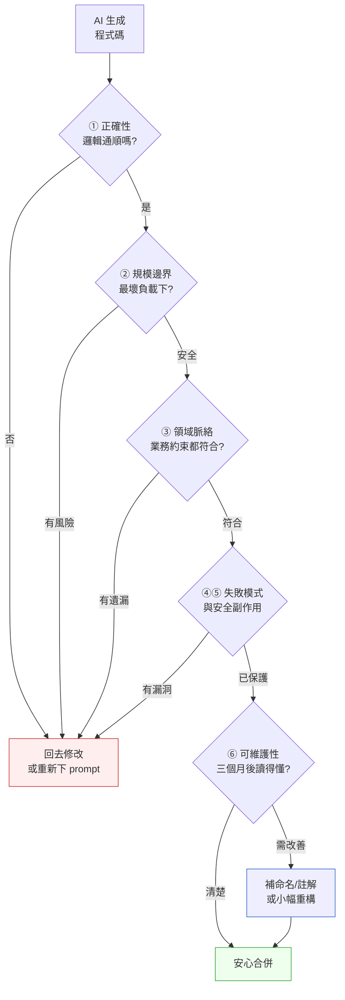

# 第 37 章｜審查 AI 生成的程式碼
## ⸺ Generate 很快,Judge 才是你留下來的理由

> **前置閱讀**:[第 1 章｜為什麼工程實作需要決策框架](../part-01-foundations/ch-01-why-engineering-decisions.md) ⸺ 交付前四問是本章的判斷基礎
> **前置閱讀**:[第 36 章｜AI 輔助編碼的工作流重塑](./ch-36-ai-assisted-coding.md) ⸺ 了解 AI 如何融入開發流程
> **下游章節**:[第 38 章｜為 AI 生成碼補測試與防護](./ch-38-testing-ai-code.md) ⸺ 審查之後的防護網

## 37.1 共感現場:「它測試都有過,應該沒問題吧」

你可能也遇過這樣的處境。

小林在一家做跨境匯款的 fintech 公司 Velopay 工作,負責一支新的手續費計算服務。那天她把需求貼給 AI 助手,幾分鐘後一整段程式碼就出現了:計算邏輯、幣別轉換、費率分級,全都有。她跑了一遍單元測試——通過。她對照需求文件看了一遍——邏輯對。她心裡覺得,這次比自己親手寫還要快,而且看起來更完整。

所以她把它推上了 PR,寫了「unit tests passing, logic verified」,等著合併。

同事阿偉在 review 時停了一下。他沒有說什麼大道理,只是問了一句:「匯款金額的上限邊界有測過嗎?如果客戶輸入的金額超過 float64 的精度呢?」

小林愣了一下。她去看了 AI 生成的程式碼:幣別換算用的是 `float64`,直接做乘法。金融計算裡,這是一個靜悄悄的定時炸彈——`0.1 + 0.2` 在 IEEE 754 浮點數的世界裡不等於 `0.3`。差的那幾個小數點,乘上一萬筆交易,就是真實的帳差。

AI 沒有犯邏輯錯誤。它寫的手續費計算在正常情境下完全正確。但它並不知道金融系統對精度的特殊要求,也不知道 Velopay 的最大單筆交易金額,更不知道在那個金額下 float64 的累積誤差會長什麼樣子。那些脈絡,只存在於熟悉這個系統的工程師腦子裡。

後來他們算了一下:Velopay 每月最大單筆交易約 50 萬美元,換算成日圓時小數點後的誤差最高可達 0.003 日圓,乘上月結日的 15 萬筆峰值,理論上的帳差可能達到每月 450 日圓。這個數字本身不大,但更大的問題是——一旦進入 SWIFT 清算並被對方銀行稽核,帳差的解釋成本才是真正的風險,幾小時的人工核對加上可能的報告義務,遠比程式碼修改本身麻煩。

阿偉看到這個問題,並沒有直接打回去說「你怎麼沒看到」。他知道,在一個 AI 產出完整程式碼的工作流裡,人很容易跳過「懷疑一下」的那一步——不是粗心,而是那份完整感確實會讓人覺得沒有漏洞。這是這個時代工程師都在學習適應的新習慣:**看起來完整≠真的完整**。

這不是 AI 的錯,也不是小林的錯。這是一個值得所有人一起想清楚的問題:當產出來得太快、太完整,我們怎麼確保自己在「按下合併」之前,真的走完了判斷的步驟?

## 37.2 真正的問題:AI 的盲區不在邏輯,在脈絡

我們把小林的例子慢慢拆開來,你會發現一個規律。

AI 生成的程式碼,在一件事上表現得很好:它能夠在給定的描述範圍內,生成語法正確、邏輯通順、甚至有測試覆蓋的程式碼。這是真實的能力,不是幻覺。

但它有三個結構性的盲區,而且這三個盲區不是隨著模型更強就會消失的——因為它們的根源不在「AI 知不知道 float64 有誤差」,而在於「AI 不知道你的系統在什麼脈絡下運行」。

---

**第一個盲區:規模與邊界。**

AI 看到的是你描述的情境,不是你線上最大的那個使用者。它生成的程式碼在小資料下完全沒問題,但它不知道你最大的商戶有多少筆交易、你的資料庫在那個量下有沒有對的索引。

一個典型的例子:AI 幫你寫了一個「查詢某用戶所有訂單」的功能——

```go
// AI 生成的版本(Go 1.23)
func GetUserOrders(db *sql.DB, userID int64) ([]Order, error) {
    rows, err := db.Query("SELECT * FROM orders WHERE user_id = ?", userID)
    // ... 掃描 rows ...
}
```

這段程式碼在開發環境完全正確。但當你的系統有 10 萬個活躍用戶,其中最大的商戶有 8 萬筆歷史訂單時,這個 `SELECT *` 就是全表掃描加上一次性拉取 8 萬筆記錄到記憶體——O(n) 的查詢,在峰值流量下很可能把資料庫連線池撐爆。AI 並不是不會寫分頁,它只是沒有被告知「我們這個用戶有 8 萬筆記錄」。

---

**第二個盲區:領域特殊性。**

每個行業有自己的隱性約束。金融要用定點數(Decimal)不能用浮點數。醫療要記錄每一次資料變更的人和時間。能源計費要考慮時間區間的計費歸屬。這些規則不在語法裡,不在通用的程式設計教科書裡,但它們存在於你的業務和你的系統裡。

看看小林那個案例的核心差異:

```go
// AI 生成的版本 ❌ — 使用 float64
func CalculateFee(amount float64, fxRate float64) float64 {
    converted := amount * fxRate        // IEEE 754 浮點乘法,有精度誤差
    fee := converted * 0.015            // 再乘一次,誤差累積
    return math.Round(fee*100) / 100   // 四捨五入掩蓋不了根本問題
}

// 符合 Velopay 規範的版本 ✅ — 使用 decimal.Decimal (shopspring/decimal v1.4)
import "github.com/shopspring/decimal"

func CalculateFee(amount decimal.Decimal, fxRate decimal.Decimal) decimal.Decimal {
    converted := amount.Mul(fxRate)     // 精確的定點數乘法
    feeRate := decimal.NewFromFloat(0.015)
    return converted.Mul(feeRate).Round(8) // SWIFT 規範:最多 8 位小數
}
```

這兩段程式碼的邏輯完全一樣,差別只在型別選擇——而那個型別選擇的依據,是 SWIFT 幣別精度規範和 Velopay 內部金融計算規範 v2.3,這些文件 AI 沒有讀過。

---

**第三個盲區:安全與副作用。**

AI 傾向於解決你明確提出的問題,而不是替你想它沒被要求想的東西。你說「幫我寫一個刪除帳號的功能」,它會寫——但它不會主動幫你想「這個刪除有沒有軟刪除的需求」「有沒有相關的審計日誌要記」「刪之前有沒有要確認未結清的交易」。那些你沒說的事情,它就不說。

舉個具體的例子:假設你讓 AI 寫「刪除轉帳記錄」:

```go
// AI 生成的版本 — 功能正確,但缺少金融合規要求的保護
func DeleteTransfer(db *sql.DB, transferID int64) error {
    _, err := db.Exec("DELETE FROM transfers WHERE id = ?", transferID)
    return err
}
```

這段程式碼會動。但在 Velopay 的合規框架下,它至少缺了三件事:刪除前確認該筆轉帳是否已完成結算、軟刪除而非硬刪除(監管要求保留記錄)、以及寫入稽核日誌記錄「誰在什麼時候刪除了這筆記錄」。這三件事在需求說明裡沒有,所以 AI 也不知道。

---

也就是說,AI 其實相當忠實於你提供的描述——問題是,那份描述幾乎從來不完整。不完整不是你的錯,而是因為很多事情我們以為是理所當然、根本想不到要說出來。

順著這個道理,「審查 AI 生成的程式碼」這件事,和「review 同事的 PR」本質上是一樣的——而且因為這個同事非常有才華、又完全不認識你的系統,所以你的審查要特別留心那三個盲區。

這就是為什麼本章的核心不是「如何發現 AI 的錯誤」,而是「如何把正確的問題帶進審查的過程」。

## 37.3 一起做判斷:把四問用在 AI 產出上

在第 1 章,我們談過「交付前的四問」:

1. **它會動嗎?**
2. **在最壞的資料/負載下呢?**
3. **出錯的時候會怎樣?**
4. **三個月後的人讀得懂、改得動嗎?**

這四個問題本來是針對所有程式碼設計的——AI 生成的、自己寫的、同事交的,都適用。但當你把它們用在 AI 產出上,第①問其實已經大幅被滿足了(AI 很少給完全跑不起來的程式碼),重心反而落在第②、③、④問。而且還需要加上一個 AI 特有的維度:**它寫的東西,符合你這個系統的脈絡嗎?**

讓我們把這個「AI 程式碼審查框架」整理成一張決策表,它可以貼在你的 PR 描述裡:

| 審查維度 | 核心問題 | 常見 AI 盲區 | 驗證方式 |
|---------|---------|------------|---------|
| **① 基本正確性** | 邏輯在正常路徑上是否正確? | 少見錯誤,但仍要讀 | 跑測試、對照需求 |
| **② 規模邊界** | 在最大資料量/最壞負載下呢? | AI 不知道你的生產規模 | 帶入真實峰值數字估算 |
| **③ 領域脈絡** | 有沒有隱性的業務約束被忽略? | AI 只知道你說出來的需求 | 對照業務規則、歷史 PR、ADR |
| **④ 失敗模式** | 出錯時怎樣?有沒有保護? | AI 傾向解決主路徑 | 問「如果 X 失敗了呢?」 |
| **⑤ 安全副作用** | 有沒有未被要求但必要的操作? | AI 不主動補沒被要求的東西 | 問「它沒做的事情,該做嗎?」 |
| **⑥ 可維護性** | 命名、結構、有沒有藏下技術債? | AI 有時過度聰明、難以改動 | 假設自己三個月後第一次讀到它 |

這六個維度可以用一個流程圖來看:



### 37.3.1 維度②:帶入真實數字的方法

維度②是最容易被跳過的,因為它需要你知道一件 AI 不知道的事——你的系統長什麼樣。有一個實用的做法是「三個數字原則」:

在審查任何涉及查詢、迴圈、或資料處理的 AI 程式碼前,先在心裡備齊三個數字:

- **今天的正常量**:例如每日交易筆數的中位數
- **今天的峰值**:例如月結日或大促時的最大並發
- **預期一年後的量**:做個 2–3x 的保守估算

把這三個數字代入 AI 寫的程式碼,問自己:「在峰值下,這段邏輯的最壞時間複雜度是多少?資料庫的查詢計畫走的是全表掃描還是索引?」

來看一個具體的例子。假設 Velopay 今天的每日交易量是 3 萬筆,峰值(月結日)是 15 萬筆,估計一年後會到 30 萬筆。AI 幫你寫了一段「按用戶查詢所有待結算交易」的邏輯:

```sql
-- AI 生成的查詢(PostgreSQL 17)
SELECT * FROM pending_transfers
WHERE user_id = $1
ORDER BY created_at DESC;
```

帶入三個數字思考:
- 今天正常量:某個大商戶有 5,000 筆待結算,查詢掃描 5,000 行,沒問題。
- 今天峰值:月結日同時有 2,000 個用戶發起查詢,資料庫需要同時處理 2,000 個這樣的查詢。
- 一年後估算:大商戶的待結算筆數可能長到 2 萬筆,如果 `user_id` 上沒有索引,每次查詢就是全表掃描。

帶完數字你就會發現兩件事:第一,`user_id` 上一定要有索引;第二,沒有分頁(LIMIT/OFFSET)的話,把 2 萬筆結果一次載入前端是危險的。這兩個問題在開發環境測試時完全不會出現,但帶入真實數字之後,5 分鐘就能看出來。

不需要實際跑 benchmark——只需要把數字帶進去,很多問題就會浮現。這是最不需要特殊工具、但效果最顯著的一個審查習慣。

### 37.3.2 維度③:業務脈絡的快速比對

順著維度②的思路往下走,我們自然會問:除了規模,還有什麼是 AI 不知道但我知道的?答案就是業務脈絡——那些存在於 ADR(Architecture Decision Record)、業務規則文件、以及老工程師腦子裡的「行規」。

AI 不知道你的 ADR、不知道你的業務規則文件、也不知道你那份存在於老工程師腦子裡的「行規」。但你可以用幾個快問把它們帶進審查:

- 「這個功能有沒有對應的業務規則文件?AI 的實作有沒有跟它對齊?」
- 「同類的功能在我們系統裡是怎麼處理的?AI 的做法和我們既有的慣例一致嗎?」
- 「如果是金融/醫療/合規敏感的情境,有沒有特殊的精度、日誌、或審計要求?」

這三個問題可以根據你的業務領域再延伸。以 Velopay 的情境為例:

**金融情境**:「這段計算有沒有用到浮點數?」「如果涉及幣別轉換,精度規範是哪一份文件?」「我們的現有計算模組用的是什麼型別?」

**醫療情境(HCR)**:「這個操作有沒有寫 audit trail?誰可以做、做了要不要記?」「有沒有用到 HL7/FHIR 標準中對這個欄位的格式要求?」

**認證授權情境**:「這個端點的 session 處理方式,和我們其他受保護端點一樣嗎?」「token 的驗證邏輯有沒有從我們既有的 middleware 走?」

**資料匯出情境**:「如果匯出結果很大,分頁或串流的處理方式和我們現有的批次作業一致嗎?」

回到小林的案例:如果她在 PR 打開之前,問自己「Velopay 的其他計算功能是怎麼處理幣別的?」,只要搜一下現有程式碼,就會看到其他地方都在用 `decimal.Decimal`,那個 float64 就會跳出來。這個比對動作不需要記住所有業務規則——只需要在按下合併之前,去看一眼「我們系統裡同類的事情是怎麼做的」。

往往,最有效的業務脈絡比對不是讀文件,而是搜現有程式碼。現有的程式碼是業務規則的最真實實現——它記錄了所有「我們決定這樣做」的結果,只是沒有說出背後的理由。

## 37.4 容易絆倒的地方

這裡的幾個常見地雷,不是要讓你對 AI 變得更不信任,而是幫你下次遇到的時候,心裡有個底。很多人都走過這些路,現在把它們說清楚,是希望你下次遇到時,不需要踩過才知道。

---

**絆倒處一:因為測試都過了,就覺得審查完了。**

AI 生成的程式碼往往附帶測試,而且測試通常能跑過——因為它寫的測試和它寫的邏輯是一體的:它知道邏輯長什麼樣,所以測試精準地覆蓋了它寫的那條路徑。但那條路徑就是它「想到的路徑」,而非你系統裡「真正可能發生的路徑」。

這就像你自己出題、自己考試——你很難考到你不知道的知識。AI 的自動生成測試有同樣的盲點:它能覆蓋它知道的情境,但覆蓋不了你業務裡的特殊邊界、歷史上踩過的坑、或領域規範要求的極端值。

回到 Velopay 的例子:AI 生成的 12 個單元測試全部覆蓋了「費率計算邏輯」,也就是 `float64` 乘法在正常金額範圍下是正確的。但沒有一個測試用了 50 萬美元乘上高精度匯率,然後比對 `decimal.Decimal` 和 `float64` 的差異。那個測試沒有,不是因為 AI 偷懶,而是因為 AI 不知道 Velopay 的最大交易金額。

> **修正方向**:把「測試通過」視為①正確性的確認。這只是六個維度的第一關,後面五個維度不在那份自動生成的測試裡。下一章我們會專門談「如何為 AI 生成碼補測試」,那才是真正的防護網。

---

**絆倒處二:把 AI 的過度設計當成品質的體現。**

有時候 AI 會給一個看起來很「架構感」的解法——抽象層、interface、factory pattern 全上,看起來很有設計品位。但如果你的需求其實只是一個小功能,那些抽象可能是純粹的噪音。

來看一個對比。你讓 AI 寫一個「根據訂單狀態回傳對應顯示文字」的功能:

```go
// AI 有時候給的版本 — 過度抽象 ❌
type StatusRenderer interface {
    Render(status OrderStatus) string
}

type DefaultStatusRenderer struct{}

func (r *DefaultStatusRenderer) Render(status OrderStatus) string {
    switch status {
    case OrderStatusPending:  return "待處理"
    case OrderStatusComplete: return "已完成"
    default:                  return "未知"
    }
}

func NewStatusRenderer() StatusRenderer {
    return &DefaultStatusRenderer{}
}
```

```go
// 你可能真正需要的版本 — 直接 ✅
func OrderStatusLabel(status OrderStatus) string {
    switch status {
    case OrderStatusPending:  return "待處理"
    case OrderStatusComplete: return "已完成"
    default:                  return "未知"
    }
}
```

第一個版本看起來「很有彈性」,但三個月後的工程師要讀懂它,需要先找到 `StatusRenderer` interface、找到 `DefaultStatusRenderer` 結構、找到 `NewStatusRenderer` factory——才知道它只是在做一個 switch。而第二個版本一眼就看完了。那個 interface 是不是「現在必要」的抽象?如果去掉它,功能還能正確運作,而且更好讀,那就去掉。

> **修正方向**:問自己「這個抽象現在是必要的,還是它只是 AI 的習慣動作?」簡單是一種主動選擇,不是妥協。抽象是有代價的——每一層抽象都需要日後的工程師去理解、追蹤、維護。只在有具體理由時加它。

---

**絆倒處三:「我只是稍微改了一下,應該不用重新審查。」**

當 AI 給出一個初稿,你發現有問題,請它修改,它給了第二版——這時候很容易以為「它只改了那個部分,其他的沒動」。但 AI 的修改有時候是全域重寫,只是表面上看起來差不多。函式名稱一樣,但內部的邏輯流程可能已經重新組織過;你原本覺得審查過的部分,在第二版裡可能已經悄悄改了。

這在迭代開發的工作流裡特別容易發生——你跟 AI 來回幾輪之後,對程式碼的熟悉感讓你覺得「它應該沒動其他地方」。這種熟悉感有時候是準確的,有時候會讓你放鬆了本來應該有的警覺。

> **修正方向**:每次拿到 AI 的新版本,都要完整地走一遍六個維度,而不是只看 diff。可以用 diff 工具找出變化的地方,但審查的範圍要回到整段邏輯。特別是當你請 AI「修正一個 bug」之後——這類修改最容易夾帶意想不到的重構。

---

**絆倒處四:跳過維度⑤(安全副作用),因為「它沒問就不做」這點我知道。**

知道這個道理是一回事,但在真實的 PR 壓力下,維度⑤是最容易跳過的——因為它要求你去想「沒被要求的事情」,這本來就比想「被要求的事情」更難。當你還有三個 PR 在等著你,「沒被要求的事情」會在壓力下悄悄縮小。

回到 Velopay 的案例:假設 AI 寫了一個「刪除轉帳記錄」的功能。邏輯正確、測試通過。但刪之前有沒有要確認「這筆轉帳是否已完成結算」?刪之後有沒有寫 audit log?這兩件事都沒有在需求說明裡,AI 就不做——但它們在金融合規裡是必要的。

如果這個功能進了生產,過了六個月的監管稽核,稽核員問「這筆轉帳記錄在什麼時候被誰刪除了?」,你沒有辦法回答——因為 audit log 根本沒有記。這不是嚴重的 bug,但它是一個你沒辦法輕易補救的問題。

> **修正方向**:在審查任何「寫入/刪除/更新」的功能時,固定問三件事:「誰可以做?做了要不要記錄?做之前有沒有前置條件要確認?」這三個問題能攔截大多數被忽略的副作用。把這三個問題貼在你的審查清單最顯眼的位置,讓它成為一個反射動作。

## 37.5 帶得走的工具 ⸺ 一頁式「AI 程式碼審查單」

前面四個小節,我們從現場故事出發,拆解了 AI 的三個結構性盲區,推導出六個審查維度,並且在每個維度下都給了具體的問法和例子。現在該把這些整理成一個你真的能帶走、用在日常 PR 裡的工具。

這張審查單的設計哲學有三個考量。第一,**六個維度按照審查的自然順序排列**:先確認基本邏輯正確(①),再往外擴(②規模、③脈絡、④⑤失敗與副作用),最後檢查長期健康(⑥可維護性)。這個順序對應的是「問題嚴重性從高到低」,也對應「AI 盲區從小到大」——越往後,越是 AI 不知道但你知道的事情。第二,**用是/否格式而非開放式文字**,讓填寫速度快,並降低「我覺得沒問題」的主觀門檻——是/否比「描述你的感覺」更難自我欺騙。第三,**欄位的存在是為了提醒,不是為了填滿**——低風險功能每格寫一行就夠,重要路徑才需要詳述。

```text
AI 程式碼審查單 ⸺ {功能名稱}

生成工具: {Claude / Copilot / Cursor / 其他}
生成的程式碼位置: {檔案:行號}

① 正確性
   - 跑了哪些測試: {單元測試 / 整合測試 / 手動 demo}
   - 正常路徑是否符合需求: {是 / 否 / 備註}

② 規模邊界
   - 今天正常量 / 峰值 / 一年後估算: {填入三個數字}
   - 在峰值下的最壞行為預估: {OK / 有風險 ⚠️}
   - 索引/分頁/上限保護是否到位: {是 / 否 / 已調整}

③ 領域脈絡
   - 有無業務規則文件/ADR 需要比對: {是 / 否}
   - 現有同類功能的做法: {一行描述}
   - AI 的做法與現有慣例是否一致: {是 / 否 / 差異說明}
   - 領域特殊約束(精度/日誌/合規等): {有無}

④ 失敗模式
   - 最可能的失敗情境: {描述}
   - 現有保護: {重試 / 逾時 / 錯誤回應 / 無}

⑤ 安全副作用
   - 涉及寫入/刪除/更新: {是 / 否}
   - 權限確認: {有 / 無 / 不適用}
   - Audit log: {有 / 無 / 不適用}
   - 前置條件確認: {有 / 無 / 不適用}

⑥ 可維護性
   - 最不直覺的一段: {描述或行號}
   - 已補的說明: {命名調整 / 註解 / PR 描述}
   - 有沒有不必要的抽象: {有,已移除 / 無}
```

在一個典型的 PR review 會議中,低風險的功能(比如新增一個純讀取的 API endpoint)填完這張表大約需要 5–8 分鐘,大部分欄位可以直接填「是/不適用」。涉及支付路徑、刪除操作、或合規敏感功能的程式碼,每個維度都值得多花一點時間,通常 15–20 分鐘。這張卡的存在,不是要讓每次 review 都更慢,而是讓你在「覺得差不多了」的時候,多走一圈確認沒有漏掉任何一個維度。

### 37.5.1 範例:Velopay 手續費計算服務的審查單

回到小林那次的 PR。如果她在合併之前,把這張審查單過一遍,事情在第③項就會被攔住:

```text
AI 程式碼審查單 ⸺ 手續費計算服務 (fee-calculator.go)

生成工具: Claude Sonnet 4.5
生成的程式碼位置: internal/payment/fee_calculator.go:1-87

① 正確性
   - 跑了哪些測試: unit tests x 12 cases (全過)
   - 正常路徑是否符合需求: 是,對照 PRD-2026-083 逐條確認

② 規模邊界
   - 今天正常量 / 峰值 / 一年後估算: 日均 3 萬筆 / 月結日峰值 15 萬筆 / 估算 25 萬筆
   <!-- 為什麼這欄:不填真實數字,就沒辦法判斷「在最大量下」意味著什麼;
        fintech 的峰值通常在月結日或節假日,和日常差距可能 5–10 倍。 -->
   - 在峰值下的最壞行為預估: 計算邏輯本身 O(1),無大問題;資料庫查詢待確認索引 ✅
   - 索引/分頁/上限保護: 此函式無 DB 查詢,不適用

③ 領域脈絡
   - 業務規則文件: Velopay Engineering Wiki > 金融計算規範 v2.3
   - 現有同類功能的做法: exchange_rate.go、refund_calculator.go 均使用 decimal.Decimal
   <!-- 為什麼這欄:金融計算使用 float64 是行業內已知的地雷;
        IEEE 754 浮點誤差在大量交易下會累積成帳差,這不是理論問題,是審計時實際踩過的坑。
        看現有程式碼是最快的方式:如果全書都是 decimal,新來的 float64 就是異類。 -->
   - AI 的做法與現有慣例是否一致: ⚠️ 否 — AI 使用 float64,現有慣例為 decimal.Decimal
   - 領域特殊約束: 幣別換算精度須符合 SWIFT 規範(小數點後 4–8 位視幣別而定)

④ 失敗模式
   - 最可能的失敗情境: 費率查詢 timeout(費率從外部 API 抓取)
   - 現有保護: ✅ 已有 3s timeout + fallback 到快取費率

⑤ 安全副作用
   - 涉及寫入/刪除/更新: 否(此函式為純計算,不寫 DB)
   - 權限確認: 不適用
   - Audit log: 呼叫此函式的上層已有 transaction log,不需重複
   - 前置條件確認: 輸入金額驗證由呼叫方負責,此函式假設已驗

⑥ 可維護性
   - 最不直覺的一段: 費率分級的判斷邏輯(fee_calculator.go:43-61)
   - 已補的說明: 補了一段 godoc 說明分級規則的來源文件
   - 不必要的抽象: 無,此函式結構清楚

--- 待修項目 ---
🔴 [必修] float64 → decimal.Decimal(見③),修改前不得合併
   預計修改: 替換計算型別,加 decimal 套件依賴(shopspring/decimal v1.4)
```

你看,這張卡在第③項就把問題攔住了——不是靠高深的技術知識,而是靠一個簡單的比對動作:「AI 的做法和我們現有的慣例一樣嗎?」現有的程式碼早就給出答案了,只是需要有人去問一下。

這個結果和「阿偉比小林更厲害」無關。阿偉只是在 review 時習慣性地問了一個問題——而這張審查單能讓小林在按下合併之前,自己問到同樣的問題。讓系統幫你記住該問什麼,比依靠個人記憶更可靠。

## 37.6 本章回顧

讀完這一章,你應該已經能:

- [ ] 說出 AI 程式碼的三個結構性盲區(規模邊界、領域脈絡、安全副作用),並知道它們的根源不是 AI 能力不足,而是它不知道你的系統脈絡
- [ ] 把第 1 章的「交付前四問」擴展成「六個審查維度」,並知道哪幾個維度在 AI 產出上特別需要關注
- [ ] 在 PR 審查時,帶入三個真實數字(正常量/峰值/未來估算)來評估規模邊界
- [ ] 用「現有同類功能怎麼做」這個比對動作,快速找出 AI 產出與系統慣例的落差
- [ ] 在涉及寫入/刪除/更新的功能審查時,固定問「誰可以做/要不要記/前置條件是什麼」三件事

如果想先從一件事開始,我會建議——**每次拿到 AI 的程式碼,先找一段現有的同類功能來比對**。這個動作只要幾分鐘,卻能攔截大多數「AI 不懂我們系統慣例」的問題;小林那次如果先搜了一下 `decimal`,就不需要事後補修了。

下一章,我們會往前一步:在你用這張審查單確認 AI 程式碼的基本安全之後,如何**系統性地為它補上測試與防護**,讓它從「看起來沒問題」變成「真的有保護的程式碼」。

## Cross-References

- **前一章**:[第 36 章｜AI 輔助編碼的工作流重塑](./ch-36-ai-assisted-coding.md) ⸺ 了解 AI 如何融入開發流程,是本章審查的前提
- **下一章**:[第 38 章｜為 AI 生成碼補測試與防護](./ch-38-testing-ai-code.md) ⸺ 審查通過只是第一步,補測試才讓它真正安全
- **強連結**:[第 1 章｜為什麼工程實作需要決策框架](../part-01-foundations/ch-01-why-engineering-decisions.md) ⸺ 交付前四問是本章六個維度的基礎
- **強連結**:[第 16 章｜Code Review:看什麼、怎麼給回饋](../part-04-collaboration/ch-16-code-review.md) ⸺ 本章的六維框架是 Code Review 在 AI 場景下的延伸
- **強連結**:[第 45 章｜判斷力的養成:當階梯被 AI 抽掉](../part-09-synthesis/ch-45-cultivating-judgment.md) ⸺ 本章談「如何審查」,第 45 章談「如何養成審查的能力」
- **跨書連結**:[SA/SD Playbook — Ch 27 可測試性設計](https://github.com/EddyKuo/sa-sd-playbook) ⸺ 從架構層保障 AI 生成碼的可審查性
