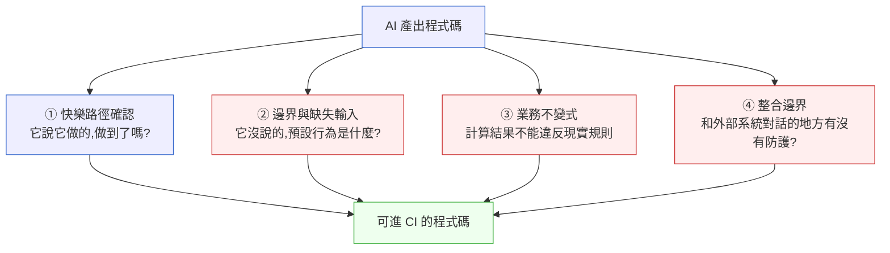

# 第 38 章｜為 AI 生成碼補測試與防護
## ⸺ 當程式碼快到讓人來不及懷疑,測試就是你和生產環境之間的最後一道牆

> **前置閱讀**:[第 37 章｜審查 AI 生成的程式碼](./ch-37-reviewing-ai-code.md) ⸺ 先知道看什麼,再知道怎麼守
> **下游章節**:[第 39 章｜Agentic 開發:讓 agent 跑工程任務](./ch-39-agentic-dev.md) ⸺ agent 大量產出之後,測試策略就更重要了

---

## 38.1 共感現場:「它生出來的,應該不會有問題吧?」

你可能也遇過這樣的情境。

一位工程師叫小薇,在一家做法人支付清算的 FinTech 公司 Paytide 工作。有天她要實作一支「跨幣別轉帳手續費計算」的功能,規格是這樣的:依據轉帳金額、目標幣別、來源銀行代碼,從費率表查出對應費率,乘上轉帳金額,再加上一筆固定手續費。

聽起來不難,但費率表有五十幾種幣別組合、十幾家銀行代碼,手工處理很容易出錯。小薇用了公司的 AI 助手,把規則貼進去,AI 很快給出一段 Python 程式碼。她看了一遍,邏輯清晰:費率查表、乘法、加法,結構工整,沒有奇怪的邊角,不像是需要去挑戰的程式碼。

她在本機跑了幾個測試案例——USD、EUR、JPY——數字都對。PM 那邊等著,她把它推上去了。

三個星期後,某個週五晚上,風控系統的告警響了。有一批來自特定銀行的 SGD(新加坡元)轉帳,手續費算出來是負數。負數本身不算一個語法錯誤,系統沒有設置值域守衛,錢就這樣被多退了出去。

事後復盤,問題出在費率表裡 SGD 的費率欄位是空白的——那是一個新增的幣別,業務同事還沒填進去。AI 生成的程式碼在查不到費率時,回傳了 Python 的 `None`。`None` 乘上轉帳金額是 `TypeError`,但上游有一段異常處理捕捉了 `TypeError` 並 fallback 成整數 `0`。`0` 加上固定手續費(假設是 `-50`——這個欄位原本應是加項,但設定為負值用於折扣情境),就得到了一個「負數手續費」,安安靜靜地通過了所有驗證,進了帳務系統。

沒有任何一行程式碼的語法是錯的。整段邏輯,照著規格走。

問題是:規格裡沒寫「費率缺失的時候怎麼辦」,AI 當然也沒寫。那個「費率表裡某個幣別還沒配置」的業務現實,存活在 Paytide 的組織知識和系統歷史裡——它不在 prompt 裡,AI 就看不到它。

這是一個很典型的情境。不是 AI 犯了什麼聰明錯誤,而是它根本不知道它不知道什麼。那些「費率表沒配全」「幣別代碼大小寫不一致」「金額帶非預期小數位」這類邊界,是存活在真實系統脈絡裡的知識,只有長期在這個系統裡工作的人才有機會知道它們存在。

順著這個道理,我們就能問出這章最核心的問題:**當 AI 幫你快速填滿了「正常路徑」,誰來守住那些它不知道自己遺漏的邊界?**

答案是你。但這不是一件靠眼力就能做到的事——它需要一套刻意設計的補測框架,幫你把那些 AI 看不到的地方,一一變成明確的測試斷言。接下來我們一步一步來看。

---

## 38.2 真正的問題:AI 生的程式碼有一種特別的「似是而非」

我們把這件事慢慢拆開看。

### 快樂路徑的誘惑

AI 生成的程式碼有一個特質,和人手寫的程式碼不太一樣:**它在「看起來合理的路徑」上通常非常乾淨,但在「沒有被描述過的路徑」上幾乎一定是空白。**

這不是 AI 的缺陷,這是它的本質。語言模型靠上下文預測最可能的下一段程式碼。「費率缺失時拋出什麼錯誤」這件事,不在你的 prompt 裡,也不在語法規律裡,所以它的預測就是「不處理」——不是刻意選擇忽略,而是根本沒有這個選項。

這帶來了一個讓人有點困惑的挑戰。以前人手寫程式碼,寫到一個查不到費率的情境,多少會停頓一下:「這裡如果查不到怎麼辦?」這停頓很短,但它給了你一個問出邊界問題的機會。AI 寫程式碼不會停頓——它一口氣把「快樂路徑(happy path)」都填滿,讓你的眼睛跟著它走完全程,滿足感到手了。你的大腦在這個時候,很自然地以為「這件事做完了」。

### 「遺漏得很流暢」是最難察覺的危險

也就是說,問題不只是 AI 遺漏了邊界處理,而是**它遺漏得那麼流暢**,讓你很難察覺有什麼東西消失了。

人手寫到一個困難的地方會停、會皺眉,那個遲疑是你和問題之間的接觸點。你停頓的地方,通常正好是問題的所在。AI 沒有遲疑——它一路順滑地把你帶過了問題點,讓你的眼睛滑過去了。那個接觸點就消失了。

小薇看 AI 生成的費率計算程式碼,眼睛沿著 `fetch_fee_rate()` → `rate * amount` → `total + fixed_fee` 一路流暢地走下去,沒有任何東西讓她停頓。程式碼結構漂亮,沒有讓她皺眉的地方。「費率如果是 `None` 的時候呢?」這個問題,從來沒有成為一個讓她停下來的問題,因為眼睛從來沒有停在那個地方。

這是人類視覺注意力的工作方式——我們傾向於跟著流暢、乾淨的結構走。AI 程式碼提供了這種流暢性,同時也帶走了本來應該讓你皺眉的地方。

### AI 讓「測試動機」變弱了

還有另一個微妙的心理效應。人手寫完一段程式碼之後,通常會覺得「我寫的,不一定可靠,要測一下」。這種不確定感其實是好的——它是驅動你去補測試的動力。

AI 生成的程式碼看起來那麼乾淨、那麼結構化,讀起來像是某個資深工程師寫的,你很容易默默覺得「這個應該沒問題吧」。這不是迷信,而是一種認知捷徑——看起來像是好程式碼的東西,通常就是好程式碼。

問題是這個捷徑在 AI 生成碼上失效了。AI 把表面的結構做得很漂亮,但它對你的業務語義沒有感知。`fee: -5.00` 在型別上完全正確,格式完全合法,但在 Paytide 的業務裡是不應該存在的值——AI 不知道,也無從知道。

正因為這三個特質同時存在——快樂路徑填得太滿、遺漏得太流暢、看起來太漂亮——AI 生成碼的邊界問題比人手寫的程式碼更難被察覺。所以,補測試不是錦上添花,而是**你主動補回那個本來應該讓你停頓、讓你思考的接觸點**。

那麼問題來了——如果那個接觸點消失了,測試能不能把它找回來?

可以。但不是隨便寫幾個測試就算數的那種。你需要的,是一套刻意設計來找出「AI 不會自己舉手說我不確定」的地方的補測框架。接下來這一節就是這個框架。

---

## 38.3 一起做判斷:四個角度,把測試當防護網補完

下面這個框架,把「為 AI 生成碼補測試」拆成四個角度。這四個角度之間沒有嚴格的順序依賴——不需要先做完①才能做②。但如果你問哪個最容易被人忘掉、也最容易造成生產問題,答案是②和③。①是大家都會做的,④通常有環境成本門檻,②和③往往在「快樂路徑看起來通過了」的滿足感裡被跳過。



> **補充說明**:四個角度是獨立的檢查維度,不需要按順序,但全都要想過。角度①是 AI 已經部分幫你做好的地方;角度②③是最容易被跳過、也是 Paytide 事件真正的根因所在;角度④的測試成本最高,但守住的邊界最關鍵。

四個角度各自在守什麼,讓我一個一個說清楚。

### 角度一:快樂路徑確認

這是最基本的一層,也是 AI 通常已經幫你做得不錯的地方。你把幾個正常輸入丟進去,確認輸出和你預期的一樣。小薇當初做的 USD、EUR、JPY 測試案例,就屬於這一層。

這層要做,但不要只做這層。它能告訴你「它做了你要它做的事」,但告訴不了你「它沒做你沒想到要說的事」。

快樂路徑確認的作用是建立基線——確認 AI 的主體邏輯是可信的,才能在後續的邊界測試裡分辨「這是 AI 邏輯的問題」還是「這是邊界輸入帶來的新問題」。沒有這個基線,邊界測試失敗時你會迷路。

一個實用的習慣:快樂路徑的測試案例,要帶上**具體的輸入數字和預期數字**,不要只寫「正確輸入,應該成功」。「USD 1,000 元,費率 0.015,固定費 50,預期手續費 65.00」這樣的斷言,比「輸入合法幣別,不拋例外」有具體得多的價值。當你寫出這種具體斷言的時候,你也同時在迫使自己確認業務規格——這個費率從哪裡來、固定費的定義是什麼——這個確認本身就很有價值。

### 角度二:邊界與缺失輸入(最容易被 AI 跳過)

正因為快樂路徑那麼好用,角度②才是 AI 生成碼最常出現空白的地方。你要系統性地問:**如果輸入不是「正常的」,程式碼會怎麼跑?**

這不是模糊的「試試看有沒有問題」,而是有四個具體方向要覆蓋:

- **查表缺失**:依賴查表的欄位,如果表裡沒有對應的項目,程式碼回傳什麼?是 `None`、是空字串、還是拋出例外?你要決定它應該怎麼行為,然後測試確保它確實如此行為。
- **數值邊界**:金額是 0 的時候,計算成立嗎?金額是負數呢?金額超大(比如一億)時,有沒有整數溢位或精度損失的風險?
- **格式異常**:幣別代碼如果傳進來是小寫 `sgd` 而不是標準的 `SGD`,程式碼知道嗎?舊系統傳進來的數字幣別代碼(ISO 4217 的 `702` 代表 SGD)又如何?
- **缺少必要欄位**:API 呼叫漏帶了來源銀行代碼,程式碼有沒有明確的守衛?還是它會嘗試用 `None` 去查表?

對 Paytide 的費率計算來說,這四個方向對應的測試案例如下表:

| 邊界類型 | 測試情境 | 預期行為 | Paytide 對應案例 |
|--------|----------|---------|----------------|
| 查表缺失 | SGD 費率欄位空白 | 拋出 `MissingFeeRateError` | SGD 費率空白事件(根因) |
| 數值邊界 | 轉帳金額 = 0 | 允許,手續費 = 固定費 50 | 極小轉帳費率捨入 |
| 數值邊界 | 轉帳金額 < 0 | 拋出 `InvalidAmountError` | 負數轉帳業務無語義 |
| 數值邊界 | 轉帳金額 = 1億 USD | 計算正確,精度保持 | 大額企業轉帳場景 |
| 格式異常 | 幣別代碼 `sgd`(小寫) | 轉大寫後查表,不拋例外 | 舊系統傳入小寫代碼 |
| 格式異常 | 幣別代碼 `702`(數字代碼) | 依映射表轉換或拋出明確錯誤 | 老舊系統整合 |
| 缺少欄位 | 未帶來源銀行代碼 | 拋出 `MissingBankCodeError` | API 呼叫漏帶欄位 |

這個表不是憑空想出來的,而是從「在這個系統裡,哪些輸入異常在現實中真的會發生?」這個問題出發,結合系統的歷史記錄和業務同事的記憶。每個專案、每個系統的邊界表都不一樣——Paytide 的費率表幣別配置問題,就是 Paytide 的工程師才知道的事。

### 角度三:業務不變式

有些規則不寫在規格裡,但它們是業務的「常識」——違反了就是 bug,不管程式碼邏輯有多正確。這些是業務不變式(Business Invariants),對金融計算尤其重要。

業務不變式的特點是:它們通常非常簡單,一句話說得完,但 AI 不知道它們的存在。AI 沒有辦法從「計算跨幣別手續費」這個指令裡推導出「手續費不能是負數」——除非你告訴它,而且就算你告訴它,它也只能幫你寫出一個「如果結果為負數則拋錯」的守衛,它不知道為什麼這個規則存在、它的業務意涵是什麼。

Paytide 的費率計算有幾條顯而易見的不變式:

- **手續費不能是負數**——負數手續費意味著系統在退錢,這在正常轉帳情境下沒有業務語義。
- **手續費不能大於轉帳金額本身**——收比轉帳額更多的手續費,在任何費率表設定下都不合理。
- **同一筆轉帳重跑一遍,結果必須相同(冪等)**——如果重算會得到不同結果,帳務系統的對帳就會對不上。
- **費率必須大於等於零**——費率表裡出現負費率,不管是輸入錯誤還是折扣設定錯位,都應該被攔截。

把這些不變式寫成測試斷言之後,它們就變成了一道始終存在的守門員。就算以後業務規格調整、AI 幫你重寫了部分邏輯、費率表新增了幣別,這些斷言還在——它們守的不是「這段程式碼做了什麼」,而是「這個功能不能發生什麼」。這是測試最重要的一層語義。

### 角度四:整合邊界

AI 生成的程式碼在和外部服務(資料庫、第三方 API、訊息佇列)對話的地方,常常只寫了「一切順利」的情境。查表成功、API 回應正常、資料庫寫入完成——這些是 AI 的預設世界觀,因為這些是 prompt 裡描述的事情。

你要補的是那些 AI 沒有描述到的情境:

- **外部服務逾時**:費率表資料庫查詢如果超過 200ms 還沒回應,程式碼會等多久?逾時之後會怎樣?拋出例外?fallback 到預設費率?這個決策需要你做,AI 沒有做。
- **非預期格式**:費率表資料庫回傳了一個多筆費率的結果(費率表設定錯誤,同一個幣別有兩筆),程式碼知道怎麼處理嗎?
- **重試副作用**:如果費率計算的呼叫失敗然後被重試,重試會不會造成重複計費或記錄?
- **服務完全不可用**:依賴的外部服務整個宕掉時,有沒有明確的降級行為,而不是讓例外一路往上噴?

這層不需要整合測試全覆蓋——起測試環境的成本很高,不是每個邊界都值得為它建一個整合環境。一個好用的分層策略是:

用帶有假服務(Fake Repository)的單元測試守住**介面語義**,確保「當費率查詢回傳 `None` 時程式碼做了什麼」;用契約測試(Contract Testing)守住**外部介面的格式約定**,確保真實的費率表資料庫會回傳你的程式碼期望的欄位格式;只在真的需要驗證「兩個服務之間的端對端行為」時,才啟動完整的整合測試環境。

先求守住介面,再求全整合——這是整合邊界測試的成本控制原則。

---

## 38.4 容易絆倒的地方

下面幾個地雷,在補 AI 生成碼的測試時特別容易踩到。每個都很常見,所以遇到的時候,有個底就好。

### 絆倒處一:只測「能跑的」,沒測「不該跑的」

很多人補測試的時候,習慣從「找幾個正確輸入驗結果」開始。這是對的,但對 AI 生成的程式碼不夠。

真正需要重點補強的,是那些「輸入不完整、格式怪、外部服務缺席」的情境——偏偏這些情境沒有「預期的成功結果」可以抄,所以心理上比較難下手。你需要為「失敗路徑」寫斷言——不是斷言「成功回傳值是多少」,而是斷言「這個例外應該被拋出」「這個錯誤碼應該出現」「這個函式不應該繼續執行」。

這種測試寫起來比快樂路徑更需要業務判斷力:你要先決定「在這個情境下,正確的失敗行為是什麼?」然後把這個決策明確地寫成測試。這個決策過程本身,就是你在用測試補回那個 AI 沒有做的業務判斷。

> **修正方向**:從「這段程式碼最可能在哪種輸入上靜悄悄地算錯或者不作聲地吞下去?」這個問題出發,你通常就能找到邊界在哪。Paytide 的案例裡,那個問題的答案就是「查不到費率的時候」——一旦你問了這個問題,答案就很清楚了。

### 絆倒處二:讓 AI 生成測試,然後沒有仔細讀它

這個情境越來越常見。工程師讓 AI 生出程式碼,然後又讓 AI 生出對應的測試,兩段一起交出去。

問題是,AI 寫的測試通常很準確地測到了 AI 寫的程式碼所做的事——也就是說,它測的是**實作行為**,不一定是**業務期望行為**。如果 AI 的程式碼在費率為 `None` 時回傳 `0`,AI 寫的測試很可能也斷言「費率為 None 時回傳 0」,結果是測試通過、業務規則還是錯的。

這是一個讓人有點挫折的現象:兩段 AI 生成的程式碼互相「圓謊」了。測試通過,但它通過的是 AI 對規格的詮釋版本,不是你實際需要的業務行為。

更深層的問題是:AI 生的測試會繼承 AI 的「快樂路徑偏見」。它在快樂路徑上寫出很多漂亮的測試案例,但在邊界處理、業務不變式、整合邊界這三個方向上,它生出的測試案例同樣是薄弱的——因為這些維度本來就不在它的認知裡。讓 AI 補測試,無法補掉 AI 的盲點。

> **修正方向**:把業務規則和不變式先寫成測試(或至少寫成測試案例描述),再交給 AI 或自己去填實作。順序顛倒回來,測試就能守住的是「你期望什麼」,而不是「AI 做了什麼」。這個「測試先行」的做法在 AI 生成碼的場景下有一個額外的好處:它讓你在讀程式碼之前,先把自己對業務邊界的理解顯性化了。

### 絆倒處三:把「格式正確」誤以為「值合理」

型別正確、JSON 能解析——這些只說明格式沒有問題。`fee: -5.00` 格式完全正確,在 Python 型別系統裡是一個合法的浮點數,但在 Paytide 的業務裡是一個不應該存在的值。

AI 對業務語義沒有感知。它的程式碼通常會讓「格式正確的不合理值」安靜地流進資料庫、進入帳務系統、觸發轉帳動作。整個過程沒有任何技術層面的錯誤,只有業務層面的錯誤——而業務層面的錯誤,在告警系統發現之前,可能已經跑了三週。

這種問題特別難靠 code review 發現,因為 review 的眼睛通常也在看「邏輯有沒有問題」,而不是「這個值的語義有沒有問題」。

> **修正方向**:在業務物件的建構點加上明確的值域守衛(guard clause)或建構子驗證,讓不合理的值在進入業務邏輯之前就被攔截。對 Paytide 來說,`FeeCalculationResult` 的建構子應該在接收到非正數的手續費時立刻拋出例外,而不是等到帳務系統發現的時候。這個守衛應該是業務物件的一部分,而不是調用方的責任——因為 AI 生成的調用方程式碼,通常沒有想過要守這件事。

### 絆倒處四:整合測試太重,不如直接上線看看

有時候補整合邊界的測試感覺很麻煩:要啟動資料庫、要模擬第三方 API、要準備對應的測試資料、要確保測試環境不污染下一輪。工程師很容易說「先上線觀察吧,有問題再修」。

這個決策不一定是錯的——對觸發機率極低的邊界情境,「上線觀察」有時候確實比花三天架測試環境划算。問題是,這個成本計算常常是不對稱的:

- 在 CI 裡發現「費率查不到時行為錯誤」:修一個測試案例,30 分鐘。
- 在生產環境發現「費率算成負數」:週五晚上的緊急事故、帳務追查、對帳差異修復、客戶溝通——加起來可能是數天的工時和不確定的金額損失。

這個代價不對稱性在金融、醫療、電商等業務核心路徑上尤其明顯。「先上線觀察」的決策不是不行,但它應該是一個有意識的選擇,而不是「整合測試太麻煩了就跳過」的默認行為。

> **修正方向**:整合邊界的測試可以分層,成本從低到高:最輕量的是帶有假服務(fake 或 stub)的單元測試,守住介面語義;中間層是契約測試(Pact 等工具),守住外部介面的格式約定;最重量的才是需要啟動完整外部環境的整合測試。大部分的整合邊界問題,用前兩層就能守住,不需要啟動完整環境。如果某個邊界情境真的值得讓它「先上線觀察」,把這個決策寫進「信任邊界聲明」欄位,讓這個選擇變成有記錄的選擇,而不是被遺忘的選擇。

---

## 38.5 帶得走的工具 ⸺ 一頁式「AI 生成碼補測清單」

把四個角度整理成一張你可以直接貼進 PR 描述的清單。下面是空白模板:

```text
AI 生成碼補測清單 ⸺ {功能名稱}

【① 快樂路徑確認】
- 測試案例覆蓋的正常情境:{列出 2–3 個}
- 每個案例的輸入與預期輸出:{具體值,不要只寫「正確」}

【② 邊界與缺失輸入】
- 已補的邊界:{列出你想到的每個邊界條件}
  - 空值/None/缺少欄位時:行為 = {拋例外/回傳預設/其他}
  - 數值邊界(0、負數、極大值):行為 = {}
  - 格式異常(大小寫、多餘空格、非預期字元):行為 = {}
- 你覺得最可能在生產環境觸發的邊界:{標出來}

【③ 業務不變式】
- 此功能不能發生的結果:{列出 1–3 條}
  - 範例:計算結果不能為負/冪等性/金額守恆
- 每條不變式對應的測試斷言:{寫出來}

【④ 整合邊界】
- 此程式碼對外的依賴點:{列出外部服務/資料庫/API}
  - 依賴點 A 逾時時:行為 = {}
  - 依賴點 A 回傳非預期格式時:行為 = {}
- 採用的測試替身策略:{fake / stub / contract test}

【信任邊界聲明】
- AI 產出的哪些部分你審查過,哪些還沒:{}
- 你打算讓這段程式碼的哪條路徑「先觀察再補」(並記錄理由):{}
```

空白欄位「信任邊界聲明」特別值得說一下。不是每個邊界都需要在交付前就補到完整——有時候時間不允許,有時候某條路徑觸發機率極低。但你要知道自己是有意識地選擇「先觀察」,而不是沒有想過它。把這個決策寫下來,是一種對後來維護者(和未來的自己)的善意。

### 38.5.1 範例:Paytide 跨幣別手續費計算

讓我們回到小薇那個週五晚上的 SGD 事件。如果在推上去之前,她手上有這張清單,那個邊界很可能在第②欄就被抓到了。以下是那張清單填好的樣子:

```text
AI 生成碼補測清單 ⸺ 跨幣別轉帳手續費計算

【① 快樂路徑確認】
- 測試案例覆蓋的正常情境:
  1. USD → TWD,費率表有配置,金額 1,000 USD
  2. EUR → TWD,費率表有配置,金額 500 EUR
  3. JPY → TWD,費率表有配置,金額 50,000 JPY
- 每個案例的輸入與預期輸出:
  - USD 1,000:費率 0.015,固定費 50,預期手續費 = 1000 * 0.015 + 50 = 65.00
  - EUR 500:費率 0.018,固定費 50,預期手續費 = 500 * 0.018 + 50 = 59.00
  - JPY 50,000:費率 0.008,固定費 300,預期手續費 = 50000 * 0.008 + 300 = 700.00

【② 邊界與缺失輸入】
- 已補的邊界:
  - 費率表無對應幣別(SGD 未配置)時:行為 = 拋出 MissingFeeRateError
  - 幣別代碼大小寫混用("sgd" vs "SGD"):行為 = 轉大寫後查表,不拋例外
  - 轉帳金額 = 0:行為 = 允許,手續費 = 固定費 50
  - 轉帳金額 < 0:行為 = 拋出 InvalidAmountError
  - 未帶來源銀行代碼:行為 = 拋出 MissingBankCodeError
- 你覺得最可能在生產環境觸發的邊界:費率表未配置新幣別(最高優先)

【③ 業務不變式】
- 此功能不能發生的結果:
  1. 手續費 ≤ 0(手續費為零或負數絕對不能進帳)
  2. 同一筆轉帳請求重算兩次,結果必須相同(冪等)
  3. 手續費不能超過轉帳金額本身
- 對應測試斷言:
  - assert fee > 0  # 對所有合法輸入
  - assert calculate_fee(req) == calculate_fee(req)  # 冪等
  - assert fee <= amount

【④ 整合邊界】
- 此程式碼對外的依賴點:費率表資料庫查詢
  - 查詢逾時(>200ms)時:行為 = 拋出 FeeRateLookupTimeoutError,上層捕捉後拒絕交易
  - 回傳多筆費率(費率表設定錯誤):行為 = 取第一筆並記錄警告日誌
- 採用的測試替身策略:使用 fake FeeRateRepository,注入測試用費率表

【信任邊界聲明】
- AI 產出的費率查表邏輯與乘加計算已人工審查。
- 幣別代碼標準化(含舊系統傳入三位元數字代碼如 702)暫定上線後觀察,
  因老系統代碼映射表尚未確認完整,若觸發 MissingFeeRateError 可快速追查。
```

填完清單之後,讓我們看一眼②欄的第一條:「費率表無對應幣別(SGD 未配置)時:行為 = 拋出 `MissingFeeRateError`」。

這條如果在推上去之前就被填進去了,對應的測試案例就會是:

```python
# Python 3.12 / pytest
def test_missing_fee_rate_raises_error():
    """費率表未配置幣別時,應拋出明確業務例外,不允許靜默計算。"""
    repo = FakeFeeRateRepository(rates={})  # 空費率表,模擬 SGD 未配置情境
    calculator = FeeCalculator(fee_rate_repo=repo, fixed_fee=50)

    with pytest.raises(MissingFeeRateError) as exc_info:
        calculator.calculate(amount=1000, currency="SGD", bank_code="OCBC")

    assert "SGD" in str(exc_info.value)  # 例外訊息包含未配置的幣別代碼,方便追查
```

這個測試案例並不複雜——它甚至可以在三分鐘內寫完。但它守住的那條邊界,正好是 Paytide 那個週五晚上事件的根因。清單的作用,是讓那個問題「費率如果查不到怎麼辦?」從沒有被問到的狀態,變成一個必須填答案的問題。填了答案,測試就能寫出來;測試寫出來,那個邊界就守住了。

另外,③欄的業務不變式也值得補一個對應範例:

```python
# Python 3.12 / pytest
def test_fee_is_always_positive():
    """無論任何合法輸入組合,計算出的手續費都必須大於零。"""
    repo = FakeFeeRateRepository(rates={"USD": 0.015})
    calculator = FeeCalculator(fee_rate_repo=repo, fixed_fee=50)

    fee = calculator.calculate(amount=1000, currency="USD", bank_code="HSBC")

    assert fee > 0, f"手續費不能為零或負數,但得到 {fee}"
```

這兩個測試案例加起來,守住了 Paytide 事件裡所有關鍵的業務語義——不是因為它們很複雜,而是因為它們問對了問題。

---

## 38.6 本章回顧

讀完這一章,你應該已經能夠:

- [ ] 說明 AI 生成碼和人手寫碼在「遺漏邊界處理」上的結構性差異:AI 快樂路徑乾淨、未描述路徑幾乎一片空白,且遺漏得「太流暢」讓你不容易察覺
- [ ] 用四個角度(快樂路徑、邊界與缺失、業務不變式、整合邊界)系統性地為 AI 生成的功能補測試
- [ ] 識別「AI 生測試給 AI 生的程式碼」的陷阱:AI 測試只守住實作行為,不守住業務期望行為
- [ ] 知道業務不變式和值域守衛的用途:它們守的是「這個功能不能發生什麼」,而不只是「這段程式碼做了什麼」
- [ ] 填寫「AI 生成碼補測清單」,並在「信任邊界聲明」欄位中有意識地記錄哪些路徑是刻意選擇觀察的

如果想先從一件事開始,建議這樣做——在下一個包含業務計算的 AI 生成功能裡,把業務不變式先寫成測試斷言,再去讀程式碼邏輯。順序只是顛倒了一下,但你和問題的接觸點就從「不見了」變成「主動出現了」。那個接觸點,正是 AI 在加速開發節奏的同時,最容易帶走的東西——把它找回來,是這章想幫你做的事。

---

## Cross-References

- **上一章**:[第 37 章｜審查 AI 生成的程式碼](./ch-37-reviewing-ai-code.md) ⸺ 審查與補測是同一件事的兩面:審查幫你找到哪裡需要測,測試讓審查的結論落地
- **下一章**:[第 39 章｜Agentic 開發:讓 agent 跑工程任務](./ch-39-agentic-dev.md) ⸺ agent 會大量產出程式碼,這章的補測策略就是你的防護網
- **強連結**:[第 10 章｜可測試的程式碼設計](../part-03-testing/ch-10-testable-code.md) ⸺ 補測的前提是程式碼可測;AI 生成碼不一定天生可測
- **強連結**:[第 12 章｜契約測試與整合測試](../part-03-testing/ch-12-contract-integration.md) ⸺ 整合邊界的測試替身策略在這裡有完整討論
- **強連結**:[第 13 章｜測試替身的取捨](../part-03-testing/ch-13-test-doubles.md) ⸺ fake / stub / spy 的選擇直接影響補測的成本與信心
- **跨書連結**:[SA/SD Playbook Ch 27](https://github.com/EddyKuo/sa-sd-playbook) ⸺ 為可測試性而設計是架構層的決策,和本章的實作層補測形成上下呼應
