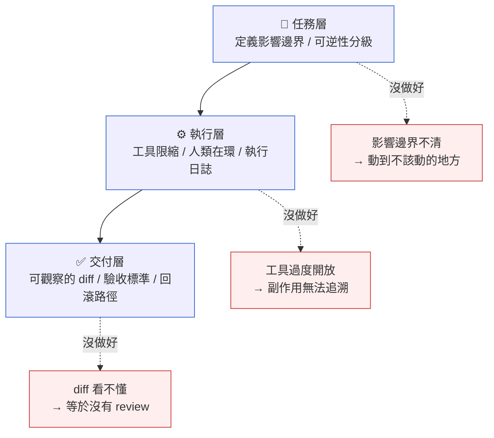

# 第 39 章｜Agentic 開發:讓 Agent 跑工程任務
## ⸺ 當程式碼開始自己跑起來,你的護欄在哪裡?

> **前置閱讀**:[第 37 章｜審查 AI 生成的程式碼](./ch-37-reviewing-ai-code.md)　[第 38 章｜為 AI 生成碼補測試與防護](./ch-38-testing-ai-code.md)
> **下游章節**:[第 40 章｜Prompt 與 context 作為工程產物](./ch-40-prompt-as-artifact.md)　[第 41 章｜AI 時代的工程師心智與責任界線](./ch-41-engineer-mindset-ai.md)

---

## 39.1 共感現場:那個凌晨把 PR 開好的 Agent

小韋是一家 SaaS 公司 Loomify 的後端工程師。Loomify 做的是協作文件工具,每個月有幾十萬個工作區在用他們的 API。

那陣子團隊在試一套 agentic(Agent-driven)開發工具——把一個 AI agent 接上 codebase,讓它能讀檔案、跑測試、開 PR。理論上你描述一個任務,agent 就去把它做好,你只需要 review。

有一天小韋在下班前給 agent 一個任務:「把 API 的 rate limit 回應從 HTTP 429 改成在 response body 裡帶回剩餘秒數。」他覺得這是個改動不大的任務,就交給 agent 去跑,然後去睡覺了。

隔天早上,agent 確實把 PR 開好了。改動範圍看起來也對:多了一個 `retry_after` 欄位、測試也過了。小韋匆匆 review 了一下,覺得沒問題,就 merge 進去。

結果當天下午開始陸續收到客戶回報:有幾個用 SDK 整合的工作區,retry 行為整個壞掉了。原來 agent 修改 response 格式的同時,也動了錯誤物件的序列化邏輯,而那個改動微妙地改變了某個在文件裡沒寫清楚、但客戶依賴的欄位順序。SDK 那邊的解析器碰巧對順序敏感,整個連鎖下來就炸了。

你可能也遇過類似的事——任務看起來很小,交給 agent 去做,PR 也開好了,但出事的地方在你沒想到的角落。這不是 agent 不厲害,而是 **agent 看不見你的系統有多少「沒寫在文件裡、但客戶已在依賴」的暗契約**。那些暗契約只在你腦袋裡。

順著這個道理,我們接下來要拆解的,不是「agent 夠不夠好」,而是「我們怎麼讓 agent 工作,才能讓自己睡得著覺」。

---

## 39.2 真正的問題:Agent 不缺能力,缺的是你的護欄

我們慢慢把這件事拆開來看。

小韋那次出事,第一直覺可能是「agent 改到不該改的地方」。但其實更準確的說法是:**任務的影響邊界沒有被事先定義**。「改 rate limit 回應格式」聽起來是一個小任務,但它實際上觸及了公共 API 的序列化行為,而那個行為有多少外部消費者、依賴的方式是什麼——這些資訊 agent 在跑任務時完全不知道。

這就引出了 agentic 開發和傳統 AI 輔助編碼最根本的差異。

過去你用 Copilot、ChatGPT 幫你寫一段程式碼,AI 在「補全」完就停下來了,下一步是你自己決定貼不貼、改不改。也就是說,**你永遠在迴圈裡**:AI 生成,你判斷,你執行。

但 agentic 開發不一樣。Agent 有工具——它能讀檔案、能執行指令、能開 PR,能跑不只一步。它的每一個動作都會真實地改變系統的狀態,而且動作之間有因果:它讀了某個檔案,根據內容決定要改哪裡;改完了跑測試,根據結果決定要不要繼續。

這樣的「自主執行鏈」帶來一個你在傳統輔助編碼裡不會遇到的問題:**你不在每一個決策點上。**

也就是說,真正的風險不是「agent 不夠聰明」,而是「當 agent 做了一個錯誤的中間決策,沒有人知道、也沒有任何東西擋住它繼續往下走」。

那麼問題來了——在沒有護欄的情況下,agent 做的每一步都在賭它的判斷剛好對。賭注小的時候你不會注意到,賭注一大,就是生產事故。

正因為這樣,agentic 開發的核心不是「讓 agent 更聰明」,而是:**在 agent 能力既定的前提下,你怎麼設計護欄,讓它做壞了能退、做到邊界會停、做完了你能看清楚發生了什麼**。

這就是本章要和你一起想清楚的事。

---

## 39.3 一起做判斷:三層護欄,讓 Agent 工作得有邊界

要替 agentic 工作流設計護欄,一個好用的角度是把護欄分成三層:**任務層、執行層、交付層**。每一層守護的東西不同,少了任何一層,都會有漏洞。

我們先用一張圖把這三層的關係畫出來:



接下來我們逐層走一遍。

### 39.3.1 任務層:先說清楚影響邊界與可逆性

在把任務交給 agent 之前,有兩件事值得先想清楚。

**第一件:影響邊界。** 這個任務會碰到哪些檔案、哪些介面、哪些資料?有沒有對外的契約(公共 API、SDK、資料庫 schema)?如果 agent 做完這個任務,有哪些「外部消費者」可能受到影響?

影響邊界愈小、愈封閉,你就愈能放心地讓 agent 自主跑。影響邊界一旦跨過內部邊界、碰到對外介面,就需要更嚴格的人類確認。

**第二件:可逆性分級。** 不是所有的操作都一樣危險。一個好用的分級方式如下:

| 可逆性等級 | 典型操作 | Agent 自主程度 |
|---|---|---|
| **完全可逆** | 修改純邏輯程式碼、新增測試 | 可讓 agent 自主完成並開 PR |
| **低成本回滾** | 改 feature flag 設定、修改內部介面 | Agent 執行,但 PR 需人工 review 後才 merge |
| **高成本回滾** | 資料庫 schema 變更、公共 API 回應格式 | Agent 只做草稿或計畫,人類逐步執行並驗收 |
| **不可逆** | 生產資料刪除、金融交易寫入 | 絕不讓 agent 自主執行 |

小韋那次的任務——改公共 API 回應格式——按這個分級應該是「高成本回滾」:改完之後如果客戶 SDK 炸了,你沒辦法讓客戶的 runtime 跟著你一起回滾。這一類任務,agent 可以幫你起草 diff,但執行的每一步應該要人類逐一確認。

### 39.3.2 執行層:工具限縮、人類在環、執行日誌

任務定義好之後,接下來是 agent 實際在跑的過程。這一層有三個護欄值得特別注意。

**工具限縮(Tool Scoping)**:agent 需要什麼工具就給它什麼,不需要的就不開放。一個常見的錯誤是給 agent 一個「萬能工具箱」——能讀所有檔案、能執行任意指令、能呼叫所有 API。這樣雖然方便,但 agent 的每一步副作用都可能超出你的預期。

一個務實的做法是按任務類型預設不同的工具集:

| 任務類型 | 建議開放的工具 | 建議收回的工具 |
|---|---|---|
| 程式碼修改 | 讀/寫指定目錄內檔案、執行測試 | 呼叫外部 API、刪除/移動檔案 |
| 文件生成 | 讀程式碼、寫 Markdown | 修改任何程式碼 |
| 分析/診斷 | 讀所有相關日誌、程式碼 | 執行任何寫操作 |

**人類在環(Human-in-the-Loop)**:並不是說 agent 的每一步都要你點頭,而是**在關鍵決策點設置確認閘**。你可以在任務描述裡定義「何時要停下來問我」,例如:

- 如果要動 `api/` 目錄以外的檔案,先問一聲
- 如果測試失敗超過兩次,停下來等我看
- 如果發現對外介面的改動,暫停並說明

這些規則不需要複雜,但它們把「agent 自動往下走」的連鎖,在幾個你最在意的地方加了一個人工確認的插槽。

**執行日誌(Execution Log)**:agent 做了哪些步驟、讀了哪些檔案、執行了哪些指令,都應該被記錄下來並且你看得到。這不是為了事後審計,而是為了**當事情出了問題,你能快速定位是哪一步開始走偏的**。沒有執行日誌的 agent,就像一個半夜幫你工作、但你完全不知道他做了什麼的實習生——結果對了還好,結果錯了你也不知道要從哪裡查起。

### 39.3.3 交付層:可觀察的 diff、驗收標準、回滾路徑

最後一層是 agent 把工作交給你的時候。這一層的核心問題只有一個:**你有沒有辦法真正看懂 agent 做了什麼?**

一個常見的陷阱是 agent 開出一個很大的 PR,你在匆忙之中只看了一眼「測試全綠」就 merge 了。這等於你把護欄全部押在 agent 的判斷上,自己的判斷完全缺席。

可觀察的 diff(Differential,程式碼變更差異)有幾個標準:每個被修改的位置,你都能說出「為什麼要改」;diff 的大小和任務描述的影響邊界相符;如果有你沒預期到的改動,agent 應該要在 PR 描述裡標注並解釋。

驗收標準應該在任務開始前就寫下來:「這個任務做好了,長什麼樣子?」例如:

- 所有既有的 API 契約測試通過
- 手動在 staging 環境呼叫 `POST /rate-limit-test` 拿到的 response 包含 `retry_after`
- 沒有任何非 `api/rate_limit.go` 以外的公共介面被修改

最後,**在 merge 之前確認回滾路徑**:如果這個改動上線之後出了問題,怎麼退?退要多快?退的成本是什麼?回滾路徑愈短,你就愈能放心地讓 agent 幫你快速迭代。

---

## 39.4 容易絆倒的地方

既然理解了三層護欄各自守護的東西,接下來就能看清楚:很多團隊在導入 agentic 開發時踩到的坑,幾乎都能追溯到某一層護欄沒有設好。這幾個彎路我們都走過,說出來不是要怪誰,而是希望你下次能多繞開一點。

### 絆倒處一:把 Agent 當「只是更強的 Copilot」

這是最常見的一種認知錯位。Copilot 補全一行程式碼——你不滿意就 Esc,完全無害。但 agent 執行的是一條行動鏈:它讀了檔、改了程式碼、跑了測試,都是真實副作用。兩者的風險輪廓完全不同。

> 修正方向:在腦袋裡建立一個簡單的問題:「這個動作,agent 做完之後會改變什麼系統狀態?」只要這個改變是真實的、需要時間和成本才能還原的,就升一級謹慎對待。

### 絆倒處二:任務描述寫得太模糊

「幫我把這個功能做好」這種描述,對 agent 來說等於一張空白支票。Agent 會根據它對 codebase 的理解做出它認為合理的選擇,而那些選擇不一定和你腦袋裡的一樣。

> 修正方向:任務描述要包含三件事:做什麼(目標)、不能動什麼(邊界)、做好了長什麼樣(驗收標準)。把這三件事說清楚,agent 的自由度就從「無限」縮回到「你能預期的範圍」。

### 絆倒處三:測試全綠就放心 merge

測試通過是一個很好的訊號,但它只覆蓋你寫了測試的東西。沒有契約測試(Contract Testing)、沒有覆蓋到序列化行為的測試,「全綠」也可能有盲點——就像小韋那次一樣。

更微妙的是:agent 自己也會補測試。它補的測試往往是覆蓋它改動的部分,而不是覆蓋「改動可能波及到的部分」。這兩件事差很遠。前者讓你的 CI 更綠,但未必讓你的系統更安全。

> 修正方向:在驗收標準裡多一個問題:「這個改動的影響範圍,測試有沒有完整覆蓋?」如果有外部消費者、有對外介面,至少要有一個 end-to-end 的煙霧測試在 staging 環境跑過一遍。不要只看 agent 補的測試,也要問:「我自己原來的測試,有沒有一條是專門驗收這個影響範圍的?」

### 絆倒處四:沒有「Agent 做了什麼」的透明度

Agent 開了 PR,你 merge 了,但三天後你完全記不得那個 PR 裡哪些地方是 agent 決定的、哪些是 agent 從哪個檔案讀來的推論。出了問題要查原因,你幾乎要重新從頭讀 diff。

> 修正方向:要求 agent 在 PR 描述裡附上它的「推理摘要」:它讀了哪些關鍵檔案、為什麼選擇這樣改、有沒有遇到不確定的地方。這個摘要不是給 agent 看的,是給三天後的你、或接手的同事看的。

---

## 39.5 帶得走的工具 ⸺ 一頁式「Agentic 任務設計卡」

在把任務交給 agent 之前,有一張小卡片值得過一遍。它不是繁瑣的流程,只是把前面說的三層護欄,濃縮成你在描述任務時就能填的幾個欄位。

```text
Agentic 任務設計卡 ⸺ {任務名稱}

【任務目標】
- 做什麼:{用一句話描述預期的結果}

【影響邊界】
- 可以動的範圍:{目錄/介面/模組}
- 不能動的範圍:{哪些是對外契約 / 不可觸碰}
- 外部消費者:{有沒有 SDK / 客戶在用這個介面}

【可逆性評估】
- 等級:{完全可逆 / 低成本回滾 / 高成本回滾 / 不可逆}
- 若出錯,回滾方式:{git revert / feature flag / 手動 rollback}

【人類在環觸發點】
- 若 agent 碰到以下情況,需停下來等確認:
  - {條件一,例如:動到 api/ 以外的公共介面}
  - {條件二,例如:測試失敗超過兩次}

【驗收標準】
- {量化或可觀察的標準,例如:既有契約測試全過 + staging 手動驗收}

【執行工具限縮】
- 開放:{列出 agent 需要的工具}
- 收回:{列出這個任務不應用到的工具}
```

為什麼這張卡只有六欄?因為每一欄都守著一個你在任務執行過程中再也「插不進去」的關鍵點。任務一旦跑起來,這些事你就不在迴圈裡了;在任務開始前花五分鐘填這六欄,等於你在最有機會介入的時間點,先替自己設好了護欄。

### 39.5.1 範例:Loomify 的 rate limit 改版任務,如果當初有這張卡

回到小韋的故事。他當初給 agent 的任務是:「把 API 的 rate limit 回應從 HTTP 429 改成在 response body 裡帶回剩餘秒數。」這個描述裡,「影響邊界」和「外部消費者」完全沒有被說清楚。

如果他事先填了這張卡,大概會長這樣:

```text
Agentic 任務設計卡 ⸺ Rate Limit 回應帶回 retry_after

【任務目標】
- 做什麼:在 HTTP 429 回應的 body 加入 retry_after 欄位(單位:秒)
<!-- 為什麼這欄:目標要具體到「格式是什麼」,agent 才不會自己解讀 -->

【影響邊界】
- 可以動的範圍:api/rate_limit.go、internal/middleware/rate_limit_test.go
- 不能動的範圍:api/response/ 下所有序列化工具、公共 ErrorResponse struct
<!-- 為什麼這欄:序列化結構是外部消費者依賴的隱性契約,改了不一定能察覺 -->
- 外部消費者:Loomify SDK(Go/Python)、Enterprise 客戶自行整合的 webhook

【可逆性評估】
- 等級:高成本回滾
- 若出錯,回滾方式:git revert + 通知客戶 SDK 團隊、客戶 deprecation notice
<!-- 為什麼這欄:一旦外部 SDK 依賴了新格式,光是 git revert 不夠;
     這欄強迫你在任務前先想好「如果出事我怎麼辦」 -->

【人類在環觸發點】
- 若 agent 碰到以下情況,需停下來等確認:
  - 任何 api/response/ 目錄下的檔案被修改
  - ErrorResponse struct 的欄位順序被調整
  - 測試失敗超過一次

【驗收標準】
- 所有現有 API 契約測試通過(包含 SDK integration test)
- staging 環境手動呼叫觸發 429,確認 response body 包含 retry_after 且其他欄位未變動
- Go SDK 和 Python SDK 的現有解析邏輯不需修改即可正確讀取新欄位

【執行工具限縮】
- 開放:讀/寫 api/rate_limit.go、執行 go test ./api/...
- 收回:修改 api/response/ 以外的任何序列化邏輯、呼叫任何外部 API
```

你會看到,第二欄「不能動的範圍」裡那一行——`api/response/ 下所有序列化工具、公共 ErrorResponse struct`——就是當初 agent 踩的那個地雷。如果這張卡在任務開始前就存在,那一行裡的禁止規則,就會在 agent 動到 ErrorResponse 的時候觸發人類在環的確認。小韋不需要成為一個更嚴格的 reviewer,他只需要在出發前五分鐘想清楚這些事。

護欄不是用來讓 agent 跑慢一點的,它是讓你能放心讓 agent 跑快一點的前提。

---

## 39.6 本章回顧

讀完這一章,你應該已經能:

- [ ] 說清楚 agentic 開發和傳統 AI 輔助編碼的根本差異:agent 有真實副作用的執行鏈,你不在每個決策點上
- [ ] 用「任務層 / 執行層 / 交付層」三層護欄框架評估一個 agentic 工作流的安全性
- [ ] 在把任務交給 agent 之前,用可逆性分級決定應該給 agent 多少自主程度
- [ ] 設計人類在環的觸發點,讓 agent 在關鍵決策點停下來等你確認
- [ ] 填一張「Agentic 任務設計卡」,在任務開始前就把護欄設好

如果想先從一件事開始,我會建議 ⸺ **在下一次把任務交給 agent 之前,先想清楚「影響邊界」和「可逆性等級」這兩件事**,因為這兩個問題的答案決定了你在交付層需要多謹慎。大多數 agentic 開發的事故,根源都在任務開始前的幾分鐘沒有停下來想這兩件事。

---

## Cross-References

- **前一章**:[第 38 章｜為 AI 生成碼補測試與防護](./ch-38-testing-ai-code.md) ⸺ 測試是 agentic 任務驗收標準的基礎
- **下一章**:[第 40 章｜Prompt 與 context 作為工程產物](./ch-40-prompt-as-artifact.md) ⸺ 任務設計卡的 prompt 本身也值得版控
- **強連結**:[第 37 章｜審查 AI 生成的程式碼](./ch-37-reviewing-ai-code.md) ⸺ 交付層的 diff review 技術
- **強連結**:[第 41 章｜AI 時代的工程師心智與責任界線](./ch-41-engineer-mindset-ai.md) ⸺ 本章護欄背後的責任觀
- **強連結**:[第 12 章｜契約測試與整合測試](../part-03-testing/ch-12-contract-integration-testing.md) ⸺ 外部消費者契約測試的實作技術
- **強連結**:[第 23 章｜回滾與前向修復決策](../part-05-delivery/ch-23-rollback-decisions.md) ⸺ 可逆性評估的下游操作

---
