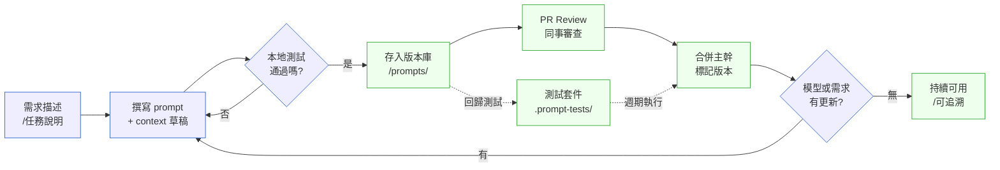

# 第 41 章｜Prompt 與 context 作為工程產物
## ⸺ 當你把 prompt 存進 Git,它才開始有資格被叫做「工程」

> **前置閱讀**:[第 40 章｜Agentic 開發:讓 agent 跑工程任務](./ch-40-agentic-dev.md)
> **下游章節**:[第 42 章｜AI 時代的工程師心智與責任界線](./ch-42-engineer-mindset.md)

---

## 41.1 共感現場:那個消失了的「調好的 prompt」

你可能也有過這樣的時刻。

在某個下午,你花了半小時調出一組 prompt,讓 AI 的回答精準到令你驚喜——它不僅給了你想要的架構,還按照你們系統的命名慣例整理輸出格式。你當下複製貼上,完成了那個需求,接著繼續下一件事。

三個星期後,相似的需求來了。你試著重組那個 prompt,但怎麼也找不回那個感覺——輸出的格式不對,有些背景脈絡 AI 搞錯了。你試了幾次,大概猜得到哪裡不一樣,但已經記不清當初是如何描述「我們的命名慣例」的,也不記得有沒有在 context 裡貼過什麼範例。

最後,你又從頭花了半小時調整——這次的結果比上次差一點點,但時間已經不夠再磨了。

這個情況在剛開始使用 AI 輔助開發的團隊裡非常普遍。大家花了時間在 prompt 上,卻沒把那個投資儲存下來。每次都重複相同的摸索,或者每個人各自維護一份不對外公開的「私藏 prompt」——「最常用的那個」藏在自己的 Notion 筆記頁面,或根本只存在腦海裡。

這其實不是個人的問題。沒有人教過我們要版控 prompt。因為 prompt 在過去根本不存在於工程的世界裡——它看起來像是自然語言、像是溝通工具、像是聊天記錄,怎麼看都不像「需要被認真管理的工程產物」。

但 2026 年的工程現場告訴我們:這個直覺,需要被修正了。

---

## 41.2 真正的問題:prompt 是程式碼,context 是狀態

我們把那個直覺慢慢拆開來看。

為什麼我們會版控程式碼?理由很直接:因為程式碼是「可重現的輸入」——給同樣的輸入,得到同樣的輸出。版控是為了讓這個「可重現」能夠穿越時間,讓你三個月後也能回到某個版本,知道當時的決定是什麼、為什麼這樣寫。

也就是說,版控的本質是對「可重現性」的保護。

那麼問題來了——prompt 是不是「可重現的輸入」?

一個給 AI 的 prompt,加上它的 context(包含系統說明、範例、背景資料、限制條件),其實就決定了 AI 的輸出行為。換同一個 prompt,AI 給出的結果會高度一致;換了 context 或改了 prompt 的某個部分,輸出往往就不一樣了。

也就是說,**prompt + context 這組合,具有和程式碼一樣的特性:它是輸入,輸出是由它決定的。**

順著這個道理,我們就能理解那個「消失的 prompt」到底損失了什麼。那不只是你個人摸索的時間,而是一次可以被儲存、被複用、被團隊共享的工程投資——它在你複製貼上之後就消失了,因為你對待它的方式,是「對話」而不是「工程產物」。

還有一個更深的問題。當 prompt 沒有版本記錄時,你不知道 AI 的輸出是因為 **你改了 prompt** 而變化,還是因為 **底層模型升級** 而變化。這兩件事對你的判斷影響完全不同——前者你可以修正,後者你需要更新 prompt 或重新評估使用的模型。但如果你連「上一個版本的 prompt 長什麼樣」都不知道,你就失去了比較的基準。

這就是 prompt 版控存在的根本理由:不是為了整潔,而是為了讓你的工程決策有跡可循、有基準可比較。

---

## 41.3 一起做判斷:把 prompt 當成可維護的工程產物

既然明白了根本理由——版控保護的是可重現性、是工程決策的可追溯性——接著自然的問題就是:我們要從哪幾個層面做起,才能讓 prompt 真正被當成工程產物對待?

一個好用的角度是——你可以把 prompt 想成一種特殊的「配置文件(configuration)」,它有自己的結構、有輸入變數、有預期的輸出格式,需要被測試、被版控、被文件化。

### 41.3.1 Prompt 的工程生命週期

先用一張圖看整體流程:



這張圖有一個關鍵節點:「存入版本庫」。它把 prompt 從「個人對話紀錄」變成「團隊共享資產」,也是讓後面所有工程做法得以成立的前提。

### 41.3.2 Prompt 版控的實際做法

在版本庫裡建一個 `/prompts/` 目錄,按功能分類存放。每一支 prompt 是一個獨立的 Markdown 或 YAML 文件。這樣的結構讓你可以用 `git log prompts/code-review/pr-summary.md` 看它改了什麼、為什麼改。

一份值得版控的 prompt 文件,通常包含這幾個部分:

| 欄位 | 說明 | 為什麼必要 |
|------|------|----------|
| `version` | 語意版本(semver) | 讓下游能明確宣告依賴哪個版本 |
| `model` | 目標模型與版本 | 不同模型回應差異大,記錄讓比較有基準 |
| `purpose` | 這支 prompt 解決什麼問題 | 三個月後不靠記憶就能判斷是否還適用 |
| `system` | 系統層 context | AI 的「人設」與限制條件 |
| `user_template` | 可帶變數的用戶訊息模板 | 讓每次呼叫是「填空」而非「重寫」 |
| `examples` | few-shot 範例(若有) | few-shot 是效果最穩定的 context 工程手段 |
| `expected_output_schema` | 輸出格式說明(JSON schema 或 prose) | 讓測試有基準,讓審查者知道「對的樣子」 |
| `changelog` | 改動歷史摘要 | 不用 `git blame` 就能快速理解演化脈絡 |

### 41.3.3 Prompt 測試:如何知道它「仍然管用」

程式碼有單元測試;prompt 也需要類似的機制。差別在於:prompt 的輸出是機率性的——同樣輸入,每次輸出不會完全一樣。所以 prompt 測試的目標不是「輸出相同」,而是「輸出符合品質基準」。

一個務實的 prompt 測試策略可以分三層:

**第一層:格式驗證(Structural Test)**
確認輸出符合預期的 JSON schema 或 Markdown 格式。這個測試完全可以自動化,而且幾乎 100% 穩定——如果 prompt 輸出跑掉了格式,這層馬上抓得到。

**第二層:關鍵字/語意驗證(Semantic Spot Check)**
對於高優先度的 case,用第二個 LLM 呼叫當「裁判」——但問題要問得具體,例如針對本章後面會提到的 PR 摘要 prompt,可以問:「這個摘要有沒有明確指出改動的業務目的?」「風險描述是否指出了具體的路徑和條件,而不是泛說『可能有風險』?」這層測試要寫清楚評分標準,也要接受一定的模糊性——你在測試的是語意品質,不是字元比對。

**第三層:人工快照審查(Snapshot Review on Change)**
每次 prompt 有版本更新,跑一組固定的 golden cases,把新版輸出和上一版輸出並排比較。這不是自動判斷好壞,而是讓有經驗的工程師快速確認「改動的影響在預期之內」。

這三層測試結合起來,就構成了 prompt 的「測試套件」。它不可能像程式碼測試那麼嚴密,但它能讓你在 prompt 升版時,有東西可以依據判斷——這比什麼都沒有要好得太多了。

但 prompt 本身只是一半——context 的組織方式同樣決定了 AI 的輸出穩定性。一支寫得很好的 prompt,如果每次帶入的背景脈絡都略有不同,輸出品質仍然會漂移。這就帶出了 context 工程的問題。

### 41.3.4 Context 作為資產:建立「知識庫」而非「每次重新貼」

Context 工程(Context Engineering)是 prompt 版控的另一面。很多時候,prompt 本身很短,但 context 很長——它包含了系統的命名慣例、業務規則摘要、程式碼風格範例、常見的反模式說明。

這些 context 素材,值得被單獨整理、版控、重用。你可以建立一個 `/context/` 目錄,把這些素材按主題分類存放:

- `/context/naming-conventions.md` — 命名規則
- `/context/domain-glossary.md` — 業務名詞說明
- `/context/anti-patterns.md` — 禁止的做法與理由
- `/context/code-examples/` — 良好程式碼範例

Prompt 文件可以透過引用機制組合這些 context 素材。這樣做的好處是:當命名規則改了,你只需要更新一個地方,所有引用它的 prompt 都能受益——這和我們對待共用 utility 函式的邏輯完全一樣。

### 41.3.5 Prompt 版控在 CI/CD 流水線中的實踐

把 prompt 推進版本庫之後,自然的下一步是讓 CI 流水線也知道 prompt 的存在。這不是可選的錦上添花,而是確保「prompt 改動」和「程式碼改動」能受到同等嚴謹對待的必要機制。

一個務實的做法是在 CI 流水線中加入 **Prompt Regression Gate**:每次有 `/prompts/` 目錄下的檔案改動時,自動觸發 golden case 套件的執行,並和上一個通過的版本比對輸出品質。流水線只有在 golden case 全部通過之後,才允許 prompt 改動合入主幹。

這裡有個小訣竅,外人常常沒想到:把 prompt 的 golden case 套件接進 CI,和接一般的單元測試流程幾乎一模一樣——不需要為 prompt 另外發明一套機制,直接沿用你手邊已經很熟的 CI 工具就好。以 GitHub Actions 為例,這個流程大致如下:

```yaml
# .github/workflows/prompt-regression.yml
name: Prompt Regression Check
on:
  pull_request:
    paths:
      - 'prompts/**'
      - 'context/**'

jobs:
  regression:
    runs-on: ubuntu-latest
    steps:
      - uses: actions/checkout@v4
      - name: Run prompt golden cases
        run: |
          python scripts/run_prompt_tests.py \
            --suite prompts/ \
            --baseline .prompt-snapshots/baseline.json \
            --output .prompt-snapshots/current.json
      - name: Compare with baseline
        run: |
          python scripts/compare_snapshots.py \
            --baseline .prompt-snapshots/baseline.json \
            --current .prompt-snapshots/current.json \
            --threshold 0.85
```

這段 CI 配置做了三件事:第一,它只在 `/prompts/` 或 `/context/` 有改動時才觸發,不浪費 API 呼叫預算;第二,它把本次輸出和基線快照(baseline)進行比較,而不是只判斷「有沒有輸出」;第三,它設定了一個品質門檻(`threshold 0.85`)——格式驗證必須 100% 通過,語意 spot check 允許一定的模糊性。

這個 Gate 放進 CI 之後,PR review 的對話會有一個明顯的改變:「我改了 few-shot 範例,golden case 全部通過,品質分數從 0.91 提升到 0.94。」這和程式碼 PR 附上測試結果的慣例完全一樣——**prompt 改動也開始有了可驗證的佐證**。

值得注意的是:CI 流水線的 prompt 測試需要有人管理 API 費用。一個常見的做法是設定「Prompt CI Budget」:每次 CI 跑完之後記錄 token 消耗,超過設定閾值就發告警。這不是要阻止測試,而是讓你看得到 prompt 測試的成本邊界,避免 golden case 套件無限膨脹。

---

## 41.4 容易絆倒的地方

實踐中,初次嘗試 prompt 版控的工程師最常碰到四類難點。別擔心,每一個都有修正方向,而且大多數人都走過——這些不是你特有的問題,是還沒有人好好說清楚造成的。

### 絆倒一:每次都在 prompt 裡重寫背景脈絡

這個做法最常見,也最消耗時間。每次向 AI 提問,都要花五分鐘重新交代「我們的系統是什麼、有什麼限制、這個詞在我們這裡是什麼意思」。

具體場景是這樣的:工程師小峰每次使用 AI 做 code review 前,都要手動貼入一段三百字的「系統背景說明」——包括後端是 Go 1.22、資料庫是 PostgreSQL 17、以及十幾條命名慣例。這段說明他大概記得,但每次都有些微的表述差異。有時候他省略了某條規則,有時候他的措辭略有不同,AI 給出的建議品質因此忽高忽低,但他說不清楚哪次差在哪裡。

這些背景脈絡明明是固定的——它不會因為你今天要問的問題不同而改變。重複貼入只是在做「複製貼上」的勞動,而且每次略有出入,導致輸出品質不穩定。

> **修正方向**:把固定的背景脈絡整理成 `/context/` 目錄下的文件,在 prompt 模板裡以引用的方式帶入。這樣你每次要問問題,只需填寫「這次特有的變量」,不需要每次重建環境。這份 context 文件同樣版控,改了有記錄。

### 絆倒二:prompt 沒有版本,模型升級後不知道輸出為什麼變了

底層模型升級是靜悄悄發生的——API 供應商可能在某個週二更新了模型權重,你的應用輸出質量悄悄飄移,而你不知道該怪 prompt 還是怪模型,更不知道要如何修正。

一個典型場景:團隊的文件摘要功能在某個星期開始輸出越來越長、細節越來越多——讀起來並不差,但和產品設計的「簡潔摘要」風格不符合。大家猜了很久,有人說「是 prompt 被改了」,有人說「是模型更新了」,但沒有任何記錄,沒辦法確認。最後花了一個多星期重新調整 prompt,也不確定是否完全恢復了原來的品質。

> **修正方向**:在 prompt 文件的 `model` 欄位明確記錄目標模型版本(例如 `claude-opus-4-5-20251101`)。`model` 欄位讓模型升級時有基準比較,是 prompt 版控最直接的「可追溯」投資。當模型有更新時,把新模型當成一次 prompt 升版的觸發器——跑一遍你的 golden case 套件,確認輸出品質仍在接受範圍內,再記錄變更。這樣你永遠知道「輸出的變化,是我選擇的還是被動發生的」。

### 絆倒三:以為 prompt 測試要做到和單元測試一樣確定性

這個誤解常常讓人在 prompt 測試上卡很久——寫了很嚴格的輸出比對,結果測試一直不穩定,因為 LLM 的輸出本來就有隨機性。最後放棄,說「prompt 不可能測試」。

這個挫折感完全可以理解:我們習慣了寫 `assertEqual(actual, expected)`,期望測試要麼通過要麼失敗,沒有模糊地帶。但把這個期望直接套用在 prompt 測試上,就像是要求天氣預報每次都精確到分鐘——不是工具壞了,是期望設錯了。

> **修正方向**:prompt 測試的目標是「夠好的品質保證」,不是「確定性驗證」。格式驗證和語意 spot check 已經足夠擋住大部分的退化。把「確定性」的期望留給程式碼測試,把「品質基準」的期望給 prompt 測試,這兩件事用不同的眼光對待,都能做好。

### 絆倒四:把所有 context 都塞進一支超長的 system prompt

一支擁有一萬個 token 的 system prompt,乍看很「完整」,但它有幾個問題:首先,模型在極長的 context 裡可能遺漏中間的指示(Lost in the Middle 問題)。其次,這種設計讓維護變得極其困難——你很難找到某條規則在哪裡、是否有衝突、為什麼在某種 case 下模型「沒有聽到」那條規則。

實際上,一支超長 system prompt 很快就會出現「有人加了規則、有人刪了規則,但沒有人知道整體還是否一致」的狀態。維護它的成本會隨著時間呈指數增長——因為你每次想改一條規則,都要讀完整份文件確認不會和其他部分衝突。

> **修正方向**:把 context 切成模組化的小段,按照任務的需要組合帶入。不是每個 prompt 都需要全部的 context——如果這次任務只涉及命名規範,就只帶命名規範那一段進去。更短、更精準的 context,往往比一個大雜燴的 system prompt 有更好的效果。每個模組小、獨立、單一職責——這和寫好程式碼的邏輯完全相同。

現在我們有了理論框架和常見地雷的修正方向,接下來看看如何把這些原則實踐成一份可以直接帶走的工具。

---

## 41.5 帶得走的工具 ⸺ 一頁式 Prompt 工程資產卡

一份值得版控的 prompt 文件,不需要很複雜。下面是空白模板,可以直接存成 `.md` 放進你的 `/prompts/` 目錄:

**空白模板**(`/prompts/{feature}/v{version}.md`)

---

```yaml
# Prompt 工程資產卡
version:        "{語意版本,例如 1.2.0}"
model:          "{目標模型與版本,例如 claude-opus-4-5-20251101}"
created:        "{建立日期}"
last_modified:  "{最後修改日期}"
owner:          "{維護人或團隊}"
purpose: |
  {這支 prompt 解決什麼問題?在什麼工作流裡被呼叫?}
```

```markdown
## System Context
{固定的背景說明、角色定義、限制條件}
{如需引用共用 context,標記 include: /context/{file}.md}
```

```markdown
## User Message Template
{用戶訊息模板,以 {{變量名}} 標記每次呼叫時的填空位置}
```

```markdown
## Few-shot 範例 (選填)
### 範例 1
Input:  {範例輸入}
Output: {範例輸出}

### 範例 2 (反例,optional)
Input:  {容易觸發錯誤的輸入}
Output: {正確的輸出,不是 AI 常犯錯的那個}
```

```yaml
## 預期輸出格式
output_schema:
  type: object
  properties:
    purpose:  { type: string, description: "1–2 句說明改動目的" }
    risks:    { type: string, description: "具體風險條件,或「無明顯風險」" }
    test_coverage:
      covered: { type: array, items: { type: string } }
      gaps:    { type: array, items: { type: string } }

## 測試案例
golden_cases:
  - id:     "{case-id}"
    input:  "{測試輸入}"
    checks: ["{至少要包含什麼}", "{不應該出現什麼}"]

## Changelog
# - {version}: {改動摘要}
```

---

這張卡片設計的思路是:每一個欄位,都對應到一個「沒填會吃虧」的場景。`version` 欄位明確記錄目標模型版本,讓模型升級時有基準比較;`golden_cases` 讓你 prompt 改版時有測試可跑;`changelog` 讓三個月後接手的同事不需要猜你為什麼這樣設計;`purpose` 說清楚「在哪裡被呼叫」,讓維護者知道改動這支 prompt 會影響哪個自動化流程。

### 41.5.1 範例:CloudPost 的 PR 摘要 prompt

讓我們用一個完整案例來填這張卡片。

CloudPost 是一家做雲端文件協作的 SaaS 公司(CASE-SAS-040)。他們的工程團隊有 30 人左右,每天產出 20–30 個 PR。團隊有個習慣:每個 PR 都要附上一段「給技術主管的摘要」,說明這次改動的目的、風險、測試覆蓋。

但這段摘要品質很不穩定——有人寫一句話,有人寫三段;有人提到測試,有人完全漏掉風險說明。Tech Lead 秀敏帶了半年,一直在 code review 裡重複提醒同樣的事。

後來,秀敏和團隊一起設計了一支「PR 摘要生成」prompt,並且正式版控到 `/prompts/pr-summary/v1.0.0.md`。填好的資產卡如下:

---

```yaml
# Prompt 工程資產卡
version:        "1.2.0"
model:          "claude-opus-4-5-20251101"
created:        "2026-03-10"
last_modified:  "2026-05-22"
owner:          "platform-team"
purpose: |
  根據 PR 的 diff 與標題,生成一段結構化的 PR 摘要。
  在 CI 流水線中自動觸發,結果貼到 PR 描述的「摘要」區塊。
```

> **設計說明**:purpose 欄位只寫「解決什麼問題、在哪裡被呼叫」這兩件事就夠了——它是給三個月後的維護者看的,愈精簡愈好讀。這裡特別點出「在 CI 流水線中自動觸發」,是因為維護者需要知道改動這支 prompt 會影響哪個自動化流程,而不是誤以為它只是一個手動輔助工具。

```markdown
## System Context
你是 CloudPost 工程團隊的技術審查助手。
CloudPost 是一個多租戶文件協作 SaaS,主要技術棧:
  - 後端: Go 1.22 + PostgreSQL 17
  - 前端: React 19
  - 部署: Kubernetes + ArgoCD

在生成 PR 摘要時,請遵守以下規則:
1. 只描述 diff 裡實際出現的改動,不要推測或補充
2. 風險評估必須具體:說明「哪個路徑在什麼條件下有風險」,而不是泛說「有一定風險」
3. 若測試沒有覆蓋到改動的主路徑,明確指出缺口

include: /context/naming-conventions.md
include: /context/risk-labels.md
```

```markdown
## User Message Template
PR 標題: {{pr_title}}
PR 大小: {{changed_files}} 個檔案,{{additions}} 行新增,{{deletions}} 行刪除

Diff 摘要(前 200 行):
{{diff_excerpt}}

請生成一份 PR 摘要,包含以下三個段落:
1. **改動目的**(1–2 句)
2. **主要風險**:若無,請明確寫「無明顯風險」而非留空
3. **測試覆蓋**:列出測試覆蓋到的路徑,以及未覆蓋的主路徑(若有)
```

```markdown
## Few-shot 範例
### 範例 1
Input:
  pr_title: "fix: 修正多租戶查詢遺漏 tenant_id 過濾"
  diff: "[...修正 document_query.go 中 WHERE 子句補上 tenant_id...]"

Output: |
  **改動目的**:修正文件查詢遺漏 tenant_id 過濾條件,避免跨租戶資料洩漏。

  **主要風險**:此改動修正了安全漏洞,但若線上仍有快取住舊查詢結果的地方,
  修正可能無法立即生效。建議部署後清除文件查詢快取(Redis key prefix: `doc:query:*`)。

  **測試覆蓋**:
  - 已覆蓋:單租戶查詢、跨租戶隔離(integration test)
  - 未覆蓋:快取層的 stale data 場景
```

這個 few-shot 範例選了一個「風險不明顯但實際存在」的 case,讓模型學習「具體說出風險的條件」,而不是泛說「有安全疑慮」。選什麼當範例,本身就是一個工程決策,值得記錄在 changelog 裡。

這也回應了 User Message Template 裡「若無,請明確寫『無明顯風險』而非留空」這條規則的由來:早期版本(v1.0)讓模型直接省略風險欄位,導致 code reviewer 誤以為「空的就是沒問題」。後續的 gc-002 golden case,檢查的正是「純文件改動時,risks 欄位有沒有明確寫出無風險」——這條規則和這個測試案例是配套的,一個定義行為,一個驗證行為沒有跑掉。

```yaml
output_schema:
  type: object
  properties:
    purpose:
      type: string
      description: "1–2 sentences"
    risks:
      type: string
      description: "specific condition + impact, or '無明顯風險'"
    test_coverage:
      type: object
      properties:
        covered: { type: array, items: { type: string } }
        gaps:    { type: array, items: { type: string } }

golden_cases:
  - id: gc-001
    input: { pr_title: "refactor: 拆分 UserService", diff: "[...]" }
    checks:
      - "改動目的段落存在且不超過 2 句"
      - "risks 欄位不為空字串"
      - "test_coverage.gaps 欄位存在"
  - id: gc-002
    input: { pr_title: "docs: 更新 README", diff: "[純文件改動]" }
    checks:
      - "risks 明確寫出「無明顯風險」"
      - "test_coverage.gaps 回應「文件改動無需測試覆蓋」"

changelog:
  - version: "1.2.0"
    date: "2026-05-22"
    note: "新增 few-shot 範例,改善風險描述的具體性;更新 model 至 claude-opus-4-5-20251101"
  - version: "1.1.0"
    date: "2026-04-01"
    note: "將輸出格式從 Markdown prose 改為結構化 JSON,配合 CI 自動解析"
  - version: "1.0.0"
    date: "2026-03-10"
    note: "初版,手動觸發"
```

---

秀敏在第一次把這份 prompt 推到版本庫、打開 PR 的時候,旁邊的工程師小昕看了一眼說:「這是在 review 一支 prompt?」秀敏點點頭:「對,你看 changelog 的 1.1.0——上一版的輸出是自由格式的 Markdown,CI 沒辦法自動解析,我們改成 JSON 格式。如果沒有版本記錄,三個月後沒有人記得為什麼要是 JSON。」

現在那支 prompt 已經在 CI 跑了三個月。當四月份底層模型更新時,團隊跑了一遍 golden cases,發現 `gc-002`(純文件 PR)的風險描述措辭有些微飄移——不是錯誤,但和預期不完全吻合。他們花了二十分鐘調整了 few-shot 範例,打了一個 1.2.0 的版本,一切恢復穩定。

這就是 prompt 版控的價值——不是讓你避免所有問題,而是當問題來的時候,你知道從哪裡下手。

---

## 41.6 本章回顧

讀完這一章,你應該已經能:

- [ ] 說明為什麼 prompt + context 具有和程式碼相同的「可重現輸入」特性,因此值得版控
- [ ] 建立 `/prompts/` 和 `/context/` 目錄結構,把 prompt 從「個人對話紀錄」變成「團隊共享資產」
- [ ] 為一支 prompt 填寫工程資產卡,包含版本、模型、模板、few-shot 範例、golden cases
- [ ] 區分 prompt 測試的三層做法:格式驗證、語意 spot check、快照審查,並對每層有合理的期望
- [ ] 把固定的 context 素材模組化,避免每次 prompt 呼叫都要重複貼入背景脈絡

如果想先從一件事開始,建議——**把現在最常用的那支 prompt 存成文件,填上 `version`、`model`、`purpose` 這三個欄位,推進版本庫**,因為這個動作本身就已經把 prompt 從「個人習慣」變成了「可交接的工程資產」。其他的測試和模組化,可以之後慢慢補。

### 常見問題 FAQ

**Q:我的 prompt 只在本地用,不跑在 CI 裡,也要版控嗎?**

值得。版控的主要收益不是讓 CI 跑測試,而是讓你未來能比較「改了什麼、為什麼改」。即使只有你一個人用,三個月後的你也是「另一個人」——你不一定記得當初為什麼這樣寫。一份有 changelog 的 prompt,是你給未來的自己的禮物。

**Q:prompt 改動很頻繁,每次都要打版本號嗎?**

不需要每次修改都升版本。務實的做法是:微調措辭不升版(用 git commit 記錄就夠);改動 few-shot 範例、輸出結構、或模型升版,才打一個小版本(patch 或 minor)。讓 git log 處理「什麼都有記錄」,讓 changelog 處理「重要的改動有說明」——兩者分工合作。

**Q:golden case 要寫幾個才夠?**

從 2–3 個開始就有價值了。選最重要的正例和最容易犯錯的邊界 case。套件太小固然有盲點,但沒有套件更糟。等你在實際使用中發現某類輸出偶爾出問題,再把那個 case 加進去——golden case 套件本來就應該隨著使用經驗成長。

**Q:prompt 版控和 feature flag 有什麼關係?**

可以結合使用。prompt 版本號可以作為 feature flag 的一個維度:「這個功能在 A/B 實驗期間使用 prompt v1.2,control 組使用 v1.1。」這樣的結合讓你不只能比較 UI 的差異,也能比較 AI 行為的差異——這正是 AI 功能 A/B 測試最難的部分,有了版控就有了基礎。

下一章,我們會往更大的問題走:當 AI 幫你寫了大量程式碼、管理了大量 context,作為工程師,你如何維持對自己產出的所有權感與判斷力?那是個比 prompt 版控更根本的心智問題。

---

## Cross-References

- **上一章**:[第 40 章｜Agentic 開發:讓 agent 跑工程任務](./ch-40-agentic-dev.md) ⸺ 理解 agent 如何使用 prompt 與 context,是本章的前提
- **下一章**:[第 42 章｜AI 時代的工程師心智與責任界線](./ch-42-engineer-mindset.md) ⸺ prompt 版控解決「可追溯」;這章解決「責任歸屬」
- **強連結**:[第 38 章｜審查 AI 生成的程式碼](./ch-38-reviewing-ai-code.md) ⸺ prompt 的品質直接影響需要審查的 AI 輸出品質
- **強連結**:[第 39 章｜為 AI 生成碼補測試與防護](./ch-39-testing-ai-code.md) ⸺ prompt 測試與 AI 生成碼的測試策略可互相參照
- **強連結**:[第 4 章｜版本控制策略](../part-01-foundations/ch-04-version-control.md) ⸺ commit 衛生與分支模型同樣適用於 prompt 版控
- **強連結**:[第 16 章｜與 CI 整合的測試流水線](../part-03-testing/ch-16-ci-testing.md) ⸺ prompt golden cases 可以整合進 CI 自動執行
- **跨書連結**:[SA/SD Playbook Ch 40](https://github.com/EddyKuo/sa-sd-playbook) ⸺ 系統設計高度的 AI 整合決策
