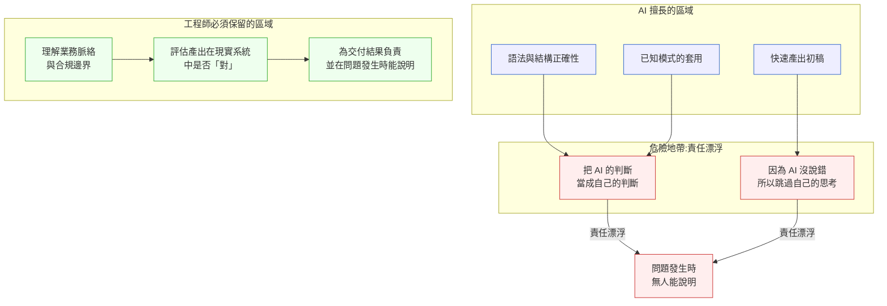

# 第 42 章｜AI 時代的工程師心智與責任界線
## ⸺ 當機器接手「寫」,「負責」這件事去了哪裡?

> **前置閱讀**:[第 37 章｜AI 輔助編碼的工作流重塑](./ch-37-ai-assisted-coding.md)、[第 41 章｜Prompt 與 context 作為工程產物](./ch-41-prompt-as-artifact.md)
> **下游章節**:[第 46 章｜判斷力的養成:當階梯被 AI 抽掉](../part-09-synthesis/ch-46-cultivating-judgment.md)

## 42.1 共感現場:那個「反正 AI 說這樣就這樣」的下午

你可能也遇過這樣的處境。

小薇在一家叫 ClearTrade 的線上券商任職,公司剛上線了一個 AI 輔助編碼工具,整個團隊都很興奮——開票速度快了一倍,PR 數量每週穩定成長。她那週負責的任務是給「客戶自動轉帳」功能加一條新的合規限制:如果單日轉帳金額超過台幣五十萬元,需要強制補充身份驗證。

她把需求描述給 AI,幾秒鐘後邏輯出來了,看起來完整,測試也通過了。有個細節她稍微遲疑了一下:AI 建議在計算「單日累計」時,用的是伺服器的本地時間,而不是客戶帳戶所在時區的時間。她心裡有個小疑問——但 AI 的程式碼看起來這麼完整,說明也寫得很清楚,她想說「應該不會差太多吧」,就按下了 merge。

上線後兩週,客服收到了客訴:有幾位在台灣以外時區的客戶,在轉帳後沒多久又轉了一筆,系統卻沒有觸發身份驗證。稽核人員一查,發現跨午夜的交易落在兩個不同的伺服器日,繞過了累計計算。合規部門的人來問:「這是誰審核上線的?」

小薇那一刻的感受,不是委屈,而是一種說不清楚的空白:「那個判斷,到底算誰做的?」

這個問題值得我們好好想清楚。不是為了分鍋,而是因為搞不清楚這件事,會讓整個工程團隊在 AI 時代陷入一種奇怪的漂浮感——寫程式的好像是 AI,決策的好像也是 AI,那工程師在做什麼?

## 42.2 真正的問題:「Generate」和「Judge」被混在一起了

讓我們把小薇的案子慢慢拆開來看。

表面上看,問題是時區沒處理好。但更深一層,問題是小薇那個「應該不會差太多吧」——她在那個瞬間,其實是把「判斷」這件事,外包給了 AI 的信心度。

這其實不是她的個人失誤。本書從第一章就一直在說一件事:AI 把「產出(Generate)」的成本壓得極低,但判斷(Judge)的責任,從來沒有跟著轉移過去。AI 能幫你寫出語法正確、邏輯通順的程式碼;但它不知道你們的合規文件長什麼樣、不知道你的客戶住在哪個時區、不知道這個功能錯了會不會有人被罰款。那些脈絡,只在你腦袋裡。

也就是說,**AI 接手了產出,但它沒有接手、也無法接手「知道這段程式碼在現實脈絡下對不對」的能力**。當小薇說「反正 AI 說這樣就這樣」,她其實不是在信任 AI——她是在讓判斷這個動作,在那個瞬間消失了。

這兩件事聽起來很像,但差別很關鍵:信任,意味著有人在主動負責——你信任一個同事,是因為你知道他懂什麼、不懂什麼,而你願意為這份了解背書。也就是說,信任一定建立在「你知道自己在依賴什麼」這個基礎之上。而小薇那個瞬間,她並不知道 AI 依據的是伺服器時間還是客戶時區,她只是沒有去問。這不是信任,這是迴避——把本來該由自己回答的問題,悄悄放到了沒人回答的地方。

這裡有一個容易混淆的地方:「判斷」和「重新手寫程式碼」是兩件不同的事。小薇不需要把 AI 的時區邏輯整個丟掉重寫——她需要的是在 merge 之前,能夠清楚地說出「合規文件裡對『單日』的定義是什麼,AI 的實作符合這個定義嗎」。那個「能說清楚」的動作,就是判斷。重寫是工具選擇,判斷才是責任。

順著這個道理,我們就能看清楚一件更大的事:AI 時代工程師最核心的心智轉換,不是「要不要用 AI」,也不是「怎麼寫更好的 prompt」——而是要非常清楚地知道,**哪些事可以交給 AI,哪些事只有工程師能做**。這個邊界,就是本章想幫你畫出來的東西。

## 42.3 一起做判斷:責任界線的三層地圖

那麼,這條界線要怎麼畫?一個好用的角度是把工程師的責任想成三個同心圈,從外到內分別是「上下文」、「判斷」、「簽名」。



讓我一層一層解釋這張圖想說的事。

### 第一層:上下文(Context)——AI 永遠不完整知道的事

每個工程師的頭腦裡,都裝著一批 AI 沒有的東西:這個系統三年來的技術決策脈絡、這個功能背後的合規邊界、公司最大的那個客戶的使用行為、上個月才剛踩過的一個類似地雷。這些「脈絡知識」,是工程師的核心優勢,也是 AI 產出的最大死角。

正因為 AI 缺少這些脈絡,所以它生成的程式碼表面上語法完美、邏輯通順,但在你的具體現實裡對不對,就不是語法檢查器能回答的問題了——那個答案,只藏在你腦袋裡的脈絡知識裡。AI 生成的程式碼不是不好——它的問題通常不是「語法錯」,而是「在你的具體現實裡對不對」。小薇那段時區的問題,用任何時區計算邏輯都能寫得語法完美;但選哪個時區,只有了解客戶分布和合規定義的人才能做出正確的判斷。

這一層告訴我們:把 AI 當作「知道你一切」的同事是危險的。更貼切的類比是:AI 是一位技術能力很強、但今天才第一天來你們公司的工程師。他能把你描述的需求寫得很好,但他不知道你們合規文件的附件三長什麼樣,也不知道上季有個客戶用的正好是夏威夷時區。那些上下文,你要帶進去。

### 第二層:判斷(Judgment)——「對不對」由工程師說了算

正因為 AI 缺少那些脈絡,所以「判斷」這個動作就自然回到了工程師身上。「判斷」不是指你親手把邏輯打出來——它是指在交付之前,你要能回答一個問題:「這段程式碼,在我們系統的現實條件下,做的事是對的嗎?」

下面這張表,可以幫你在面對 AI 產出的時候,快速定位「哪些問題我還沒答到」:

| 判斷層次 | 要問的問題 | AI 能幫嗎? | 誰最終負責? |
|---------|-----------|-----------|-----------|
| **L1 語法與邏輯** | 程式碼能跑嗎?測試通過嗎? | ✅ 很擅長 | AI + 工程師共同確認 |
| **L2 慣例符合度** | 這符合我們 codebase 的慣例嗎? | ⚠️ 部分,需提供 context | 工程師 |
| **L3 業務正確性** | 這段邏輯在真實業務規則下對嗎? | ❌ 不知道業務脈絡 | 工程師(必須) |
| **L4 系統影響** | 這個改動在現實系統的負載與邊界下安全嗎? | ❌ 不知道你的系統現況 | 工程師(必須) |
| **L5 責任可說明** | 如果出事,我能說清楚「我是這樣判斷的」嗎? | ❌ 無法替你負責 | 工程師(唯一) |

你會發現,AI 非常擅長 L1,在 L2 需要你給足夠多的 context,到了 L3 以下就基本上需要你完整接手。小薇那次出問題的地方,正好在 L3——業務正確性那一層。

**L4「系統影響」為什麼 AI 無法替代?** 這一層問的是「這段程式碼在你現有系統的運行條件下會怎樣」——但你現有系統的樣子,AI 看不到。ClearTrade 的案子裡,跨午夜的時間窗口如果遇上流量高峰,累計計算邏輯還需要考慮並發安全:多筆同時進來的轉帳請求,在接近門檻時是否有鎖保護?這個問題的答案,取決於你的資料庫設計、你的並發量級、你的分散式架構——沒有一件事是 AI 能從 prompt 裡猜出來的。

**L5「責任可說明」為什麼是工程師唯一的責任?** 責任可說明(Accountability)不是技術問題,而是組織問題。當稽核人員問「這個判斷是誰做的、依據什麼」時,AI 沒有辦法出現在那個對話裡。你才能。更重要的是,L5 不只是一個事後的問題——它是你在 merge 之前的一個自我問詢:「我現在能清楚說明這段程式碼為什麼是對的嗎?」如果說不清楚,那個漏洞在合規審查或事故複盤裡遲早會浮出來。

### 第三層:簽名(Sign-off)——責任不可外包

這一層最簡單,但也最容易被忽略。當你按下 merge,你就在事實上為這段程式碼的現實效果「簽名」了。這個簽名,AI 拿不走,也不該拿走。

這不是要給你壓力的說法。正好相反——它是在告訴你,你的判斷是有分量的。AI 能讓一個工程師在相同時間內產出更多,但那個「更多的產出」背後,每一行都還是需要有人理解它、驗證它、願意為它的正確性站出來說話。這個角色,就是你。

三層地圖的連結是這樣的:你帶著上下文(Context),去完成判斷(Judgment),最後用你的簽名(Sign-off)確認你做了這兩件事。少了任何一層,責任就開始漂浮。

## 42.4 容易絆倒的地方

說完了三層地圖,我們來看幾個常見的絆倒點。這些地方很多人都走過,所以這裡不是在指責誰,而是想讓你下次遇到的時候,心裡有個底。

### 絆倒處一:用 AI 的自信度替代自己的判斷

AI 語言模型給出的回答,語氣上不會顯示「這個我不確定」——它的措辭在第一行和最後一行通常同樣流暢自信。這會誤導人,是因為我們在評估一個方案有沒有想周全時,常常不自覺地用「表達得夠不夠流暢」當成一個替代指標——一段文字組織得越嚴密、措辭越自信,我們就越容易相信提出的人已經想得很全面了。這個判斷捷徑在人與人之間本來就不完全準,而 AI 恰好特別擅長寫出「聽起來全面」的文字,這就無意中把這個誤判放大了。這讓人很容易把「AI 寫得很完整」誤讀成「AI 已經考慮到所有角落」。小薇的時區問題就是這樣發生的:AI 的程式碼看起來這麼有組織、這麼完整,她的疑問就自然被壓下去了。

> **修正方向**:把 AI 的語氣想成一位文字能力極強、但還不認識你們系統的同事。他寫的方案越完整,你越需要主動問:「有哪些事他不知道、但我知道?」
>
> 具體做法是把你的疑問明確說出來,而不是讓它停在感覺層面。小薇在遲疑時可以這樣做:把「應該不會差太多吧」改成「合規文件對『單日』的定義是什麼?AI 用的是伺服器時間,那正確嗎?」——只要把問題說清楚了,答案往往就自然浮出來了。疑問留在腦袋裡會消散,寫成文字就變成可以解決的問題。
>
> 這個習慣不需要很大的改變:每次接受 AI 的輸出前,花三十秒問自己「有什麼是我知道、但 AI 不知道的」。這個動作不是在懷疑 AI,而是在啟動你自己的判斷層。

### 絆倒處二:因為很快,就把「確認」省掉了

AI 讓產出速度大幅提升,有時候快到「先上線再說」變得很誘人。但速度是中性的——它可以讓你更快交付正確的東西,也可以讓你更快交付沒確認過的東西。ClearTrade 那週,小薇的 PR 數量比以前多了一倍,但確認的深度沒有跟著增加。

> **修正方向**:用「速度省下來的時間」,換成「更紮實的判斷」,而不是直接省掉判斷。
>
> 一個好用的心智模型是:如果 AI 幫你省了三個小時,那三個小時不是用來多開三張票的,而是讓你有餘裕把 L3 和 L4 的問題問清楚。在合規相關功能上,這個換法尤其重要:多的時間讓你能打開業務規則文件,一條一條確認程式碼的行為。
>
> 為什麼這個方向有效?因為速度帶來的問題,通常不在交付當天暴露——它會在上線後兩週的客訴裡、在稽核報告裡慢慢冒出來。養成「速度省下來換判斷深度」的習慣,就是在把那筆隱形成本提前付掉,而且代價低得多。

### 絆倒處三:「AI 沒說錯,應該就對了」

這是一種心理上很微妙的滑動:從「我審查過,沒有問題」滑向「AI 說的,應該沒問題」。這兩句話語氣差不多,但責任鏈是斷的。前者是工程師完成了判斷,後者是工程師讓判斷消失了。

> **修正方向**:在腦袋裡保留一個小小的區分——不是問「這段程式碼有沒有錯」,而是問「這段程式碼做的事,是不是我想要的事」。
>
> 前者是在找語法 bug,後者才是在做業務判斷。兩件事都很重要,但後者是 AI 替代不了你的地方。這個區分具體來說是:「語法上 AI 說沒問題」和「業務規則上我確認是對的」是兩個獨立的確認動作。只做第一個、跳過第二個,就是這個絆倒處最常見的樣子。
>
> 為什麼這個方向有效?因為它把隱性的「感覺沒問題」變成顯性的「我確認了這件具體的事」。當你能說出「我確認了時區邏輯符合合規文件第三條的定義」,責任鏈就是完整的;當你只是「感覺 AI 應該沒有漏掉」,責任鏈就有缺口。

### 絆倒處四:在合規或安全相關的功能上最容易失守

時區、金額計算、權限邊界、個資處理——這些功能有一個共同點:它們在開發環境的測試裡很難驗證出問題,但在現實裡出問題的代價非常高。這是因為時區換算、金額計算、權限檢查這類模式,在開源程式碼和標準函式庫裡出現得非常頻繁,所以 AI 的訓練資料裡這類例子特別豐富——它自然能寫得又快又自信。而正是這份「不太真實的自信」,讓工程師更容易放鬆警覺,跳過「這個完整度是不是符合我們的合規定義」這一步。AI 在這類功能上生成的程式碼「看起來最完整」;但「看起來完整」和「符合你的合規文件」之間,有一段只有你能走的路。

> **修正方向**:對於合規相關功能,在 merge 之前,刻意做一件額外的動作:把業務規則文件打開,一條一條對照程式碼的行為。
>
> 這個動作不是在懷疑 AI,而是在履行你對 L3 的責任。具體做法是:把規則文件裡和這個功能相關的條文列出來(通常 2–4 條),然後對著程式碼問「這條規則在這裡有被實現嗎?邊界情況有沒有覆蓋到?」。小薇如果做了這個動作,就會發現合規文件說的是「客戶帳戶時區的自然日」,而不是「伺服器時間的自然日」——那個差異,在文件裡白紙黑字,只是沒有人去對照。
>
> 為什麼合規功能特別容易失守?因為這類功能的問題通常不會在 happy path 測試中出現——時區邊界、金額臨界值、空值情境,這些都是需要刻意去問才會想到的。AI 的測試案例會覆蓋最常見的情境,但合規審計關心的通常是邊緣情境。在這類功能上,「多花十五分鐘對照規則文件」和「上線後用幾週處理稽核問題」之間,不是同等代價的交換。

## 42.5 帶得走的工具 ⸺ 一頁式「責任界線確認單」

說完了三層地圖和四個絆倒處,我們把這些東西壓縮成一個可以帶走的工具。這張確認單的設計邏輯很簡單:它不是要讓你把每一行程式碼都自己重寫一遍,而是幫你在按下 merge 之前,把那幾個「AI 不知道、但你知道」的問題,系統地問一遍。一頁,填完就走。

```text
責任界線確認單 ⸺ {功能/PR 名稱}

【L1 語法與邏輯】
  - AI/工具輔助確認:  □ 單元測試通過  □ 整合測試通過
  - 我自己讀了這段程式碼:  □ 是  □ 只看了 diff 摘要

【L2 慣例符合度】
  - 命名、分層、錯誤處理符合 codebase 慣例?  □ 是  □ 有差異,理由:{理由}
  - AI 有取得足夠的系統 context 嗎?  □ 有提供  □ 沒有提供,我補充判斷了

【L3 業務正確性】
  - 這個功能涉及的業務規則:{列出 1–3 條}
  - 我對照過業務規則與程式碼行為嗎?  □ 是  □ 部分
  - 邊界條件(時區/金額/空值/極端值):  □ 都確認過  □ 有疑慮:{疑慮描述}

【L4 系統影響】
  - 最大負載下的行為:  □ 估算過  □ 無風險  □ 需要壓測
  - 相依的上下游服務或資料表:  □ 無異動  □ 有異動,確認影響:{描述}
  - 失敗時的行為:  □ 有保護  □ 無保護,風險:{描述}

【L5 責任可說明】
  - 如果這個功能上線後出問題,我能說清楚「我是這樣判斷的」嗎?  □ 是
  - 需要讓主管或合規知道的事項:  □ 無  □ 有:{描述}

確認人:{你的名字}  日期:{YYYY-MM-DD}
```

為什麼要特別留一個「L5 責任可說明」欄位?因為那不只是一個 checkbox——它是一個問你自己的問題:「我在這件事上,真的有做判斷,還是只是點了同意?」如果你能清楚說出「我這樣判斷是因為……」,那個判斷就是你的。如果你說不出來,那個判斷就還是 AI 的,只是你的名字蓋上去了。

### 42.5.1 範例:ClearTrade 合規轉帳功能的確認單

讓我們把確認單拿回小薇的場景。如果她在 merge 之前填了這張單,問題很可能會在 L3 就被發現。

```text
責任界線確認單 ⸺ 客戶自動轉帳合規驗證功能

【L1 語法與邏輯】
  - AI/工具輔助確認:  ■ 單元測試通過  ■ 整合測試通過
  - 我自己讀了這段程式碼:  ■ 是
  ↳ 欄位說明:L1 是 AI 最擅長的層次,通過了是好的起點,但這不代表後面的層次也沒問題。
    把 L1 通過當成「可以繼續往下問」的入場券,而不是「可以 merge 了」的終點線。

【L2 慣例符合度】
  - 命名、分層、錯誤處理符合 codebase 慣例?  ■ 是
  - AI 有取得足夠的系統 context 嗎?  □ 有提供  ■ 沒有提供,我補充判斷了
  ↳ 欄位說明:AI 的 context 通常只包含你在 prompt 裡說的東西。
    三年累積的技術決策、上季剛改過的分層方式、那個特別的 error code 慣例——
    這些只在你腦袋裡,需要你主動帶進判斷。

【L3 業務正確性】
  - 這個功能涉及的業務規則:
    1. 單日累計轉帳超過 TWD 500,000 需身份驗證
    2. 「單日」定義:客戶帳戶所在時區的自然日
    3. 身份驗證失敗時,轉帳應中斷而非排入佇列
  ↳ 欄位說明:把業務規則明確寫出來才能對照。
    如果你沒辦法用一句話說清楚「單日是客戶時區還是伺服器時區」,
    就代表你還沒搞清楚,現在是打開合規文件的時候。
  - 我對照過業務規則與程式碼行為嗎?  □ 是  ■ 部分
  - 邊界條件(時區/金額/空值/極端值):  □ 都確認過  ■ 有疑慮:
    AI 使用伺服器本地時間 UTC+8 計算,但海外客戶時區跨日行為未驗證。
  ↳ 欄位說明:邊界條件欄的疑慮一旦填出來,就不能帶著疑慮 merge。
    這不是在刁難你,這欄就是「提醒你還有一件事要確認」的那個人。

【L4 系統影響】
  - 最大負載下的行為:  ■ 無風險(查詢有 user_id index,已確認)
    補充:高峰時段同時有多筆轉帳接近門檻時,累計計算邏輯需要確認並發安全。
    已確認:DB 層以 SELECT FOR UPDATE 保護累計查詢,不會有競態條件。
  - 相依的上下游服務:  ■ 有異動,確認影響:身份驗證服務 timeout 需設定上限
  - 失敗時的行為:  ■ 有保護(身份驗證失敗回傳 4xx,轉帳不執行)
  ↳ 欄位說明:L4 的問題 AI 沒辦法替你回答——
    你的資料庫有沒有這個 index、你的並發量在高峰是多少,
    這些都只在你的腦袋和系統裡。

【L5 責任可說明】
  - 如果這個功能上線後出問題,我能說清楚「我是這樣判斷的」嗎?  □ 是
    → 目前不行:時區那條我還沒確認,先暫停 merge,去問合規。
  ↳ 欄位說明:這欄的用途不是讓你回答「是」就收工。
    如果你在這欄發現自己說不清楚,那就是今天最重要的訊號。
    小薇那次,如果到這一欄發現「我說不清楚時區的判斷」,就知道要先暫停了。

確認人:小薇  日期:2026-05-12  狀態:暫停 merge,確認合規規則後重新填寫
```

這張單沒有替小薇做任何判斷——它只是把「你已經知道但還沒想清楚」的問題,在按下 merge 之前,整齊地擺到你眼前。很多時候,阻止問題發生的不是更聰明的 AI,而是在正確的時機,問了正確的問題的那個人。

## 42.6 本章回顧

讀完這一章,你應該已經能:

- [ ] 說清楚「Generate(產出)」和「Judge(判斷)」的邊界——AI 接手了前者,但後者始終是工程師的責任
- [ ] 用 L1 到 L5 的五層判斷框架,識別哪些層次是 AI 能協助的、哪些層次只有你能做
- [ ] 理解 L4「系統影響」和 L5「責任可說明」為什麼不是 AI 能夠替代的層次
- [ ] 在面對 AI 產出的時候,主動問「有哪些事 AI 不知道、但我知道」
- [ ] 用「責任界線確認單」在 merge 之前,系統地走完一次屬於你的判斷

如果想先從一件事開始,試試這個:下一次 merge AI 輔助產出的 PR 之前,把 L3「業務正確性」那一層的問題,明確地用一兩句話寫下來——把業務規則用自己的話說清楚。這個動作不需要是完整的確認單,但光是強迫自己把業務規則說清楚,就能讓你的判斷從「感覺應該對」升級成「我知道為什麼對」。那個差距,正是責任不外包的起點。

整本書從第 1 章就一直在說:AI 壓低了「寫」的成本,但「判斷」的價值反而上升了。這一章是那個論述最具體的一塊:判斷力不只是技術能力,它是工程師的責任界線,也是這個時代你最難被取代的地方。

## Cross-References

- **前一章**:[第 41 章｜Prompt 與 context 作為工程產物](./ch-41-prompt-as-artifact.md) ⸺ 工程師對 AI 的輸入端責任
- **下一章**:[第 43 章｜從設計到上線:一個完整功能的實作全紀錄](../part-09-synthesis/ch-43-feature-end-to-end.md) ⸺ 把本章心智付諸實踐
- **強連結**:[第 1 章｜為什麼工程實作需要決策框架](../part-01-foundations/ch-01-why-engineering-decisions.md) ⸺ Generate vs Judge 論述的起點
- **強連結**:[第 38 章｜審查 AI 生成的程式碼](./ch-38-reviewing-ai-code.md) ⸺ 判斷力在程式碼審查層面的具體實踐
- **強連結**:[第 46 章｜判斷力的養成:當階梯被 AI 抽掉](../part-09-synthesis/ch-46-cultivating-judgment.md) ⸺ 本章的判斷力如何長出來
- **跨書連結**:[SA/SD Playbook Ch 47](https://github.com/EddyKuo/sa-sd-playbook) ⸺ 系統設計層面的 AI 時代責任討論
