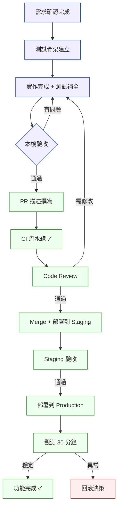

# 第 43 章｜從設計到上線:一個完整功能的實作全紀錄
## ⸺ 一條龍走一遍,才知道哪裡最容易斷

> **前置閱讀**:[第 18 章｜Pull Request 的拆分與描述](../part-04-collaboration/ch-18-pull-request.md)、[第 21 章｜CI/CD 流水線設計](../part-05-delivery/ch-21-cicd.md)、[第 26 章｜可觀測性落地](../part-06-operations/ch-26-observability.md)
> **下游章節**:[第 44 章｜一次生產事故的完整復盤](./ch-44-incident-postmortem.md)、[第 46 章｜判斷力的養成:當階梯被 AI 抽掉](./ch-46-cultivating-judgment.md)

## 43.1 共感現場:「功能做完了,然後呢?」

你可能也遇過這種時刻:需求評審通過了,設計稿確認了,技術方案也討論清楚了——然後你坐下來打開編輯器,卻突然發現,自己不太確定接下來應該按什麼順序走。

不是不會寫程式,不是不懂技術。而是從「設計確認」到「功能上線、觀測穩定」之間,有太多環節需要依序接起來,而這整條路從來沒有人完整帶你走過一遍。

小薇是 Stafflink 的一名後端工程師,加入公司大約一年半。她在一間做人資 SaaS 的新創工作,公司的主產品是幫企業管理員工的入職、請假、晉升申請,客戶從 50 人的小公司到 2000 人的中型企業都有。Stafflink 的技術棧以 Node.js(Express)搭配 PostgreSQL 17 為主,可觀測性(Observability)用 OpenTelemetry 1.x 串接 Grafana 雲端版本。

小薇在加入公司之前有三年的前端經驗,轉做後端之後學得很快,已經能獨立完成幾個中等規模的 API 開發任務。她平常寫程式碼的速度不慢——尤其在 AI 輔助工具普及之後,單純的「打字」環節已經不是她的瓶頸。但她有一個習慣:她把每個任務當成獨立的事情在做,學寫測試的時候學測試,學開 PR 的時候學 PR,學 Staging 驗收的時候學驗收——每件事分開學,學得都不錯,卻從來沒有人把它們串起來給她看過。

有一天她接到一個任務:在現有的「員工審核」模組裡,加上一條「部門主管可以批次駁回申請」的新路徑。需求不算複雜,PM 已經把驗收標準寫得很清楚,設計稿也確認了。她很快就進入了寫程式碼的狀態,幾個小時後本機跑通了,然後她打開 Slack 問我:「我寫完了,PR 要怎麼開?測試要寫到什麼程度?後端 merge 之後還需要做什麼嗎?」

她問的每一個問題單獨看都不難回答。但她真正的困惑是:這些環節的**順序**和**連結**,從來沒有人系統地告訴過她。她一直把每個環節當成獨立的任務在應付,而不是把它們看成一條首尾相連的鏈。

這一章,就是要把那條鏈完整地走一遍。

## 43.2 真正的問題:每個環節都懂,但連不起來

我們把這件事慢慢拆開。

小薇並不是不懂怎麼寫測試,也不是不知道 PR 描述要寫什麼。她在前面的章節裡都學過這些。但「學過某個環節」和「知道它在整條流程裡的位置」,是兩件不太一樣的事。

就像你可能很擅長煎蛋,也很擅長切菜,但如果沒有人告訴你做炒飯的順序,你還是會在該下蛋的時候猶豫——因為你不知道炒飯的脈絡是什麼,不知道每個動作是在為哪一步做準備。

工程師的功能實作也有同樣的問題。**每個環節都有人教,但整條鏈的節奏感,通常要摸索很久才能自然長出來。** 正因為節奏感要靠摸索,它就特別容易被「寫程式碼變快了」這件事掩蓋過去——在 AI 輔助編碼的現在,「寫程式碼」這個環節變得很快,快到讓人誤以為做完「寫」就等於做完「功能」。但真正的功能交付,在最後一行程式碼落下之後,至少還有一半的路要走;寫得快,只是讓這條路的起點提早出現,不代表路變短了。

換個角度看:小薇那天問我的三個問題——PR 怎麼開、測試要寫到什麼程度、merge 之後還需要做什麼——背後反映的是同一個缺口:她缺少的不是知識,而是**整條鏈的全局視角**。她知道每塊磁磚怎麼鋪,但沒有人給她看過整張地圖。

那麼問題來了:為什麼這種「知道磁磚、沒看過地圖」的困惑,不是小薇一個人的問題?原因很簡單——這種困惑在資歷一到三年的工程師身上極為普遍,不是他們不努力,而是環境很少給人機會「完整地走一次」:每次任務都有人在某個節點接手,或者出問題時有前輩幫忙兜底,自己反而沒有機會把全程走通一遍。沒走過整條路的人,自然畫不出地圖。

順著這個道理,這一章要做的事,就是把「讀懂需求→拆分測試骨架→實作→開 PR→Staging 驗收→上線觀測」這六個環節,用小薇那個真實功能串起來,讓你看清楚每個環節之間的**因果關係**:前一步為後一步準備了什麼,後一步依賴前一步留下了什麼。

## 43.3 一起做判斷:一條龍六步走

我們就用小薇那個「批次駁回申請」功能,一步一步走一遍。每一步我都會說清楚:這一步在做什麼判斷、留下什麼產物、為下一步準備了什麼。



### 43.3.1 第一步:讀懂,再動手

在第一行程式碼之前,要做的事只有一件:**把需求裡的隱性假設找出來。**

Stafflink 的需求說:「部門主管可以批次駁回最多 50 筆申請,並附上統一的駁回原因。」這句話看起來很清楚,但讀到這裡,需要在心裡問幾個問題:

- 「統一的駁回原因」是每筆都一樣,還是主管可以各自填?
- 如果批次處理到一半失敗(比如第 30 筆的狀態已被其他主管改掉),前面 29 筆是要回滾,還是保留?
- 50 筆上限是前端擋,還是後端也要驗證?
- 通知是同步還是非同步?如果駁回成功但通知失敗,整批算成功還是失敗?

這些問題不問清楚,寫出來的程式碼很可能方向是對的,但邊界是錯的。而邊界錯的程式碼,不是「差一點」,是要重寫——因為邊界假設通常會滲進整個實作的骨架裡,不是改幾行就能收尾。也就是說,不先問清楚,程式碼可能白寫;這就是為什麼第一步必須是問清楚,而不是先動手再說。

**為什麼邊界錯了的程式碼,比完全沒有程式碼更難處理?** 寫了兩天,發現「統一駁回原因」其實是每筆可以不同,這不是局部修改,這是核心邏輯要重來。更麻煩的是,測試已經按錯的方向寫了,改的時候要同時改兩套東西。反過來,花五分鐘問清楚這幾個問題,後面寫程式碼時的每個判斷都會更確定。

**讀懂的標準,不是「需求我看完了」,而是「我能說出這個功能在最壞情況下會發生什麼」。** 能說清楚最壞情況,就代表你對邊界有了足夠的理解,可以開始動手了。

把這些問題整理成確認清單,帶去跟 PM 或業務確認,是這一步的產物。需要五分鐘,能省掉幾天的來回修改。小薇在這一步確認了:統一駁回原因是每筆都套用同一條文字,部分失敗時整批回滾,上限 50 筆前後端都要驗證,通知非同步但失敗時要記錄在 dead-letter queue。

有了這些確認,下一步才站得穩。

### 43.3.2 第二步:拆分,建立測試的骨架

確認了邊界之後,下一步是把功能拆分成可以獨立測試的小塊,**同時為每一塊先寫下測試的骨架**——不是實作,是意圖。

以批次駁回為例,大概可以拆成三個關注點:
1. **驗證層**:批次數量不超過 50、申請狀態應為「待審」、主管有操作權限
2. **業務層**:把每筆申請狀態改成「駁回」、記錄駁回原因與操作者、確保整批在同一事務內
3. **通知層**:對每位申請人發出通知(非同步佇列),失敗時寫入 dead-letter queue

**為什麼先寫測試骨架能提升設計清晰度?** 這裡有一個很實際的原因:當你試著寫出「測試這個函式的方式」時,你會立刻發現介面設計得好不好。如果你要寫的測試是這樣:

```javascript
// 好的介面:清楚、可獨立測試
const result = await batchRejectService.reject({
  applicationIds: [1, 2, 3],
  reason: '不符合申請條件',
  operatorId: manager.id,
});
```

那這個介面測起來很自然——你可以分別測「ids 超過 50 筆的情況」「包含非待審狀態的情況」「operatorId 沒有權限的情況」,每一個測試清楚、獨立。

但如果你在寫測試骨架的時候發現,要測「部分失敗回滾」這件事,你需要 mock 整個 HTTP request 物件和資料庫連線,那就是設計有問題的訊號——因為這代表業務邏輯已經和 HTTP 框架的細節綁在一起,測試沒辦法脫離 HTTP 層獨立跑起來。也就是說,測試跑不獨立,反映的正是邏輯和介面沒有乾淨分離;業務邏輯不應該和 HTTP 層綁在一起,它應該是一段不管呼叫者是 HTTP、CLI 還是排程任務,都能直接呼叫、直接驗證的純粹邏輯。

**找到邊界 case 的迷你判斷框架**:有一個簡單的做法,把輸入參數從三個方向施壓:

| 方向 | 問法 | 批次駁回的例子 |
|------|------|--------------|
| **數量邊界** | 最少是多少?最多是多少?剛好在邊界上? | 0 筆、1 筆、50 筆、51 筆 |
| **狀態邊界** | 輸入資料的狀態可以是什麼?混合狀態呢? | 全部待審、混入已核准、混入已駁回 |
| **權限邊界** | 誰有權?誰沒有?跨部門呢? | 有權主管、無權主管、主管操作其他部門的申請 |

這張表不是要你每個格子都寫一個測試,而是讓你在動手之前心裡有個清單:這些情況我都想到了嗎?想到了的標個 ✓,沒想到的補進去。

**「寫完再補測試」和「先想好怎麼測再寫」,差別不在測試本身,而在設計的清晰度。** 先想好測試,往往會讓你寫出更乾淨的介面。這並不一定要嚴格遵循 TDD(Test-Driven Development)的紅綠重構循環,但至少在腦子裡跑一遍「我要怎麼驗證這個東西是對的」,而不是「寫完再說,測試一起補」。

測試骨架建立好之後,你手上有兩樣東西:清楚的介面輪廓,以及一份「什麼情況算正確、什麼情況算錯誤」的清單。帶著這兩樣東西去寫實作,比空著手動筆要穩得多。

### 43.3.3 第三步:實作,帶著判斷走

現在可以動手寫了。在這一步,最重要的判斷只有兩個:

**判斷一:這段邏輯放哪裡合適?**

批次駁回的「部分失敗要不要回滾」這件事,屬於業務規則,應該在服務層(Service Layer)處理,而不是分散在 Controller 或 Repository 裡。這個判斷不需要很複雜,只要問:「如果這個規則改了,我只需要改一個地方嗎?」是的話,位置就對了。

把批次回滾的事務邏輯集中在 `BatchRejectService` 裡,有一個具體的好處:六個月後如果業務規則改成「部分失敗時保留已成功的筆數,不整批回滾」,你只需要改這一個類別。如果邏輯散在 Controller 的多個地方,找到所有需要修改的位置就已經是一個麻煩事了。

**判斷二:這段程式碼三個月後的人讀得懂嗎?**

批次操作裡有一段要在同一個事務裡更新多筆記錄。這種寫法的意圖不會寫在程式碼的表面上——單看程式碼,很難猜到「為什麼一定要放在同一個 transaction 裡」,這一類細節在批次操作中特別容易被忽略。正因為如此,在這段的上方留一行有意義的註解——不是「// 更新申請狀態」(這等於沒說),而是「// 批次駁回應在同一 transaction 內,確保部分失敗時整批回滾,見 ADR-023」——有意圖、有背景、有指引。

順著這個思路往下,實作完成之後,把第二步建立的測試骨架補齊成完整的測試:正常流程、超過 50 筆上限、包含非「待審」狀態的申請、主管無權限的情況、事務回滾確認、通知佇列驗證。

下面是這一步的判斷清單:

| 判斷點 | 問法 | 批次駁回的答案 |
|--------|------|--------------|
| 邏輯分層 | 這個規則改了,改哪裡? | `BatchRejectService`,一個地方 |
| 可讀性 | 三個月後的人需要看 ADR 才懂嗎? | 是,所以在程式碼裡指向 ADR-023 |
| 測試完整性 | 邊界 case 都有測試覆蓋? | 是,按第②步的三方向清單 |
| 效能考量 | 50 筆的批次 UPDATE 在 PostgreSQL 17 的效能是否可接受? | 預估 < 200ms,Staging 要實測 |

### 43.3.4 第四步:開 PR,讓審查者省力

功能通過本機測試之後,是開 Pull Request 的時候了。這一步最容易被低估,因為大家往往覺得「測試過了就好,PR 描述隨便寫一下」。

但 PR 描述是你給審查者的地圖。一份好的 PR 描述要讓審查者在看第一行程式碼之前,就已經知道:這個功能在解決什麼問題、改了哪些地方、有哪些邊界 case 值得特別注意、測試覆蓋了哪些情境。

**為什麼 PR 描述要寫「為什麼」,不只是「做了什麼」?** 因為程式碼本身已經說明了「做了什麼」——審查者看程式碼就看得到。PR 描述裡真正有價值的資訊,是看程式碼看不到的:「為什麼選擇整批回滾而不是部分保留?」「為什麼通知是非同步而不是同步?」「這裡有個取捨,我選了 A 方案,是因為 B 方案在 X 情況下會有 Y 問題。」這些判斷的脈絡,只有你知道,不寫下來就消失了。

小薇的 PR,把「部分失敗的回滾行為」特別在描述裡說明,因為這是審查者看程式碼時最可能問「為什麼這樣寫」的地方。把「為什麼」寫在 PR 描述裡,比等到 code review 被問再解釋,快得多也清晰得多——審查者看完描述,心裡已經有了「這段我知道為什麼,可以快速確認」的底氣,審查速度會快很多。

**PR 的大小**:一個 PR 理想上應該只做一件事。批次駁回這個功能,如果還順手重構了舊的申請查詢 API,這兩件事應該分成兩個 PR。原因很簡單:審查者的注意力是有限的,一個 PR 做兩件事,出問題時也很難用 `git bisect` 精確定位。

### 43.3.5 第五步:Staging 驗收,用和線上一樣的眼光

CI 通過、code review 核准、merge 之後,功能會部署到 Staging 環境。很多工程師到這一步會覺得「OK 了,等 PM 驗就好」——但工程師自己的 Staging 驗收,和 PM 的功能驗收,看的是不同的東西。

PM 看的是「功能行為是否符合需求」,工程師要補看的是:
- **Log 有沒有正常輸出?** 批次操作的每個步驟有沒有被記錄?每筆申請的 `applicant_id`、`reason`、`operator_id` 都出現在 structured log 裡了嗎?
- **Metric 有沒有新的數字出現?** `batch_reject_count`、`batch_reject_size_p95`、`batch_reject_latency_p95` 這幾個 metric 在 Grafana 上看得到嗎?
- **邊界 case 在 Staging 上真的會怎樣?** 把 51 筆申請送進去,API 真的回 400 嗎?把一批包含一筆「已核准」狀態的申請送進去,整批真的回滾了嗎?

**Staging 驗收做得好,線上就少一半意外。** 這句話的邏輯很直接:Staging 和線上的差別,主要在流量和真實資料,而不在功能行為。如果功能行為在 Staging 上是對的,Log 和 Metric 都正常,邊界 case 的反應符合預期,那上線之後的意外空間就大幅縮小了。

這一步是在用「線上的眼光」看一個還沒上線的功能。用這個眼光做驗收,不是在給自己找麻煩,而是在把「上線後才發現的問題」提前到「Staging 就發現」。

### 43.3.6 第六步:上線後觀測 30 分鐘

功能部署到 Production 之後,不是「按下部署就結束了」。接下來的 30 分鐘,是整條流程裡最後、也最容易被跳過的一步。

要看的東西不多,就三個:
1. **Error Rate**:有沒有新的錯誤開始出現?基線是部署前的 5 分鐘平均值。
2. **Latency**:批次駁回的 API 回應時間 P95 在合理範圍內嗎?Stafflink 的批次操作設定的上限是 500ms。
3. **業務指標**:第一批真實的批次駁回成功了嗎?可以看 `batch_reject_count` 的 metric 有沒有開始計數。

**為什麼是 30 分鐘,不是 10 分鐘或 1 小時?** 30 分鐘這個數字來自實踐觀察:大多數因為邊界 case 或低頻路徑觸發的問題,在真實流量下會在前 15–20 分鐘內出現;等到 30 分鐘還沒有異常,通常代表這個功能的行為已經稱得上穩定。1 小時則往往太長,影響工程師後續工作排程的意願。

下面這張表整理了六個步驟的核心判準:

| 步驟 | 核心問題 | 產物 | 失敗時的動作 |
|------|---------|------|------------|
| **① 讀懂需求** | 邊界案例我說得清楚嗎? | 確認清單 | 去問 PM,別猜 |
| **② 拆分+測試骨架** | 我知道怎麼驗這個功能嗎? | 測試骨架 | 拆得更小,直到能說清楚 |
| **③ 實作** | 邏輯在對的層?可讀嗎? | PR-ready 的程式碼 | 重構,直到有人讀得懂 |
| **④ PR + CI** | 審查者有地圖了嗎? | 合格的 PR 描述 | 補描述,補測試 |
| **⑤ Staging 驗收** | Log/Metric/邊界都正常? | Staging 驗收紀錄 | 修正,重新部署 |
| **⑥ 上線觀測** | 30 分鐘內三個指標都穩? | 觀測紀錄 | 回滾或前向修復 |

## 43.4 容易絆倒的地方

走過這六步之後,有幾個地方是很多工程師最容易跌跤的,分享出來讓你下次遇到的時候心裡有個底。這幾個坑不是「不努力才會掉進去」——它們之所以常見,是因為每一個都有它看起來合理的理由。

**絆倒處一:「我已經測過了」但測的是理想路徑**

本機測試很容易只測「一切正常」的情況:50 筆以內、申請狀態都正確、主管有權限。但線上的使用者,會送 0 筆、會送 51 筆、會在批次進行中讓其中幾筆狀態改變。**把邊界 case 測過一遍,才算真的測完。**

**什麼時候會掉進這個坑?** 通常是在趕時間的時候——任務截止日快到了,或者有下一個任務在等。這時候很自然地會在「跑過正常路徑沒問題」之後就提 PR。另一個場景是「這個功能看起來很簡單」——簡單的功能反而讓人放鬆警戒,不覺得需要測邊界。批次駁回看起來不複雜,但「部分失敗回滾」這個邊界,如果沒有測試,上線後第一次觸發就是一次難看的事故。

> 修正方向:寫測試的時候,先把「什麼情況不該成功」列出來,每一條都要有對應的測試。這不是苦工,是保護自己的安全網。

**絆倒處二:PR 描述只寫「做了什麼」,沒有寫「為什麼」**

「新增批次駁回 API」——這句話帶的資訊量太少,審查者從標題和程式碼本身就已經看得出「做了什麼」;PR 描述真正有價值的是「為什麼這樣設計、有什麼取捨、要特別注意什麼」。

**什麼時候會掉進這個坑?** 最常見的是剛寫完程式碼、腦子裡還清楚自己做了什麼的時候——這時候覺得「描述不用太詳細,看程式碼就知道了」。但這個感覺有個盲點:你現在覺得清楚,是因為你剛做完,全部脈絡都在腦子裡。審查者沒有這個脈絡,三個月後的你自己也沒有。另一個常見場景是任務很急,覺得 PR 描述是「可以之後補」的東西——但 code review 結束之後,補描述的動力就消失了。

> 修正方向:每次開 PR 之前,在腦子裡問:「如果這個 PR 一年後被人翻出來,他能從描述裡看懂當初的脈絡嗎?」能的話,就夠了。

**絆倒處三:上線之後立刻關電腦**

這是最危險的習慣,因為很多問題不會在部署當下爆發,而是在真實使用者開始用的前 30 分鐘才出現。一個不起眼的邊界 case、一個在 Staging 沒有真實流量所以沒發現的 Latency,可能就在這 30 分鐘內讓功能變成事故的源頭。

**什麼時候會掉進這個坑?** 部署時間如果剛好在下班前、在會議之前,或者這個功能折騰了很久終於上了,那種「終於搞定了」的鬆一口氣,是最容易讓人直接關電腦的時刻。還有一個場景:PM 在旁邊說「沒問題了,你可以去忙別的了」——這句話的善意本意是讓工程師放鬆,但工程師的 30 分鐘觀測和 PM 的功能確認,看的是不同的層次。

> 修正方向:把「上線後觀測 30 分鐘」當成功能完成的一部分,不是加分選項。在行事曆上留好這 30 分鐘,或者告訴 PM「我需要先看 30 分鐘監控再去做下一件事」。

**絆倒處四:Staging 驗收交給 PM 就好**

PM 做的驗收是「功能對不對」,不是「工程行為正不正常」。Log 沒有輸出、Metric 沒有數字、邊界 case 在 Staging 上的行為從來沒有人看過——這些都是上線後意外的溫床。

**什麼時候會掉進這個坑?** 最常見是在「PM 動作很快」的團隊裡——功能一到 Staging,PM 馬上開始驗,工程師覺得「PM 在驗了,我去做下一件事」。但 PM 不會去 Grafana 看 metric 有沒有出現新的數字,也不會去 Kibana 看 structured log 的格式對不對。另一個場景是 Staging 環境比較不穩定——因為 Staging 偶爾會有環境問題,工程師有時候會對 Staging 的異常習以為常,少了一個本來應該有的 metric,可能就這樣過去了。

> 修正方向:在交給 PM 驗收之前,工程師自己先跑一次「工程驗收」:確認 Log 和 Metric 都在預期內,確認至少一個邊界 case 的行為和預期一致。

## 43.5 帶得走的工具 ⸺ 一頁式「功能交付紀錄卡」

把六個步驟濃縮成一張卡,讓你每次做新功能的時候,都能快速確認自己走到了哪裡、還缺哪一步。這張卡可以貼在 PR 描述裡,也可以當成 ticket 的 checklist。

```text
功能交付紀錄卡 ⸺ {功能名稱}
===================================================

【① 讀懂需求】
  - 邊界 case 已確認:{是/否,如否說明}
  - 最壞情況下的行為:{描述}
  - 需要 PM/業務確認的問題:{已確認 / 待確認:XXX}

【② 測試骨架】
  - 正常路徑:{描述}
  - 邊界 case(列舉 2–3 個):{列舉}
  - 預期的錯誤回應:{描述}

【③ 實作判斷】
  - 邏輯所在層:{Controller / Service / Repository / ...}
  - 最不直覺的一段:{說明這段在哪裡、為什麼這樣設計}
  - 是否有 ADR 或文件可以參照:{是/否}

【④ PR 描述】
  - 問題背景:{一句話說功能動機}
  - 主要改動:{列舉 3 個以內的關鍵改動}
  - 需要審查者特別注意:{點出 1–2 個關鍵地方}
  - 測試覆蓋了:{正常/邊界/錯誤路徑}

【⑤ Staging 驗收】
  - Log 正常:{是/否}
  - Metric 有數字:{是/否}
  - 邊界 case 在 Staging 行為符合預期:{是/否}
  - PM 驗收:{通過/待驗}

【⑥ 上線觀測(部署後 30 分鐘)】
  - Error Rate:{正常 / 異常:說明}
  - Latency P95:{數字} ms(基線:{數字} ms)
  - 第一批真實操作成功:{是/否}
  - 觀測結論:{穩定上線 / 需回滾 / 前向修復}
===================================================
```

這張卡為什麼只有六欄?因為每多一欄,填的人就少一個。六欄已經涵蓋了「最容易被跳過的關鍵判斷」,少一欄可能漏掉重要的環節,多一欄只是增加心理負擔。

### 43.5.1 範例:Stafflink 的批次駁回功能

讓我們回到小薇的那個任務。她最後用這張卡走完了整個流程,下面是她填的版本。

```text
功能交付紀錄卡 ⸺ 批次駁回員工申請(Stafflink v2.4)
===================================================

【① 讀懂需求】
  - 邊界 case 已確認:是
  - 最壞情況下的行為:批次中有申請已被其他主管審核,整批應部分失敗、已成功的回滾
  <!-- 為什麼這欄:「最壞情況」問的不是系統掛掉,而是業務邊界碰到了會怎樣。
       Stafflink 是多主管協作系統,同一申請可能被多人同時操作;
       沒想清楚這裡,部分失敗的處理就會不一致。 -->
  - 需要 PM/業務確認的問題:已確認——「統一駁回原因」指每筆都套用同一條文字

【② 測試骨架】
  - 正常路徑:50 筆以內且全部是「待審」狀態,全部成功駁回並發通知
  - 邊界 case:
      (a) 51 筆 → API 回 400,訊息說明超過上限
      (b) 包含 1 筆「已核准」狀態 → 整批回滾,回傳哪筆有問題
      (c) 主管對其中一筆無權限 → 整批駁回失敗,403
  - 預期的錯誤回應:400 超上限、403 無權限、409 部分狀態衝突

【③ 實作判斷】
  - 邏輯所在層:Service Layer(BatchRejectService)
  <!-- 為什麼這欄:批次回滾的事務邏輯如果散在 Controller 裡,
       日後改規則要找好幾個地方。Service 層讓這個業務規則只住在一個地方。 -->
  - 最不直覺的一段:同一 transaction 裡批次 UPDATE + INSERT(操作紀錄)
    原因:確保「駁回成功」和「紀錄寫入」不會分離;
          見 ADR-023(批次操作的原子性規範)
  - 是否有 ADR 可以參照:是,ADR-023

【④ PR 描述】
  - 問題背景:部門主管目前只能逐筆駁回申請,大批次操作效率極低
  - 主要改動:
      1. 新增 POST /api/v1/applications/batch-reject
      2. BatchRejectService 含事務回滾邏輯
      3. 非同步通知佇列加入批次駁回事件
  - 需要審查者特別注意:BatchRejectService 第 47–68 行的事務邊界設計
  <!-- 為什麼這欄:事務邊界是最難一眼看出意圖的地方;
       主動在 PR 描述裡指出來,能讓審查者把注意力放在真正重要的地方,
       而不是在不重要的細節上花時間。 -->
  - 測試覆蓋了:正常路徑 / 全部邊界 case / 事務回滾 / 通知佇列驗證

【⑤ Staging 驗收】
  - Log 正常:是(每筆申請駁回都有 structured log,含 applicant_id 與 reason)
  - Metric 有數字:是(batch_reject_count、batch_reject_size_p95 已出現在 Grafana)
  - 邊界 case 在 Staging 行為符合預期:是(51 筆確實回 400)
  - PM 驗收:通過

【⑥ 上線觀測(部署後 30 分鐘)】
  - Error Rate:正常(0 errors in first 30 min)
  - Latency P95:187 ms(基線:批次操作預期 < 500 ms)
  - 第一批真實操作成功:是(HR 部門第一筆 23 件批次駁回成功)
  - 觀測結論:穩定上線 ✓
===================================================
```

小薇後來跟我說,這張卡最有幫助的不是「提醒她做了哪些步驟」,而是在第①步逼她去確認「統一駁回原因」的語意——這件事如果沒問清楚,她寫的邏輯會是「每筆可以各自填原因」,和需求完全相反。

**這個決定為什麼重要?**

這裡值得多停一下思考。問清楚「統一駁回原因」只需要五分鐘,但如果在寫完兩天的程式碼之後才發現方向錯了,要改的不只是邏輯,還有已經按錯誤假設建立的測試、已經按錯誤語意寫的 PR 描述、以及已經在 Staging 上驗過的錯誤行為。

更深一層:這個問題如果在上線之後才發現(例如 PM 看到批次駁回的通知信上每筆都顯示同樣的文字,才發現需求沒被正確理解),那已經有真實使用者看到了不符合預期的結果。要修的不只是程式碼,還有客戶的信任。

一張交付紀錄卡的價值,不在於它的格式有多精緻,而在於它逼你在動手之前,把「這個功能我真的想清楚了嗎」這個問題問自己一遍。往往這一遍問下來,最重要的問題就會浮現——不一定是複雜的技術問題,更多時候是「我還沒問 PM 這件事」這種樸素的發現。

一張卡,一次問清楚,省掉的不只是時間,還有把做完的東西拆掉重來的心力。

## 43.6 本章回顧

讀完這一章,你應該已經能:

- [ ] 說出功能實作的六個環節,以及每個環節為下一步準備了什麼
- [ ] 在拿到需求時,先把「最壞情況下的行為」問清楚,再動手
- [ ] 用三個方向(數量/狀態/權限邊界)找出邊界 case,而不是只測理想路徑
- [ ] 開 PR 時,讓描述回答「為什麼這樣設計」,而不只是「做了什麼」
- [ ] 在 Staging 做工程驗收(Log/Metric/邊界 case),而不是交給 PM 就好
- [ ] 上線後留下來觀測 30 分鐘,把它當成功能完成的一部分

如果想先從一件事開始,可以試試——**下次開 PR 之前,在描述裡加上「需要審查者特別注意」這一段**,因為這個習慣會逼你回頭想清楚「這個 PR 裡最難讀懂的地方在哪裡」——而這個問題,剛好也是你自己 review 自己最好的方式。

走完六步之後,功能才算完成。這不是在給你加工作量——這是在幫你把那些「做完了但其實沒做完」的環節,一個一個補上去。走通一次,下次就快了。

## Cross-References

- **下一章**:[第 44 章｜一次生產事故的完整復盤](./ch-44-incident-postmortem.md) ⸺ 上線觀測的延伸:當觀測到了問題,接下來怎麼做
- **強連結**:[第 18 章｜Pull Request 的拆分與描述](../part-04-collaboration/ch-18-pull-request.md) ⸺ 本章第④步的詳細展開
- **強連結**:[第 21 章｜CI/CD 流水線設計](../part-05-delivery/ch-21-cicd.md) ⸺ CI 流水線在本章流程中的位置
- **強連結**:[第 26 章｜可觀測性落地](../part-06-operations/ch-26-observability.md) ⸺ 本章第⑤⑥步的技術基礎
- **強連結**:[第 46 章｜判斷力的養成](./ch-46-cultivating-judgment.md) ⸺ 本章六步其實是判斷力的一次完整演練
- **跨書連結**:[SA/SD Playbook](https://github.com/EddyKuo/sa-sd-playbook) ⸺ 本章接在「設計已確認」之後;設計高度的決策在 SA/SD 討論
