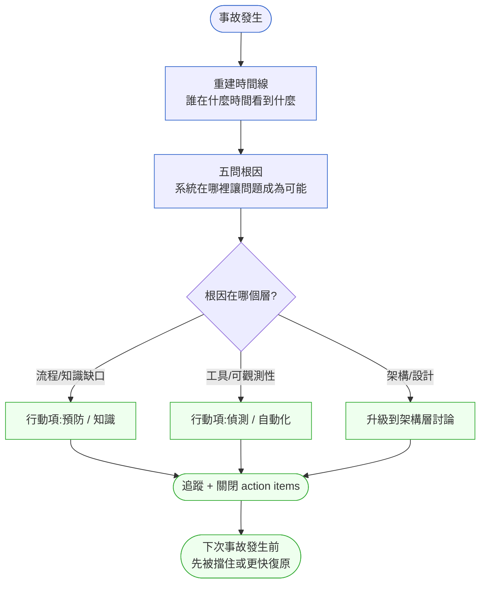

# 第 43 章｜一次生產事故的完整復盤
## ⸺ 從「誰的錯」到「我們學到了什麼」

> **前置閱讀**:[第 26 章｜從告警到根因:生產環境除錯](../part-06-operations/ch-26-alert-to-rootcause.md)、[第 28 章｜On-call 與事故處理(工程師視角)](../part-06-operations/ch-28-on-call.md)
> **後續章節**:[第 44 章｜接手 legacy 系統的 90 天計畫](./ch-44-legacy-90-days.md)、[第 45 章｜判斷力的養成](./ch-45-cultivating-judgment.md)

## 43.1 共感現場:那份你不確定該不該寫的復盤報告

你可能也遇過這樣的情況。

事故結束之後,工程師們開完緊急會議,系統回到正常,隊伍筋疲力竭。這時候有人提出:「我們要寫一份復盤(Postmortem)報告。」現場的氣氛頓時微妙起來——有人悄悄想:「這份報告是來找戰犯的嗎?那個 deploy 是我推的,我會不會被點名?」

這種擔心很正常。在很多團隊裡,「復盤」這兩個字幾乎等同於「追責」。結果大家寫報告的時候,措辭都變得小心翼翼,重要的細節被模糊掉,真正的原因被隱藏在「系統異常」四個字後面。這樣的報告讀起來沒有遺漏,卻也沒有抓住最有價值的洞察,下一次事故仍難以預防。

另一種極端是完全不寫。「我們已經知道問題在哪了,fix 也推了,繼續往前吧。」這句話背後的假設,其實是「這件事不會再發生」——可是沒有系統性地還原時間線、找到根因、定出行動項,同樣的問題幾乎一定會以稍微不同的面貌再出現。

順著這個道理,我們自然會問:有沒有一種復盤的做法,既不是追責,也不是敷衍了事,而是真正讓團隊從每一次事故裡往前走一步?

答案是有的。它有個名字,叫做**無咎復盤(Blameless Postmortem)**——而這一章,我們就一起把它從頭拆開來看。

## 43.2 真正的問題:事故的代價不只是停機時間

我們把那種「追責式復盤」的情況慢慢拆開,你會發現它其實同時帶來了兩個問題,而且這兩個問題加在一起,才是真正的麻煩。

**第一個問題:重要資訊消失了。** 當工程師擔心報告會讓自己被批評,他就不會如實描述「我當時的判斷過程」。事故最有價值的學習素材,恰恰就藏在那些判斷過程裡——為什麼某個人在那個當下做了那個決定?那個決定在當時的資訊條件下,其實是合理的。只有把這些細節還原出來,團隊才能看到「系統在哪個環節讓人陷入了錯誤的判斷」。

**第二個問題:問題根源沒有被觸及。** 當報告的結論是「工程師 A 操作失誤」,後續行動就會變成「下次要更小心」。可是「更小心」不是一個可以執行的系統改善——它只是把責任從系統的肩膀,換到人的肩膀上。等下次壓力大、睡眠不足的時候,同樣的人還是會犯同樣的錯,因為那個讓他容易犯錯的環境沒有改變。

也就是說,追責式復盤的根本問題在於:它**把人當成系統失敗的終點,而不是當成系統如何讓人失敗的線索**。

無咎復盤翻轉了這個視角。它的核心前提只有一個句話:「每一個人在當下的資訊條件下,都做了他能做的最好的決定。」這不是在說所有的決定都正確,而是在說:**我們的目標是找到讓好決定變難、讓壞決定變容易的系統環境,然後改掉它**——不是找到犯錯的人,然後懲罰他。

這就帶出了復盤最核心的兩個問題:一是「**事情到底是怎麼發展的?**」(時間線重建),二是「**為什麼系統讓這件事得以發生?**」(根因分析)。我們接下來一段一段來看。

## 43.3 一起做判斷:一次復盤怎麼做才完整

讓我以一個虛構案例帶你走過完整流程。這家公司叫 **Clearflow**,是一間做跨境匯款的 Fintech 新創,在台北和新加坡各有工程團隊。

### 43.3.1 事故背景:Clearflow 的那個週五下午

2026 年 3 月的某個週五,Clearflow 的新加坡工程師 Priya 在 14:30 推送了一個資料庫 migration,目的是在 `payments` 資料表上新增一個索引,提升大量查詢的效能。這個操作在測試環境跑得很快,Priya 沒有特別擔心。

可是生產環境的 `payments` 表有將近 4 千萬筆記錄。PostgreSQL 17 的預設 `CREATE INDEX` 在建立索引的過程中,會對整張表加**ShareLock**——它不阻擋讀取,卻**阻擋所有的寫入**。結果從 14:32 開始,所有的匯款申請都在等那把鎖,整個支付流程停擺了 23 分鐘,直到索引建完才恢復。

23 分鐘,對一間跨境支付公司來說,大約等於損失 90 萬台幣的交易手續費,以及更難量化的客戶信任。

這是 CASE-FIN-043 的起點。

### 43.3.2 第一步:重建時間線

復盤的第一件事不是討論誰的錯,而是盡可能精確地重建「事情是怎麼發生的」。時間線要細到分鐘,且要加上**每個人當時看到的資訊是什麼**。

```mermaid
gantt
  dateFormat HH:mm
  title Clearflow 事故時間線(14:30–15:00)
  section Priya(新加坡工程師)
  推送 migration  :milestone, m1, 14:30, 0m
  section 系統
  CREATE INDEX 鎖住寫入 :active, 14:32, 23m
  section 台北 on-call
  收到 P1 告警(支付失敗率 > 5%) :crit, 14:35, 5m
  嘗試 rollback — 無法(索引 DDL 不可逆轉) :crit, 14:40, 10m
  section 恢復
  索引建完、鎖釋放、服務恢復 :milestone, m2, 14:55, 0m
```



這份時間線透露了三件原本不明顯的事:
1. Priya 推送後的**三分鐘內**才開始出現告警——這三分鐘的空窗是「系統沒有對長時間 DDL 操作發出預警」造成的。
2. 台北 on-call 收到告警後,第一反應是嘗試 rollback,但 DDL 操作在 PostgreSQL 17 裡一旦開始就無法回滾,他們浪費了 5 分鐘。
3. 事後才有人發現 `CREATE INDEX CONCURRENTLY`(並發建索引)可以在不加 ShareLock 的情況下完成同樣的任務——這個選項從來沒有被寫進任何 runbook。

時間線的價值在於:它讓每個人的決定都回到「當時的資訊條件」下評估。

### 43.3.3 第二步:五問根因(5 Whys)

時間線告訴你「發生了什麼」,五問根因(5 Whys)幫你追「為什麼會發生」。關鍵是每問一個「為什麼」,都要往系統層面找答案,而不是往人身上找答案。

| 問 | 現象/答案 |
|---|---|
| **Why 1** | 為什麼支付服務停擺了 23 分鐘? | `payments` 資料表的寫入被 DDL 鎖住 |
| **Why 2** | 為什麼 DDL 鎖住了寫入? | `CREATE INDEX` 沒有使用 `CONCURRENTLY` 選項,對大表加了 ShareLock |
| **Why 3** | 為什麼沒有使用 `CONCURRENTLY`? | Migration 範本裡沒有提示這個選項;工程師不知道兩者的差別 |
| **Why 4** | 為什麼工程師不知道? | 沒有「大表 DDL 操作檢查清單」;PostgreSQL 的 DDL 鎖行為從未在 onboarding 或 runbook 裡被提及 |
| **Why 5** | 為什麼這些知識沒有被文件化? | 團隊把「新增索引」視為低風險的常規操作,沒有意識到它在大資料量下的行為不同 |

根因不是 Priya 不夠細心,而是:**知識存在個人腦袋裡,沒有轉化成系統檢查點**。這個根因,才能帶出真正可以行動的修正項。

### 43.3.4 第三步:定行動項(5W1H)

找到根因之後,行動項要具體到每一項都能放進下一個 sprint。模糊的「加強注意」不算行動項,能追蹤的任務才算。

| 行動項 | 類型 | 負責人 | 期限 |
|---|---|---|---|
| 在 migration 範本加入「大表索引操作」區塊,預設使用 `CONCURRENTLY` | 預防 | 台北 DBA 小馬 | W+1 |
| 補寫 runbook:DDL 操作中如何評估影響與應急步驟 | 知識 | Priya | W+2 |
| 在 CI pipeline 加入 schema change 靜態分析(如 `squawk`),偵測潛在的鎖風險 | 偵測 | DevOps 阿偉 | W+2 |
| 為生產環境長時間 DDL 操作加告警(執行超過 30 秒的 `pg_stat_activity` 查詢) | 偵測 | 阿偉 | W+1 |
| 在新人 onboarding 文件新增「PostgreSQL DDL 行為差異」段落 | 知識 | Priya + 小馬 | W+3 |

行動項分三種類型:
- **預防**:讓同樣的錯誤變難犯
- **偵測**:讓系統更快發現問題
- **知識**:讓下一個工程師不需要重新踩坑

三種行動項都到位,下一次類似的事情發生的機率才會真正降低。

### 43.3.5 復盤的整體判斷架構

把上面三個步驟用一張圖整理,你會看到一個清晰的脈絡:



這張圖有一個刻意的設計:它**沒有「找出誰做錯了」這個節點**。這不是說我們迴避責任,而是說在一個系統性的改善框架裡,「誰」從來不是最終答案——「什麼環境條件讓這件事得以發生」才是。

## 43.4 容易絆倒的地方

走過完整的流程之後,我想分享幾個在實際操作中很常見的絆倒點。這些地方很多人都踩過,所以分享出來,不是為了讓你覺得困難,而是讓你遇到的時候心裡有個底。

**絆倒處一:把五問根因停在「人」那一層。**

「因為工程師疏失」是五問根因的死胡同——你停在這裡就沒辦法再往下走了。每次根因指向「人」的時候,再多問一步:「什麼環境讓這個人容易做出這個決定?」

> **修正方向**:用這句話當過濾器——「如果換一個不同的人在同樣的條件下,他會不會做出同樣的決定?」如果答案是「很可能會」,那根因就在環境,不在個人;繼續往下問。

**絆倒處二:時間線寫得太粗,失去還原的價值。**

「下午兩點半到下午三點,系統異常」這樣的時間線幾乎沒有用。事故的關鍵細節常常藏在幾分鐘的粒度裡,而且那段時間的「人的判斷過程」跟「系統的反應」要分開記錄。

> **修正方向**:收集時間線的時候,明確區分「系統事件」(有 log 佐證)和「人的決策」(靠當事人口述)。前者精確到秒,後者精確到分鐘,都要記。不確定的地方,寫「約…」而不是省略。

**絆倒處三:行動項沒有指定人與截止日。**

「改善監控」「加強文件」是最常見的偽行動項——它聽起來正確,但沒有人知道誰來做、什麼時候完成、完成的標準是什麼。復盤會結束之後,這些項目就默默消失了。

> **修正方向**:每個行動項都要有一個具體的「**完成長什麼樣子**」描述。「加強監控」不算;「在 `pg_stat_activity` 查詢 > 30 秒時觸發 PagerDuty 告警,並在下週五前完成測試」才算。

**絆倒處四:復盤會議變成批鬥會。**

就算大家都知道無咎文化的理念,在壓力大、客戶在催、老闆在旁邊的情況下,會議很容易滑向「你當時為什麼這樣做」的審問語氣。一旦氛圍變了,當事人就會開始防衛,重要資訊就消失了。

> **修正方向**:復盤主持人(Facilitator)在開場就明說兩件事:「今天沒有咎責」,以及「每個人當下的決定都是基於他看到的資訊;我們的目標是讓系統下次給出更好的資訊」。這兩句話在開始說,比在問題出現後再補救有效得多。

## 43.5 帶得走的工具 ⸺ 一頁式「事故復盤報告」

好的復盤報告有一個很重要的特質:它的讀者不只是這次參與事故的人,還包括**三個月後完全不知道這件事的新同事**。所以它要寫得讓外人也看得懂,不要預設讀者知道背景。

下面是空白模板。一份報告通常一到兩頁就夠了;超過兩頁反而會讓人不想讀。

```text
事故復盤報告 ⸺ {事故代號 / 日期}

=====================================
【摘要】
- 影響範圍:{受影響的服務、功能}
- 影響時長:{開始時間} → {結束時間}(共 {X} 分鐘)
- 嚴重度:{P1 / P2 / P3}
- 影響到的用戶數或交易量:{具體數字或估算}

=====================================
【時間線】(精確到分鐘;系統事件與人的決策分開標示)

{HH:MM}  [系統] {發生了什麼}
{HH:MM}  [決策] {誰}做了{什麼決定},當時看到的資訊是{什麼}
{HH:MM}  [系統] {系統的反應}
... (依時序展開)

=====================================
【根因分析】(五問根因,每個 Why 都往系統找答案)

Why 1: {現象} → {答案}
Why 2: {接續上一答案} → {答案}
Why 3: ... → ...
Why 4: ... → ...
Why 5: ... → {根本原因}

根本原因摘要:{一句話}

=====================================
【行動項】

| 類型       | 行動描述                | 負責人 | 期限  | 狀態  |
|-----------|------------------------|-------|------|------|
| 預防       | {具體可量化的改動}        | {人名} | {日期} | Open |
| 偵測       | {具體可量化的改動}        | {人名} | {日期} | Open |
| 知識       | {文件/訓練/onboarding}  | {人名} | {日期} | Open |

=====================================
【我們學到了什麼】(給未來的人讀)

{1–3 句話:下次面對類似情況的工程師,最應該知道的一件事}
```

為什麼是這幾個欄位?因為一份好的復盤報告要回答三個讀者的問題:管理層想看「**範圍與代價**」(摘要);當事工程師與 on-call 想看「**事情是怎麼發展的**」(時間線);未來的工程師想看「**怎麼讓這件事不再發生**」(行動項 + 我們學到了什麼)。少掉任何一欄,都會有一個讀者看了報告但帶不走東西。

### 43.5.1 範例:Clearflow 跨境支付阻斷事故(CASE-FIN-043)

我們回到 Clearflow 那次事故。如果當天復盤報告是這樣寫的,三個月後接手 on-call 的新同事就不需要在事故中重新學到「`CREATE INDEX CONCURRENTLY` 的存在」這件事了:

```text
事故復盤報告 ⸺ INC-2026-0314 / 2026-03-14

=====================================
【摘要】
- 影響範圍:Clearflow 跨境匯款申請(全線)
- 影響時長:14:32 → 14:55(共 23 分鐘)
<!-- 為什麼這欄:精確的時長讓讀者能評估商業影響,也讓下次定義「可接受的停機時間」有基準。
     寫「約半小時」等於丟失了議價空間。 -->
- 嚴重度:P1(支付核心功能完全不可用)
- 影響量:約 340 筆匯款申請未能即時處理,預估損失手續費 NT$90 萬

=====================================
【時間線】

14:30  [決策] Priya 在生產環境推送 migration:在 payments 資料表新增索引
14:32  [系統] PostgreSQL 17 開始執行 CREATE INDEX,對 payments 表加 ShareLock
        ⤷ Priya 當時看到的資訊:測試環境(約 5 萬筆)執行 < 2 秒,判斷低風險
14:32  [系統] 所有匯款申請(需寫入 payments 表)開始等待鎖釋放
14:35  [系統] 告警觸發:支付失敗率超過 5% → PagerDuty 通知台北 on-call 阿偉
<!-- 為什麼這欄:從問題發生(14:32)到告警(14:35)有 3 分鐘空窗。
     這個空窗正是「沒有 DDL 長時間操作告警」的系統缺陷,是後續行動項的直接依據。 -->
14:38  [決策] 阿偉嘗試 rollback migration → 失敗
        ⤷ 阿偉當時看到的資訊:support 開始有客訴進來;他不知道 DDL 一旦開始就無法回滾
14:40  [決策] 阿偉判斷只能等索引建完,通知 PM 並準備客服回覆
14:55  [系統] 索引建立完成,ShareLock 釋放,匯款服務恢復正常
14:58  [決策] 阿偉確認服務正常,降級為 P2 後關閉 P1 事故

=====================================
【根因分析】

Why 1: 為什麼匯款服務停擺 23 分鐘?
        → payments 資料表的所有寫入被 PostgreSQL ShareLock 阻擋
Why 2: 為什麼 ShareLock 持續了 23 分鐘?
        → 對 3,800 萬筆記錄的大表執行 CREATE INDEX(非 CONCURRENTLY 版本)
Why 3: 為什麼沒有使用 CONCURRENTLY?
        → Migration 範本與 runbook 未提示此選項;Priya 不知道兩者鎖行為不同
Why 4: 為什麼這個知識沒有被文件化?
        → 「新增索引」在團隊認知中屬於低風險操作,從未在 onboarding 或 runbook 中特別說明
Why 5: 為什麼大表 DDL 的特殊行為從未被提及?
        → 過去的索引操作都在小表上,沒有人因此踩到過;知識從未被「外顯化」

根本原因摘要:大表 DDL 操作的鎖行為是隱性知識,存在個人腦袋裡而未轉化為系統性檢查點。
<!-- 為什麼這欄:根本原因要一句話說完,方便管理層閱讀,也讓行動項的方向一看就清楚。
     太長的根因描述反而讓讀者失焦。 -->

=====================================
【行動項】

| 類型 | 行動描述                                          | 負責人 | 期限     | 狀態  |
|------|--------------------------------------------------|-------|----------|------|
| 預防 | migration 範本新增「大表索引」區塊,預設 CONCURRENTLY | 小馬  | 2026-03-21 | Open |
| 預防 | CI 加入 squawk 靜態分析,偵測潛在 DDL 鎖風險        | 阿偉  | 2026-03-21 | Open |
| 偵測 | 生產環境 pg_stat_activity 查詢 > 30 秒觸發告警      | 阿偉  | 2026-03-21 | Open |
| 知識 | runbook 新增「DDL 操作中止與評估」段落              | Priya | 2026-03-28 | Open |
| 知識 | onboarding 文件新增 PostgreSQL DDL 行為差異說明    | Priya + 小馬 | 2026-04-04 | Open |

=====================================
【我們學到了什麼】

PostgreSQL 的 CREATE INDEX 在大表上會加 ShareLock,阻擋所有寫入。
改用 CREATE INDEX CONCURRENTLY 可以在不阻擋寫入的情況下完成索引建立,
代價是執行時間更長、且不能在 transaction 內使用。
任何在 1,000 萬筆以上資料表的 DDL 操作,建議先查 pg_class 確認資料量,
並在 migration review 時額外確認鎖行為。
```

這份報告有一個細節值得注意:「我們學到了什麼」那一段,不是在重複根因,而是直接把「下一個工程師在類似情況下最應該知道的一件事」寫出來。這樣三個月後接手 on-call 的人,讀這一段就夠了——不需要把整份報告讀完才能獲得最核心的教訓。

## 43.6 本章回顧

讀完這一章,你應該已經能:

- [ ] 解釋無咎復盤(Blameless Postmortem)和追責式復盤的核心差異,以及為什麼前者能帶出更有效的系統改善
- [ ] 重建一條有效的事故時間線,區分「系統事件」和「人的決策」,並把每個決定還原到當時的資訊條件下評估
- [ ] 用五問根因(5 Whys)追出問題的系統性根因,而不是停在「人的疏失」那一層
- [ ] 寫出具備「負責人、截止日、完成標準」的可追蹤行動項
- [ ] 完成一份讓外人也看得懂的一頁式復盤報告

如果想先從一件事開始,我會建議 ⸺**下一次有事故的時候,先做時間線重建就好**。先別急著找根因或開會討論,花三十分鐘把「誰在什麼時間看到什麼、做了什麼決定」按時序寫下來。這張時間線本身,就會開始讓很多事情變得清晰——根因、知識缺口、改善方向,往往都藏在那些細節裡。

---

## Cross-References

- **前章**:[第 42 章｜從設計到上線:一個完整功能的實作全紀錄](./ch-42-feature-end-to-end.md) ⸺ 功能走完全流程之後,下一步是從出錯的事故裡學習
- **下一章**:[第 44 章｜接手 legacy 系統的 90 天計畫](./ch-44-legacy-90-days.md) ⸺ 接手系統時,過去的事故報告是最重要的第一手資料
- **強連結**:[第 26 章｜從告警到根因:生產環境除錯](../part-06-operations/ch-26-alert-to-rootcause.md) ⸺ 除錯方法論是時間線重建的前置技能
- **強連結**:[第 28 章｜On-call 與事故處理(工程師視角)](../part-06-operations/ch-28-on-call.md) ⸺ 事故處理的現場操作,與復盤形成完整閉環
- **強連結**:[第 45 章｜判斷力的養成](./ch-45-cultivating-judgment.md) ⸺ 復盤是刻意養成判斷力最有效的機制之一
- **跨書連結**:[SA/SD Playbook Ch 27](https://github.com/EddyKuo/sa-sd-playbook) ⸺ 可觀測性設計,讓時間線重建有資料佐證
