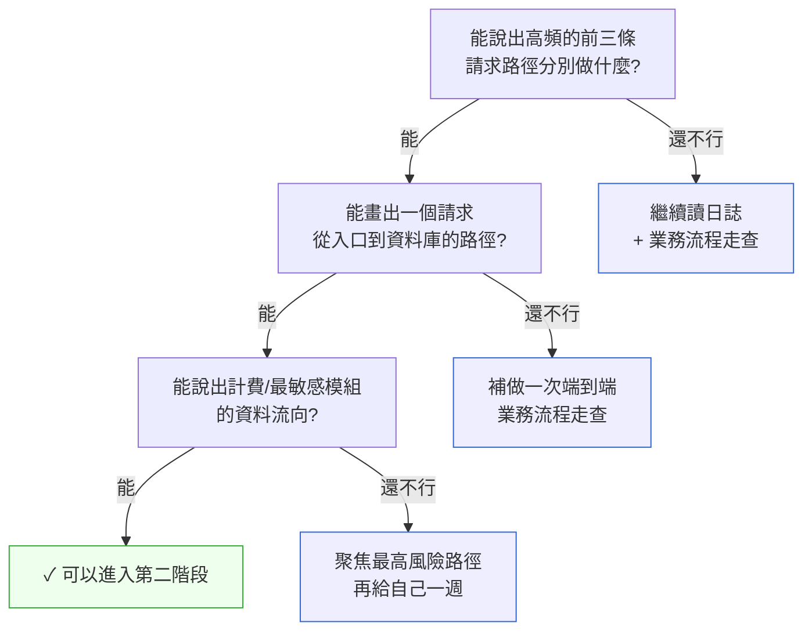
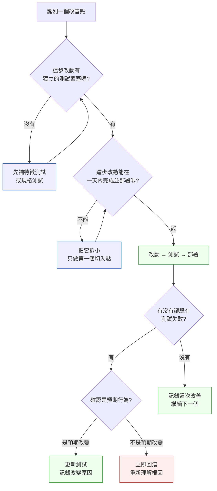

# 第 44 章｜接手 legacy 系統的 90 天計畫
## ⸺ 先讀懂它在解決什麼問題,再談要不要改

> **前置閱讀**:[第 2 章｜讀懂一份陌生程式碼](../part-01-foundations/ch-02-reading-unfamiliar-code.md)、[第 8 章｜重構的時機與安全網](../part-02-craft/ch-08-refactoring.md)
> **下游章節**:[第 45 章｜判斷力的養成:當階梯被 AI 抽掉](./ch-45-cultivating-judgment.md)、[第 26 章｜從告警到根因:生產環境除錯](../part-06-operations/ch-26-alert-to-rootcause.md)

## 44.1 共感現場:那第一天的感受

你可能也有過這樣的開始。

新工作第一週,主管把你帶到一個 Git 倉庫前面,說:「這個系統跑了七年,你先熟悉一下。」然後他就去開會了。

你打開 README,發現它上次更新在三年前。你嘗試在本機把服務跑起來,卡了一個下午,才搞懂有一個環境變數從來沒被記在文件裡。你打開主要的 service 檔案,裡面有一個叫做 `processData` 的函式,長達四百行,摻雜著 SQL、商業邏輯、還有一段被 `if False` 包住的程式碼,旁邊的註解只寫著「TODO: remove」——日期是 2021 年。

那種感覺,很多工程師都遇過。不是驚慌,不是憤怒,而是一種說不太清楚的茫然——「我從哪裡開始?我能動什麼?我要怎麼讓主管覺得我在有意義地推進?」

這不是你的問題,也不是前任工程師的問題。系統在七年間活下來、一直在跑,代表它確實在解決真實的問題,只是解決問題的過程裡,留下了一些當時來不及整理的痕跡。

讓我帶你認識一個人,我們就叫她小敏。她是新加入一家醫療 SaaS 公司 MedLink 的工程師,負責接手一套電子病歷(EMR)的舊系統(CASE-HCR-044)。這套系統用 PHP 5.6 寫成,撐著大約四十家診所的每日業務。沒有任何自動化測試。每次改動都靠人工回歸測試,上一次跑完回歸要兩週。

她的主管交辦時說了一句話:「三個月後,讓我知道我們能不能安全地動它。」

這一章,就從小敏的第一天開始。我們一起把這三個月想清楚。

## 44.2 真正的問題:「大重寫」為什麼幾乎都是陷阱

接手 legacy 系統時,許多工程師的第一反應是:「這個應該重寫。」

這個念頭很自然,也很可以理解。程式碼陳舊、沒有測試、架構不清晰——感覺重寫一次比較快、比較乾淨。但我們先把這個念頭輕輕放一旁,問一個更根本的問題:**它目前在解決什麼問題?你讀懂了嗎?**

你很快會發現,一個能跑七年的系統,通常積累了大量你在程式碼裡看不到的東西——業務邊界、客戶特例、錯誤恢復邏輯、歷史上某次事故後加的防護。這些東西不是壞程式碼,它們是時間的沉積。重寫等於把這些隱性知識全部清空,然後靠猜測把它們一一重建。Joel Spolsky 在 2000 年就寫過那篇《Things You Should Never Do》,說的正是這件事——雖然年代久遠,但觀察至今仍然準確:**程式碼裡最難讀懂的那些地方,通常就是當年最用力解決問題的地方。**

也就是說,真正的問題不是「怎麼重寫它」,而是兩件事:

1. **讀懂它在解決什麼**(沒有讀懂之前,你不知道哪裡能動、哪裡不能動)
2. **建立安全網讓你能安全地改**(沒有安全網,任何改動都是賭注)

這兩件事有嚴格的順序關係。如果跳過第一件直接做第二件,你不知道要在哪裡建安全網;如果跳過第二件直接「漸進改善」,你每次改動都是閉著眼睛走在懸崖邊。

正因為這兩件事必須依序完成,我們自然得到一個三階段的結構:不是「重寫計畫」,而是**90 天的漸進理解計畫**。第一個月讀懂、第二個月建安全網、第三個月開始漸進改善。每個階段有明確的出口條件,在條件達到之前不往下走。

這聽起來好像比較慢——實際上它比大重寫快得多。大重寫的週期通常以年計,過程中生產環境繼續長大、繼續分岔,等你的新版本準備上線,它已經和生產環境脫節了。

## 44.3 一起做判斷:90 天的三個階段

### 44.3.1 第一個月:讀懂它

這個階段的目標很具體:在 30 天結束時,你要能畫出一張數據流圖,說明「一個請求從進來到出去,經過了哪些元件」。能畫出這張圖,代表你已經具備了「知道哪裡能動、哪裡不能動」的基本判斷能力。

這聽起來好像很基本,但你會發現做起來遠比想像中花時間——因為這份理解不是來自讀文件,而是來自讀行為。文件描述的是意圖,行為才是事實。

**幾個有效的切入方式,可以根據你的情況選擇組合:**

**第一,從日誌(log)開始,不從程式碼開始。** 生產環境的日誌告訴你系統實際在做什麼,比程式碼的意圖可靠得多。先看最頻繁的請求路徑,理解「90% 的時間系統在做什麼」。知道了高頻路徑,你就知道讀程式碼時應該花最多時間在哪裡。

**第二,找到最老的 commit,往前讀。** 早期 commit 通常比較小、也比較說明意圖。順著歷史讀,你會看到系統是怎麼被需求一步一步推著長大的。遇到一個「為什麼這裡有這段邏輯」的困惑,去找這行程式碼是什麼時候被加進來的,往往就能找到答案。

**第三,跟著一個真實的業務流程走一遍。** 小敏做的事是:假裝自己是診所護士,從建立病患資料開始,一步一步走到開立處方單、列印,全程看著 network tab 和 PHP 的 error log。這樣走一遍,比讀一週程式碼更快理解系統邊界。你會看到哪些步驟觸發了哪些 API、哪些 API 寫了哪些表——這是任何文件都不會告訴你的活的地圖。

**第四,建立一份「不懂清單」。** 每次看到一段程式碼「不知道為什麼這樣寫」,記下來,不要現在花時間追。這份清單到月底會是你最有價值的資產:哪些你後來看懂了、哪些還沒懂、哪些你懷疑是歷史錯誤。它幫你把「混沌感」轉成「待確認的具體疑問」,心理上輕鬆很多。

這個階段**不做任何改動**。所有的修改衝動,記在筆記本裡就好——第三個月用得上,但現在不是時候。

**出口條件的自我評估:你準備好了嗎?**

很多人卡在第一個月出不來,不是因為還沒讀懂,而是因為沒有具體的「我讀懂了」標準。下面這個小圖幫你自我評估:



> 這三個問題不需要答得完美,但你要能「說得出來」——哪怕是「這段邏輯大概是這樣,但我有一個地方還不確定」。能說出不確定在哪裡,代表你已經知道哪裡還需要繼續探索,這就夠了。

### 44.3.2 第 31–60 天:建立安全網

讀懂之後,你才知道哪些地方最重要、最容易出事。現在要做的是在那些地方加上測試,讓你未來的改動有依靠。

這個階段有一個常見的誤解需要先澄清:不是要把整個系統都補上測試才能改。那樣的目標會讓人永遠開始不了。正確的做法是**特徵測試(Characterization Test)**——也就是「把系統現在的行為記錄下來,不管它對不對」。

特徵測試的目的不是驗證正確性,而是讓你知道**哪裡的行為因為你的改動而改變了**。一旦改動讓測試失敗,你就知道你碰到了什麼;如果你確認那個改變是預期的,再更新測試。這是 Michael Feathers 在《Working Effectively with Legacy Code》(2004)裡提出的核心工具之一,對於沒有測試的遺留系統特別有效。

```python
# 特徵測試的最簡精神範例(Python 3.x)
# 不問「這輸出對不對」,只記錄「現在輸出什麼」

def test_calculate_medication_dosage_characterization():
    """
    這不是規格測試,而是對現有行為的快照。
    如果這個輸出變了,代表你的改動影響了這段邏輯,要停下來確認。
    """
    result = calculate_medication_dosage(
        weight_kg=70.0, drug_code="MET-500", frequency="TID"
    )
    # 先記錄現在的輸出,不管我們是否同意它的計算方式
    assert result == {"dose_mg": 500.0, "times_per_day": 3, "total_mg_day": 1500.0}
```

**特徵測試要測哪裡?判斷「高風險路徑」的三個維度**

這是第二階段裡最需要判斷力的問題,值得仔細說。「高風險」不是感覺,它由三個維度決定:

**維度一:使用頻率。** 每天會被呼叫幾千次的路徑,一旦出問題影響最廣。高頻路徑應該最優先。

**維度二:業務損失敏感度。** 計費、帳單、診療記錄、庫存扣減——這些出錯直接影響到金錢或安全,比「用戶偏好設定」出錯嚴重得多。你在第一階段的「不懂清單」和業務流程走查,會幫你知道哪裡最敏感。

**維度三:外部介面耦合度。** 和外部系統(API、第三方服務、排程作業)有介面的地方,改動波及範圍不只是你自己的系統,風險乘數更高。

把這三個維度綜合起來,下面的決策表幫你做優先順序:

| 使用頻率 | 業務損失敏感度 | 外部介面耦合 | 優先順序 | 行動 |
|---|---|---|---|---|
| 高頻 | 高敏感 | 有耦合 | ⭐⭐⭐ 最優先 | 先加特徵測試,再談是否改 |
| 高頻 | 高敏感 | 無耦合 | ⭐⭐⭐ 最優先 | 先加特徵測試,可以比較放心改 |
| 高頻 | 低敏感 | 任意 | ⭐⭐ 次優先 | 加測試後可逐步改善 |
| 低頻 | 高敏感 | 有耦合 | ⭐⭐ 次優先 | 加測試,改之前要特別小心 |
| 低頻 | 低敏感 | 任意 | ⭐ 最後處理 | 可以放到第三階段或更後面 |

「高風險」的判斷依據,是第一階段讀懂系統後你對系統的認識:哪些地方改壞了會影響最多用戶?哪些地方和外部系統有介面?哪些地方的商業規則最複雜?

小敏在這個階段做的事情,是替診所最核心的三條路徑加上了特徵測試:建立病患、開立處方、查詢用藥記錄。光是這三條路徑的測試覆蓋,就讓她下一個月的改動有了基本的安全感。她沒有試圖覆蓋整個系統——她選擇把力氣放在最值得的地方。

**第二階段結束時,你應該能說的話:**「我知道核心的 N 條路徑現在的行為是什麼。如果我的改動讓任何一條失敗,我會立刻知道。」

### 44.3.3 第 61–90 天:漸進改善

有了對系統的理解、有了安全網,現在才是開始動手的時候。這三個字說起來容易,但「漸進」的節奏控制是最容易走歪的地方——讓我們把它說清楚。

**原則一:每一步改動必須有對應的測試覆蓋,才能動手。**

你可能會遇到一個想改善的地方,但目前沒有測試覆蓋。正確做法是:先補測試,再改。不要跳過這個步驟,即使你覺得那個改動「很安全」。感覺安全和實際安全是兩件事。

**原則二:每一步改動要能在一天內完成並部署。**

如果一個改善點需要超過一天,你需要把它拆小。不是因為你能力不夠,而是因為一個改動停在半途的狀態是最危險的——你沒有完全改好,測試也還沒更新,這時候如果出了生產事故,你不知道是新的改動還是舊的問題。

**原則三:每一步改動要可以單獨回滾。**

這不只是技術上的回滾,也包括:每一個改動是否小到你能在心裡把它反向解釋?如果你的 PR 一次改了三十個地方,出事時你根本不知道是哪個改動造成的。

下面這張決策流程圖把第三階段的節奏畫出來。它不是流程圖的裝飾,而是你每次要動手前應該真正走一遍的決策路徑:



> **第三階段決策流程**:這張圖代表「Phase 3:漸進改善」的每一步決策關卡。兩個核心出口條件——「有測試才動手」與「能一天完成才進行」——構成了讓這個階段安全推進的節奏保障。

**什麼是「有獨立的測試覆蓋」?一個具體例子**

Node B 的判斷——「這步改動有獨立的測試覆蓋嗎?」——初次看到可能有點抽象。讓我用小敏的例子說清楚。

假設她要把 `processData()` 裡的費用計算邏輯抽成獨立函式 `calculateBillingAmount()`。「有獨立的測試覆蓋」的意思是:在你進行這個抽取之前,你的測試套件裡已經有測試案例,是**專門針對費用計算邏輯**的——也就是說,如果費用計算的結果變了,測試會失敗,和 `processData()` 裡的其他邏輯無關。

如果你只有一個針對 `processData()` 整個函式的測試,它同時測了「建立病患」和「計算費用」這兩件事,那就不算「獨立覆蓋費用計算」——因為你無法確認是哪個改動讓它失敗。你需要先補一個**只測費用計算路徑**的特徵測試,再來抽取。

**漸進改善的方向要跟著問題走,不是跟著審美走。**

你覺得某段程式碼「讀起來很醜」,但如果它沒有在影響任何人,它就不是第一優先。真正值得在第 61–90 天投入的,是那些在前兩個階段發現的、**正在讓系統容易出事或讓下一個改動困難的地方**。小敏選擇先拆分 `processData()` 的計費部分,不是因為它最醜,而是因為它讓每一個後續計費相關的改動都必須在四百行裡找路——那個摩擦才是真正在拖慢整個團隊的東西。

## 44.4 容易絆倒的地方

這個旅程裡有幾個很常見的彎道,很多人都在這裡慢下來了。了解它們,遇到的時候比較不會慌——這些地方沒有什麼特別的技術難度,但需要提前知道它的存在才能繞過去。

**絆倒處一:第一週就想重寫。**

當你看到程式碼很混亂,想「不如重寫吧」的念頭很正常。它代表你有想要改善系統的熱情,這是好事。但在你讀懂它之前,你根本不知道重寫要寫什麼——你重寫的,只是你眼睛看到的那一層,而不是系統實際在做的那一層。

一個真實的情況是:小敏的前任工程師曾經試圖重寫計費模組。他花了三個月重寫了一個「更乾淨」的版本,但上線之後馬上發現有兩種特殊計費情境沒有被處理——那兩種情境在舊程式碼裡各自有一段「看起來怪怪的 if」在處理,他以為是 bug 就刪掉了。事實上那兩個 if 是客戶要求的特例邏輯。

> **修正方向**:把「想重寫」記在筆記本裡,等第一個月結束時再看。很多情況下,你讀懂之後反而會理解某些設計的由來,重寫的衝動自然就降低了;真的需要重寫的地方,到時候你也會知道為什麼。即使最終還是要重寫,那也是「帶著理解的重寫」,而不是「帶著假設的重寫」。

**絆倒處二:測試加在「最容易測」的地方,而不是「最重要」的地方。**

有時候我們會挑那些「好寫測試」的工具函式先加測試,因為快、成就感高。但工具函式通常不是最危險的地方。更常見的情況是:有人把前兩週全花在替一堆格式化工具函式加測試,然後第三週要改核心業務邏輯時,發現那裡還是一片裸露。

這個誤區背後的心理是:我們都想要有「具體進展」的感覺,而補工具函式的測試確實能快速累積測試數量。但測試的數量不是目標,**保護最要緊的地方**才是目標。

> **修正方向**:回頭看第一階段的筆記——哪些地方如果出錯,明天就會有診所打來投訴?從那裡開始建立安全網。好的特徵測試不是寫起來最快的測試,是防護最要緊地方的測試。如果你不確定哪裡最要緊,第一階段的業務流程走查應該已經告訴你了。

**絆倒處三:把「理解階段」的時間壓縮,急著早點開始改。**

受到「儘快貢獻」的壓力,跳過第一個月的讀懂階段,直接進去改。結果改了一個地方,另外兩個意想不到的地方壞掉了。

這個壓力來自兩個方向:一個是外部的(主管期待你很快就能產出),一個是內部的(工程師天生想要「做事」,而不只是「讀東西」)。但提早動手帶來的代價往往是:改壞了一個地方、追查了兩天才找到根因、重建信心又花了一週——加起來比多用兩週「讀懂」更慢。

> **修正方向**:前三十天輸出的是理解,不是功能。主管看到的不是程式碼行數,是你三十天後能畫出那張數據流圖,並且說清楚「哪些地方我現在不敢碰、哪些地方我準備好了」——這才是交付。把這個邏輯和主管同步,通常他們都能接受。事先同步「第一個月的產出是理解而不是功能」,比事後解釋「我為什麼沒有改到什麼東西」要容易得多。

**絆倒處四:特徵測試通過就以為行為正確。**

特徵測試只是「快照現在的行為」,不是「驗證行為是對的」。如果現在的系統有個計算 bug,特徵測試會忠實記錄那個 bug 的輸出——你的測試通過了,但 bug 還在。

這個誤解很危險,因為它會給你一種「這裡有測試,所以安全」的假象。小敏曾經在第二階段結束時跟主管說「計費路徑現在有測試了」,主管問「你確定計費是算對的嗎?」——她愣了一下,才意識到特徵測試和「計費算法正確」是兩件不同的事。

> **修正方向**:特徵測試和業務規格測試是不同層次的工具。在重要的商業邏輯上,等你理解規格之後,要另外補上基於規格的測試,明確寫出「這個輸出為什麼是對的」。特徵測試是安全網,讓你知道行為有沒有因為改動而改變;規格測試是品質保證,讓你知道行為是不是本來就應該如此。兩個都需要,缺一不可。

**絆倒處五:第三階段的「漸進改善」變成「批量改善」。**

進入第三階段之後,積累了很多想法,容易一次推出一個大 PR,改了很多地方。這很常見——兩個月的觀察積累了一份長長的筆記,終於可以動手,一時熱情就全部倒進去了。

結果是:這個 PR review 很難,因為改動太分散;如果出事,回滾了就失去了所有進展;即使沒出事,主管也不知道哪個改動帶來了哪個效果。

> **修正方向**:把筆記上的改善清單排優先序,一次只做一件。第一件做完、部署、觀察沒問題之後,再做第二件。進度慢一些,但每一步都可回滾、都可歸因——出了事知道是哪裡,改好了也知道是什麼帶來了改善。漸進的意思就是字面上的意思:一步一步地走。

## 44.5 帶得走的工具 ⸺ 一頁式「Legacy 接手計畫書」

90 天的計畫聽起來很完整,但如果沒有一個地方把它落紙,很容易在日常壓力下走樣——特別是在第一週,什麼事情都還沒開始,卻每天都有各種會議和臨時要求。

下面是一個空白模板,讓你在第一週就能填出一個可以跟主管同步的計畫。它的作用不是讓你在三個月後「對照計畫打勾」,而是在一開始就讓你和主管說清楚「成功長什麼樣子」。

```text
Legacy 接手計畫書 ⸺ {系統名稱}
撰寫日期: {YYYY-MM-DD}   最後更新: {YYYY-MM-DD}

==== 基本資訊 ====
接手工程師: {你的名字}
系統年齡: {幾年}
主要技術棧: {語言 / 框架 / 資料庫 / 版本號}
目前的測試覆蓋: {有/沒有/測試通過率}
已知的痛點: {主管或前任提到的問題}
最近一次人工改動出事: {什麼時候/哪裡}

==== 第一階段:讀懂(第 1–30 天) ====
目標: 能畫出數據流圖,說明核心業務路徑
切入點: {從哪裡開始讀——log / commit history / 業務流程走查}
出口條件: {什麼樣的理解程度代表第一階段完成}
  → 建議:能說清楚計費/最敏感模組的資料流向,就算達標
輸出:
  - 核心業務路徑流程圖(Mermaid 或手繪)
  - 「高風險區域」清單(暫時不動的地方,附理由)
  - 「好奇清單」(看不懂為什麼這樣做的地方,等後續理解)

==== 第二階段:安全網(第 31–60 天) ====
目標: 最重要的 N 條路徑有特徵測試覆蓋
優先測試的路徑(依風險×頻率排序):
  1. {路徑一} — 業務損失敏感度:{高/中} 頻率:{高/低} 外部介面:{有/無}
  2. {路徑二} — 業務損失敏感度:{高/中} 頻率:{高/低} 外部介面:{有/無}
  3. {路徑三} — 業務損失敏感度:{高/中} 頻率:{高/低} 外部介面:{有/無}
出口條件: {測試覆蓋率或路徑覆蓋目標}
  → 建議:至少覆蓋前三條路徑的快樂路徑,以及每條路徑最常見的錯誤情境

==== 第三階段:漸進改善(第 61–90 天) ====
目標: 第一個確認安全可改的改善點完成並上線
改善優先序依據: {影響用戶 / 讓後續改動困難 / 維運痛點}
改善候選(來自第一階段筆記,依優先序):
  1. {改善點一} — 預估影響:{高/中/低}
  2. {改善點二} — 預估影響:{高/中/低}
  3. {改善點三} — 預估影響:{高/中/低}
回滾策略: {每個 PR 如何確保可以單獨回滾}
  → 建議:Feature Flag 保護計費/核心路徑相關變更

==== 第 90 天交付 ====
預計可以交付給主管的資訊:
  - 系統健康報告:{哪裡穩定 / 哪裡有風險 / 技術債清單}
  - 下一步建議:{繼續漸進改善 / 特定模組需要更深改造 / 建議時程}
  - 長期展望:{接下來三個月可以繼續做的事}
```

這份計畫書有幾個欄位看起來普通,但填的時候很能幫你厘清思路。最重要的是**第一階段的「出口條件」**——很多人卡在第一階段出不來,是因為沒有定義「讀到什麼程度才算讀懂」。給自己一個具體的出口(能畫那張圖、能說清楚最敏感模組),你才知道什麼時候可以進入第二階段。

### 44.5.1 範例:MedLink 的 EMR 接手計畫

讓我們回到小敏的故事。她在接手 MedLink 的 EMR 系統第一週,填出了下面這份計畫書:

```text
Legacy 接手計畫書 ⸺ MedLink EMR Core
撰寫日期: 2026-03-03   最後更新: 2026-03-07

==== 基本資訊 ====
接手工程師: 小敏 / 2026-03-03
系統年齡: 7 年 (PHP 5.6,部分模組已移植到 PHP 8.1)
<!-- 為什麼這欄:技術棧版本決定你能用哪些現代工具;
     PHP 5.6 已停止安全更新,這是一個需要在計畫中明確記錄的風險。 -->
主要技術棧: PHP 5.6/8.1、MySQL 5.7、Apache 2.4、無框架(自研路由)
目前的測試覆蓋: 無自動化測試,人工回歸測試需兩週
<!-- 為什麼這欄:「兩週回歸」是風險量化的起點;
     你的安全網目標,就是把這兩週壓縮到可接受的範圍。 -->
已知的痛點: 每次改動都很怕破壞計費邏輯; processData() 四百行,沒人敢動
最近一次人工改動出事: 2025-11 調整處方開立流程,意外影響到費用計算(主管提到的)

==== 第一階段:讀懂(第 1–30 天) ====
目標: 能畫出病患資料到處方開立的完整數據流圖
切入點: 從 Apache access log 開始,找最高頻的五個 URL 路徑;
         第二週進行完整的業務流程走查(建立病患 → 開立處方 → 查詢用藥)
出口條件: 能說出「計費邏輯在哪裡、怎麼計算、和哪些資料表相關」
<!-- 為什麼這欄:計費是這個系統最敏感、也最常被主管問到的地方;
     能說清楚計費邏輯,代表你對系統有了真正可用的理解,不是表面的。 -->
輸出:
  - 核心業務路徑流程圖 (Mermaid)
  - 「高風險區域」清單(processData() 計費部分、外部 HL7 介面等)
  - 「好奇清單」(processData() 裡的 if($mode == 'legacy') 區塊是什麼,待確認)

==== 第二階段:安全網(第 31–60 天) ====
目標: 三條核心路徑有特徵測試覆蓋
優先測試的路徑:
  1. 建立/查詢病患資料
     — 業務損失敏感度:高 頻率:高(每家診所每天)外部介面:無
  2. 開立與查詢處方
     — 業務損失敏感度:高 頻率:高 外部介面:無
  3. 費用計算與帳單輸出
     — 業務損失敏感度:高 頻率:中(每月結帳)外部介面:無
  <!-- 為什麼把費用計算列第三:它重要,但改動頻率低,
       路徑一和路徑二更容易因為日常改動出事,所以先行。 -->
出口條件: 三條路徑的快樂路徑(happy path)都有特徵測試;
          至少一條路徑涵蓋常見錯誤案例(例如缺欄位、重複建立)
回滾策略:
  - 每個 PR 只改一件事
  - 計費相關變更使用 Feature Flag ($BILLING_V2_ENABLED) 保護

==== 第三階段:漸進改善(第 61–90 天) ====
目標: processData() 拆解第一步完成並上線
改善優先序依據: 讓日後繼續改計費邏輯的風險降低
改善候選(來自第一階段筆記):
  1. 把 processData() 裡的計費計算抽成獨立函式 calculateBillingAmount()
     — 預估影響:高(讓後續計費改動有獨立的測試保護)
  2. 把病患查詢的 SQL 從混在 PHP 裡移到獨立的 Repository 層
     — 預估影響:中(減少下一個工程師讀 processData() 的認知負荷)
  3. 更新 README,補上「本機啟動」與「環境變數清單」
     — 預估影響:低,但快(幫下一個人的第一天好過一些)

==== 第 90 天交付 ====
預計可以交付給主管的資訊:
  - 系統健康報告:核心三條路徑有測試;計費邏輯已文件化;
    高風險區域清單(三個區域仍需要更多工作)
  - 下一步建議:processData() 完整重構需要一個 sprint,但現在可以安全開始;
    建議下季度增加一名工程師協助持續改善計費路徑
  - 長期展望:評估 PHP 8.1 升級路徑,目標明年底完成
```

三個月之後,小敏的主管問她:「我們能安全地動它了嗎?」

她給的回答很具體:「計費模組以外的路徑,我們現在改動有測試保護;計費模組我已經理解了它的邏輯,下個 sprint 可以開始安全地拆分它。我同時整理了三個我現在還不確定的地方,可以跟你說明一下它們的風險。」

這才是 90 天計畫真正的交付物:不是「我改好了多少東西」,而是「我現在知道哪裡安全、哪裡還需要準備,而且我有計畫」。還有一件事也很重要——她說得出「哪裡還不確定」,這本身就是信任的基礎:主管知道她不是在說「我全懂了」,而是「我知道我懂了什麼、知道我不懂什麼」。

## 44.6 本章回顧

讀完這一章,你應該已經能:

- [ ] 說清楚為什麼「直接重寫」幾乎都是陷阱——因為重寫前你還沒讀懂它在解決什麼
- [ ] 把 90 天分成「讀懂 / 建安全網 / 漸進改善」三個有出口條件的階段
- [ ] 用三個維度(使用頻率、業務損失敏感度、外部介面耦合度)判斷哪條路徑應該優先建安全網
- [ ] 知道特徵測試(Characterization Test)是什麼、它和規格測試的差別在哪裡
- [ ] 理解「獨立測試覆蓋」的實際意義——測試要能對應你正在改的那個邏輯單元,不是整個函式
- [ ] 在第一週填出一份 Legacy 接手計畫書,讓主管和你對齊期待
- [ ] 用「每步改動要可回滾、要有測試才能動、要能一天內完成」這三個原則控制改善的步伐

如果想先從一件事開始,我會建議——**在第一週就把那份計畫書填出來,哪怕很粗**。它最重要的功能是「讓你和主管對齊什麼是這三個月的成功」。很多接手 legacy 系統的挫折感,不是來自技術難度,而是來自「我在努力,但不確定主管期待什麼」;一張計畫書把期待說清楚,你才能安心往前走。

你不需要在第一週就知道所有答案——你只需要在第一週就知道「我們要去哪裡、怎麼判斷自己是否走在正確的方向上」。

## Cross-References

- **前一章**:[第 43 章｜一次生產事故的完整復盤](./ch-43-incident-postmortem.md) ⸺ 事故復盤裡常見的問題,很多起點都在 legacy 系統的技術債
- **下一章**:[第 45 章｜判斷力的養成:當階梯被 AI 抽掉](./ch-45-cultivating-judgment.md) ⸺ 接手 legacy 系統是培養 L3/L4 判斷力的天然環境
- **強連結**:[第 2 章｜讀懂一份陌生程式碼](../part-01-foundations/ch-02-reading-unfamiliar-code.md) ⸺ 第一個月「讀懂」階段的方法論在這裡
- **強連結**:[第 8 章｜重構的時機與安全網](../part-02-craft/ch-08-refactoring.md) ⸺ 第三階段漸進改善的實作技術
- **強連結**:[第 10 章｜可測試的程式碼設計](../part-03-testing/ch-10-testable-code.md) ⸺ 特徵測試怎麼設計讓它不脆弱
- **強連結**:[第 9 章｜程式碼層的技術債](../part-02-craft/ch-09-tech-debt.md) ⸺ 第一階段讀懂後,怎麼記錄和評估技術債
- **跨書連結**:[SA/SD Playbook Ch 8 ⸺ 演化式架構](https://github.com/EddyKuo/sa-sd-playbook) ⸺ 漸進改善的系統設計高度在 SA/SD 有對應章節
