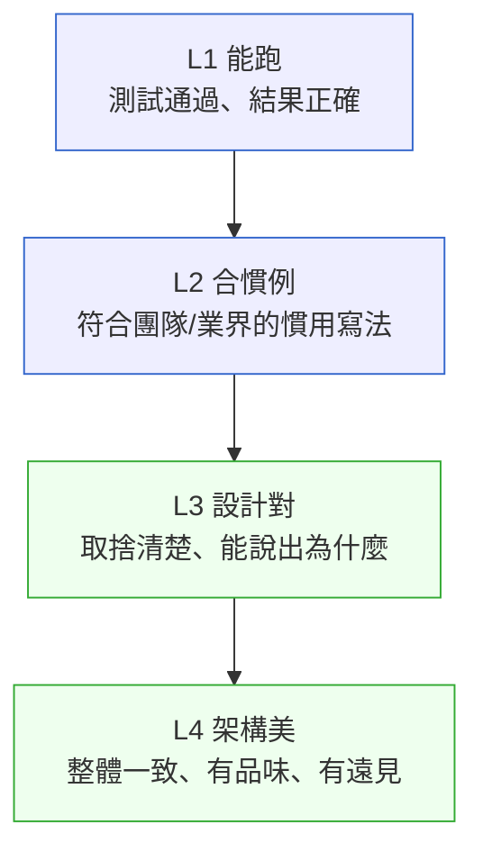

# 第 45 章｜判斷力的養成:當階梯被 AI 抽掉
## ⸺ L1 能跑、L2 合慣例、L3 設計對、L4 架構美——四層爬升,刻意練習

> **前置閱讀**:[第 41 章｜AI 時代的工程師心智與責任界線](../part-08-ai-era/ch-41-engineer-mindset-and-responsibility.md)、[第 27 章｜向下穿透抽象層](../part-06-operations/ch-27-penetrating-abstractions.md)
> **下游章節**:[第 46 章｜研發者的成長路徑](./ch-46-growth-path.md)

## 45.1 共感現場:它確實能跑,然後呢?

你可能也遇過這樣一個狀況。

我帶過一個剛工作不到一年的工程師,叫他小霖吧。他在一家多租戶 SaaS 公司 NovaDeskAI 做功能開發。有一次主管交給他一個任務:設計一套可以讓每個租戶自訂欄位的「彈性表單」模組。小霖把需求描述貼進 AI 助手,幾分鐘後,一份完整的資料庫 schema、API 設計和元件拆法就出來了。

他讀了一遍,大致看懂;照著架出原型,功能都能跑;Demo 給主管看,PM 也點頭了。於是他把實作推進了 main。

大約三週後,主管翻了他的 schema。沉默了一下,問:「你知道為什麼不該把所有租戶的自訂欄位值,全部存在同一張 EAV 表裡嗎?」

小霖說:「AI 說這樣最有彈性。」

主管沒有兇他。他只是說了一句話:「它確實有彈性,但你的查詢會隨租戶資料成長越來越慢,而且你的索引幾乎沒有用。你有沒有問過它,這個設計在十萬筆資料和兩百個租戶同時查詢的時候會怎樣?」

小霖沒有問過。其實,他甚至還不知道應該問什麼。

這個處境不是小霖的錯。它其實反映了一個這個時代很多人正在面對、卻少有人說清楚的事:**當 AI 幫你把東西做出來的速度,快過你學會判斷它的速度,你就在一條沒有扶手的路上前進。**

## 45.2 真正的問題:那條養成判斷力的階梯,不見了

我們把小霖的狀況慢慢拆開來看。

以前一個年輕工程師,是怎麼慢慢學會「這個 schema 設計有問題」的?他先是自己手寫了好幾個版本,寫慢了、寫錯了、被 review 打回來了、上線後撞牆了。那些「撞牆的過程」就是教育。他慢慢學會了為什麼 EAV(Entity-Attribute-Value)在查詢上會痛、為什麼複合索引的欄位順序很重要、為什麼彈性和效能之間有一道牆需要取捨。這些東西,是在「一遍一遍親手做、一次一次嘗到代價」的過程裡長出來的,不是讀文件讀出來的。

也就是說,**判斷力本來就是「產出」的副產品**。你寫得夠多、痛得夠多,判斷力才會浮出來。它從來不是獨立修煉的一門科目。

那麼問題來了——AI 大幅壓低了「產出」的成本。不到五分鐘,一份看起來相當完整的 schema 就擺在你面前。這件事當然是好的,但它同時帶走了一樣東西:**那段「你親手寫、被逼著想清楚的時間」**。那正是判斷力本來會在其中自然生長的那段空白。

於是出現了一個悖論:我們告訴年輕工程師,「AI 時代,判斷力比產出力更值錢」——這是對的。但我們沒有說清楚的是,判斷力過去正是靠著「產出」養出來的。AI 接手了產出,也一併抽掉了那條階梯。

這就是本章想認真面對的事:**判斷力的養成,在 AI 時代不再自動發生,它必須被刻意設計。**

### 判斷的四個層級

順著這個道理,我們就能把「判斷力」說得更具體一點。它不是一個整體,而是四個逐步爬升的層級:



下面這張表格詳細說明每個層級的判斷依據、養成刺激,以及新人在 AI 時代面臨的現況:

| 層級 | 判斷依據 | 養成刺激 | 新人現況 |
|------|---------|---------|---------|
| **L1 能跑** | 測試通過、執行結果 | 「跑不動」的當下回饋 | ✅ AI 給出的程式碼通常能過 |
| **L2 合慣例** | 讀現有程式碼、Code Review | 被 reviewer 指出「我們不這樣做」 | ✅ AI 有一定的慣例知識 |
| **L3 設計對** | 設計原理 + 取捨的親身代價 | 親手踩坑、帶著問題看理論 | ⬆ 這層最危險:AI 給得出答案,但不會讓你感受到「選錯了有多痛」 |
| **L4 架構美** | 大量系統的整體感、品味 | 時間 + 多個系統的對照 | ⬆ 終局,但 L3 沒養好就永遠到不了這 |

小霖的情況,停在 L1 和 L2 之間。他可以確認東西能跑,也可以讀懂 AI 給的慣例寫法,但 L3 的那扇門——「這個設計在真實條件下的取捨代價」——他還沒有嘗過。而且因為 AI 把結果交得太快,他連「需要問這個問題」這件事都還沒意識到。

## 45.3 一起做判斷:四個刻意設計的養成機制

正因為判斷力不再自動長出來,我們需要刻意設計它的養成環境。下面是四個可以實際操作的機制,不是高談闊論,而是可以從明天開始做的事。

### 機制一:把 Generate 當訓練,不是當生產

這個機制的核心想法是:**新人需要累積「親手做的時數」,就像飛行員需要手動飛行時數一樣。**

具體做法:在一個功能的開發初期,請新人先自己動手寫一個版本,哪怕只是 30 分鐘。不是要他寫得更好,而是要讓他先建立一個「我自己的想法是這樣」的基準。然後再讓他看 AI 的版本。

差別就在這裡:當你手上已經有了自己的版本,AI 的版本就不再是「答案」,而是「另一個方案」。你會自然開始比較:它哪裡和我不一樣?它做了什麼我沒想到的取捨?這個比較的過程,才是判斷力生長的土壤。

沒有先建立自己的基準,AI 的輸出就直接成為了你的輸出——你學到的是複製貼上,不是判斷。

### 機制二:主動拷問 AI,而不是照單全收

這個機制容易被誤解,所以我想說清楚一點。用 AI 學習不是問題,問題在於用什麼方式用。

照單全收是這樣的:「幫我設計一個彈性表單的 schema」→ 拿走用。

主動拷問是這樣的:「你給的這個 EAV 設計,在 200 個租戶、每個租戶 10 萬筆資料的情況下,查詢會怎樣?你有什麼替代方案?它們各自的取捨是什麼?」

後者的學習速度,其實可能比舊時代自己慢慢踩坑還快。因為你得到了「取捨的語言」——你知道這個選擇在什麼條件下成立、在什麼條件下會痛。這正是 L3 判斷力的核心。

差別全在於:**你是主動提問去拿取捨,還是被動接受結果。** AI 是一個可以被逼著說清楚理由的對象。善用這件事。

### 機制三:用現實當裁判

判斷力的問題在於它是「抽象的」——你不容易知道自己的判斷力到了哪個層級。所以我們需要找一把外在的尺,讓現實來告訴你答案。

最直接的做法:在任何技術選擇落定之後,主動問:「什麼情況會讓這個選擇出問題?」然後刻意去製造那個情況。

以小霖的案例為例:如果他在 Demo 後問「我能不能跑一個負載測試,模擬 100 個租戶同時查詢?」——那個測試就是現實裁判。測試結果會告訴他 EAV 在這個規模下的查詢時間,而那個數字,會比任何理論解說都更直接地刻進他的判斷裡。

從 L1 的「能跑」到 L3 的「設計對」,中間差的那一段,往往是「你有沒有主動去找那個讓你痛的現實」。

### 機制四:資深者的鷹架比以前更重要

自然階梯斷了,資深者的帶法必須改變。

以前的帶法可以很被動:等新人提問、等 Code Review 的時候說。這樣是有效的,因為新人在自己做的過程中會撞到問題,然後帶著問題來。

現在新人可能很久都撞不到問題——因為 AI 幫他繞過去了。所以資深者需要更主動地「製造問題」給新人撞:

- 定期做一對一的「技術拷問」:「你上週那個 schema,你能說清楚為什麼這樣設計嗎?如果改成另一種,有什麼不同?」
- Code Review 不只挑問題,更要問「為什麼」:「這裡你選 X 而不是 Y,是有什麼考量嗎?」讓新人練習說出取捨的語言。
- 帶他們做一次完整的負載測試或邊界分析,讓他們親眼看到數字。

這些事,以前靠環境「自動提供」;現在必須靠資深者「刻意創造」。如果組織認為「有 AI 了,junior 的活 AI 能做,不需要請太多新人」——那條斷掉的階梯就會越來越難修復,十年後資深工程師的斷層才是真正的代價。

這四個機制的共通點,是把「讓新人感受到設計代價」這件事,從靠環境偶然發生,變成由人刻意設計安排。它們都指向同一件事:在 AI 時代,判斷力必須被主動製造出來,不會自動長出來。

## 45.4 容易絆倒的地方

理解了四個機制之後,我們也來看看這條路上有哪些地方容易絆一跤。這些地方很多人都走過,說出來不是要責備誰,而是讓你下次遇到的時候有個底。

---

**絆倒處一:把「AI 說這樣設計最好」當成 L3 判斷**

這個絆倒最隱蔽,因為表面上看起來你有在「思考設計」。但 AI 說的「最好」是基於它的訓練分布,不是基於你系統的真實條件。

> **修正方向**:「AI 說最好」可以作為一個起點,但它不能當作終點。真正的 L3 判斷,需要你說得出「在我們系統的這個條件下,這個選擇的取捨是」——不是轉述 AI 的話,而是你自己用你們系統的現實驗證過的結論。

---

**絆倒處二:只在「能跑嗎」這個問題上花時間**

這是 L1 陷阱。功能做完了、測試過了、Demo 過了,大腦就想結案。但 L1 和 L3 之間,差的那兩層正是出事的地方。

> **修正方向**:養成一個簡單的習慣——功能做完的第一版,主動問一次「在最壞條件下呢?」不需要每次都跑完整的負載測試,但問出這個問題、試著想清楚答案,就是在往 L3 爬。

---

**絆倒處三:主管告訴你哪裡錯,你把問題改掉、卻不問為什麼**

這種模式讓你停在 L2——你學到了「這個團隊不這樣做」,但你不知道「為什麼不這樣做」。下次遇到稍微不同的情境,你就沒有判斷基準了。

> **修正方向**:每次 Code Review 收到修改意見,先改、再問:「你說這樣不好,是因為什麼具體的代價?這個代價在什麼條件下才會出現?」這兩個追問,能把 L2 的慣例知識推到 L3 的取捨理解。

---

**絆倒處四:被講了一遍就以為自己懂了,下次遇到新情境卻發現判斷力沒有真正遷移**

這個絆倒對新人來說很隱蔽。Code Review 被說了「EAV 在高查詢量下會慢」,你點頭、改了、關了 PR——但下次遇到另一個類似的設計問題,你發現自己還是不確定。因為 L3 的理解不是靠「聽懂一遍」就能轉移的,它需要你自己去感受那個「代價的重量」。

> **修正方向**:每次 Code Review 收到設計層面的意見,先改、再主動問自己一個問題:「我能不能造一個讓這個設計出問題的情境?」能造出來,代表你理解了取捨的條件,而不只是記住了結論。這個主動驗證的動作,才是讓 L3 理解真正落地的關鍵。

## 45.5 帶得走的工具 ⸺ 一頁式「判斷力層級自查表」

下面是一張空白的「判斷力層級自查表」。建議在以下三個時刻填表:(1)功能初版 Code Review 前;(2)上線前;(3)上線後兩週回顧。不需每次填完整四層,重點是 L3「什麼條件下會痛」這欄有沒有填出來——那一欄空著,就是最明確的警告訊號。

```text
判斷力層級自查表 ⸺ {技術決策 / 功能名稱}

【L1 能跑】
  - 驗證方式:{你怎麼確認的}
  - 有沒有自動化測試覆蓋:{是 / 否 / 部分}

【L2 合慣例】
  - 有沒有對照過團隊的現有寫法:{是 / 否}
  - Code Review 有沒有收到慣例相關的意見:{無 / 有,已理解原因 / 有,但只改了沒問}

【L3 設計對】
  - 你能說出這個設計在什麼條件下成立:{可以寫出來 / 說不太清楚}
  - 你能說出這個設計在什麼條件下會痛:{可以寫出來 / 還不確定}
  - 你有沒有主動製造過那個「讓它出問題的情境」:{有,結果是 / 沒有}

【L4 架構美(選填,需數月~數年累積)】
  - 這個決策在整個系統的大脈絡下一致嗎:{是 / 說不上來}
  - 三個月後接手的人讀得懂這個決策的理由嗎:{有留下說明 / 還沒}

【下一步】
  - 目前停在哪個層級:{L1 / L2 / L3 / L4}
  - 往下一層需要做的一件事:{具體行動}
```

這張表為什麼只有四個層、每層只有幾個問題?因為太複雜的表在忙的時候不會用。它的設計是讓你在做完一個決策的當下,花五分鐘過一遍,而不是等到事後才回頭審視。目標不是每次都要到 L4,而是**清楚地知道自己站在哪、下一步是什麼**。

### 45.5.1 範例:NovaDeskAI 彈性表單模組的事後自查

讓我們回到小霖的那個彈性表單案例。如果他在推進 main 之前,花五分鐘過這張表,事情很可能會在 L3 的第一個問題就停下來:

```text
判斷力層級自查表 ⸺ NovaDeskAI 彈性表單 Schema 設計

【L1 能跑】
  - 驗證方式:本機測試 3 個租戶、各 50 筆資料,增刪改查全部正常
  - 有沒有自動化測試覆蓋:有,單元測試 12 個

<!-- 為什麼這欄:L1 驗證通常最容易有,但它只代表「在小資料下能動」。
     寫下來的意義是讓你意識到這只是起點,後面還有 L2~L4。 -->

【L2 合慣例】
  - 有沒有對照過團隊的現有寫法:有,參考了同事的 tenant_config 模組
  - Code Review 有沒有收到慣例相關的意見:無(主管還沒看這塊)

【L3 設計對】
  - 你能說出這個設計在什麼條件下成立:能,EAV 在欄位動態且查詢頻率低時合理

<!-- 為什麼這欄:能說出「什麼條件下成立」是 L3 的入口。
     說不出來,代表你用的是 AI 給的答案,不是你自己理解的取捨。
     這個欄位空著,是一個明確的警告訊號。 -->

  - 你能說出這個設計在什麼條件下會痛:⚠️ 說不清楚

<!-- 為什麼這欄:這裡是真正的危險點。EAV 的代價在高查詢量 + 多租戶時才會出現。
     小霖用的是 AI 提供的設計,但他從未問過「在我們系統的最大租戶規模下會怎樣」。
     這個欄位一旦空白,就意味著 L3 還沒到,應該繼續往下查。 -->

  - 你有沒有主動製造過那個「讓它出問題的情境」:沒有
    → 應該做:用測試資料模擬 200 個租戶 × 10 萬筆,觀察查詢時間與索引命中率

【L4 架構美(選填)】
  - 這個決策在整個系統的大脈絡下一致嗎:說不上來
  - 三個月後接手的人讀得懂這個決策的理由嗎:還沒留說明

【下一步】
  - 目前停在哪個層級:介於 L2 和 L3 之間
  - 往下一層需要做的一件事:跑一次多租戶負載測試,把結果和主管討論後再決定要不要改設計
```

你看,不是什麼高深的問題。L3 的第二行「這個設計在什麼條件下會痛」一旦填不出來,就是一個清楚的訊號——去找那個痛,再繼續往下走。

小霖後來和主管一起跑了那個負載測試。查詢時間從 12ms 跳到 3.4 秒。他說:「那個數字我永遠記得。」那是他第一次真正感受到 L3 的重量。從那次之後,他每次做 schema 設計,都會先問自己:「在最大的那個租戶身上,這個查詢會怎樣?」這個問題,才是真的長進他判斷力裡的東西。

## 45.6 本章回顧

讀完這一章,你應該已經能:

- [ ] 說清楚判斷力的四個層級(L1~L4)分別在判斷什麼、養成刺激是什麼
- [ ] 理解「AI 抽掉自然階梯」這件事的具體機制:不是 AI 不好,而是它跳過了你原本需要痛一次才能學到的那段
- [ ] 用「四個養成機制」——把 Generate 當訓練、主動拷問 AI、用現實當裁判、資深者鷹架——描述如何刻意設計判斷力的養成環境
- [ ] 在做完任何技術決策後,用一頁式自查表確認自己目前停在哪個層級

如果想先從一件事開始,我會建議——**下一次做完一個技術選擇,先問自己「這個設計在什麼條件下會痛」**。不需要馬上跑測試,先能說出那個條件,就是往 L3 爬的第一步。能說清楚這件事,你已經和只停在 L1 的人拉開了距離。

## Cross-References

- **前一章**:[第 44 章｜接手 legacy 系統的 90 天計畫](./ch-44-legacy-system-90-days.md) ⸺ 接手時需要的正是 L3~L4 判斷力
- **下一章**:[第 46 章｜研發者的成長路徑](./ch-46-growth-path.md) ⸺ 判斷力的養成是成長路徑的核心軸線
- **強連結**:[第 1 章｜為什麼工程實作需要決策框架](../part-01-foundations/ch-01-why-engineering-decisions.md) ⸺ 本書的起點:「能跑」只是判斷的第一層
- **強連結**:[第 27 章｜向下穿透抽象層](../part-06-operations/ch-27-penetrating-abstractions.md) ⸺ broken ladder 的歷史先例,抽象層移除了「被逼著向下鑽」的養成時刻
- **強連結**:[第 37 章｜審查 AI 生成的程式碼](../part-08-ai-era/ch-37-reviewing-ai-code.md) ⸺ 機制二「主動拷問 AI」的操作細節在此展開
- **強連結**:[第 41 章｜AI 時代的工程師心智與責任界線](../part-08-ai-era/ch-41-engineer-mindset-and-responsibility.md) ⸺ 更廣的心智框架,本章是其具體落地
- **跨書連結**:SA/SD Playbook 的架構決策框架 ⸺ L4 架構美的判斷力與彼書高度互補
