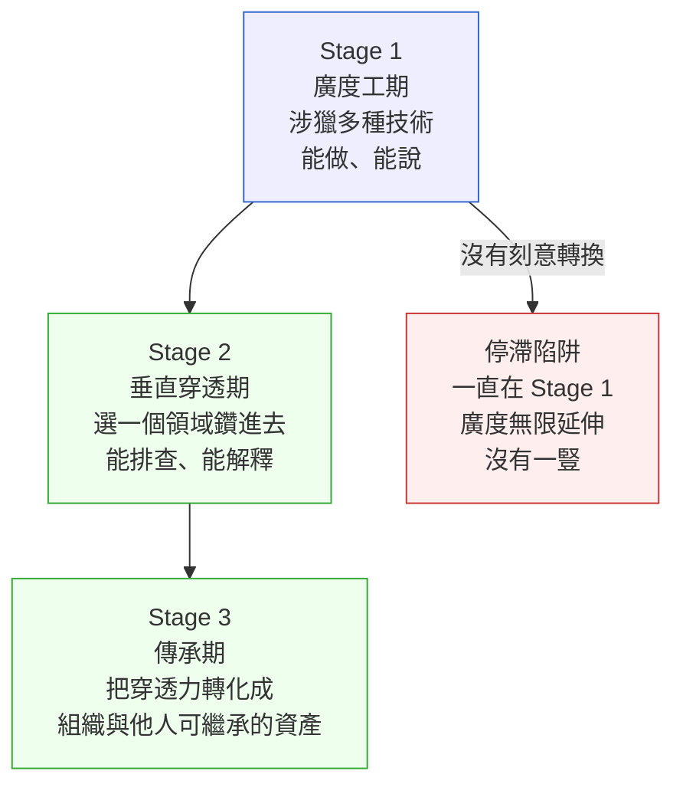

# 第 47 章｜研發者的成長路徑
## ⸺ 當 T 型不再是比喻,而是你對團隊的承諾

> **前置閱讀**:[第 46 章｜判斷力的養成](./ch-46-cultivating-judgment.md)

## 47.1 共感現場:那個「什麼都會一點」的工程師

你可能也遇過這樣的時刻。

一位叫做韋廷的工程師,在一家多租戶 SaaS 公司 Sealflow 工作了三年。他來過組內 Review 時聽起來都挺厲害:前端的 React 19 他懂一點,後端 FastAPI(Python 3.12)他寫過,CI 他會設,Docker 他能改——問他什麼,他都能給個答案。

可是有一天,Sealflow 的計費模組出現一個神秘的帳單差異問題:某些企業租戶每月的用量累計值,和帳單金額對不上。這種跨越三個系統——事件流(Apache Kafka 3.x)、計量服務、計費計算引擎——的問題,團隊找了兩個禮拜都沒解。主管把韋廷叫去說:「你對這幾塊都有經驗,你來看看。」

韋廷沉默了一下,說:「我可以試試,但說真的,每一塊我都只懂個大概。我知道 Kafka 能幹什麼,但我沒辦法告訴你訊息在這個場景下為什麼會漏。」

這句話說得很誠實。但也讓人想到一個問題:三年過去了,「都懂一點」和「懂透一塊」,到底差在哪裡?

這個場景的可貴之處,不在於韋廷能不能解這個 bug。在於他說的那句話點出了一條成長路徑上很常見的卡關:**廣度積累得很快,但深度一直停留在「能說出來」,沒有到「能排查進去」**。這不是他的錯,而是「沒有人告訴他,廣度和深度之間有一條本質不同的線」。

## 47.2 真正的問題:「涉獵過」和「穿透進去」之間的距離

我們把這件事慢慢拆開來看。

韋廷的問題,不是努力不夠,也不是見識太少。他的問題是:這三年的成長,大部分發生在**橫向——新技術、新工具、新語言**,但幾乎沒有一塊是**縱向的**——也就是,真的往一個系統的裡面鑽進去,鑽到你能解釋「為什麼這個在這個脈絡下這樣動、在那個脈絡下這樣壞」。

「涉獵過」和「穿透進去」是本質上不同的兩件事:

- **涉獵過**:你能描述這個技術的用途、說出常見的操作指令、對照教學文件做出一個 demo。
- **穿透進去**:你能在一個真實的、出了問題的系統裡,根據症狀建立假設、下探定位、把你對這個技術的內部機制理解,直接用在診斷上。

這兩者之間的距離,就是第 46 章說的**判斷力**——它不是讀書讀出來的,是在真實問題裡養出來的。

### 不同技術棧裡,「涉獵過」和「穿透進去」長什麼樣

這個差距不只在 Kafka 身上看得到。換幾個常見的技術棧來比較,差異會更清晰:

**資料庫(PostgreSQL 17)**

「涉獵過」的樣子:知道 `SELECT`、`JOIN`、`INDEX` 的基本用法,能寫出業務查詢,能看懂 EXPLAIN 的輸出格式。遇到慢查詢,會嘗試加索引。

「穿透進去」的樣子:能從 `pg_stat_activity` 判斷鎖等待的成因,知道 autovacuum 在大量 UPDATE 之後會搶佔 IO 資源(見第 28 章的 Finyuan 案例),能預測在哪種查詢形式下 planner 會選錯執行計畫——不是靠查文件,而是靠「這個機制在這個脈絡下的行為模型」。

**訊息佇列(Kafka)**

「涉獵過」的樣子:知道 topic、partition、consumer group、offset 這些概念,能跟著教學把一個基本的 producer/consumer 跑起來。知道有 at-least-once 和 exactly-once 兩種語義。

「穿透進去」的樣子:韋廷的那個問題正好在這裡——知道名詞,但不知道「commit 之前 crash、再重啟時 offset 從哪裡接回來」這件事在預設設定下會發生什麼。能夠回答:「如果 consumer 收到訊息、處理了,但在 commit 前程序死掉,這條訊息會不會被重複消費?那個訊息什麼情況下會被跳過?」

**快取層(Redis)**

「涉獵過」的樣子:知道 SET/GET、TTL,能把快取接進業務邏輯,能改 TTL 值。知道「快取雪崩」這個詞。

「穿透進去」的樣子:能解釋為什麼所有 key 用同一個 TTL 是危險的(見第 34 章的 CartNova 案例),能設計針對靜態欄位和動態欄位的分層失效策略,遇到快取不一致時能建立假設、縮小定位範圍——不是重啟 Redis 祈禱。

也就是說,**廣度讓你看到更多可能的技術工具;但深度才讓你在真實的困難裡發揮效用**。一個工程師如果只有廣度,在平常的開發任務裡會很自如,因為平常的任務就是「選個工具、照著用」;但一旦遇到跨系統的疑難問題,廣度就找不到下腳點,而深度才是那把鑰匙。

這就是「T 型工程師」這個說法真正的意思——它不是要你「橫的會很多、豎的也稍微懂」,而是說:**T 的那一豎,是你對這個系統和這個領域真正的穿透力**,是你能為團隊帶來別人帶不來的那個東西。

順著這個道理,問題就變成了:那一豎,怎麼長出來?

## 47.3 一起做判斷:成長路徑的三個階段

我想和你分享一個很樸素的視角。它不是什麼大框架,而是從很多工程師的路徑裡整理出來的一個規律:**深度,不是靠「多讀那個技術的文件」長出來的;而是靠「在你最熟的那個系統裡,一次次真的被逼進去」長出來的**。

一個有意識的成長路徑,大致走三個階段:



**Stage 1 廣度工期**:剛入行的頭一、兩年,廣度是最需要建立的東西。你需要知道這個行業的地圖長什麼樣——哪些技術存在、各自解決什麼問題、常見的術語和慣例是什麼。這個階段做廣度是對的,不是浪費時間。韋廷在 Sealflow 最初的一年,正是這樣度過的:把 React、FastAPI、Kafka、Docker 都摸了一遍,知道它們各自能做什麼、基本怎麼用。那段時間打下來的地圖,是後來所有判斷的基礎。

**Stage 1 建立的是地圖,但光有地圖走不進去**。地圖告訴你「Kafka 在那個方向」,但不告訴你「進了 Kafka 之後,在這個特定的失敗場景裡,offset 的行為是什麼」。那就是 Stage 2 開始的地方。

**Stage 2 垂直穿透期**:大概在你工作一到三年之後,有意識地選一個領域,讓自己在那個領域「被逼進去」。「被逼進去」的意思是:接那個領域最難的 bug、做那個領域裡跨系統的整合、在那個領域主動閱讀原始碼而不只是文件。這個過程不是為了「成為專家」,而是讓你的系統理解從「能用它」升級到「能解釋它在這個脈絡下的行為」。

Stage 2 的關鍵,不是「讀更多書」,而是**主動去找能讓你被逼進去的場景**。正如前面韋廷在 Stanley 引導下經歷的帳單問題一樣,他全程把每一步的「為什麼」都問清楚——那不是圍觀,而是他第一次真正進入因果模型的機會。不是每個人都能靠自己「頓悟」,但每個人都能靠「在對的問題旁邊待著、主動問」來累積。

以下是幾個工程師進入 Stage 2 的真實路徑形態,供你對照:

| 觸發場景 | 進入方式 | 長出來的穿透點 |
|---------|---------|-------------|
| On-call 遇到自己跑不通的 production 事故 | 拉著資深工程師一起定位,問每一個「為什麼這樣判斷」 | 那個系統在失敗情境下的行為模型 |
| 接手前任留下的跨系統整合 bug | 不能直接問前任,只能從程式碼和 log 逆向推理 | 兩個系統邊界上的契約假設與隱含依賴 |
| 主動認領「沒有人想碰」的模組 | 因為沒有人可以問,只能自己閱讀原始碼和 RFC | 該技術在設計意圖層的限制與取捨 |
| 做一個需要打穿兩個系統的新功能 | 設計階段就必須理解兩邊的邊界語義 | 跨系統資料一致性的保證邊界 |

**Stage 2 穿透力長出來之後,最自然的下一步就是傳出去**——不是因為這樣「比較高尚」,而是因為留在腦子裡的知識有個根本的脆弱性:只要你不在,那段知識就消失了。這就帶出了 Stage 3。

**Stage 3 傳承期**:穿透力長出來之後,最有影響力的事,是讓它成為組織的資產——不是藏在你腦子裡的私有知識。這包括:把你的排查思路寫成可重複使用的 runbook、帶後進的人在真實問題裡走一遍你的思路、建立讓團隊共同「往下鑽」的文化。

Stage 3 沒有「做完」的終點。它是一個持續的姿態:每次解完一個困難問題,就想「這個解法能讓下一個人也用嗎」。

Stage 2 之所以需要「刻意」轉換時間分配,是因為如果不主動騰出深耕的時間,廣度會無限延伸下去——永遠有新技術可以摸一遍,而穿透力永遠長不出來。下面這張表可以幫你判斷,現在的自己大概在哪個階段:

| 指標 | Stage 1 廣度工期 | Stage 2 垂直穿透期 | Stage 3 傳承期 |
|------|----------------|--------------------|--------------|
| 遇到新技術 | 很有興趣,馬上 spike | 會先想「它和我懂的那塊有什麼關係」 | 能預測新技術在現有架構裡的折衝點 |
| 遇到跨系統 bug | 找比你熟的人 | 能建假設、往下定位 | 帶人走一遍定位流程,解釋每步為什麼 |
| On-call 時 | 靠文件/搜尋 | 靠因果模型快速縮小搜尋空間 | runbook 是你寫的 |
| 知識的形式 | 「我用過這個」 | 「我能解釋它在這個場景下的行為」 | 「這個能讓下一個人也會」 |
| 時間分配 | 廣度 > 深度 | 深度 > 廣度(刻意) | 培育他人 > 自我精進 |

這張表沒有要評判哪個階段好或壞——每個階段在它的時間點都是對的。它要幫你做的,是讓你能**清楚看到自己在哪裡,以及下一步的刻意方向**。

那麼問題來了——如果你現在是韋廷,你怎麼知道要把「那一豎」插在哪裡?

一個好用的判準是:選一個你**現在最痛的那個交接點**。工程師的工作裡,最難搞的問題,往往都卡在兩個系統之間——或者說,卡在「我的部分」和「不是我的部分」之間。那個卡點,就是穿透力最值得長出來的地方。

因為最痛的交接點往往也是目前團隊最常卡住、最影響產品穩定性的地方。對韋廷來說,那個卡點是計費計算引擎和事件流之間的訊息語義。那裡是最痛的,也是最值得他鑽進去的地方。

## 47.4 容易絆倒的地方

這裡的地雷,很多工程師都走過一遍。分享出來不是要你避開,而是希望你走到這一步的時候,心裡有個底。

**絆倒處一:廣度無限延伸,遲遲不轉換。**

一直在 Stage 1 是很舒服的狀態,因為每次學新東西都有進步感——新技術、新框架、新工具,每週都有可以寫在履歷上的東西。可是這種進步感有一個隱性成本:每個新技術都停在「能說、能用的層次」,而「能真正解決困難問題的穿透力」一直沒有長。

三年後,廣度可能變成二十個技術都會一點點,但遇到任何一個系統的複雜行為都還是要問別人——這不是技術能力的問題,而是成長路徑的問題。

> 修正方向:給自己一個明確的訊號——當你發現組內有跨系統的疑難問題、你卻只能在旁邊看著更資深的人解,那就是訊號了。不是要你現在就能解,而是要你**在那個問題旁邊待著、看著、問著**,那才是穿透力的土壤。

**絆倒處二:以為「讀完文件」等於「學會了」。**

文件讀完、教學做完,很容易產生一種「這個我懂了」的感覺。可是文件只描述正常路徑——它不描述「在你們這個系統的特定脈絡下,這個工具在邊界條件上的行為」。那個只能在真實問題裡看到。

Kafka 的官方文件清楚解釋了 at-least-once 語義的定義,但不會告訴你:在你的計量服務這個特定的 consumer 設定下,消費到一半 crash 再重啟時,重複消費的訊息會在計費計算裡造成什麼影響,以及你的冪等設計有沒有擋住這個洞。那個「特定脈絡下的行為」,只有在實際的系統裡才能看見。

> 修正方向:每次學一個新工具,刻意去找「這個工具最常在什麼情況下讓人踩到坑」,比讀功能列表更有價值。Stack Overflow 的問題、GitHub Issues、Postmortem——那些才是「穿透層」的入口。比如找一個你常用技術(如 Kafka)的 GitHub Issue,看看別人踩過什麼坑、在什麼條件下觸發,然後問自己「在我們的系統裡,這個坑會長什麼樣」——這樣讀 Issue 才變成了穿透力的投資。把「讀完文件」和「在真實系統裡設計一個能觸發邊界行為的測試」看作兩件不同的事。

**絆倒處三:穿透力長出來之後,沒有傳出去。**

這個地雷比較隱性。工程師在某個領域鑽到很深之後,有時候會不自覺地變成一個「知識孤島」——只有他能解那一塊,別人問不進去,他也沒有意識到這樣會造成組織的脆弱性。比如某個工程師把 Kafka 消費端的所有問題都攬在自己身上,每次別人問他就自己除錯而不是帶著人一起想,也不寫 runbook,那他就逐漸變成了知識孤島。

這種情況對個人而言短期看起來是「不可替代性」,但對組織而言是一個風險點:這個工程師一出差、一請假、一離職,這塊知識就斷了。而且對這個工程師自己也有一個隱性成本——所有相關的問題都要等他,他永遠沒辦法真正轉移注意力到下一件事。

> 修正方向:穿透力最大的複利,不是你自己用它一次解一個問題,而是讓它進入團隊的集體能力——runbook、配對除錯、架構說明文件。**你腦子裡的地圖,只要你還在就是資產;你寫下來的地圖,在你休假的時候也是資產。**

**絆倒處四:用「忙」當作不轉換的理由。**

這個地雷很多人都踩過,但不容易說清楚。Stage 1 的工程師通常都很忙——業務需求多、迭代快、每天的待辦事項都排滿了。很容易把「往下鑽」這件事一直放到「等有空的時候再說」。

問題是,那個「有空的時候」很少真的到來。功能開發的節奏不會主動讓出時間讓你深耕。更重要的是,深耕一個系統需要連貫的思維投入——你需要在腦子裡建立完整的因果模型,而這樣的心流狀態不是三十分鐘零碎時間能達成的。深度的成長,必須主動騰出來。

> 修正方向:不是要你另外找一個「深耕週」——而是要你**把深耕的機會嵌進平常的工作裡**。下次 on-call 時,把每一步的排查過程記下來,問自己「這一步為什麼是這樣判斷的」。下次做跨系統的整合,多花半天閱讀對方服務的核心邏輯而不只是 API 文件。這些不需要額外的時間塊,但長期累積下來,穿透力的質地就不一樣了。

## 47.5 帶得走的工具 ⸺ 一頁式「個人成長路徑圖」

下面這個模板,用來幫你把「我現在在哪、我要往哪裡長」具體化。一頁剛好——太長就會變成規劃文件,反而不會真的用它來行動。

```text
個人成長路徑圖 ⸺ {你的名字} / {填寫日期}

【現在的廣度地圖】
- 我現在「涉獵過」的技術/領域:
  - {技術 A}:程度 = {能說 / 能用 / 能排查 / 能解釋脈絡}
  - {技術 B}:程度 = {能說 / 能用 / 能排查 / 能解釋脈絡}
  - {技術 C}:程度 = {能說 / 能用 / 能排查 / 能解釋脈絡}

【現在的穿透點】
- 我能在真實問題裡「往下鑽」的是:{填或「還沒有」}
- 我上次「被逼進去解決難問題」是:{簡述那個問題}

【最痛的交接點(最值得穿透的地方)】
- 現在組內最常卡住的跨系統點是:{描述它}
- 我在那個交接點的現況程度:{能說 / 能用 / 能排查 / 能解釋脈絡}

【下一步的刻意方向】
- Stage 判斷:我現在大概在 {Stage 1 / Stage 2 / Stage 3}
- 下季要刻意做的一件事:{具體行動,不是「學更多」這種}
- 我願意把穿透力傳出去的形式:{runbook / 配對除錯 / 說明文件 / 內部分享}

【三個月後的自我核對】
- 上面說的那一件事,做了嗎?{是 / 部分 / 還沒}
- 和三個月前比,那個交接點的程度有沒有移動?{有 / 沒有}
```

這個模板只有五個區塊,填起來大概二十到三十分鐘。欄位刻意設計成「現況描述」而不是「目標宣言」——因為成長路徑最怕的不是目標不夠大,而是**對現在在哪裡看不清楚**。

### 47.5.1 範例:韋廷在那個帳單問題之後,寫的那張圖

讓我們回到韋廷。帳單問題最後由一位資深工程師 Stanley 花了三天定位出來——是 Kafka 消費端的 offset commit 策略在特定失敗情境下沒有回溯,導致計量事件被跳過。韋廷全程在旁邊看著、問著。那三天結束之後,他寫了這張圖:

```text
個人成長路徑圖 ⸺ 韋廷 / 2026-03-15

【現在的廣度地圖】
- React 19 前端:程度 = 能用(元件、狀態管理能做)
- FastAPI(Python 3.12):程度 = 能用(CRUD、依賴注入能做)
- Kafka 3.x:程度 = 能說(知道 topic/offset/consumer group 是什麼,
               但 commit 語義在失敗情境的行為還不懂)
  <!-- 「程度」四個選項有順序:能說→能用→能排查→能解釋脈絡。
       韋廷的 Kafka 停在「能說」,問題就很清楚:他缺的是失敗情境的因果模型。 -->
- Docker/CI:程度 = 能用

【現在的穿透點】
- 我能在真實問題裡「往下鑽」的是:還沒有。每次遇到跨系統的問題都要找別人。
- 我上次「被逼進去解決難問題」是:三天前,全程陪同 Stanley 定位 Kafka offset 問題。
  沒有我自己解,但我把每個排查步驟都問清楚了。
  <!-- 「被逼進去」不一定是自己解掉。主動問每一步的「為什麼」,也是累積因果模型的方式。 -->

【最痛的交接點(最值得穿透的地方)】
- 現在組內最常卡住的跨系統點是:Kafka 消費端語義 ↔ 計量服務的計數一致性
- 我在那個交接點的現況程度:能說(大概知道有 at-least-once/exactly-once 這些概念)

【下一步的刻意方向】
- Stage 判斷:我現在在 Stage 1,準備刻意轉 Stage 2
- 下季要刻意做的一件事:在 Kafka 消費端加一套整合測試,覆蓋「消費到一半 crash」的場景,
  讓自己在受控環境裡親眼看到 offset 的行為
  <!-- 「下一步」要夠具體:「讓測試跑起來、讓失敗場景可重現」是具體行動;「更了解 Kafka」不算。 -->
- 我願意把穿透力傳出去的形式:三個月後,如果整合測試做完了,
  我來主持一次「Kafka 失敗場景實作筆記」的內部分享

【三個月後的自我核對】
- 上面說的那一件事,做了嗎?— (待填)
- 和三個月前比,那個交接點的程度有沒有移動?— (待填)
```

這張圖最重要的地方,不是韋廷寫了什麼「目標」,而是他**把現況看清楚了**——Kafka 在他的廣度地圖裡停在「能說」,而那個最痛的交接點正好在那裡。方向就從那裡長出來了。

三個月後,如果那份整合測試做完了,韋廷在 Kafka 消費端失敗語義上的程度,就會從「能說」移動到「能排查」——那就是他的那一豎,開始往下長了。

## 47.6 本章回顧

讀完這一章,你應該已經能:

- [ ] 說清楚「廣度」和「深度」在工程師的實際工作裡,解決的是哪兩類不同的問題
- [ ] 用具體的技術棧例子(Kafka、PostgreSQL、Redis)辨認「涉獵過」和「穿透進去」的差異
- [ ] 判斷自己現在大概在成長路徑的哪個階段(Stage 1/2/3)
- [ ] 找到現在組內「最痛的交接點」,把它當成穿透力值得長出來的地方
- [ ] 用一頁成長路徑圖,把「現況」和「下一步的刻意行動」具體化
- [ ] 理解穿透力在傳承給他人之後,才能從個人資產變成組織資產

如果想先從一件事開始,可以試試這個:**填一張現在的廣度地圖,老實標上每個技術的「能說/能用/能排查/能解釋脈絡」**,因為看清楚現況,比設定目標更重要;很多人的成長之所以停在原地,不是因為目標不夠大,而是因為從來沒有認真問過「我現在真的在哪裡」。

你已經讀完了這本書的全部章節。從第一章「交付前的四問」到這裡,這條路走下來,不是為了讓你記住所有的框架和工具——而是希望在下一次你遇到困難、遇到不知道怎麼下手的問題時,有一個習慣:先想「我的因果模型對嗎」、再問「我的假設能被驗證嗎」、最後說「我學到的這一點,能讓下一個人少走彎路嗎」。

那三個問題,就是一個工程師能一直成長、一直有價值的核心。

## Cross-References

- **上一章**:[第 46 章｜判斷力的養成](./ch-46-cultivating-judgment.md) ⸺ 本章是第 46 章的延續,從「判斷力怎麼養成」到「把它放進整個成長路徑」
- **強連結**:[第 28 章｜向下穿透抽象層](../part-06-operations/ch-28-penetrating-abstraction.md) ⸺ 垂直穿透力的核心技術場景(本章 §47.2 PostgreSQL 案例的技術底層)
- **強連結**:[第 1 章｜為什麼工程實作需要決策框架](../part-01-foundations/ch-01-why-engineering-decisions.md) ⸺ 全書起點,從交付前四問到成長路徑的首尾呼應
- **參考**:[第 34 章｜快取設計與失效策略](../part-07-performance/ch-34-caching.md) ⸺ §47.2 Redis 穿透層案例的原始場景(CartNova)
- **跨書連結**:[SA/SD Playbook Part IX ⸺ Human Engineer](https://github.com/EddyKuo/sa-sd-playbook) ⸺ 與本章「傳承期」對應的系統分析師成長觀
